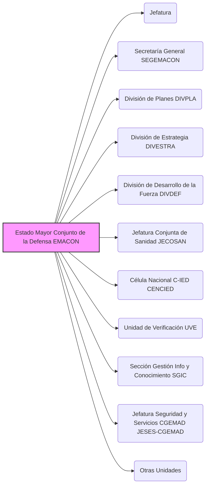

---
{"dg-publish":true,"permalink":"/opo-melilla/bloque-1/notas-tema-6-emad/emacon/"}
---

# Estado Mayor Conjunto de la Defensa (EMACON)

El **Estado Mayor Conjunto de la Defensa (EMACON)** es un **componente fundamental del [[OpoMelilla/BLOQUE 1/Notas Tema 6. EMAD/CGEMAD\|Cuartel General del Estado Mayor de la Defensa]]**, y se define en el [[Artículo 3. El Estado Mayor Conjunto de la Defensa\|Artículo 3]] de la [[Orden DEF/710/2020, de 27 de julio\|Orden DEF/710/2020]].

**Rol y Función Principal del EMACON:**

El EMACON es el **órgano *auxiliar de mando* principal del [[OpoMelilla/BLOQUE 1/Notas Tema 6. EMAD/JEMAD\|Jefe de Estado Mayor de la Defensa]]**. Su función primordial es **apoyar y asesorar al JEMAD** en el ejercicio de sus complejas responsabilidades, abarcando un amplio espectro de áreas clave para la eficacia operativa conjunta de las Fuerzas Armadas (FAS).

En esencia, el EMACON es el **cerebro estratégico y operativo** dentro del [[OpoMelilla/BLOQUE 1/Notas Tema 6. EMAD/CGEMAD\|Cuartel General del EMAD]],  proporcionando al JEMAD el **análisis, planeamiento, coordinación y seguimiento** necesarios para la dirección de las operaciones militares y el desarrollo de las capacidades de las FAS.  Actúa como el **principal *coordinador* de las actividades generales del [[OpoMelilla/BLOQUE 1/Notas Tema 6. EMAD/EMAD\|EMAD]]**.

**Responsabilidades Clave del EMACON (según el Artículo 3 de la Orden DEF/710/2020):**

El EMACON apoya y asesora al JEMAD en las siguientes áreas principales:

*   **Definición de la Estrategia Militar:**  Contribuye a la elaboración y desarrollo de la estrategia militar conjunta de las FAS.
*   **Planeamiento Militar:**  Responsable del planeamiento militar conjunto, incluyendo el planeamiento de fuerza y su integración en el planeamiento de defensa.
*   **Planeamiento y Conducción Estratégica de Operaciones:**  Apoya al JEMAD en el planeamiento y la conducción estratégica de las operaciones militares.
*   **Asegurar la Eficacia Operativa de las FAS:**  Realiza acciones para asegurar la eficacia operativa de las FAS, coordinando esfuerzos y capacidades.
*   **Representación Militar ante OISD:**  Ejerce la representación militar del JEMAD ante **Organizaciones Internacionales de Seguridad y Defensa (OISD)**.
*   **Coordinación General del EMAD:**  Actúa como el principal coordinador de las actividades generales del [[OpoMelilla/BLOQUE 1/Notas Tema 6. EMAD/EMAD\|EMAD]].

**Estructura del EMACON (Componentes Principales - Artículo 3.2):**

El EMACON se articula en las siguientes Jefaturas, Divisiones y Secciones:

*   Jefatura (liderada por el Jefe del EMACON - JEMACON)
*   [[OpoMelilla/BLOQUE 1/Notas Tema 6. EMAD/EMACON#SEGEMACON\|Secretaría General del EMACON (SEGEMACON)]]
*   [[OpoMelilla/BLOQUE 1/Notas Tema 6. EMAD/EMACON#DIVPLA\|División de Planes (DIVPLA)]]
*   [[OpoMelilla/BLOQUE 1/Notas Tema 6. EMAD/EMACON#DIVESTRA\|División de Estrategia (DIVESTRA)]]
*   [[OpoMelilla/BLOQUE 1/Notas Tema 6. EMAD/EMACON#DIVDEF\|División de Desarrollo de la Fuerza (DIVDEF)]]
*   [[OpoMelilla/BLOQUE 1/Notas Tema 6. EMAD/EMACON#JECOSAN\|Jefatura Conjunta de Sanidad (JECOSAN)]]
*   [[OpoMelilla/BLOQUE 1/Notas Tema 6. EMAD/EMACON#CENCIED\|Célula Nacional Contra Artefactos Explosivos Improvisados (CENCIED)]]
*   [[OpoMelilla/BLOQUE 1/Notas Tema 6. EMAD/EMACON#UVE\|Unidad de Verificación (UVE)]]
*   [[OpoMelilla/BLOQUE 1/Notas Tema 6. EMAD/EMACON#SGIC\|Sección de Gestión de la Información y del Conocimiento (SGIC)]]
*   [[OpoMelilla/BLOQUE 1/Notas Tema 6. EMAD/EMACON#JESES-CGEMAD\|Jefatura de Seguridad y Servicios del CGEMAD (JESES-CGEMAD)]]
*   Otras unidades que se determinen.

**(Secciones detalladas más abajo)**

**Importancia del EMACON:**

El EMACON es **absolutamente esencial para el funcionamiento del [[OpoMelilla/BLOQUE 1/Notas Tema 6. EMAD/EMAD\|Estado Mayor de la Defensa]] y para la capacidad del [[OpoMelilla/BLOQUE 1/Notas Tema 6. EMAD/JEMAD\|Jefe de Estado Mayor de la Defensa]] de ejercer su mando**.  Actúa como su **principal *staff* o estado mayor**,  proporcionando la capacidad de **planificar, coordinar y dirigir** las complejas actividades de las FAS en el ámbito conjunto.  Sin un EMACON eficaz,  el JEMAD no podría llevar a cabo sus responsabilidades de manera efectiva.  Es el **corazón operativo y de planeamiento** del EMAD.

**Referencia Legal Principal:**

*   [[Orden DEF/710/2020, de 27 de julio\|Orden DEF/710/2020]], Artículo 3 (El Estado Mayor Conjunto de la Defensa)
*   [[Real Decreto 521/2020, de 19 de mayo\|Real Decreto 521/2020, de 19 de mayo]] (marco general de la organización de las Fuerzas Armadas)
*   [[Ley Orgánica 5/2005, de 17 de noviembre, de la Defensa Nacional (LODN)\|Ley Orgánica 5/2005, de 17 de noviembre, de la Defensa Nacional (LODN)]] (marco legal general de las FAS y el JEMAD)

---

### Componentes Principales del EMACON (Detalle):

#### Secretaría General del EMACON (SEGEMACON) [[OpoMelilla/BLOQUE 1/Notas Tema 6. EMAD/EMACON#SEGEMACON\|#SEGEMACON]]

*   Apoya y auxilia directamente al Jefe del EMACON (JEMACON) en la dirección del EMACON.
*   Proporciona apoyo técnico-administrativo a los órganos del [[OpoMelilla/BLOQUE 1/Notas Tema 6. EMAD/CGEMAD\|Cuartel General del EMAD]] para la coordinación de sus actividades.
*   Asesora y apoya en asuntos generales del EMACON no específicos de otras unidades.

#### División de Planes (DIVPLA) [[OpoMelilla/BLOQUE 1/Notas Tema 6. EMAD/EMACON#DIVPLA\|#DIVPLA]]

*   Responsable del **planeamiento de Fuerza** y su integración en el planeamiento de defensa.
*   Desarrolla cometidos relacionados con la **obtención de recursos materiales** en los que el [[OpoMelilla/BLOQUE 1/Notas Tema 6. EMAD/JEMAD\|JEMAD]] es competente.
*   Impulsa la **transformación de las capacidades militares** de las FAS.
*   Elabora la **postura de las FAS ante las OISD en el ámbito logístico** y ejerce la representación del JEMAD en planeamiento militar ante estas organizaciones.

#### División de Estrategia (DIVESTRA) [[OpoMelilla/BLOQUE 1/Notas Tema 6. EMAD/EMACON#DIVESTRA\|#DIVESTRA]]

*   Responsable de elaborar y desarrollar la **estrategia militar** contenida en el concepto de empleo de las FAS.
*   Coordina la postura y representa a las FAS en las **OISD** en el ámbito estratégico.
*   Planifica la **participación española en unidades en el extranjero** dependientes del [[OpoMelilla/BLOQUE 1/Notas Tema 6. EMAD/JEMAD\|JEMAD]].
*   Planea, coordina y controla las **relaciones militares bilaterales y multilaterales** que competen al JEMAD.
*   Apoya al JEMAD en el **planeamiento, conducción y seguimiento estratégico de operaciones militares**.
*   Apoya al JEMAD en la dirección y control de la **comunicación estratégica** en el ámbito del [[OpoMelilla/BLOQUE 1/Notas Tema 6. EMAD/EMAD\|EMAD]].

#### División de Desarrollo de la Fuerza (DIVDEF) [[OpoMelilla/BLOQUE 1/Notas Tema 6. EMAD/EMACON#DIVDEF\|#DIVDEF]]

*   Lidera el **proceso transversal de Desarrollo de la Fuerza**,  comprendiendo preparación, interoperabilidad y orientación de la preparación conjunta.
*   Lidera el proceso de **prospectiva**, definiendo el marco estratégico militar.
*   Impulsa y dirige el desarrollo y experimentación de **nuevos conceptos**.
*   Promueve y coordina el estudio y desarrollo de la **doctrina conjunta y combinada**.
*   Promueve y coordina el proceso conjunto de **lecciones aprendidas y mejores prácticas**.

#### Jefatura Conjunta de Sanidad (JECOSAN) [[OpoMelilla/BLOQUE 1/Notas Tema 6. EMAD/EMACON#JECOSAN\|#JECOSAN]]

*   Responsable de dirigir y coordinar los aspectos relacionados con la **sanidad operativa** en el ámbito de sus competencias.
*   Imparte directrices para la preparación y empleo de las **capacidades sanitarias operativas**.
*   Participa en el desarrollo de normas de acción conjunta en el ámbito sanitario.

#### Célula Nacional Contra Artefactos Explosivos Improvisados (CENCIED) [[OpoMelilla/BLOQUE 1/Notas Tema 6. EMAD/EMACON#CENCIED\|#CENCIED]]

*   Impulsa y coordina el desarrollo de la capacidad de **lucha Contra Artefactos Explosivos Improvisados (C-IED)** en las FAS.
*   Representa la postura de las FAS ante las **OISD** en el ámbito C-IED.
*   Apoya en el planeamiento y conducción de operaciones militares en el ámbito C-IED.
*   Enlace nacional del **Centro de Excelencia Contra Artefactos Explosivos Improvisados (CoE C-IED)**.

#### Unidad de Verificación (UVE) [[OpoMelilla/BLOQUE 1/Notas Tema 6. EMAD/EMACON#UVE\|#UVE]]

*   Planea, coordina, controla y ejecuta las actividades de las FAS derivadas de **compromisos internacionales** relacionados con desarme, control de armamentos, medidas de confianza y seguridad, y verificación de su cumplimiento por otros Estados.

#### Sección de Gestión de la Información y del Conocimiento (SGIC) [[OpoMelilla/BLOQUE 1/Notas Tema 6. EMAD/EMACON#SGIC\|#SGIC]]

*   Identifica y mantiene actualizados los principales **procesos funcionales y operativos** del [[OpoMelilla/BLOQUE 1/Notas Tema 6. EMAD/EMAD\|EMAD]].
*   Planea y desarrolla la estructura de **Gestión de la Información y del Conocimiento** en el ámbito del EMAD.
*   Propone medidas de coordinación de procesos troncales transversales.

#### Jefatura de Seguridad y Servicios del CGEMAD (JESES-CGEMAD) [[OpoMelilla/BLOQUE 1/Notas Tema 6. EMAD/EMACON#JESES-CGEMAD\|#JESES-CGEMAD]]

*   Responsable del **mantenimiento de las instalaciones** del [[OpoMelilla/BLOQUE 1/Notas Tema 6. EMAD/CGEMAD\|CGEMAD]].
*   Apoya en materia de vida y funcionamiento al CGEMAD y unidades dependientes del [[OpoMelilla/BLOQUE 1/Notas Tema 6. EMAD/JEMAD\|JEMAD]].
*   Organiza y dirige la **seguridad** del personal y las dependencias del CGEMAD.
*   Lleva a cabo gestiones en materia **medioambiental, eficiencia energética y prevención de riesgos laborales** en el CGEMAD.
