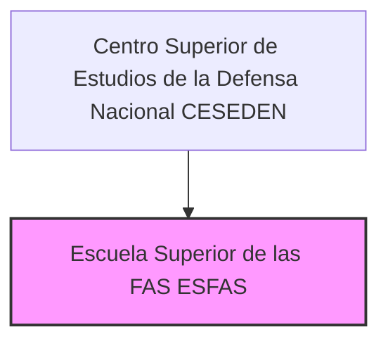

---
{"dg-publish":true,"permalink":"/opo-melilla/bloque-1/notas-tema-6-emad/esfas/"}
---

# Escuela Superior de las Fuerzas Armadas (ESFAS)

La **Escuela Superior de las Fuerzas Armadas (ESFAS)** es un **componente central del [[OpoMelilla/BLOQUE 1/Notas Tema 6. EMAD/CESEDEN\|Centro Superior de Estudios de la Defensa Nacional]]**,  y se describe en el [[Artículo 10. El Centro Superior de Estudios de la Defensa Nacional\|Artículo 10.6]] de la [[Orden DEF/710/2020, de 27 de julio\|Orden DEF/710/2020]].

**Rol y Función Principal de la ESFAS:**

La función principal de la ESFAS es **impartir *enseñanza militar de Altos Estudios de la Defensa Nacional***.  Es el **centro docente militar de *referencia* para la formación de los *más altos mandos* de las Fuerzas Armadas (FAS) de España**,  así como para personal civil que aspire a puestos de responsabilidad en el ámbito de la defensa.

En esencia, la ESFAS es responsable de **formar a los *líderes* militares y civiles del futuro** en materia de defensa,  proporcionándoles los conocimientos, habilidades y competencias necesarias para el **desempeño de *cometidos de oficial general* y de *alta gestión* en las FAS**.  Es el **corazón *docente* del [[OpoMelilla/BLOQUE 1/Notas Tema 6. EMAD/CESEDEN\|CESEDEN]]**.

**Responsabilidades Clave de la ESFAS (según el Artículo 10.6 de la Orden DEF/710/2020):**

*   **Cursos de Actualización para el Desempeño de Cometidos de Oficial General:**  Imparte **cursos de *actualización*** para preparar a los oficiales superiores para el **desempeño de los cometidos propios de los oficiales generales** (los empleos más altos en la jerarquía militar).
*   **Cursos para la Obtención del Diploma de Estado Mayor:**  Ofrece los **cursos necesarios para la obtención del *Diploma de Estado Mayor***,  una titulación fundamental para el desarrollo de la carrera militar y para el desempeño de puestos de *estado mayor* y *planeamiento* en las FAS.
*   **Cursos de Alta Gestión de las FAS:**  Imparte **cursos de *alta gestión* de las FAS**,  dirigidos a preparar a los alumnos para el desempeño de puestos de **responsabilidad en la gestión de recursos, la administración y la dirección** dentro de las Fuerzas Armadas.
*   **Otros Cursos Conjuntos y Títulos:**  Ofrece **otros cursos conjuntos y títulos** marcados en la [[Ley 39/2007, de 19 de noviembre, de la carrera militar\|Ley 39/2007, de 19 de noviembre, de la carrera militar]] y otras normativas,  ampliando su oferta formativa para cubrir diversas necesidades de capacitación conjunta en el ámbito militar.
*   **Planeamiento y Coordinación de Cursos Conjuntos en Otros Centros Docentes:**  Es responsable del **planeamiento y coordinación de aquellos *cursos conjuntos* que pudieran desarrollarse en *otros centros docentes***,  asegurando la coherencia y la calidad de la enseñanza militar conjunta en todo el sistema de formación de las FAS.

**Estructura de la ESFAS:**

La Orden DEF/710/2020 no detalla la estructura interna de la ESFAS más allá de identificarla como "centro docente militar de Altos Estudios de la Defensa Nacional".  Como **institución de enseñanza militar**,  es probable que se articule en:

*   **Dirección/Jefatura de la ESFAS:**  Responsable de la dirección y gestión general de la escuela.
*   **Departamentos o Áreas de Enseñanza:**  Organizados por áreas temáticas o disciplinas relevantes para los Altos Estudios de la Defensa Nacional (estrategia, geopolítica, liderazgo, gestión de recursos de defensa, etc.).
*   **Sección de Apoyo Académico:**  Responsable de la gestión académica de los cursos, la coordinación del profesorado, la gestión de alumnos, etc.
*   **Sección de Apoyo Logístico y Administrativo:**  Para la gestión administrativa, logística y de recursos de la escuela.
*   **Profesorado e Instructores:**  Personal militar y civil especializado en las diversas disciplinas de la defensa, encargado de impartir la enseñanza.
*   **Alumnos:**  Oficiales superiores de las FAS y personal civil que realiza los cursos de la ESFAS.

**(Organigrama simplificado de la ESFAS dentro del CESEDEN)**

**Relación con el CESEDEN:**

La ESFAS es el **componente *docente central* del [[OpoMelilla/BLOQUE 1/Notas Tema 6. EMAD/CESEDEN\|Centro Superior de Estudios de la Defensa Nacional]]**,  y se integra plenamente en la estructura y la misión del Centro Superior.  La ESFAS **depende directamente de la Dirección del CESEDEN**,  y coordina sus actividades con los otros componentes del CESEDEN,  como el [[OpoMelilla/BLOQUE 1/Notas Tema 6. EMAD/ESFAS#IEEE\|Instituto Español de Estudios Estratégicos]]  y el [[OpoMelilla/BLOQUE 1/Notas Tema 6. EMAD/ESFAS#DCDD\|Departamento de Cultura y Diplomacia de la Defensa]].

La **investigación y el análisis estratégico realizados por el [[OpoMelilla/BLOQUE 1/Notas Tema 6. EMAD/ESFAS#IEEE\|IEEE]] *alimentan* la docencia de la ESFAS**,  proporcionando contenido actualizado y relevante para la formación de los alumnos.  A su vez,  la **ESFAS contribuye a la *difusión de la Cultura de Seguridad y Defensa* a través de sus cursos y actividades**,  en coordinación con el [[OpoMelilla/BLOQUE 1/Notas Tema 6. EMAD/ESFAS#DCDD\|DCDD]].

**Importancia de la ESFAS:**

La ESFAS es **crucial para la *formación de la élite militar y de defensa* de España**.  Sus cursos de Altos Estudios de la Defensa Nacional son **indispensables para preparar a los futuros líderes** de las FAS y del sector de la defensa,  dotándoles de:

*   **Conocimientos *estratégicos* y *operacionales* de alto nivel:**  Comprensión profunda del entorno estratégico, la doctrina militar, el planeamiento de operaciones, la gestión de crisis, etc.
*   **Habilidades de *liderazgo* y *dirección*:**  Capacidad de mando, toma de decisiones, gestión de equipos, comunicación, etc.,  necesarias para el desempeño de puestos de alta responsabilidad.
*   **Visión *conjunta* e *inter-agencias* de la defensa:**  Comprensión de la naturaleza conjunta de las operaciones militares modernas y de la necesidad de coordinación inter-agencias en el ámbito de la seguridad y la defensa.
*   **Red de contactos y relaciones profesionales *de alto nivel*:**  La ESFAS crea un entorno de aprendizaje y colaboración que fomenta el establecimiento de redes profesionales entre los alumnos,  facilitando la cooperación y la coordinación en el futuro.
