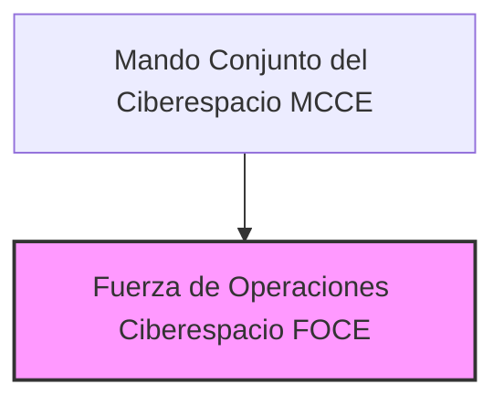

---
{"dg-publish":true,"permalink":"/opo-melilla/bloque-1/notas-tema-6-emad/foce/"}
---

# Fuerza de Operaciones en el Ciberespacio (FOCE)

La **Fuerza de Operaciones en el Ciberespacio (FOCE)** es un **componente operativo fundamental del [[MCCE\|Mando Conjunto del Ciberespacio]]**,  y se menciona en el [[Artículo 9. El Mando Conjunto del Ciberespacio\|Artículo 9.7]] de la [[Orden DEF/710/2020, de 27 de julio\|Orden DEF/710/2020]].

**Rol y Función Principal de la FOCE:**

La función principal de la FOCE es la **ejecución *operativa* de las acciones militares que aseguren la libertad de acción de las Fuerzas Armadas (FAS) en el ciberespacio**.  En esencia, la FOCE es el **brazo *ejecutor* del [[MCCE\|MCCE]] en el ciberespacio**,  llevando a cabo las operaciones militares cibernéticas planificadas y dirigidas por el Mando Conjunto.

Mientras que el [[MCCE\|Mando Conjunto del Ciberespacio]] se centra en el **planeamiento, dirección, coordinación y control** de las operaciones en el ciberespacio,  la **FOCE es la *unidad de *acción* que *materializa* esas operaciones**,  llevando a cabo las acciones cibernéticas necesarias para cumplir los objetivos establecidos.

**Responsabilidades Clave de la FOCE (según el Artículo 9.7 de la Orden DEF/710/2020):**

*   **Ejecución de Operaciones Militares en el Ciberespacio:**  Responsable directa de **ejecutar las operaciones militares cibernéticas** ordenadas por el [[MCCE\|Mando Conjunto del Ciberespacio]] para asegurar la libertad de acción de las FAS en este dominio.
*   **Dirección Operativa y Técnica de los COS:**  **Dirige operativa y técnicamente las actividades de los Centros de Operaciones de Seguridad (COS) de las FAS** en el ámbito de las operaciones militares en el ciberespacio.  Esto implica la coordinación y supervisión de los COS de los diferentes Ejércitos y la Armada en las operaciones cibernéticas conjuntas.
*   **Coordinación con Ejércitos, Armada y CESTIC:**  **Coordina con los Ejércitos, la Armada y el Centro de Sistemas y Tecnologías de la Información y las Comunicaciones (CESTIC)** las acciones necesarias para la ejecución de las operaciones en el ciberespacio.  Asegura la colaboración y el flujo de información entre la FOCE y los componentes de ciberdefensa de cada Ejército y la Armada, así como con el órgano tecnológico central del Ministerio de Defensa (CESTIC).**  Asegura la colaboración y el flujo de información entre la FOCE y los componentes de ciberdefensa de cada Ejército y la Armada, así como con el órgano tecnológico central del Ministerio de Defensa (CESTIC).
*   **Coordinación con Operaciones en el Espectro Electromagnético:**  Cuando se estén realizando operaciones en el espectro electromagnético, la FOCE **coordina la ejecución de las acciones ciber de forma concurrente con éstas**,  asegurando la sincronización y la no interferencia entre las operaciones en ambos dominios (ciberespacio y espectro electromagnético).

**Estructura de la FOCE:**

La Orden DEF/710/2020 no detalla la estructura interna de la FOCE más allá de mencionar la "Fuerza de Operaciones en el Ciberespacio".  Podemos asumir que se articula internamente en **unidades operativas cibernéticas** con diferentes capacidades y especializaciones para llevar a cabo el amplio espectro de misiones en el ciberespacio.  Estas unidades podrían incluir equipos de:

*   **Ciberdefensa Activa:**  Capacidades para la defensa activa de redes y sistemas, incluyendo la detección y neutralización de intrusiones y ataques.
*   **Ciberinteligencia Operacional:**  Capacidades para la obtención de inteligencia en el ciberespacio en apoyo de las operaciones militares.
*   **Ciberataque (en su caso):**  Capacidades para llevar a cabo operaciones ofensivas en el ciberespacio, según los planes operativos y la normativa vigente.
*   **Apoyo CIS:**  Unidades de apoyo de Sistemas de Información y Comunicaciones (CIS) para garantizar las comunicaciones y la infraestructura tecnológica necesaria para las operaciones de la FOCE.

**(Organigrama simplificado de la FOCE dentro del MCCE)**

**Relación con el MCCE y los COS:**

La FOCE está **directamente subordinada al [[MCCE\|Mando Conjunto del Ciberespacio]]**,  actuando como su brazo ejecutor en el ámbito de las operaciones.  El [[MCCE\|MCCE]] proporciona la **dirección estratégica y el planeamiento**,  mientras que la **FOCE lleva a cabo la *ejecución* de las operaciones**,  bajo las órdenes y directrices del Mando Conjunto.

La FOCE ejerce la **dirección operativa y técnica de los Centros de Operaciones de Seguridad (COS) de las FAS** en el contexto de las operaciones militares en el ciberespacio.  Esto implica que la FOCE **coordina y supervisa las actividades de los COS** en la ejecución de las misiones cibernéticas conjuntas,  garantizando la coherencia y la eficacia de la respuesta en el ciberespacio a nivel de todas las FAS.

**Ámbito Operativo: Ciberespacio:**

La FOCE opera exclusivamente en el **ámbito ciberespacial**,  llevando a cabo acciones militares en este dominio para:

*   **Defender las redes y sistemas de las FAS:**  Proteger la infraestructura cibernética militar frente a ataques y amenazas.
*   **Garantizar la libertad de acción de las FAS en el ciberespacio:**  Permitir que las FAS puedan operar en el ciberespacio de forma segura y efectiva,  sin interferencias ni ataques que limiten su capacidad operativa.
*   **Apoyar las operaciones militares en otros ámbitos:**  Proporcionar apoyo cibernético a las operaciones terrestres, marítimas, aéreas y espaciales,  mejorando su eficacia y seguridad.
*   **Contribuir a la ciberdefensa nacional (en coordinación con otros organismos):**  Participar en la ciberdefensa del conjunto del Estado y la sociedad, en coordinación con otros organismos nacionales competentes en ciberseguridad.

**Importancia de la FOCE:**

La FOCE es **esencial para la capacidad de las FAS de *actuar* en el ciberespacio**.  Sin una fuerza operativa especializada y eficaz como la FOCE,  el [[MCCE\|Mando Conjunto del Ciberespacio]] no podría materializar sus planes y directrices en acciones concretas en el ciberdominio.  La FOCE es la **punta de lanza de la ciberdefensa y las operaciones cibernéticas militares de España**,  garantizando la capacidad de las FAS de **protegerse y proyectar poder en el ciberespacio**, un dominio estratégico crucial en el siglo XXI.
