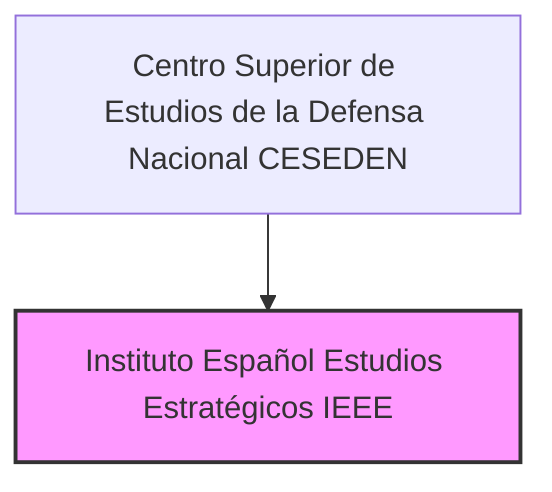

---
{"dg-publish":true,"permalink":"/opo-melilla/bloque-1/notas-tema-6-emad/ieee/"}
---

# Instituto Español de Estudios Estratégicos (IEEE)

El **Instituto Español de Estudios Estratégicos (IEEE)** es un **componente fundamental del [[OpoMelilla/BLOQUE 1/Notas Tema 6. EMAD/CESEDEN\|Centro Superior de Estudios de la Defensa Nacional]]**,  y se menciona en el [[Artículo 10. El Centro Superior de Estudios de la Defensa Nacional\|Artículo 10.7]] de la [[Orden DEF/710/2020, de 27 de julio\|Orden DEF/710/2020]].

**Rol y Función Principal del IEEE:**

La función principal del IEEE es **investigar y analizar *asuntos relacionados con la seguridad y la defensa*** y **contribuir a la *promoción y difusión de la Cultura de Seguridad y Defensa***.  En esencia, el IEEE es el ***think tank* o centro de pensamiento estratégico del [[OpoMelilla/BLOQUE 1/Notas Tema 6. EMAD/CESEDEN\|CESEDEN]]** y, por extensión, de las Fuerzas Armadas (FAS) de España.

Mientras que la [[OpoMelilla/BLOQUE 1/Notas Tema 6. EMAD/IEEE#ESFAS\|Escuela Superior de las Fuerzas Armadas (ESFAS)]] del CESEDEN se centra en la enseñanza y la formación,  el **IEEE se dedica a la *investigación*, el *análisis* y la *generación de conocimiento* en temas estratégicos** que afectan a la seguridad y la defensa nacional.  También tiene un papel importante en **acercar estos temas a la sociedad civil**.

**Responsabilidades Clave del IEEE (según el Artículo 10.7 de la Orden DEF/710/2020):**

*   **Investigar y Analizar Asuntos de Seguridad y Defensa:**  Realiza **investigaciones y análisis** en un amplio espectro de temas relacionados con la seguridad y la defensa,  incluyendo:
    *   **Análisis de escenarios geopolíticos y estratégicos.**
    *   **Estudio de amenazas y riesgos para la seguridad nacional.**
    *   **Análisis de políticas de defensa y seguridad.**
    *   **Investigación sobre nuevas tecnologías y su impacto en la defensa.**
    *   **Estudio de conflictos y crisis internacionales.**
    *   **Análisis de la industria de defensa y los recursos para la defensa.**
    *   **Otros temas relevantes para la seguridad y defensa de España.**
*   **Contribuir a la Promoción y Difusión de la Cultura de Seguridad y Defensa:**  Participa activamente en la **promoción y difusión de la Cultura de Seguridad y Defensa** en la sociedad española,  organizando eventos, publicaciones, seminarios, conferencias y otras actividades destinadas a sensibilizar y formar a la opinión pública en temas de defensa y seguridad.

**Estructura del IEEE:**

La Orden DEF/710/2020 no detalla la estructura interna del IEEE.  Como **instituto de investigación**,  es probable que se articule en:

*   **Dirección/Jefatura del IEEE:**  Responsable de la dirección y gestión general del instituto.
*   **Áreas o Departamentos de Investigación:**  Organizados por áreas temáticas o líneas de investigación (estrategia, geopolítica, tecnología y defensa, etc.).
*   **Investigadores y Analistas:**  Personal militar y civil especializado en investigación y análisis estratégico, encargado de llevar a cabo los estudios y proyectos del instituto.
*   **Sección de Publicaciones y Difusión:**  Responsable de la edición y difusión de los trabajos de investigación del IEEE y de las actividades de promoción de la cultura de defensa.
*   **Sección de Apoyo:**  Para la gestión administrativa, logística y de recursos del instituto.

**(Organigrama simplificado del IEEE dentro del CESEDEN)**

**Relación con el CESEDEN:**

El IEEE es un **componente integral del [[OpoMelilla/BLOQUE 1/Notas Tema 6. EMAD/CESEDEN\|Centro Superior de Estudios de la Defensa Nacional]]**,  dependiendo directamente de la Dirección del CESEDEN para su funcionamiento y gestión.  El IEEE **complementa la función docente de la [[OpoMelilla/BLOQUE 1/Notas Tema 6. EMAD/IEEE#ESFAS\|Escuela Superior de las Fuerzas Armadas]] y del [[OpoMelilla/BLOQUE 1/Notas Tema 6. EMAD/IEEE#DCDD\|Departamento de Cultura y Diplomacia de la Defensa]]** dentro del CESEDEN,  aportando la **dimensión de la *investigación* y el *análisis estratégico*** al conjunto del Centro Superior.

La **investigación y el análisis estratégico realizados por el IEEE *alimentan* la docencia impartida en la ESFAS y el DCDD**,  proporcionando una base de conocimiento actualizada y relevante para la formación de los altos mandos y la difusión de la cultura de defensa.  A su vez,  la **actividad docente del CESEDEN *retroalimenta* la investigación del IEEE**,  identificando nuevas áreas de estudio y análisis relevantes para la defensa.

**Importancia del IEEE:**

El IEEE es **esencial para el *pensamiento estratégico* y la *toma de decisiones informadas* en materia de defensa en España**.  Su labor de investigación y análisis contribuye a:

*   **Comprender mejor el entorno estratégico:**  Proporcionar análisis rigurosos y prospectivos sobre los desafíos y las oportunidades para la seguridad y defensa de España.
*   **Fundamentar las políticas de defensa:**  Aportar bases sólidas y conocimiento experto para la elaboración de políticas de defensa y seguridad eficaces.
*   **Anticipar tendencias y amenazas futuras:**  Identificar y analizar las tendencias emergentes y las nuevas amenazas a la seguridad,  permitiendo una adaptación proactiva de la defensa.
*   **Promover el debate y la reflexión estratégica:**  Fomentar el debate público informado y la reflexión estratégica sobre temas de defensa y seguridad,  contribuyendo a una cultura de defensa más sólida y participativa.
*   **Elevar el nivel del análisis estratégico en las FAS y en la sociedad española en general.**
