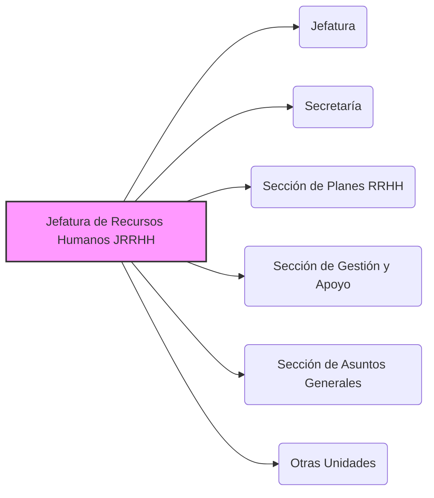

---
{"dg-publish":true,"permalink":"/opo-melilla/bloque-1/notas-tema-6-emad/jrrhh/"}
---

# Jefatura de Recursos Humanos (JRRHH)

La **Jefatura de Recursos Humanos (JRRHH)** es un **componente fundamental del [[OpoMelilla/BLOQUE 1/Notas Tema 6. EMAD/CGEMAD\|Cuartel General del Estado Mayor de la Defensa]]**, y se define en el [[Artículo 4. La Jefatura de Recursos Humanos\|Artículo 4]] de la [[Orden DEF/710/2020, de 27 de julio\|Orden DEF/710/2020]].

**Rol y Función Principal de la JRRHH:**

La función principal de la JRRHH es la **gestión integral del *recurso humano* del [[OpoMelilla/BLOQUE 1/Notas Tema 6. EMAD/EMAD\|Estado Mayor de la Defensa]]**.  Esto abarca desde el **planeamiento y la gestión del personal** (militar y civil) hasta su **apoyo administrativo y logístico**,  asegurando que el EMAD cuente con el personal adecuado, bien gestionado y apoyado para el cumplimiento de sus misiones.

En esencia, la JRRHH es responsable de **garantizar que el *capital humano* del EMAD sea gestionado de manera eficiente y efectiva**,  contribuyendo al **bienestar del personal** y a la **eficacia operativa** del Estado Mayor.

**Responsabilidades Clave de la JRRHH (según el Artículo 4 de la Orden DEF/710/2020):**

*   **Planeamiento de Recursos Humanos:**  Responsable del **planeamiento del recurso de personal militar y civil** dependiente del [[OpoMelilla/BLOQUE 1/Notas Tema 6. EMAD/JEMAD\|Jefe de Estado Mayor de la Defensa]],  definiendo las necesidades de personal a corto, medio y largo plazo.
*   **Gestión de Personal:**  Lleva a cabo la **gestión del personal** del EMAD,  incluyendo asignaciones, destinos, evaluaciones, ascensos, régimen disciplinario, etc.
*   **Apoyo Administrativo y Logístico al Personal:**  Proporciona **apoyo administrativo y logístico** al personal militar y civil del EMAD,  facilitando su día a día y el desarrollo de sus funciones.
*   **Asesoramiento al JEMAD en Enseñanza:**  **Asesora al JEMAD en el ámbito de la enseñanza** que recae bajo su competencia,  relacionado con la formación y perfeccionamiento del personal del EMAD.
*   **Coordinación con el JEMACON en RRHH:**  Coordina con el [[OpoMelilla/BLOQUE 1/Notas Tema 6. EMAD/EMACON\|Jefe del Estado Mayor Conjunto (JEMACON)]] en asuntos relacionados con el planeamiento del recurso de personal del EMAD y la postura ante las **OISD** en este ámbito.
*   **Representación ante OISD en RRHH:**  Ejerce la **representación del EMAD ante las Organizaciones Internacionales de Seguridad y Defensa (OISD)** en los aspectos de recursos humanos de su ámbito de responsabilidad.

**Estructura de la JRRHH (Componentes Principales - Artículo 4.2):**

La JRRHH se articula en las siguientes Secciones y Secretaría:

*   Jefatura (liderada por el Jefe de la JRRHH)
*   Secretaría
*   [[OpoMelilla/BLOQUE 1/Notas Tema 6. EMAD/JRRHH#Sección-de-Planes-de-Recursos-Humanos\|Sección de Planes de Recursos Humanos]]
*   [[OpoMelilla/BLOQUE 1/Notas Tema 6. EMAD/JRRHH#Sección-de-Gestión-y-Apoyo\|Sección de Gestión y Apoyo]]
*   [[OpoMelilla/BLOQUE 1/Notas Tema 6. EMAD/JRRHH#Sección-de-Asuntos-Generales\|Sección de Asuntos Generales]]
*   Otras unidades que se determinen.

**(Secciones detalladas más abajo)**

**Importancia de la JRRHH:**

La JRRHH es **fundamental para el correcto funcionamiento del [[OpoMelilla/BLOQUE 1/Notas Tema 6. EMAD/EMAD\|Estado Mayor de la Defensa]]**.  La **eficacia operativa** del EMAD depende en gran medida de contar con un **personal cualificado, motivado y bien gestionado**.  La JRRHH es la **garante de la gestión eficiente del recurso humano**,  asegurando que el EMAD disponga del personal necesario con las capacidades adecuadas para cumplir sus misiones.  Es un **pilar de apoyo esencial** para el JEMAD y para toda la organización del EMAD.

---

### Secciones Principales de la JRRHH (Detalle):

#### Sección de Planes de Recursos Humanos [[OpoMelilla/BLOQUE 1/Notas Tema 6. EMAD/JRRHH#Sección-de-Planes-de-Recursos-Humanos\|#Sección-de-Planes-de-Recursos-Humanos]]

*   Responsable del **planeamiento de las necesidades de personal** a corto, medio y largo plazo del EMAD.
*   Elabora **planes de recursos humanos** para cubrir las vacantes y necesidades de personal.
*   Participa en la **definición de perfiles profesionales** y requisitos de personal para el EMAD.

#### Sección de Gestión y Apoyo [[OpoMelilla/BLOQUE 1/Notas Tema 6. EMAD/JRRHH#Sección-de-Gestión-y-Apoyo\|#Sección-de-Gestión-y-Apoyo]]

*   Responsable de la **gestión administrativa del personal** del EMAD (destinos, comisiones de servicio, licencias, etc.).
*   Proporciona **apoyo logístico** al personal (alojamiento, transporte, etc., en coordinación con otras unidades de apoyo del CGEMAD).
*   Gestiona **nóminas y retribuciones** del personal.

#### Sección de Asuntos Generales [[OpoMelilla/BLOQUE 1/Notas Tema 6. EMAD/JRRHH#Sección-de-Asuntos-Generales\|#Sección-de-Asuntos-Generales]]

*   Gestiona **asuntos de carácter general** relacionados con el personal (condecoraciones, reconocimientos, etc.).
*   Tramita **expedientes personales** y mantiene actualizados los **registros de personal**.
*   Gestiona **asuntos relacionados con la enseñanza y formación** del personal del EMAD, en coordinación con los órganos de enseñanza correspondientes.
