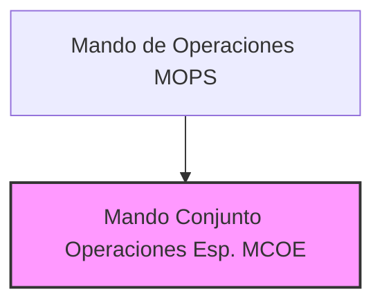

---
{"dg-publish":true,"permalink":"/opo-melilla/bloque-1/notas-tema-6-emad/mcoe/"}
---

# Mando Conjunto de Operaciones Especiales (MCOE)

El **Mando Conjunto de Operaciones Especiales (MCOE)** es un **componente especializado del [[OpoMelilla/BLOQUE 1/Notas Tema 6. EMAD/MOPS\|Mando de Operaciones]]**,  y se describe en el [[Artículo 7. El Mando de Operaciones\|Artículo 7.5]] de la [[Orden DEF/710/2020, de 27 de julio\|Orden DEF/710/2020]].

**Rol y Función Principal del MCOE:**

El MCOE es el **mando responsable de las *operaciones especiales* dentro de las Fuerzas Armadas (FAS) de España en el nivel operacional**. Su función principal es **planear, conducir y seguir las *operaciones especiales* que se determinen** por el [[OpoMelilla/BLOQUE 1/Notas Tema 6. EMAD/MOPS\|Mando de Operaciones]] y el [[OpoMelilla/BLOQUE 1/Notas Tema 6. EMAD/JEMAD\|Jefe de Estado Mayor de la Defensa]].

En esencia, el MCOE es el **mando *especializado* en el empleo de *capacidades de operaciones especiales* de las FAS**,  garantizando su **integración, interoperabilidad y eficacia** en el marco de las operaciones militares conjuntas.  Es el **brazo ejecutor de las operaciones especiales** dentro de la estructura operativa del EMAD.

**Responsabilidades Clave del MCOE (según el Artículo 7.5 de la Orden DEF/710/2020):**

*   **Planeamiento de Operaciones Especiales:**  Realiza el **planeamiento** detallado de las operaciones especiales que se le encomienden.
*   **Conducción de Operaciones Especiales:**  **Dirige y conduce** la ejecución de las operaciones especiales,  coordinando las unidades y medios de operaciones especiales asignados.
*   **Seguimiento de Operaciones Especiales:**  Realiza el **seguimiento** del desarrollo de las operaciones especiales,  evaluando su progreso y resultados.
*   **Integración e Interoperabilidad de Capacidades de Operaciones Especiales:**  Facilita la **integración e interoperabilidad** de las capacidades de operaciones especiales de los diferentes Ejércitos y la Armada,  asegurando su empleo conjunto eficaz.
*   **Planificación y Conducción de Ejercicios de Operaciones Especiales:**  Planifica y conduce los **ejercicios conjuntos** necesarios para mantener y mejorar la eficacia operativa de las unidades de operaciones especiales que le sean asignadas.
*   **Asesoramiento al CMOPS en Operaciones Especiales:**  **Asesora al [[OpoMelilla/BLOQUE 1/Notas Tema 6. EMAD/MCOE#CMOPS\|Comandante del MOPS]]** en todo lo referente a las operaciones especiales,  aportando su conocimiento y experiencia especializada en este ámbito.

**Estructura del MCOE:**

La Orden DEF/710/2020 no detalla la estructura interna del MCOE en un nivel de desglose similar al del [[OpoMelilla/BLOQUE 1/Notas Tema 6. EMAD/EMACON\|EMACON]] o el [[MCCE\|MCCE]].  Sin embargo, sí menciona que, cuando se determine, el MCOE:

*   **Constituirá la base del Cuartel General de un Mando Componente de Operaciones Especiales:** Esto sugiere que el MCOE tiene la capacidad de **escalar su estructura** para convertirse en el Cuartel General de un Mando Componente de Operaciones Especiales,  en caso de que se active este tipo de mando para una operación específica.

**(Organigrama simplificado del MCOE dentro del MOPS)**

**Relación con el Mando Componente de Operaciones Especiales:**

El MCOE tiene una **relación especial con el concepto de Mando Componente de Operaciones Especiales**.  Como se ha mencionado, el MCOE puede servir de base para la activación de este tipo de Mando Componente,  que se activaría **de forma *transversal* y *adicional* a los Mandos Componentes por ámbito** (Terrestre, Marítimo, Aéreo, Espacial, Ciberespacial).

El Mando Componente de Operaciones Especiales se activaría **cuando se requiera una estructura de mando *específica* y *centralizada* para coordinar operaciones especiales de gran envergadura o complejidad**,  involucrando unidades de operaciones especiales de diferentes Ejércitos.  En estos casos, el MCOE proporcionaría el núcleo del Cuartel General de este Mando Componente,  asegurando una cadena de mando unificada y eficaz para las operaciones especiales.

**Ámbito Operativo: Operaciones Especiales:**

El MCOE se centra en el **ámbito de las *operaciones especiales***,  que se caracterizan por:

*   **Misiones de alto riesgo y especialización:**  Operaciones que requieren **capacidades y técnicas *específicas*** y que se llevan a cabo en **entornos de alto riesgo** o en **situaciones complejas**.
*   **Unidades de Operaciones Especiales (OE):**  Empleo de unidades militares especialmente **seleccionadas, adiestradas y equipadas** para este tipo de misiones.
*   **Carácter *conjunto* e *inter-ejércitos*:**  Las operaciones especiales suelen ser de carácter conjunto,  involucrando unidades de operaciones especiales de diferentes Ejércitos (Tierra, Armada, Aire y Espacio).
*   **Alta *discreción* y *precisión*:**  Las operaciones especiales suelen requerir un alto grado de **discreción, sigilo y precisión** en su ejecución.
*   **Espectro amplio de misiones:**  Las operaciones especiales abarcan un amplio espectro de misiones,  incluyendo **acción directa, reconocimiento especial, asistencia militar, contraterrorismo, rescate de personal, etc.**

**Importancia del MCOE:**

El MCOE es crucial para dotar a las FAS de una **capacidad *especializada* y *eficaz* en el ámbito de las operaciones especiales**.  Estas capacidades son **estratégicamente valiosas** para:

*   **Responder a amenazas asimétricas y no convencionales:**  Las operaciones especiales son especialmente útiles para hacer frente a amenazas como el terrorismo, la insurgencia o las crisis complejas.
*   **Proyectar poder militar de forma *precisa* y *quirúrgica***:  Permiten llevar a cabo acciones militares de alto impacto con un mínimo de daños colaterales y con gran precisión.
*   **Obtener información crítica y realizar acciones de alto valor estratégico:**  Las operaciones especiales pueden obtener información de inteligencia clave o llevar a cabo acciones militares de alto valor estratégico en entornos hostiles o negados.
*   **Contribuir a la disuasión y la seguridad nacional:**  La disponibilidad de capacidades de operaciones especiales creíbles y eficaces refuerza la capacidad de disuasión y la seguridad de España.
