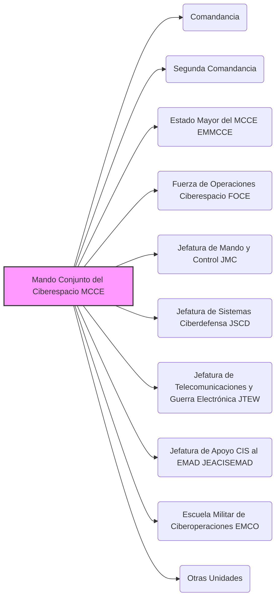

---
{"dg-publish":true,"permalink":"/opo-melilla/bloque-1/notas-tema-6-emad/mando-conjunto-del-ciberespacio-mcce/"}
---

El **Mando Conjunto del Ciberespacio (MCCE)** es uno de los **componentes principales del [[OpoMelilla/BLOQUE 1/Notas Tema 6. EMAD/EMAD\|Estado Mayor de la Defensa]]**, creado para asegurar la **libertad de acción de las Fuerzas Armadas (FAS) en el ámbito ciberespacial**.  Fue establecido en la [[Orden DEF/710/2020, de 27 de julio\|Orden DEF/710/2020]] en sustitución del anterior Mando Conjunto de Ciberdefensa y la Jefatura de Sistemas de Información y Telecomunicaciones.

**Misión Principal del MCCE:**

La misión fundamental del MCCE es **planear, dirigir, coordinar, controlar y ejecutar las acciones necesarias para garantizar la libertad de acción de las FAS en el ciberespacio**.  Esto implica tanto **acciones defensivas** (ciberdefensa) como **acciones ofensivas** en el ámbito ciberespacial, de acuerdo con los planes operativos vigentes.

**Responsabilidades Clave del MCCE (según el Artículo 9 de la Orden DEF/710/2020):**

*   **Operaciones Militares en el Ciberespacio:**  Planifica, dirige, coordina, controla y ejecuta operaciones militares en el ciberespacio.
*   **Supervivencia de Elementos Críticos:**  Realiza acciones para garantizar la supervivencia de los elementos físicos, lógicos y virtuales críticos para la Defensa y las FAS en el ciberespacio.
*   **Autoridad sobre la I3D:**  Asegura la autoridad del [[OpoMelilla/BLOQUE 1/Notas Tema 6. EMAD/JEMAD\|Jefe de Estado Mayor de la Defensa]] sobre la Infraestructura Integral de Información para la Defensa (I3D) en el ámbito operativo.
*   **Transformación Digital:**  Colabora en la transformación digital del Ministerio de Defensa, en el ámbito del EMAD.
*   **Requisitos y Medios de Ciberdefensa:**  Define requisitos operativos, seguimiento de la obtención y sostenimiento de los medios de Ciberdefensa, Sistemas de Información y Telecomunicaciones (CIS) conjuntos, Guerra Electrónica y Navegación e Identificación.
*   **Apoyo CIS al EMAD:**  Presta apoyo CIS a la estructura del EMAD.
*   **CERT de Defensa:**  Incluye el Equipo de Respuesta ante Emergencias Informáticas del MINISDEF, denominado CERT de Defensa (ESPDEF-CERT).

**Estructura del MCCE (Componentes Principales - Artículo 9.5):**

El MCCE se articula en las siguientes unidades principales:

*   Comandancia
*   Segunda Comandancia
*   [[OpoMelilla/BLOQUE 1/Notas Tema 6. EMAD/Mando Conjunto del Ciberespacio (MCCE)#EMMCCE\|Estado Mayor del MCCE (EMMCCE)]]
*   [[OpoMelilla/BLOQUE 1/Notas Tema 6. EMAD/Mando Conjunto del Ciberespacio (MCCE)#FOCE\|Fuerza de Operaciones en el Ciberespacio (FOCE)]]
*   [[OpoMelilla/BLOQUE 1/Notas Tema 6. EMAD/Mando Conjunto del Ciberespacio (MCCE)#JMC\|Jefatura de Mando y Control (JMC)]]
*   [[OpoMelilla/BLOQUE 1/Notas Tema 6. EMAD/Mando Conjunto del Ciberespacio (MCCE)#JSCD\|Jefatura de Sistemas de Ciberdefensa (JSCD)]]
*   [[OpoMelilla/BLOQUE 1/Notas Tema 6. EMAD/Mando Conjunto del Ciberespacio (MCCE)#JTEW\|Jefatura de Telecomunicaciones y Guerra Electrónica (JTEW)]]
*   [[OpoMelilla/BLOQUE 1/Notas Tema 6. EMAD/Mando Conjunto del Ciberespacio (MCCE)#JEACISEMAD\|Jefatura de Apoyo CIS al EMAD (JEACISEMAD)]]
*   [[OpoMelilla/BLOQUE 1/Notas Tema 6. EMAD/Mando Conjunto del Ciberespacio (MCCE)#EMCO\|Escuela Militar de Ciberoperaciones (EMCO)]]

**Importancia del MCCE:**

El MCCE es **esencial en el contexto actual**, donde el ciberespacio se ha convertido en un **dominio operativo crítico** para cualquier fuerza militar moderna.  Garantizar la libertad de acción en el ciberespacio es fundamental para la **defensa nacional**, la **protección de infraestructuras críticas** y la **eficacia de las operaciones militares** en todos los ámbitos.

**Referencia Legal Principal:**

*   [[Orden DEF/710/2020, de 27 de julio\|Orden DEF/710/2020]], Artículo 9 (Organización del Mando Conjunto del Ciberespacio)
*   [[Real Decreto 521/2020, de 19 de mayo\|Real Decreto 521/2020, de 19 de mayo]] (establece la organización básica de las Fuerzas Armadas, incluyendo el ciberespacio como ámbito operativo)
