---
{"dg-publish":true,"dg-home":true,"permalink":"/opo-melilla/bloque-1/tema-1-constitucion-organizacion-politica-y-territorial-del-estado/","tags":["gardenEntry"],"dgPassFrontmatter":true}
---

# Constitución Española de 1978 - Títulos III, IV, V, VI y VIII

## TÍTULO III

### De las Cortes Generales

#### CAPÍTULO PRIMERO

**Artículo 66.**

1. Las **Cortes Generales representan al pueblo español** y están formadas por el **Congreso de los Diputados** y el **Senado**.
    
2. Las **Cortes Generales ejercen la potestad legislativa del Estado**, aprueban sus **Presupuestos**, **controlan la acción del Gobierno** y tienen las demás competencias que les atribuya la Constitución.
    
3. Las **Cortes Generales son inviolables**.
    

💡 **Tip/Consejo:** Este artículo establece la **naturaleza** y **funciones** de las Cortes Generales como representantes del pueblo español y principales órganos del Estado. Es crucial para entender cómo se ejerce la soberanía popular y se organiza el poder legislativo. Su inviolabilidad es un pilar de su independencia. Es importante recordar que las Cortes Generales son bicamerales (Congreso y Senado) y que estas cámaras tienen diferentes funciones y orígenes.  
🔑 **Aspecto Clave:** Las **Cortes Generales representan al pueblo español, ejercen la potestad legislativa, aprueban presupuestos, controlan al Gobierno y son inviolables**.

    
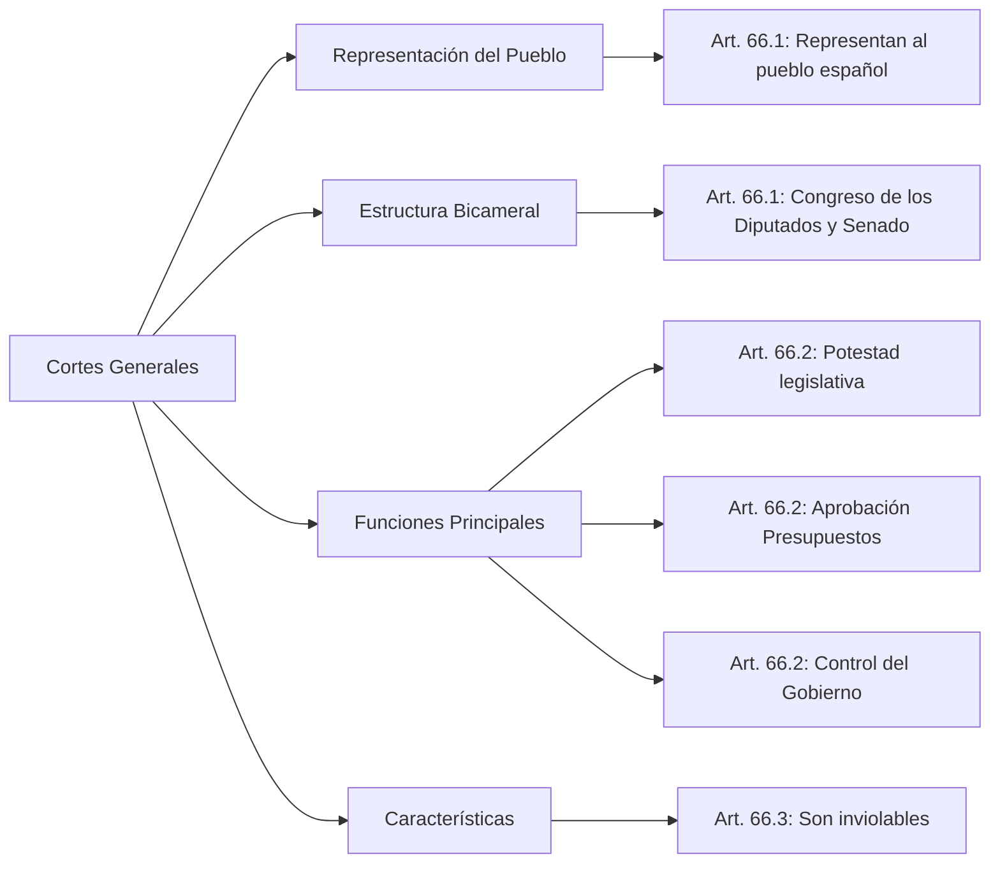
```mermaid 
	graph LR
    A[Cortes Generales] --> B[Representación del Pueblo]
    B --> B1[Art. 66.1: Representan al pueblo español]
    
    A --> C[Estructura Bicameral]
    C --> C1[Art. 66.1: Congreso de los Diputados y Senado]
    
    A --> D[Funciones Principales]
    D --> D1[Art. 66.2: Potestad legislativa]
    D --> D2[Art. 66.2: Aprobación Presupuestos]
    D --> D3[Art. 66.2: Control del Gobierno]
    
    A --> E[Características]
    E --> E1[Art. 66.3: Son inviolables]
```

**Artículo 67.**

4. Nadie podrá ser miembro de las dos Cámaras simultáneamente, ni acumular el acta de una Asamblea de Comunidad Autónoma con la de Diputado al Congreso.
    
5. Los miembros de las Cortes Generales no estarán ligados por mandato imperativo.
    
6. Las reuniones de Parlamentarios que se celebren sin convocatoria reglamentaria no vincularán a las Cámaras, y no podrán ejercer sus funciones ni ostentar sus privilegios.
    

💡 **Tip/Consejo:** Este artículo establece las **incompatibilidades** y la **independencia** de los miembros de las Cortes. La prohibición de ser miembro de ambas cámaras y la no sujeción a mandato imperativo buscan garantizar la autonomía de cada parlamentario y la integridad del sistema. Las reuniones no reglamentarias carecen de valor oficial.  
🔑 **Aspecto Clave:** Los **miembros de las Cortes no pueden ser simultáneamente miembros de las dos Cámaras, ni estar ligados por mandato imperativo, y las reuniones no reglamentarias no vinculan a las Cámaras**.

    
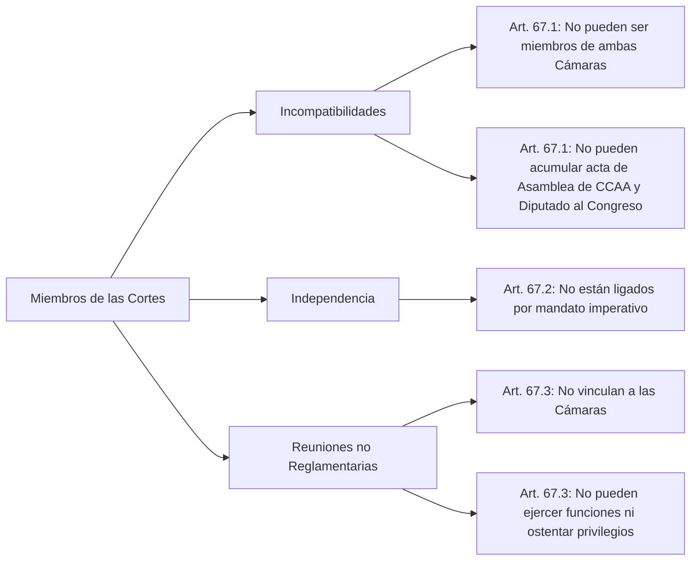
```mermaid
graph LR
    A[Miembros de las Cortes] --> B[Incompatibilidades]
    B --> B1[Art. 67.1: No pueden ser miembros de ambas Cámaras]
    B --> B2[Art. 67.1: No pueden acumular acta de Asamblea de CCAA y Diputado al Congreso]
    
    A --> C[Independencia]
    C --> C1[Art. 67.2: No están ligados por mandato imperativo]
    
    A --> D[Reuniones no Reglamentarias]
    D --> D1[Art. 67.3: No vinculan a las Cámaras]
    D --> D2[Art. 67.3: No pueden ejercer funciones ni ostentar privilegios]
```

**Artículo 68.**

7. El Congreso se compone de un **mínimo de 300 y un máximo de 400 Diputados**, elegidos por **sufragio universal, libre, igual, directo y secreto**, en los términos que establezca la ley.
    
8. La **circunscripción electoral es la provincia**. Las poblaciones de **Ceuta y Melilla estarán representadas cada una de ellas por un Diputado**. La ley distribuirá el número total de Diputados, asignando una representación mínima inicial a cada circunscripción y distribuyendo los demás en proporción a la población.
    
9. La elección se verificará en cada circunscripción atendiendo a **criterios de representación proporcional**.
    
10. El Congreso es elegido por **cuatro años**. El mandato de los Diputados termina cuatro años después de su elección o el día de la disolución de la Cámara.
    
11. Son electores y elegibles todos los españoles que estén en pleno uso de sus derechos políticos. La ley reconocerá y el Estado facilitará el ejercicio del derecho de sufragio a los españoles que se encuentren fuera del territorio de España.
    
12. Las elecciones tendrán lugar entre los treinta días y sesenta días desde la terminación del mandato. El Congreso electo deberá ser convocado dentro de los veinticinco días siguientes a la celebración de las elecciones.
    

💡 **Tip/Consejo:** Este artículo detalla la **composición** y **sistema electoral** del Congreso de los Diputados. Es fundamental entender que los diputados son elegidos por sufragio universal, libre, igual, directo y secreto, y que las provincias son las circunscripciones electorales. El principio de representación proporcional busca asegurar que las diferentes sensibilidades políticas estén representadas en el Congreso. La duración del mandato es de cuatro años.  
🔑 **Aspecto Clave:** El **Congreso se compone de 300-400 diputados elegidos por sufragio universal, la circunscripción es la provincia, la elección es por representación proporcional y el mandato es de cuatro años**.

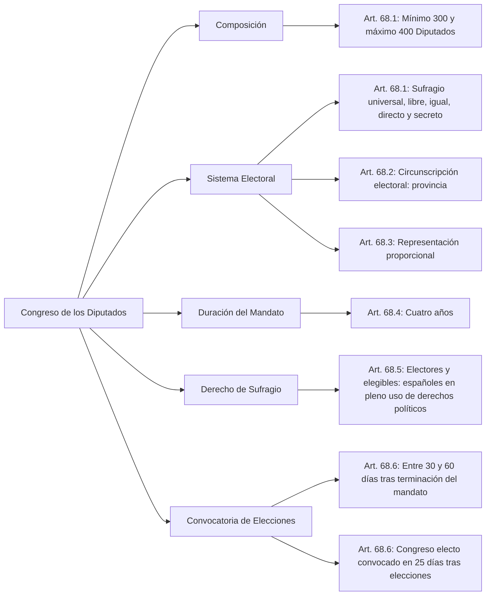
```mermaid
graph LR
    A[Congreso de los Diputados] --> B[Composición]
    B --> B1[Art. 68.1: Mínimo 300 y máximo 400 Diputados]
    
    A --> C[Sistema Electoral]
    C --> C1[Art. 68.1: Sufragio universal, libre, igual, directo y secreto]
    C --> C2[Art. 68.2: Circunscripción electoral: provincia]
     C --> C3[Art. 68.3: Representación proporcional]
    
    A --> D[Duración del Mandato]
    D --> D1[Art. 68.4: Cuatro años]
    
    A --> E[Derecho de Sufragio]
    E --> E1[Art. 68.5: Electores y elegibles: españoles en pleno uso de derechos políticos]
    
    A --> F[Convocatoria de Elecciones]
    F --> F1[Art. 68.6: Entre 30 y 60 días tras terminación del mandato]
     F --> F2[Art. 68.6: Congreso electo convocado en 25 días tras elecciones]
```
**Artículo 69.**

13. El **Senado es la Cámara de representación territorial**.
    
14. En cada provincia se elegirán **cuatro Senadores** por sufragio universal, libre, igual, directo y secreto por los votantes de cada una de ellas, en los términos que señale una ley orgánica.
    
15. En las provincias insulares, cada isla o agrupación de ellas, con Cabildo o Consejo Insular, constituirá una circunscripción a efectos de elección de Senadores, correspondiendo tres a cada una de las islas mayores –Gran Canaria, Mallorca y Tenerife– y uno a cada una de las siguientes islas o agrupaciones: Ibiza-Formentera, Menorca, Fuerteventura, Gomera, Hierro, Lanzarote y La Palma.
    
16. Las poblaciones de **Ceuta y Melilla elegirán cada una de ellas dos Senadores**.
    
17. Las Comunidades Autónomas designarán además un Senador y otro más por cada millón de habitantes de su respectivo territorio. La designación corresponderá a la Asamblea legislativa o, en su defecto, al órgano colegiado superior de la Comunidad Autónoma, de acuerdo con lo que establezcan los Estatutos, que asegurarán, en todo caso, la adecuada representación proporcional.
    
18. El Senado es elegido por **cuatro años**. El mandato de los Senadores termina cuatro años después de su elección o el día de la disolución de la Cámara.
    

💡 **Tip/Consejo:** Este artículo define el **Senado** como la cámara de representación territorial, destacando que su composición incluye senadores elegidos directamente en las provincias, senadores por las islas y senadores designados por las Comunidades Autónomas. La diversidad en su origen y composición es clave para su función de representación territorial. La duración del mandato también es de cuatro años.  
🔑 **Aspecto Clave:** El **Senado es la Cámara de representación territorial, con senadores elegidos por provincias, islas y Comunidades Autónomas, y su mandato es de cuatro años**.

      
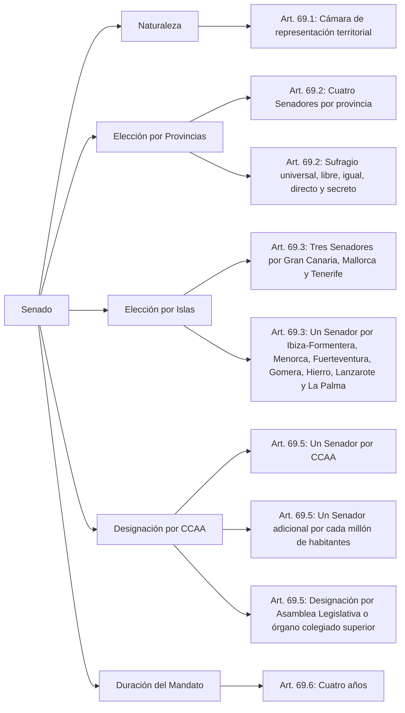
```mermaid
graph LR
    A[Senado] --> B[Naturaleza]
    B --> B1[Art. 69.1: Cámara de representación territorial]

    A --> C[Elección por Provincias]
    C --> C1[Art. 69.2: Cuatro Senadores por provincia]
    C --> C2[Art. 69.2: Sufragio universal, libre, igual, directo y secreto]
   
    A --> D[Elección por Islas]
   D --> D1[Art. 69.3: Tres Senadores por Gran Canaria, Mallorca y Tenerife]
   D --> D2[Art. 69.3: Un Senador por Ibiza-Formentera, Menorca, Fuerteventura, Gomera, Hierro, Lanzarote y La Palma]
    
    A --> E[Designación por CCAA]
    E --> E1[Art. 69.5: Un Senador por CCAA]
    E --> E2[Art. 69.5: Un Senador adicional por cada millón de habitantes]
     E --> E3[Art. 69.5: Designación por Asamblea Legislativa o órgano colegiado superior]
    
    A --> F[Duración del Mandato]
    F --> F1[Art. 69.6: Cuatro años]
```
**Artículo 70.**

19. La ley electoral determinará las **causas de inelegibilidad e incompatibilidad de los Diputados y Senadores**, que comprenderán en todo caso:
    
    - a) A los componentes del Tribunal Constitucional.
        
    - b) A los altos cargos de la Administración del Estado que determine la ley, con la excepción de los miembros del Gobierno.
        
    - c) Al Defensor del Pueblo.
        
    - d) A los Magistrados, Jueces y Fiscales en activo.
        
    - e) A los militares profesionales y miembros de las Fuerzas y Cuerpos de Seguridad y Policía en activo.
        
    - f) A los miembros de las Juntas Electorales.
        
20. La validez de las actas y credenciales de los miembros de ambas Cámaras estará sometida al **control judicial**, en los términos que establezca la ley electoral.
    

💡 **Tip/Consejo:** Este artículo establece que una ley electoral determinará las **causas de inelegibilidad e incompatibilidad** para ser Diputado o Senador. Menciona varios grupos que no pueden ser miembros del Congreso o Senado para garantizar la independencia de las cámaras y evitar conflictos de interés. Además, la validez de las actas está sujeta a control judicial para asegurar la integridad del proceso electoral.  
🔑 **Aspecto Clave:** La **ley electoral determina las causas de inelegibilidad e incompatibilidad de Diputados y Senadores, incluyendo a ciertos cargos públicos, y la validez de las actas está sujeta a control judicial**.

     
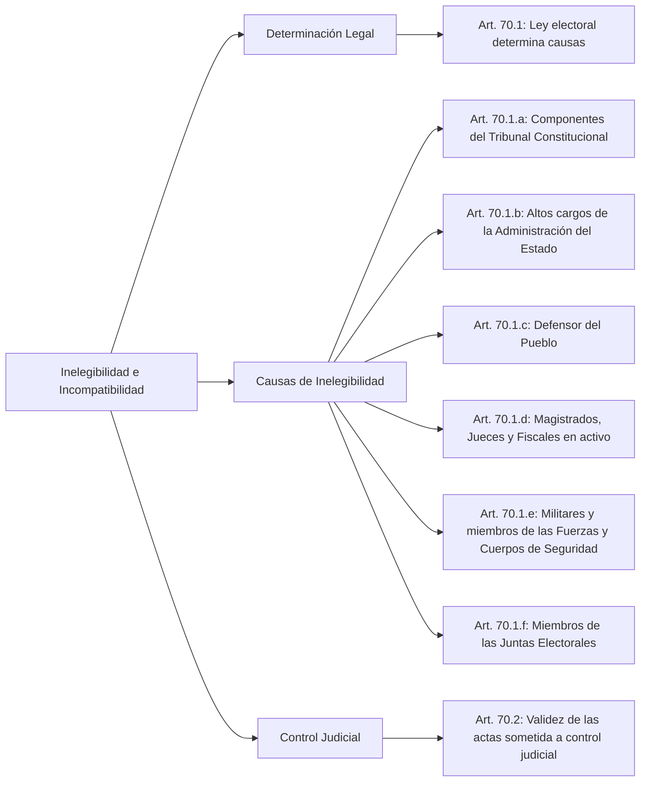
```mermaid
graph LR
    A[Inelegibilidad e Incompatibilidad] --> B[Determinación Legal]
    B --> B1[Art. 70.1: Ley electoral determina causas]
    
    A --> C[Causas de Inelegibilidad]
    C --> C1[Art. 70.1.a: Componentes del Tribunal Constitucional]
    C --> C2[Art. 70.1.b: Altos cargos de la Administración del Estado]
    C --> C3[Art. 70.1.c: Defensor del Pueblo]
    C --> C4[Art. 70.1.d: Magistrados, Jueces y Fiscales en activo]
    C --> C5[Art. 70.1.e: Militares y miembros de las Fuerzas y Cuerpos de Seguridad]
    C --> C6[Art. 70.1.f: Miembros de las Juntas Electorales]
    
    A --> D[Control Judicial]
    D --> D1[Art. 70.2: Validez de las actas sometida a control judicial]
```
**Artículo 71.**

21. Los **Diputados y Senadores gozarán de inviolabilidad** por las opiniones manifestadas en el ejercicio de sus funciones.
    
22. Durante el período de su mandato los **Diputados y Senadores gozarán asimismo de inmunidad** y sólo podrán ser detenidos en caso de flagrante delito. No podrán ser inculpados ni procesados sin la previa autorización de la Cámara respectiva.
    
23. En las causas contra Diputados y Senadores será competente la Sala de lo Penal del Tribunal Supremo.
    
24. Los **Diputados y Senadores percibirán una asignación** que será fijada por las respectivas Cámaras.
    

💡 **Tip/Consejo:** Este artículo establece las **prerrogativas** de los parlamentarios. La inviolabilidad protege a los Diputados y Senadores por las opiniones expresadas en el ejercicio de sus funciones, mientras que la inmunidad protege contra la detención y el procesamiento sin autorización de la Cámara. La asignación económica busca asegurar la independencia económica de los representantes.  
🔑 **Aspecto Clave:** Los **Diputados y Senadores tienen inviolabilidad por sus opiniones, inmunidad durante su mandato y perciben una asignación fijada por las Cámaras.**

     
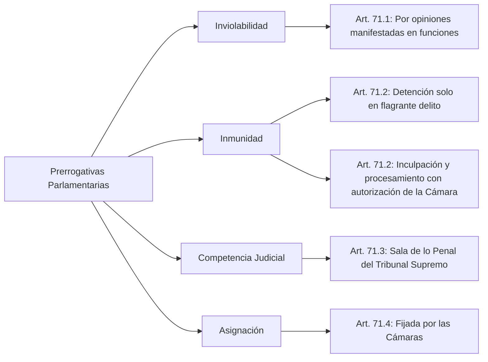
```mermaid
graph LR
    A[Prerrogativas Parlamentarias] --> B[Inviolabilidad]
    B --> B1[Art. 71.1: Por opiniones manifestadas en funciones]

    A --> C[Inmunidad]
    C --> C1[Art. 71.2: Detención solo en flagrante delito]
     C --> C2[Art. 71.2: Inculpación y procesamiento con autorización de la Cámara]
   
    A --> D[Competencia Judicial]
    D --> D1[Art. 71.3: Sala de lo Penal del Tribunal Supremo]
    
    A --> E[Asignación]
   E --> E1[Art. 71.4: Fijada por las Cámaras]
```
**Artículo 72.**

25. Las **Cámaras establecen sus propios Reglamentos**, aprueban autónomamente sus **presupuestos** y, de común acuerdo, regulan el **Estatuto del Personal de las Cortes Generales**. Los Reglamentos y su reforma serán sometidos a una votación final sobre su totalidad, que requerirá la mayoría absoluta.
    
26. Las **Cámaras eligen sus respectivos Presidentes** y los demás miembros de sus Mesas. Las sesiones conjuntas serán presididas por el Presidente del Congreso y se regirán por un Reglamento de las Cortes Generales aprobado por mayoría absoluta de cada Cámara.
    
27. Los **Presidentes de las Cámaras ejercen en nombre de las mismas todos los poderes administrativos** y facultades de policía en el interior de sus respectivas sedes.
    

💡 **Tip/Consejo:** Este artículo establece la **autonomía** de las Cámaras en la regulación de su funcionamiento. Cada cámara tiene potestad para establecer su propio reglamento, aprobar sus presupuestos y regular el estatuto del personal. También regula la elección de los presidentes y miembros de las mesas, así como el funcionamiento de las sesiones conjuntas.  
🔑 **Aspecto Clave:** Las **Cámaras establecen sus Reglamentos, aprueban sus presupuestos, eligen sus Presidentes y regulan el estatuto de su personal.**

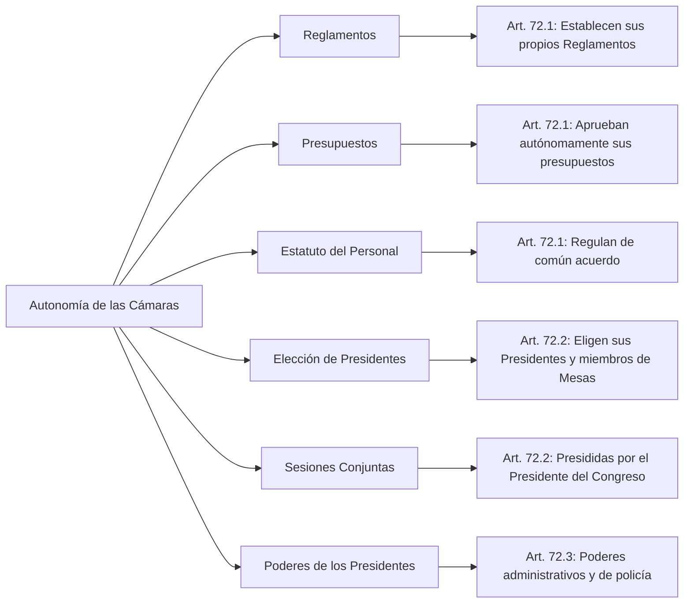
```mermaid
graph LR
    A[Autonomía de las Cámaras] --> B[Reglamentos]
    B --> B1[Art. 72.1: Establecen sus propios Reglamentos]

    A --> C[Presupuestos]
    C --> C1[Art. 72.1: Aprueban autónomamente sus presupuestos]

   A --> D[Estatuto del Personal]
    D --> D1[Art. 72.1: Regulan de común acuerdo]
    
    A --> E[Elección de Presidentes]
    E --> E1[Art. 72.2: Eligen sus Presidentes y miembros de Mesas]
    
    A --> F[Sesiones Conjuntas]
    F --> F1[Art. 72.2: Presididas por el Presidente del Congreso]
    
    A --> G[Poderes de los Presidentes]
    G --> G1[Art. 72.3: Poderes administrativos y de policía]
```
**Artículo 73.**

28. Las **Cámaras se reunirán anualmente en dos períodos ordinarios de sesiones:** el primero, de septiembre a diciembre, y el segundo, de febrero a junio.
    
29. Las Cámaras podrán reunirse en **sesiones extraordinarias** a petición del Gobierno, de la Diputación Permanente o de la mayoría absoluta de los miembros de cualquiera de las Cámaras. Las sesiones extraordinarias deberán convocarse sobre un orden del día determinado y serán clausuradas una vez que éste haya sido agotado.
    

💡 **Tip/Consejo:** Este artículo establece los **periodos ordinarios de sesiones** y la posibilidad de **sesiones extraordinarias** de las Cámaras. Es importante conocer la temporalidad del trabajo parlamentario y los mecanismos para convocar sesiones fuera del calendario regular.  
🔑 **Aspecto Clave:** Las **Cámaras se reúnen en dos periodos ordinarios y pueden celebrar sesiones extraordinarias bajo petición**.

   
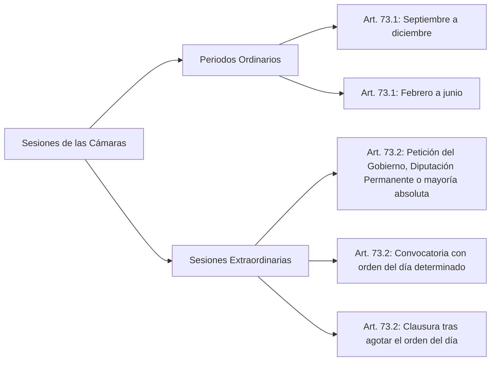
```mermaid
graph LR
    A[Sesiones de las Cámaras] --> B[Periodos Ordinarios]
    B --> B1[Art. 73.1: Septiembre a diciembre]
    B --> B2[Art. 73.1: Febrero a junio]
    
    A --> C[Sesiones Extraordinarias]
    C --> C1[Art. 73.2: Petición del Gobierno, Diputación Permanente o mayoría absoluta]
    C --> C2[Art. 73.2: Convocatoria con orden del día determinado]
    C --> C3[Art. 73.2: Clausura tras agotar el orden del día]
```
**Artículo 74.**

1.  Las **Cámaras se reunirán en sesión conjunta** para ejercer las competencias no legislativas que el Título II atribuye expresamente a las Cortes Generales.
2.  Las **decisiones de las Cortes Generales** previstas en los artículos 94, 1, 145, 2 y 158, 2, se adoptarán por mayoría de cada una de las Cámaras. En el primer caso, el procedimiento se iniciará por el Congreso, y en los otros dos, por el Senado. En ambos casos, si no hubiera acuerdo entre Senado y Congreso, se intentará obtener por una Comisión Mixta compuesta de igual número de Diputados y Senadores. La Comisión presentará un texto que será votado por ambas Cámaras. Si no se aprueba en la forma establecida, decidirá el Congreso por mayoría absoluta.

💡 ***Tip/Consejo:*** _Este artículo regula las **sesiones conjuntas** de las Cámaras, estableciendo que se reúnen para ejercer competencias no legislativas asignadas en el Título II y que ciertas decisiones se adoptan por mayoría en cada cámara, con un procedimiento para resolver desacuerdos entre Congreso y Senado._
🔑 ***Aspecto Clave:*** Las **Cámaras se reúnen en sesión conjunta para competencias no legislativas, decisiones por mayoría en cada cámara y procedimiento en caso de desacuerdo.**

```mermaid
graph LR
    A[Sesiones Conjuntas] --> B[Competencias No Legislativas]
    B --> B1[Art. 74.1: Ejercer competencias del Título II]
    
    A --> C[Decisiones]
     C --> C1[Art. 74.2: Mayoría de cada Cámara (Arts. 94.1, 145.2 y 158.2)]
     C --> C2[Art. 74.2: Procedimiento iniciado por Congreso (Art. 94.1)]
     C --> C3[Art. 74.2: Procedimiento iniciado por Senado (Arts. 145.2 y 158.2)]
    
    A --> D[Desacuerdo]
    D --> D1[Art. 74.2: Comisión Mixta]
    D --> D2[Art. 74.2: Decisión final por el Congreso por mayoría absoluta]
```

**Artículo 75.**

1.  Las **Cámaras funcionarán en Pleno y por Comisiones**.
2.  Las **Cámaras podrán delegar en las Comisiones Legislativas Permanentes la aprobación de proyectos o proposiciones de ley**. El Pleno podrá, no obstante, recabar en cualquier momento el debate y votación de cualquier proyecto o proposición de ley que haya sido objeto de esta delegación.
3.  Quedan exceptuados de lo dispuesto en el apartado anterior la reforma constitucional, las cuestiones internacionales, las leyes orgánicas y de bases y los Presupuestos Generales del Estado.

💡 ***Tip/Consejo:*** _Este artículo explica la **organización interna** de las Cámaras, que pueden funcionar en Pleno o a través de Comisiones. Se contempla la delegación de funciones legislativas en las comisiones, aunque el Pleno siempre puede recuperar el debate y votación. Se excluyen ciertas materias de la delegación, como reformas constitucionales o cuestiones internacionales._
🔑 ***Aspecto Clave:*** Las **Cámaras funcionan en Pleno y por Comisiones, pudiendo delegar en estas últimas la aprobación de leyes, con excepciones para ciertos temas clave.**
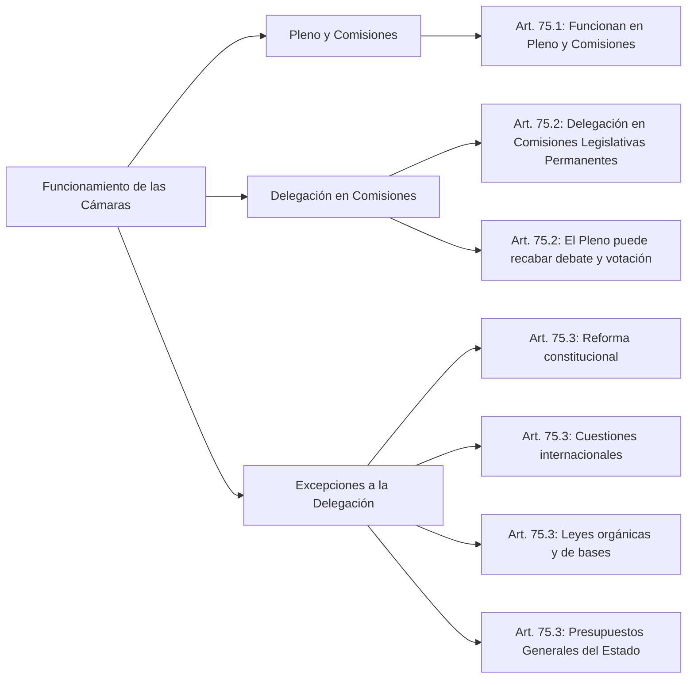
```mermaid
graph LR
    A[Funcionamiento de las Cámaras] --> B[Pleno y Comisiones]
    B --> B1[Art. 75.1: Funcionan en Pleno y Comisiones]
   
    A --> C[Delegación en Comisiones]
    C --> C1[Art. 75.2: Delegación en Comisiones Legislativas Permanentes]
    C --> C2[Art. 75.2: El Pleno puede recabar debate y votación]

    A --> D[Excepciones a la Delegación]
    D --> D1[Art. 75.3: Reforma constitucional]
    D --> D2[Art. 75.3: Cuestiones internacionales]
    D --> D3[Art. 75.3: Leyes orgánicas y de bases]
    D --> D4[Art. 75.3: Presupuestos Generales del Estado]
```

**Artículo 76.**

1.  El **Congreso y el Senado, y, en su caso, ambas Cámaras conjuntamente, podrán nombrar Comisiones de investigación sobre cualquier asunto de interés público**. Sus conclusiones no serán vinculantes para los Tribunales, ni afectarán a las resoluciones judiciales, sin perjuicio de que el resultado de la investigación sea comunicado al Ministerio Fiscal para el ejercicio, cuando proceda, de las acciones oportunas.
2.  **Será obligatorio comparecer a requerimiento de las Cámaras**. La ley regulará las sanciones que puedan imponerse por incumplimiento de esta obligación.

💡 ***Tip/Consejo:*** _Este artículo permite la creación de **Comisiones de investigación** por las Cámaras para investigar cualquier asunto de interés público, estableciendo la obligación de comparecer ante estas comisiones, aunque sus conclusiones no vinculan a los tribunales._
🔑 ***Aspecto Clave:*** Las **Cámaras pueden nombrar Comisiones de investigación sobre asuntos de interés público, con obligación de comparecer, pero sus conclusiones no son vinculantes para los Tribunales.**
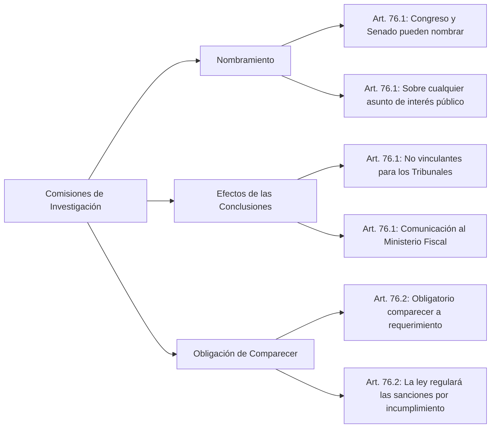
```mermaid
graph LR
    A[Comisiones de Investigación] --> B[Nombramiento]
    B --> B1[Art. 76.1: Congreso y Senado pueden nombrar]
    B --> B2[Art. 76.1: Sobre cualquier asunto de interés público]
    
    A --> C[Efectos de las Conclusiones]
    C --> C1[Art. 76.1: No vinculantes para los Tribunales]
    C --> C2[Art. 76.1: Comunicación al Ministerio Fiscal]
    
    A --> D[Obligación de Comparecer]
    D --> D1[Art. 76.2: Obligatorio comparecer a requerimiento]
    D --> D2[Art. 76.2: La ley regulará las sanciones por incumplimiento]
```

**Artículo 77.**

1.  Las **Cámaras pueden recibir peticiones individuales y colectivas, siempre por escrito**, quedando prohibida la presentación directa por manifestaciones ciudadanas.
2.  Las **Cámaras pueden remitir al Gobierno las peticiones que reciban**. El Gobierno está obligado a explicarse sobre su contenido, siempre que las Cámaras lo exijan.

💡 ***Tip/Consejo:*** _Este artículo reconoce el derecho de los ciudadanos a dirigir **peticiones** a las Cámaras, estableciendo que deben ser por escrito, y que las Cámaras pueden remitirlas al Gobierno, quien debe explicarse si se le requiere._
🔑 ***Aspecto Clave:*** Las **Cámaras pueden recibir peticiones escritas de ciudadanos y remitirlas al Gobierno, que debe explicarse si es requerido.**
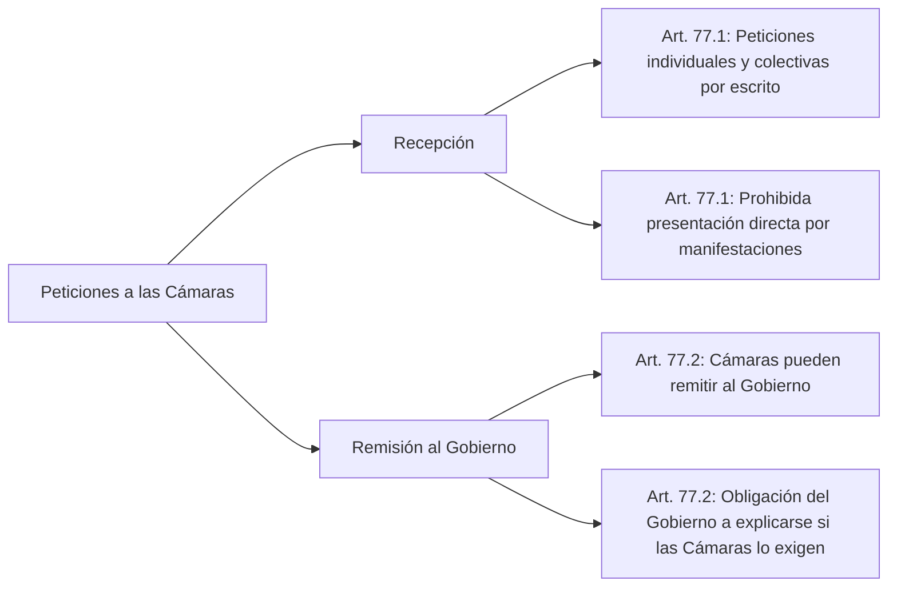
```mermaid
graph LR
    A[Peticiones a las Cámaras] --> B[Recepción]
    B --> B1[Art. 77.1: Peticiones individuales y colectivas por escrito]
    B --> B2[Art. 77.1: Prohibida presentación directa por manifestaciones]
    
    A --> C[Remisión al Gobierno]
    C --> C1[Art. 77.2: Cámaras pueden remitir al Gobierno]
    C --> C2[Art. 77.2: Obligación del Gobierno a explicarse si las Cámaras lo exigen]
```

**Artículo 78.**

1.  En cada Cámara habrá una **Diputación Permanente** compuesta por un mínimo de veintiún miembros, que representarán a los grupos parlamentarios, en proporción a su importancia numérica.
2.  Las Diputaciones Permanentes estarán presididas por el Presidente de la Cámara respectiva y tendrán como funciones la prevista en el artículo 73, la de asumir las facultades que correspondan a las Cámaras, de acuerdo con los artículos 86 y 116, en caso de que éstas hubieren sido disueltas o hubiere expirado su mandato, y la de velar por los poderes de las Cámaras cuando éstas no estén reunidas.
3.  Expirado el mandato o en caso de disolución, las Diputaciones Permanentes seguirán ejerciendo sus funciones hasta la constitución de las nuevas Cortes Generales.
4.  Reunida la Cámara correspondiente, la Diputación Permanente dará cuenta de los asuntos tratados y de sus decisiones.

💡 ***Tip/Consejo:*** _Este artículo regula la **Diputación Permanente** de cada Cámara, un órgano que continúa funcionando cuando las Cámaras no están en periodo de sesiones o han sido disueltas, garantizando la continuidad de la labor parlamentaria y la vigilancia de los poderes de la Cámara._
🔑 ***Aspecto Clave:*** La **Diputación Permanente actúa en periodos no ordinarios, asumiendo funciones de las Cámaras disueltas y vigilando sus poderes**.
```mermaid
graph LR
    A[Diputaciones Permanentes] --> B[Composición]
    B --> B1[Art. 78.1: Mínimo 21 miembros]
    B --> B2[Art. 78.1: Representación proporcional de grupos parlamentarios]
    
    A --> C[Funciones]
    C --> C1[Art. 78.2: Presididas por Presidente de la Cámara]
    C --> C2[Art. 78.2: Funciones del Art. 73]
    C --> C3[Art. 78.2: Asumir facultades en disolución (Art. 86 y 116)]
    C --> C4[Art. 78.2: Velar por poderes de las Cámaras]
    
    A --> D[Continuidad]
    D --> D1[Art. 78.3: Ejercen funciones hasta constitución de nuevas Cortes]
    
    A --> E[Información]
    E --> E1[Art. 78.4: Dan cuenta de asuntos tratados y decisiones]
```
**Artículo 79.**

1.  Para **adoptar acuerdos**, las Cámaras deben estar reunidas reglamentariamente y con asistencia de la mayoría de sus miembros.
2.  Dichos **acuerdos para ser válidos deberán ser aprobados por la mayoría de los miembros presentes**, sin perjuicio de las mayorías especiales que establezcan la Constitución o las leyes orgánicas y las que para elección de personas establezcan los Reglamentos de las Cámaras.
3.  El **voto de Senadores y Diputados es personal e indelegable**.

💡 ***Tip/Consejo:*** _Este artículo establece los **requisitos para la validez de los acuerdos** adoptados por las Cámaras, destacando la necesidad de que estén reunidas reglamentariamente con la asistencia de la mayoría de sus miembros y la regla general de mayoría simple, aunque se contemplan mayorías especiales y la no delegación del voto._
🔑 ***Aspecto Clave:*** Los **acuerdos de las Cámaras requieren reunión reglamentaria, mayoría de los presentes (salvo excepciones) y voto personal e indelegable**.
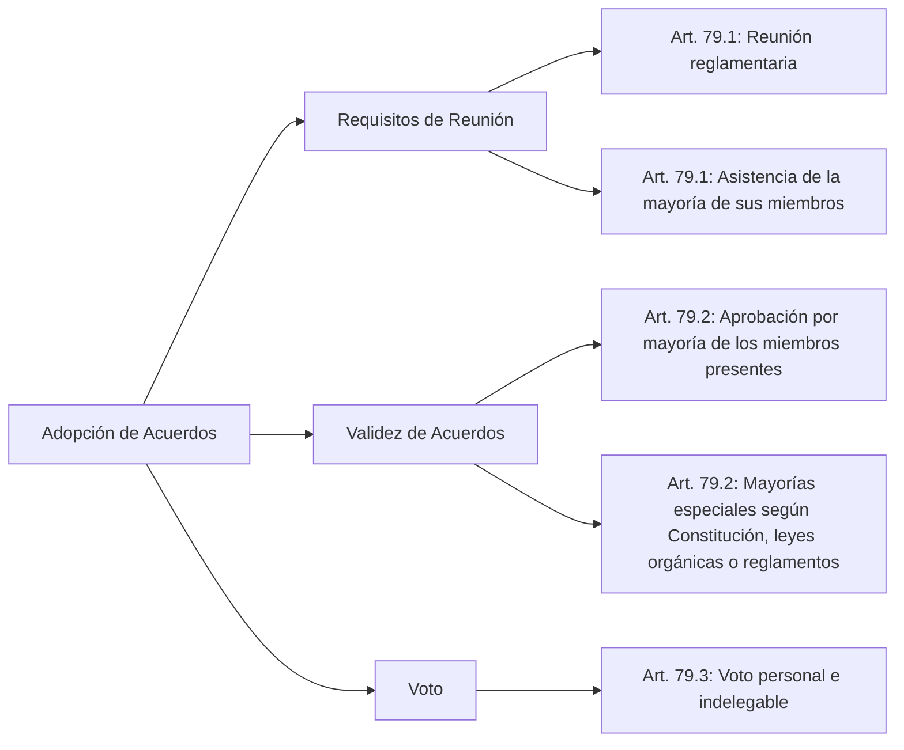
```mermaid
graph LR
    A[Adopción de Acuerdos] --> B[Requisitos de Reunión]
    B --> B1[Art. 79.1: Reunión reglamentaria]
    B --> B2[Art. 79.1: Asistencia de la mayoría de sus miembros]
    
    A --> C[Validez de Acuerdos]
    C --> C1[Art. 79.2: Aprobación por mayoría de los miembros presentes]
     C --> C2[Art. 79.2: Mayorías especiales según Constitución, leyes orgánicas o reglamentos]
    
    A --> D[Voto]
    D --> D1[Art. 79.3: Voto personal e indelegable]
```

**Artículo 80.**

Las **sesiones plenarias de las Cámaras serán públicas**, salvo acuerdo en contrario de cada Cámara, adoptado por mayoría absoluta o con arreglo al Reglamento.

💡 ***Tip/Consejo:*** _Este artículo establece el principio de **publicidad** de las sesiones plenarias de las Cámaras, garantizando la transparencia del proceso parlamentario, aunque se permite la excepción mediante acuerdo de la Cámara._
🔑 ***Aspecto Clave:*** Las **sesiones plenarias de las Cámaras son públicas, salvo acuerdo en contrario por mayoría absoluta o según el Reglamento**.
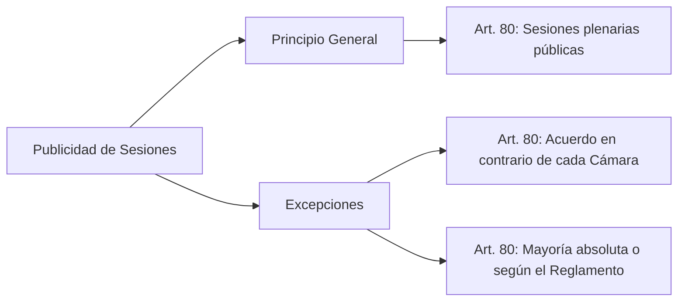
```mermaid
graph LR
   A[Publicidad de Sesiones] --> B[Principio General]
    B --> B1[Art. 80: Sesiones plenarias públicas]
  
   A --> C[Excepciones]
    C --> C1[Art. 80: Acuerdo en contrario de cada Cámara]
     C --> C2[Art. 80: Mayoría absoluta o según el Reglamento]
```
#### CAPÍTULO SEGUNDO
##### De la elaboración de las leyes

**Artículo 81.**

4.  Son **leyes orgánicas** las relativas al desarrollo de los **derechos fundamentales** y de las **libertades públicas**, las que aprueben los **Estatutos de Autonomía** y el **régimen electoral general** y las demás previstas en la Constitución.
5.  La aprobación, modificación o derogación de las leyes orgánicas exigirá **mayoría absoluta del Congreso**, en una votación final sobre el conjunto del proyecto.

💡 ***Tip/Consejo:*** _Este artículo define las **leyes orgánicas**, estableciendo su especial relevancia por tratar temas fundamentales como derechos y libertades, estatutos de autonomía y régimen electoral, y que requieren mayoría absoluta del Congreso para su aprobación o modificación._
🔑 ***Aspecto Clave:*** Las **leyes orgánicas son sobre derechos fundamentales, Estatutos de Autonomía y régimen electoral, y requieren mayoría absoluta en el Congreso.**
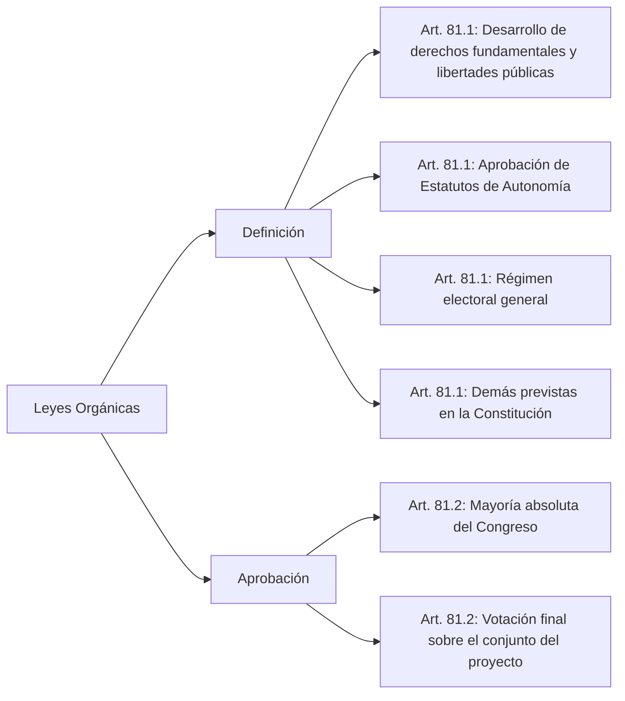
```mermaid
graph LR
  A[Leyes Orgánicas] --> B[Definición]
    B --> B1[Art. 81.1: Desarrollo de derechos fundamentales y libertades públicas]
    B --> B2[Art. 81.1: Aprobación de Estatutos de Autonomía]
    B --> B3[Art. 81.1: Régimen electoral general]
    B --> B4[Art. 81.1: Demás previstas en la Constitución]

  A --> C[Aprobación]
  C --> C1[Art. 81.2: Mayoría absoluta del Congreso]
  C --> C2[Art. 81.2: Votación final sobre el conjunto del proyecto]
```
**Artículo 82.**

6.  Las **Cortes Generales podrán delegar en el Gobierno la potestad de dictar normas con rango de ley** sobre materias determinadas no incluidas en el artículo anterior.
7.  La **delegación legislativa deberá otorgarse mediante una ley de bases** cuando su objeto sea la formación de textos articulados o por una **ley ordinaria** cuando se trate de refundir varios textos legales en uno solo.
8.  La delegación legislativa habrá de otorgarse al Gobierno de forma **expresa para materia concreta** y con **fijación del plazo para su ejercicio**. La delegación se agota por el uso que de ella haga el Gobierno mediante la publicación de la norma correspondiente. No podrá entenderse concedida de modo implícito o por tiempo indeterminado. Tampoco podrá permitir la subdelegación a autoridades distintas del propio Gobierno.
9.  Las **leyes de bases delimitarán con precisión el objeto y alcance de la delegación legislativa** y los principios y criterios que han de seguirse en su ejercicio.
10.  La **autorización para refundir textos legales** determinará el ámbito normativo a que se refiere el contenido de la delegación, especificando si se circunscribe a la mera formulación de un texto único o si se incluye la de regularizar, aclarar y armonizar los textos legales que han de ser refundidos.
11.  Sin perjuicio de la competencia propia de los Tribunales, las leyes de delegación podrán establecer en cada caso fórmulas adicionales de control.

💡 ***Tip/Consejo:*** _Este artículo regula la **delegación legislativa**, por la cual las Cortes pueden autorizar al Gobierno a dictar normas con rango de ley. La delegación debe ser expresa, para materias concretas, con fijación del plazo y mediante ley de bases o ley ordinaria según el caso. Se establecen límites y requisitos para garantizar el control parlamentario._
🔑 ***Aspecto Clave:*** Las **Cortes pueden delegar en el Gobierno la potestad de dictar normas con rango de ley mediante ley de bases o ley ordinaria, de forma expresa y con límites.**

```mermaid
graph LR
    A[Delegación Legislativa] --> B[Habilitación]
    B --> B1[Art. 82.1: Cortes Generales delegan en el Gobierno]
    B --> B2[Art. 82.1: Normas con rango de ley en materias no orgánicas]
  
    A --> C[Forma de Delegación]
    C --> C1[Art. 82.2: Ley ordinaria]
     C --> C2[Art. 82.2: Ley de bases (textos articulados)]
    
    A --> D[Requisitos]
    D --> D1[Art. 82.3: Expresa y para materia concreta]
     D --> D2[Art. 82.3: Fijación de plazo para ejercicio]
     D --> D3[Art. 82.3: Agotamiento por uso del Gobierno]
     D --> D4[Art. 82.3: Prohibida delegación implícita o por tiempo indeterminado]
     D --> D5[Art. 82.3: Prohibida subdelegación]
    
    A --> E[Leyes de Bases]
    E --> E1[Art. 82.4: Delimitan objeto y alcance de la delegación]
     E --> E2[Art. 82.4: Principios y criterios a seguir]
    
    A --> F[Refundición de Textos]
    F --> F1[Art. 82.5: Determinación del ámbito normativo]
     F --> F2[Art. 82.5: Especificación sobre formulación o regulación]
    
    A --> G[Control Adicional]
    G --> G1[Art. 82.6: Fórmulas adicionales de control en la ley de delegación]
```
**Artículo 83.**

Las **leyes de bases no podrán en ningún caso**:
* a) Autorizar la modificación de la propia ley de bases.
* b) Facultar para dictar normas con carácter retroactivo.

💡 ***Tip/Consejo:*** _Este artículo establece **límites a las leyes de bases** que se utilizan para la delegación legislativa. Estas leyes no pueden autorizar la modificación de sí mismas, ni facultar al Gobierno para dictar normas con carácter retroactivo._
🔑 ***Aspecto Clave:*** Las **leyes de bases no pueden autorizar su propia modificación ni facultar normas retroactivas**.
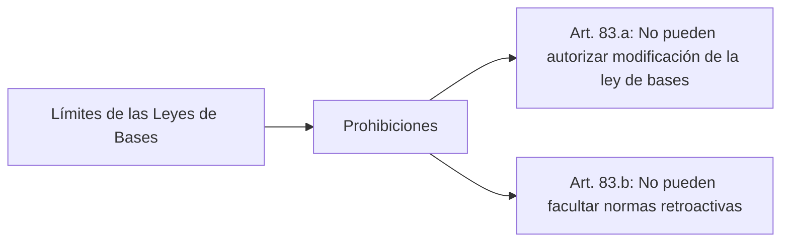
```mermaid
graph LR
    A[Límites de las Leyes de Bases] --> B[Prohibiciones]
    B --> B1[Art. 83.a: No pueden autorizar modificación de la ley de bases]
    B --> B2[Art. 83.b: No pueden facultar normas retroactivas]
```

**Artículo 84.**

Cuando una proposición de ley o una enmienda fuere contraria a una delegación legislativa en vigor, el **Gobierno está facultado para oponerse a su tramitación**. En tal supuesto, podrá presentarse una proposición de ley para la derogación total o parcial de la ley de delegación.

💡 ***Tip/Consejo:*** _Este artículo otorga al **Gobierno la facultad de oponerse a la tramitación** de proposiciones de ley o enmiendas que contravengan una delegación legislativa vigente, aunque se permite la presentación de una proposición de ley para la derogación de la delegación._
🔑 ***Aspecto Clave:*** El **Gobierno puede oponerse a la tramitación de proposiciones o enmiendas contrarias a una delegación legislativa, permitiéndose la derogación de la delegación.**
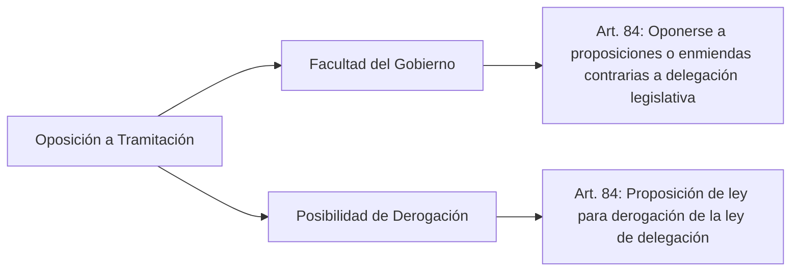
```mermaid
graph LR
    A[Oposición a Tramitación] --> B[Facultad del Gobierno]
    B --> B1[Art. 84: Oponerse a proposiciones o enmiendas contrarias a delegación legislativa]
    
    A --> C[Posibilidad de Derogación]
    C --> C1[Art. 84: Proposición de ley para derogación de la ley de delegación]
```
**Artículo 85.**

Las **disposiciones del Gobierno que contengan legislación delegada recibirán el título de Decretos Legislativos.**

💡 ***Tip/Consejo:*** _Este artículo establece que las normas que el Gobierno dicta en virtud de una delegación legislativa toman la forma de **Decretos Legislativos**._
🔑 ***Aspecto Clave:*** Las **disposiciones del Gobierno con legislación delegada se denominan Decretos Legislativos**.
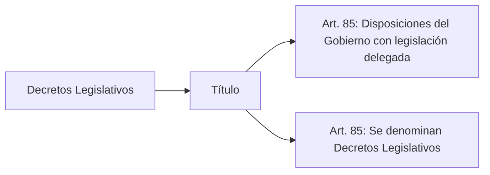
```mermaid
graph LR
    A[Decretos Legislativos] --> B[Título]
    B --> B1[Art. 85: Disposiciones del Gobierno con legislación delegada]
    B --> B2[Art. 85: Se denominan Decretos Legislativos]
```
**Artículo 86.**

1.  En caso de **extraordinaria y urgente necesidad, el Gobierno podrá dictar disposiciones legislativas provisionales que tomarán la forma de Decretos-leyes** y que no podrán afectar al ordenamiento de las instituciones básicas del Estado, a los derechos, deberes y libertades de los ciudadanos regulados en el Título I, al régimen de las Comunidades Autónomas ni al Derecho electoral general.
2.  Los **Decretos-leyes deberán ser inmediatamente sometidos a debate y votación de totalidad al Congreso de los Diputados**, convocado al efecto si no estuviere reunido, en el plazo de los treinta días siguientes a su promulgación. El Congreso habrá de pronunciarse expresamente dentro de dicho plazo sobre su convalidación o derogación, para lo cual el Reglamento establecerá un procedimiento especial y sumario.
3.  Durante el plazo establecido en el apartado anterior las Cortes podrán tramitarlos como proyectos de ley por el procedimiento de urgencia.

💡 ***Tip/Consejo:*** _Este artículo regula los **Decretos-leyes**, que el Gobierno puede dictar en casos de extraordinaria y urgente necesidad, estableciendo sus límites y la necesidad de convalidación por el Congreso en un plazo de 30 días. Este mecanismo permite al Gobierno actuar rápidamente, pero con control parlamentario posterior._
🔑 ***Aspecto Clave:*** El **Gobierno puede dictar Decretos-leyes en caso de urgencia, con límites y necesidad de convalidación por el Congreso en 30 días.**
```mermaid
graph LR
    A[Decretos-leyes] --> B[Habilitación]
    B --> B1[Art. 86.1: Extraordinaria y urgente necesidad]
    B --> B2[Art. 86.1: Disposiciones legislativas provisionales]
    
     A --> C[Límites]
     C --> C1[Art. 86.1: No afectan a instituciones básicas del Estado]
     C --> C2[Art. 86.1: No afectan a derechos, deberes y libertades del Título I]
    C --> C3[Art. 86.1: No afectan al régimen de las Comunidades Autónomas]
    C --> C4[Art. 86.1: No afectan al Derecho electoral general]

    A --> D[Convalidación]
    D --> D1[Art. 86.2: Debate y votación en el Congreso en 30 días]
    D --> D2[Art. 86.2: Congreso se pronuncia sobre convalidación o derogación]
    
    A --> E[Tramitación como Proyecto de Ley]
     E --> E1[Art. 86.3: Posibilidad de tramitación como proyecto de ley por procedimiento de urgencia]
```
**Artículo 87.**

4.  La **iniciativa legislativa corresponde al Gobierno, al Congreso y al Senado**, de acuerdo con la Constitución y los Reglamentos de las Cámaras.
5.  Las **Asambleas de las Comunidades Autónomas podrán solicitar del Gobierno la adopción de un proyecto de ley o remitir a la Mesa del Congreso una proposición de ley**, delegando ante dicha Cámara un máximo de tres miembros de la Asamblea encargados de su defensa.
6.  Una **ley orgánica regulará las formas de ejercicio y requisitos de la iniciativa popular** para la presentación de proposiciones de ley. En todo caso se exigirán no menos de 500.000 firmas acreditadas. No procederá dicha iniciativa en materias propias de ley orgánica, tributarias o de carácter internacional, ni en lo relativo a la prerrogativa de gracia.

💡 ***Tip/Consejo:*** _Este artículo regula la **iniciativa legislativa**, estableciendo que corresponde al Gobierno, al Congreso y al Senado. También se reconoce a las Asambleas de las CCAA y la iniciativa popular, con requisitos específicos, y se establecen límites para esta última._
🔑 ***Aspecto Clave:*** La **iniciativa legislativa corresponde al Gobierno, Congreso, Senado, Asambleas CCAA e iniciativa popular, con límites para esta última.**
```mermaid
graph LR
  A[Iniciativa Legislativa] --> B[Titulares]
    B --> B1[Art. 87.1: Gobierno]
    B --> B2[Art. 87.1: Congreso]
    B --> B3[Art. 87.1: Senado]

  A --> C[Iniciativa de CCAA]
     C --> C1[Art. 87.2: Solicitud al Gobierno o proposición al Congreso]
     C --> C2[Art. 87.2: Delegación de hasta tres miembros de la Asamblea]
 
  A --> D[Iniciativa Popular]
  D --> D1[Art. 87.3: Regulada por ley orgánica]
  D --> D2[Art. 87.3: Mínimo de 500.000 firmas acreditadas]
    D --> D3[Art. 87.3: No procede en materias de ley orgánica, tributarias, internacionales o prerrogativa de gracia]
```

**Artículo 88.**

Los **proyectos de ley serán aprobados en Consejo de Ministros**, que los someterá al Congreso, acompañados de una exposición de motivos y de los antecedentes necesarios para pronunciarse sobre ellos.

💡 ***Tip/Consejo:*** _Este artículo detalla que los **proyectos de ley** que promueve el Gobierno deben ser aprobados en Consejo de Ministros antes de ser remitidos al Congreso, junto con una exposición de motivos y los antecedentes relevantes._
🔑 ***Aspecto Clave:*** Los **proyectos de ley son aprobados por el Consejo de Ministros y enviados al Congreso con exposición de motivos y antecedentes.**
```mermaid
graph LR
    A[Proyectos de Ley] --> B[Aprobación]
    B --> B1[Art. 88: Aprobados por el Consejo de Ministros]
    
     A --> C[Presentación al Congreso]
     C --> C1[Art. 88: Con exposición de motivos y antecedentes]
```

**Artículo 89.**

7.  La **tramitación de las proposiciones de ley se regulará por los Reglamentos de las Cámaras**, sin que la prioridad debida a los proyectos de ley impida el ejercicio de la iniciativa legislativa en los términos regulados por el artículo 87.
8.  Las **proposiciones de ley que, de acuerdo con el artículo 87 tome en consideración el Senado, se remitirán al Congreso para su trámite en éste como tal proposición.**

💡 ***Tip/Consejo:*** _Este artículo regula la **tramitación de las proposiciones de ley**, indicando que se rigen por los reglamentos de las Cámaras, sin que la prioridad de los proyectos de ley impida el ejercicio de la iniciativa legislativa y que las proposiciones del Senado se remiten al Congreso._
🔑 ***Aspecto Clave:*** Las **proposiciones de ley se tramitan según los reglamentos de las Cámaras, sin que los proyectos tengan prioridad absoluta, y las del Senado van al Congreso.**
```mermaid
graph LR
    A[Tramitación de Proposiciones de Ley] --> B[Reglamentación]
    B --> B1[Art. 89.1: Regulada por los Reglamentos de las Cámaras]
   B --> B2[Art. 89.1: Proyectos de ley no impiden la iniciativa legislativa]

    A --> C[Proposiciones del Senado]
    C --> C1[Art. 89.2: Remitidas al Congreso]
    C --> C2[Art. 89.2: Tramitación como proposición]
```

**Artículo 90.**

9.  **Aprobado un proyecto de ley ordinaria u orgánica por el Congreso de los Diputados, su Presidente dará inmediata cuenta del mismo al Presidente del Senado, el cual lo someterá a la deliberación de éste.**
10.  El **Senado en el plazo de dos meses**, a partir del día de la recepción del texto, puede, mediante mensaje motivado, **oponer su veto o introducir enmiendas al mismo**. El veto deberá ser aprobado por mayoría absoluta. El proyecto no podrá ser sometido al Rey para sanción sin que el Congreso ratifique por mayoría absoluta, en caso de veto, el texto inicial, o por mayoría simple, una vez transcurridos dos meses desde la interposición del mismo, o se pronuncie sobre las enmiendas, aceptándolas o no por mayoría simple.
11.  El plazo de dos meses de que el Senado dispone para vetar o enmendar el proyecto se reducirá al de **veinte días naturales en los proyectos declarados urgentes** por el Gobierno o por el Congreso de los Diputados.

💡 ***Tip/Consejo:*** _Este artículo establece el **procedimiento legislativo bicameral**. Una vez aprobado un proyecto por el Congreso, pasa al Senado, que puede vetarlo o enmendarlo. El Congreso puede levantar el veto o pronunciarse sobre las enmiendas. Se establecen plazos y mayorías para este proceso._
🔑 ***Aspecto Clave:*** El **Senado puede vetar o enmendar proyectos del Congreso, con plazos y mayorías, y el Congreso decide finalmente.**
```mermaid
graph LR
    A[Procedimiento Legislativo Bicameral] --> B[Aprobación en el Congreso]
    B --> B1[Art. 90.1: Remisión al Senado]

    A --> C[Actuación del Senado]
     C --> C1[Art. 90.2: Dos meses para vetar o enmendar]
    C --> C2[Art. 90.2: Veto requiere mayoría absoluta]

    A --> D[Decisión del Congreso]
    D --> D1[Art. 90.2: Ratificación del texto inicial por mayoría absoluta en caso de veto]
     D --> D2[Art. 90.2: Ratificación por mayoría simple tras dos meses de veto]
    D --> D3[Art. 90.2: Pronunciamiento sobre enmiendas por mayoría simple]

   A --> E[Plazos en caso de Urgencia]
     E --> E1[Art. 90.3: Senado dispone de 20 días naturales si el proyecto es declarado urgente]
```
**Artículo 91.**

El **Rey sancionará en el plazo de quince días las leyes aprobadas por las Cortes Generales, y las promulgará y ordenará su inmediata publicación.**

💡 ***Tip/Consejo:*** _Este artículo establece el papel del **Rey en el proceso legislativo**, que consiste en la sanción, promulgación y orden de publicación de las leyes aprobadas por las Cortes Generales. La sanción real es un acto debido._
🔑 ***Aspecto Clave:*** El **Rey sanciona, promulga y ordena la publicación de las leyes en 15 días.**
```mermaid
graph LR
    A[Sanción Real] --> B[Acto Reglado]
    B --> B1[Art. 91: El Rey sanciona las leyes en 15 días]
    B --> B2[Art. 91: El Rey promulga y ordena su publicación]
```
**Artículo 92.**

12.  Las **decisiones políticas de especial trascendencia podrán ser sometidas a referéndum consultivo de todos los ciudadanos.**
13.  El **referéndum será convocado por el Rey, mediante propuesta del Presidente del Gobierno, previamente autorizada por el Congreso de los Diputados.**
14.  Una **ley orgánica regulará las condiciones y el procedimiento de las distintas modalidades de referéndum** previstas en esta Constitución.

💡 ***Tip/Consejo:*** _Este artículo regula el **referéndum consultivo**, un mecanismo para someter decisiones políticas de especial trascendencia a la consulta popular. La convocatoria requiere la propuesta del Presidente, autorización del Congreso y se regula por ley orgánica._
🔑 ***Aspecto Clave:*** Las **decisiones políticas trascendentes pueden someterse a referéndum consultivo, convocado por el Rey con propuesta del Presidente y autorización del Congreso.**
```mermaid
graph LR
    A[Referéndum Consultivo] --> B[Objeto]
    B --> B1[Art. 92.1: Decisiones políticas de especial trascendencia]
    
    A --> C[Convocatoria]
     C --> C1[Art. 92.2: Convocado por el Rey]
     C --> C2[Art. 92.2: Propuesta del Presidente del Gobierno]
     C --> C3[Art. 92.2: Autorización del Congreso de los Diputados]
    
    A --> D[Regulación]
      D --> D1[Art. 92.3: Ley orgánica regulará el procedimiento]
```
#### CAPÍTULO TERCERO
##### De los Tratados Internacionales

**Artículo 93.**

Mediante **ley orgánica se podrá autorizar la celebración de tratados por los que se atribuya a una organización o institución internacional el ejercicio de competencias derivadas de la Constitución**. Corresponde a las Cortes Generales o al Gobierno, según los casos, la garantía del cumplimiento de estos tratados y de las resoluciones emanadas de los organismos internacionales o supranacionales titulares de la cesión.

💡 ***Tip/Consejo:*** _Este artículo permite la **cesión de competencias a organizaciones internacionales** mediante ley orgánica, estableciendo la responsabilidad de las Cortes o el Gobierno en el cumplimiento de los tratados y resoluciones de estas organizaciones._
🔑 ***Aspecto Clave:*** La **cesión de competencias a organizaciones internacionales requiere ley orgánica y el cumplimiento del tratado es responsabilidad de las Cortes o el Gobierno.**
```mermaid
graph LR
    A[Cesión de Competencias] --> B[Autorización]
    B --> B1[Art. 93: Mediante ley orgánica]
    B --> B2[Art. 93: A organizaciones o instituciones internacionales]
    
     A --> C[Garantía de Cumplimiento]
     C --> C1[Art. 93: Cortes Generales o Gobierno, según los casos]
     C --> C2[Art. 93: De tratados y resoluciones emanadas de organismos internacionales]
```
**Artículo 94.**

15.  La **prestación del consentimiento del Estado para obligarse por medio de tratados o convenios requerirá la previa autorización de las Cortes Generales, en los siguientes casos**:
    *   a) Tratados de carácter político.
    *   b) Tratados o convenios de carácter militar.
    *   c) Tratados o convenios que afecten a la integridad territorial del Estado o a los derechos y deberes fundamentales establecidos en el Título I.
    *   d) Tratados o convenios que impliquen obligaciones financieras para la Hacienda Pública.
    *   e) Tratados o convenios que supongan modificación o derogación de alguna ley o exijan medidas legislativas para su ejecución.
16.  El **Congreso y el Senado serán inmediatamente informados de la conclusión de los restantes tratados o convenios**.

💡 ***Tip/Consejo:*** _Este artículo establece la **necesidad de autorización de las Cortes para ciertos tratados internacionales**, enumerando los casos en que esta autorización es obligatoria y la obligación de informar a las Cámaras sobre el resto._
🔑 ***Aspecto Clave:*** La **autorización de las Cortes es necesaria para tratados políticos, militares, que afecten a la integridad territorial o derechos fundamentales, obligaciones financieras o que requieran modificación de leyes.**
```mermaid
graph LR
    A[Autorización de Tratados] --> B[Requisitos]
    B --> B1[Art. 94.1: Autorización de las Cortes Generales]
    
    A --> C[Casos que requieren autorización]
     C --> C1[Art. 94.1.a: Tratados de carácter político]
    C --> C2[Art. 94.1.b: Tratados de carácter militar]
    C --> C3[Art. 94.1.c: Tratados que afectan a la integridad territorial o derechos fundamentales]
   C --> C4[Art. 94.1.d: Tratados con obligaciones financieras para la Hacienda Pública]
   C --> C5[Art. 94.1.e: Tratados que supongan modificación o derogación de alguna ley]

   A --> D[Obligación de Informar]
     D --> D1[Art. 94.2: Congreso y Senado informados de los restantes tratados o convenios]
```
**Artículo 95.**

17.  La **celebración de un tratado internacional que contenga estipulaciones contrarias a la Constitución exigirá la previa revisión constitucional**.
18.  El **Gobierno o cualquiera de las Cámaras puede requerir al Tribunal Constitucional para que declare si existe o no esa contradicción.**

💡 ***Tip/Consejo:*** _Este artículo establece la **supremacía de la Constitución** sobre los tratados internacionales, requiriendo la revisión constitucional si existe contradicción y otorgando legitimidad al Gobierno o a cualquiera de las Cámaras para requerir la intervención del Tribunal Constitucional._
🔑 ***Aspecto Clave:*** Los **tratados contrarios a la Constitución requieren revisión constitucional y el Gobierno o las Cámaras pueden requerir la intervención del Tribunal Constitucional.**
```mermaid
graph LR
    A[Tratados y Constitución] --> B[Revisión Constitucional]
    B --> B1[Art. 95.1: Necesaria si el tratado es contrario a la Constitución]
    
    A --> C[Control del TC]
    C --> C1[Art. 95.2: Gobierno o Cámaras pueden requerir al Tribunal Constitucional]
      C --> C2[Art. 95.2: Para que declare si existe contradicción]
```
**Artículo 96.**

19.  Los **tratados internacionales válidamente celebrados, una vez publicados oficialmente en España, formarán parte del ordenamiento interno**. Sus disposiciones sólo podrán ser derogadas, modificadas o suspendidas en la forma prevista en los propios tratados o de acuerdo con las normas generales del Derecho internacional.
20.  Para la **denuncia de los tratados y convenios internacionales se utilizará el mismo procedimiento previsto para su aprobación en el artículo 94.**

💡 ***Tip/Consejo:*** _Este artículo establece que los **tratados válidamente celebrados e incorporados al ordenamiento jurídico interno** tienen fuerza de ley, pudiendo ser derogados, modificados o suspendidos según lo establecido en el propio tratado o en el Derecho internacional. La denuncia de un tratado requiere el mismo procedimiento que su aprobación._
🔑 ***Aspecto Clave:*** Los **tratados válidos forman parte del ordenamiento interno, pudiendo ser modificados o denunciados según el tratado o el Derecho internacional, y la denuncia sigue el mismo procedimiento de aprobación.**
```mermaid
graph LR
    A[Incorporación de Tratados] --> B[Efectos]
    B --> B1[Art. 96.1: Forman parte del ordenamiento interno]
  
    A --> C[Derogación, Modificación y Suspensión]
    C --> C1[Art. 96.1: Según lo previsto en el tratado]
     C --> C2[Art. 96.1: Según las normas generales del Derecho internacional]

   A --> D[Denuncia de Tratados]
     D --> D1[Art. 96.2: Se utiliza el mismo procedimiento del Art. 94]
```

## TÍTULO IV
### Del Gobierno y de la Administración

**Artículo 97.**

El **Gobierno dirige la política interior y exterior, la Administración civil y militar y la defensa del Estado**. Ejerce la función ejecutiva y la potestad reglamentaria de acuerdo con la Constitución y las leyes.

💡 ***Tip/Consejo:*** _Este artículo establece las **funciones del Gobierno**, que incluyen la dirección de la política interior y exterior, la administración civil y militar, la defensa del Estado, el ejercicio de la función ejecutiva y la potestad reglamentaria, todo ello sujeto a la Constitución y las leyes._
🔑 ***Aspecto Clave:*** El **Gobierno dirige la política, la administración, la defensa y ejerce la función ejecutiva y la potestad reglamentaria, de acuerdo con la Constitución y las leyes.**
```mermaid
graph LR
  A[Funciones del Gobierno] --> B[Dirección Política]
    B --> B1[Art. 97: Política interior y exterior]
  
  A --> C[Administración]
    C --> C1[Art. 97: Administración civil y militar]
    C --> C2[Art. 97: Defensa del Estado]
  
  A --> D[Función Ejecutiva]
    D --> D1[Art. 97: Ejercicio de la función ejecutiva]
  
  A --> E[Potestad Reglamentaria]
    E --> E1[Art. 97: De acuerdo con la Constitución y las leyes]
```
**Artículo 98.**

21.  El **Gobierno se compone del Presidente, de los Vicepresidentes en su caso, de los Ministros y de los demás miembros que establezca la ley**.
22.  El **Presidente dirige la acción del Gobierno y coordina las funciones de los demás miembros del mismo**, sin perjuicio de la competencia y responsabilidad directa de éstos en su gestión.
23.  Los **miembros del Gobierno no podrán ejercer otras funciones representativas que las propias del mandato parlamentario, ni cualquier otra función pública que no derive de su cargo, ni actividad profesional o mercantil alguna**.
24.  La ley regulará el **estatuto e incompatibilidades de los miembros del Gobierno.**

💡 ***Tip/Consejo:*** _Este artículo detalla la **composición del Gobierno** (Presidente, Vicepresidentes, Ministros y otros), el **papel del Presidente** como director y coordinador, las **incompatibilidades** de los miembros y la remisión a la ley para regular su estatuto._
🔑 ***Aspecto Clave:*** El **Gobierno está compuesto por el Presidente, Vicepresidentes, Ministros y otros, el Presidente dirige y coordina, y existen incompatibilidades para sus miembros**.
```mermaid
graph LR
   A[Composición del Gobierno] --> B[Miembros]
    B --> B1[Art. 98.1: Presidente]
    B --> B2[Art. 98.1: Vicepresidentes]
    B --> B3[Art. 98.1: Ministros]
    B --> B4[Art. 98.1: Otros miembros según ley]
  
   A --> C[Funciones del Presidente]
   C --> C1[Art. 98.2: Dirige la acción del Gobierno]
   C --> C2[Art. 98.2: Coordina a los miembros]

   A --> D[Incompatibilidades]
   D --> D1[Art. 98.3: No otras funciones representativas]
     D --> D2[Art. 98.3: No otra función pública ajena al cargo]
     D --> D3[Art. 98.3: No actividad profesional o mercantil]

   A --> E[Regulación Legal]
     E --> E1[Art. 98.4: Ley regula estatuto e incompatibilidades]
```

**Artículo 99.**

25.  Después de cada renovación del Congreso de los Diputados, y en los demás supuestos constitucionales en que así proceda, el **Rey, previa consulta con los representantes designados por los Grupos políticos con representación parlamentaria, y a través del Presidente del Congreso, propondrá un candidato a la Presidencia del Gobierno.**
26.  El **candidato propuesto** conforme a lo previsto en el apartado anterior expondrá ante el Congreso de los Diputados el programa político del Gobierno que pretenda formar y solicitará la confianza de la Cámara.
27.  Si el **Congreso de los Diputados, por el voto de la mayoría absoluta de sus miembros, otorgare su confianza a dicho candidato, el Rey le nombrará Presidente.** De no alcanzarse dicha mayoría, se someterá la misma propuesta a nueva votación cuarenta y ocho horas después de la anterior, y la confianza se entenderá otorgada si obtuviere la mayoría simple.
28.  Si efectuadas las citadas votaciones no se otorgase la confianza para la investidura, se tramitarán sucesivas propuestas en la forma prevista en los apartados anteriores.
29.  Si transcurrido el plazo de dos meses, a partir de la primera votación de investidura, ningún candidato hubiere obtenido la confianza del Congreso, el **Rey disolverá ambas Cámaras y convocará nuevas elecciones con el refrendo del Presidente del Congreso.**

💡 ***Tip/Consejo:*** _Este artículo describe el **proceso de nombramiento del Presidente del Gobierno**, que incluye consultas del Rey, propuesta de un candidato, votación de investidura en el Congreso y, si falla, la disolución de las Cámaras._
🔑 ***Aspecto Clave:*** El **Rey propone candidato a Presidente tras consultas, el Congreso vota la investidura y, si falla, se disuelven las Cámaras.**
```mermaid
graph LR
   A[Nombramiento del Presidente] --> B[Propuesta del Rey]
     B --> B1[Art. 99.1: Consulta a grupos políticos con representación parlamentaria]
     B --> B2[Art. 99.1: Propuesta del candidato a través del Presidente del Congreso]
    
   A --> C[Investidura en el Congreso]
     C --> C1[Art. 99.2: Exposición del programa y solicitud de confianza]
     C --> C2[Art. 99.3: Mayoría absoluta para el nombramiento]
       C --> C3[Art. 99.3: Mayoría simple en segunda votación tras 48 horas si no hay mayoría absoluta]
       C --> C4[Art. 99.4: Sucesivas propuestas en caso de no obtenerse confianza]
    
   A --> D[Disolución de las Cámaras]
       D --> D1[Art. 99.5: Si ningún candidato obtiene confianza en 2 meses]
        D --> D2[Art. 99.5: Convocatoria de nuevas elecciones con el refrendo del Presidente del Congreso]
```
**Artículo 100.**

Los **demás miembros del Gobierno serán nombrados y separados por el Rey, a propuesta de su Presidente.**

💡 ***Tip/Consejo:*** _Este artículo establece que los **Ministros y demás miembros del Gobierno son nombrados y separados por el Rey a propuesta del Presidente del Gobierno**, siendo este último quien decide la composición del equipo de gobierno._
🔑 ***Aspecto Clave:*** Los **Ministros y otros miembros del Gobierno son nombrados y separados por el Rey a propuesta del Presidente.**
```mermaid
graph LR
    A[Nombramiento de Miembros del Gobierno] --> B[Propuesta del Presidente]
    B --> B1[Art. 100: Nombramiento por el Rey a propuesta del Presidente]
    
      A --> C[Separación de Miembros del Gobierno]
    C --> C1[Art. 100: Separación por el Rey a propuesta del Presidente]
```
**Artículo 101.**

30.  El **Gobierno cesa tras la celebración de elecciones generales, en los casos de pérdida de la confianza parlamentaria previstos en la Constitución, o por dimisión o fallecimiento de su Presidente.**
31.  El **Gobierno cesante continuará en funciones hasta la toma de posesión del nuevo Gobierno.**

💡 ***Tip/Consejo:*** _Este artículo detalla las **causas de cese del Gobierno**, que incluyen la celebración de elecciones generales, la pérdida de confianza parlamentaria o la dimisión o fallecimiento del Presidente. El Gobierno saliente continúa en funciones hasta el nombramiento del nuevo._
🔑 ***Aspecto Clave:*** El **Gobierno cesa por elecciones, pérdida de confianza, dimisión o fallecimiento del Presidente, y continúa en funciones hasta el nuevo nombramiento.**
```mermaid
graph LR
    A[Cese del Gobierno] --> B[Causas]
    B --> B1[Art. 101.1: Celebración de elecciones generales]
   B --> B2[Art. 101.1: Pérdida de confianza parlamentaria]
   B --> B3[Art. 101.1: Dimisión del Presidente]
   B --> B4[Art. 101.1: Fallecimiento del Presidente]
    
    A --> C[Continuidad]
     C --> C1[Art. 101.2: Gobierno cesante continúa en funciones hasta la toma de posesión del nuevo]
```
**Artículo 102.**

32.  La **responsabilidad criminal del Presidente y los demás miembros del Gobierno será exigible, en su caso, ante la Sala de lo Penal del Tribunal Supremo.**
33.  Si la **acusación fuere por traición o por cualquier delito contra la seguridad del Estado en el ejercicio de sus funciones, sólo podrá ser planteada por iniciativa de la cuarta parte de los miembros del Congreso**, y con la aprobación de la mayoría absoluta del mismo.
34.  La **prerrogativa real de gracia no será aplicable a ninguno de los supuestos del presente artículo.**

💡 ***Tip/Consejo:*** _Este artículo regula la **responsabilidad criminal del Presidente y los Ministros**, que se exige ante la Sala de lo Penal del Tribunal Supremo. Se establecen requisitos especiales para las acusaciones por traición o delitos contra la seguridad del Estado, y se excluye la prerrogativa de gracia._
🔑 ***Aspecto Clave:*** La **responsabilidad criminal del Gobierno se exige ante el Tribunal Supremo, con requisitos especiales para delitos contra la seguridad y sin aplicación de la prerrogativa de gracia.**
```mermaid
graph LR
   A[Responsabilidad Criminal del Gobierno] --> B[Competencia Judicial]
    B --> B1[Art. 102.1: Sala de lo Penal del Tribunal Supremo]
    
    A --> C[Acusación por Traición o Delitos contra la Seguridad del Estado]
    C --> C1[Art. 102.2: Iniciativa de la cuarta parte de los miembros del Congreso]
     C --> C2[Art. 102.2: Aprobación de la mayoría absoluta del Congreso]
    
    A --> D[Prerrogativa Real de Gracia]
     D --> D1[Art. 102.3: No aplicable en ningún supuesto]
```
**Artículo 103.**

35.  La **Administración Pública sirve con objetividad los intereses generales y actúa de acuerdo con los principios de eficacia, jerarquía,