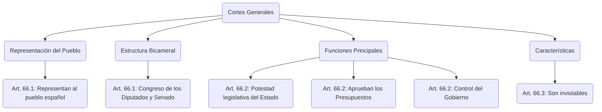

---
{"dg-publish":true,"dg-home":true,"permalink":"/opo-melilla/bloque-1/tema-1-constitucion-organizacion-politica-y-territorial-del-estado/","tags":["gardenEntry"],"dgPassFrontmatter":true}
---

# Constitución Española de 1978 - Títulos III, IV, V, VI y VIII

## TÍTULO III

### De las Cortes Generales

#### CAPÍTULO PRIMERO

**Artículo 66.**

1. Las **Cortes Generales representan al pueblo español** y están formadas por el **Congreso de los Diputados** y el **Senado**.
    
2. Las **Cortes Generales ejercen la potestad legislativa del Estado**, aprueban sus **Presupuestos**, **controlan la acción del Gobierno** y tienen las demás competencias que les atribuya la Constitución.
    
3. Las **Cortes Generales son inviolables**.
    

💡 **Tip/Consejo:** Este artículo establece la **naturaleza** y **funciones** de las Cortes Generales como representantes del pueblo español y principales órganos del Estado. Es crucial para entender cómo se ejerce la soberanía popular y se organiza el poder legislativo. Su inviolabilidad es un pilar de su independencia. Es importante recordar que las Cortes Generales son bicamerales (Congreso y Senado) y que estas cámaras tienen diferentes funciones y orígenes.  
🔑 **Aspecto Clave:** Las **Cortes Generales representan al pueblo español, ejercen la potestad legislativa, aprueban presupuestos, controlan al Gobierno y son inviolables**.

**Artículo 67.**

4. Nadie podrá ser miembro de las dos Cámaras simultáneamente, ni acumular el acta de una Asamblea de Comunidad Autónoma con la de Diputado al Congreso.
    
5. Los miembros de las Cortes Generales no estarán ligados por mandato imperativo.
    
6. Las reuniones de Parlamentarios que se celebren sin convocatoria reglamentaria no vincularán a las Cámaras, y no podrán ejercer sus funciones ni ostentar sus privilegios.
    

💡 **Tip/Consejo:** Este artículo establece las **incompatibilidades** y la **independencia** de los miembros de las Cortes. La prohibición de ser miembro de ambas cámaras y la no sujeción a mandato imperativo buscan garantizar la autonomía de cada parlamentario y la integridad del sistema. Las reuniones no reglamentarias carecen de valor oficial.  
🔑 **Aspecto Clave:** Los **miembros de las Cortes no pueden ser simultáneamente miembros de las dos Cámaras, ni estar ligados por mandato imperativo, y las reuniones no reglamentarias no vinculan a las Cámaras**.

      `mindmap   root((Miembros de las Cortes))     (Incompatibilidades)       [[Art. 67.1]] No pueden ser miembros de ambas Cámaras simultáneamente       [[Art. 67.1]] No pueden acumular acta de Asamblea de Comunidad Autónoma y Diputado al Congreso     (Independencia)       [[Art. 67.2]] No están ligados por mandato imperativo     (Reuniones no Reglamentarias)       [[Art. 67.3]] No vinculan a las Cámaras       [[Art. 67.3]] No pueden ejercer sus funciones ni ostentar sus privilegios`
    

content_copy download

Use code [with caution](https://support.google.com/legal/answer/13505487).Mermaid

**Artículo 68.**

7. El Congreso se compone de un **mínimo de 300 y un máximo de 400 Diputados**, elegidos por **sufragio universal, libre, igual, directo y secreto**, en los términos que establezca la ley.
    
8. La **circunscripción electoral es la provincia**. Las poblaciones de **Ceuta y Melilla estarán representadas cada una de ellas por un Diputado**. La ley distribuirá el número total de Diputados, asignando una representación mínima inicial a cada circunscripción y distribuyendo los demás en proporción a la población.
    
9. La elección se verificará en cada circunscripción atendiendo a **criterios de representación proporcional**.
    
10. El Congreso es elegido por **cuatro años**. El mandato de los Diputados termina cuatro años después de su elección o el día de la disolución de la Cámara.
    
11. Son electores y elegibles todos los españoles que estén en pleno uso de sus derechos políticos. La ley reconocerá y el Estado facilitará el ejercicio del derecho de sufragio a los españoles que se encuentren fuera del territorio de España.
    
12. Las elecciones tendrán lugar entre los treinta días y sesenta días desde la terminación del mandato. El Congreso electo deberá ser convocado dentro de los veinticinco días siguientes a la celebración de las elecciones.
    

💡 **Tip/Consejo:** Este artículo detalla la **composición** y **sistema electoral** del Congreso de los Diputados. Es fundamental entender que los diputados son elegidos por sufragio universal, libre, igual, directo y secreto, y que las provincias son las circunscripciones electorales. El principio de representación proporcional busca asegurar que las diferentes sensibilidades políticas estén representadas en el Congreso. La duración del mandato es de cuatro años.  
🔑 **Aspecto Clave:** El **Congreso se compone de 300-400 diputados elegidos por sufragio universal, la circunscripción es la provincia, la elección es por representación proporcional y el mandato es de cuatro años**.

      `mindmap   root((Congreso de los Diputados))     (Composición)       [[Art. 68.1]] Mínimo 300 y máximo 400 Diputados     (Sistema Electoral)       [[Art. 68.1]] Sufragio universal, libre, igual, directo y secreto       [[Art. 68.2]] Circunscripción electoral: provincia       [[Art. 68.3]] Representación proporcional     (Duración del Mandato)       [[Art. 68.4]] Cuatro años     (Derecho de Sufragio)         [[Art. 68.5]] Electores y elegibles: españoles en pleno uso de derechos políticos     (Convocatoria de Elecciones)       [[Art. 68.6]] Entre 30 y 60 días tras terminación del mandato       [[Art. 68.6]] Congreso electo convocado en 25 días tras elecciones`
    

content_copy download

Use code [with caution](https://support.google.com/legal/answer/13505487).Mermaid

**Artículo 69.**

13. El **Senado es la Cámara de representación territorial**.
    
14. En cada provincia se elegirán **cuatro Senadores** por sufragio universal, libre, igual, directo y secreto por los votantes de cada una de ellas, en los términos que señale una ley orgánica.
    
15. En las provincias insulares, cada isla o agrupación de ellas, con Cabildo o Consejo Insular, constituirá una circunscripción a efectos de elección de Senadores, correspondiendo tres a cada una de las islas mayores –Gran Canaria, Mallorca y Tenerife– y uno a cada una de las siguientes islas o agrupaciones: Ibiza-Formentera, Menorca, Fuerteventura, Gomera, Hierro, Lanzarote y La Palma.
    
16. Las poblaciones de **Ceuta y Melilla elegirán cada una de ellas dos Senadores**.
    
17. Las Comunidades Autónomas designarán además un Senador y otro más por cada millón de habitantes de su respectivo territorio. La designación corresponderá a la Asamblea legislativa o, en su defecto, al órgano colegiado superior de la Comunidad Autónoma, de acuerdo con lo que establezcan los Estatutos, que asegurarán, en todo caso, la adecuada representación proporcional.
    
18. El Senado es elegido por **cuatro años**. El mandato de los Senadores termina cuatro años después de su elección o el día de la disolución de la Cámara.
    

💡 **Tip/Consejo:** Este artículo define el **Senado** como la cámara de representación territorial, destacando que su composición incluye senadores elegidos directamente en las provincias, senadores por las islas y senadores designados por las Comunidades Autónomas. La diversidad en su origen y composición es clave para su función de representación territorial. La duración del mandato también es de cuatro años.  
🔑 **Aspecto Clave:** El **Senado es la Cámara de representación territorial, con senadores elegidos por provincias, islas y Comunidades Autónomas, y su mandato es de cuatro años**.

      `mindmap   root((Senado))     (Naturaleza)         [[Art. 69.1]] Cámara de representación territorial     (Elección por Provincias)       [[Art. 69.2]] Cuatro Senadores por provincia       [[Art. 69.2]] Sufragio universal, libre, igual, directo y secreto     (Elección por Islas)       [[Art. 69.3]] Tres Senadores por Gran Canaria, Mallorca y Tenerife       [[Art. 69.3]] Un Senador por Ibiza-Formentera, Menorca, Fuerteventura, Gomera, Hierro, Lanzarote y La Palma     (Designación por CCAA)       [[Art. 69.5]] Un Senador por CCAA       [[Art. 69.5]] Un Senador adicional por cada millón de habitantes       [[Art. 69.5]] Designación por Asamblea Legislativa o órgano colegiado superior     (Duración del Mandato)       [[Art. 69.6]] Cuatro años`
    

content_copy download

Use code [with caution](https://support.google.com/legal/answer/13505487).Mermaid

**Artículo 70.**

19. La ley electoral determinará las **causas de inelegibilidad e incompatibilidad de los Diputados y Senadores**, que comprenderán en todo caso:
    
    - a) A los componentes del Tribunal Constitucional.
        
    - b) A los altos cargos de la Administración del Estado que determine la ley, con la excepción de los miembros del Gobierno.
        
    - c) Al Defensor del Pueblo.
        
    - d) A los Magistrados, Jueces y Fiscales en activo.
        
    - e) A los militares profesionales y miembros de las Fuerzas y Cuerpos de Seguridad y Policía en activo.
        
    - f) A los miembros de las Juntas Electorales.
        
20. La validez de las actas y credenciales de los miembros de ambas Cámaras estará sometida al **control judicial**, en los términos que establezca la ley electoral.
    

💡 **Tip/Consejo:** Este artículo establece que una ley electoral determinará las **causas de inelegibilidad e incompatibilidad** para ser Diputado o Senador. Menciona varios grupos que no pueden ser miembros del Congreso o Senado para garantizar la independencia de las cámaras y evitar conflictos de interés. Además, la validez de las actas está sujeta a control judicial para asegurar la integridad del proceso electoral.  
🔑 **Aspecto Clave:** La **ley electoral determina las causas de inelegibilidad e incompatibilidad de Diputados y Senadores, incluyendo a ciertos cargos públicos, y la validez de las actas está sujeta a control judicial**.

      `mindmap   root((Inelegibilidad e Incompatibilidad))     (Determinación Legal)       [[Art. 70.1]] Ley electoral determina causas     (Causas de Inelegibilidad)       [[Art. 70.1.a]] Componentes del Tribunal Constitucional       [[Art. 70.1.b]] Altos cargos de la Administración del Estado       [[Art. 70.1.c]] Defensor del Pueblo       [[Art. 70.1.d]] Magistrados, Jueces y Fiscales en activo       [[Art. 70.1.e]] Militares profesionales y miembros de las Fuerzas y Cuerpos de Seguridad       [[Art. 70.1.f]] Miembros de las Juntas Electorales     (Control Judicial)         [[Art. 70.2]] Validez de las actas sometida a control judicial`
    

content_copy download

Use code [with caution](https://support.google.com/legal/answer/13505487).Mermaid

**Artículo 71.**

21. Los **Diputados y Senadores gozarán de inviolabilidad** por las opiniones manifestadas en el ejercicio de sus funciones.
    
22. Durante el período de su mandato los **Diputados y Senadores gozarán asimismo de inmunidad** y sólo podrán ser detenidos en caso de flagrante delito. No podrán ser inculpados ni procesados sin la previa autorización de la Cámara respectiva.
    
23. En las causas contra Diputados y Senadores será competente la Sala de lo Penal del Tribunal Supremo.