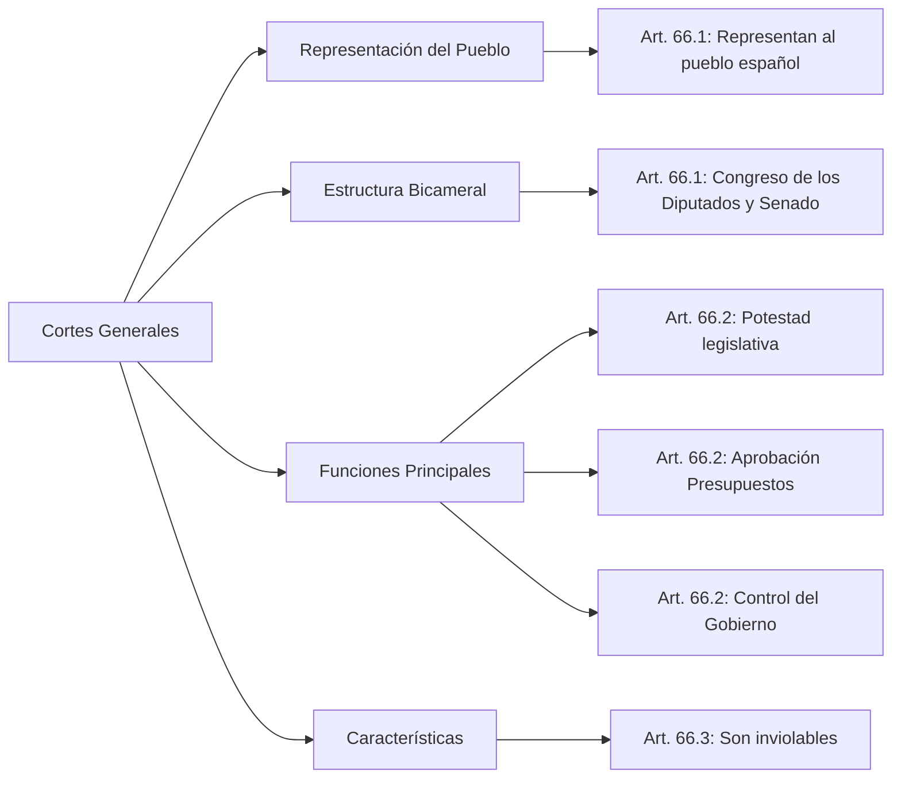
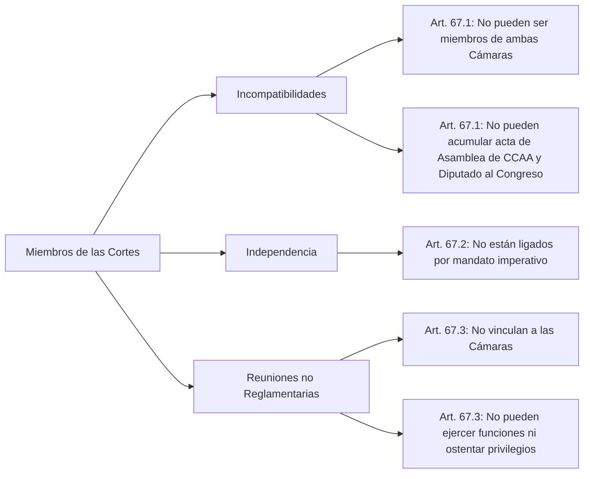
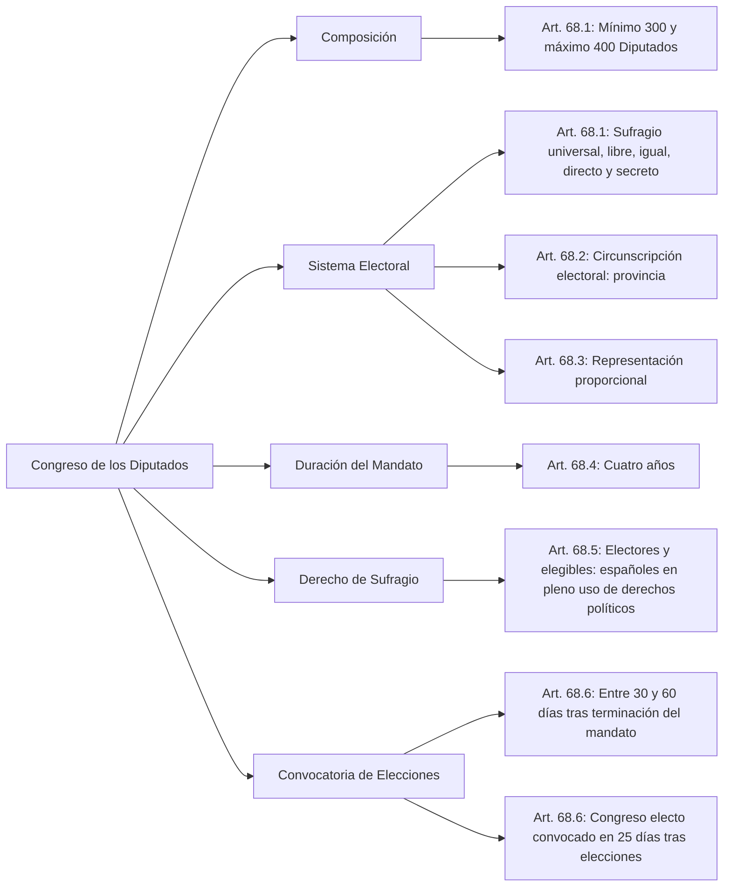

---
{"dg-publish":true,"dg-home":true,"permalink":"/opo-melilla/bloque-1/tema-1-constitucion-organizacion-politica-y-territorial-del-estado/","tags":["gardenEntry"],"dgPassFrontmatter":true}
---

# Constitución Española de 1978 - Títulos III, IV, V, VI y VIII

## TÍTULO III

### De las Cortes Generales

#### CAPÍTULO PRIMERO

**Artículo 66.**

1. Las **Cortes Generales representan al pueblo español** y están formadas por el **Congreso de los Diputados** y el **Senado**.
    
2. Las **Cortes Generales ejercen la potestad legislativa del Estado**, aprueban sus **Presupuestos**, **controlan la acción del Gobierno** y tienen las demás competencias que les atribuya la Constitución.
    
3. Las **Cortes Generales son inviolables**.
    

💡 **Tip/Consejo:** Este artículo establece la **naturaleza** y **funciones** de las Cortes Generales como representantes del pueblo español y principales órganos del Estado. Es crucial para entender cómo se ejerce la soberanía popular y se organiza el poder legislativo. Su inviolabilidad es un pilar de su independencia. Es importante recordar que las Cortes Generales son bicamerales (Congreso y Senado) y que estas cámaras tienen diferentes funciones y orígenes.  
🔑 **Aspecto Clave:** Las **Cortes Generales representan al pueblo español, ejercen la potestad legislativa, aprueban presupuestos, controlan al Gobierno y son inviolables**.

    

**Artículo 67.**

4. Nadie podrá ser miembro de las dos Cámaras simultáneamente, ni acumular el acta de una Asamblea de Comunidad Autónoma con la de Diputado al Congreso.
    
5. Los miembros de las Cortes Generales no estarán ligados por mandato imperativo.
    
6. Las reuniones de Parlamentarios que se celebren sin convocatoria reglamentaria no vincularán a las Cámaras, y no podrán ejercer sus funciones ni ostentar sus privilegios.
    

💡 **Tip/Consejo:** Este artículo establece las **incompatibilidades** y la **independencia** de los miembros de las Cortes. La prohibición de ser miembro de ambas cámaras y la no sujeción a mandato imperativo buscan garantizar la autonomía de cada parlamentario y la integridad del sistema. Las reuniones no reglamentarias carecen de valor oficial.  
🔑 **Aspecto Clave:** Los **miembros de las Cortes no pueden ser simultáneamente miembros de las dos Cámaras, ni estar ligados por mandato imperativo, y las reuniones no reglamentarias no vinculan a las Cámaras**.

    

**Artículo 68.**

7. El Congreso se compone de un **mínimo de 300 y un máximo de 400 Diputados**, elegidos por **sufragio universal, libre, igual, directo y secreto**, en los términos que establezca la ley.
    
8. La **circunscripción electoral es la provincia**. Las poblaciones de **Ceuta y Melilla estarán representadas cada una de ellas por un Diputado**. La ley distribuirá el número total de Diputados, asignando una representación mínima inicial a cada circunscripción y distribuyendo los demás en proporción a la población.
    
9. La elección se verificará en cada circunscripción atendiendo a **criterios de representación proporcional**.
    
10. El Congreso es elegido por **cuatro años**. El mandato de los Diputados termina cuatro años después de su elección o el día de la disolución de la Cámara.
    
11. Son electores y elegibles todos los españoles que estén en pleno uso de sus derechos políticos. La ley reconocerá y el Estado facilitará el ejercicio del derecho de sufragio a los españoles que se encuentren fuera del territorio de España.
    
12. Las elecciones tendrán lugar entre los treinta días y sesenta días desde la terminación del mandato. El Congreso electo deberá ser convocado dentro de los veinticinco días siguientes a la celebración de las elecciones.
    

💡 **Tip/Consejo:** Este artículo detalla la **composición** y **sistema electoral** del Congreso de los Diputados. Es fundamental entender que los diputados son elegidos por sufragio universal, libre, igual, directo y secreto, y que las provincias son las circunscripciones electorales. El principio de representación proporcional busca asegurar que las diferentes sensibilidades políticas estén representadas en el Congreso. La duración del mandato es de cuatro años.  
🔑 **Aspecto Clave:** El **Congreso se compone de 300-400 diputados elegidos por sufragio universal, la circunscripción es la provincia, la elección es por representación proporcional y el mandato es de cuatro años**.

**Artículo 69.**

13. El **Senado es la Cámara de representación territorial**.
    
14. En cada provincia se elegirán **cuatro Senadores** por sufragio universal, libre, igual, directo y secreto por los votantes de cada una de ellas, en los términos que señale una ley orgánica.
    
15. En las provincias insulares, cada isla o agrupación de ellas, con Cabildo o Consejo Insular, constituirá una circunscripción a efectos de elección de Senadores, correspondiendo tres a cada una de las islas mayores –Gran Canaria, Mallorca y Tenerife– y uno a cada una de las siguientes islas o agrupaciones: Ibiza-Formentera, Menorca, Fuerteventura, Gomera, Hierro, Lanzarote y La Palma.
    
16. Las poblaciones de **Ceuta y Melilla elegirán cada una de ellas dos Senadores**.
    
17. Las Comunidades Autónomas designarán además un Senador y otro más por cada millón de habitantes de su respectivo territorio. La designación corresponderá a la Asamblea legislativa o, en su defecto, al órgano colegiado superior de la Comunidad Autónoma, de acuerdo con lo que establezcan los Estatutos, que asegurarán, en todo caso, la adecuada representación proporcional.
    
18. El Senado es elegido por **cuatro años**. El mandato de los Senadores termina cuatro años después de su elección o el día de la disolución de la Cámara.
    

💡 **Tip/Consejo:** Este artículo define el **Senado** como la cámara de representación territorial, destacando que su composición incluye senadores elegidos directamente en las provincias, senadores por las islas y senadores designados por las Comunidades Autónomas. La diversidad en su origen y composición es clave para su función de representación territorial. La duración del mandato también es de cuatro años.  
🔑 **Aspecto Clave:** El **Senado es la Cámara de representación territorial, con senadores elegidos por provincias, islas y Comunidades Autónomas, y su mandato es de cuatro años**.

      `graph LR     A[Senado] --> B[Naturaleza]     B --> B1[Art. 69.1: Cámara de representación territorial]      A --> C[Elección por Provincias]     C --> C1[Art. 69.2: Cuatro Senadores por provincia]     C --> C2[Art. 69.2: Sufragio universal, libre, igual, directo y secreto]         A --> D[Elección por Islas]    D --> D1[Art. 69.3: Tres Senadores por Gran Canaria, Mallorca y Tenerife]    D --> D2[Art. 69.3: Un Senador por Ibiza-Formentera, Menorca, Fuerteventura, Gomera, Hierro, Lanzarote y La Palma]          A --> E[Designación por CCAA]     E --> E1[Art. 69.5: Un Senador por CCAA]     E --> E2[Art. 69.5: Un Senador adicional por cada millón de habitantes]      E --> E3[Art. 69.5: Designación por Asamblea Legislativa o órgano colegiado superior]          A --> F[Duración del Mandato]     F --> F1[Art. 69.6: Cuatro años]`
    

content_copy download

Use code [with caution](https://support.google.com/legal/answer/13505487).Mermaid

**Artículo 70.**

19. La ley electoral determinará las **causas de inelegibilidad e incompatibilidad de los Diputados y Senadores**, que comprenderán en todo caso:
    
    - a) A los componentes del Tribunal Constitucional.
        
    - b) A los altos cargos de la Administración del Estado que determine la ley, con la excepción de los miembros del Gobierno.
        
    - c) Al Defensor del Pueblo.
        
    - d) A los Magistrados, Jueces y Fiscales en activo.
        
    - e) A los militares profesionales y miembros de las Fuerzas y Cuerpos de Seguridad y Policía en activo.
        
    - f) A los miembros de las Juntas Electorales.
        
20. La validez de las actas y credenciales de los miembros de ambas Cámaras estará sometida al **control judicial**, en los términos que establezca la ley electoral.
    

💡 **Tip/Consejo:** Este artículo establece que una ley electoral determinará las **causas de inelegibilidad e incompatibilidad** para ser Diputado o Senador. Menciona varios grupos que no pueden ser miembros del Congreso o Senado para garantizar la independencia de las cámaras y evitar conflictos de interés. Además, la validez de las actas está sujeta a control judicial para asegurar la integridad del proceso electoral.  
🔑 **Aspecto Clave:** La **ley electoral determina las causas de inelegibilidad e incompatibilidad de Diputados y Senadores, incluyendo a ciertos cargos públicos, y la validez de las actas está sujeta a control judicial**.

      `graph LR     A[Inelegibilidad e Incompatibilidad] --> B[Determinación Legal]     B --> B1[Art. 70.1: Ley electoral determina causas]          A --> C[Causas de Inelegibilidad]     C --> C1[Art. 70.1.a: Componentes del Tribunal Constitucional]     C --> C2[Art. 70.1.b: Altos cargos de la Administración del Estado]     C --> C3[Art. 70.1.c: Defensor del Pueblo]     C --> C4[Art. 70.1.d: Magistrados, Jueces y Fiscales en activo]     C --> C5[Art. 70.1.e: Militares y miembros de las Fuerzas y Cuerpos de Seguridad]     C --> C6[Art. 70.1.f: Miembros de las Juntas Electorales]          A --> D[Control Judicial]     D --> D1[Art. 70.2: Validez de las actas sometida a control judicial]`
    

content_copy download

Use code [with caution](https://support.google.com/legal/answer/13505487).Mermaid

**Artículo 71.**

21. Los **Diputados y Senadores gozarán de inviolabilidad** por las opiniones manifestadas en el ejercicio de sus funciones.
    
22. Durante el período de su mandato los **Diputados y Senadores gozarán asimismo de inmunidad** y sólo podrán ser detenidos en caso de flagrante delito. No podrán ser inculpados ni procesados sin la previa autorización de la Cámara respectiva.
    
23. En las causas contra Diputados y Senadores será competente la Sala de lo Penal del Tribunal Supremo.
    
24. Los **Diputados y Senadores percibirán una asignación** que será fijada por las respectivas Cámaras.
    

💡 **Tip/Consejo:** Este artículo establece las **prerrogativas** de los parlamentarios. La inviolabilidad protege a los Diputados y Senadores por las opiniones expresadas en el ejercicio de sus funciones, mientras que la inmunidad protege contra la detención y el procesamiento sin autorización de la Cámara. La asignación económica busca asegurar la independencia económica de los representantes.  
🔑 **Aspecto Clave:** Los **Diputados y Senadores tienen inviolabilidad por sus opiniones, inmunidad durante su mandato y perciben una asignación fijada por las Cámaras.**

      `graph LR     A[Prerrogativas Parlamentarias] --> B[Inviolabilidad]     B --> B1[Art. 71.1: Por opiniones manifestadas en funciones]      A --> C[Inmunidad]     C --> C1[Art. 71.2: Detención solo en flagrante delito]      C --> C2[Art. 71.2: Inculpación y procesamiento con autorización de la Cámara]         A --> D[Competencia Judicial]     D --> D1[Art. 71.3: Sala de lo Penal del Tribunal Supremo]          A --> E[Asignación]    E --> E1[Art. 71.4: Fijada por las Cámaras]`
    

content_copy download

Use code [with caution](https://support.google.com/legal/answer/13505487).Mermaid

**Artículo 72.**

25. Las **Cámaras establecen sus propios Reglamentos**, aprueban autónomamente sus **presupuestos** y, de común acuerdo, regulan el **Estatuto del Personal de las Cortes Generales**. Los Reglamentos y su reforma serán sometidos a una votación final sobre su totalidad, que requerirá la mayoría absoluta.
    
26. Las **Cámaras eligen sus respectivos Presidentes** y los demás miembros de sus Mesas. Las sesiones conjuntas serán presididas por el Presidente del Congreso y se regirán por un Reglamento de las Cortes Generales aprobado por mayoría absoluta de cada Cámara.
    
27. Los **Presidentes de las Cámaras ejercen en nombre de las mismas todos los poderes administrativos** y facultades de policía en el interior de sus respectivas sedes.
    

💡 **Tip/Consejo:** Este artículo establece la **autonomía** de las Cámaras en la regulación de su funcionamiento. Cada cámara tiene potestad para establecer su propio reglamento, aprobar sus presupuestos y regular el estatuto del personal. También regula la elección de los presidentes y miembros de las mesas, así como el funcionamiento de las sesiones conjuntas.  
🔑 **Aspecto Clave:** Las **Cámaras establecen sus Reglamentos, aprueban sus presupuestos, eligen sus Presidentes y regulan el estatuto de su personal.**

      `graph LR     A[Autonomía de las Cámaras] --> B[Reglamentos]     B --> B1[Art. 72.1: Establecen sus propios Reglamentos]      A --> C[Presupuestos]     C --> C1[Art. 72.1: Aprueban autónomamente sus presupuestos]     A --> D[Estatuto del Personal]     D --> D1[Art. 72.1: Regulan de común acuerdo]          A --> E[Elección de Presidentes]     E --> E1[Art. 72.2: Eligen sus Presidentes y miembros de Mesas]          A --> F[Sesiones Conjuntas]     F --> F1[Art. 72.2: Presididas por el Presidente del Congreso]          A --> G[Poderes de los Presidentes]     G --> G1[Art. 72.3: Poderes administrativos y de policía]`
    

content_copy download

Use code [with caution](https://support.google.com/legal/answer/13505487).Mermaid

**Artículo 73.**

28. Las **Cámaras se reunirán anualmente en dos períodos ordinarios de sesiones:** el primero, de septiembre a diciembre, y el segundo, de febrero a junio.
    
29. Las Cámaras podrán reunirse en **sesiones extraordinarias** a petición del Gobierno, de la Diputación Permanente o de la mayoría absoluta de los miembros de cualquiera de las Cámaras. Las sesiones extraordinarias deberán convocarse sobre un orden del día determinado y serán clausuradas una vez que éste haya sido agotado.
    

💡 **Tip/Consejo:** Este artículo establece los **periodos ordinarios de sesiones** y la posibilidad de **sesiones extraordinarias** de las Cámaras. Es importante conocer la temporalidad del trabajo parlamentario y los mecanismos para convocar sesiones fuera del calendario regular.  
🔑 **Aspecto Clave:** Las **Cámaras se reúnen en dos periodos ordinarios y pueden celebrar sesiones extraordinarias bajo petición**.

      `graph LR     A[Sesiones de las Cámaras] --> B[Periodos Ordinarios]     B --> B1[Art. 73.1: Septiembre a diciembre]     B --> B2[Art. 73.1: Febrero a junio]          A --> C[Sesiones Extraordinarias]     C --> C1[Art. 73.2: Petición del Gobierno, Diputación Permanente o mayoría absoluta]     C --> C2[Art. 73.2: Convocatoria con orden del día determinado]     C --> C3[Art. 73.2: Clausura tras agotar el orden del día]`
    

content_copy download

Use code [with caution](https://support.google.com/legal/answer/13505487).Mermaid

**Artículo 74.**

30. Las **Cámaras se reunirán en sesión conjunta** para ejercer las competencias no legislativas que el Título II atribuye expresamente a las Cortes Generales.
    
31. Las **decisiones de las Cortes Generales** previstas en los artículos 94, 1, 145, 2 y 158, 2, se adoptarán por mayoría de cada una de las Cámaras. En el primer caso, el procedimiento se iniciará por el Congreso, y en los otros dos, por el Senado. En ambos casos, si no hubiera acuerdo entre Senado y Congreso, se intentará obtener por una Comisión Mixta compuesta de igual número de Diputados y Senadores. La Comisión presentará un texto que será votado por ambas Cámaras. Si no se aprueba en la forma establecida, decidirá el Congreso por mayoría absoluta.
    

💡 **Tip/Consejo:** Este artículo regula las **sesiones conjuntas** de las Cámaras, estableciendo que se reúnen para ejercer competencias no legislativas asignadas en el Título II y que ciertas decisiones se adoptan por mayoría en cada cámara, con un procedimiento para resolver desacuerdos entre Congreso y Senado.  
🔑 **Aspecto Clave:** Las **Cámaras se reúnen en sesión conjunta para competencias no legislativas, decisiones por mayoría en cada cámara y procedimiento en caso de desacuerdo.**

      `graph LR     A[Sesiones Conjuntas] --> B[Competencias No Legislativas]     B --> B1[Art. 74.1: Ejercer competencias del Título II]          A --> C[Decisiones]     C --> C1[Art. 74.2: Mayoría de cada Cámara (Art. 94, 1, 145, 2 y 158, 2)]      C --> C2[Art. 74.2: Procedimiento iniciado por Congreso (Art. 94)]       C --> C3[Art. 74.2: Procedimiento iniciado por Senado (Art. 145 y 158)]        A --> D[Desacuerdo]     D --> D1[Art. 74.2: Comisión Mixta]     D --> D2[Art. 74.2: Decisión final por el Congreso por mayoría absoluta]`
    

content_copy download

Use code [with caution](https://support.google.com/legal/answer/13505487).Mermaid

**Artículo 75.**

32. Las **Cámaras funcionarán en Pleno y por Comisiones**.
    
33. Las **Cámaras podrán delegar en las Comisiones Legislativas Permanentes la aprobación de proyectos o proposiciones de ley**. El Pleno podrá, no obstante, recabar en cualquier momento el debate y votación de cualquier proyecto o proposición de ley que haya sido objeto de esta delegación.
    
34. Quedan exceptuados de lo dispuesto en el apartado anterior la reforma constitucional, las cuestiones internacionales, las leyes orgánicas y de bases y los Presupuestos Generales del Estado.
    

💡 **Tip/Consejo:** Este artículo explica la **organización interna** de las Cámaras, que pueden funcionar en Pleno o a través de Comisiones. Se contempla la delegación de funciones legislativas en las comisiones, aunque el Pleno siempre puede recuperar el debate y votación. Se excluyen ciertas materias de la delegación, como reformas constitucionales o cuestiones internacionales.  
🔑 **Aspecto Clave:** Las **Cámaras funcionan en Pleno y por Comisiones, pudiendo delegar en estas últimas la aprobación de leyes, con excepciones para ciertos temas clave.**

      `graph LR     A[Funcionamiento de las Cámaras] --> B[Pleno y Comisiones]     B --> B1[Art. 75.1: Funcionan en Pleno y Comisiones]         A --> C[Delegación en Comisiones]     C --> C1[Art. 75.2: Delegación en Comisiones Legislativas Permanentes]     C --> C2[Art. 75.2: El Pleno puede recabar debate y votación]      A --> D[Excepciones a la Delegación]     D --> D1[Art. 75.3: Reforma constitucional]     D --> D2[Art. 75.3: Cuestiones internacionales]     D --> D3[Art. 75.3: Leyes orgánicas y de bases]     D --> D4[Art. 75.3: Presupuestos Generales del Estado]`
    

content_copy download

Use code [with caution](https://support.google.com/legal/answer/13505487).Mermaid

**Artículo 76.**

35. El **Congreso y el Senado, y, en su caso, ambas Cámaras conjuntamente, podrán nombrar Comisiones de investigación sobre cualquier asunto de interés público**. Sus conclusiones no serán vinculantes para los Tribunales, ni afectarán a las resoluciones judiciales, sin perjuicio de que el resultado de la investigación sea comunicado al Ministerio Fiscal para el ejercicio, cuando proceda, de las acciones oportunas.
    
36. **Será obligatorio comparecer a requerimiento de las Cámaras**. La ley regulará las sanciones que puedan imponerse por incumplimiento de esta obligación.
    

💡 **Tip/Consejo:** Este artículo permite la creación de **Comisiones de investigación** por las Cámaras para investigar cualquier asunto de interés público, estableciendo la obligación de comparecer ante estas comisiones, aunque sus conclusiones no vinculan a los tribunales.  
🔑 **Aspecto Clave:** Las **Cámaras pueden nombrar Comisiones de investigación sobre asuntos de interés público, con obligación de comparecer, pero sus conclusiones no son vinculantes para los Tribunales.**

      `graph LR     A[Comisiones de Investigación] --> B[Nombramiento]     B --> B1[Art. 76.1: Congreso y Senado pueden nombrar]     B --> B2[Art. 76.1: Sobre cualquier asunto de interés público]          A --> C[Efectos de las Conclusiones]     C --> C1[Art. 76.1: No vinculantes para los Tribunales]     C --> C2[Art. 76.1: Comunicación al Ministerio Fiscal]          A --> D[Obligación de Comparecer]     D --> D1[Art. 76.2: Obligatorio comparecer a requerimiento]     D --> D2[Art. 76.2: La ley regulará las sanciones por incumplimiento]`
    

content_copy download

Use code [with caution](https://support.google.com/legal/answer/13505487).Mermaid

**Artículo 77.**

37. Las **Cámaras pueden recibir peticiones individuales y colectivas, siempre por escrito**, quedando prohibida la presentación directa por manifestaciones ciudadanas.
    
38. Las **Cámaras pueden remitir al Gobierno las peticiones que reciban**. El Gobierno está obligado a explicarse sobre su contenido, siempre que las Cámaras lo exijan.
    

💡 **Tip/Consejo:** Este artículo reconoce el derecho de los ciudadanos a dirigir **peticiones** a las Cámaras, estableciendo que deben ser por escrito, y que las Cámaras pueden remitirlas al Gobierno, quien debe explicarse si se le requiere.  
🔑 **Aspecto Clave:** Las **Cámaras pueden recibir peticiones escritas de ciudadanos y remitirlas al Gobierno, que debe explicarse si es requerido.**

      `graph LR     A[Peticiones a las Cámaras] --> B[Recepción]     B --> B1[Art. 77.1: Peticiones individuales y colectivas por escrito]     B --> B2[Art. 77.1: Prohibida presentación directa por manifestaciones]          A --> C[Remisión al Gobierno]     C --> C1[Art. 77.2: Cámaras pueden remitir al Gobierno]     C --> C2[Art. 77.2: Obligación del Gobierno a explicarse si las Cámaras lo exigen]`
    

content_copy download

Use code [with caution](https://support.google.com/legal/answer/13505487).Mermaid

**Artículo 78.**

39. En cada Cámara habrá una **Diputación Permanente** compuesta por un mínimo de veintiún miembros, que representarán a los grupos parlamentarios, en proporción a su importancia numérica.
    
40. Las Diputaciones Permanentes estarán presididas por el Presidente de la Cámara respectiva y tendrán como funciones la prevista en el artículo 73, la de asumir las facultades que correspondan a las Cámaras, de acuerdo con los artículos 86 y 116, en caso de que éstas hubieren sido disueltas o hubiere expirado su mandato, y la de velar por los poderes de las Cámaras cuando éstas no estén reunidas.
    
41. Expirado el mandato o en caso de disolución, las Diputaciones Permanentes seguirán ejerciendo sus funciones hasta la constitución de las nuevas Cortes Generales.
    
42. Reunida la Cámara correspondiente, la Diputación Permanente dará cuenta de los asuntos tratados y de sus decisiones.
    

💡 **Tip/Consejo:** Este artículo regula la **Diputación Permanente** de cada Cámara, un órgano que continúa funcionando cuando las Cámaras no están en periodo de sesiones o han sido disueltas, garantizando la continuidad de la labor parlamentaria y la vigilancia de los poderes de la Cámara.  
🔑 **Aspecto Clave:** La **Diputación Permanente actúa en periodos no ordinarios, asumiendo funciones de las Cámaras disueltas y vigilando sus poderes**.

      `graph LR     A[Diputaciones Permanentes] --> B[Composición]     B --> B1[Art. 78.1: Mínimo 21 miembros]     B --> B2[Art. 78.1: Representación proporcional de grupos parlamentarios]          A --> C[Funciones]     C --> C1[Art. 78.2: Presididas por Presidente de la Cámara]     C --> C2[Art. 78.2: Funciones del Art. 73]     C --> C3[Art. 78.2: Asumir facultades en disolución (Art. 86 y 116)]     C --> C4[Art. 78.2: Velar por poderes de las Cámaras]          A --> D[Continuidad]     D --> D1[Art. 78.3: Ejercen funciones hasta constitución de nuevas Cortes]          A --> E[Información]     E --> E1[Art. 78.4: Dan cuenta de asuntos tratados y decisiones]`
    

content_copy download

Use code [with caution](https://support.google.com/legal/answer/13505487).Mermaid

**Artículo 79.**

43. Para **adoptar acuerdos**, las Cámaras deben estar reunidas reglamentariamente y con asistencia de la mayoría de sus miembros.
    
44. Dichos **acuerdos para ser válidos deberán ser aprobados por la mayoría de los miembros presentes**, sin perjuicio de las mayorías especiales que establezcan la Constitución o las leyes orgánicas y las que para elección de personas establezcan los Reglamentos de las Cámaras.
    
45. El **voto de Senadores y Diputados es personal e indelegable**.
    

💡 **Tip/Consejo:** Este artículo establece los **requisitos para la validez de los acuerdos** adoptados por las Cámaras, destacando la necesidad de que estén reunidas reglamentariamente con la asistencia de la mayoría de sus miembros y la regla general de mayoría simple, aunque se contemplan mayorías especiales y la no delegación del voto.  
🔑 **Aspecto Clave:** Los **acuerdos de las Cámaras requieren reunión reglamentaria, mayoría de los presentes (salvo excepciones) y voto personal e indelegable**.

      `graph LR     A[Adopción de Acuerdos] --> B[Requisitos de Reunión]     B --> B1[Art. 79.1: Reunión reglamentaria]     B --> B2[Art. 79.1: Asistencia de la mayoría de sus miembros]          A --> C[Validez de Acuerdos]     C --> C1[Art. 79.2: Aprobación por mayoría de los miembros presentes]      C --> C2[Art. 79.2: Mayorías especiales según Constitución, leyes orgánicas o reglamentos]          A --> D[Voto]     D --> D1[Art. 79.3: Voto personal e indelegable]`
    

content_copy download

Use code [with caution](https://support.google.com/legal/answer/13505487).Mermaid

**Artículo 80.**

Las **sesiones plenarias de las Cámaras serán públicas**, salvo acuerdo en contrario de cada Cámara, adoptado por mayoría absoluta o con arreglo al Reglamento.

💡 **Tip/Consejo:** Este artículo establece el principio de **publicidad** de las sesiones plenarias de las Cámaras, garantizando la transparencia del proceso parlamentario, aunque se permite la excepción mediante acuerdo de la Cámara.  
🔑 **Aspecto Clave:** Las **sesiones plenarias de las Cámaras son públicas, salvo acuerdo en contrario por mayoría absoluta o según el Reglamento**.

      `graph LR    A[Publicidad de Sesiones] --> B[Principio General]     B --> B1[Art. 80: Sesiones plenarias públicas]       A --> C[Excepciones]     C --> C1[Art. 80: Acuerdo en contrario de cada Cámara]      C --> C2[Art. 80: Mayoría absoluta o según el Reglamento]`
    

content_copy download

Use code [with caution](https://support.google.com/legal/answer/13505487).Mermaid

#### CAPÍTULO SEGUNDO

**Artículo 81.**

46. Son **leyes orgánicas** las relativas al desarrollo de los **derechos fundamentales** y de las **libertades públicas**, las que aprueben los **Estatutos de Autonomía** y el **régimen electoral general** y las demás previstas en la Constitución.
    
47. La aprobación, modificación o derogación de las leyes orgánicas exigirá **mayoría absoluta del Congreso**, en una votación final sobre el conjunto del proyecto.
    

💡 **Tip/Consejo:** Este artículo define las **leyes orgánicas**, estableciendo su especial relevancia por tratar temas fundamentales como derechos y libertades, estatutos de autonomía y régimen electoral, y que requieren mayoría absoluta del Congreso para su aprobación o modificación.  
🔑 **Aspecto Clave:** Las **leyes orgánicas son sobre derechos fundamentales, Estatutos de Autonomía y régimen electoral, y requieren mayoría absoluta en el Congreso.**

      `graph LR   A[Leyes Orgánicas] --> B[Definición]     B --> B1[Art. 81.1: Desarrollo de derechos fundamentales y libertades públicas]     B --> B2[Art. 81.1: Aprobación de Estatutos de Autonomía]     B --> B3[Art. 81.1: Régimen electoral general]     B --> B4[Art. 81.1: Demás previstas en la Constitución]    A --> C[Aprobación]   C --> C1[Art. 81.2: Mayoría absoluta del Congreso]   C --> C2[Art. 81.2: Votación final sobre el conjunto del proyecto]`
    

content_copy download

Use code [with caution](https://support.google.com/legal/answer/13505487).Mermaid

**Artículo 82.**

48. Las **Cortes Generales podrán delegar en el Gobierno la potestad de dictar normas con rango de ley** sobre materias determinadas no incluidas en el artículo anterior.
    
49. La **delegación legislativa deberá otorgarse mediante una ley de bases** cuando su objeto sea la formación de textos articulados o por una **ley ordinaria** cuando se trate de refundir varios textos legales en uno solo.
    
50. La delegación legislativa habrá de otorgarse al Gobierno de forma **expresa para materia concreta** y con **fijación del plazo para su ejercicio**. La delegación se agota por el uso que de ella haga el Gobierno mediante la publicación de la norma correspondiente. No podrá entenderse concedida de modo implícito o por tiempo indeterminado. Tampoco podrá permitir la subdelegación a autoridades distintas del propio Gobierno.
    
51. Las **leyes de bases delimitarán con precisión el objeto y alcance de la delegación legislativa** y los principios y criterios que han de seguirse en su ejercicio.
    
52. La **autorización para refundir textos legales** determinará el ámbito normativo a que se refiere el contenido de la delegación, especificando si se circunscribe a la mera formulación de un texto único o si se incluye la de regularizar, aclarar y armonizar los textos legales que han de ser refundidos.
    
53. Sin perjuicio de la competencia propia de los Tribunales, las leyes de delegación podrán establecer en cada caso fórmulas adicionales de control.
    

💡 **Tip/Consejo:** Este artículo regula la **delegación legislativa**, por la cual las Cortes pueden autorizar al Gobierno a dictar normas con rango de ley. La delegación debe ser expresa, para materias concretas, con fijación del plazo y mediante ley de bases o ley ordinaria según el caso. Se establecen límites y requisitos para garantizar el control parlamentario.  
🔑 **Aspecto Clave:** Las **Cortes pueden delegar en el Gobierno la potestad de dictar normas con rango de ley mediante ley de bases o ley ordinaria, de forma expresa y con límites.**

      `graph LR     A[Delegación Legislativa] --> B[Habilitación]     B --> B1[Art. 82.1: Cortes Generales delegan en el Gobierno]     B --> B2[Art. 82.1: Normas con rango de ley en materias no orgánicas]        A --> C[Forma de Delegación]     C --> C1[Art. 82.2: Ley`
    

content_copy download

Use code [with caution](https://support.google.com/legal/answer/13505487).Mermaid