---
{"dg-publish":true,"permalink":"/opo-melilla/bloque-1/tema-1/constitucion-organizacion-politica-y-territorial-del-estado/","tags":["gardenEntry"]}
---

# Constitución Española de 1978 - Títulos III, IV, V, VI y VIII

## TÍTULO III

### De las Cortes Generales

#### CAPÍTULO PRIMERO

**Artículo 66.**

1. Las **Cortes Generales representan al pueblo español** y están formadas por el **Congreso de los Diputados** y el **Senado**.
    
2. Las **Cortes Generales ejercen la potestad legislativa del Estado**, aprueban sus **Presupuestos**, **controlan la acción del Gobierno** y tienen las demás competencias que les atribuya la Constitución.
    
3. Las **Cortes Generales son inviolables**.
    

💡 **Tip/Consejo:** Este artículo establece la **naturaleza** y **funciones** de las Cortes Generales como representantes del pueblo español y principales órganos del Estado. Es crucial para entender cómo se ejerce la soberanía popular y se organiza el poder legislativo. Su inviolabilidad es un pilar de su independencia. Es importante recordar que las Cortes Generales son bicamerales (Congreso y Senado) y que estas cámaras tienen diferentes funciones y orígenes.  
🔑 **Aspecto Clave:** Las **Cortes Generales representan al pueblo español, ejercen la potestad legislativa, aprueban presupuestos, controlan al Gobierno y son inviolables**.
    
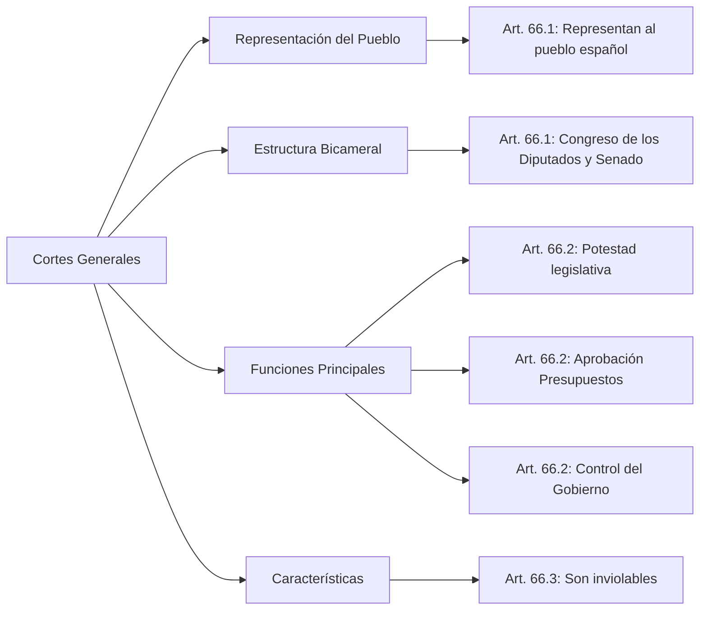
```mermaid
graph LR
    A[Cortes Generales] --> B[Representación del Pueblo]
    B --> B1[Art. 66.1: Representan al pueblo español]
    
    A --> C[Estructura Bicameral]
    C --> C1[Art. 66.1: Congreso de los Diputados y Senado]
    
    A --> D[Funciones Principales]
    D --> D1[Art. 66.2: Potestad legislativa]
    D --> D2[Art. 66.2: Aprobación Presupuestos]
    D --> D3[Art. 66.2: Control del Gobierno]
    
    A --> E[Características]
    E --> E1[Art. 66.3: Son inviolables]
```

**Artículo 67.**

4. Nadie podrá ser miembro de las dos Cámaras simultáneamente, ni acumular el acta de una Asamblea de Comunidad Autónoma con la de Diputado al Congreso.
    
5. Los miembros de las Cortes Generales no estarán ligados por mandato imperativo.
    
6. Las reuniones de Parlamentarios que se celebren sin convocatoria reglamentaria no vincularán a las Cámaras, y no podrán ejercer sus funciones ni ostentar sus privilegios.
    

💡 **Tip/Consejo:** Este artículo establece las **incompatibilidades** y la **independencia** de los miembros de las Cortes. La prohibición de ser miembro de ambas cámaras y la no sujeción a mandato imperativo buscan garantizar la autonomía de cada parlamentario y la integridad del sistema. Las reuniones no reglamentarias carecen de valor oficial.  
🔑 **Aspecto Clave:** Los **miembros de las Cortes no pueden ser simultáneamente miembros de las dos Cámaras, ni estar ligados por mandato imperativo, y las reuniones no reglamentarias no vinculan a las Cámaras**.

    
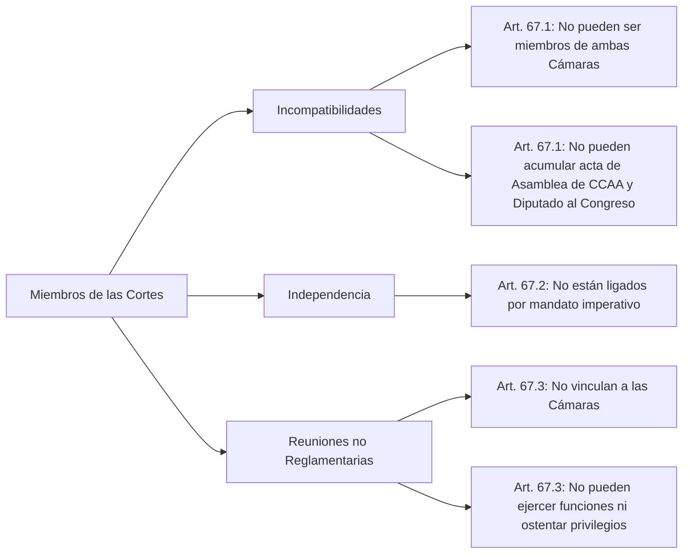
```mermaid
graph LR
    A[Miembros de las Cortes] --> B[Incompatibilidades]
    B --> B1[Art. 67.1: No pueden ser miembros de ambas Cámaras]
    B --> B2[Art. 67.1: No pueden acumular acta de Asamblea de CCAA y Diputado al Congreso]
    
    A --> C[Independencia]
    C --> C1[Art. 67.2: No están ligados por mandato imperativo]
    
    A --> D[Reuniones no Reglamentarias]
    D --> D1[Art. 67.3: No vinculan a las Cámaras]
    D --> D2[Art. 67.3: No pueden ejercer funciones ni ostentar privilegios]
```

**Artículo 68.**

7. El Congreso se compone de un **mínimo de 300 y un máximo de 400 Diputados**, elegidos por **sufragio universal, libre, igual, directo y secreto**, en los términos que establezca la ley.
    
8. La **circunscripción electoral es la provincia**. Las poblaciones de **Ceuta y Melilla estarán representadas cada una de ellas por un Diputado**. La ley distribuirá el número total de Diputados, asignando una representación mínima inicial a cada circunscripción y distribuyendo los demás en proporción a la población.
    
9. La elección se verificará en cada circunscripción atendiendo a **criterios de representación proporcional**.
    
10. El Congreso es elegido por **cuatro años**. El mandato de los Diputados termina cuatro años después de su elección o el día de la disolución de la Cámara.
    
11. Son electores y elegibles todos los españoles que estén en pleno uso de sus derechos políticos. La ley reconocerá y el Estado facilitará el ejercicio del derecho de sufragio a los españoles que se encuentren fuera del territorio de España.
    
12. Las elecciones tendrán lugar entre los treinta días y sesenta días desde la terminación del mandato. El Congreso electo deberá ser convocado dentro de los veinticinco días siguientes a la celebración de las elecciones.
    

💡 **Tip/Consejo:** Este artículo detalla la **composición** y **sistema electoral** del Congreso de los Diputados. Es fundamental entender que los diputados son elegidos por sufragio universal, libre, igual, directo y secreto, y que las provincias son las circunscripciones electorales. El principio de representación proporcional busca asegurar que las diferentes sensibilidades políticas estén representadas en el Congreso. La duración del mandato es de cuatro años.  
🔑 **Aspecto Clave:** El **Congreso se compone de 300-400 diputados elegidos por sufragio universal, la circunscripción es la provincia, la elección es por representación proporcional y el mandato es de cuatro años**.

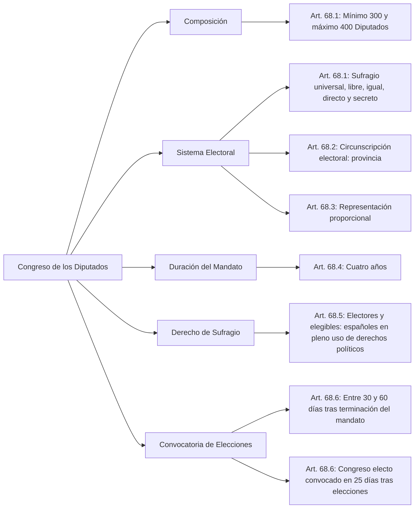
```mermaid
graph LR
    A[Congreso de los Diputados] --> B[Composición]
    B --> B1[Art. 68.1: Mínimo 300 y máximo 400 Diputados]
    
    A --> C[Sistema Electoral]
    C --> C1[Art. 68.1: Sufragio universal, libre, igual, directo y secreto]
    C --> C2[Art. 68.2: Circunscripción electoral: provincia]
     C --> C3[Art. 68.3: Representación proporcional]
    
    A --> D[Duración del Mandato]
    D --> D1[Art. 68.4: Cuatro años]
    
    A --> E[Derecho de Sufragio]
    E --> E1[Art. 68.5: Electores y elegibles: españoles en pleno uso de derechos políticos]
    
    A --> F[Convocatoria de Elecciones]
    F --> F1[Art. 68.6: Entre 30 y 60 días tras terminación del mandato]
     F --> F2[Art. 68.6: Congreso electo convocado en 25 días tras elecciones]
```
**Artículo 69.**

13. El **Senado es la Cámara de representación territorial**.
    
14. En cada provincia se elegirán **cuatro Senadores** por sufragio universal, libre, igual, directo y secreto por los votantes de cada una de ellas, en los términos que señale una ley orgánica.
    
15. En las provincias insulares, cada isla o agrupación de ellas, con Cabildo o Consejo Insular, constituirá una circunscripción a efectos de elección de Senadores, correspondiendo tres a cada una de las islas mayores –Gran Canaria, Mallorca y Tenerife– y uno a cada una de las siguientes islas o agrupaciones: Ibiza-Formentera, Menorca, Fuerteventura, Gomera, Hierro, Lanzarote y La Palma.
    
16. Las poblaciones de **Ceuta y Melilla elegirán cada una de ellas dos Senadores**.
    
17. Las Comunidades Autónomas designarán además un Senador y otro más por cada millón de habitantes de su respectivo territorio. La designación corresponderá a la Asamblea legislativa o, en su defecto, al órgano colegiado superior de la Comunidad Autónoma, de acuerdo con lo que establezcan los Estatutos, que asegurarán, en todo caso, la adecuada representación proporcional.
    
18. El Senado es elegido por **cuatro años**. El mandato de los Senadores termina cuatro años después de su elección o el día de la disolución de la Cámara.
    

💡 **Tip/Consejo:** Este artículo define el **Senado** como la cámara de representación territorial, destacando que su composición incluye senadores elegidos directamente en las provincias, senadores por las islas y senadores designados por las Comunidades Autónomas. La diversidad en su origen y composición es clave para su función de representación territorial. La duración del mandato también es de cuatro años.  
🔑 **Aspecto Clave:** El **Senado es la Cámara de representación territorial, con senadores elegidos por provincias, islas y Comunidades Autónomas, y su mandato es de cuatro años**.

      
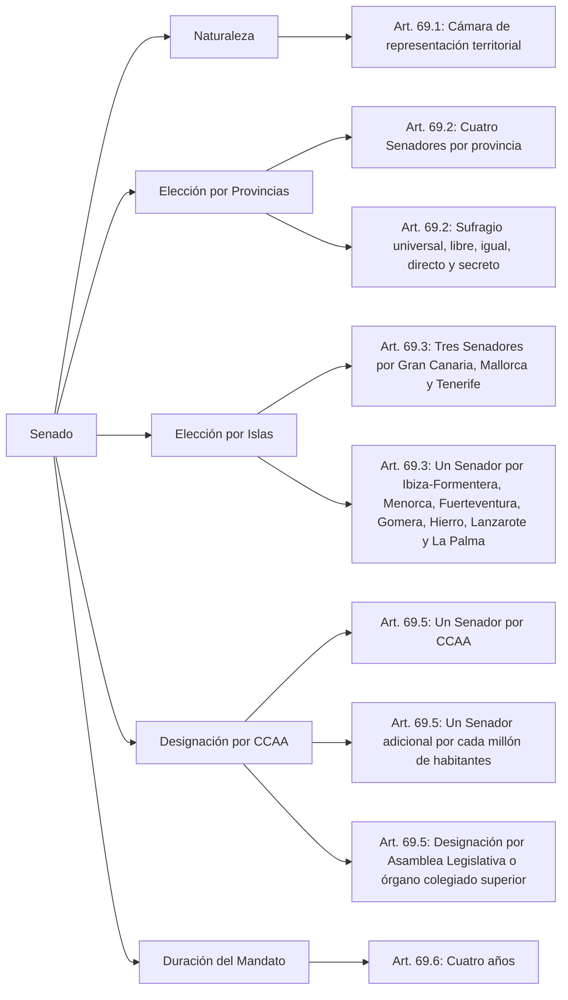
```mermaid
graph LR
    A[Senado] --> B[Naturaleza]
    B --> B1[Art. 69.1: Cámara de representación territorial]

    A --> C[Elección por Provincias]
    C --> C1[Art. 69.2: Cuatro Senadores por provincia]
    C --> C2[Art. 69.2: Sufragio universal, libre, igual, directo y secreto]
   
    A --> D[Elección por Islas]
   D --> D1[Art. 69.3: Tres Senadores por Gran Canaria, Mallorca y Tenerife]
   D --> D2[Art. 69.3: Un Senador por Ibiza-Formentera, Menorca, Fuerteventura, Gomera, Hierro, Lanzarote y La Palma]
    
    A --> E[Designación por CCAA]
    E --> E1[Art. 69.5: Un Senador por CCAA]
    E --> E2[Art. 69.5: Un Senador adicional por cada millón de habitantes]
     E --> E3[Art. 69.5: Designación por Asamblea Legislativa o órgano colegiado superior]
    
    A --> F[Duración del Mandato]
    F --> F1[Art. 69.6: Cuatro años]
```
**Artículo 70.**

19. La ley electoral determinará las **causas de inelegibilidad e incompatibilidad de los Diputados y Senadores**, que comprenderán en todo caso:
    
    - a) A los componentes del Tribunal Constitucional.
        
    - b) A los altos cargos de la Administración del Estado que determine la ley, con la excepción de los miembros del Gobierno.
        
    - c) Al Defensor del Pueblo.
        
    - d) A los Magistrados, Jueces y Fiscales en activo.
        
    - e) A los militares profesionales y miembros de las Fuerzas y Cuerpos de Seguridad y Policía en activo.
        
    - f) A los miembros de las Juntas Electorales.
        
20. La validez de las actas y credenciales de los miembros de ambas Cámaras estará sometida al **control judicial**, en los términos que establezca la ley electoral.
    

💡 **Tip/Consejo:** Este artículo establece que una ley electoral determinará las **causas de inelegibilidad e incompatibilidad** para ser Diputado o Senador. Menciona varios grupos que no pueden ser miembros del Congreso o Senado para garantizar la independencia de las cámaras y evitar conflictos de interés. Además, la validez de las actas está sujeta a control judicial para asegurar la integridad del proceso electoral.  
🔑 **Aspecto Clave:** La **ley electoral determina las causas de inelegibilidad e incompatibilidad de Diputados y Senadores, incluyendo a ciertos cargos públicos, y la validez de las actas está sujeta a control judicial**.

     
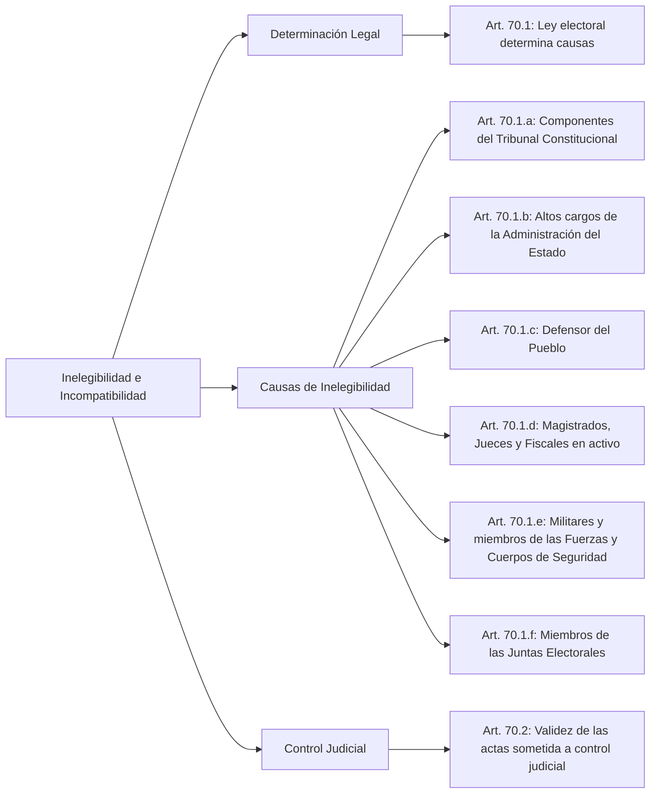
```mermaid
graph LR
    A[Inelegibilidad e Incompatibilidad] --> B[Determinación Legal]
    B --> B1[Art. 70.1: Ley electoral determina causas]
    
    A --> C[Causas de Inelegibilidad]
    C --> C1[Art. 70.1.a: Componentes del Tribunal Constitucional]
    C --> C2[Art. 70.1.b: Altos cargos de la Administración del Estado]
    C --> C3[Art. 70.1.c: Defensor del Pueblo]
    C --> C4[Art. 70.1.d: Magistrados, Jueces y Fiscales en activo]
    C --> C5[Art. 70.1.e: Militares y miembros de las Fuerzas y Cuerpos de Seguridad]
    C --> C6[Art. 70.1.f: Miembros de las Juntas Electorales]
    
    A --> D[Control Judicial]
    D --> D1[Art. 70.2: Validez de las actas sometida a control judicial]
```
**Artículo 71.**

21. Los **Diputados y Senadores gozarán de inviolabilidad** por las opiniones manifestadas en el ejercicio de sus funciones.
    
22. Durante el período de su mandato los **Diputados y Senadores gozarán asimismo de inmunidad** y sólo podrán ser detenidos en caso de flagrante delito. No podrán ser inculpados ni procesados sin la previa autorización de la Cámara respectiva.
    
23. En las causas contra Diputados y Senadores será competente la Sala de lo Penal del Tribunal Supremo.
    
24. Los **Diputados y Senadores percibirán una asignación** que será fijada por las respectivas Cámaras.
    

💡 **Tip/Consejo:** Este artículo establece las **prerrogativas** de los parlamentarios. La inviolabilidad protege a los Diputados y Senadores por las opiniones expresadas en el ejercicio de sus funciones, mientras que la inmunidad protege contra la detención y el procesamiento sin autorización de la Cámara. La asignación económica busca asegurar la independencia económica de los representantes.  
🔑 **Aspecto Clave:** Los **Diputados y Senadores tienen inviolabilidad por sus opiniones, inmunidad durante su mandato y perciben una asignación fijada por las Cámaras.**

     
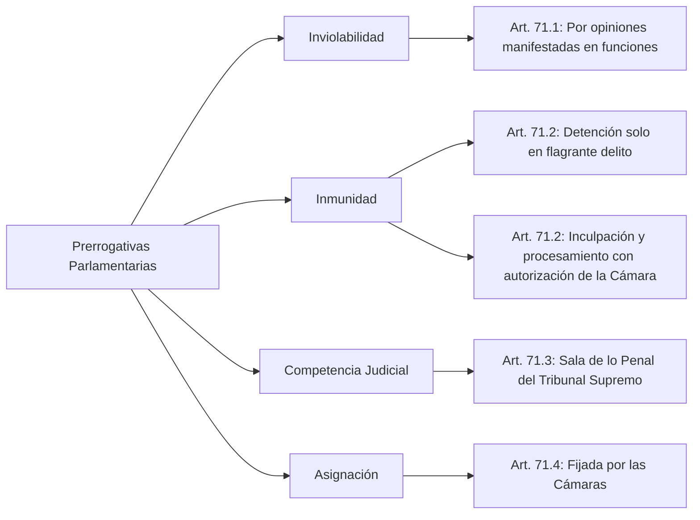
```mermaid
graph LR
    A[Prerrogativas Parlamentarias] --> B[Inviolabilidad]
    B --> B1[Art. 71.1: Por opiniones manifestadas en funciones]

    A --> C[Inmunidad]
    C --> C1[Art. 71.2: Detención solo en flagrante delito]
     C --> C2[Art. 71.2: Inculpación y procesamiento con autorización de la Cámara]
   
    A --> D[Competencia Judicial]
    D --> D1[Art. 71.3: Sala de lo Penal del Tribunal Supremo]
    
    A --> E[Asignación]
   E --> E1[Art. 71.4: Fijada por las Cámaras]
```
**Artículo 72.**

25. Las **Cámaras establecen sus propios Reglamentos**, aprueban autónomamente sus **presupuestos** y, de común acuerdo, regulan el **Estatuto del Personal de las Cortes Generales**. Los Reglamentos y su reforma serán sometidos a una votación final sobre su totalidad, que requerirá la mayoría absoluta.
    
26. Las **Cámaras eligen sus respectivos Presidentes** y los demás miembros de sus Mesas. Las sesiones conjuntas serán presididas por el Presidente del Congreso y se regirán por un Reglamento de las Cortes Generales aprobado por mayoría absoluta de cada Cámara.
    
27. Los **Presidentes de las Cámaras ejercen en nombre de las mismas todos los poderes administrativos** y facultades de policía en el interior de sus respectivas sedes.
    

💡 **Tip/Consejo:** Este artículo establece la **autonomía** de las Cámaras en la regulación de su funcionamiento. Cada cámara tiene potestad para establecer su propio reglamento, aprobar sus presupuestos y regular el estatuto del personal. También regula la elección de los presidentes y miembros de las mesas, así como el funcionamiento de las sesiones conjuntas.  
🔑 **Aspecto Clave:** Las **Cámaras establecen sus Reglamentos, aprueban sus presupuestos, eligen sus Presidentes y regulan el estatuto de su personal.**

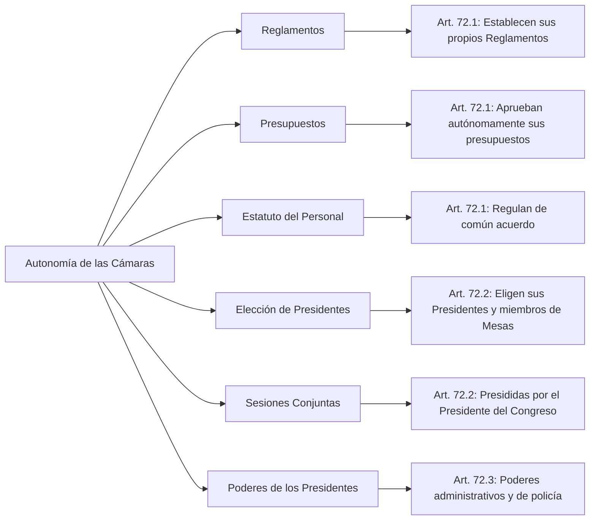
```mermaid
graph LR
    A[Autonomía de las Cámaras] --> B[Reglamentos]
    B --> B1[Art. 72.1: Establecen sus propios Reglamentos]

    A --> C[Presupuestos]
    C --> C1[Art. 72.1: Aprueban autónomamente sus presupuestos]

   A --> D[Estatuto del Personal]
    D --> D1[Art. 72.1: Regulan de común acuerdo]
    
    A --> E[Elección de Presidentes]
    E --> E1[Art. 72.2: Eligen sus Presidentes y miembros de Mesas]
    
    A --> F[Sesiones Conjuntas]
    F --> F1[Art. 72.2: Presididas por el Presidente del Congreso]
    
    A --> G[Poderes de los Presidentes]
    G --> G1[Art. 72.3: Poderes administrativos y de policía]
```
**Artículo 73.**

28. Las **Cámaras se reunirán anualmente en dos períodos ordinarios de sesiones:** el primero, de septiembre a diciembre, y el segundo, de febrero a junio.
    
29. Las Cámaras podrán reunirse en **sesiones extraordinarias** a petición del Gobierno, de la Diputación Permanente o de la mayoría absoluta de los miembros de cualquiera de las Cámaras. Las sesiones extraordinarias deberán convocarse sobre un orden del día determinado y serán clausuradas una vez que éste haya sido agotado.
    

💡 **Tip/Consejo:** Este artículo establece los **periodos ordinarios de sesiones** y la posibilidad de **sesiones extraordinarias** de las Cámaras. Es importante conocer la temporalidad del trabajo parlamentario y los mecanismos para convocar sesiones fuera del calendario regular.  
🔑 **Aspecto Clave:** Las **Cámaras se reúnen en dos periodos ordinarios y pueden celebrar sesiones extraordinarias bajo petición**.

   
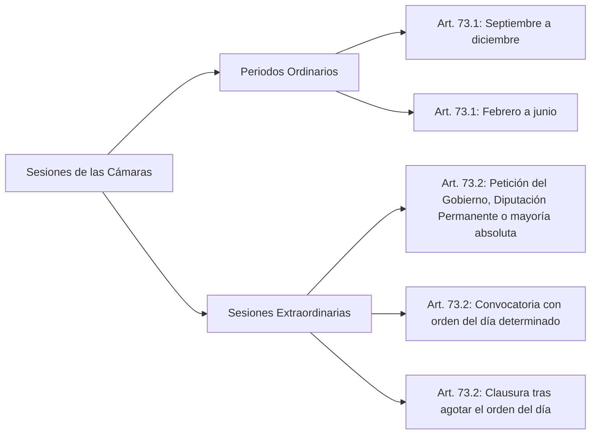
```mermaid
graph LR
    A[Sesiones de las Cámaras] --> B[Periodos Ordinarios]
    B --> B1[Art. 73.1: Septiembre a diciembre]
    B --> B2[Art. 73.1: Febrero a junio]
    
    A --> C[Sesiones Extraordinarias]
    C --> C1[Art. 73.2: Petición del Gobierno, Diputación Permanente o mayoría absoluta]
    C --> C2[Art. 73.2: Convocatoria con orden del día determinado]
    C --> C3[Art. 73.2: Clausura tras agotar el orden del día]
```
**Artículo 74.**

1.  Las **Cámaras se reunirán en sesión conjunta** para ejercer las competencias no legislativas que el Título II atribuye expresamente a las Cortes Generales.
2.  Las **decisiones de las Cortes Generales** previstas en los artículos 94, 1, 145, 2 y 158, 2, se adoptarán por mayoría de cada una de las Cámaras. En el primer caso, el procedimiento se iniciará por el Congreso, y en los otros dos, por el Senado. En ambos casos, si no hubiera acuerdo entre Senado y Congreso, se intentará obtener por una Comisión Mixta compuesta de igual número de Diputados y Senadores. La Comisión presentará un texto que será votado por ambas Cámaras. Si no se aprueba en la forma establecida, decidirá el Congreso por mayoría absoluta.

💡 ***Tip/Consejo:*** _Este artículo regula las **sesiones conjuntas** de las Cámaras, estableciendo que se reúnen para ejercer competencias no legislativas asignadas en el Título II y que ciertas decisiones se adoptan por mayoría en cada cámara, con un procedimiento para resolver desacuerdos entre Congreso y Senado._
🔑 ***Aspecto Clave:*** Las **Cámaras se reúnen en sesión conjunta para competencias no legislativas, decisiones por mayoría en cada cámara y procedimiento en caso de desacuerdo.**

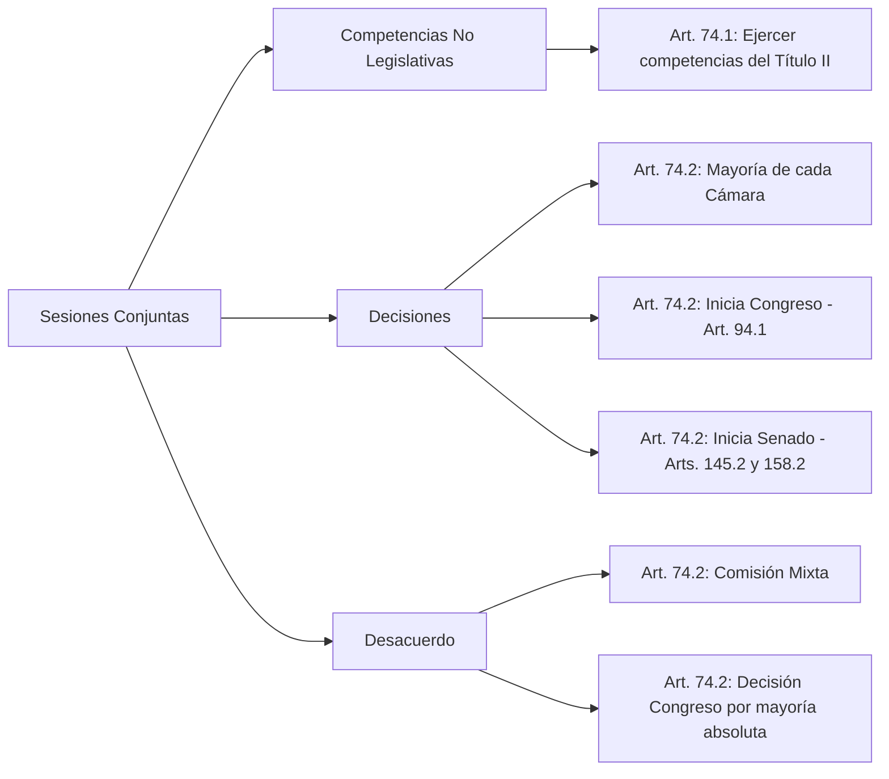
```mermaid
graph LR
    A[Sesiones Conjuntas] --> B[Competencias No Legislativas]
    B --> B1[Art. 74.1: Ejercer competencias del Título II]
    
    A --> C[Decisiones]
    C --> C1[Art. 74.2: Mayoría de cada Cámara]
    C --> C2[Art. 74.2: Inicia Congreso - Art. 94.1]
    C --> C3[Art. 74.2: Inicia Senado - Arts. 145.2 y 158.2]
    
    A --> D[Desacuerdo]
    D --> D1[Art. 74.2: Comisión Mixta]
    D --> D2[Art. 74.2: Decisión Congreso por mayoría absoluta]
```

**Artículo 75.**

1.  Las **Cámaras funcionarán en Pleno y por Comisiones**.
2.  Las **Cámaras podrán delegar en las Comisiones Legislativas Permanentes la aprobación de proyectos o proposiciones de ley**. El Pleno podrá, no obstante, recabar en cualquier momento el debate y votación de cualquier proyecto o proposición de ley que haya sido objeto de esta delegación.
3.  Quedan exceptuados de lo dispuesto en el apartado anterior la reforma constitucional, las cuestiones internacionales, las leyes orgánicas y de bases y los Presupuestos Generales del Estado.

💡 ***Tip/Consejo:*** _Este artículo explica la **organización interna** de las Cámaras, que pueden funcionar en Pleno o a través de Comisiones. Se contempla la delegación de funciones legislativas en las comisiones, aunque el Pleno siempre puede recuperar el debate y votación. Se excluyen ciertas materias de la delegación, como reformas constitucionales o cuestiones internacionales._
🔑 ***Aspecto Clave:*** Las **Cámaras funcionan en Pleno y por Comisiones, pudiendo delegar en estas últimas la aprobación de leyes, con excepciones para ciertos temas clave.**
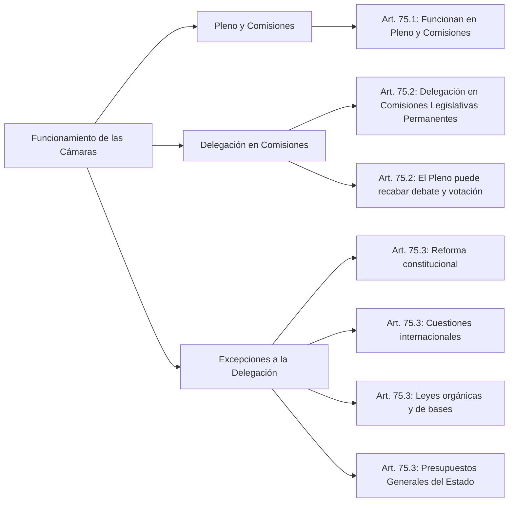
```mermaid
graph LR
    A[Funcionamiento de las Cámaras] --> B[Pleno y Comisiones]
    B --> B1[Art. 75.1: Funcionan en Pleno y Comisiones]
   
    A --> C[Delegación en Comisiones]
    C --> C1[Art. 75.2: Delegación en Comisiones Legislativas Permanentes]
    C --> C2[Art. 75.2: El Pleno puede recabar debate y votación]

    A --> D[Excepciones a la Delegación]
    D --> D1[Art. 75.3: Reforma constitucional]
    D --> D2[Art. 75.3: Cuestiones internacionales]
    D --> D3[Art. 75.3: Leyes orgánicas y de bases]
    D --> D4[Art. 75.3: Presupuestos Generales del Estado]
```

**Artículo 76.**

1.  El **Congreso y el Senado, y, en su caso, ambas Cámaras conjuntamente, podrán nombrar Comisiones de investigación sobre cualquier asunto de interés público**. Sus conclusiones no serán vinculantes para los Tribunales, ni afectarán a las resoluciones judiciales, sin perjuicio de que el resultado de la investigación sea comunicado al Ministerio Fiscal para el ejercicio, cuando proceda, de las acciones oportunas.
2.  **Será obligatorio comparecer a requerimiento de las Cámaras**. La ley regulará las sanciones que puedan imponerse por incumplimiento de esta obligación.

💡 ***Tip/Consejo:*** _Este artículo permite la creación de **Comisiones de investigación** por las Cámaras para investigar cualquier asunto de interés público, estableciendo la obligación de comparecer ante estas comisiones, aunque sus conclusiones no vinculan a los tribunales._
🔑 ***Aspecto Clave:*** Las **Cámaras pueden nombrar Comisiones de investigación sobre asuntos de interés público, con obligación de comparecer, pero sus conclusiones no son vinculantes para los Tribunales.**
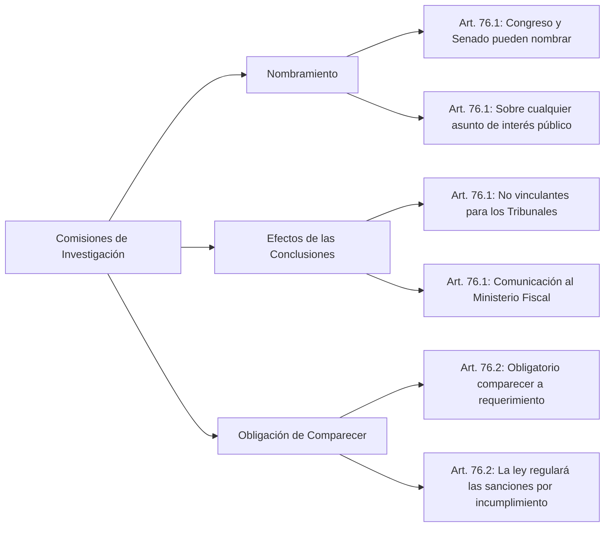
```mermaid
graph LR
    A[Comisiones de Investigación] --> B[Nombramiento]
    B --> B1[Art. 76.1: Congreso y Senado pueden nombrar]
    B --> B2[Art. 76.1: Sobre cualquier asunto de interés público]
    
    A --> C[Efectos de las Conclusiones]
    C --> C1[Art. 76.1: No vinculantes para los Tribunales]
    C --> C2[Art. 76.1: Comunicación al Ministerio Fiscal]
    
    A --> D[Obligación de Comparecer]
    D --> D1[Art. 76.2: Obligatorio comparecer a requerimiento]
    D --> D2[Art. 76.2: La ley regulará las sanciones por incumplimiento]
```

**Artículo 77.**

1.  Las **Cámaras pueden recibir peticiones individuales y colectivas, siempre por escrito**, quedando prohibida la presentación directa por manifestaciones ciudadanas.
2.  Las **Cámaras pueden remitir al Gobierno las peticiones que reciban**. El Gobierno está obligado a explicarse sobre su contenido, siempre que las Cámaras lo exijan.

💡 ***Tip/Consejo:*** _Este artículo reconoce el derecho de los ciudadanos a dirigir **peticiones** a las Cámaras, estableciendo que deben ser por escrito, y que las Cámaras pueden remitirlas al Gobierno, quien debe explicarse si se le requiere._
🔑 ***Aspecto Clave:*** Las **Cámaras pueden recibir peticiones escritas de ciudadanos y remitirlas al Gobierno, que debe explicarse si es requerido.**
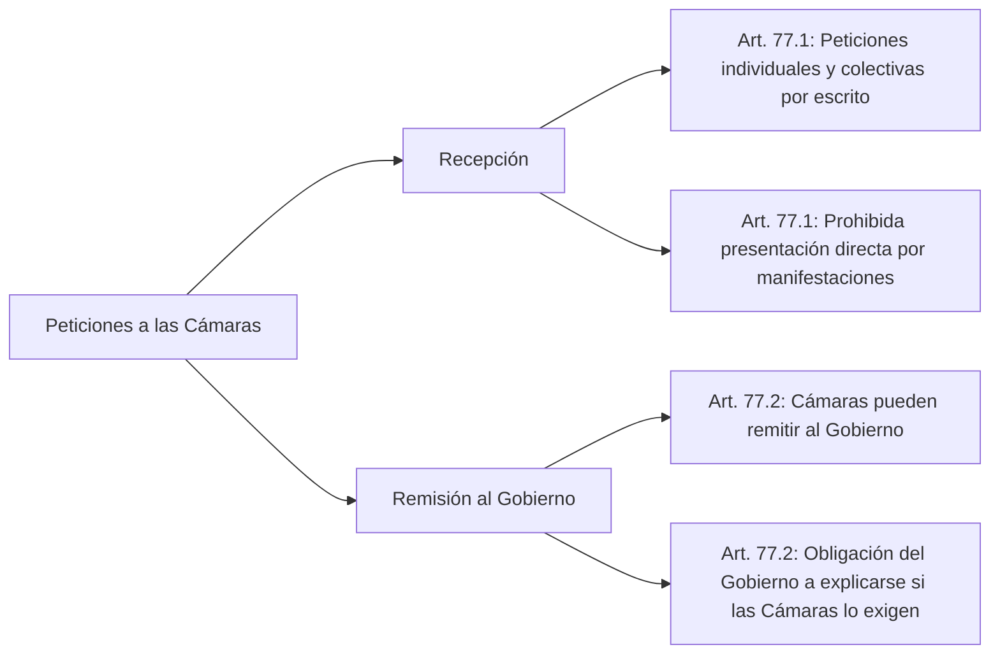
```mermaid
graph LR
    A[Peticiones a las Cámaras] --> B[Recepción]
    B --> B1[Art. 77.1: Peticiones individuales y colectivas por escrito]
    B --> B2[Art. 77.1: Prohibida presentación directa por manifestaciones]
    
    A --> C[Remisión al Gobierno]
    C --> C1[Art. 77.2: Cámaras pueden remitir al Gobierno]
    C --> C2[Art. 77.2: Obligación del Gobierno a explicarse si las Cámaras lo exigen]
```

**Artículo 78.**

1.  En cada Cámara habrá una **Diputación Permanente** compuesta por un mínimo de veintiún miembros, que representarán a los grupos parlamentarios, en proporción a su importancia numérica.
2.  Las Diputaciones Permanentes estarán presididas por el Presidente de la Cámara respectiva y tendrán como funciones la prevista en el artículo 73, la de asumir las facultades que correspondan a las Cámaras, de acuerdo con los artículos 86 y 116, en caso de que éstas hubieren sido disueltas o hubiere expirado su mandato, y la de velar por los poderes de las Cámaras cuando éstas no estén reunidas.
3.  Expirado el mandato o en caso de disolución, las Diputaciones Permanentes seguirán ejerciendo sus funciones hasta la constitución de las nuevas Cortes Generales.
4.  Reunida la Cámara correspondiente, la Diputación Permanente dará cuenta de los asuntos tratados y de sus decisiones.

💡 ***Tip/Consejo:*** _Este artículo regula la **Diputación Permanente** de cada Cámara, un órgano que continúa funcionando cuando las Cámaras no están en periodo de sesiones o han sido disueltas, garantizando la continuidad de la labor parlamentaria y la vigilancia de los poderes de la Cámara._
🔑 ***Aspecto Clave:*** La **Diputación Permanente actúa en periodos no ordinarios, asumiendo funciones de las Cámaras disueltas y vigilando sus poderes**.

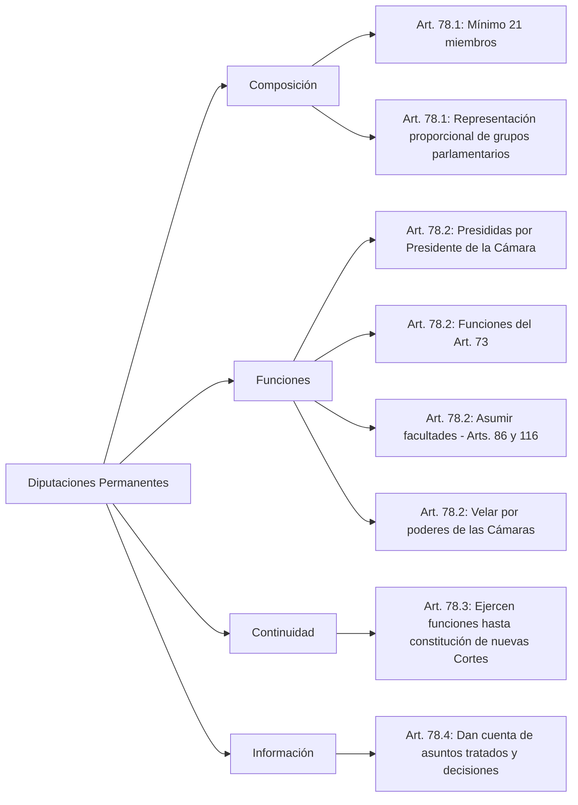
```mermaid
graph LR
    A[Diputaciones Permanentes] --> B[Composición]
    B --> B1[Art. 78.1: Mínimo 21 miembros]
    B --> B2[Art. 78.1: Representación proporcional de grupos parlamentarios]
    
    A --> C[Funciones]
    C --> C1[Art. 78.2: Presididas por Presidente de la Cámara]
    C --> C2[Art. 78.2: Funciones del Art. 73]
    C --> C3[Art. 78.2: Asumir facultades - Arts. 86 y 116]
    C --> C4[Art. 78.2: Velar por poderes de las Cámaras]
    
    A --> D[Continuidad]
    D --> D1[Art. 78.3: Ejercen funciones hasta constitución de nuevas Cortes]
    
    A --> E[Información]
    E --> E1[Art. 78.4: Dan cuenta de asuntos tratados y decisiones]
```

**Artículo 79.**

1.  Para **adoptar acuerdos**, las Cámaras deben estar reunidas reglamentariamente y con asistencia de la mayoría de sus miembros.
2.  Dichos **acuerdos para ser válidos deberán ser aprobados por la mayoría de los miembros presentes**, sin perjuicio de las mayorías especiales que establezcan la Constitución o las leyes orgánicas y las que para elección de personas establezcan los Reglamentos de las Cámaras.
3.  El **voto de Senadores y Diputados es personal e indelegable**.

💡 ***Tip/Consejo:*** _Este artículo establece los **requisitos para la validez de los acuerdos** adoptados por las Cámaras, destacando la necesidad de que estén reunidas reglamentariamente con la asistencia de la mayoría de sus miembros y la regla general de mayoría simple, aunque se contemplan mayorías especiales y la no delegación del voto._
🔑 ***Aspecto Clave:*** Los **acuerdos de las Cámaras requieren reunión reglamentaria, mayoría de los presentes (salvo excepciones) y voto personal e indelegable**.
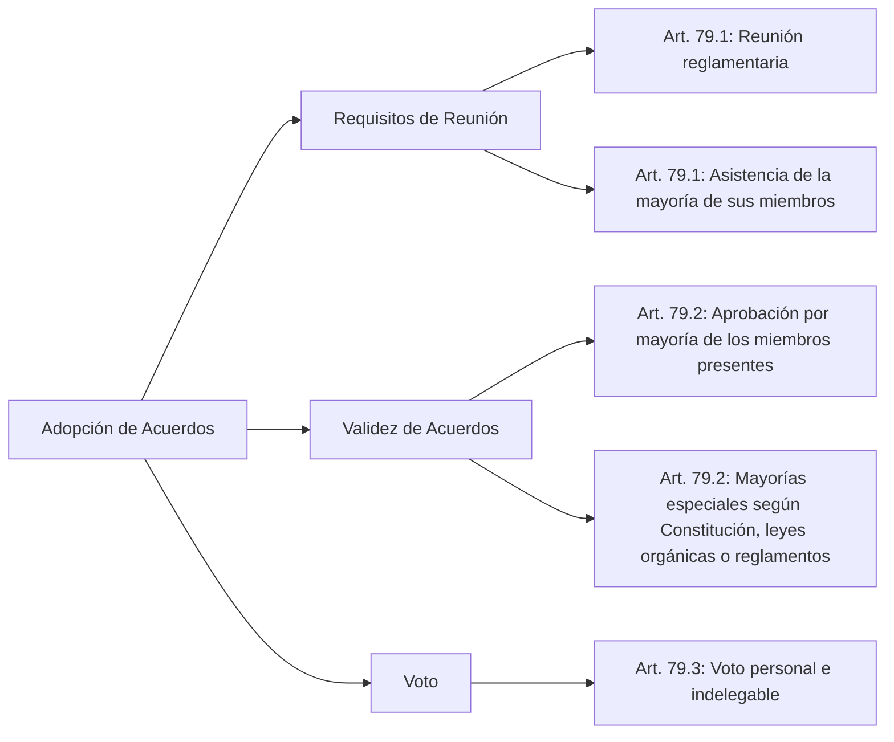
```mermaid
graph LR
    A[Adopción de Acuerdos] --> B[Requisitos de Reunión]
    B --> B1[Art. 79.1: Reunión reglamentaria]
    B --> B2[Art. 79.1: Asistencia de la mayoría de sus miembros]
    
    A --> C[Validez de Acuerdos]
    C --> C1[Art. 79.2: Aprobación por mayoría de los miembros presentes]
     C --> C2[Art. 79.2: Mayorías especiales según Constitución, leyes orgánicas o reglamentos]
    
    A --> D[Voto]
    D --> D1[Art. 79.3: Voto personal e indelegable]
```

**Artículo 80.**

Las **sesiones plenarias de las Cámaras serán públicas**, salvo acuerdo en contrario de cada Cámara, adoptado por mayoría absoluta o con arreglo al Reglamento.

💡 ***Tip/Consejo:*** _Este artículo establece el principio de **publicidad** de las sesiones plenarias de las Cámaras, garantizando la transparencia del proceso parlamentario, aunque se permite la excepción mediante acuerdo de la Cámara._
🔑 ***Aspecto Clave:*** Las **sesiones plenarias de las Cámaras son públicas, salvo acuerdo en contrario por mayoría absoluta o según el Reglamento**.
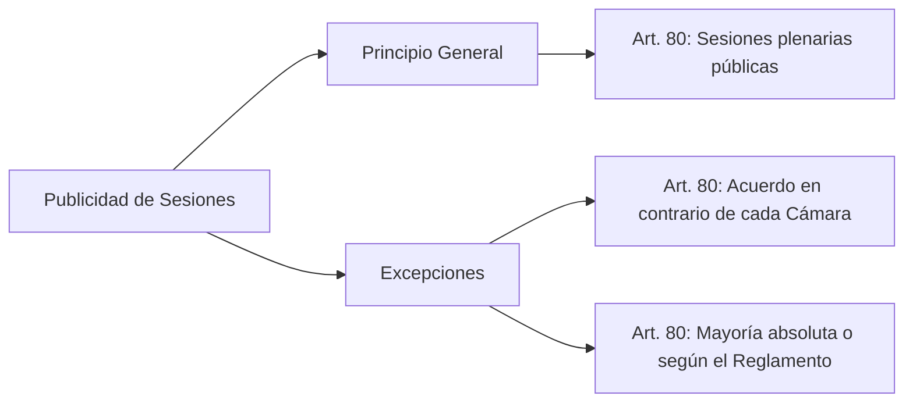
```mermaid
graph LR
   A[Publicidad de Sesiones] --> B[Principio General]
    B --> B1[Art. 80: Sesiones plenarias públicas]
  
   A --> C[Excepciones]
    C --> C1[Art. 80: Acuerdo en contrario de cada Cámara]
     C --> C2[Art. 80: Mayoría absoluta o según el Reglamento]
```
#### CAPÍTULO SEGUNDO
##### De la elaboración de las leyes

**Artículo 81.**

4.  Son **leyes orgánicas** las relativas al desarrollo de los **derechos fundamentales** y de las **libertades públicas**, las que aprueben los **Estatutos de Autonomía** y el **régimen electoral general** y las demás previstas en la Constitución.
5.  La aprobación, modificación o derogación de las leyes orgánicas exigirá **mayoría absoluta del Congreso**, en una votación final sobre el conjunto del proyecto.

💡 ***Tip/Consejo:*** _Este artículo define las **leyes orgánicas**, estableciendo su especial relevancia por tratar temas fundamentales como derechos y libertades, estatutos de autonomía y régimen electoral, y que requieren mayoría absoluta del Congreso para su aprobación o modificación._
🔑 ***Aspecto Clave:*** Las **leyes orgánicas son sobre derechos fundamentales, Estatutos de Autonomía y régimen electoral, y requieren mayoría absoluta en el Congreso.**
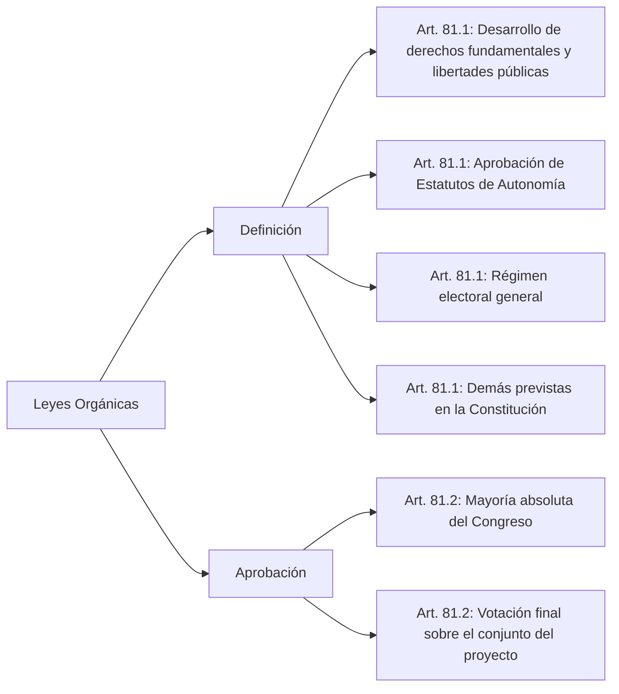
```mermaid
graph LR
  A[Leyes Orgánicas] --> B[Definición]
    B --> B1[Art. 81.1: Desarrollo de derechos fundamentales y libertades públicas]
    B --> B2[Art. 81.1: Aprobación de Estatutos de Autonomía]
    B --> B3[Art. 81.1: Régimen electoral general]
    B --> B4[Art. 81.1: Demás previstas en la Constitución]

  A --> C[Aprobación]
  C --> C1[Art. 81.2: Mayoría absoluta del Congreso]
  C --> C2[Art. 81.2: Votación final sobre el conjunto del proyecto]
```
**Artículo 82.**

6.  Las **Cortes Generales podrán delegar en el Gobierno la potestad de dictar normas con rango de ley** sobre materias determinadas no incluidas en el artículo anterior.
7.  La **delegación legislativa deberá otorgarse mediante una ley de bases** cuando su objeto sea la formación de textos articulados o por una **ley ordinaria** cuando se trate de refundir varios textos legales en uno solo.
8.  La delegación legislativa habrá de otorgarse al Gobierno de forma **expresa para materia concreta** y con **fijación del plazo para su ejercicio**. La delegación se agota por el uso que de ella haga el Gobierno mediante la publicación de la norma correspondiente. No podrá entenderse concedida de modo implícito o por tiempo indeterminado. Tampoco podrá permitir la subdelegación a autoridades distintas del propio Gobierno.
9.  Las **leyes de bases delimitarán con precisión el objeto y alcance de la delegación legislativa** y los principios y criterios que han de seguirse en su ejercicio.
10.  La **autorización para refundir textos legales** determinará el ámbito normativo a que se refiere el contenido de la delegación, especificando si se circunscribe a la mera formulación de un texto único o si se incluye la de regularizar, aclarar y armonizar los textos legales que han de ser refundidos.
11.  Sin perjuicio de la competencia propia de los Tribunales, las leyes de delegación podrán establecer en cada caso fórmulas adicionales de control.

💡 ***Tip/Consejo:*** _Este artículo regula la **delegación legislativa**, por la cual las Cortes pueden autorizar al Gobierno a dictar normas con rango de ley. La delegación debe ser expresa, para materias concretas, con fijación del plazo y mediante ley de bases o ley ordinaria según el caso. Se establecen límites y requisitos para garantizar el control parlamentario._
🔑 ***Aspecto Clave:*** Las **Cortes pueden delegar en el Gobierno la potestad de dictar normas con rango de ley mediante ley de bases o ley ordinaria, de forma expresa y con límites.**

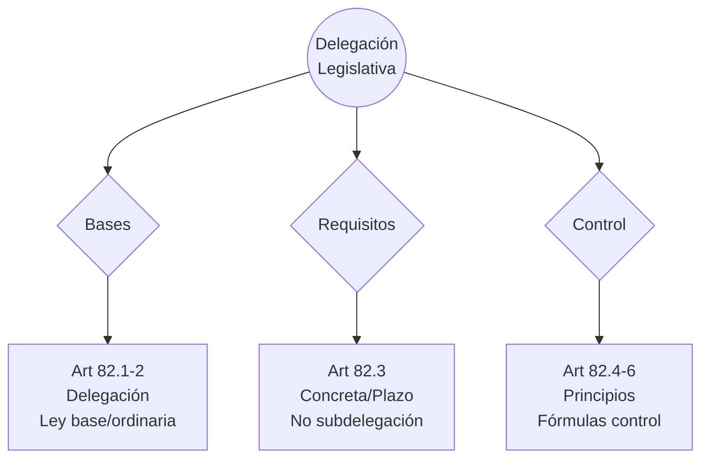
```mermaid
graph TB
    A((Delegación<br>Legislativa))
    A --> B{Bases}
    A --> C{Requisitos}
    A --> D{Control}
    
    B --> B1[Art 82.1-2<br>Delegación<br>Ley base/ordinaria]
    C --> C1[Art 82.3<br>Concreta/Plazo<br>No subdelegación]
    D --> D1[Art 82.4-6<br>Principios<br>Fórmulas control]
```
**Artículo 83.**

Las **leyes de bases no podrán en ningún caso**:
* a) Autorizar la modificación de la propia ley de bases.
* b) Facultar para dictar normas con carácter retroactivo.

💡 ***Tip/Consejo:*** _Este artículo establece **límites a las leyes de bases** que se utilizan para la delegación legislativa. Estas leyes no pueden autorizar la modificación de sí mismas, ni facultar al Gobierno para dictar normas con carácter retroactivo._
🔑 ***Aspecto Clave:*** Las **leyes de bases no pueden autorizar su propia modificación ni facultar normas retroactivas**.
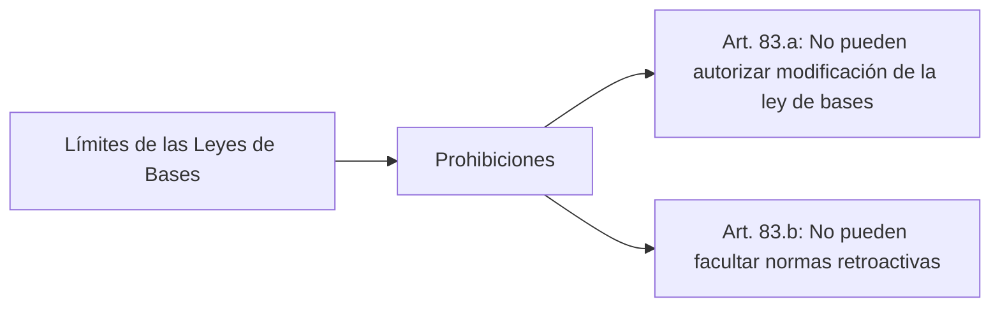
```mermaid
graph LR
    A[Límites de las Leyes de Bases] --> B[Prohibiciones]
    B --> B1[Art. 83.a: No pueden autorizar modificación de la ley de bases]
    B --> B2[Art. 83.b: No pueden facultar normas retroactivas]
```

**Artículo 84.**

Cuando una proposición de ley o una enmienda fuere contraria a una delegación legislativa en vigor, el **Gobierno está facultado para oponerse a su tramitación**. En tal supuesto, podrá presentarse una proposición de ley para la derogación total o parcial de la ley de delegación.

💡 ***Tip/Consejo:*** _Este artículo otorga al **Gobierno la facultad de oponerse a la tramitación** de proposiciones de ley o enmiendas que contravengan una delegación legislativa vigente, aunque se permite la presentación de una proposición de ley para la derogación de la delegación._
🔑 ***Aspecto Clave:*** El **Gobierno puede oponerse a la tramitación de proposiciones o enmiendas contrarias a una delegación legislativa, permitiéndose la derogación de la delegación.**
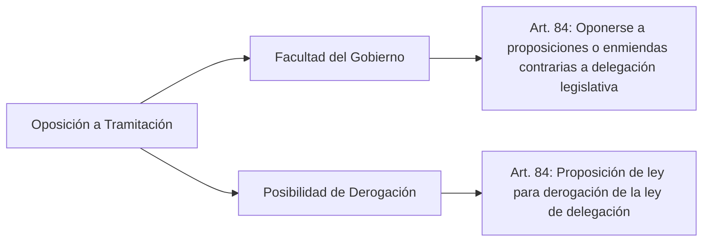
```mermaid
graph LR
    A[Oposición a Tramitación] --> B[Facultad del Gobierno]
    B --> B1[Art. 84: Oponerse a proposiciones o enmiendas contrarias a delegación legislativa]
    
    A --> C[Posibilidad de Derogación]
    C --> C1[Art. 84: Proposición de ley para derogación de la ley de delegación]
```
**Artículo 85.**

Las **disposiciones del Gobierno que contengan legislación delegada recibirán el título de Decretos Legislativos.**

💡 ***Tip/Consejo:*** _Este artículo establece que las normas que el Gobierno dicta en virtud de una delegación legislativa toman la forma de **Decretos Legislativos**._
🔑 ***Aspecto Clave:*** Las **disposiciones del Gobierno con legislación delegada se denominan Decretos Legislativos**.
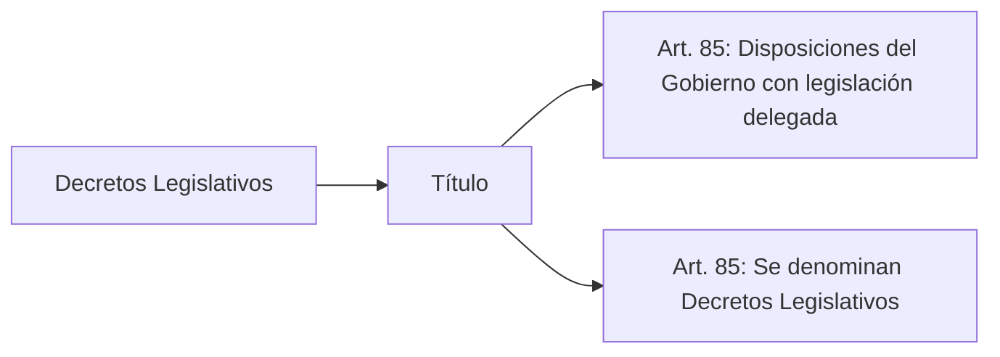
```mermaid
graph LR
    A[Decretos Legislativos] --> B[Título]
    B --> B1[Art. 85: Disposiciones del Gobierno con legislación delegada]
    B --> B2[Art. 85: Se denominan Decretos Legislativos]
```
**Artículo 86.**

1.  En caso de **extraordinaria y urgente necesidad, el Gobierno podrá dictar disposiciones legislativas provisionales que tomarán la forma de Decretos-leyes** y que no podrán afectar al ordenamiento de las instituciones básicas del Estado, a los derechos, deberes y libertades de los ciudadanos regulados en el Título I, al régimen de las Comunidades Autónomas ni al Derecho electoral general.
2.  Los **Decretos-leyes deberán ser inmediatamente sometidos a debate y votación de totalidad al Congreso de los Diputados**, convocado al efecto si no estuviere reunido, en el plazo de los treinta días siguientes a su promulgación. El Congreso habrá de pronunciarse expresamente dentro de dicho plazo sobre su convalidación o derogación, para lo cual el Reglamento establecerá un procedimiento especial y sumario.
3.  Durante el plazo establecido en el apartado anterior las Cortes podrán tramitarlos como proyectos de ley por el procedimiento de urgencia.

💡 ***Tip/Consejo:*** _Este artículo regula los **Decretos-leyes**, que el Gobierno puede dictar en casos de extraordinaria y urgente necesidad, estableciendo sus límites y la necesidad de convalidación por el Congreso en un plazo de 30 días. Este mecanismo permite al Gobierno actuar rápidamente, pero con control parlamentario posterior._
🔑 ***Aspecto Clave:*** El **Gobierno puede dictar Decretos-leyes en caso de urgencia, con límites y necesidad de convalidación por el Congreso en 30 días.**
```mermaid
graph LR
    A[Decretos-leyes] --> B[Habilitación]
    B --> B1[Art. 86.1: Extraordinaria y urgente necesidad]
    B --> B2[Art. 86.1: Disposiciones legislativas provisionales]
    
     A --> C[Límites]
     C --> C1[Art. 86.1: No afectan a instituciones básicas del Estado]
     C --> C2[Art. 86.1: No afectan a derechos, deberes y libertades del Título I]
    C --> C3[Art. 86.1: No afectan al régimen de las Comunidades Autónomas]
    C --> C4[Art. 86.1: No afectan al Derecho electoral general]

    A --> D[Convalidación]
    D --> D1[Art. 86.2: Debate y votación en el Congreso en 30 días]
    D --> D2[Art. 86.2: Congreso se pronuncia sobre convalidación o derogación]
    
    A --> E[Tramitación como Proyecto de Ley]
     E --> E1[Art. 86.3: Posibilidad de tramitación como proyecto de ley por procedimiento de urgencia]
```
**Artículo 87.**

4.  La **iniciativa legislativa corresponde al Gobierno, al Congreso y al Senado**, de acuerdo con la Constitución y los Reglamentos de las Cámaras.
5.  Las **Asambleas de las Comunidades Autónomas podrán solicitar del Gobierno la adopción de un proyecto de ley o remitir a la Mesa del Congreso una proposición de ley**, delegando ante dicha Cámara un máximo de tres miembros de la Asamblea encargados de su defensa.
6.  Una **ley orgánica regulará las formas de ejercicio y requisitos de la iniciativa popular** para la presentación de proposiciones de ley. En todo caso se exigirán no menos de 500.000 firmas acreditadas. No procederá dicha iniciativa en materias propias de ley orgánica, tributarias o de carácter internacional, ni en lo relativo a la prerrogativa de gracia.

💡 ***Tip/Consejo:*** _Este artículo regula la **iniciativa legislativa**, estableciendo que corresponde al Gobierno, al Congreso y al Senado. También se reconoce a las Asambleas de las CCAA y la iniciativa popular, con requisitos específicos, y se establecen límites para esta última._
🔑 ***Aspecto Clave:*** La **iniciativa legislativa corresponde al Gobierno, Congreso, Senado, Asambleas CCAA e iniciativa popular, con límites para esta última.**
```mermaid
graph LR
  A[Iniciativa Legislativa] --> B[Titulares]
    B --> B1[Art. 87.1: Gobierno]
    B --> B2[Art. 87.1: Congreso]
    B --> B3[Art. 87.1: Senado]

  A --> C[Iniciativa de CCAA]
     C --> C1[Art. 87.2: Solicitud al Gobierno o proposición al Congreso]
     C --> C2[Art. 87.2: Delegación de hasta tres miembros de la Asamblea]
 
  A --> D[Iniciativa Popular]
  D --> D1[Art. 87.3: Regulada por ley orgánica]
  D --> D2[Art. 87.3: Mínimo de 500.000 firmas acreditadas]
    D --> D3[Art. 87.3: No procede en materias de ley orgánica, tributarias, internacionales o prerrogativa de gracia]
```

**Artículo 88.**

Los **proyectos de ley serán aprobados en Consejo de Ministros**, que los someterá al Congreso, acompañados de una exposición de motivos y de los antecedentes necesarios para pronunciarse sobre ellos.

💡 ***Tip/Consejo:*** _Este artículo detalla que los **proyectos de ley** que promueve el Gobierno deben ser aprobados en Consejo de Ministros antes de ser remitidos al Congreso, junto con una exposición de motivos y los antecedentes relevantes._
🔑 ***Aspecto Clave:*** Los **proyectos de ley son aprobados por el Consejo de Ministros y enviados al Congreso con exposición de motivos y antecedentes.**
```mermaid
graph LR
    A[Proyectos de Ley] --> B[Aprobación]
    B --> B1[Art. 88: Aprobados por el Consejo de Ministros]
    
     A --> C[Presentación al Congreso]
     C --> C1[Art. 88: Con exposición de motivos y antecedentes]
```

**Artículo 89.**

7.  La **tramitación de las proposiciones de ley se regulará por los Reglamentos de las Cámaras**, sin que la prioridad debida a los proyectos de ley impida el ejercicio de la iniciativa legislativa en los términos regulados por el artículo 87.
8.  Las **proposiciones de ley que, de acuerdo con el artículo 87 tome en consideración el Senado, se remitirán al Congreso para su trámite en éste como tal proposición.**

💡 ***Tip/Consejo:*** _Este artículo regula la **tramitación de las proposiciones de ley**, indicando que se rigen por los reglamentos de las Cámaras, sin que la prioridad de los proyectos de ley impida el ejercicio de la iniciativa legislativa y que las proposiciones del Senado se remiten al Congreso._
🔑 ***Aspecto Clave:*** Las **proposiciones de ley se tramitan según los reglamentos de las Cámaras, sin que los proyectos tengan prioridad absoluta, y las del Senado van al Congreso.**
```mermaid
graph LR
    A[Tramitación de Proposiciones de Ley] --> B[Reglamentación]
    B --> B1[Art. 89.1: Regulada por los Reglamentos de las Cámaras]
   B --> B2[Art. 89.1: Proyectos de ley no impiden la iniciativa legislativa]

    A --> C[Proposiciones del Senado]
    C --> C1[Art. 89.2: Remitidas al Congreso]
    C --> C2[Art. 89.2: Tramitación como proposición]
```

**Artículo 90.**

9.  **Aprobado un proyecto de ley ordinaria u orgánica por el Congreso de los Diputados, su Presidente dará inmediata cuenta del mismo al Presidente del Senado, el cual lo someterá a la deliberación de éste.**
10.  El **Senado en el plazo de dos meses**, a partir del día de la recepción del texto, puede, mediante mensaje motivado, **oponer su veto o introducir enmiendas al mismo**. El veto deberá ser aprobado por mayoría absoluta. El proyecto no podrá ser sometido al Rey para sanción sin que el Congreso ratifique por mayoría absoluta, en caso de veto, el texto inicial, o por mayoría simple, una vez transcurridos dos meses desde la interposición del mismo, o se pronuncie sobre las enmiendas, aceptándolas o no por mayoría simple.
11.  El plazo de dos meses de que el Senado dispone para vetar o enmendar el proyecto se reducirá al de **veinte días naturales en los proyectos declarados urgentes** por el Gobierno o por el Congreso de los Diputados.

💡 ***Tip/Consejo:*** _Este artículo establece el **procedimiento legislativo bicameral**. Una vez aprobado un proyecto por el Congreso, pasa al Senado, que puede vetarlo o enmendarlo. El Congreso puede levantar el veto o pronunciarse sobre las enmiendas. Se establecen plazos y mayorías para este proceso._
🔑 ***Aspecto Clave:*** El **Senado puede vetar o enmendar proyectos del Congreso, con plazos y mayorías, y el Congreso decide finalmente.**
```mermaid
graph LR
    A[Procedimiento Legislativo Bicameral] --> B[Aprobación en el Congreso]
    B --> B1[Art. 90.1: Remisión al Senado]

    A --> C[Actuación del Senado]
     C --> C1[Art. 90.2: Dos meses para vetar o enmendar]
    C --> C2[Art. 90.2: Veto requiere mayoría absoluta]

    A --> D[Decisión del Congreso]
    D --> D1[Art. 90.2: Ratificación del texto inicial por mayoría absoluta en caso de veto]
     D --> D2[Art. 90.2: Ratificación por mayoría simple tras dos meses de veto]
    D --> D3[Art. 90.2: Pronunciamiento sobre enmiendas por mayoría simple]

   A --> E[Plazos en caso de Urgencia]
     E --> E1[Art. 90.3: Senado dispone de 20 días naturales si el proyecto es declarado urgente]
```
**Artículo 91.**

El **Rey sancionará en el plazo de quince días las leyes aprobadas por las Cortes Generales, y las promulgará y ordenará su inmediata publicación.**

💡 ***Tip/Consejo:*** _Este artículo establece el papel del **Rey en el proceso legislativo**, que consiste en la sanción, promulgación y orden de publicación de las leyes aprobadas por las Cortes Generales. La sanción real es un acto debido._
🔑 ***Aspecto Clave:*** El **Rey sanciona, promulga y ordena la publicación de las leyes en 15 días.**
```mermaid
graph LR
    A[Sanción Real] --> B[Acto Reglado]
    B --> B1[Art. 91: El Rey sanciona las leyes en 15 días]
    B --> B2[Art. 91: El Rey promulga y ordena su publicación]
```
**Artículo 92.**

12.  Las **decisiones políticas de especial trascendencia podrán ser sometidas a referéndum consultivo de todos los ciudadanos.**
13.  El **referéndum será convocado por el Rey, mediante propuesta del Presidente del Gobierno, previamente autorizada por el Congreso de los Diputados.**
14.  Una **ley orgánica regulará las condiciones y el procedimiento de las distintas modalidades de referéndum** previstas en esta Constitución.

💡 ***Tip/Consejo:*** _Este artículo regula el **referéndum consultivo**, un mecanismo para someter decisiones políticas de especial trascendencia a la consulta popular. La convocatoria requiere la propuesta del Presidente, autorización del Congreso y se regula por ley orgánica._
🔑 ***Aspecto Clave:*** Las **decisiones políticas trascendentes pueden someterse a referéndum consultivo, convocado por el Rey con propuesta del Presidente y autorización del Congreso.**
```mermaid
graph LR
    A[Referéndum Consultivo] --> B[Objeto]
    B --> B1[Art. 92.1: Decisiones políticas de especial trascendencia]
    
    A --> C[Convocatoria]
     C --> C1[Art. 92.2: Convocado por el Rey]
     C --> C2[Art. 92.2: Propuesta del Presidente del Gobierno]
     C --> C3[Art. 92.2: Autorización del Congreso de los Diputados]
    
    A --> D[Regulación]
      D --> D1[Art. 92.3: Ley orgánica regulará el procedimiento]
```
#### CAPÍTULO TERCERO
##### De los Tratados Internacionales

**Artículo 93.**

Mediante **ley orgánica se podrá autorizar la celebración de tratados por los que se atribuya a una organización o institución internacional el ejercicio de competencias derivadas de la Constitución**. Corresponde a las Cortes Generales o al Gobierno, según los casos, la garantía del cumplimiento de estos tratados y de las resoluciones emanadas de los organismos internacionales o supranacionales titulares de la cesión.

💡 ***Tip/Consejo:*** _Este artículo permite la **cesión de competencias a organizaciones internacionales** mediante ley orgánica, estableciendo la responsabilidad de las Cortes o el Gobierno en el cumplimiento de los tratados y resoluciones de estas organizaciones._
🔑 ***Aspecto Clave:*** La **cesión de competencias a organizaciones internacionales requiere ley orgánica y el cumplimiento del tratado es responsabilidad de las Cortes o el Gobierno.**
```mermaid
graph LR
    A[Cesión de Competencias] --> B[Autorización]
    B --> B1[Art. 93: Mediante ley orgánica]
    B --> B2[Art. 93: A organizaciones o instituciones internacionales]
    
     A --> C[Garantía de Cumplimiento]
     C --> C1[Art. 93: Cortes Generales o Gobierno, según los casos]
     C --> C2[Art. 93: De tratados y resoluciones emanadas de organismos internacionales]
```
**Artículo 94.**

15.  La **prestación del consentimiento del Estado para obligarse por medio de tratados o convenios requerirá la previa autorización de las Cortes Generales, en los siguientes casos**:
    *   a) Tratados de carácter político.
    *   b) Tratados o convenios de carácter militar.
    *   c) Tratados o convenios que afecten a la integridad territorial del Estado o a los derechos y deberes fundamentales establecidos en el Título I.
    *   d) Tratados o convenios que impliquen obligaciones financieras para la Hacienda Pública.
    *   e) Tratados o convenios que supongan modificación o derogación de alguna ley o exijan medidas legislativas para su ejecución.
16.  El **Congreso y el Senado serán inmediatamente informados de la conclusión de los restantes tratados o convenios**.

💡 ***Tip/Consejo:*** _Este artículo establece la **necesidad de autorización de las Cortes para ciertos tratados internacionales**, enumerando los casos en que esta autorización es obligatoria y la obligación de informar a las Cámaras sobre el resto._
🔑 ***Aspecto Clave:*** La **autorización de las Cortes es necesaria para tratados políticos, militares, que afecten a la integridad territorial o derechos fundamentales, obligaciones financieras o que requieran modificación de leyes.**
```mermaid
graph LR
    A[Autorización de Tratados] --> B[Requisitos]
    B --> B1[Art. 94.1: Autorización de las Cortes Generales]
    
    A --> C[Casos que requieren autorización]
     C --> C1[Art. 94.1.a: Tratados de carácter político]
    C --> C2[Art. 94.1.b: Tratados de carácter militar]
    C --> C3[Art. 94.1.c: Tratados que afectan a la integridad territorial o derechos fundamentales]
   C --> C4[Art. 94.1.d: Tratados con obligaciones financieras para la Hacienda Pública]
   C --> C5[Art. 94.1.e: Tratados que supongan modificación o derogación de alguna ley]

   A --> D[Obligación de Informar]
     D --> D1[Art. 94.2: Congreso y Senado informados de los restantes tratados o convenios]
```
**Artículo 95.**

17.  La **celebración de un tratado internacional que contenga estipulaciones contrarias a la Constitución exigirá la previa revisión constitucional**.
18.  El **Gobierno o cualquiera de las Cámaras puede requerir al Tribunal Constitucional para que declare si existe o no esa contradicción.**

💡 ***Tip/Consejo:*** _Este artículo establece la **supremacía de la Constitución** sobre los tratados internacionales, requiriendo la revisión constitucional si existe contradicción y otorgando legitimidad al Gobierno o a cualquiera de las Cámaras para requerir la intervención del Tribunal Constitucional._
🔑 ***Aspecto Clave:*** Los **tratados contrarios a la Constitución requieren revisión constitucional y el Gobierno o las Cámaras pueden requerir la intervención del Tribunal Constitucional.**
```mermaid
graph LR
    A[Tratados y Constitución] --> B[Revisión Constitucional]
    B --> B1[Art. 95.1: Necesaria si el tratado es contrario a la Constitución]
    
    A --> C[Control del TC]
    C --> C1[Art. 95.2: Gobierno o Cámaras pueden requerir al Tribunal Constitucional]
      C --> C2[Art. 95.2: Para que declare si existe contradicción]
```
**Artículo 96.**

19.  Los **tratados internacionales válidamente celebrados, una vez publicados oficialmente en España, formarán parte del ordenamiento interno**. Sus disposiciones sólo podrán ser derogadas, modificadas o suspendidas en la forma prevista en los propios tratados o de acuerdo con las normas generales del Derecho internacional.
20.  Para la **denuncia de los tratados y convenios internacionales se utilizará el mismo procedimiento previsto para su aprobación en el artículo 94.**

💡 ***Tip/Consejo:*** _Este artículo establece que los **tratados válidamente celebrados e incorporados al ordenamiento jurídico interno** tienen fuerza de ley, pudiendo ser derogados, modificados o suspendidos según lo establecido en el propio tratado o en el Derecho internacional. La denuncia de un tratado requiere el mismo procedimiento que su aprobación._
🔑 ***Aspecto Clave:*** Los **tratados válidos forman parte del ordenamiento interno, pudiendo ser modificados o denunciados según el tratado o el Derecho internacional, y la denuncia sigue el mismo procedimiento de aprobación.**
```mermaid
graph LR
    A[Incorporación de Tratados] --> B[Efectos]
    B --> B1[Art. 96.1: Forman parte del ordenamiento interno]
  
    A --> C[Derogación, Modificación y Suspensión]
    C --> C1[Art. 96.1: Según lo previsto en el tratado]
     C --> C2[Art. 96.1: Según las normas generales del Derecho internacional]

   A --> D[Denuncia de Tratados]
     D --> D1[Art. 96.2: Se utiliza el mismo procedimiento del Art. 94]
```

## TÍTULO IV
### Del Gobierno y de la Administración

**Artículo 97.**

El **Gobierno dirige la política interior y exterior, la Administración civil y militar y la defensa del Estado**. Ejerce la función ejecutiva y la potestad reglamentaria de acuerdo con la Constitución y las leyes.

💡 ***Tip/Consejo:*** _Este artículo establece las **funciones del Gobierno**, que incluyen la dirección de la política interior y exterior, la administración civil y militar, la defensa del Estado, el ejercicio de la función ejecutiva y la potestad reglamentaria, todo ello sujeto a la Constitución y las leyes._
🔑 ***Aspecto Clave:*** El **Gobierno dirige la política, la administración, la defensa y ejerce la función ejecutiva y la potestad reglamentaria, de acuerdo con la Constitución y las leyes.**
```mermaid
graph LR
  A[Funciones del Gobierno] --> B[Dirección Política]
    B --> B1[Art. 97: Política interior y exterior]
  
  A --> C[Administración]
    C --> C1[Art. 97: Administración civil y militar]
    C --> C2[Art. 97: Defensa del Estado]
  
  A --> D[Función Ejecutiva]
    D --> D1[Art. 97: Ejercicio de la función ejecutiva]
  
  A --> E[Potestad Reglamentaria]
    E --> E1[Art. 97: De acuerdo con la Constitución y las leyes]
```
**Artículo 98.**

21.  El **Gobierno se compone del Presidente, de los Vicepresidentes en su caso, de los Ministros y de los demás miembros que establezca la ley**.
22.  El **Presidente dirige la acción del Gobierno y coordina las funciones de los demás miembros del mismo**, sin perjuicio de la competencia y responsabilidad directa de éstos en su gestión.
23.  Los **miembros del Gobierno no podrán ejercer otras funciones representativas que las propias del mandato parlamentario, ni cualquier otra función pública que no derive de su cargo, ni actividad profesional o mercantil alguna**.
24.  La ley regulará el **estatuto e incompatibilidades de los miembros del Gobierno.**

💡 ***Tip/Consejo:*** _Este artículo detalla la **composición del Gobierno** (Presidente, Vicepresidentes, Ministros y otros), el **papel del Presidente** como director y coordinador, las **incompatibilidades** de los miembros y la remisión a la ley para regular su estatuto._
🔑 ***Aspecto Clave:*** El **Gobierno está compuesto por el Presidente, Vicepresidentes, Ministros y otros, el Presidente dirige y coordina, y existen incompatibilidades para sus miembros**.
```mermaid
graph LR
   A[Composición del Gobierno] --> B[Miembros]
    B --> B1[Art. 98.1: Presidente]
    B --> B2[Art. 98.1: Vicepresidentes]
    B --> B3[Art. 98.1: Ministros]
    B --> B4[Art. 98.1: Otros miembros según ley]
  
   A --> C[Funciones del Presidente]
   C --> C1[Art. 98.2: Dirige la acción del Gobierno]
   C --> C2[Art. 98.2: Coordina a los miembros]

   A --> D[Incompatibilidades]
   D --> D1[Art. 98.3: No otras funciones representativas]
     D --> D2[Art. 98.3: No otra función pública ajena al cargo]
     D --> D3[Art. 98.3: No actividad profesional o mercantil]

   A --> E[Regulación Legal]
     E --> E1[Art. 98.4: Ley regula estatuto e incompatibilidades]
```

**Artículo 99.**

25.  Después de cada renovación del Congreso de los Diputados, y en los demás supuestos constitucionales en que así proceda, el **Rey, previa consulta con los representantes designados por los Grupos políticos con representación parlamentaria, y a través del Presidente del Congreso, propondrá un candidato a la Presidencia del Gobierno.**
26.  El **candidato propuesto** conforme a lo previsto en el apartado anterior expondrá ante el Congreso de los Diputados el programa político del Gobierno que pretenda formar y solicitará la confianza de la Cámara.
27.  Si el **Congreso de los Diputados, por el voto de la mayoría absoluta de sus miembros, otorgare su confianza a dicho candidato, el Rey le nombrará Presidente.** De no alcanzarse dicha mayoría, se someterá la misma propuesta a nueva votación cuarenta y ocho horas después de la anterior, y la confianza se entenderá otorgada si obtuviere la mayoría simple.
28.  Si efectuadas las citadas votaciones no se otorgase la confianza para la investidura, se tramitarán sucesivas propuestas en la forma prevista en los apartados anteriores.
29.  Si transcurrido el plazo de dos meses, a partir de la primera votación de investidura, ningún candidato hubiere obtenido la confianza del Congreso, el **Rey disolverá ambas Cámaras y convocará nuevas elecciones con el refrendo del Presidente del Congreso.**

💡 ***Tip/Consejo:*** _Este artículo describe el **proceso de nombramiento del Presidente del Gobierno**, que incluye consultas del Rey, propuesta de un candidato, votación de investidura en el Congreso y, si falla, la disolución de las Cámaras._
🔑 ***Aspecto Clave:*** El **Rey propone candidato a Presidente tras consultas, el Congreso vota la investidura y, si falla, se disuelven las Cámaras.**
```mermaid
graph LR
   A[Nombramiento del Presidente] --> B[Propuesta del Rey]
     B --> B1[Art. 99.1: Consulta a grupos políticos con representación parlamentaria]
     B --> B2[Art. 99.1: Propuesta del candidato a través del Presidente del Congreso]
    
   A --> C[Investidura en el Congreso]
     C --> C1[Art. 99.2: Exposición del programa y solicitud de confianza]
     C --> C2[Art. 99.3: Mayoría absoluta para el nombramiento]
       C --> C3[Art. 99.3: Mayoría simple en segunda votación tras 48 horas si no hay mayoría absoluta]
       C --> C4[Art. 99.4: Sucesivas propuestas en caso de no obtenerse confianza]
    
   A --> D[Disolución de las Cámaras]
       D --> D1[Art. 99.5: Si ningún candidato obtiene confianza en 2 meses]
        D --> D2[Art. 99.5: Convocatoria de nuevas elecciones con el refrendo del Presidente del Congreso]
```
**Artículo 100.**

Los **demás miembros del Gobierno serán nombrados y separados por el Rey, a propuesta de su Presidente.**

💡 ***Tip/Consejo:*** _Este artículo establece que los **Ministros y demás miembros del Gobierno son nombrados y separados por el Rey a propuesta del Presidente del Gobierno**, siendo este último quien decide la composición del equipo de gobierno._
🔑 ***Aspecto Clave:*** Los **Ministros y otros miembros del Gobierno son nombrados y separados por el Rey a propuesta del Presidente.**
```mermaid
graph LR
    A[Nombramiento de Miembros del Gobierno] --> B[Propuesta del Presidente]
    B --> B1[Art. 100: Nombramiento por el Rey a propuesta del Presidente]
    
      A --> C[Separación de Miembros del Gobierno]
    C --> C1[Art. 100: Separación por el Rey a propuesta del Presidente]
```
**Artículo 101.**

30.  El **Gobierno cesa tras la celebración de elecciones generales, en los casos de pérdida de la confianza parlamentaria previstos en la Constitución, o por dimisión o fallecimiento de su Presidente.**
31.  El **Gobierno cesante continuará en funciones hasta la toma de posesión del nuevo Gobierno.**

💡 ***Tip/Consejo:*** _Este artículo detalla las **causas de cese del Gobierno**, que incluyen la celebración de elecciones generales, la pérdida de confianza parlamentaria o la dimisión o fallecimiento del Presidente. El Gobierno saliente continúa en funciones hasta el nombramiento del nuevo._
🔑 ***Aspecto Clave:*** El **Gobierno cesa por elecciones, pérdida de confianza, dimisión o fallecimiento del Presidente, y continúa en funciones hasta el nuevo nombramiento.**
```mermaid
graph LR
    A[Cese del Gobierno] --> B[Causas]
    B --> B1[Art. 101.1: Celebración de elecciones generales]
   B --> B2[Art. 101.1: Pérdida de confianza parlamentaria]
   B --> B3[Art. 101.1: Dimisión del Presidente]
   B --> B4[Art. 101.1: Fallecimiento del Presidente]
    
    A --> C[Continuidad]
     C --> C1[Art. 101.2: Gobierno cesante continúa en funciones hasta la toma de posesión del nuevo]
```
**Artículo 102.**

32.  La **responsabilidad criminal del Presidente y los demás miembros del Gobierno será exigible, en su caso, ante la Sala de lo Penal del Tribunal Supremo.**
33.  Si la **acusación fuere por traición o por cualquier delito contra la seguridad del Estado en el ejercicio de sus funciones, sólo podrá ser planteada por iniciativa de la cuarta parte de los miembros del Congreso**, y con la aprobación de la mayoría absoluta del mismo.
34.  La **prerrogativa real de gracia no será aplicable a ninguno de los supuestos del presente artículo.**

💡 ***Tip/Consejo:*** _Este artículo regula la **responsabilidad criminal del Presidente y los Ministros**, que se exige ante la Sala de lo Penal del Tribunal Supremo. Se establecen requisitos especiales para las acusaciones por traición o delitos contra la seguridad del Estado, y se excluye la prerrogativa de gracia._
🔑 ***Aspecto Clave:*** La **responsabilidad criminal del Gobierno se exige ante el Tribunal Supremo, con requisitos especiales para delitos contra la seguridad y sin aplicación de la prerrogativa de gracia.**
```mermaid
graph LR
   A[Responsabilidad Criminal del Gobierno] --> B[Competencia Judicial]
    B --> B1[Art. 102.1: Sala de lo Penal del Tribunal Supremo]
    
    A --> C[Acusación por Traición o Delitos contra la Seguridad del Estado]
    C --> C1[Art. 102.2: Iniciativa de la cuarta parte de los miembros del Congreso]
     C --> C2[Art. 102.2: Aprobación de la mayoría absoluta del Congreso]
    
    A --> D[Prerrogativa Real de Gracia]
     D --> D1[Art. 102.3: No aplicable en ningún supuesto]
```
**Artículo 103.**

1.  La **Administración Pública sirve con objetividad los intereses generales y actúa de acuerdo con los principios de eficacia, jerarquía, descentralización, desconcentración y coordinación, con sometimiento pleno a la ley y al Derecho.**
2.  Los **órganos de la Administración del Estado son creados, regidos y coordinados de acuerdo con la ley.**
3.  La **ley regulará el estatuto de los funcionarios públicos**, el acceso a la función pública de acuerdo con los principios de mérito y capacidad, las peculiaridades del ejercicio de su derecho a sindicación, el sistema de incompatibilidades y las garantías para la imparcialidad en el ejercicio de sus funciones.

💡 ***Tip/Consejo:*** _Este artículo establece los **principios de actuación de la Administración Pública**, destacando la objetividad, el servicio al interés general, la sujeción a la ley y los principios de eficacia, jerarquía, descentralización, desconcentración y coordinación. Se señala la reserva de ley para regular la creación, funcionamiento y el estatuto de los funcionarios públicos._
🔑 ***Aspecto Clave:*** La **Administración Pública sirve al interés general con objetividad, sujeta a la ley y con los principios de eficacia, jerarquía, descentralización, desconcentración y coordinación, y el estatuto de los funcionarios se regula por ley.**
```mermaid
graph LR
    A[Principios de la Administración Pública] --> B[Servicio al Interés General]
      B --> B1[Art. 103.1: Objetividad]
   
   A --> C[Sujeción a la Ley]
      C --> C1[Art. 103.1: Sometimiento pleno a la ley y al Derecho]

   A --> D[Principios de Actuación]
    D --> D1[Art. 103.1: Eficacia]
     D --> D2[Art. 103.1: Jerarquía]
     D --> D3[Art. 103.1: Descentralización]
      D --> D4[Art. 103.1: Desconcentración]
      D --> D5[Art. 103.1: Coordinación]

    A --> E[Organización]
       E --> E1[Art. 103.2: Órganos creados, regidos y coordinados por ley]
    
     A --> F[Estatuto de Funcionarios]
       F --> F1[Art. 103.3: Regulado por ley]
        F --> F2[Art. 103.3: Principios de mérito y capacidad en el acceso]
         F --> F3[Art. 103.3: Peculiaridades del derecho de sindicación]
          F --> F4[Art. 103.3: Sistema de incompatibilidades]
           F --> F5[Art. 103.3: Garantías de imparcialidad]
```

**Artículo 104.**

4.  Las **Fuerzas y Cuerpos de seguridad, bajo la dependencia del Gobierno, tendrán como misión proteger el libre ejercicio de los derechos y libertades y garantizar la seguridad ciudadana.**
5.  Una **ley orgánica determinará las funciones, principios básicos de actuación y estatutos de las Fuerzas y Cuerpos de seguridad.**

💡 ***Tip/Consejo:*** _Este artículo define la **misión de las Fuerzas y Cuerpos de Seguridad**, que es proteger el libre ejercicio de derechos y libertades y garantizar la seguridad ciudadana, bajo la dependencia del Gobierno. Se reserva a la ley orgánica la regulación de sus funciones, principios y estatutos._
🔑 ***Aspecto Clave:*** Las **Fuerzas y Cuerpos de Seguridad protegen derechos y libertades, garantizan la seguridad ciudadana, dependen del Gobierno y su regulación es por ley orgánica.**
```mermaid
graph LR
 A[Fuerzas y Cuerpos de Seguridad] --> B[Misión]
    B --> B1[Art. 104.1: Proteger el libre ejercicio de los derechos y libertades]
    B --> B2[Art. 104.1: Garantizar la seguridad ciudadana]
  
    A --> C[Dependencia]
    C --> C1[Art. 104.1: Bajo la dependencia del Gobierno]

    A --> D[Regulación]
        D --> D1[Art. 104.2: Determinada por ley orgánica]
         D --> D2[Art. 104.2: Funciones]
         D --> D3[Art. 104.2: Principios básicos de actuación]
         D --> D4[Art. 104.2: Estatutos]
```
**Artículo 105.**

La **ley regulará:**
*   a) La **audiencia de los ciudadanos**, directamente o a través de las organizaciones y asociaciones reconocidas por la ley, en el procedimiento de elaboración de las disposiciones administrativas que les afecten.
*   b) El **acceso de los ciudadanos a los archivos y registros administrativos**, salvo en lo que afecte a la seguridad y defensa del Estado, la averiguación de los delitos y la intimidad de las personas.
*   c) El **procedimiento a través del cual deben producirse los actos administrativos**, garantizando, cuando proceda, la audiencia del interesado.

💡 ***Tip/Consejo:*** _Este artículo establece la **reserva de ley para regular la participación ciudadana en la elaboración de disposiciones administrativas, el acceso a archivos y registros y el procedimiento de los actos administrativos**, garantizando la audiencia del interesado cuando proceda._
🔑 ***Aspecto Clave:*** La **ley regula la audiencia de ciudadanos en disposiciones administrativas, su acceso a archivos y registros y el procedimiento de actos administrativos, garantizando la audiencia del interesado cuando proceda.**
```mermaid
graph LR
    A[Regulación Legal] --> B[Participación Ciudadana]
    B --> B1[Art. 105.a: Audiencia de ciudadanos en disposiciones administrativas]
    B --> B2[Art. 105.a: Directamente o mediante organizaciones]
    
    A --> C[Acceso a Archivos y Registros]
       C --> C1[Art. 105.b: Acceso de ciudadanos a archivos y registros]
        C --> C2[Art. 105.b: Excepciones por seguridad, defensa, investigación de delitos o intimidad]

    A --> D[Procedimiento Administrativo]
        D --> D1[Art. 105.c: Procedimiento de actos administrativos]
        D --> D2[Art. 105.c: Garantizando la audiencia del interesado cuando proceda]
```
**Artículo 106.**

6.  Los **Tribunales controlan la potestad reglamentaria y la legalidad de la actuación administrativa, así como el sometimiento de ésta a los fines que la justifican.**
7.  Los **particulares, en los términos establecidos por la ley, tendrán derecho a ser indemnizados por toda lesión que sufran en cualquiera de sus bienes y derechos**, salvo en los casos de fuerza mayor, siempre que la lesión sea consecuencia del funcionamiento de los servicios públicos.

💡 ***Tip/Consejo:*** _Este artículo establece el **control judicial de la Administración**, que incluye la potestad reglamentaria y la legalidad de la actuación administrativa, así como el derecho de los particulares a ser indemnizados por lesiones en sus bienes o derechos causadas por el funcionamiento de los servicios públicos._
🔑 ***Aspecto Clave:*** Los **Tribunales controlan la legalidad de la Administración y los particulares tienen derecho a indemnización por lesiones causadas por los servicios públicos, salvo fuerza mayor.**
```mermaid
graph LR
    A[Control Judicial de la Administración] --> B[Control de la Potestad Reglamentaria]
        B --> B1[Art. 106.1: Control por los Tribunales]
        B --> B2[Art. 106.1: Control de la legalidad de la actuación administrativa]
        B --> B3[Art. 106.1: Control del sometimiento a los fines que la justifican]
    
    A --> C[Derecho a Indemnización]
    C --> C1[Art. 106.2: Particulares tienen derecho a ser indemnizados por lesiones en bienes y derechos]
     C --> C2[Art. 106.2: Salvo en casos de fuerza mayor]
    C --> C3[Art. 106.2: Siempre que la lesión sea por el funcionamiento de los servicios públicos]
```

**Artículo 107.**

El **Consejo de Estado es el supremo órgano consultivo del Gobierno**. Una **ley orgánica regulará su composición y competencia.**

💡 ***Tip/Consejo:*** _Este artículo define al **Consejo de Estado** como el supremo órgano consultivo del Gobierno, estableciendo que su composición y competencia se regularán por ley orgánica._
🔑 ***Aspecto Clave:*** El **Consejo de Estado es el órgano consultivo del Gobierno y su regulación es por ley orgánica.**
```mermaid
graph LR
  A[Consejo de Estado] --> B[Naturaleza]
  B --> B1[Art. 107: Supremo órgano consultivo del Gobierno]
    
  A --> C[Regulación]
    C --> C1[Art. 107: Ley orgánica regulará composición y competencia]
```

## TÍTULO V
### De las relaciones entre el Gobierno y las Cortes Generales

**Artículo 108.**

El **Gobierno responde solidariamente en su gestión política ante el Congreso de los Diputados.**

💡 ***Tip/Consejo:*** _Este artículo establece el **principio de responsabilidad política solidaria del Gobierno** ante el Congreso de los Diputados, que implica que todo el Gobierno responde conjuntamente por su gestión política ante la Cámara._
🔑 ***Aspecto Clave:*** El **Gobierno responde solidariamente ante el Congreso por su gestión política.**
```mermaid
graph LR
    A[Responsabilidad del Gobierno] --> B[Responsabilidad Política]
        B --> B1[Art. 108: Gobierno responde solidariamente ante el Congreso]
    
```

**Artículo 109.**

Las **Cámaras y sus Comisiones podrán recabar, a través de los Presidentes de aquéllas, la información y ayuda que precisen del Gobierno y de sus Departamentos y de cualesquiera autoridades del Estado y de las Comunidades Autónomas.**

💡 ***Tip/Consejo:*** _Este artículo establece el **derecho de las Cámaras y sus Comisiones a obtener información y ayuda** del Gobierno, sus departamentos y otras autoridades, a través de sus Presidentes._
🔑 ***Aspecto Clave:*** Las **Cámaras pueden recabar información y ayuda del Gobierno y otras autoridades a través de sus Presidentes.**
```mermaid
graph LR
   A[Derecho de Información de las Cámaras] --> B[Solicitud]
    B --> B1[Art. 109: Cámaras y Comisiones pueden recabar información y ayuda]
     B --> B2[Art. 109: A través de sus Presidentes]

     A --> C[Fuentes]
    C --> C1[Art. 109: Del Gobierno y sus Departamentos]
      C --> C2[Art. 109: De cualquier autoridad del Estado o de las CCAA]
```
**Artículo 110.**

8.  Las **Cámaras y sus Comisiones pueden reclamar la presencia de los miembros del Gobierno.**
9.  Los **miembros del Gobierno tienen acceso a las sesiones de las Cámaras y a sus Comisiones y la facultad de hacerse oír en ellas**, y podrán solicitar que informen ante las mismas funcionarios de sus Departamentos.

💡 ***Tip/Consejo:*** _Este artículo establece el **derecho de las Cámaras y sus Comisiones a reclamar la presencia de miembros del Gobierno**, así como el derecho de estos a participar en las sesiones y solicitar la presencia de sus funcionarios para informar._
🔑 ***Aspecto Clave:*** Las **Cámaras pueden reclamar la presencia del Gobierno, que tiene derecho a participar en las sesiones y a solicitar que sus funcionarios informen.**
```mermaid
graph LR
   A[El Gobierno en las Cámaras] --> B[Reclamar Presencia]
    B --> B1[Art. 110.1: Cámaras y Comisiones pueden reclamar presencia de los miembros del Gobierno]
   
    A --> C[Derechos del Gobierno]
     C --> C1[Art. 110.2: Acceso a las sesiones]
      C --> C2[Art. 110.2: Facultad de hacerse oír]
      C --> C3[Art. 110.2: Solicitar que informen funcionarios de sus Departamentos]
```
**Artículo 111.**

10.  El **Gobierno y cada uno de sus miembros están sometidos a las interpelaciones y preguntas que se le formulen en las Cámaras.** Para esta clase de debate los Reglamentos establecerán un tiempo mínimo semanal.
11.  Toda **interpelación podrá dar lugar a una moción en la que la Cámara manifieste su posición.**

💡 ***Tip/Consejo:*** _Este artículo establece que el **Gobierno y sus miembros están sujetos a interpelaciones y preguntas** en las Cámaras, con un tiempo mínimo semanal para estos debates. Las interpelaciones pueden culminar en una moción._
🔑 ***Aspecto Clave:*** El **Gobierno y sus miembros están sujetos a interpelaciones y preguntas en las Cámaras, con tiempo mínimo semanal y posibilidad de moción.**
```mermaid
graph LR
   A[Interpelaciones y Preguntas] --> B[Sometimiento del Gobierno]
    B --> B1[Art. 111.1: Gobierno y miembros sometidos a interpelaciones y preguntas]

   A --> C[Tiempo para Debate]
   C --> C1[Art. 111.1: Reglamentos establecen tiempo mínimo semanal]
 
   A --> D[Consecuencia de la Interpelación]
    D --> D1[Art. 111.2: Posibilidad de moción]
```

**Artículo 112.**

El **Presidente del Gobierno, previa deliberación del Consejo de Ministros, puede plantear ante el Congreso de los Diputados la cuestión de confianza sobre su programa o sobre una declaración de política general**. La confianza se entenderá otorgada cuando vote a favor de la misma la mayoría simple de los Diputados.

💡 ***Tip/Consejo:*** _Este artículo permite al **Presidente del Gobierno plantear la cuestión de confianza** ante el Congreso, un mecanismo para medir el apoyo parlamentario a su programa o política general, requiriendo la mayoría simple para su aprobación._
🔑 ***Aspecto Clave:*** El **Presidente puede plantear la cuestión de confianza sobre su programa, requiriendo la mayoría simple del Congreso.**
```mermaid
graph LR
    A[Cuestión de Confianza] --> B[Iniciativa]
    B --> B1[Art. 112: Presidente del Gobierno previa deliberación del Consejo de Ministros]
    B --> B2[Art. 112: Sobre su programa o declaración de política general]

    A --> C[Aprobación]
      C --> C1[Art. 112: Mayoría simple del Congreso]
```

**Artículo 113.**

12.  El **Congreso de los Diputados puede exigir la responsabilidad política del Gobierno mediante la adopción por mayoría absoluta de la moción de censura.**
13.  La **moción de censura deberá ser propuesta al menos por la décima parte de los Diputados**, y habrá de incluir un candidato a la Presidencia del Gobierno.
14.  La **moción de censura no podrá ser votada hasta que transcurran cinco días desde su presentación**. En los dos primeros días de dicho plazo podrán presentarse mociones alternativas.
15.  Si la **moción de censura no fuere aprobada por el Congreso, sus signatarios no podrán presentar otra durante el mismo período de sesiones.**

💡 ***Tip/Consejo:*** _Este artículo regula la **moción de censura**, un mecanismo por el que el Congreso puede exigir la responsabilidad política del Gobierno, requiriendo la mayoría absoluta para su aprobación, la propuesta de una décima parte de los Diputados, la inclusión de un candidato alternativo a Presidente y plazos específicos para su tramitación y votación._
🔑 ***Aspecto Clave:*** El **Congreso puede exigir responsabilidad del Gobierno mediante la moción de censura (mayoría absoluta), propuesta por la décima parte de Diputados, con candidato alternativo y plazos específicos, y no se puede presentar otra en el mismo período si es rechazada.**
```mermaid
graph LR
    A[Moción de Censura] --> B[Exigencia de Responsabilidad]
    B --> B1[Art. 113.1: Por mayoría absoluta del Congreso]
   
    A --> C[Requisitos de la Propuesta]
     C --> C1[Art. 113.2: Propuesta por al menos la décima parte de los Diputados]
    C --> C2[Art. 113.2: Incluir candidato a la Presidencia del Gobierno]
    
   A --> D[Tramitación]
      D --> D1[Art. 113.3: No votada hasta 5 días tras su presentación]
      D --> D2[Art. 113.3: Posibilidad de mociones alternativas en los dos primeros días]

    A --> E[Efectos del Rechazo]
     E --> E1[Art. 113.4: Sus signatarios no pueden presentar otra en el mismo período de sesiones]
```

**Artículo 114.**

16.  Si el **Congreso niega su confianza al Gobierno, éste presentará su dimisión al Rey, procediéndose a continuación a la designación de Presidente del Gobierno, según lo dispuesto en el artículo 99.**
17.  Si el **Congreso adopta una moción de censura, el Gobierno presentará su dimisión al Rey y el candidato incluido en aquélla se entenderá investido de la confianza de la Cámara a los efectos previstos en el artículo 99**. El Rey le nombrará Presidente del Gobierno.

💡 ***Tip/Consejo:*** _Este artículo establece las **consecuencias de la pérdida de confianza** del Gobierno en el Congreso, que incluyen la dimisión del Gobierno y el inicio del proceso de designación de un nuevo Presidente, ya sea por rechazo de la cuestión de confianza o aprobación de la moción de censura._
🔑 ***Aspecto Clave:*** El **Gobierno dimite si pierde la confianza o se aprueba una moción de censura, y se designa un nuevo Presidente según el artículo 99.**
```mermaid
graph LR
   A[Dimisión del Gobierno] --> B[Pérdida de Confianza]
     B --> B1[Art. 114.1: Dimisión al Rey si el Congreso niega la confianza]
    B --> B2[Art. 114.1: Procedimiento según el artículo 99]
  
    A --> C[Moción de Censura]
     C --> C1[Art. 114.2: Dimisión al Rey si se aprueba la moción de censura]
    C --> C2[Art. 114.2: Candidato en la moción investido de la confianza del Congreso]
    C --> C3[Art. 114.2: Nombramiento del nuevo Presidente por el Rey]
```
**Artículo 115.**

18.  El **Presidente del Gobierno, previa deliberación del Consejo de Ministros, y bajo su exclusiva responsabilidad, podrá proponer la disolución del Congreso, del Senado o de las Cortes Generales, que será decretada por el Rey**. El decreto de disolución fijará la fecha de las elecciones.
19.  La **propuesta de disolución no podrá presentarse cuando esté en trámite una moción de censura.**
20.  **No procederá nueva disolución antes de que transcurra un año desde la anterior**, salvo lo dispuesto en el artículo 99, apartado 5.

💡 ***Tip/Consejo:*** _Este artículo permite al **Presidente del Gobierno disolver las Cámaras**, bajo su exclusiva responsabilidad y tras deliberación del Consejo de Ministros, con un decreto del Rey. No se permite la disolución si hay una moción de censura en trámite, ni repetir la disolución en menos de un año, salvo excepciones._
🔑 ***Aspecto Clave:*** El **Presidente puede disolver las Cámaras, bajo su responsabilidad, con decreto del Rey, no si hay moción de censura y no puede repetirse hasta pasado un año, salvo excepción.**
```mermaid
graph LR
   A[Disolución de las Cámaras] --> B[Iniciativa]
     B --> B1[Art. 115.1: Presidente del Gobierno previa deliberación del Consejo de Ministros]
     B --> B2[Art. 115.1: Bajo su exclusiva responsabilidad]

   A --> C[Decreto de Disolución]
    C --> C1[Art. 115.1: Decretada por el Rey]
    C --> C2[Art. 115.1: Fijación de la fecha de las elecciones]
 
   A --> D[Prohibiciones]
       D --> D1[Art. 115.2: No si hay moción de censura en trámite]
        D --> D2[Art. 115.3: No antes de un año de la anterior, salvo el art. 99.5]
```

**Artículo 116.**

21.  Una **ley orgánica regulará los estados de alarma, de excepción y de sitio**, y las competencias y limitaciones correspondientes.
22.  El **estado de alarma será declarado por el Gobierno mediante decreto acordado en Consejo de Ministros por un plazo máximo de quince días, dando cuenta al Congreso de los Diputados**, reunido inmediatamente al efecto y sin cuya autorización no podrá ser prorrogado dicho plazo. El decreto determinará el ámbito territorial a que se extienden los efectos de la declaración.
23.  El **estado de excepción será declarado por el Gobierno mediante decreto acordado en Consejo de Ministros, previa autorización del Congreso de los Diputados**. La autorización y proclamación del estado de excepción deberá determinar expresamente los efectos del mismo, el ámbito territorial a que se extiende y su duración, que no podrá exceder de treinta días, prorrogables por otro plazo igual, con los mismos requisitos.
24.  El **estado de sitio será declarado por la mayoría absoluta del Congreso de los Diputados, a propuesta exclusiva del Gobierno**. El Congreso determinará su ámbito territorial, duración y condiciones.
25.  **No podrá procederse a la disolución del Congreso mientras estén declarados algunos de los estados comprendidos en el presente artículo**, quedando automáticamente convocadas las Cámaras si no estuvieren en período de sesiones. Su funcionamiento, así como el de los demás poderes constitucionales del Estado, no podrán interrumpirse durante la vigencia de estos estados. Disuelto el Congreso o expirado su mandato, si se produjere alguna de las situaciones que dan lugar a cualquiera de dichos estados, las competencias del Congreso serán asumidas por su Diputación Permanente.
26.  La **declaración de los estados de alarma, de excepción y de sitio no modificarán el principio de responsabilidad del Gobierno y de sus agentes reconocidos en la Constitución y en las leyes.**

💡 ***Tip/Consejo:*** _Este artículo regula los **estados de alarma, excepción y sitio**, estableciendo que se regulan por ley orgánica, que el de alarma lo declara el Gobierno con control del Congreso, el de excepción requiere autorización previa del Congreso y el de sitio lo declara el Congreso, estableciendo también la imposibilidad de disolución de las Cámaras durante estos estados y la no alteración de la responsabilidad del Gobierno._
🔑 ***Aspecto Clave:*** Los **estados de alarma, excepción y sitio son regulados por ley orgánica, el de alarma lo declara el Gobierno con control del Congreso, el de excepción requiere autorización del Congreso, el de sitio lo declara el Congreso, y no se puede disolver las Cámaras durante estos estados, manteniendo la responsabilidad del Gobierno.**
```mermaid
graph LR
   A[Estados de Alarma, Excepción y Sitio] --> B[Regulación]
    B --> B1[Art. 116.1: Ley orgánica regulará los estados]
   
   A --> C[Estado de Alarma]
     C --> C1[Art. 116.2: Declarado por el Gobierno mediante decreto]
     C --> C2[Art. 116.2: Máximo 15 días]
     C --> C3[Art. 116.2: Cuenta al Congreso]
    C --> C4[Art. 116.2: Prórroga con autorización del Congreso]
    
   A --> D[Estado de Excepción]
     D --> D1[Art. 116.3: Declarado por el Gobierno mediante decreto con autorización del Congreso]
     D --> D2[Art. 116.3: Máximo 30 días, prorrogables por igual plazo con mismos requisitos]
    
   A --> E[Estado de Sitio]
    E --> E1[Art. 116.4: Declarado por mayoría absoluta del Congreso a propuesta del Gobierno]
    E --> E2[Art. 116.4: Congreso determina ámbito territorial, duración y condiciones]
  
   A --> F[Imposibilidad de Disolución]
      F --> F1[Art. 116.5: No se puede disolver el Congreso durante estos estados]
        F --> F2[Art. 116.5: Cámaras convocadas automáticamente si no están en periodo de sesiones]
         F --> F3[Art. 116.5: Diputación Permanente asume funciones del Congreso si este está disuelto]

   A --> G[Responsabilidad del Gobierno]
       G --> G1[Art. 116.6: No se modifica el principio de responsabilidad del Gobierno y sus agentes]
```

## TÍTULO VI
### Del poder judicial

**Artículo 117.**

1.  La **justicia emana del pueblo y se administra en nombre del Rey por Jueces y Magistrados integrantes del poder judicial, independientes, inamovibles, responsables y sometidos únicamente al imperio de la ley.**
2.  Los **Jueces y Magistrados no podrán ser separados, suspendidos, trasladados ni jubilados sino por alguna de las causas y con las garantías previstas en la ley.**
3.  El **ejercicio de la potestad jurisdiccional en todo tipo de procesos, juzgando y haciendo ejecutar lo juzgado, corresponde exclusivamente a los Juzgados y Tribunales** determinados por las leyes, según las normas de competencia y procedimiento que las mismas establezcan.
4.  Los **Juzgados y Tribunales no ejercerán más funciones que las señaladas en el apartado anterior y las que expresamente les sean atribuidas por ley en garantía de cualquier derecho.**
5.  El **principio de unidad jurisdiccional es la base de la organización y funcionamiento de los Tribunales.** La ley regulará el ejercicio de la jurisdicción militar en el ámbito estrictamente castrense y en los supuestos de estado de sitio, de acuerdo con los principios de la Constitución.
6.  **Se prohíben los Tribunales de excepción.**

💡 ***Tip/Consejo:*** _Este artículo establece los **principios fundamentales del poder judicial**, como su origen en el pueblo, la administración de justicia en nombre del Rey, la independencia, inamovilidad, responsabilidad y sujeción a la ley de los jueces y magistrados. Define la potestad jurisdiccional, las funciones de los Juzgados y Tribunales, el principio de unidad jurisdiccional y la prohibición de tribunales de excepción._
🔑 ***Aspecto Clave:*** La **justicia emana del pueblo, la administran jueces y magistrados independientes, inamovibles, responsables y sujetos a la ley, con unidad jurisdiccional y prohibición de tribunales de excepción.**
```mermaid
graph LR
  A[Poder Judicial] --> B[Origen y Administración]
    B --> B1[Art. 117.1: Justicia emana del pueblo]
    B --> B2[Art. 117.1: Se administra en nombre del Rey]
  
  A --> C[Jueces y Magistrados]
    C --> C1[Art. 117.1: Integrantes del poder judicial]
    C --> C2[Art. 117.1: Independientes]
    C --> C3[Art. 117.1: Inamovibles]
    C --> C4[Art. 117.1: Responsables]
     C --> C5[Art. 117.1: Sometidos únicamente al imperio de la ley]
 
  A --> D[Garantías de Jueces y Magistrados]
      D --> D1[Art. 117.2: No pueden ser separados, suspendidos, trasladados ni jubilados sino por ley]
      D --> D2[Art. 117.2: Con las garantías previstas en la ley]
    
   A --> E[Potestad Jurisdiccional]
      E --> E1[Art. 117.3: Exclusiva de Juzgados y Tribunales]
     E --> E2[Art. 117.3: Juegan y hacen ejecutar lo juzgado]
      E --> E3[Art. 117.3: Según normas de competencia y procedimiento]
    
    A --> F[Funciones de Juzgados y Tribunales]
        F --> F1[Art. 117.4: Señaladas en el apartado anterior]
       F --> F2[Art. 117.4: Las que expresamente les atribuya la ley]
    
   A --> G[Unidad Jurisdiccional]
      G --> G1[Art. 117.5: Base de la organización y funcionamiento de los Tribunales]
      G --> G2[Art. 117.5: Ley regulará jurisdicción militar]

   A --> H[Prohibición de Tribunales de Excepción]
       H --> H1[Art. 117.6: Se prohíben]
```
**Artículo 118.**

Es **obligado cumplir las sentencias y demás resoluciones firmes de los Jueces y Tribunales**, así como prestar la colaboración requerida por éstos en el curso del proceso y en la ejecución de lo resuelto.

💡 ***Tip/Consejo:*** _Este artículo establece el **deber de cumplir las sentencias y resoluciones firmes** de los Jueces y Tribunales, así como la obligación de colaborar con la justicia en el curso de los procesos y ejecución de las resoluciones._
🔑 ***Aspecto Clave:*** Es **obligado cumplir sentencias y resoluciones firmes, así como colaborar con la justicia en los procesos.**
```mermaid
graph LR
  A[Cumplimiento de Resoluciones Judiciales] --> B[Obligación]
    B --> B1[Art. 118: Cumplir sentencias y resoluciones firmes]
    B --> B2[Art. 118: Colaboración con la justicia en los procesos y ejecución]
```

**Artículo 119.**

La **justicia será gratuita cuando así lo disponga la ley, y, en todo caso, respecto de quienes acrediten insuficiencia de recursos para litigar.**

💡 ***Tip/Consejo:*** _Este artículo establece el principio de **justicia gratuita**, que se concede en los casos que determine la ley, y en todo caso, para aquellos que demuestren carecer de recursos económicos para litigar._
🔑 ***Aspecto Clave:*** La **justicia es gratuita en los casos que determine la ley y, siempre, cuando se carezca de recursos para litigar.**
```mermaid
graph LR
    A[Justicia Gratuita] --> B[Determinación Legal]
        B --> B1[Art. 119: Justicia gratuita según lo disponga la ley]
   
  A --> C[Insuficiencia de Recursos]
     C --> C1[Art. 119: Siempre para quienes carezcan de recursos para litigar]
```
**Artículo 120.**

1.  Las **actuaciones judiciales serán públicas**, con las excepciones que prevean las leyes de procedimiento.
2.  El **procedimiento será predominantemente oral**, sobre todo en materia criminal.
3.  Las **sentencias serán siempre motivadas y se pronunciarán en audiencia pública.**

💡 ***Tip/Consejo:*** _Este artículo establece el principio de **publicidad de las actuaciones judiciales**, con excepciones previstas en las leyes. Se establece la preferencia por el procedimiento oral, especialmente en materia criminal, y la obligatoriedad de motivación y publicación en audiencia pública de las sentencias._
🔑 ***Aspecto Clave:*** Las **actuaciones judiciales son públicas, el procedimiento es predominantemente oral, sobre todo en materia criminal, y las sentencias son motivadas y se pronuncian en audiencia pública.**
```mermaid
graph LR
   A[Actuaciones Judiciales] --> B[Publicidad]
    B --> B1[Art. 120.1: Actuaciones judiciales públicas]
     B --> B2[Art. 120.1: Excepciones en las leyes de procedimiento]

   A --> C[Procedimiento Oral]
     C --> C1[Art. 120.2: Procedimiento predominantemente oral, sobre todo en materia criminal]

   A --> D[Motivación de Sentencias]
      D --> D1[Art. 120.3: Sentencias motivadas y pronunciadas en audiencia pública]
```
**Artículo 121.**

Los **daños causados por error judicial, así como los que sean consecuencia del funcionamiento anormal de la Administración de Justicia, darán derecho a una indemnización a cargo del Estado, conforme a la Ley.**

💡 ***Tip/Consejo:*** _Este artículo reconoce el **derecho a indemnización a cargo del Estado por los daños causados por error judicial** o por el funcionamiento anormal de la Administración de Justicia, conforme a la ley._
🔑 ***Aspecto Clave:*** El **Estado indemniza por daños causados por error judicial o por funcionamiento anormal de la Administración de Justicia.**
```mermaid
graph LR
   A[Indemnización por Errores Judiciales] --> B[Derecho a Indemnización]
    B --> B1[Art. 121: Por daños causados por error judicial o funcionamiento anormal de la administración de justicia]
    
   A --> C[Responsabilidad Estatal]
        C --> C1[Art. 121: A cargo del Estado, conforme a la Ley]
```

**Artículo 122.**

4.  La **ley orgánica del poder judicial determinará la constitución, funcionamiento y gobierno de los Juzgados y Tribunales, así como el estatuto jurídico de los Jueces y Magistrados de carrera, que formarán un Cuerpo único, y del personal al servicio de la Administración de Justicia.**
5.  El **Consejo General del poder judicial es el órgano de gobierno del mismo**. La ley orgánica establecerá su estatuto y el régimen de incompatibilidades de sus miembros y sus funciones, en particular en materia de nombramientos, ascensos, inspección y régimen disciplinario.
6.  El **Consejo General del Poder Judicial estará integrado por el Presidente del Tribunal Supremo, que lo presidirá, y por veinte miembros nombrados por el Rey por un período de cinco años**. De éstos, doce entre Jueces y Magistrados de todas las categorías judiciales, en los términos que establezca la ley orgánica; cuatro a propuesta del Congreso de los Diputados y cuatro a propuesta del Senado, elegidos en ambos casos por mayoría de tres quintos de sus miembros, entre abogados y otros juristas, todos ellos de reconocida competencia y con más de quince años de ejercicio en su profesión.

💡 ***Tip/Consejo:*** _Este artículo regula la **estructura y gobierno del poder judicial**, estableciendo que la ley orgánica del poder judicial regulará la constitución y funcionamiento de Juzgados y Tribunales, así como el estatuto de jueces y magistrados, y que el Consejo General del Poder Judicial es su órgano de gobierno, especificando su composición y funciones._
🔑 ***Aspecto Clave:*** El **poder judicial se regula por ley orgánica, el Consejo General del Poder Judicial es su órgano de gobierno y su composición se especifica en este artículo.**
```mermaid
graph LR
   A[Organización del Poder Judicial] --> B[Regulación Legal]
     B --> B1[Art. 122.1: Ley orgánica del poder judicial regula Juzgados y Tribunales]
    B --> B2[Art. 122.1: Estatuto de Jueces y Magistrados y del personal al servicio de la administración de justicia]

   A --> C[Consejo General del Poder Judicial]
      C --> C1[Art. 122.2: Órgano de gobierno]
     C --> C2[Art. 122.2: Ley orgánica regula su estatuto, incompatibilidades y funciones]
    
     A --> D[Composición del CGPJ]
      D --> D1[Art. 122.3: Presidido por el Presidente del Tribunal Supremo]
      D --> D2[Art. 122.3: 20 miembros nombrados por el Rey por 5 años]
      D --> D3[Art. 122.3: 12 entre Jueces y Magistrados]
      D --> D4[Art. 122.3: 4 a propuesta del Congreso por mayoría de 3/5]
      D --> D5[Art. 122.3: 4 a propuesta del Senado por mayoría de 3/5]
      D --> D6[Art. 122.3: Abogados y juristas de reconocida competencia y más de 15 años de ejercicio]
```
**Artículo 123.**

7.  El **Tribunal Supremo, con jurisdicción en toda España, es el órgano jurisdiccional superior en todos los órdenes, salvo lo dispuesto en materia de garantías constitucionales.**
8.  El **Presidente del Tribunal Supremo será nombrado por el Rey, a propuesta del Consejo General del Poder Judicial, en la forma que determine la ley.**

💡 ***Tip/Consejo:*** _Este artículo define al **Tribunal Supremo** como el órgano jurisdiccional superior en todos los órdenes, con jurisdicción en toda España, a excepción de las garantías constitucionales, y que su Presidente es nombrado por el Rey a propuesta del CGPJ._
🔑 ***Aspecto Clave:*** El **Tribunal Supremo es el órgano superior en todos los órdenes, con jurisdicción nacional, excepto en garantías constitucionales, y su Presidente es nombrado por el Rey a propuesta del CGPJ.**
```mermaid
graph LR
    A[Tribunal Supremo] --> B[Naturaleza]
     B --> B1[Art. 123.1: Órgano jurisdiccional superior en todos los órdenes]
     B --> B2[Art. 123.1: Jurisdicción en toda España]
     B --> B3[Art. 123.1: Salvo garantías constitucionales]
    
    A --> C[Nombramiento del Presidente]
     C --> C1[Art. 123.2: Nombrado por el Rey a propuesta del CGPJ]
      C --> C2[Art. 123.2: En la forma que determine la ley]
```
**Artículo 124.**

9.  El **Ministerio Fiscal, sin perjuicio de las funciones encomendadas a otros órganos, tiene por misión promover la acción de la justicia en defensa de la legalidad, de los derechos de los ciudadanos y del interés público tutelado por la ley**, de oficio o a petición de los interesados, así como velar por la independencia de los Tribunales y procurar ante éstos la satisfacción del interés social.
10.  El **Ministerio Fiscal ejerce sus funciones por medio de órganos propios conforme a los principios de unidad de actuación y dependencia jerárquica y con sujeción, en todo caso, a los de legalidad e imparcialidad.**
11.  La **ley regulará el estatuto orgánico del Ministerio Fiscal.**
12.  El **Fiscal General del Estado será nombrado por el Rey, a propuesta del Gobierno, oído el Consejo General del poder judicial.**

💡 ***Tip/Consejo:*** _Este artículo establece las **funciones del Ministerio Fiscal**, que incluyen la promoción de la acción de la justicia en defensa de la legalidad, derechos y el interés público, velar por la independencia de los tribunales y procurar el interés social, ejerciendo sus funciones con unidad de actuación, dependencia jerárquica, legalidad e imparcialidad. El Fiscal General del Estado es nombrado por el Rey a propuesta del Gobierno, oído el CGPJ._
🔑 ***Aspecto Clave:*** El **Ministerio Fiscal promueve la acción de la justicia, defiende la legalidad, los derechos y el interés público, y su estatuto se regula por ley, con un Fiscal General nombrado por el Rey a propuesta del Gobierno.**
```mermaid
graph LR
   A[Ministerio Fiscal] --> B[Misión]
    B --> B1[Art. 124.1: Promover la acción de la justicia]
    B --> B2[Art. 124.1: Defensa de la legalidad, derechos y el interés público]
    B --> B3[Art. 124.1: Velar por la independencia de los Tribunales]
    B --> B4[Art. 124.1: Procurar la satisfacción del interés social]

   A --> C[Ejercicio de Funciones]
    C --> C1[Art. 124.2: Principios de unidad de actuación y dependencia jerárquica]
     C --> C2[Art. 124.2: Sujeción a los de legalidad e imparcialidad]

   A --> D[Estatuto Orgánico]
     D --> D1[Art. 124.3: Ley regulará el estatuto orgánico del Ministerio Fiscal]

   A --> E[Fiscal General del Estado]
     E --> E1[Art. 124.4: Nombrado por el Rey a propuesta del Gobierno, oído el CGPJ]
```

**Artículo 125.**

Los **ciudadanos podrán ejercer la acción popular y participar en la Administración de Justicia mediante la institución del Jurado**, en la forma y con respecto a aquellos procesos penales que la ley determine, así como en los Tribunales consuetudinarios y tradicionales.

💡 ***Tip/Consejo:*** _Este artículo reconoce el **derecho de los ciudadanos a ejercer la acción popular** y participar en la administración de justicia mediante el Jurado y en los tribunales consuetudinarios o tradicionales en la forma y procesos que determine la ley._
🔑 ***Aspecto Clave:*** Los **ciudadanos pueden ejercer la acción popular y participar en la justicia mediante el Jurado y en los tribunales consuetudinarios según la ley.**
```mermaid
graph LR
   A[Participación Ciudadana en la Justicia] --> B[Acción Popular]
    B --> B1[Art. 125: Los ciudadanos pueden ejercer la acción popular]
    
   A --> C[Institución del Jurado]
       C --> C1[Art. 125: Participación mediante el Jurado en procesos penales]
        C --> C2[Art. 125: En la forma y procesos que determine la ley]

   A --> D[Tribunales Consuetudinarios y Tradicionales]
      D --> D1[Art. 125: Participación en tribunales consuetudinarios y tradicionales]
```
**Artículo 126.**

La **policía judicial depende de los Jueces, de los Tribunales y del Ministerio Fiscal en sus funciones de averiguación del delito y descubrimiento y aseguramiento del delincuente, en los términos que la ley establezca.**

💡 ***Tip/Consejo:*** _Este artículo establece que la **policía judicial depende de los Jueces, Tribunales y Ministerio Fiscal** en sus funciones de investigación del delito y detención del delincuente, según lo que disponga la ley._
🔑 ***Aspecto Clave:*** La **policía judicial depende de Jueces, Tribunales y Ministerio Fiscal en la investigación del delito y detención del delincuente, según la ley.**
```mermaid
graph LR
    A[Policía Judicial] --> B[Dependencia]
    B --> B1[Art. 126: Depende de los Jueces, Tribunales y Ministerio Fiscal]
  
   A --> C[Funciones]
     C --> C1[Art. 126: Averiguación del delito]
      C --> C2[Art. 126: Descubrimiento y aseguramiento del delincuente]
     C --> C3[Art. 126: En los términos que la ley establezca]
```

**Artículo 127.**

13.  Los **Jueces y Magistrados, así como los Fiscales, mientras se hallen en activo, no podrán desempeñar otros cargos públicos, ni pertenecer a partidos políticos o sindicatos**. La ley establecerá el sistema y modalidades de asociación profesional de los Jueces, Magistrados y Fiscales.
14.  La **ley establecerá el régimen de incompatibilidades de los miembros del poder judicial, que deberá asegurar la total independencia de los mismos.**

💡 ***Tip/Consejo:*** _Este artículo establece las **incompatibilidades de Jueces, Magistrados y Fiscales**, impidiéndoles desempeñar otros cargos públicos, pertenecer a partidos o sindicatos mientras estén en activo, reservando a la ley la regulación de asociaciones profesionales y el régimen de incompatibilidades para asegurar la independencia del poder judicial._
🔑 ***Aspecto Clave:*** Los **Jueces, Magistrados y Fiscales en activo no pueden tener otros cargos públicos, pertenecer a partidos o sindicatos, y su régimen de incompatibilidades se establece por ley para asegurar su independencia.**
```mermaid
graph LR
   A[Incompatibilidades del Poder Judicial] --> B[Prohibiciones]
    B --> B1[Art. 127.1: Jueces, Magistrados y Fiscales no pueden desempeñar otros cargos públicos]
    B --> B2[Art. 127.1: No pertenecer a partidos políticos o sindicatos mientras se hallen en activo]
   
    A --> C[Asociaciones Profesionales]
    C --> C1[Art. 127.1: La ley establecerá sistema y modalidades de asociación profesional de Jueces, Magistrados y Fiscales]
 
    A --> D[Régimen de Incompatibilidades]
     D --> D1[Art. 127.2: La ley establecerá el régimen de incompatibilidades para asegurar la independencia]
```
## TÍTULO VIII
### De la Organización Territorial del Estado

#### CAPÍTULO PRIMERO
##### Principios generales

**Artículo 137.**

El **Estado se organiza territorialmente en municipios, en provincias y en las Comunidades Autónomas que se constituyan**. Todas estas entidades gozan de **autonomía para la gestión de sus respectivos intereses.**

💡 ***Tip/Consejo:*** _Este artículo establece la **organización territorial del Estado** en municipios, provincias y Comunidades Autónomas, todas con autonomía para gestionar sus intereses._
🔑 ***Aspecto Clave:*** El **Estado se organiza en municipios, provincias y CCAA, con autonomía para gestionar sus intereses.**
```mermaid
graph LR
 A[Organización Territorial del Estado] --> B[Entidades]
 B --> B1[Art. 137: Municipios]
  B --> B2[Art. 137: Provincias]
   B --> B3[Art. 137: Comunidades Autónomas]

   A --> C[Autonomía]
     C --> C1[Art. 137: Autonomía para la gestión de sus intereses]
```

**Artículo 138.**

15.  El **Estado garantiza la realización efectiva del principio de solidaridad consagrado en el artículo 2 de la Constitución, velando por el establecimiento de un equilibrio económico, adecuado y justo entre las diversas partes del territorio español**, y atendiendo en particular a las circunstancias del hecho insular.
16.  Las **diferencias entre los Estatutos de las distintas Comunidades Autónomas no podrán implicar, en ningún caso, privilegios económicos o sociales.**

💡 ***Tip/Consejo:*** _Este artículo establece el **principio de solidaridad territorial**, obligando al Estado a garantizar un equilibrio económico justo entre las diferentes partes de España, especialmente en las zonas insulares y prohibiendo privilegios económicos o sociales derivados de los Estatutos de Autonomía._
🔑 ***Aspecto Clave:*** El **Estado garantiza la solidaridad territorial, el equilibrio económico justo y prohíbe privilegios económicos o sociales entre CCAA.**
```mermaid
graph LR
    A[Solidaridad e Igualdad Territorial] --> B[Solidaridad]
       B --> B1[Art. 138.1: El Estado garantiza la realización efectiva del principio de solidaridad]
        B --> B2[Art. 138.1: Equilibrio económico adecuado y justo]
        B --> B3[Art. 138.1: Atendiendo a circunstancias del hecho insular]
    
   A --> C[Igualdad]
     C --> C1[Art. 138.2: Diferencias entre Estatutos no pueden implicar privilegios económicos o sociales]
```

**Artículo 139.**

17.  **Todos los españoles tienen los mismos derechos y obligaciones en cualquier parte del territorio del Estado.**
18.  **Ninguna autoridad podrá adoptar medidas que directa o indirectamente obstaculicen la libertad de circulación y establecimiento de las personas y la libre circulación de bienes en todo el territorio español.**

💡 ***Tip/Consejo:*** _Este artículo establece la **igualdad de todos los españoles en derechos y obligaciones en todo el territorio** y prohíbe medidas que obstaculicen la libre circulación de personas y bienes._
🔑 ***Aspecto Clave:*** **Todos los españoles tienen los mismos derechos y obligaciones en todo el territorio y se prohíben trabas a la libre circulación de personas y bienes.**
```mermaid
graph LR
   A[Igualdad en Territorio] --> B[Igualdad de Derechos y Obligaciones]
   B --> B1[Art. 139.1: Todos los españoles tienen los mismos derechos y obligaciones]
    B --> B2[Art. 139.1: En cualquier parte del territorio del Estado]

  A --> C[Libre Circulación]
     C --> C1[Art. 139.2: Prohibición de obstaculizar la libre circulación de personas y bienes]
```

#### CAPÍTULO SEGUNDO
##### De la Administración Local

**Artículo 140.**

La **Constitución garantiza la autonomía de los municipios**. Estos gozarán de **personalidad jurídica plena**. Su gobierno y administración corresponde a sus respectivos **Ayuntamientos**, integrados por los Alcaldes y los Concejales. Los Concejales serán elegidos por los vecinos del municipio mediante sufragio universal, igual, libre, directo y secreto, en la forma establecida por la ley. Los Alcaldes serán elegidos por los Concejales o por los vecinos. La ley regulará las condiciones en las que proceda el régimen del concejo abierto.

💡 ***Tip/Consejo:*** _Este artículo garantiza la **autonomía municipal**, la personalidad jurídica plena de los municipios y que su gobierno y administración corresponda a los Ayuntamientos, elegidos democráticamente. Los Alcaldes pueden ser elegidos por los concejales o por los vecinos, y la ley regulará el régimen del concejo abierto._
🔑 ***Aspecto Clave:*** La **Constitución garantiza la autonomía de los municipios, sus ayuntamientos son elegidos democráticamente y los alcaldes por los concejales o vecinos, con regulación legal del concejo abierto.**
```mermaid
graph LR
 A[Autonomía Municipal] --> B[Garantía Constitucional]
    B --> B1[Art. 140: Garantiza la autonomía de los municipios]
     B --> B2[Art. 140: Personalidad jurídica plena]
   
  A --> C[Ayuntamientos]
    C --> C1[Art. 140: Gobierno y administración por Ayuntamientos]
    C --> C2[Art. 140: Integrados por Alcaldes y Concejales]

 A --> D[Elección de Concejales]
  D --> D1[Art. 140: Sufragio universal, igual, libre, directo y secreto]
 
  A --> E[Elección de Alcaldes]
     E --> E1[Art. 140: Por Concejales o vecinos]

   A --> F[Concejo Abierto]
       F --> F1[Art. 140: Regulado por ley las condiciones para este régimen]
```
**Artículo 141.**

19.  La **provincia es una entidad local con personalidad jurídica propia**, determinada por la agrupación de municipios y división territorial para el cumplimiento de las actividades del Estado. Cualquier alteración de los límites provinciales habrá de ser aprobada por las Cortes Generales mediante ley orgánica.
20.  El **Gobierno y la administración autónoma de las provincias estarán encomendados a Diputaciones u otras Corporaciones de carácter representativo.**
21.  **Se podrán crear agrupaciones de municipios diferentes de la provincia.**
22.  En los archipiélagos, las **islas tendrán además su administración propia en forma de Cabildos o Consejos.**

💡 ***Tip/Consejo:*** _Este artículo define la **provincia** como entidad local con personalidad jurídica, agrupaciones de municipios y división territorial para el Estado, cuya alteración requiere ley orgánica, con gobierno y administración en Diputaciones, pudiéndose crear agrupaciones de municipios distintas a las provincias y, en los archipiélagos, estableciendo la administración propia de las islas mediante Cabildos o Consejos._
🔑 ***Aspecto Clave:*** La **provincia es entidad local, agrupación de municipios, con Diputaciones como gobierno, se permite agrupaciones de municipios diferentes y las islas tienen administración propia (Cabildos o Consejos).**
```mermaid
graph LR
    A[La Provincia] --> B[Definición]
     B --> B1[Art. 141.1: Entidad local con personalidad jurídica propia]
      B --> B2[Art. 141.1: Agrupación de municipios y división territorial]

  A --> C[Alteración de Límites Provinciales]
     C --> C1[Art. 141.1: Aprobada por las Cortes Generales mediante ley orgánica]

   A --> D[Gobierno y Administración]
      D --> D1[Art. 141.2: Encomendados a Diputaciones u otras corporaciones representativas]

   A --> E[Agrupaciones de Municipios]
       E --> E1[Art. 141.3: Posibilidad de crear agrupaciones diferentes de la provincia]
    
  A --> F[Administración Insular]
        F --> F1[Art. 141.4: Cabildos o Consejos en los archipiélagos]
```
**Artículo 142.**

Las **Haciendas locales deberán disponer de los medios suficientes para el desempeño de las funciones que la ley atribuye a las Corporaciones respectivas y se nutrirán fundamentalmente de tributos propios y de participación en los del Estado y de las Comunidades Autónomas.**

💡 ***Tip/Consejo:*** _Este artículo establece que las **Haciendas locales deben tener medios suficientes** para el ejercicio de sus funciones y que se financiarán mediante tributos propios y participación en los tributos del Estado y de las Comunidades Autónomas._
🔑 ***Aspecto Clave:*** Las **Haciendas locales tienen medios suficientes para sus funciones y se financian con tributos propios y participación en tributos estatales y autonómicos.**
```mermaid
graph LR
  A[Haciendas Locales] --> B[Medios Suficientes]
    B --> B1[Art. 142: Deben disponer de medios suficientes]
    B --> B2[Art. 142: Para el desempeño de las funciones que la ley les atribuye]
    
   A --> C[Financiación]
      C --> C1[Art. 142: Se nutrirán fundamentalmente de tributos propios]
    C --> C2[Art. 142: Participación en los del Estado y de las Comunidades Autónomas]
```

#### CAPÍTULO TERCERO
##### De las Comunidades Autónomas

**Artículo 143.**

23.  En el **ejercicio del derecho a la autonomía reconocido en el artículo 2 de la Constitución, las provincias limítrofes con características históricas, culturales y económicas comunes, los territorios insulares y las provincias con entidad regional histórica podrán acceder a su autogobierno y constituirse en Comunidades Autónomas** con arreglo a lo previsto en este Título y en los respectivos Estatutos.
24.  La **iniciativa del proceso autonómico corresponde a todas las Diputaciones interesadas o al órgano interinsular correspondiente y a las dos terceras partes de los municipios cuya población represente, al menos, la mayoría del censo electoral de cada provincia o isla.** Estos requisitos deberán ser cumplidos en el plazo de seis meses desde el primer acuerdo adoptado al respecto por alguna de las Corporaciones locales interesadas.
25.  La **iniciativa, en caso de no prosperar, solamente podrá reiterarse pasados cinco años.**

💡 ***Tip/Consejo:*** _Este artículo regula el **acceso a la autonomía y la formación de las Comunidades Autónomas**, especificando qué provincias o territorios pueden iniciar el proceso, así como los requisitos que debe cumplir la iniciativa y la limitación temporal para reiterarla en caso de fracaso._
🔑 ***Aspecto Clave:*** Las **provincias con características comunes, territorios insulares y provincias con entidad regional pueden constituir CCAA por iniciativa de diputaciones o equivalentes y 2/3 de municipios que representen la mayoría del censo electoral, y la iniciativa no puede reiterarse hasta pasados 5 años si fracasa.**
```mermaid
graph LR
    A[Autogobierno de las CCAA] --> B[Posibilidad de Acceso]
     B --> B1[Art. 143.1: Provincias limítrofes con características históricas, culturales y económicas comunes]
    B --> B2[Art. 143.1: Territorios insulares]
    B --> B3[Art. 143.1: Provincias con entidad regional histórica]
   
    A --> C[Iniciativa del Proceso]
     C --> C1[Art. 143.2: Diputaciones interesadas o el órgano interinsular correspondiente]
    C --> C2[Art. 143.2: 2/3 de los municipios con mayoría del censo electoral]
     C --> C3[Art. 143.2: Requisitos en 6 meses desde el primer acuerdo]
   
     A --> D[Reiteración de la Iniciativa]
      D --> D1[Art. 143.3: Solo pasados 5 años si no prospera la iniciativa]
```

**Artículo 144.**

Las **Cortes Generales, mediante ley orgánica, podrán, por motivos de interés nacional**:
*   a) **Autorizar la constitución de una comunidad autónoma cuando su ámbito territorial no supere el de una provincia y no reúna las condiciones del apartado 1 del artículo 143.**
*   b) **Autorizar o acordar, en su caso, un Estatuto de autonomía para territorios que no estén integrados en la organización provincial.**
*   c) **Sustituir la iniciativa de las Corporaciones locales a que se refiere el apartado 2 del artículo 143.**

💡 ***Tip/Consejo:*** _Este artículo otorga a las **Cortes Generales la facultad de autorizar, mediante ley orgánica y por motivos de interés nacional, la constitución de CCAA en casos especiales**, como cuando su territorio no supera una provincia o si no está integrado en la organización provincial, y de sustituir la iniciativa de las corporaciones locales._
🔑 ***Aspecto Clave:*** Las **Cortes Generales, por ley orgánica y por interés nacional, pueden autorizar la constitución de CCAA en casos especiales o sustituir la iniciativa de las corporaciones locales.**
```mermaid
graph LR
 A[Facultades de las Cortes Generales] --> B[Interés Nacional y Ley Orgánica]
    B --> B1[Art. 144: Actuación por motivos de interés nacional mediante ley orgánica]

    A --> C[Constitución de CCAA]
    C --> C1[Art. 144.a: Autorizar CCAA cuyo ámbito no supere una provincia y no cumpla Art. 143.1]
     C --> C2[Art. 144.b: Autorizar Estatutos para territorios no integrados en la organización provincial]
 
    A --> D[Sustitución de Iniciativa]
     D --> D1[Art. 144.c: Sustituir iniciativa de corporaciones locales Art. 143.2]
```

**Artículo 145.**

1.  **En ningún caso se admitirá la federación de Comunidades Autónomas.**
2.  Los **Estatutos podrán prever los supuestos, requisitos y términos en que las Comunidades Autónomas podrán celebrar convenios entre sí para la gestión y prestación de servicios propios de las mismas, así como el carácter y efectos de la correspondiente comunicación a las Cortes Generales**. En los demás supuestos, los **acuerdos de cooperación entre las Comunidades Autónomas necesitarán la autorización de las Cortes Generales.**

💡 ***Tip/Consejo:*** _Este artículo establece la **prohibición de la federación de Comunidades Autónomas** y la posibilidad de que los Estatutos prevean convenios para la gestión de servicios, con la necesidad de comunicación a las Cortes, que también deberán autorizar otros acuerdos de cooperación._
🔑 ***Aspecto Clave:*** La **federación de CCAA está prohibida, se permite convenios entre CCAA para servicios propios previa comunicación a las Cortes, y otros acuerdos de cooperación requieren autorización de las Cortes.**
```mermaid
graph LR
    A[Prohibición de Federación] --> B[Prohibición]
     B --> B1[Art. 145.1: No se admite la federación de CCAA]
    
    A --> C[Convenios entre CCAA]
     C --> C1[Art. 145.2: Estatutos pueden prever convenios para la gestión de servicios propios]
     C --> C2[Art. 145.2: Comunicación a las Cortes Generales]
    
   A --> D[Acuerdos de Cooperación]
      D --> D1[Art. 145.2: Autorización de las Cortes Generales]
```
**Artículo 146.**

El **proyecto de Estatuto será elaborado por una asamblea compuesta por los miembros de la Diputación u órgano interinsular de las provincias afectadas y por los Diputados y Senadores elegidos en ellas y será elevado a las Cortes Generales para su tramitación como ley.**

💡 ***Tip/Consejo:*** _Este artículo establece que el **proyecto de Estatuto de Autonomía** será elaborado por una asamblea de miembros de diputaciones, órganos interinsulares, diputados y senadores de las provincias afectadas y elevado a las Cortes Generales para su tramitación como ley._
🔑 ***Aspecto Clave:*** El **proyecto de Estatuto lo elabora una asamblea de miembros de diputaciones y parlamentarios, y se eleva a las Cortes para su tramitación como ley.**
```mermaid
graph LR
    A[Elaboración del Estatuto] --> B[Asamblea]
     B --> B1[Art. 146: Miembros de la Diputación u órgano interinsular]
     B --> B2[Art. 146: Diputados y Senadores elegidos en ellas]
   
  A --> C[Tramitación]
      C --> C1[Art. 146: Se eleva a las Cortes Generales para su tramitación como ley]
```
**Artículo 147.**

1.  Dentro de los términos de la presente Constitución, los **Estatutos serán la norma institucional básica de cada Comunidad Autónoma y el Estado los reconocerá y amparará como parte integrante de su ordenamiento jurídico.**
2.  Los **Estatutos de autonomía deberán contener**:
    *   a) La denominación de la Comunidad que mejor corresponda a su identidad histórica.
    *   b) La delimitación de su territorio.
    *   c) La denominación, organización y sede de las instituciones autónomas propias.
    *   d) Las competencias asumidas dentro del marco establecido en la Constitución y las bases para el traspaso de los servicios correspondientes a las mismas.
3.  La **reforma de los Estatutos se ajustará al procedimiento establecido en los mismos y requerirá, en todo caso, la aprobación por las Cortes Generales, mediante ley orgánica.**

💡 ***Tip/Consejo:*** _Este artículo define los **Estatutos de Autonomía** como la norma institucional básica de cada CCAA, que el Estado reconoce y ampara, estableciendo también su contenido obligatorio y que su reforma requiere el procedimiento establecido en el mismo Estatuto y la aprobación de las Cortes por ley orgánica._
🔑 ***Aspecto Clave:*** Los **Estatutos son la norma básica de las CCAA, con contenido obligatorio, y su reforma requiere el procedimiento propio y aprobación de las Cortes por ley orgánica.**
```mermaid
graph LR
   A[Estatutos de Autonomía] --> B[Definición]
     B --> B1[Art. 147.1: Norma institucional básica de la CCAA]
     B --> B2[Art. 147.1: Estado reconoce y ampara como parte de su ordenamiento jurídico]

  A --> C[Contenido Obligatorio]
    C --> C1[Art. 147.2.a: Denominación de la Comunidad]
    C --> C2[Art. 147.2.b: Delimitación de su territorio]
    C --> C3[Art. 147.2.c: Instituciones autónomas propias]
   C --> C4[Art. 147.2.d: Competencias asumidas y bases para el traspaso]
 
 A --> D[Reforma de los Estatutos]
     D --> D1[Art. 147.3: Ajustada al procedimiento del mismo Estatuto]
     D --> D2[Art. 147.3: Aprobación por las Cortes Generales mediante ley orgánica]
```

**Artículo 148.**

4.  Las **Comunidades Autónomas podrán asumir competencias en las siguientes materias**:
    *   1.º Organización de sus instituciones de autogobierno.
    *   2.º Las alteraciones de los términos municipales comprendidos en su territorio y, en general, las funciones que correspondan a la Administración del Estado sobre las Corporaciones locales y cuya transferencia autorice la legislación sobre Régimen Local.
    *   3.º Ordenación del territorio, urbanismo y vivienda.
    *   4.º Las obras públicas de interés de la Comunidad Autónoma en su propio territorio.
    *  5.º Los ferrocarriles y carreteras cuyo itinerario se desarrolle íntegramente en el territorio de la Comunidad Autónoma y, en los mismos términos, el transporte desarrollado por estos medios o por cable.
    *   6.º Los puertos de refugio, los puertos y aeropuertos deportivos y, en general, los que no desarrollen actividades comerciales.
    *   7.º La agricultura y ganadería, de acuerdo con la ordenación general de la economía.
    *   8.º Los montes y aprovechamientos forestales.
    *   9.º La gestión en materia de protección del medio ambiente.
    *   10.º Los proyectos, construcción y explotación de los aprovechamientos hidráulicos, canales y regadíos de interés de la Comunidad Autónoma; las aguas minerales y termales.
    *   11.º La pesca en aguas interiores, el marisqueo y la acuicultura, la caza y la pesca fluvial.
    *   12.º Ferias interiores.
    *   13.º El fomento del desarrollo económico de la Comunidad Autónoma dentro de los objetivos marcados por la política económica nacional.
    *   14.º La artesanía.
    *   15.º Museos, bibliotecas y conservatorios de música de interés para la Comunidad Autónoma.
    *   16.º Patrimonio monumental de interés de la Comunidad Autónoma.
    *   17.º El fomento de la cultura, de la investigación y, en su caso, de la enseñanza de la lengua de la Comunidad Autónoma.
    *   18.º Promoción y ordenación del turismo en su ámbito territorial.
    *   19.º Promoción del deporte y de la adecuada utilización del ocio.
    *   20.º Asistencia social.
    *   21.º Sanidad e higiene.
    *   22.º La vigilancia y protección de sus edificios e instalaciones. La coordinación y demás facultades en relación con las policías locales en los términos que establezca una ley orgánica.
5.  **Transcurridos cinco años, y mediante la reforma de sus Estatutos, las Comunidades Autónomas podrán ampliar sucesivamente sus competencias dentro del marco establecido en el artículo 149.**

💡 ***Tip/Consejo:*** _Este artículo establece las **competencias que pueden asumir las CCAA** inicialmente, enumerando un listado de materias, y la posibilidad de ampliarlas tras cinco años mediante la reforma de sus Estatutos, respetando los límites del artículo 149._
🔑 ***Aspecto Clave:*** Las **CCAA pueden asumir competencias en un listado de materias inicial, y ampliarlo tras cinco años mediante la reforma de sus estatutos dentro del marco del artículo 149.**
```mermaid
graph LR
   A[Competencias de las CCAA] --> B[Listado Inicial]
     B --> B1[Art. 148.1: Organización de sus instituciones]
    B --> B2[Art. 148.1: Alteración términos municipales y funciones sobre corporaciones locales]
    B --> B3[Art. 148.1: Ordenación del territorio, urbanismo y vivienda]
    B --> B4[Art. 148.1: Obras públicas de interés autonómico]
     B --> B5[Art. 148.1: Ferrocarriles, carreteras y transporte dentro de la CCAA]
     B --> B6[Art. 148.1: Puertos de refugio y deportivos, aeropuertos deportivos]
    B --> B7[Art. 148.1: Agricultura y ganadería]
    B --> B8[Art. 148.1: Montes y aprovechamientos forestales]
    B --> B9[Art. 148.1: Protección del medio ambiente]
     B --> B10[Art. 148.1: Aprovechamientos hidráulicos, canales y regadíos]
     B --> B11[Art. 148.1: Pesca en aguas interiores, marisqueo y acuicultura]
     B --> B12[Art. 148.1: Ferias interiores]
     B --> B13[Art. 148.1: Fomento del desarrollo económico]
    B --> B14[Art. 148.1: Artesanía]
      B --> B15[Art. 148.1: Museos, bibliotecas y conservatorios de música autonómicos]
    B --> B16[Art. 148.1: Patrimonio monumental de interés de la CCAA]
      B --> B17[Art. 148.1: Fomento de la cultura, investigación y lengua autonómica]
   B --> B18[Art. 148.1: Promoción y ordenación del turismo]
      B --> B19[Art. 148.1: Promoción del deporte y uso del ocio]
   B --> B20[Art. 148.1: Asistencia social]
    B --> B21[Art. 148.1: Sanidad e higiene]
  B --> B22[Art. 148.1: Vigilancia y protección de edificios e instalaciones y coordinación de policías locales]
   
    A --> C[Ampliación de Competencias]
        C --> C1[Art. 148.2: Transcurridos 5 años mediante reforma de sus Estatutos]
        C --> C2[Art. 148.2: Dentro del marco del Art. 149]
```
**Artículo 149.**

6.  El **Estado tiene competencia exclusiva sobre las siguientes materias**:
    *   1.º La regulación de las condiciones básicas que garanticen la igualdad de todos los españoles en el ejercicio de los derechos y en el cumplimiento de los deberes constitucionales.
    *   2.º Nacionalidad, inmigración, emigración, extranjería y derecho de asilo.
    *   3.º Relaciones internacionales.
    *   4.º Defensa y Fuerzas Armadas.
    *   5.º Administración de Justicia.
    *   6.º Legislación mercantil, penal y penitenciaria; legislación procesal, sin perjuicio de las necesarias especialidades que en este orden se deriven de las particularidades del derecho sustantivo de las Comunidades Autónomas.
    *   7.º Legislación laboral; sin perjuicio de su ejecución por los órganos de las Comunidades Autónomas.
    *   8.º Legislación civil, sin perjuicio de la conservación, modificación y desarrollo por las Comunidades Autónomas de los derechos civiles, forales o especiales, allí donde existan. En todo caso, las reglas relativas a la aplicación y eficacia de las normas jurídicas, relaciones jurídico-civiles relativas a las formas de matrimonio, ordenación de los registros e instrumentos públicos, bases de las obligaciones contractuales, normas para resolver los conflictos de leyes y determinación de las fuentes del derecho, con respeto, en este último caso, a las normas de derecho foral o especial.
    *   9.º Legislación sobre propiedad intelectual e industrial.
    *   10.º Régimen aduanero y arancelario; comercio exterior.
    *   11.º Sistema monetario: divisas, cambio y convertibilidad; bases de la ordenación del crédito, banca y seguros.
    *   12.º Legislación sobre pesas y medidas, determinación de la hora oficial.
    *   13.º Bases y coordinación de la planificación general de la actividad económica.
    *   14.º Hacienda general y Deuda del Estado.
    *   15.º Fomento y coordinación general de la investigación científica y técnica.
    *   16.º Sanidad exterior. Bases y coordinación general de la sanidad. Legislación sobre productos farmacéuticos.
    *   17.º Legislación básica y régimen económico de la Seguridad Social, sin perjuicio de la ejecución de sus servicios por las Comunidades Autónomas.
    *   18.º Las bases del régimen jurídico de las Administraciones públicas y del régimen estatutario de sus funcionarios que, en todo caso, garantizarán a los administrados un tratamiento común ante ellas; el procedimiento administrativo común, sin perjuicio de las especialidades derivadas de la organización propia de las Comunidades Autónomas; legislación sobre expropiación forzosa; legislación básica sobre contratos y concesiones administrativas y el sistema de responsabilidad de todas las Administraciones públicas.
    *   19.º Pesca marítima, sin perjuicio de las competencias que en la ordenación del sector se atribuyan a las Comunidades Autónomas.
    *  20.º Marina mercante y abanderamiento de buques; iluminación de costas y señales marítimas; puertos de interés general; aeropuertos de interés general; control del espacio aéreo, tránsito y transporte aéreo, servicio meteorológico y matriculación de aeronaves.
    *   21.º Ferrocarriles y transportes terrestres que transcurran por el territorio de más de una Comunidad Autónoma; régimen general de comunicaciones; tráfico y circulación de vehículos a motor; correos y telecomunicaciones; cables aéreos, submarinos y radiocomunicación.
    *   22.º La legislación, ordenación y concesión de recursos y aprovechamientos hidráulicos cuando las aguas discurran por más de una Comunidad Autónoma, y la autorización de las instalaciones eléctricas cuando su aprovechamiento afecte a otra Comunidad o el transporte de energía salga de su ámbito territorial.
    *   23.º Legislación básica sobre protección del medio ambiente, sin perjuicio de las facultades de las Comunidades Autónomas de establecer normas adicionales de protección. La legislación básica sobre montes, aprovechamientos forestales y vías pecuarias.
    *   24.º Obras públicas de interés general o cuya realización afecte a más de una Comunidad Autónoma.
    *   25.º Bases del régimen minero y energético.
    *   26.º Régimen de producción, comercio, tenencia y uso de armas y explosivos.
    *   27.º Normas básicas del régimen de prensa, radio y televisión y, en general, de todos los medios de comunicación social, sin perjuicio de las facultades que en su desarrollo y ejecución correspondan a las Comunidades Autónomas.
    *   28.º Defensa del patrimonio cultural, artístico y monumental español contra la exportación y la expoliación; museos, bibliotecas y archivos de titularidad estatal, sin perjuicio de su gestión por parte de las Comunidades Autónomas.
    *   29.º Seguridad pública, sin perjuicio de la posibilidad de creación de policías por las Comunidades Autónomas en la forma que se establezca en los respectivos Estatutos en el marco de lo que disponga una ley orgánica.
    *   30.º Regulación de las condiciones de obtención, expedición y homologación de títulos académicos y profesionales y normas básicas para el desarrollo del artículo 27 de la Constitución, a fin de garantizar el cumplimiento de las obligaciones de los poderes públicos en esta materia.
    *   31.º Estadística para fines estatales.
    *   32.º Autorización para la convocatoria de consultas populares por vía de referéndum.
7.  **Sin perjuicio de las competencias que podrán asumir las Comunidades Autónomas, el Estado considerará el servicio de la cultura como deber y atribución esencial y facilitará la comunicación cultural entre las Comunidades Autónomas, de acuerdo con ellas.**
8.  Las **materias no atribuidas expresamente al Estado por esta Constitución podrán corresponder a las Comunidades Autónomas, en virtud de sus respectivos Estatutos**. La competencia sobre las materias que no se hayan asumido por los Estatutos de Autonomía corresponderá al Estado, cuyas normas prevalecerán, en caso de conflicto, sobre las de las Comunidades Autónomas en todo lo que no esté atribuido a la exclusiva competencia de éstas. El derecho estatal será, en todo caso, supletorio del derecho de las Comunidades Autónomas.

💡 ***Tip/Consejo:*** _Este artículo enumera las **competencias exclusivas del Estado**, incluyendo materias clave como las condiciones básicas para la igualdad, nacionalidad, defensa, justicia, legislación penal y mercantil, hacienda y seguridad social, entre otras, mientras que el Estado considera el servicio de la cultura un deber esencial y se permite a las CCAA asumir las materias no atribuidas expresamente al Estado en sus estatutos._
🔑 ***Aspecto Clave:*** El **Estado tiene competencia exclusiva sobre una amplia lista de materias y, además, tiene como deber el servicio de la cultura, mientras que las CCAA pueden asumir las materias no atribuidas al Estado.**
```mermaid
graph LR
   A[Competencias Exclusivas del Estado] --> B[Listado de Competencias Exclusivas]
    B --> B1[Art. 149.1: Igualdad de todos los españoles]
    B --> B2[Art. 149.1: Nacionalidad, inmigración, emigración, extranjería y derecho de asilo]
    B --> B3[Art. 149.1: Relaciones internacionales]
     B --> B4[Art. 149.1: Defensa y Fuerzas Armadas]
    B --> B5[Art. 149.1: Administración de Justicia]
    B --> B6[Art. 149.1: Legislación mercantil, penal y penitenciaria]
    B --> B7[Art. 149.1: Legislación laboral]
     B --> B8[Art. 149.1: Legislación civil]
    B --> B9[Art. 149.1: Propiedad intelectual e industrial]
    B --> B10[Art. 149.1: Régimen aduanero y arancelario y comercio exterior]
      B --> B11[Art. 149.1: Sistema monetario]
      B --> B12[Art. 149.1: Pesas y medidas y hora oficial]
     B --> B13[Art. 149.1: Bases y coordinación de la planificación económica]
     B --> B14[Art. 149.1: Hacienda general y Deuda del Estado]
     B --> B15[Art. 149.1: Fomento y coordinación de la investigación científica y técnica]
      B --> B16[Art. 149.1: Sanidad exterior, coordinación de la sanidad y productos farmacéuticos]
      B --> B17[Art. 149.1: Legislación básica y régimen de la seguridad social]
      B --> B18[Art. 149.1: Régimen jurídico de las administraciones públicas]
       B --> B19[Art. 149.1: Pesca marítima]
       B --> B20[Art. 149.1: Marina mercante, puertos y aeropuertos de interés general]
       B --> B21[Art. 149.1: Ferrocarriles y transportes terrestres que transcurran por más de una CCAA, comunicaciones y tráfico]
        B --> B22[Art. 149.1: Recursos hidráulicos que afecten a más de una CCAA]
        B --> B23[Art. 149.1: Protección del medio ambiente]
       B --> B24[Art. 149.1: Obras públicas de interés general]
       B --> B25[Art. 149.1: Bases del régimen minero y energético]
     B --> B26[Art. 149.1: Armas y explosivos]
     B --> B27[Art. 149.1: Normas básicas de los medios de comunicación]
     B --> B28[Art. 149.1: Defensa del patrimonio cultural]
    B --> B29[Art. 149.1: Seguridad pública]
    B --> B30[Art. 149.1: Regulación de títulos académicos y profesionales]
    B --> B31[Art. 149.1: Estadística para fines estatales]
    B --> B32[Art. 149.1: Autorización para la convocatoria de consultas populares]

  A --> C[Servicio de la Cultura]
  C --> C1[Art. 149.2: El Estado considera el servicio de la cultura como deber esencial]
   C --> C2[Art. 149.2: Facilita la comunicación cultural entre las CCAA]
 
 A --> D[Competencias de las CCAA]
 D --> D1[Art. 149.3: Las materias no atribuidas al Estado pueden corresponder a las CCAA en virtud de sus Estatutos]
 D --> D2[Art. 149.3: El Estado tiene competencia sobre las materias no asumidas por los Estatutos]
 D --> D3[Art. 149.3: Derecho estatal es supletorio del derecho de las CCAA]
```

**Artículo 150.**

9.  Las **Cortes Generales, en materias de competencia estatal, podrán atribuir a todas o a alguna de las Comunidades Autónomas la facultad de dictar, para sí mismas, normas legislativas en el marco de los principios, bases y directrices fijados por una ley estatal**. Sin perjuicio de la competencia de los Tribunales, en cada ley marco se establecerá la modalidad del control de las Cortes Generales sobre estas normas legislativas de las Comunidades Autónomas.
10.  El **Estado podrá transferir o delegar en las Comunidades Autónomas, mediante ley orgánica, facultades correspondientes a materia de titularidad estatal que por su propia naturaleza sean susceptibles de transferencia o delegación.** La ley preverá en cada caso la correspondiente transferencia de medios financieros, así como las formas de control que se reserve el Estado.
11.  El **Estado podrá dictar leyes que establezcan los principios necesarios para armonizar las disposiciones normativas de las Comunidades Autónomas**, aun en el caso de materias atribuidas a la competencia de éstas, cuando así lo exija el interés general. Corresponde a las Cortes Generales, por mayoría absoluta de cada Cámara, la apreciación de esta necesidad.

💡 ***Tip/Consejo:*** _Este artículo regula los mecanismos de **transferencia y delegación de competencias del Estado a las CCAA**, permitiendo que las Cortes atribuyan facultades legislativas en materias estatales dentro de un marco fijado por ley estatal, y delegar o transferir competencias por ley orgánica, y dictar leyes para armonizar disposiciones autonómicas cuando lo exija el interés general, con la mayoría absoluta de cada cámara para apreciar esta necesidad._
🔑 ***Aspecto Clave:*** Las **Cortes pueden atribuir a las CCAA facultades legislativas en materias estatales, el Estado puede transferir o delegar competencias por ley orgánica, y dictar leyes de armonización con mayoría absoluta de cada Cámara.**
```mermaid
graph LR
    A[Transferencia y Delegación de Competencias] --> B[Leyes Marco]
      B --> B1[Art. 150.1: Cortes Generales pueden atribuir a las CCAA la facultad de dictar normas legislativas en el marco fijado por ley estatal]
     B --> B2[Art. 150.1: Ley establece la modalidad del control de las Cortes]
    
  A --> C[Transferencia o Delegación]
    C --> C1[Art. 150.2: Estado puede transferir o delegar en CCAA mediante ley orgánica]
    C --> C2[Art. 150.2: Materias de titularidad estatal susceptibles de transferencia o delegación]
       C --> C3[Art. 150.2: Transferencia de medios financieros]
        C --> C4[Art. 150.2: Formas de control que se reserve el Estado]

  A --> D[Leyes de Armonización]
       D --> D1[Art. 150.3: Estado puede dictar leyes para armonizar disposiciones de las CCAA]
       D --> D2[Art. 150.3: En materias de competencia autonómica si lo exige el interés general]
       D --> D3[Art. 150.3: Apreciación de esta necesidad por mayoría absoluta de cada Cámara]
```
**Artículo 151.**

12.  **No será preciso dejar transcurrir el plazo de cinco años a que se refiere el apartado 2 del artículo 148 cuando la iniciativa del proceso autonómico sea acordada dentro del plazo del artículo 143, 2, además de por las Diputaciones o los órganos interinsulares correspondientes, por las tres cuartas partes de los Municipios de cada una de las provincias afectadas que representen, al menos, la mayoría del censo electoral de cada una de ellas y dicha iniciativa sea ratificada mediante referéndum por el voto afirmativo de la mayoría absoluta de los electores de cada provincia en los términos que establezca una ley orgánica.**
13.  En el supuesto previsto en el apartado anterior, el **procedimiento para la elaboración del Estatuto será el siguiente**:
    *   1.º El Gobierno convocará a todos los Diputados y Senadores elegidos en las circunscripciones comprendidas en el ámbito territorial que pretenda acceder al autogobierno, para que se constituyan en Asamblea, a los solos efectos de elaborar el correspondiente proyecto de Estatuto de autonomía, mediante el acuerdo de la mayoría absoluta de sus miembros.
    *   2.º Aprobado el proyecto de Estatuto por la Asamblea de Parlamentarios, se remitirá a la Comisión Constitucional del Congreso, la cual, dentro del plazo de dos meses, lo examinará con el concurso y asistencia de una delegación de la Asamblea proponente para determinar de común acuerdo su formulación definitiva.
    *   3.º Si se alcanzare dicho acuerdo, el texto resultante será sometido a referéndum del cuerpo electoral de las provincias comprendidas en el ámbito territorial del proyectado Estatuto.
    *   4.º Si el proyecto de Estatuto es aprobado en cada provincia por la mayoría de los votos validamente emitidos, será elevado a las Cortes Generales. Los plenos de ambas Cámaras decidirán sobre el texto mediante un voto de ratificación. Aprobado el Estatuto, el Rey lo sancionará y lo promulgará como ley.
    *   5.º De no alcanzarse el acuerdo a que se refiere el apartado 2.º de este número, el proyecto de Estatuto será tramitado como proyecto de ley ante las Cortes Generales. El texto aprobado por éstas será sometido a referéndum del cuerpo electoral de las provincias comprendidas en el ámbito territorial del proyectado Estatuto. En caso de ser aprobado por la mayoría de los votos válidamente emitidos en cada provincia, procederá su promulgación en los términos del párrafo anterior.
14.  **En los casos de los párrafos 4.º y 5.º del apartado anterior, la no aprobación del proyecto de Estatuto por una o varias provincias no impedirá la constitución entre las restantes de la Comunidad Autónoma proyectada, en la forma que establezca la ley orgánica prevista en el apartado 1 de este artículo.**

💡 ***Tip/Consejo:*** _Este artículo regula la **vía rápida para el acceso a la autonomía**, permitiendo que se salte el plazo de cinco años del artículo 148 si la iniciativa es aprobada por tres cuartas partes de los municipios y ratificada en referéndum, y establece el procedimiento de elaboración del Estatuto, que incluye la convocatoria de parlamentarios, su negociación en el Congreso y el referéndum provincial. Permite también la creación de CCAA aunque alguna provincia no apruebe el estatuto._
🔑 ***Aspecto Clave:*** Se **permite saltar el plazo de 5 años si hay iniciativa cualificada y referéndum, se establece un procedimiento de elaboración de estatutos con negociación en el Congreso y el referéndum provincial, permitiendo la creación de CCAA si alguna provincia no lo aprueba.**
```mermaid
graph LR
    A[Vía Rápida a la Autonomía] --> B[Requisitos]
      B --> B1[Art. 151.1: No se requiere transcurrir 5 años del Art. 148.2]
      B --> B2[Art. 151.1: Iniciativa por 3/4 partes de los municipios de cada provincia]
      B --> B3[Art. 151.1: Ratificación por referéndum por mayoría absoluta de los electores de cada provincia]
    
  A --> C[Procedimiento de Elaboración del Estatuto]
    C --> C1[Art. 151.2.1º: Convocatoria de parlamentarios para formar una Asamblea para la elaboración del proyecto]
    C --> C2[Art. 151.2.2º: Remisión a la Comisión Constitucional del Congreso con una delegación de la Asamblea para determinar su formulación definitiva]
    C --> C3[Art. 151.2.3º: Si se alcanza un acuerdo, el texto resultante se somete a referéndum]
     C --> C4[Art. 151.2.4º: Si se aprueba, se eleva a las Cortes para la ratificación, con la posterior sanción y promulgación]
      C --> C5[Art. 151.2.5º: Si no se alcanza el acuerdo, el proyecto se tramita como ley y se somete a referéndum provincial. Tras su aprobación se promulga]

   A --> D[No Aprobación en una Provincia]
    D --> D1[Art. 151.3: No impide la constitución entre las restantes provincias en la forma que establezca la ley orgánica]
```

**Artículo 152.**

15.  En los **Estatutos aprobados por el procedimiento a que se refiere el artículo anterior, la organización institucional autonómica se basará en una Asamblea Legislativa**, elegida por sufragio universal, con arreglo a un sistema de representación proporcional que asegure, además, la representación de las diversas zonas del territorio; un **Consejo de Gobierno** con funciones ejecutivas y administrativas y un **Presidente**, elegido por la Asamblea, de entre sus miembros, y nombrado por el Rey, al que corresponde la dirección del Consejo de Gobierno, la suprema representación de la respectiva Comunidad y la ordinaria del Estado en aquélla. El Presidente y los miembros del Consejo de Gobierno serán políticamente responsables ante la Asamblea. Un **Tribunal Superior de Justicia**, sin perjuicio de la jurisdicción que corresponde al Tribunal Supremo, culminará la organización judicial en el ámbito territorial de la Comunidad Autónoma. En los Estatutos de las Comunidades Autónomas podrán establecerse los supuestos y las formas de participación de aquéllas en la organización de las demarcaciones judiciales del territorio. Todo ello de conformidad con lo previsto en la ley orgánica del poder judicial y dentro de la unidad e independencia de éste. Sin perjuicio de lo dispuesto en el artículo 123, las sucesivas instancias procesales, en su caso, se agotarán ante órganos judiciales radicados en el mismo territorio de la Comunidad Autónoma en que esté el órgano competente en primera instancia.
16.  Una vez **sancionados y promulgados los respectivos Estatutos, solamente podrán ser modificados mediante los procedimientos en ellos establecidos y con referéndum entre los electores inscritos en los censos correspondientes.**
17.  Mediante la **agrupación de municipios limítrofes, los Estatutos podrán establecer circunscripciones territoriales propias que gozarán de plena personalidad jurídica.**

💡 ***Tip/Consejo:*** _Este artículo establece las **bases de la organización institucional de las CCAA** que acceden a la autonomía por la vía rápida, que deben incluir una Asamblea Legislativa, un Consejo de Gobierno con su Presidente y un Tribunal Superior de Justicia, con responsabilidad política ante la asamblea, y que la reforma de los estatutos requiere referéndum entre los electores y la posibilidad de establecer circunscripciones territoriales propias._
🔑 ***Aspecto Clave:*** La **organización autonómica incluye Asamblea Legislativa, Consejo de Gobierno y Presidente, Tribunal Superior de Justicia, responsabilidad política ante la asamblea y la modificación requiere referéndum. Permite también la creación de circunscripciones territoriales propias.**
```mermaid
graph LR
 A[Organización Institucional de las CCAA] --> B[Asamblea Legislativa]
    B --> B1[Art. 152.1: Elegida por sufragio universal con representación proporcional]

    A --> C[Consejo de Gobierno]
    C --> C1[Art. 152.1: Funciones ejecutivas y administrativas]
    
  A --> D[Presidente]
     D --> D1[Art. 152.1: Elegido por la Asamblea y nombrado por el Rey]
    D --> D2[Art. 152.1: Dirección del Consejo de Gobierno, representación de la CCAA y del Estado en ella]
    D --> D3[Art. 152.1: Responsabilidad política ante la Asamblea]

   A --> E[Tribunal Superior de Justicia]
     E --> E1[Art. 152.1: Culmina la organización judicial]
     E --> E2[Art. 152.1: Supuestos de participación en demarcaciones judiciales]
    E --> E3[Art. 152.1: Las sucesivas instancias se agotan en el territorio autonómico]

    A --> F[Reforma de los Estatutos]
      F --> F1[Art. 152.2: Por procedimientos establecidos en ellos y con referéndum]
  
    A --> G[Circunscripciones Territoriales]
     G --> G1[Art. 152.3: Establecer circunscripciones mediante la agrupación de municipios limítrofes]
     G --> G2[Art. 152.3: Plena personalidad jurídica]
```

**Artículo 153.**

El **control de la actividad de los órganos de las Comunidades Autónomas se ejercerá**:
*   a) Por el **Tribunal Constitucional**, el relativo a la constitucionalidad de sus disposiciones normativas con fuerza de ley.
*   b) Por el **Gobierno**, previo dictamen del Consejo de Estado, el del ejercicio de funciones delegadas a que se refiere el apartado 2 del artículo 150.
*   c) Por la **jurisdicción contencioso-administrativa**, el de la administración autónoma y sus normas reglamentarias.
*   d) Por el **Tribunal de Cuentas**, el económico y presupuestario.

💡 ***Tip/Consejo:*** _Este artículo establece los mecanismos de **control de la actividad de las CCAA**, especificando que el Tribunal Constitucional controla la constitucionalidad de sus normas, el Gobierno el ejercicio de funciones delegadas, la jurisdicción contencioso-administrativa la administración autonómica y el Tribunal de Cuentas el control económico y presupuestario._
🔑 ***Aspecto Clave:*** El **Tribunal Constitucional controla la constitucionalidad, el Gobierno las funciones delegadas, la jurisdicción contencioso-administrativa la administración autonómica y el Tribunal de Cuentas el control económico y presupuestario de las CCAA.**
```mermaid
graph LR
    A[Control de las CCAA] --> B[Control de Constitucionalidad]
      B --> B1[Art. 153.a: Por el Tribunal Constitucional]
      B --> B2[Art. 153.a: Constitucionalidad de sus disposiciones normativas con fuerza de ley]

    A --> C[Control del Gobierno]
        C --> C1[Art. 153.b: Por el Gobierno previo dictamen del Consejo de Estado]
        C --> C2[Art. 153.b: Ejercicio de funciones delegadas Art. 150.2]

  A --> D[Control Jurisdiccional]
      D --> D1[Art. 153.c: Por la jurisdicción contencioso-administrativa]
      D --> D2[Art. 153.c: Actuación de la Administración autonómica y sus normas reglamentarias]

   A --> E[Control Económico]
       E --> E1[Art. 153.d: Por el Tribunal de Cuentas]
     E --> E2[Art. 153.d: Control económico y presupuestario]
```

**Artículo 154.**

Un **delegado nombrado por el Gobierno dirigirá la Administración del Estado en el territorio de la Comunidad Autónoma y la coordinará, cuando proceda, con la administración propia de la Comunidad.**

💡 ***Tip/Consejo:*** _Este artículo establece la figura del **Delegado del Gobierno**, que es nombrado por el Gobierno para dirigir la Administración del Estado en el territorio de la CCAA y coordinarla con la administración autonómica._
🔑 ***Aspecto Clave:*** El **Delegado del Gobierno dirige la Administración del Estado en el territorio de la CCAA y la coordina con la autonómica.**
```mermaid
graph LR
  A[Delegado del Gobierno] --> B[Nombramiento y Función]
    B --> B1[Art. 154: Nombrado por el Gobierno]
     B --> B2[Art. 154: Dirige la Administración del Estado en el territorio de la CCAA]
    B --> B3[Art. 154: Coordina con la administración propia de la CCAA]
```

**Artículo 155.**

1.  Si una **Comunidad Autónoma no cumpliere las obligaciones que la Constitución u otras leyes le impongan, o actuare de forma que atente gravemente al interés general de España, el Gobierno, previo requerimiento al Presidente de la Comunidad Autónoma y, en el caso de no ser atendido, con la aprobación por mayoría absoluta del Senado, podrá adoptar las medidas necesarias para obligar a aquélla al cumplimiento forzoso de dichas obligaciones o para la protección del mencionado interés general.**
2.  Para la **ejecución de las medidas previstas en el apartado anterior, el Gobierno podrá dar instrucciones a todas las autoridades de las Comunidades Autónomas.**

💡 ***Tip/Consejo:*** _Este artículo regula el **mecanismo para obligar a una CCAA al cumplimiento de sus obligaciones** o proteger el interés general de España, permitiendo al Gobierno, previa aprobación del Senado, adoptar las medidas necesarias tras un requerimiento desatendido, pudiendo dar instrucciones a las autoridades autonómicas para la ejecución de estas medidas._
🔑 ***Aspecto Clave:*** El **Gobierno puede obligar a las CCAA al cumplimiento de sus obligaciones o proteger el interés general con aprobación del Senado, dando instrucciones a las autoridades autonómicas tras un requerimiento desatendido.**
```mermaid
graph LR
  A[Medidas Coercitivas contra CCAA] --> B[Incumplimiento de Obligaciones]
     B --> B1[Art. 155.1: Si CCAA no cumple obligaciones]
    B --> B2[Art. 155.1: Si atenta al interés general]

    A --> C[Requisitos]
     C --> C1[Art. 155.1: Requerimiento previo al Presidente de la CCAA]
      C --> C2[Art. 155.1: Aprobación por mayoría absoluta del Senado si no es atendido el requerimiento]
   
  A --> D[Medidas]
    D --> D1[Art. 155.1: Medidas necesarias para obligar al cumplimiento o proteger el interés general]
   
  A --> E[Ejecución]
     E --> E1[Art. 155.2: El Gobierno podrá dar instrucciones a todas las autoridades de las CCAA]
```

**Artículo 156.**

1.  Las **Comunidades Autónomas gozarán de autonomía financiera para el desarrollo y ejecución de sus competencias con arreglo a los principios de coordinación con la Hacienda estatal y de solidaridad entre todos los españoles.**
2.  Las **Comunidades Autónomas podrán actuar como delegados o colaboradores del Estado para la recaudación, la gestión y la liquidación de los recursos tributarios de aquél, de acuerdo con las leyes y los Estatutos.**

💡 ***Tip/Consejo:*** _Este artículo establece la **autonomía financiera de las CCAA**, basada en la coordinación con la Hacienda estatal y la solidaridad, y su capacidad para actuar como delegados o colaboradores del Estado en la gestión de los recursos tributarios._
🔑 ***Aspecto Clave:*** Las **CCAA tienen autonomía financiera con coordinación y solidaridad, y pueden colaborar con el Estado en la gestión de tributos.**
```mermaid
graph LR
    A[Autonomía Financiera] --> B[Principio General]
     B --> B1[Art. 156.1: Autonomía financiera para el desarrollo y ejecución de sus competencias]
      B --> B2[Art. 156.1: Con arreglo a la coordinación con la Hacienda estatal y solidaridad]

   A --> C[Colaboración con el Estado]
      C --> C1[Art. 156.2: CCAA pueden actuar como delegados o colaboradores en la gestión de recursos tributarios del Estado]
```
**Artículo 157.**

1.  Los **recursos de las Comunidades Autónomas estarán constituidos por**:
    *   a) Impuestos cedidos total o parcialmente por el Estado; recargos sobre impuestos estatales y otras participaciones en los ingresos del Estado.
    *   b) Sus propios impuestos, tasas y contribuciones especiales.
    *   c) Transferencias de un fondo de compensación interterritorial y otras asignaciones con cargo a los Presupuestos Generales del Estado.
    *   d) Rendimientos procedentes de su patrimonio e ingresos de derecho privado.
    *   e) El producto de las operaciones de crédito.
2.  Las **Comunidades Autónomas no podrán en ningún caso adoptar medidas tributarias sobre bienes situados fuera de su territorio o que supongan obstáculo para la libre circulación de mercancías o servicios.**
3.  Mediante **ley orgánica podrá regularse el ejercicio de las competencias financieras enumeradas en el precedente apartado 1, las normas para resolver los conflictos que pudieran surgir y las posibles formas de colaboración financiera entre las Comunidades Autónomas y el Estado.**

💡 ***Tip/Consejo:*** _Este artículo detalla las **fuentes de financiación de las CCAA**, que incluyen impuestos cedidos, propios, transferencias de fondos de compensación, rendimientos de su patrimonio y operaciones de crédito, y establece la prohibición de medidas tributarias que obstaculicen la libre circulación, siendo reservada a la ley orgánica la regulación y solución de conflictos._
🔑 ***Aspecto Clave:*** Los **recursos de las CCAA provienen de impuestos cedidos, propios, transferencias, patrimonio y operaciones de crédito; no pueden obstaculizar la libre circulación y su regulación es por ley orgánica.**
```mermaid
graph LR
   A[Recursos de las CCAA] --> B[Fuentes de Financiación]
    B --> B1[Art. 157.1.a: Impuestos cedidos por el Estado, recargos e ingresos]
    B --> B2[Art. 157.1.b: Impuestos, tasas y contribuciones especiales propias]
    B --> B3[Art. 157.1.c: Transferencias del fondo de compensación interterritorial]
     B --> B4[Art. 157.1.d: Rendimientos procedentes de su patrimonio e ingresos de derecho privado]
    B --> B5[Art. 157.1.e: El producto de las operaciones de crédito]

   A --> C[Límites]
     C --> C1[Art. 157.2: No pueden adoptar medidas tributarias fuera de su territorio]
    C --> C2[Art. 157.2: No pueden obstaculizar la libre circulación de mercancías o servicios]
    
   A --> D[Regulación por Ley Orgánica]
     D --> D1[Art. 157.3: Regulación del ejercicio de competencias financieras]
       D --> D2[Art. 157.3: Normas para resolver conflictos]
        D --> D3[Art. 157.3: Formas de colaboración financiera]
```

**Artículo 158.**

1.  En los **Presupuestos Generales del Estado podrá establecerse una asignación a las Comunidades Autónomas en función del volumen de los servicios y actividades estatales que hayan asumido y de la garantía de un nivel mínimo en la prestación de los servicios públicos fundamentales en todo el territorio español.
2.  Con el fin de **corregir desequilibrios económicos interterritoriales y hacer efectivo el principio de solidaridad se constituirá un Fondo de Compensación con destino a gastos de inversión**, cuyos recursos serán distribuidos por las Cortes Generales entre las Comunidades Autónomas y provincias, en su caso.

💡 ***Tip/Consejo:*** _Este artículo establece la posibilidad de una **asignación a las CCAA en los Presupuestos Generales del Estado**, en función de los servicios asumidos y para garantizar un nivel mínimo en la prestación de servicios públicos, y la creación de un **Fondo de Compensación Interterritorial** para corregir desequilibrios económicos y financiar gastos de inversión._
🔑 ***Aspecto Clave:*** Los **Presupuestos pueden asignar recursos a las CCAA según servicios asumidos y nivel mínimo de servicios, y se crea un Fondo de Compensación para corregir desequilibrios económicos y financiar inversiones.**
```mermaid
graph LR
    A[Financiación y Compensación Interterritorial] --> B[Asignación en los Presupuestos]
        B --> B1[Art. 158.1: Asignación a las CCAA en función del volumen de servicios]
        B --> B2[Art. 158.1: Garantía de un nivel mínimo en la prestación de servicios públicos]
    
    A --> C[Fondo de Compensación Interterritorial]
         C --> C1[Art. 158.2: Para corregir desequilibrios económicos]
          C --> C2[Art. 158.2: Para hacer efectivo el principio de solidaridad]
        C --> C3[Art. 158.2: Destinado a gastos de inversión]
       C --> C4[Art. 158.2: Distribuido por las Cortes Generales entre CCAA y provincias]
```
---
### Tabla Resumen Título III: De las Cortes Generales

| Tema Principal                | Aspectos Clave                                                                                                            | Implicaciones Prácticas/Conclusiones                                                                                                                                                         |
| :---------------------------- | :------------------------------------------------------------------------------------------------------------------------ | :----------------------------------------------------------------------------------------------------------------------------------------------------------------------------------------- |
| **Cortes Generales**          | 📝 **Representan al pueblo**, ejercen potestad legislativa, aprueban presupuestos, controlan al gobierno, son inviolables. | 🎯 El poder legislativo reside en estas instituciones, que son clave para la democracia.                                                                                           |
| **Miembros de las Cortes**    | 📝 No pueden ser de ambas cámaras ni tener mandato imperativo, reuniones no reglamentarias no vinculan.                  | 🎯 Se busca independencia y representación real, asegurando que las decisiones sean producto del debate individual.                                                                      |
| **Congreso de los Diputados** | 📝 300-400 diputados, sufragio universal, circunscripción provincial, representación proporcional, mandato de 4 años.   | 🎯 La cámara baja representa directamente a la ciudadanía, la representación proporcional asegura que haya pluralidad de ideas                                                                      |
| **Senado**                    | 📝 Cámara territorial, senadores elegidos por provincias, islas y CCAA, mandato de 4 años.                                  | 🎯 La cámara alta representa a las diferentes regiones de España,  balanceando el poder del Congreso.                                                                                           |
| **Incompatibilidades**         | 📝 Determinadas por ley electoral, afectan a cargos públicos, control judicial de las actas.                                | 🎯 Garantiza la independencia y transparencia en el sistema electoral, evitando conflictos de intereses.                                                                                  |
| **Prerrogativas Parlamentarias**| 📝 Inviolabilidad por opiniones, inmunidad, asignación fijada por las cámaras.                                             | 🎯 Protege a los parlamentarios para que puedan expresar libremente sus opiniones, realizando su trabajo sin presiones.                                                               |
| **Autonomía de las Cámaras**  | 📝 Establecen reglamentos, presupuestos, eligen presidentes, regulan el estatuto del personal.                            | 🎯 Cada cámara tiene libertad para organizarse internamente, con la capacidad de tomar sus propias decisiones.                                                                       |
| **Sesiones de las Cámaras**    | 📝 Dos periodos ordinarios anuales, sesiones extraordinarias a petición.                                                   | 🎯 Los periodos de sesión regulan la actividad parlamentaria.                                                                                                                     |
| **Sesiones Conjuntas**         | 📝 Competencias no legislativas, mayoría de cada cámara, procedimiento para desacuerdos.                                   | 🎯 Determina los casos donde deben reunirse ambas cámaras para tomar decisiones que no son legislativas, regulando su funcionamiento                                                                              |
| **Funcionamiento Interno**   | 📝 Pleno y comisiones, delegación en comisiones, excepciones a la delegación.                                             | 🎯 Permite la organización de la labor legislativa, delegando el estudio de las leyes en comisiones, pero manteniendo la potestad de la decisión final en el Pleno.                                 |
| **Comisiones de Investigación** | 📝 Investigación sobre asuntos de interés público, obligatoria comparecencia, conclusiones no vinculantes.                 | 🎯 Mecanismo de control y transparencia sobre asuntos de interés público, aunque sus conclusiones no tienen carácter judicial.                                                               |
| **Peticiones a las Cámaras**   | 📝 Peticiones escritas, remisión al Gobierno, obligación de explicarse si se requiere.                                      | 🎯 Los ciudadanos pueden dirigirse a las cámaras para plantear asuntos que les preocupan y que sean investigados.                                                                   |
| **Diputaciones Permanentes**   | 📝 Actúan en periodos no ordinarios, asumen funciones de cámaras disueltas, vigilan sus poderes.                         | 🎯 Asegura la continuidad del trabajo parlamentario y la vigilancia de las cámaras cuando estas no se encuentran en periodo de sesiones o han sido disueltas.                                   |
| **Adopción de Acuerdos**       | 📝 Reunión reglamentaria, mayoría de los presentes, voto personal e indelegable.                                          | 🎯 Establece un protocolo formal para que las decisiones de las Cámaras tengan validez y representen la voluntad de sus miembros.                                                  |
| **Publicidad de Sesiones**    | 📝 Sesiones plenarias públicas, salvo acuerdo en contrario.                                                               | 🎯 Transparencia del trabajo de las Cámaras, permitiendo el escrutinio público de las decisiones.                                                                           |
| **Leyes Orgánicas**           | 📝 Derechos fundamentales, Estatutos, régimen electoral, mayoría absoluta en el Congreso.                                  | 🎯 Se busca la protección de temas fundamentales para la democracia y el estado de derecho, con un proceso de aprobación reforzado.                                                            |
| **Delegación Legislativa**      | 📝 Cortes delegan en el Gobierno mediante ley, de forma expresa, por materia concreta y con plazo.                   | 🎯 Permite la acción del gobierno en circunstancias específicas, con el control del Parlamento, que puede derogar la delegación.                                                           |
| **Límites a leyes de bases**   | 📝 No pueden autorizar su propia modificación ni facultar normas retroactivas.                                             | 🎯  Protege el principio de seguridad jurídica y evita la instrumentalización de la delegación legislativa.                                                               |
| **Oposición a Tramitación**   | 📝 Gobierno puede oponerse a leyes que contravengan delegación legislativa.                                                | 🎯  Protege la labor del Gobierno en la ejecución de las competencias delegadas, pero sin impedir el ejercicio de la iniciativa legislativa para derogar la delegación.                   |
| **Decretos Legislativos**    | 📝 Disposiciones del Gobierno con legislación delegada.                                                                 | 🎯  Se concreta el resultado de la delegación legislativa y su aplicación.                                                                                             |
| **Decretos-Leyes**            | 📝 Urgencia, disposiciones provisionales, convalidación por el Congreso en 30 días.                                         | 🎯 Permite la actuación del Gobierno ante situaciones urgentes, con control posterior del Parlamento.                                                                                  |
| **Iniciativa Legislativa**     | 📝 Gobierno, Congreso, Senado, Asambleas CCAA, iniciativa popular (con límites).                                         | 🎯 Diversas vías para iniciar el proceso legislativo, con la posibilidad de los ciudadanos y las regiones tengan voz en la elaboración de las leyes.                                           |
| **Tramitación de Leyes**     | 📝 Reglamentos de las Cámaras, proceso bicameral, sanción y promulgación por el Rey.                                     | 🎯  Establece el procedimiento que debe seguir un proyecto de ley para su aprobación.                                                                                                 |
| **Referéndum**               | 📝 Decisiones trascendentales, convocatoria del Rey con propuesta del Presidente y autorización del Congreso.          | 🎯 Permite consultar al pueblo para asegurar que decisiones políticas relevantes cuenten con su aprobación.                                                                     |
| **Tratados Internacionales**   | 📝 Cesión de competencias por ley orgánica, aprobación por Cortes en ciertos casos, supremacía constitucional.          | 🎯 Regula la relación del ordenamiento jurídico interno con el derecho internacional, estableciendo límites y mecanismos de control.                                                           |

---
### Tabla Resumen Título IV: Del Gobierno y de la Administración

| Tema Principal                  | Aspectos Clave                                                                                                                  | Implicaciones Prácticas/Conclusiones                                                                                                                                              |
| :------------------------------ | :----------------------------------------------------------------------------------------------------------------------------- | :------------------------------------------------------------------------------------------------------------------------------------------------------------------------------ |
| **Funciones del Gobierno**     | 📝 Dirige la política, administración, defensa, función ejecutiva y potestad reglamentaria según la ley.                            | 🎯 El Gobierno es el motor del estado, quien establece la dirección política y administra los recursos del estado                                                               |
| **Composición del Gobierno**    | 📝 Presidente, Vicepresidentes, Ministros y otros,  el Presidente dirige, existen incompatibilidades.                                | 🎯 Estructura del gobierno, con un liderazgo central (el Presidente) que coordina la actuación conjunta y con miembros con dedicación exclusiva a sus cargos.                                |
| **Nombramiento del Presidente** | 📝 Propuesta del Rey tras consultas, votación de investidura en el Congreso, disolución de las cámaras si no es nombrado en plazo. | 🎯 Regula la formación del Gobierno y la rendición de cuentas ante el Parlamento.                                                                                          |
| **Nombramiento de Ministros**  | 📝 Nombrados y separados por el Rey a propuesta del Presidente.                                                                 | 🎯   El Presidente del Gobierno es quien designa a sus ministros.                                                                                                      |
| **Cese del Gobierno**          | 📝 Elecciones, pérdida de confianza, dimisión o fallecimiento del Presidente. Continua en funciones hasta nuevo nombramiento. | 🎯  Establece la continuidad del Gobierno y su responsabilidad ante el Congreso.                                                                                                   |
| **Responsabilidad del Gobierno**| 📝  Responsabilidad ante el Tribunal Supremo, requisitos para acusaciones por traición y sin prerrogativa real de gracia.       | 🎯 Los miembros del Gobierno son responsables por los delitos cometidos en el ejercicio de sus funciones, siendo la justicia la encargada de resolver las controversias.                |
| **Administración Pública**    | 📝 Interés general, objetividad, sujeción a la ley, eficacia, jerarquía, descentralización, desconcentración y coordinación, y estatuto de los funcionarios por ley. | 🎯 Busca garantizar un servicio público eficiente, transparente y que atienda a los intereses generales.                                                                     |
| **Fuerzas y Cuerpos de Seguridad**| 📝 Protegen derechos, libertades y la seguridad ciudadana, bajo la dependencia del Gobierno, su regulación por ley orgánica. | 🎯  Las fuerzas de seguridad son la herramienta del gobierno para garantizar la convivencia pacífica, el orden público y los derechos de los ciudadanos.                   |
| **Participación Ciudadana**  | 📝 Audiencia en disposiciones administrativas, acceso a archivos y registros y procedimiento de actos administrativos.          | 🎯   Se garantiza la participación de los ciudadanos en la toma de decisiones de la administración pública y la transparencia en su funcionamiento.                                              |
| **Control Judicial**           | 📝 Tribunales controlan la legalidad, indemnización por daños del funcionamiento de servicios públicos.                            | 🎯 Los ciudadanos tienen un mecanismo para que se garantice el correcto actuar de la administración pública y sean compensados por sus posibles daños.                                      |
| **Consejo de Estado**          | 📝 Órgano consultivo del Gobierno, regulación por ley orgánica.                                                                  | 🎯  Asegura que el Gobierno cuente con una visión técnica y especializada en sus decisiones, con un organismo consultivo.                                                                  |

---
### Tabla Resumen Título V: De las relaciones entre el Gobierno y las Cortes Generales

| Tema Principal                       | Aspectos Clave                                                                                                | Implicaciones Prácticas/Conclusiones                                                                                                                                                 |
| :----------------------------------- | :------------------------------------------------------------------------------------------------------------ | :--------------------------------------------------------------------------------------------------------------------------------------------------------------------------------- |
| **Responsabilidad del Gobierno**        | 📝 Responde solidariamente ante el Congreso.                                                                  | 🎯 Refuerza el control parlamentario sobre el ejecutivo, obligando al Gobierno a rendir cuentas.                                                                                               |
| **Derecho de Información**           | 📝 Cámaras recaban información y ayuda del Gobierno, CCAA y otras autoridades.                                  | 🎯 Garantiza el control del Parlamento sobre las actuaciones del ejecutivo, obteniendo la información necesaria para realizar su labor.                                                                |
| **El Gobierno en las Cámaras**        | 📝 Las Cámaras pueden reclamar presencia del Gobierno, y éste tiene acceso a las sesiones.                                 | 🎯 Se establecen los mecanismos para que el Gobierno se comunique y se someta al escrutinio del Parlamento.                                                                            |
| **Interpelaciones y Preguntas**       | 📝 Gobierno y miembros sometidos a interpelaciones y preguntas, con tiempo mínimo y posibilidad de moción.   | 🎯  Garantiza el control parlamentario y obliga al Gobierno a dar explicaciones sobre su gestión.                                                                                        |
| **Cuestión de Confianza**           | 📝 Presidente la plantea sobre su programa, con mayoría simple del Congreso.                                       | 🎯 Instrumento del Presidente para medir el apoyo parlamentario a su programa, y como estrategia para disolver las Cámaras en caso de no superar la cuestión de confianza.                      |
| **Moción de Censura**              | 📝 Congreso exige responsabilidad con mayoría absoluta, propuesta por 1/10 de Diputados, con candidato alternativo. | 🎯 Mecanismo para remover al Gobierno cuando pierde la confianza del Congreso, dando al Parlamento la capacidad de removerlo cuando ya no lo apoya.                                                   |
| **Dimisión del Gobierno**          | 📝 Si pierde la confianza o por moción de censura, se designa Presidente según el Art. 99.                      | 🎯 Garantiza el respeto de la voluntad del Congreso y la designación del nuevo gobierno según el procedimiento establecido.                                                            |
| **Disolución de las Cámaras**       | 📝 Presidente propone la disolución al Rey con excepciones (moción de censura, 1 año).                             | 🎯 El presidente tiene la potestad de disolver las Cámaras para buscar una nueva correlación de fuerzas políticas.                                                                    |
| **Estados de Alarma, Excepción y Sitio**| 📝 Regulados por ley orgánica, el de alarma lo declara el Gobierno con control del Congreso, el de excepción requiere autorización del Congreso, el de sitio lo declara el Congreso, y no se puede disolver las Cámaras.     | 🎯 Mecanismos para que el Gobierno pueda hacer frente a situaciones extremas, como crisis sanitarias, desastres naturales o graves alteraciones del orden público.                                       |

---
### Tabla Resumen Título VI: Del Poder Judicial

| Tema Principal                            | Aspectos Clave                                                                                                                                             | Implicaciones Prácticas/Conclusiones                                                                                                                                                  |
| :---------------------------------------- | :--------------------------------------------------------------------------------------------------------------------------------------------------------- | :------------------------------------------------------------------------------------------------------------------------------------------------------------------------------------ |
| **Poder Judicial**                        | 📝 Justicia emana del pueblo, jueces independientes, inamovibles, responsables, sujetos a la ley y prohibición de tribunales de excepción.                 | 🎯 Establece los pilares del poder judicial como garante de la justicia y el estado de derecho.                                                                                       |
| **Cumplimiento de Resoluciones**          | 📝 Obligación de cumplir sentencias y resoluciones, así como la colaboración con la justicia.                                                              | 🎯 Fundamento de la seguridad jurídica, todos están obligados a cumplir las resoluciones judiciales para la convivencia.                                                              |
| **Justicia Gratuita**                     | 📝 Se concede en los casos que determine la ley y siempre que se carezca de recursos económicos.                                                           | 🎯 Garantiza el derecho a la justicia para todas las personas, sin importar sus recursos económicos.                                                                                  |
| **Actuaciones Judiciales**                | 📝 Públicas, predominio del procedimiento oral, sentencias motivadas en audiencia pública.                                                                 | 🎯 Establece mecanismos para garantizar la transparencia en los procesos judiciales.                                                                                                  |
| **Indemnización por errores**             | 📝 El Estado indemniza por errores judiciales o mal funcionamiento de la justicia.                                                                         | 🎯 Establece la responsabilidad del Estado por la actuación de la administración de la justicia, garantizando la compensación por errores o mal funcionamiento.                       |
| **Organización del Poder Judicial**       | 📝 Ley orgánica del poder judicial regula juzgados y tribunales, estatuto de jueces y magistrados y el CGPJ como órgano de gobierno.                       | 🎯 Establece la estructura y funcionamiento del poder judicial, así como las competencias del Consejo General del Poder Judicial.                                                     |
| **Tribunal Supremo**                      | 📝 Órgano superior en todos los órdenes, jurisdicción nacional, salvo garantías constitucionales,  su Presidente nombrado por el Rey a propuesta del CGPJ. | 🎯 Es el último recurso en el sistema judicial, siendo el encargado de fijar criterios y unificar la jurisprudencia en el resto del territorio.                                       |
| **Ministerio Fiscal**                     | 📝 Promueve la acción de la justicia, defensa de la legalidad y derechos, estatuto por ley orgánica.                                                       | 🎯   Es el garante de la legalidad y la defensa de los derechos, siendo un actor fundamental en el sistema judicial.                                                                  |
| **Participación Ciudadana**               | 📝 Acción popular, Jurado y participación en tribunales consuetudinarios y tradicionales.                                                                  | 🎯   Refuerza la legitimidad de la administración de justicia y la conexión entre esta y la sociedad.                                                                                 |
| **Policía Judicial**                      | 📝 Depende de Jueces, Tribunales y Ministerio Fiscal para la investigación del delito y detención de delincuentes según ley.                               | 🎯 Facilita la actuación de jueces y tribunales en los procesos de investigación y enjuiciamiento.                                                                                    |
| **Incompatibilidades del Poder Judicial** | 📝 No cargos públicos, ni afiliación política o sindical, ley establece su régimen de incompatibilidades.                                                  | 🎯 Garantiza la independencia e imparcialidad de los jueces y demás miembros del poder judicial, impidiendo que sus intereses particulares interfieran en el ejercicio de su función. |

---
### Tabla Resumen Título VIII: De la Organización Territorial del Estado

| Tema Principal                       | Aspectos Clave                                                                                             | Implicaciones Prácticas/Conclusiones                                                                                                                                       |
| :----------------------------------- | :--------------------------------------------------------------------------------------------------------- | :-------------------------------------------------------------------------------------------------------------------------------------------------------------------------- |
| **Organización Territorial**         | 📝 Municipios, provincias, CCAA, todos con autonomía.                                                           | 🎯 Estructura territorial compleja, que busca el equilibrio entre la autonomía regional y la unidad del Estado.                                                                   |
| **Solidaridad Territorial**          | 📝  Estado garantiza equilibrio económico entre regiones y prohíbe privilegios económicos o sociales.    | 🎯 El objetivo es garantizar la igualdad de oportunidades en todo el territorio.                                                                                                    |
| **Igualdad Territorial**         | 📝  Todos los españoles tienen los mismos derechos, se prohíben trabas a la libre circulación.                    | 🎯 La igualdad en todo el territorio nacional, así como la libertad de movimiento de personas y bienes es un pilar fundamental de la cohesión de España.                                                                   |
| **Autonomía Municipal**             | 📝  Autonomía garantizada, con Ayuntamientos elegidos democráticamente. Alcaldes elegidos por Concejales o vecinos.    | 🎯 Busca que la toma de decisiones sea lo más cercana posible a los ciudadanos.                                                                                                |
| **La Provincia**                    | 📝  Entidad local, agrupación de municipios con Diputaciones y permitiendo agrupaciones distintas.  Cabildos o Consejos en islas.    | 🎯 La provincia sirve de base para la organización territorial, garantizando la estructura a los territorios insulares                                                                     |
| **Haciendas Locales**             | 📝 Medios suficientes para sus funciones, tributos propios y participación en otros tributos.                  | 🎯 Establece las bases para el funcionamiento de las entidades locales, asegurando su autonomía financiera.                                                                      |
| **Autogobierno de las CCAA**       | 📝 Provincias con identidad y territorios insulares pueden constituir CCAA, con iniciativa de diputaciones o equivalentes, con iniciativa y requisitos.        | 🎯  Se establece el mecanismo para que determinadas regiones puedan acceder a la autonomía.                                                                                           |
| **Facultades de las Cortes Generales**| 📝  Pueden autorizar CCAA en casos especiales, o suplir la iniciativa.   | 🎯  Instrumento para actuar si es necesario en la creación de autonomías.                                                                                           |
| **Convenios entre CCAA**          | 📝  Se prohíbe la federación, se permiten convenios para servicios propios con comunicación a las Cortes y se necesita autorización para otros acuerdos.    | 🎯  Busca mantener la unidad del estado, permitiendo la cooperación regional, pero con los límites establecidos por la constitución.                                                                   |
| **Elaboración del Estatuto**        | 📝  Asamblea compuesta por miembros de diputaciones y parlamentarios y se eleva a las Cortes para su tramitación.      | 🎯  Establece el procedimiento para la creación de la norma institucional básica de la CCAA.                                                                                               |
| **Estatutos de Autonomía**        | 📝 Norma básica de las CCAA, contenido obligatorio y reforma con procedimiento propio y aprobación por ley orgánica.  | 🎯   Establece la norma básica de la CCAA y se fija su proceso de reforma.                                                                                          |
| **Competencias de las CCAA**      | 📝 Listado inicial de competencias, que pueden ampliarse tras 5 años dentro del marco del Art. 149.    | 🎯 Determina el ámbito de la acción de las CCAA, sin sobrepasar las competencias exclusivas del Estado.                                                                            |
| **Competencias Exclusivas del Estado**| 📝  Amplio listado de competencias exclusivas,  y deber de servicio a la cultura, CCAA pueden asumir materias no atribuidas al Estado en sus Estatutos. | 🎯 Establece el límite de competencias entre el gobierno central y las autonomías, garantizando la unidad del estado, al tiempo que permite a las regiones asumir competencias en otras materias.                                       |
| **Transferencia y Delegación de Competencias**    | 📝 Cortes pueden atribuir facultades legislativas en materias estatales, el Estado puede delegar competencias por ley orgánica y dictar leyes para armonizar las disposiciones autonómicas.        | 🎯  Permite el ejercicio de la potestad legislativa de las CCAA, así como la cesión de potestades del gobierno central a las autonomías y la regulación de las posibles divergencias entre leyes autonómicas.                                                                 |
| **Vía Rápida a la Autonomía**          | 📝 Iniciativa cualificada, referéndum, procedimiento de elaboración con negociación en el Congreso, permite la creación aunque no aprueben todas las provincias.             | 🎯 Mecanismo para que las regiones accedan de forma más rápida a su autogobierno.                                                                      |
| **Órganos de las CCAA**            | 📝  Asamblea Legislativa, Consejo de Gobierno, Presidente y Tribunal Superior de Justicia, la modificación requiere referéndum.  Permite también la creación de circunscripciones territoriales propias.   | 🎯 Se establece los mecanismos de gobierno internos de la CCAA.                                                                                           |
| **Control de las CCAA**            | 📝 Tribunal Constitucional, Gobierno, jurisdicción contencioso-administrativa y Tribunal de Cuentas.       | 🎯  Mecanismos de control para asegurar el cumplimiento de las leyes, la correcta gestión de los recursos y la protección de la Constitución.                                                                  |
| **Delegado del Gobierno**            | 📝   Dirige la Administración del Estado en la CCAA y la coordina con la autonómica. | 🎯 Refuerza la presencia del Gobierno Central en las Comunidades Autónomas, y facilita la comunicación y el ejercicio de competencias.                                                                     |
| **Medidas Coercitivas**     | 📝 Requerimiento previo, aprobación del Senado para medidas si se incumple la Constitución u obligaciones, puede dar instrucciones. | 🎯 Permite al Estado actuar cuando alguna autonomía no cumpla sus obligaciones, protegiendo el interés general de España.                                                           |
| **Autonomía Financiera**          | 📝  Coordinación con la Hacienda estatal y solidaridad, colaboración con el Estado en la gestión de tributos.          | 🎯 Establece la autonomía de las CCAA en la gestión de sus recursos y su relación con la administración del Estado.                                                                    |
| **Recursos de las CCAA**      | 📝  Impuestos cedidos, propios, transferencias, patrimonio, crédito, prohibición de trabas a la libre circulación y regulación por ley orgánica.             | 🎯 Establece las fuentes de financiación autonómica, así como las limitaciones en su ejercicio, buscando proteger el mercado único.                                                                |
| **Financiación y Compensación**| 📝 Asignación en presupuestos según servicios asumidos, y Fondo de Compensación Interterritorial. | 🎯 Establece mecanismos para asegurar la suficiencia financiera de las autonomías y la solidaridad entre todas ellas.                                                                |
