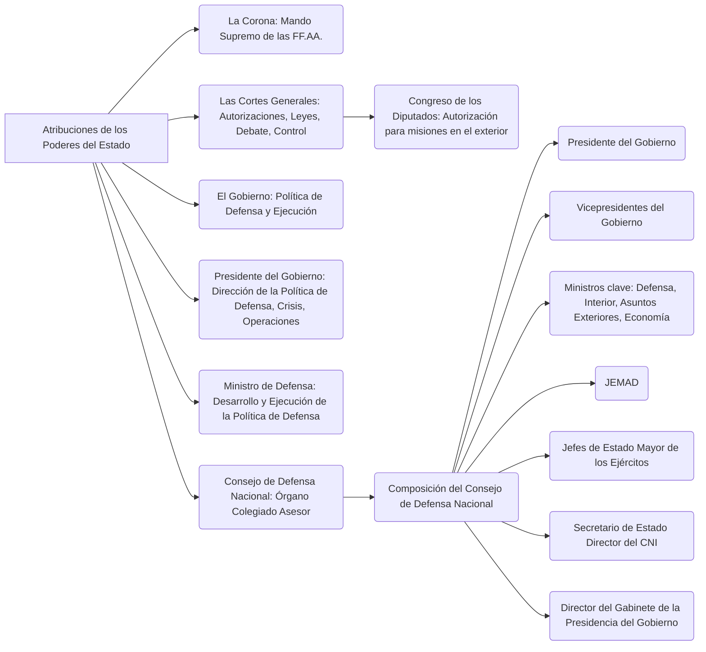
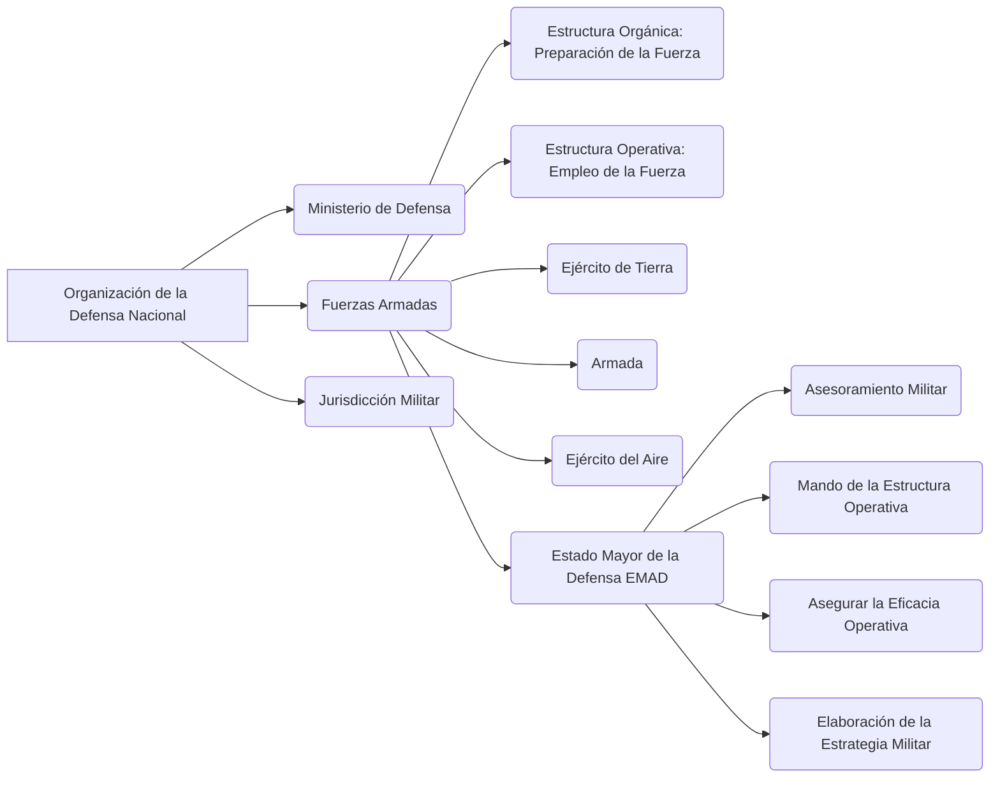
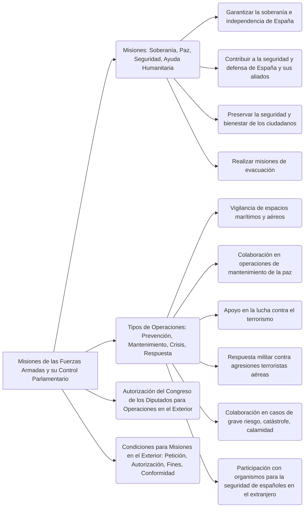
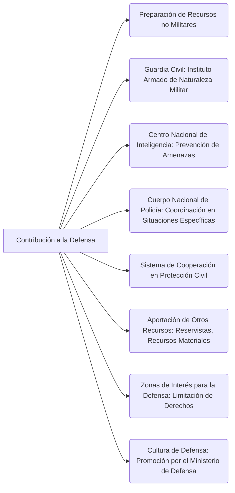

---
{"dg-publish":true,"permalink":"/opo-melilla/bloque-1/tema-2/defensa-nacional/"}
---

# Ley Orgánica 5/2005, de 17 de noviembre, de la Defensa Nacional

TEXTO CONSOLIDADO. Última modificación: sin modificaciones

# TÍTULO PRELIMINAR

## Objeto

**Artículo 1. Objeto de la Ley.**

Esta Ley Orgánica regula la [[OpoMelilla/BLOQUE 1/Tema 2/Defensa Nacional\|defensa nacional]] y establece las bases de la [[organización militar\|organización militar]] conforme a los principios establecidos en la [[Constitución Española\|Constitución]].

**Artículo 2. Finalidad de la política de defensa.**

La **política de defensa** tiene por finalidad la **protección** del conjunto de la [[sociedad española\|sociedad española]], de su [[Constitución Española\|Constitución]], de los **valores superiores**, **principios** e **instituciones** que en ésta se consagran, del [[Estado social y democrático de derecho\|Estado social y democrático de derecho]], del **pleno ejercicio de los derechos y libertades**, y de la **garantía, independencia e integridad territorial de España**.  Asimismo, tiene por objetivo **contribuir a la preservación de la paz y seguridad internacionales**, en el marco de los compromisos contraídos por el Reino de España.

🔑 **Aspectos Clave:**
*   El **objeto** de la ley es regular la **defensa nacional** y la **organización militar**.
*   La **finalidad** de la política de defensa es proteger la **sociedad española**, la **Constitución**, sus **valores**, y **contribuir a la paz internacional**.

💡 **Consejo de Estudio:**
*   Centrarse en las definiciones de **defensa nacional** y **política de defensa**.  Relacionar ambas definiciones.

# TÍTULO I

## De las atribuciones de los poderes del Estado

**Artículo 3. La Corona.**

Corresponden al **Rey** el **mando supremo de las Fuerzas Armadas** y las demás funciones que en materia de defensa le confiere la [[Constitución Española\|Constitución]] y el resto del ordenamiento jurídico.

**Artículo 4. Las Cortes Generales.**

1.  A las **Cortes Generales** les corresponde:

    a) Otorgar las autorizaciones previas para prestar el consentimiento del Estado a obligarse por medio de los tratados y convenios internacionales, así como las restantes autorizaciones previstas en el artículo 94.1.b) de la [[Constitución Española\|Constitución]].

    b) Aprobar las leyes relativas a la [[OpoMelilla/BLOQUE 1/Tema 2/Defensa Nacional\|defensa]] y los créditos presupuestarios correspondientes.

    c) Debatir las líneas generales de la **política de defensa**. A estos efectos, el Gobierno presentará las iniciativas correspondientes, singularmente los planes de reclutamiento y modernización.

    d) Controlar la acción del Gobierno en materia de [[OpoMelilla/BLOQUE 1/Tema 2/Defensa Nacional\|defensa]].

    e) Acordar la autorización a que se refiere el artículo 63.3 de la [[Constitución Española\|Constitución]].

2.  En particular, al **Congreso de los Diputados** le corresponde autorizar, con carácter previo, la participación de las **Fuerzas Armadas** en misiones fuera del territorio nacional, de acuerdo con lo establecido en esta Ley.

**Artículo 5. El Gobierno.**

Corresponde al **Gobierno** determinar la **política de defensa** y asegurar su ejecución, así como dirigir la **Administración militar** y acordar la participación de las **Fuerzas Armadas** en misiones fuera del territorio nacional.

**Artículo 6. El Presidente del Gobierno.**

1.  Corresponde al **Presidente del Gobierno** la **dirección de la política de defensa** y la determinación de sus objetivos, la **gestión de las situaciones de crisis** que afecten a la [[OpoMelilla/BLOQUE 1/Tema 2/Defensa Nacional\|defensa]] y la **dirección estratégica de las operaciones militares** en caso de uso de la fuerza.

2.  El **Presidente del Gobierno** ejerce su autoridad para ordenar, coordinar y dirigir la actuación de las **Fuerzas Armadas** así como disponer su empleo.

3.  Asimismo, en el marco de la **política de defensa**, le corresponde de forma específica:

    a) Formular la **Directiva de Defensa Nacional**, en la que se establecerán las líneas generales de la **política de defensa** y las directrices para su desarrollo.

    b) Definir y aprobar los grandes **objetivos y planteamientos estratégicos**, así como formular las directivas para las negociaciones exteriores que afecten a la **política de defensa**.

    c) Determinar la aplicación de los objetivos y las líneas básicas de actuación de las **Fuerzas Armadas**, tanto en el ámbito nacional como en el de la participación en las organizaciones internacionales de las que España forma parte.

    d) Ordenar las misiones de las **Fuerzas Armadas**.

    e) Ejercer las demás funciones que le atribuyen las disposiciones legales y reglamentarias.

**Artículo 7. El Ministro de Defensa.**

1.  Corresponde al **Ministro de Defensa**, además de las competencias que le asignan las leyes reguladoras del Gobierno y de la Administración General del Estado, el desarrollo y la ejecución de la **política de defensa**.

2.  Asimismo y de forma específica le corresponde:

    a) Asistir al **Presidente del Gobierno** en la **dirección estratégica de las operaciones militares**.

    b) Dirigir la actuación de las **Fuerzas Armadas** bajo la autoridad del **Presidente del Gobierno**.

    c) Determinar y ejecutar la **política militar**.

    d) Dirigir, como miembro del Gobierno, la **Administración militar** y desarrollar las directrices y disposiciones reglamentarias que adopte el Consejo de Ministros.

    e) Ejercer las demás funciones que le atribuyen las disposiciones legales y reglamentarias.

**Artículo 8. Consejo de Defensa Nacional.**

1.  El **Consejo de Defensa Nacional** es el órgano colegiado, coordinador, asesor y consultivo del **Presidente del Gobierno** en materia de [[OpoMelilla/BLOQUE 1/Tema 2/Defensa Nacional\|defensa]]. A iniciativa del **Presidente del Gobierno**, podrá funcionar en pleno y como consejo ejecutivo.

2.  El **Consejo de Defensa Nacional** en pleno informará al **Rey**, a propuesta del **Presidente del Gobierno**. Cuando el **Rey** asista a las reuniones del Consejo, lo presidirá.

3.  Asistirá al **Presidente del Gobierno** en la **dirección de conflictos armados** y en la **gestión de las situaciones de crisis** que afecten a la [[OpoMelilla/BLOQUE 1/Tema 2/Defensa Nacional\|defensa]] y, de forma general, en las demás funciones previstas en el Artículo 6 de esta Ley.

4.  Corresponde también al Consejo emitir informe sobre las grandes directrices de la **política de defensa** y ofrecer al Gobierno propuestas sobre asuntos relacionados con la [[OpoMelilla/BLOQUE 1/Tema 2/Defensa Nacional\|defensa]] que, afectando a varios Ministerios, exijan una propuesta conjunta.

5.  El **Consejo de Defensa Nacional** en pleno tendrá la siguiente composición:

    a) El **Presidente del Gobierno**, que lo presidirá.

    b) Los **Vicepresidentes del Gobierno**.

    c) Los **Ministros de Defensa, del Interior, de Asuntos Exteriores y de Cooperación y de Economía y Hacienda**.

    d) El **Jefe de Estado Mayor de la Defensa**.

    e) Los **Jefes de Estado Mayor del Ejército de Tierra, de la Armada y del Ejército del Aire**.

    f) El **Secretario de Estado Director del Centro Nacional de Inteligencia**.

    g) El **Director del Gabinete de la Presidencia del Gobierno**.

6.  El **Consejo Ejecutivo** tendrá la siguiente composición:

    a) El **Presidente del Gobierno**, que lo presidirá.

    b) Los **Ministros de Defensa, del Interior y de Asuntos Exteriores y de Cooperación**.

    c) El **Jefe de Estado Mayor de la Defensa**.

    d) El **Secretario de Estado Director del Centro Nacional de Inteligencia**.

    e) El **Director del Gabinete de la Presidencia del Gobierno**.

7.  Podrán ser convocados, en función de la naturaleza de los asuntos que se traten, tanto al Pleno como al Consejo Ejecutivo, el resto de los miembros del Gobierno. Asimismo podrán ser convocados al Consejo Ejecutivo otros miembros del Pleno del Consejo.

8.  También podrán ser convocadas al **Consejo de Defensa Nacional** otras autoridades o cargos de la Administración General del Estado.

    Las autoridades o cargos de las Comunidades Autónomas y de las Ciudades con Estatuto de Autonomía deberán ser convocados cuando se estime oportuno. Igualmente podrán ser convocadas autoridades de los gobiernos locales o aquellas personas cuya contribución se considere relevante.

9.  Para el ejercicio de sus funciones, el Consejo contará con la **Comisión Interministerial de Defensa**, adscrita al Ministerio de Defensa, como órgano de trabajo permanente.

10. El régimen de funcionamiento del **Consejo de Defensa Nacional** y la composición y funciones de la **Comisión Interministerial de Defensa**, se determinarán reglamentariamente.

🔑 **Aspectos Clave:**
*   **Distribución de responsabilidades** entre los diferentes poderes del Estado en materia de **defensa nacional**.
*   **Funciones específicas** del **Rey**, las **Cortes Generales**, el **Gobierno**, el **Presidente del Gobierno**, el **Ministro de Defensa**, y el **Consejo de Defensa Nacional**.
*   **Composición** y **funciones** del **Consejo de Defensa Nacional**.

💡 **Consejo de Estudio:**
*   Crear una tabla comparativa con las funciones de cada uno de los poderes del Estado.
*   Memorizar la composición del **Consejo de Defensa Nacional**.

# TÍTULO II

## Organización

### CAPÍTULO I

#### Ministerio de Defensa

**Artículo 9. Ministerio de Defensa.**

1.  El **Ministerio de Defensa** es el departamento de la Administración General del Estado al que corresponde la **preparación, el desarrollo y la ejecución de la política de defensa** determinada por el Gobierno, la obtención y gestión de los recursos humanos y materiales para ello, así como la realización de cuantos cometidos sean necesarios para el cumplimiento de las misiones que se asignen a las **Fuerzas Armadas**, con arreglo a lo dispuesto en la presente Ley.

2.  En el **Ministerio de Defensa** se integran las **Fuerzas Armadas**, de forma que el conjunto de la organización adquiera la necesaria vertebración para posibilitar la ejecución eficaz de la **política de defensa** y de la **política militar**.

### CAPÍTULO II

#### Organización de las Fuerzas Armadas

**Artículo 10. Fuerzas Armadas.**

1.  Las **Fuerzas Armadas** son el elemento esencial de la [[OpoMelilla/BLOQUE 1/Tema 2/Defensa Nacional\|defensa]] y constituyen una entidad única que se concibe como un conjunto integrador de las formas de acción específicas de cada uno de sus componentes: el **Ejército de Tierra**, la **Armada** y el **Ejército del Aire**.

2.  La organización de las **Fuerzas Armadas** deberá posibilitar el cumplimiento de las misiones que se le encomienden en el marco específico, conjunto y combinado, de forma que se asegure la eficacia en la ejecución de las operaciones militares.

3.  Los miembros de las **Fuerzas Armadas** se integrarán o adscribirán a distintos cuerpos, de acuerdo con los cometidos que deban desempeñar. Estos cuerpos podrán ser específicos de los Ejércitos o comunes de las **Fuerzas Armadas**.

**Artículo 11. Organización básica.**

1.  Las **Fuerzas Armadas** se organizan en dos estructuras: una **orgánica**, para la preparación de la fuerza, y otra **operativa**, para su empleo en las misiones que se le asignen.

2.  La **estructura orgánica** posibilitará la generación de la **estructura operativa**. Se establecerá mediante criterios de funcionalidad basados en los medios y formas propias de acción del **Ejército de Tierra**, de la **Armada** y del **Ejército del Aire**, y en una organización homogénea de éstos.

3.  La **estructura operativa**, establecida para el desarrollo de la acción conjunta y combinada, se organizará con arreglo al principio de unidad de mando y a los criterios necesarios para la consecución de la máxima capacidad operativa.

4.  Para alcanzar el funcionamiento de ambas estructuras con criterios de eficacia y economía de medios, se unificarán los servicios cuyos cometidos no deban ser exclusivos de un Ejército y se organizarán de manera centralizada la logística común y la adquisición de recursos.

**Artículo 12. El Estado Mayor de la Defensa.**

1.  El **Estado Mayor de la Defensa (EMAD)** constituye el órgano auxiliar de mando y apoyo al **Jefe de Estado Mayor de la Defensa (JEMAD)**. Se organizará de forma que permita la definición y el desarrollo de la estrategia militar, el planeamiento y conducción de las operaciones militares y el ejercicio del resto de sus competencias.

2.  El **Jefe de Estado Mayor de la Defensa (JEMAD)** ejercerá el mando del **Estado Mayor de la Defensa**, en cuya organización contará con un **Cuartel General** y un **Mando de Operaciones** subordinado. Cuando cualquier circunstancia le impida ejercer temporalmente el cargo, le sustituirá en sus funciones, con carácter accidental, el Jefe de Estado Mayor del Ejército de Tierra, de la Armada o del Ejército del Aire de más antigüedad.

3.  En particular, le corresponde al **Jefe de Estado Mayor de la Defensa**:

    a) La función de **asesoramiento militar** al **Presidente del Gobierno** y al **Ministro de Defensa**, a los que auxiliará en la **dirección estratégica de las operaciones militares**.

    b) Ejercer, bajo la dependencia del **Ministro de Defensa**, el mando de la **estructura operativa** de las **Fuerzas Armadas** y la conducción estratégica de las operaciones militares.

    c) Asegurar la **eficacia operativa** de las **Fuerzas Armadas**. A tal fin, podrá supervisar la preparación de las unidades de la fuerza y evaluar su disponibilidad operativa.

    d) Proponer al **Ministro de Defensa** las **capacidades militares** adecuadas para ejecutar la **política militar**.

    e) Elaborar y definir la **estrategia militar**.

    f) Establecer las normas de acción conjunta de las **Fuerzas Armadas** y contribuir a la definición de las normas de acción combinada de fuerzas multinacionales.

    g) Por delegación del **Ministro de Defensa**, podrá ejercer la **representación militar nacional** ante las organizaciones internacionales de Seguridad y Defensa.

4.  El **Jefe de Estado Mayor de la Defensa** coordinará a los **Jefes de Estado Mayor del Ejército de Tierra, de la Armada y del Ejército del Aire**, a quienes impartirá directrices para orientar la preparación de la Fuerza, con el objeto de asegurar la **eficacia operativa** de las **Fuerzas Armadas**.

**Artículo 13. El Ejército de Tierra, la Armada y el Ejército del Aire.**

1.  El **Ejército de Tierra, la Armada y el Ejército del Aire** componen la **estructura orgánica** de las **Fuerzas Armadas** y aportan las capacidades básicas para su **estructura operativa**. Cada uno de ellos está compuesto por:

    a) El **Cuartel General**, constituido por el conjunto de órganos que encuadran los medios humanos y materiales necesarios para asistir al Jefe de Estado Mayor en el ejercicio del mando sobre su respectivo Ejército.

    b) La **Fuerza**, establecida como el conjunto de medios humanos y materiales que se agrupan y organizan con el cometido principal de prepararse para la realización de operaciones militares. En su ámbito, se llevará a cabo el adiestramiento, la preparación y la evaluación de sus unidades y se realizarán, en tiempo de paz, las misiones específicas permanentes que se le asignen.

    c) El **Apoyo a la Fuerza**, entendido como el conjunto de órganos responsables de la dirección, gestión, administración y control de los recursos humanos, materiales y financieros, asignados a cada uno de los Ejércitos. En su ámbito se dirigirá y se controlará el mantenimiento de la Fuerza y se llevarán a cabo las actividades del apoyo logístico que posibilitan la vida y funcionamiento de las unidades, centros y organismos.

2.  Los **Jefes de Estado Mayor del Ejército de Tierra, de la Armada y del Ejército del Aire** ejercerán, bajo la autoridad del **Ministro de Defensa**, el mando de su respectivo Ejército. Cuando cualquier circunstancia les impida ejercer temporalmente el cargo, les sustituirán en sus funciones, respectivamente, con carácter accidental, el Oficial General en servicio activo más antiguo de los que le estén subordinados en su estructura orgánica.

3.  En particular les corresponde a los **Jefes de Estado Mayor**:

    a) Desarrollar la organización, de acuerdo con lo dispuesto por el **Ministro de Defensa**, así como instruir, adiestrar, administrar, proporcionar apoyo logístico y velar por la motivación, disciplina y bienestar de su respectivo Ejército para mantener en todo momento la máxima eficacia, de acuerdo con los recursos asignados.

    b) Desarrollar y ejecutar las misiones que, en tiempo de paz, tengan asignadas con carácter permanente.

    c) Garantizar la adecuada preparación de la Fuerza de su respectivo Ejército para su puesta a disposición de la **estructura operativa** de las **Fuerzas Armadas**.

    d) Asesorar al **Jefe de Estado Mayor de la Defensa** en el empleo de las unidades de su Ejército, así como en la elaboración y formulación de los aspectos específicos de sus respectivas capacidades.

    e) Velar por los intereses generales del personal militar bajo su mando, tutelando en particular el régimen de derechos y libertades derivado de la norma constitucional y de su desarrollo legal.

### CAPÍTULO III

#### Jurisdicción militar

**Artículo 14. Naturaleza y funciones.**

Los órganos de la **jurisdicción militar**, integrante del **Poder Judicial** del Estado, basan su organización y funcionamiento en el principio de unidad jurisdiccional y administran justicia en el ámbito estrictamente castrense y, en su caso, en las materias que establezca la declaración del estado de sitio, de acuerdo con la [[Constitución Española\|Constitución]] y lo dispuesto en las leyes penales, procesales y disciplinarias militares.

🔑 **Aspectos Clave:**
*   El **Ministerio de Defensa** como departamento responsable de la **política de defensa**.
*   La **organización** de las **Fuerzas Armadas** en **estructura orgánica** y **estructura operativa**.
*   El papel del **Estado Mayor de la Defensa (EMAD)** y su **Jefe (JEMAD)**.
*   La composición de las **Fuerzas Armadas**: **Ejército de Tierra**, **Armada**, **Ejército del Aire**.
*   La **jurisdicción militar** como parte del **Poder Judicial**.

💡 **Consejo de Estudio:**
*   Comparar y contrastar la **estructura orgánica** y la **estructura operativa** de las **Fuerzas Armadas**.
*   Estudiar las **funciones** del **Jefe de Estado Mayor de la Defensa (JEMAD)**.

# TÍTULO III

## Misiones de las Fuerzas Armadas y su control parlamentario

### CAPÍTULO I

#### Misiones de las Fuerzas Armadas

**Artículo 15. Misiones.**

1.  Las **Fuerzas Armadas**, de acuerdo con el artículo 8.1 de la [[Constitución Española\|Constitución]], tienen atribuida la misión de **garantizar la soberanía e independencia de España, defender su integridad territorial y el ordenamiento constitucional**.

2.  Las **Fuerzas Armadas** contribuyen militarmente a la **seguridad y defensa de España y de sus aliados**, en el marco de las organizaciones internacionales de las que España forma parte, así como al **mantenimiento de la paz, la estabilidad y la ayuda humanitaria**.

3.  Las **Fuerzas Armadas**, junto con las Instituciones del Estado y las Administraciones públicas, deben **preservar la seguridad y bienestar de los ciudadanos** en los supuestos de **grave riesgo, catástrofe, calamidad u otras necesidades públicas**, conforme a lo establecido en la legislación vigente.

4.  Las **Fuerzas Armadas** pueden, asimismo, llevar a cabo **misiones de evacuación** de los residentes españoles en el extranjero, cuando circunstancias de inestabilidad en un país pongan en grave riesgo su vida o sus intereses.

**Artículo 16. Tipos de operaciones.**

El cumplimiento de las misiones de las **Fuerzas Armadas** y el desarrollo de su contribución complementaria o subsidiaria de interés público requieren realizar diferentes tipos de operaciones, tanto en territorio nacional como en el exterior, que pueden conducir a acciones de **prevención de conflictos** o **disuasión**, de **mantenimiento de la paz**, actuaciones en **situaciones de crisis** y, en su caso, de **respuesta a la agresión**. En particular, las operaciones pueden consistir en:

a) La **vigilancia de los espacios marítimos**, como contribución a la acción del Estado en la mar, la **vigilancia del espacio aéreo** y el **control del espacio aéreo de soberanía nacional** y aquellas otras actividades destinadas a garantizar la **soberanía e independencia de España**, así como a proteger la vida de su población y sus intereses.

b) La **colaboración en operaciones de mantenimiento de la paz y estabilización internacional** en aquellas zonas donde se vean afectadas, la reconstrucción de la seguridad y la administración, así como la rehabilitación de un país, región o zona determinada, conforme a los tratados y compromisos establecidos.

c) El **apoyo a las Fuerzas y Cuerpos de Seguridad del Estado en la lucha contra el terrorismo** y a las instituciones y organismos responsables de los servicios de rescate terrestre, marítimo y aéreo, en las tareas de búsqueda y salvamento.

d) La **respuesta militar contra agresiones** que se realicen utilizando aeronaves con fines terroristas que pongan en peligro la vida de la población y sus intereses. A estos efectos, el Gobierno designará la Autoridad nacional responsable y las **Fuerzas Armadas** establecerán los procedimientos operativos pertinentes.

e) La **colaboración con las diferentes Administraciones públicas** en los supuestos de **grave riesgo, catástrofe, calamidad u otras necesidades públicas**, conforme a lo establecido en la legislación vigente.

f) La **participación con otros organismos nacionales e internacionales** para **preservar la seguridad y el bienestar de los ciudadanos españoles en el extranjero**, de conformidad con los criterios de coordinación y de asignación de responsabilidades que se establezcan.

**Artículo 17. Autorización del Congreso de los Diputados.**

1.  Para ordenar operaciones en el exterior que no estén directamente relacionadas con la defensa de España o del interés nacional, el Gobierno realizará una consulta previa y recabará la **autorización del Congreso de los Diputados**.

2.  En las misiones en el exterior que, de acuerdo con compromisos internacionales, requieran una respuesta rápida o inmediata a determinadas situaciones, los trámites de consulta previa y autorización se realizarán mediante procedimientos de urgencia que permitan cumplir con dichos compromisos.

3.  En los supuestos previstos en el apartado anterior, cuando por razones de máxima urgencia no fuera posible realizar la consulta previa, el Gobierno someterá al **Congreso de los Diputados** lo antes posible la decisión que haya adoptado para la ratificación, en su caso.

**Artículo 18. Seguimiento de las operaciones.**

El Gobierno informará periódicamente, en un plazo en ningún caso superior a un año, al **Congreso de los Diputados** sobre el desarrollo de las operaciones de las **Fuerzas Armadas** en el exterior.

### CAPÍTULO II

#### Condiciones de las misiones en el exterior

**Artículo 19. Condiciones.**

Para que las **Fuerzas Armadas** puedan realizar misiones en el exterior que no estén directamente relacionadas con la defensa de España o del interés nacional, se deberán cumplir las siguientes condiciones:

a) Que se realicen por **petición expresa del Gobierno del Estado en cuyo territorio se desarrollen** o estén **autorizadas en Resoluciones del Consejo de Seguridad de las Naciones Unidas** o **acordadas**, en su caso, por **organizaciones internacionales** de las que España forme parte, particularmente la **Unión Europea** o la **Organización del Tratado del Atlántico Norte (OTAN)**, en el marco de sus respectivas competencias.

b) Que cumplan con los fines **defensivos, humanitarios, de estabilización o de mantenimiento y preservación de la paz**, previstos y ordenados por las mencionadas organizaciones.

c) Que sean **conformes con la Carta de las Naciones Unidas** y que **no contradigan o vulneren los principios del derecho internacional convencional** que España ha incorporado a su ordenamiento, de conformidad con el artículo 96.1 de la [[Constitución Española\|Constitución]].

🔑 **Aspectos Clave:**
*   Las **misiones fundamentales** de las **Fuerzas Armadas** según la [[Constitución Española\|Constitución]].
*   Los **tipos de operaciones** que pueden llevar a cabo las **Fuerzas Armadas**.
*   La **autorización** del **Congreso de los Diputados** para las operaciones en el exterior.
*   Las **condiciones** que deben cumplirse para que las **Fuerzas Armadas** puedan realizar misiones en el exterior.

💡 **Consejo de Estudio:**
*   Relacionar las **misiones** de las **Fuerzas Armadas** con los **tipos de operaciones** que pueden realizar.
*   Prestar atención a las **condiciones** para las misiones en el exterior y los **requisitos** de autorización.

# TÍTULO IV

## De las reglas esenciales del comportamiento de los militares

**Artículo 20. Reglas esenciales del comportamiento de los militares.**

1.  Mediante ley, de acuerdo con la [[Constitución Española\|Constitución]], se establecerán las **reglas esenciales que definen el comportamiento de los militares**, en especial la **disciplina, la jerarquía, los límites de la obediencia**, así como el **ejercicio del mando militar**.

2.  El Gobierno, mediante Real Decreto, procederá asimismo a desarrollar estas reglas en las Reales Ordenanzas para las **Fuerzas Armadas**.

**Artículo 21. Régimen disciplinario.**

1.  El **régimen disciplinario** de las **Fuerzas Armadas** tiene por objeto **garantizar la observancia de las reglas esenciales que definen el comportamiento de los militares** y del ordenamiento legal de la función militar. La potestad disciplinaria corresponde a las autoridades y mandos establecidos en la Ley Orgánica del Régimen Disciplinario de las **Fuerzas Armadas**, sin perjuicio de la tutela jurisdiccional establecida en el artículo 24 de la [[Constitución Española\|Constitución]].

2.  Quedan prohibidos los **Tribunales de Honor** en el ámbito militar.

🔑 **Aspectos Clave:**
*   La importancia de las **reglas esenciales** que definen el **comportamiento de los militares**.
*   Los principios de **disciplina**, **jerarquía** y **límites de la obediencia**.
*   El **régimen disciplinario** de las **Fuerzas Armadas**.
*   La prohibición de los **Tribunales de Honor**.

💡 **Consejo de Estudio:**
*   Reflexionar sobre la importancia de la **disciplina** y la **jerarquía** en la **organización militar**.
*   Buscar información adicional sobre la **Ley Orgánica del Régimen Disciplinario de las Fuerzas Armadas**.

# TÍTULO V

## Contribución a la Defensa

### CAPÍTULO I

#### Preparación de recursos para contribuir a la Defensa

**Artículo 22. Disposición permanente de los recursos.**

1.  El Gobierno establecerá los criterios relativos a la **preparación y disponibilidad de los recursos humanos y materiales no propiamente militares** para satisfacer las necesidades de la [[OpoMelilla/BLOQUE 1/Tema 2/Defensa Nacional\|Defensa Nacional]] en situaciones de **grave amenaza o crisis**, teniendo en cuenta para su aplicación los mecanismos de cooperación y coordinación existentes entre los diferentes poderes públicos.

2.  En tiempo de **conflicto armado** y durante la vigencia del **estado de sitio**, el sistema de disponibilidad permanente de recursos será coordinado por el **Consejo de Defensa Nacional**.

### CAPÍTULO II

#### Guardia Civil

**Artículo 23. Guardia Civil.**

La **Guardia Civil** es un **Instituto armado de naturaleza militar**, dependiente del **Ministro del Interior** en el desempeño de las funciones que se le atribuyen por la Ley Orgánica 2/1986, de 13 de marzo, de Fuerzas y Cuerpos de Seguridad, y del **Ministro de Defensa** en el cumplimiento de las **misiones de carácter militar** que se le encomienden.

**Artículo 24. Misiones de carácter militar.**

El Gobierno, mediante Real Decreto, regulará las **misiones de carácter militar** a que se refiere el artículo anterior, aplicando las condiciones y el régimen de consulta previsto en esta Ley a las misiones que se realicen en el exterior.

**Artículo 25. Coordinación de actuaciones.**

En tiempo de **conflicto bélico** y durante la vigencia del **estado de sitio**, las actuaciones de la **Guardia Civil** serán coordinadas por el **Consejo de Defensa Nacional**, dependiendo en tales supuestos directamente del **Ministro de Defensa**, en los términos que determine el **Presidente del Gobierno**.

### CAPÍTULO III

#### Centro Nacional de Inteligencia

**Artículo 26. Centro Nacional de Inteligencia.**

El **Centro Nacional de Inteligencia (CNI)** contribuirá a la obtención, evaluación e interpretación de la información necesaria para prevenir y evitar riesgos o amenazas que afecten a la **independencia e integridad de España**, a los **intereses nacionales** y a la **estabilidad del Estado de Derecho** y sus instituciones.

### CAPÍTULO IV

#### Cuerpo Nacional de Policía

**Artículo 27. Cuerpo Nacional de Policía.**

El **Cuerpo Nacional de Policía**, en los supuestos previstos en el Artículo 25, será coordinado por el **Consejo de Defensa Nacional**, dependiendo del **Ministro del Interior** con el alcance que determine el **Presidente del Gobierno**.

### CAPÍTULO V

#### Contribución de los recursos nacionales

**Artículo 28. Sistema de cooperación en materia de Protección Civil.**

En tiempo de **conflicto bélico** y durante la vigencia del **estado de sitio**, el **Consejo de Defensa Nacional** coordinará las actuaciones del **sistema de cooperación en materia de Protección Civil**. A estos efectos, la acción permanente de los poderes públicos tendrá en cuenta las directrices emanadas del Consejo.

**Artículo 29. Aportación de otros recursos.**

La aportación de otros recursos provenientes de la sociedad, se materializará de la siguiente forma:

a) De acuerdo con el derecho y el deber que los españoles tienen de defender a España, según lo establecido en el artículo 30 de la [[Constitución Española\|Constitución]], la **incorporación adicional de ciudadanos a la Defensa** se apoyará en el principio de contribución gradual y proporcionada a la situación de amenaza que sea necesario afrontar, en la forma que establezca la ley, mediante la **incorporación a las Fuerzas Armadas de los reservistas** que se consideren necesarios.

b) La contribución de los recursos materiales a las diversas necesidades de la [[OpoMelilla/BLOQUE 1/Tema 2/Defensa Nacional\|defensa]] se efectuará a través del órgano interministerial competente. Su composición y funciones se establecerán reglamentariamente.

**Artículo 30. Zonas de interés para la defensa.**

En las zonas del territorio nacional consideradas de **interés para la defensa**, en las que se encuentren constituidas o se constituyan **zonas de seguridad de instalaciones, militares o civiles, declaradas de interés militar**, así como en aquellas en que las exigencias de la defensa o el interés del Estado lo aconsejen, podrán **limitarse los derechos sobre los bienes propiedad de nacionales y extranjeros** situados en ellas, de acuerdo con lo que se determine por ley.

**Artículo 31. Cultura de Defensa.**

El **Ministerio de Defensa** promoverá el desarrollo de la **cultura de defensa** con la finalidad de que la sociedad española conozca, valore y se identifique con su historia y con el esfuerzo solidario y efectivo mediante el que las **Fuerzas Armadas** salvaguardan los intereses nacionales. Asimismo, el resto de los poderes públicos contribuirán al logro de este fin.

🔑 **Aspectos Clave:**
*   La **disponibilidad de recursos no militares** para la **defensa nacional**.
*