---
{"dg-publish":true,"permalink":"/opo-melilla/bloque-1/tema-4-ministerio-de-defensa/"}
---

# LEGISLACIÓN CONSOLIDADA

Real Decreto 205/2024, de 27 de febrero, por el que se desarrolla la estructura orgánica básica del Ministerio de Defensa.

Ministerio para la Transformación Digital y de la Función Pública

«BOE» núm. 52, de 28 de febrero de 2024
Referencia: BOE-A-2024-3791

## ÍNDICE

Preámbulo 3

Artículos 4

Artículo 1. Organización general del Departamento. 4

Artículo 2. Fuerzas Armadas. 5

Artículo 3. Secretaría de Estado de Defensa. 5

Artículo 4. Dirección General de Estrategia e Innovación de la Industria de Defensa. 6

Artículo 4 bis. Dirección General de Armamento y Material. 7

Artículo 5. Dirección General de Asuntos Económicos. 7

Artículo 6. Dirección General de Infraestructura. 8

Artículo 7. El Centro de Sistemas y Tecnologías de la Información y las Comunicaciones. 9

Artículo 8. Subsecretaría de Defensa. 11

Artículo 9. Secretaría General Técnica. 13

Artículo 10. Dirección General de Personal. 14

Artículo 11. Dirección General de Reclutamiento y Enseñanza Militar 16

Artículo 12. Asesoría Jurídica General de la Defensa. 17

Artículo 13. Intervención General de la Defensa. 17

Artículo 14. Inspección General de Sanidad de la Defensa. 18

Artículo 15. Secretaría General de Política de Defensa. 18

Artículo 16. Dirección General de Política de Defensa. 19

Artículo 17. Consejos Superiores. 20

Artículo 18. Juntas Superiores. 20

Disposiciones adicionales 20

Disposición adicional primera. Orden de precedencias de las autoridades del Departamento. 20

Disposición adicional segunda. Centro Nacional de Inteligencia. 21

Disposición adicional tercera. Redes y sistemas de información y telecomunicaciones. 21

Disposición adicional cuarta. Establecimiento Penitenciario Militar de Alcalá de Henares. 21

Disposición adicional quinta. Suplencia de los titulares de los órganos directivos. 21

Disposición adicional sexta. Supresión de órganos directivos. 21

Disposición adicional séptima. Órganos colegiados. 21

Disposición adicional octava. No incremento del gasto público. 21

Disposición adicional novena. Dependencias funcionales y coordinación. 22

Disposición adicional décima. Expedientes de insuficiencia de condiciones psicofísicas y pase a retiro. 22

Disposición adicional undécima. Integración administrativa del Responsable del Sistema de Información Interno del Ministerio de Defensa. 22

Disposiciones transitorias 22

Disposición transitoria única. Unidades y puestos de trabajo con nivel orgánico inferior a subdirección general. 22

Disposiciones derogatorias 22

Disposición derogatoria única. Derogación normativa. 22

Disposiciones finales 23

Disposición final primera. Facultades de desarrollo normativo. 23

Disposición final segunda. Entrada en vigor 23

TEXTO CONSOLIDADO

Última modificación: 11 de septiembre de 2024

El Real Decreto 829/2023, de 20 de noviembre, por el que se reestructuran los departamentos ministeriales, modificó la estructura existente de éstos con el objeto de impulsar los objetivos prioritarios para España, desarrollar el programa político del Gobierno y lograr la máxima eficacia en su acción y la mayor eficiencia en el funcionamiento de la Administración General del Estado. En su artículo 4 dispone que corresponde al Ministerio de Defensa el ejercicio de todas las competencias y atribuciones que le confiere el ordenamiento jurídico como órgano encargado del desarrollo y ejecución de las directrices generales del Gobierno sobre política de defensa.

Posteriormente, el Real Decreto 1009/2023, de 5 de diciembre, por el que se establece la estructura orgánica básica de los departamentos ministeriales, aprueba la nueva organización interna de todos los ministerios y, asimismo, desarrolla la estructura del Ministerio de Defensa que se asemeja a la vigente hasta la fecha, contenida en el Real Decreto 372/2020, de 18 de febrero, por el que se desarrolla la estructura orgánica básica del Ministerio de Defensa, manteniéndose la adscripción del Centro Nacional de Inteligencia al Ministerio de Defensa y la dependencia directa de la Unidad Militar de Emergencias de la persona titular del Ministerio de Defensa.

A partir de los antecedentes normativos anteriormente expuestos, entre otros aspectos, este real decreto dispone las responsabilidades atribuidas a los órganos superiores y órganos directivos que conforman el Ministerio de Defensa, estableciendo las funciones que cada órgano tiene asignadas y sus correspondientes dependencias orgánicas. Asimismo, recoge sucintamente la organización militar de las Fuerzas Armadas que, con arreglo a la [[Ley Orgánica 5/2005, de 17 de noviembre, de la Defensa Nacional\|Ley Orgánica 5/2005, de 17 de noviembre, de la Defensa Nacional]], se regirá por su propia normativa.

En lo que a la Comunicación Institucional de la Defensa se refiere, la anterior Dirección de Comunicación Institucional de la Defensa pasa a denominarse Oficina de Comunicación Institucional y Prensa del Ministerio de Defensa, que dependerá de la persona titular del Departamento a través de su Gabinete.

La Secretaría de Estado de Defensa dirige, impulsa y gestiona las políticas de armamento y material, la investigación, desarrollo e innovación industrial, económica, de infraestructura, medioambiental y de los sistemas, tecnologías y seguridad de la información, la transformación digital del Departamento y las tecnologías de la información y las comunicaciones, y ejerce la dirección funcional del [[Sistema de Información y Gestión de la Infraestructura en el Ministerio de Defensa (SINFRADEF)\|Sistema de Información y Gestión de la Infraestructura en el Ministerio de Defensa (SINFRADEF)]].

Por otra parte, la Subsecretaría de Defensa dirige, planifica, impulsa y gestiona la política de personal, de reclutamiento, de enseñanza, y sanitaria, prestando especial atención a los principios de igualdad efectiva entre mujeres y hombres, a las personas con discapacidad en las Fuerzas Armadas y a la situación del personal militar profesional de tropa y marinería con un compromiso de carácter temporal y a los Reservistas de Especial Disponibilidad. Por ello, en cumplimiento del dictamen aprobado por la Comisión de Defensa del Congreso de los Diputados, de 27 de septiembre de 2018, se establecen actuaciones y responsabilidades, dentro de la [[Estrategia Integral de Desarrollo Profesional para personal militar del Departamento\|Estrategia Integral de Desarrollo Profesional para personal militar del Departamento]], encaminadas al desarrollo profesional y formación de dichos colectivos que les permita tomar decisiones sobre su futuro profesional, incluyendo la promoción en el seno de las Fuerzas Armadas para los que permanecen o su reincorporación al ámbito laboral civil, dirigido tanto al personal militar que está en activo como al colectivo de Reservistas de Especial Disponibilidad, con los que el Departamento está firmemente comprometido.

Asimismo, conforme dispone el Real Decreto 799/2005, de 1 de julio, por el que se regulan las inspecciones generales de servicios de los Departamentos ministeriales, se hace necesario incorporar una Inspección General de Servicios, dentro de la Vicesecretaría General Técnica.

Finalmente, la Secretaría General de Política de Defensa dirige, impulsa y gestiona el desarrollo y ejecución de la política de defensa y de la promoción de la cultura de defensa, así como la diplomacia de defensa. Asimismo, dirige la contribución del Ministerio de Defensa a la conducción de crisis y emergencias.

En cumplimiento de lo previsto en la Ley 50/1997, de 27 de noviembre, del Gobierno, este real decreto se adecua a los principios de buena regulación a que se refiere el artículo 129 de la Ley 39/2015, de 1 de octubre, del Procedimiento Administrativo Común de las Administraciones Públicas. En concreto, cumple con los principios de necesidad y eficacia, pues se trata de un instrumento necesario y adecuado para servir al interés general y a la efectiva ejecución de las políticas públicas del Gobierno en las materias responsabilidad del Ministerio de Defensa. También se adecua al principio de proporcionalidad, pues no existe otra alternativa para crear un nuevo marco orgánico de este Departamento ministerial. En cuanto a los principios de seguridad jurídica, transparencia y eficiencia, la norma se adecua a los mismos pues es coherente con el resto del ordenamiento jurídico y del mismo no se derivan nuevas cargas administrativas.

En su virtud, a iniciativa de la Ministra de Defensa, a propuesta del Ministro de Transformación Digital y Función Pública, y previa deliberación del Consejo de Ministros en su reunión del día 27 de febrero de 2024,

DISPONGO:

## Artículos

### Artículo 1. Organización general del Departamento.

1. El **Ministerio de Defensa** es el **Departamento de la Administración General del Estado** al que le corresponde la **preparación, el desarrollo y la ejecución de la política de defensa** determinada por el Gobierno y la **gestión de la administración militar**.

2. Las competencias atribuidas en este real decreto se entenderán en **coordinación** y sin perjuicio de aquellas que corresponden a otros Departamentos ministeriales.

3. El Ministerio de Defensa, bajo la dirección de la persona titular del Departamento, se estructura en:

	*   a) Las Fuerzas Armadas.
	*   b) La Secretaría de Estado de Defensa.
	*   c) La Subsecretaría de Defensa.
	*   d) La Secretaría General de Política de Defensa.

4.  Está adscrito al Ministerio de Defensa, con dependencia directa de la persona titular del Departamento, el [[Centro Nacional de Inteligencia\|Centro Nacional de Inteligencia]].

5.  La Guardia Civil depende de la persona titular del Ministerio de Defensa en los términos previstos en la [[Ley Orgánica 2/1986, de 13 de marzo, de Fuerzas y Cuerpos de Seguridad\|Ley Orgánica 2/1986, de 13 de marzo, de Fuerzas y Cuerpos de Seguridad]]; en la [[Ley Orgánica 5/2005, de 17 de noviembre, de la Defensa Nacional\|Ley Orgánica 5/2005, de 17 de noviembre, de la Defensa Nacional]]; en la [[Ley Orgánica 12/2007, de 22 de octubre, del régimen disciplinario de la Guardia Civil\|Ley Orgánica 12/2007, de 22 de octubre, del régimen disciplinario de la Guardia Civil]], y en la [[Ley 29/2014, de 28 de noviembre, de Régimen del Personal de la Guardia Civil\|Ley 29/2014, de 28 de noviembre, de Régimen del Personal de la Guardia Civil]].

6.  Son órganos asesores y consultivos de la persona titular del Departamento:

	*   a) El Consejo Superior del Ejército de Tierra.
	*   b) El Consejo Superior de la Armada.
	*   c) El Consejo Superior del Ejército del Aire y del Espacio.
	*   d) La Junta Superior del Cuerpo Jurídico Militar.
	*   e) La Junta Superior del Cuerpo Militar de Intervención.
	*   f) La Junta Superior del Cuerpo Militar de Sanidad.
	*   g) La Junta Superior del Cuerpo de Músicas Militares.

7.  En consonancia con el artículo 10 de la [[Ley 50/1997, de 27 de noviembre, del Gobierno\|Ley 50/1997, de 27 de noviembre, del Gobierno]], existe un Gabinete, con rango de dirección general, de asesoramiento a la persona titular del Ministerio de Defensa, que actúa como órgano de apoyo político, técnico, administrativo y en tareas de confianza en el cumplimiento de las labores de carácter parlamentario, en sus relaciones con las instituciones y en la organización administrativa.

Por otra parte, también existe un Gabinete Técnico, al que corresponde la asistencia técnica en materias relativas al enlace con las Fuerzas Armadas, cuya persona titular será un oficial general, con rango de director general, según consta en el artículo 3.1.d) del [[Real Decreto 1009/2023, de 5 de diciembre\|Real Decreto 1009/2023, de 5 de diciembre]], por el que se establece la estructura orgánica básica de los departamentos ministeriales.

8.  Del Gabinete de la persona titular del Ministerio de Defensa depende, con rango de subdirección general, la **Oficina de Comunicación Institucional y Prensa del Ministerio de Defensa**, que actuará como **portavoz oficial del Departamento**, a la que le corresponde **mantener las relaciones informativas y de publicidad institucional, coordinar las oficinas de comunicación de los cuarteles generales, mandos y unidades de las Fuerzas Armadas, y ejercer las competencias en materia de comunicación digital del Ministerio de Defensa, con especial atención a la gestión y actualización del contenido de la página electrónica del Departamento**. Igualmente, asumirá la dirección funcional y editorial de la Revista Española de Defensa y de todas las publicaciones periódicas de carácter no específicamente técnico-administrativo pertenecientes al Ministerio de Defensa.

💡 ***Tip/Consejo: Este artículo establece la estructura fundamental del Ministerio de Defensa, delineando sus componentes clave, desde las Fuerzas Armadas hasta los órganos de asesoramiento. Comprender esta estructura es crucial para entender cómo se toman las decisiones y se ejecutan las políticas de defensa.***

🔑 ***Aspecto Clave: El Ministerio de Defensa es el órgano encargado de la política de defensa y la administración militar, estructurado en Fuerzas Armadas, Secretarías y una Oficina de Comunicación.***

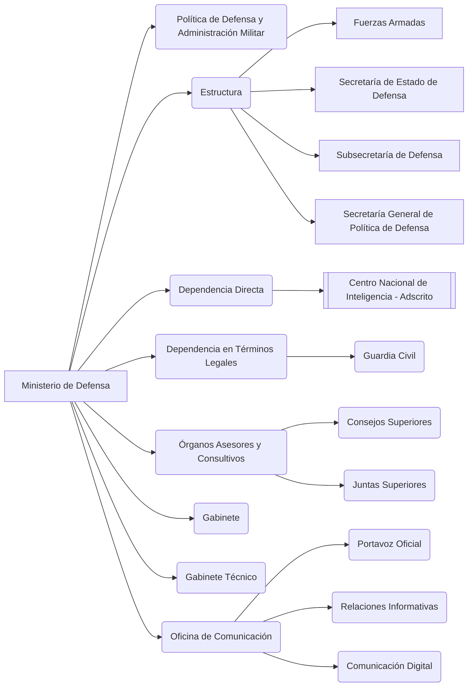
```mermaid
graph LR
    A[Ministerio de Defensa] --> B(Política de Defensa y Administración Militar)
    A --> C(Estructura)
    C --> C1[Fuerzas Armadas]
    C --> C2[Secretaría de Estado de Defensa]
    C --> C3[Subsecretaría de Defensa]
    C --> C4[Secretaría General de Política de Defensa]
    A --> D(Dependencia Directa)
    D --> D1[[Centro Nacional de Inteligencia - Adscrito]]
    A --> E(Dependencia en Términos Legales)
    E --> E1(Guardia Civil)
    A --> F(Órganos Asesores y Consultivos)
    F --> F1(Consejos Superiores)
    F --> F2(Juntas Superiores)
    A --> G(Gabinete)
    A --> G1(Gabinete Técnico)
    A --> H(Oficina de Comunicación)
    H --> H1(Portavoz Oficial)
    H --> H2(Relaciones Informativas)
    H --> H3(Comunicación Digital)
```

### Artículo 2. Fuerzas Armadas.

1.  La **organización militar** se rige por su **normativa específica**, con arreglo a lo dispuesto en la [[Ley Orgánica 5/2005, de 17 de noviembre\|Ley Orgánica 5/2005, de 17 de noviembre]].

2.  El **Jefe de Estado Mayor de la Defensa (JEMAD)**, con rango de secretario de estado, ostentará la **representación del Departamento**, por delegación de la persona titular del Departamento, en los casos en que ésta se la confiera, y la **representación militar nacional ante las organizaciones internacionales de seguridad y defensa**.

3.  El Jefe de Estado Mayor de la Defensa cuenta, como órganos de apoyo, asesoramiento y asistencia inmediata, con un Gabinete, con rango de subdirección general y con la estructura que establece el artículo 23.3 del [[Real Decreto 1009/2023, de 5 de diciembre\|Real Decreto 1009/2023, de 5 de diciembre]], y con un Gabinete Técnico, cuya persona titular será un oficial general u oficial, también con rango de subdirector general.

4.  Dependen del Jefe de Estado Mayor de la Defensa las representaciones militares en los organismos internacionales.

5.  Los **Jefes de Estado Mayor del Ejército de Tierra, de la Armada y del Ejército del Aire y del Espacio tienen rango de subsecretario**.

6.  La **Unidad Militar de Emergencias (UME)**, que **depende orgánicamente de la persona titular del Ministerio de Defensa**, está constituida de forma permanente y tiene como misión la intervención en cualquier lugar del territorio nacional y en el exterior, para contribuir a la seguridad y bienestar de los ciudadanos en los supuestos de grave riesgo, catástrofe, calamidad u otras necesidades públicas, con arreglo a lo dispuesto en el [[Real Decreto 1097/2011, de 22 de julio\|Real Decreto 1097/2011, de 22 de julio]], por el que se aprueba el Protocolo de Intervención de la Unidad Militar de Emergencias. La persona titular del Departamento dictará las normas que regulen la organización y el funcionamiento de esta unidad en el ámbito del Departamento.

Sin perjuicio de lo anterior, como parte integrante de las Fuerzas Armadas, el Jefe del Estado Mayor de la Defensa ejercerá sobre la UME las competencias que, con arreglo a lo establecido en los artículos 12.3.b) y 15.2 de la [[Ley Orgánica 5/2005, de 17 de noviembre\|Ley Orgánica 5/2005, de 17 de noviembre]], le atribuye en los supuestos de conducción de operaciones militares que contribuyan a la seguridad y defensa de España y de sus aliados.

💡 ***Tip/Consejo: Este artículo detalla la estructura y funciones de las Fuerzas Armadas dentro del Ministerio de Defensa, resaltando el papel del JEMAD y la UME. Es importante comprender la relación jerárquica y las responsabilidades de cada actor.***

🔑 ***Aspecto Clave: Las Fuerzas Armadas, lideradas por el JEMAD y los Jefes de Estado Mayor, se rigen por su propia normativa, con la UME dependiendo directamente del titular del Ministerio.***

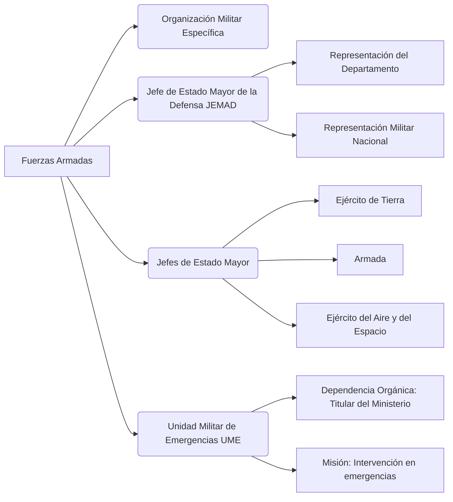
```mermaid
graph LR
    A[Fuerzas Armadas] --> B(Organización Militar Específica)
    A --> C(Jefe de Estado Mayor de la Defensa JEMAD)
    C --> C1[Representación del Departamento]
    C --> C2[Representación Militar Nacional]
    A --> D(Jefes de Estado Mayor)
    D --> D1[Ejército de Tierra]
    D --> D2[Armada]
    D --> D3[Ejército del Aire y del Espacio]
    A --> E(Unidad Militar de Emergencias UME)
    E --> E1[Dependencia Orgánica: Titular del Ministerio]
    E --> E2[Misión: Intervención en emergencias]
```

### Artículo 3. Secretaría de Estado de Defensa.

1.  La **Secretaría de Estado de Defensa** es el **órgano superior del Departamento** al que le corresponden, además de las competencias que le encomienda el artículo 62 de la [[Ley 40/2015, de 1 de octubre, de Régimen Jurídico del Sector Público\|Ley 40/2015, de 1 de octubre, de Régimen Jurídico del Sector Público]], la **dirección, impulso y gestión de las políticas de armamento y material, la investigación, desarrollo e innovación industrial, económica, de infraestructura, medioambiental y de los sistemas, tecnologías y seguridad de la información en el ámbito de la Defensa, así como el impulso del proceso de transformación digital del Departamento**.

2.  Asimismo, contribuirá a la elaboración y ejecución de la política de defensa y ejercerá las competencias que le correspondan en el planeamiento de la Defensa.

3.  De la Secretaría de Estado de Defensa dependen los siguientes órganos directivos, con rango de Dirección General:

	*   a) La Dirección General de Estrategia e Innovación de la Industria de Defensa.
	*   b) La Dirección General de Armamento y Material.
	*   c) La Dirección General de Asuntos Económicos.
	*   d) La Dirección General de Infraestructura.
	*   e) El Centro de Sistemas y Tecnologías de la Información y las Comunicaciones.

4.  La persona titular de la Secretaría de Estado cuenta, como órganos de apoyo, asesoramiento y asistencia inmediata, con un Gabinete, con nivel orgánico de subdirección general y con la estructura que establece el artículo 23.3 del [[Real Decreto 1009/2023, de 5 de diciembre\|Real Decreto 1009/2023, de 5 de diciembre]], y con un Gabinete Técnico, cuya persona titular será un oficial general u oficial, también con rango de subdirector general.

5.  La persona titular de la Secretaría de Estado de Defensa ostentará, en materias propias de su competencia, por delegación de la persona titular del Ministerio de Defensa, la representación del Departamento en los casos en que ésta se la encomiende.

6.  Están adscritos a la Secretaría de Estado de Defensa el organismo autónomo [[Instituto Nacional de Técnica Aeroespacial «Esteban Terradas»\|Instituto Nacional de Técnica Aeroespacial «Esteban Terradas»]] y el organismo autónomo [[Instituto de Vivienda, Infraestructura y Equipamiento de la Defensa\|Instituto de Vivienda, Infraestructura y Equipamiento de la Defensa]], así como la [[Agencia Estatal Agencia Espacial Española\|Agencia Estatal Agencia Espacial Española]], en los términos establecidos en el artículo 1.3. del Estatuto de la [[Agencia Estatal Agencia Espacial Española\|Agencia Estatal Agencia Espacial Española]], aprobado por el Real Decreto 158/2023, de 7 de marzo.

7.  Depende de la Secretaría de Estado de Defensa la Junta de Enajenación de Bienes Muebles y Productos de Defensa.

💡 ***Tip/Consejo: Este artículo define la Secretaría de Estado de Defensa como un órgano superior con amplias responsabilidades en la gestión de recursos, tecnología e innovación. Es crucial entender su papel central en la modernización y eficiencia del Ministerio.***

🔑 ***Aspecto Clave: La Secretaría de Estado de Defensa es el órgano superior encargado de la gestión de armamento, innovación, economía, infraestructura, tecnología y la transformación digital del Ministerio.***

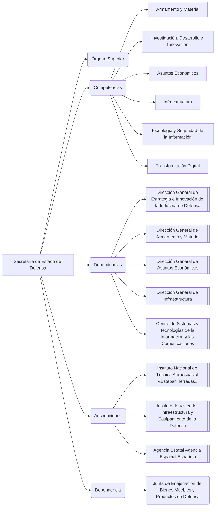
```mermaid
graph LR
    A[Secretaría de Estado de Defensa] --> B(Órgano Superior)
    A --> C(Competencias)
    C --> C1[Armamento y Material]
    C --> C2[Investigación, Desarrollo e Innovación]
    C --> C3[Asuntos Económicos]
    C --> C4[Infraestructura]
    C --> C5[Tecnología y Seguridad de la Información]
    C --> C6[Transformación Digital]
    A --> D(Dependencias)
    D --> D1[[Dirección General de Estrategia e Innovación de la Industria de Defensa]]
    D --> D2[[Dirección General de Armamento y Material]]
    D --> D3[[Dirección General de Asuntos Económicos]]
    D --> D4[[Dirección General de Infraestructura]]
    D --> D5[[Centro de Sistemas y Tecnologías de la Información y las Comunicaciones]]
    A --> E(Adscripciones)
    E --> E1[[Instituto Nacional de Técnica Aeroespacial «Esteban Terradas»]]
    E --> E2[[Instituto de Vivienda, Infraestructura y Equipamiento de la Defensa]]
	E --> E3[[Agencia Estatal Agencia Espacial Española]]
    A --> F(Dependencia)
    F --> F1(Junta de Enajenación de Bienes Muebles y Productos de Defensa)
```

### Artículo 4. Dirección General de Estrategia e Innovación de la Industria de Defensa.

8.  La **Dirección General de Estrategia e Innovación de la Industria de Defensa** es el **órgano directivo** al que le corresponde la **planificación y desarrollo de la política industrial de la Defensa así como la cooperación industrial en esta materia, la cooperación internacional y representación en foros internacionales de industria de Defensa, el apoyo institucional a la internacionalización de la industria de Defensa española y a la exportación, el control del comercio exterior de armamento y material, de las transferencias de tecnología a terceros países y de los activos tanto materiales como inmateriales derivados de la política industrial y de innovación del Departamento**. A estos efectos, dependen funcionalmente de esta dirección general los órganos competentes en las citadas materias de las Fuerzas Armadas y de los organismos autónomos del Departamento.

9.  Corresponden a esta dirección general, en el ámbito de sus competencias, las siguientes funciones:

	*   a) Planificar y programar las políticas de armamento y material y de investigación, desarrollo e innovación del Departamento, y controlar su ejecución.

	*   b) Proponer y dirigir los planes y programas de investigación y desarrollo de sistemas de armas y equipos de interés para la defensa nacional, en coordinación con los organismos nacionales e internacionales competentes en este ámbito y controlar los activos inmateriales derivados de aquellos, que se hayan obtenido, total o parcialmente, con fondos públicos del Ministerio de Defensa, mediante la creación y mantenimiento de los oportunos registros de activos.

	*   c) Impulsar el apoyo institucional a la internacionalización de la industria española de defensa, coordinar la promoción internacional de la enajenación de bienes muebles y productos de defensa y, en coordinación con la Dirección General de Política de Defensa, dirigir las actuaciones de los agregados y consejeros de Defensa.

	*   d) Ejercer las competencias que se le atribuyan para negociar y gestionar la cooperación industrial.

	*   e) Proponer la política industrial de la Defensa, coordinando su actuación con otros organismos.

	*   f) Controlar los activos materiales derivados de esa política que se hayan obtenido, total o parcialmente, con fondos públicos del Ministerio de Defensa, mediante la creación y mantenimiento de los oportunos registros de activos.

	*   g) Impulsar, en coordinación con la Dirección General de Política de Defensa, la cooperación internacional en los ámbitos bilateral y multilateral, así como ejercer la representación nacional en los foros industriales y de armamento de dichas organizaciones.

	*   h) Ejercer las competencias atribuidas en relación con el control del comercio exterior de material de defensa y de productos y tecnologías de doble uso.

	*   i) Apoyar la exportación de productos y tecnologías de Defensa y de doble uso.

	*   j) Controlar las transferencias de tecnología nacional a terceros países, así como la obtenida de programas, acuerdos o convenios internacionales.

	*   k) Ejercer la gestión de las inversiones extranjeras en España relacionadas con la Defensa.

10.  De esta dirección general dependen los siguientes órganos directivos:

	   a) La Subdirección General de Planificación, Tecnología e Innovación, que desarrolla las funciones señaladas en el apartado 2, letras a) y b).

	   b) La Subdirección General de Estrategia Industrial de la Defensa, que desarrolla las funciones señaladas en el apartado 2, letras c), d), e) y f).

	   c) La Subdirección General de Gestión e Internacionalización de la Industria de Defensa, que desarrolla las funciones señaladas en el apartado 2, letras g), h), i), j) y k).

💡 ***Tip/Consejo: Este artículo describe las responsabilidades de la Dirección General de Estrategia e Innovación en la promoción de la industria de defensa española. Es clave comprender su papel en la planificación, cooperación internacional y control de activos.***

🔑 ***Aspecto Clave: La Dirección General de Estrategia e Innovación lidera la política industrial de la Defensa, la cooperación internacional, el control de comercio exterior y la gestión de activos.***

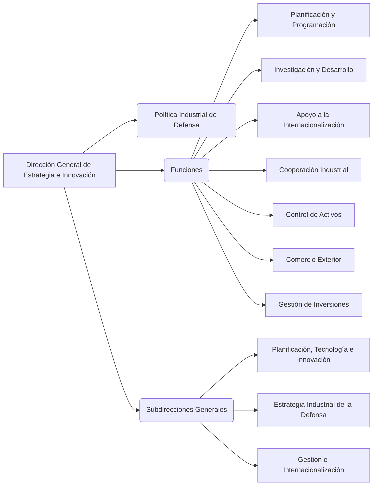
```mermaid
graph LR
    A[Dirección General de Estrategia e Innovación] --> B(Política Industrial de Defensa)
    A --> C(Funciones)
    C --> C1[Planificación y Programación]
    C --> C2[Investigación y Desarrollo]
    C --> C3[Apoyo a la Internacionalización]
    C --> C4[Cooperación Industrial]
    C --> C5[Control de Activos]
    C --> C6[Comercio Exterior]
    C --> C7[Gestión de Inversiones]
    A --> D(Subdirecciones Generales)
    D --> D1[Planificación, Tecnología e Innovación]
    D --> D2[Estrategia Industrial de la Defensa]
    D --> D3[Gestión e Internacionalización]
```

### Artículo 4 bis. Dirección General de Armamento y Material.

11.  La **Dirección General de Armamento y Material** es el **órgano directivo** al que le corresponde la **planificación y desarrollo de la política de armamento y material del Departamento, así como la supervisión y dirección de su ejecución**. A estos efectos, dependen funcionalmente de esta dirección general los órganos competentes en las citadas materias de las Fuerzas Armadas y de los organismos autónomos del Departamento.

12.  Corresponden a esta dirección general, en el ámbito de sus competencias, las siguientes funciones:

	   a) Gestionar, en colaboración con las Fuerzas Armadas, los programas de obtención, de modernización y de sostenimiento común de los sistemas de armas y equipos de interés para la defensa nacional, incluyendo los programas de cooperación internacional y los de venta derivados del apoyo a la internacionalización de la industria española de defensa, así como armonizar y racionalizar su sostenimiento.

	   b) Impulsar la gestión y tramitación de los expedientes de adquisición de los sistemas y equipos necesarios para las Fuerzas Armadas.

	   c) Ejercer las competencias que le confieren las leyes y reglamentos en las siguientes materias: inspección de la actividad industrial y la seguridad industrial relacionada con la Defensa; aseguramiento de la calidad del armamento y material; así como fabricación, comercialización y transporte de armas y explosivos.

	   d) Ejercer las competencias que le confieren las leyes y reglamentos en las siguientes materias: normalización, catalogación y homologación de los sistemas de armas, equipos y productos de interés para las Fuerzas Armadas; certificación de exención por razones de Defensa en materia de registro, evaluación, autorización y restricción de sustancias químicas; aeronavegabilidad; y el resto del ordenamiento jurídico.

	   e) Realizar la administración y gestión económica y contractual de los programas de investigación y desarrollo, de obtención, de modernización y de sostenimiento común no incluidos en la contratación centralizada, de sistemas de armas y equipos de defensa, incluyendo los programas de cooperación internacional, así como la gestión, negociación y administración de los contratos que pudieran derivarse del apoyo a la internacionalización de la industria española de defensa y la exportación asociada de material de defensa.

13.  De esta dirección general dependen los siguientes órganos directivos:

	   a) La Subdirección General de Programas, que desarrolla las funciones señaladas en el apartado 2, letras a) y b).

	   b) La Subdirección General de Inspección y Regulación, que desarrolla las funciones señaladas en el apartado 2, letras c) y d).

	   c) La Subdirección General de Adquisiciones de Armamento y Material, que desarrolla las funciones señaladas en el apartado 2, letra e).

💡 ***Tip/Consejo: Este artículo se enfoca en la Dirección General de Armamento y Material, encargada de la política de armamento y su ejecución. Es importante comprender su rol en la gestión de programas, adquisiciones e inspección.***

🔑 ***Aspecto Clave: La Dirección General de Armamento y Material planifica y ejecuta la política de armamento, gestiona programas de obtención, realiza inspecciones y administra contratos.***

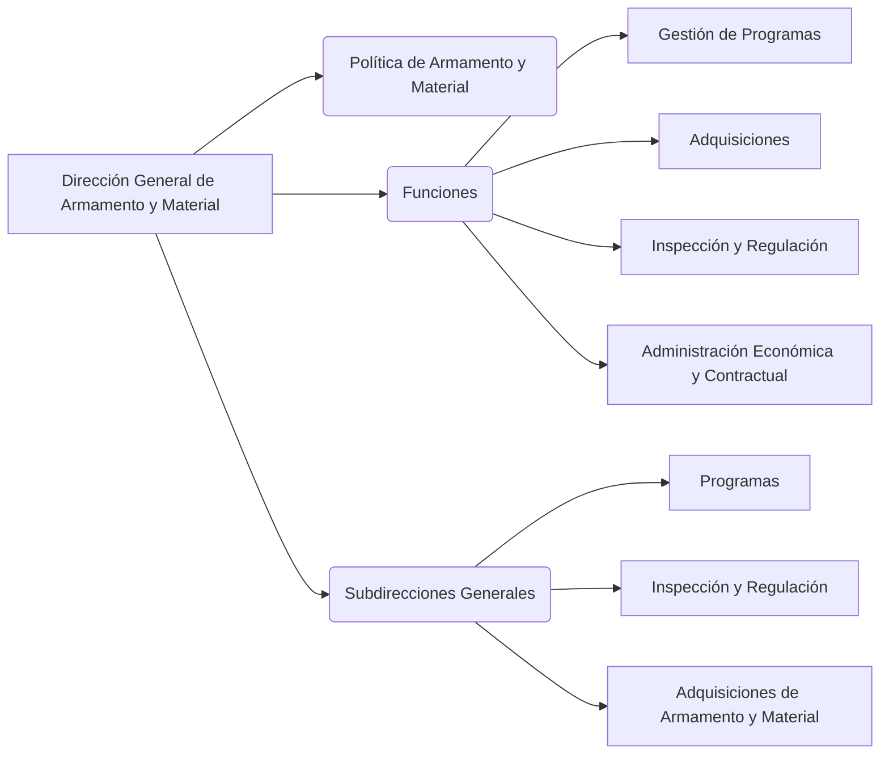
```mermaid
graph LR
    A[Dirección General de Armamento y Material] --> B(Política de Armamento y Material)
    A --> C(Funciones)
    C --> C1[Gestión de Programas]
    C --> C2[Adquisiciones]
    C --> C3[Inspección y Regulación]
    C --> C4[Administración Económica y Contractual]
    A --> D(Subdirecciones Generales)
    D --> D1[Programas]
    D --> D2[Inspección y Regulación]
    D --> D3[Adquisiciones de Armamento y Material]
```

### Artículo 5. Dirección General de Asuntos Económicos.

14.  La **Dirección General de Asuntos Económicos** es el **órgano directivo** al que le corresponde la **planificación y desarrollo de la política económica y financiera del Departamento, así como la supervisión y dirección de su ejecución**. A estos efectos, dependen funcionalmente de esta dirección general todos los órganos competentes en las citadas materias del Departamento y de sus organismos autónomos.

15.  Corresponden a esta dirección general, en el ámbito de sus competencias, las siguientes funciones:

	   a) Dirigir, coordinar y controlar la contabilidad del Departamento, así como el control de los créditos y de la ejecución del gasto.

	   b) Elaborar y proponer los planes de acción ministeriales para la corrección de las debilidades identificadas en la actividad económica del Departamento, impulsar su implementación y realizar su seguimiento.

	   c) Desarrollar la planificación y la programación económica y presupuestaria del Departamento, así como dirigir y controlar su ejecución, ejerciendo la dirección financiera de los programas presupuestarios.

	   d) Ejercer la dirección financiera de los programas presupuestarios y la programación económica.

	   e) Administrar los recursos económicos que se le asignen y los no atribuidos expresamente a otros órganos del Departamento, los destinados a las contribuciones financieras a las organizaciones internacionales en los que participe el Ministerio de Defensa y los asignados para el funcionamiento de sus organismos en el exterior; así como efectuar los pagos y justificación de los recursos destinados a las adquisiciones en el extranjero.

	   f) Ejercer la representación nacional en los comités y órganos de decisión de carácter económico de los organismos internacionales de seguridad y defensa en los que participe el Departamento, en coordinación con el Estado Mayor de la Defensa, la Dirección General de Política de Defensa y los Cuarteles Generales de los Ejércitos y la Armada, según los casos.

	   g) Administrar, en coordinación con el Estado Mayor de la Defensa, los recursos financieros destinados a financiar la participación de las Fuerzas Armadas en operaciones de paz y ayuda humanitaria.

	   h) Planificar y controlar la contratación en el ámbito del Departamento.

	   i) Implementar el análisis de costes y precios de las empresas suministradoras o que participen en programas de defensa, así como el de los costes del ciclo de vida de las inversiones asociadas a los programas de obtención del Departamento.

	   j) Ejercer la dirección funcional de los sistemas informáticos integrales de dirección y administración económica del Departamento.

	   k) Realizar la gestión y pago de las pensiones causadas por el personal saharaui componente de la policía territorial del Sahara y de las unidades especiales del África occidental.

16.  De la Dirección General de Asuntos Económicos dependen, con rango de subdirección general, los siguientes órganos directivos, que se coordinarán con los órganos competentes del Departamento y sus organismos autónomos:

	   a) La Subdirección General de Contabilidad, que desarrolla las funciones señaladas en el apartado 2, letras a) y b).

	   b) La Oficina Presupuestaria, que desarrolla las funciones señaladas en el apartado 2, letras c) y d).

	   c) La Subdirección General de Gestión Económica, que desarrolla las funciones señaladas en el apartado 2, letras e), f), g), j) y k).

	   d) La Subdirección General de Contratación, que desarrolla las funciones señaladas en el apartado 2, letras h) e i).

17.  Asimismo, dependen de la Dirección General de Asuntos Económicos la Junta General de Enajenaciones y Liquidadora de Material y la Secretaría de la Junta de Contratación del Ministerio de Defensa.

💡 ***Tip/Consejo: Este artículo detalla las funciones de la Dirección General de Asuntos Económicos en la gestión financiera del Ministerio. Es esencial comprender su papel en la contabilidad, presupuesto y contratación.***

🔑 ***Aspecto Clave: La Dirección General de Asuntos Económicos planifica y ejecuta la política económica y financiera del Ministerio, gestionando contabilidad, presupuesto, contratación y recursos económicos.***

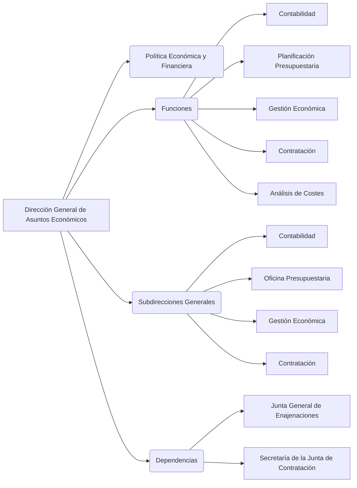
```mermaid
graph LR
    A[Dirección General de Asuntos Económicos] --> B(Política Económica y Financiera)
    A --> C(Funciones)
    C --> C1[Contabilidad]
    C --> C2[Planificación Presupuestaria]
    C --> C3[Gestión Económica]
    C --> C4[Contratación]
    C --> C5[Análisis de Costes]
    A --> D(Subdirecciones Generales)
    D --> D1[Contabilidad]
    D --> D2[Oficina Presupuestaria]
    D --> D3[Gestión Económica]
    D --> D4[Contratación]
    A --> E(Dependencias)
    E --> E1[Junta General de Enajenaciones]
    E --> E2[Secretaría de la Junta de Contratación]
```

### Artículo 6. Dirección General de Infraestructura.

18.  La **Dirección General de Infraestructura** es el **órgano directivo** al que le corresponde la **planificación y desarrollo de las políticas de infraestructura, medioambiental y energética del Departamento, así como la supervisión y dirección de su ejecución**. A estos efectos, dependen funcionalmente de esta dirección general los órganos competentes en las citadas materias de las Fuerzas Armadas y de los organismos autónomos del Departamento.

19.  Corresponden a esta dirección general, en el ámbito de sus competencias, las siguientes funciones:

	   a) Dirigir la ordenación territorial de la infraestructura del Departamento.

	   b) Proponer, definir e implementar las políticas de infraestructura mediante planes y programas, efectuando el seguimiento de su ejecución.

	   c) Realizar el seguimiento de los programas y proyectos internacionales en materia de infraestructura, en coordinación con la Dirección General de Política de Defensa, la Dirección General de Asuntos Económicos y el Estado Mayor Conjunto en lo que afecta a la participación nacional en los Programas de Inversiones en Seguridad de la OTAN (NSIP).

	   d) Proponer, definir y desarrollar la política medioambiental del Departamento y dirigir y supervisar su ejecución.

	   e) Proponer, definir y desarrollar la política energética del Departamento y dirigir y supervisar su ejecución.

	   f) Participar y realizar el seguimiento de programas y proyectos nacionales e internacionales en materia de medio ambiente y eficiencia energética, en coordinación, cuando corresponda, con la Dirección General de Política de Defensa.

	   g) Ejercer la dirección funcional del [[sistema de información y gestión de la infraestructura en el Ministerio de Defensa (SINFRADEF)\|sistema de información y gestión de la infraestructura en el Ministerio de Defensa (SINFRADEF)]].

	   h) Dirigir la gestión de los bienes y derechos inmobiliarios afectos al Ministerio de Defensa y llevar su inventario, gestionando sus adquisiciones, expropiaciones y arrendamientos.

	   i) Ejercer las competencias en relación con las servidumbres aeronáuticas y con las zonas de interés para la defensa nacional, de seguridad de las instalaciones y de acceso restringido a la propiedad por parte de extranjeros.

	   j) Redactar y dirigir la ejecución de los proyectos de infraestructura del órgano central y apoyar en el mismo sentido a los Cuarteles Generales de los Ejércitos y la Armada.

	   k) Supervisar todos los proyectos de infraestructura del Departamento.

	   l) Elaborar la tipificación en materia de infraestructura.

20.  De la Dirección General de Infraestructura dependen los siguientes órganos directivos:

	   a) La Subdirección General de Planificación y Medio Ambiente, que desarrolla las funciones señaladas en el apartado 2, letras a), b), c), d), e), f) y g).

	   b) La Subdirección General de Patrimonio, que desarrolla las funciones señaladas en el apartado 2, letras h) e i).

	   c) La Subdirección General de Proyectos y Obras, que desarrolla las funciones señaladas en el apartado 2, letras j), k) y l).

💡 ***Tip/Consejo: Este artículo se centra en la Dirección General de Infraestructura y su papel en la planificación de infraestructuras, política medioambiental y gestión del patrimonio. Es importante comprender su relación con la sostenibilidad y la eficiencia energética.***

🔑 ***Aspecto Clave: La Dirección General de Infraestructura planifica y desarrolla las políticas de infraestructura, medio ambiente y energía, gestionando el patrimonio inmobiliario y supervisando proyectos.***

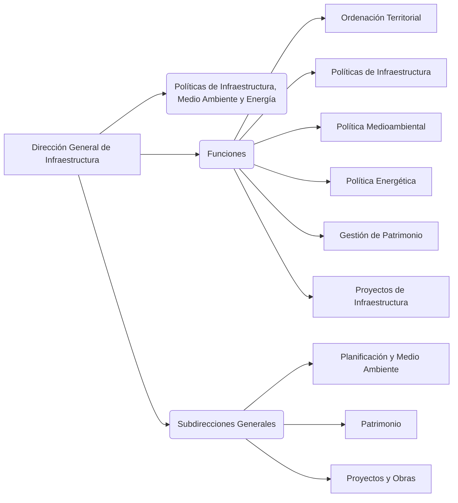
```mermaid
graph LR
    A[Dirección General de Infraestructura] --> B(Políticas de Infraestructura, Medio Ambiente y Energía)
    A --> C(Funciones)
    C --> C1[Ordenación Territorial]
    C --> C2[Políticas de Infraestructura]
    C --> C3[Política Medioambiental]
    C --> C4[Política Energética]
    C --> C5[Gestión de Patrimonio]
    C --> C6[Proyectos de Infraestructura]
    A --> D(Subdirecciones Generales)
    D --> D1[Planificación y Medio Ambiente]
    D --> D2[Patrimonio]
    D --> D3[Proyectos y Obras]
```

### Artículo 7. El Centro de Sistemas y Tecnologías de la Información y las Comunicaciones.

21.  El **Centro de Sistemas y Tecnologías de la Información y las Comunicaciones (CESTIC)** es el **órgano directivo** al que le corresponde la **planificación, desarrollo, programación y gestión de las políticas relativas a los sistemas y tecnologías de la información y las comunicaciones (CIS/TIC), la transformación digital, la gestión de datos, información y conocimiento y la seguridad de la información, así como la supervisión y dirección de su ejecución**. Asimismo, le corresponde la **provisión segura de los servicios de la Infraestructura Integral de Información para la Defensa (13D)** y de las **actuaciones de ciberseguridad para la protección de esta infraestructura y de la información que procesa y gestiona**. También es responsable de la definición de la estrategia tecnológica sobre los CIS/TIC, la transformación digital y la seguridad de la información y en estas materias, en colaboración con la Dirección General de Estrategia e Innovación de la Industria de Defensa, del impulso de un modelo de innovación y del apoyo a la industria nacional de defensa para su participación en proyectos a nivel nacional e internacional.

A los efectos anteriores, dependen funcionalmente de este centro los órganos competentes en las citadas materias de las Fuerzas Armadas y de los organismos autónomos del Ministerio de Defensa.

Su Director asume las funciones de **Oficial Jefe de la Información (CIO)** del Ministerio de Defensa.

22.  Corresponden a este centro, en el ámbito de sus competencias, las siguientes funciones:

*   a) Definir y planificar las políticas y estrategias de los CIS/TIC, su desarrollo y actualización, coordinar su ejecución y velar por su cumplimiento en el ámbito del Departamento.

*   b) Impulsar, desplegar y mantener actualizada la I3D como infraestructura tecnológica de carácter estratégico sobre la que se desplegarán los servicios CIS/TIC para dar respuesta a los cometidos del Ministerio de Defensa, en general y de las Fuerzas Armadas en particular, asegurando las capacidades CIS/TIC necesarias para el cumplimiento de sus misiones operativas y de adiestramiento.

*   c) Dirigir el diseño, la obtención y la configuración de los CIS/TIC para garantizar la normalización, homologación y estandarización de dichos sistemas y su plena interoperabilidad, en el marco de la I3D y de los acuerdos nacionales e internacionales en los que España sea Parte, que afecten a dichos sistemas.

*   d) Supervisar, gestionar y controlar la operación y el mantenimiento de los CIS/TIC para la provisión directa y segura de los servicios de la I3D, a través del Centro de Gestión de Servicios de la I3D, asegurando su continuidad y asumiendo los cometidos de la Autoridad Operacional de todos sus sistemas.

*   e) Impulsar la publicación y gestión de un catálogo de servicios CIS/TIC en colaboración con las Fuerzas Armadas y el resto de ámbitos del Ministerio de Defensa, asegurando su mantenimiento actualizado de acuerdo a la demanda de servicios.

*   f) Dirigir y supervisar la plena integración de las redes y sistemas de información y comunicaciones dentro del Departamento, así como las otras redes nacionales e internacionales, priorizando los servicios críticos para la Defensa y las Fuerzas Armadas.

*   g) Ejercer la responsabilidad del sistema, sobre los medios y servicios de la I3D, a los efectos establecidos en el artículo 13 del Real Decreto 311/2022, de 3 de mayo, por el que se regula el Esquema Nacional de Seguridad.

*   h) Definir y planificar la política de seguridad de la información, su desarrollo y actualización, coordinar su ejecución y velar por su cumplimiento en el ámbito del Departamento.

*   i) Dirigir el diseño, la obtención y la configuración de los sistemas y servicios de seguridad de la información para asegurar el acceso, la confidencialidad, la integridad, la trazabilidad, la autenticidad, la disponibilidad y la conservación de los datos, la información y los servicios utilizados por medios electrónicos en el marco de la I3D.

*   j) Ejercer las actividades necesarias en materia de ciberseguridad para proteger la I3D y los activos de información que en ella se procesan, transmiten y almacenan, incluyendo la dirección y operación del Centro de Operaciones de Seguridad de la I3D (COSI3D) y la realización de análisis de riesgos y auditorías periódicas de seguridad.

*   k) Ejercer la responsabilidad de la seguridad sobre los sistemas de información de la I3D, a los efectos de lo establecido en el artículo 13 del Real Decreto 311/2022, de 3 de mayo.

*   l) Definir y planificar las políticas y estrategias sobre transformación digital del Departamento, su desarrollo y actualización, coordinar su ejecución y velar por su cumplimiento en el ámbito del Ministerio de Defensa.

*   m) Impulsar la transformación digital del Departamento, siguiendo la planificación y programación establecida para su desarrollo en el Plan de Acción para la Transformación Digital del Departamento, monitorizando y coordinando las actuaciones contempladas en ese Plan.

*   n) Coordinar la gestión de la información y del conocimiento en el Departamento, en el marco de su transformación digital y el de la Administración General del Estado y de las organizaciones internacionales de las que España forma Parte.

*   ñ) Desarrollar e impulsar programas, proyectos y actuaciones para el despliegue de servicios digitales, capacidades e infraestructuras que contribuyan a acelerar el proceso de transformación digital del Ministerio de Defensa.

*   o) Impulsar la implantación y gestión de un modelo de desarrollo seguro de software basado en el empleo de nuevos paradigmas en esta materia.

*   p) Definir la estrategia tecnológica del Ministerio de Defensa en relación con los CIS/TIC, la transformación digital y la seguridad de la información.

*   q) Analizar, en coordinación con la Dirección General de Estrategia e Innovación de la Industria de Defensa y el Estado Mayor de la Defensa, las tecnologías emergentes y disruptivas en el ámbito de los CIS/TIC, la transformación digital y seguridad de la información, para evaluar su posible integración y empleo en la evolución de los servicios e infraestructuras del Ministerio de Defensa, impulsando y desarrollando un modelo de innovación en estas materias, que integre la relación con actores externos al Departamento.

*   r) Impulsar y, cuando proceda, coordinar la participación de la industria nacional, en colaboración con la Dirección General de Estrategia e Innovación de la Industria de Defensa, en los proyectos e iniciativas sobre CIS/TIC, transformación digital y seguridad de la información, que pudieran surgir tanto en ámbito nacional como en el marco de programas de las organizaciones internacionales de seguridad y defensa a las que España pertenece, incluyendo los programas europeos de carácter permanente.

*   s) Dirigir la transición hacia el modelo de gestión automatizada por procesos en el Ministerio de Defensa, según el Plan de Acción para la Transformación Digital del Departamento.

*   t) Definir, comunicar y evaluar el cumplimiento de las estrategias y marcos de referencia en materia de gestión, gobierno, calidad, analítica y explotación de datos del Ministerio de Defensa, desarrollando e identificando metodologías y buenas prácticas en estas materias.

*   u) Participar en el proceso de Planeamiento de la Defensa para asegurar la coherencia y alineamiento de las capacidades en el ámbito de los sistemas y tecnologías de la información y las comunicaciones, de la transformación digital y de la seguridad de la información, con las necesidades de las Fuerzas Armadas.

*   v) Proporcionar las capacidades CIS/TIC y de seguridad de la información imprescindibles para el desarrollo de grandes programas estratégicos, transversales y de alto impacto para todo el Ministerio de Defensa y las Fuerzas Armadas de armamento y material e infraestructuras, aportando la visión tecnológica a programas estratégicos, muchos de los cuales tienen proyección internacional.

*   w) Ostentar la representación e interlocución, en lo relativo a CIS/TIC, seguridad de la información, transformación digital, gestión de la información y el conocimiento e innovación en estas materias del Departamento, ante otros organismos de la Administración General del Estado y en el ámbito internacional. Esta función se desarrolla en coordinación con el Estado Mayor de la Defensa, la Dirección General de Política de Defensa y la Dirección General de Estrategia e Innovación de la Industria de Defensa.

23.  De este centro dependen los siguientes órganos directivos:

*   a) La Subdirección General de Planes y Servicios de Información y Telecomunicaciones, que desarrolla las funciones señaladas en el apartado 2, letras a), b), c), d), e), f), g) y las funciones u), v) y w) en su ámbito de responsabilidad específico.

*   b) La Subdirección General de Transformación Digital, que desarrolla las funciones señaladas en el apartado 2, letras l), m), n), ñ), o), p), q), r), s), t) y las funciones c), u), v) y w) en su ámbito de responsabilidad específico.

24.  Las funciones señaladas en el apartado 2, letras h), i), j), y k), serán desarrolladas por el órgano que se determine dentro de la estructura del CESTIC.

💡 ***Tip/Consejo: Este artículo describe las funciones del CESTIC, un centro clave para la tecnología y la seguridad de la información en el Ministerio. Es esencial comprender su papel en la transformación digital, la ciberseguridad y la gestión de datos.***

🔑 ***Aspecto Clave: El CESTIC es responsable de la planificación y gestión de los sistemas y tecnologías de la información, la transformación digital, la gestión de datos y la ciberseguridad en el Ministerio.***

```mermaid
graph LR
    A[CESTIC (Centro de Sistemas y Tecnologías de la Información y las Comunicaciones)] --> B(Planificación y Gestión de CIS/TIC)
    A --> C(Funciones)
    C --> C1[Políticas y Estrategias de CIS/TIC]
    C --> C2[Infraestructura Integral de Información (I3D)]
    C --> C3[Seguridad de la Información]
    C --> C4[Transformación Digital]
    C --> C5[Gestión de Datos e Información]
    C --> C6[Innovación Tecnológica]
    A --> D(Subdirecciones Generales)
    D --> D1[Planes y Servicios de Información y Telecomunicaciones]
    D --> D2[Transformación Digital]
    A --> E(Funciones Adicionales)
    E --> E1[Ciberseguridad (Desarrollado internamente)]
```

### Artículo 8. Subsecretaría de Defensa.

25.  La **Subsecretaría de Defensa** es el **órgano directivo del Departamento** al que le corresponde la **dirección, planificación, impulso y gestión de la política de personal, de reclutamiento, de enseñanza, de desarrollo profesional, sanitaria y de patrimonio cultural**.

26.  En particular, le corresponden las siguientes funciones:

*   a) Elaborar y proponer disposiciones en materia de personal, reclutamiento, enseñanza militar, desarrollo profesional del personal militar y de los reservistas de especial disponibilidad, sanitaria y de patrimonio cultural.

*   b) Dirigir y coordinar la gestión general del personal militar y la gestión específica de los cuerpos comunes de las Fuerzas Armadas y del personal militar que no se halle encuadrado en alguno de los Ejércitos o la Armada.

*   c) Dirigir y coordinar la política retributiva.

*   d) Impulsar y coordinar el desarrollo legislativo y reglamentario.

*   e) Dirigir la planificación y el desarrollo de la política de reclutamiento y régimen general del personal militar.

*   f) Dirigir y coordinar la política social.

*   g) Mantener las relaciones con los órganos de la jurisdicción militar en orden a la provisión de medios y a la ejecución de las resoluciones judiciales.

*   h) Gestionar el «Boletín Oficial del Ministerio de Defensa».

*   i) Ejercer las competencias que le atribuye la normativa vigente en materia relativa a la estructura periférica del Departamento.

*   j) Impulsar la política de igualdad.

*   k) Ejercer las competencias sobre prevención de riesgos laborales que le atribuyan las normas vigentes en el ámbito del Ministerio de Defensa.

*   l) Impulsar la difusión del patrimonio cultural de la Defensa.

*   m) Supervisar la dirección de todas las funciones relacionadas con el servicio de cría caballar de las Fuerzas Armadas.

*   n) Impulsar la administración digital, la gestión del conocimiento y la gestión por procesos, en el ámbito de la Subsecretaría de Defensa.

*   ñ) Impulsar y coordinar la política cultural del Departamento.

*   o) Dirigir y coordinar el Sistema Archivístico de la Defensa, la Red de Bibliotecas de Defensa y la Red de Museos de Defensa.

*   p) Ejercer en el ámbito del Departamento, las funciones de la normativa vigente en materia de Transparencia y Gobierno Abierto.

*   q) Coordinar la política de protección de datos, de acuerdo con la normativa vigente sobre la materia.

*   r) Supervisar la coordinación y el seguimiento de la actividad en materia de evaluación de políticas públicas en el ámbito del Ministerio de Defensa.

*   s) Ejercer la presidencia del Consejo Superior del Deporte Militar y las competencias del Departamento en los ámbitos de la educación física y el deporte.

*   t) Proponer la planificación prospectiva y estratégica de los recursos humanos en la organización del Ministerio de Defensa.

27.  La persona titular de la Subsecretaría de Defensa ostentará la representación ordinaria del Departamento y, por delegación de la persona titular del Ministerio de Defensa, en los demás casos en que ésta se la encomiende.

28.  La persona titular de la Subsecretaría de Defensa dispone de un Gabinete Técnico, como órgano de apoyo, asesoramiento y asistencia inmediata. Su persona titular será un oficial general u oficial, con rango de subdirector general.

29.  Dependen de la Subsecretaría de Defensa los siguientes órganos directivos, con rango de dirección general:

*   a) La Secretaría General Técnica.
*   b) La Dirección General de Personal.
*   c) La Dirección General de Reclutamiento y Enseñanza Militar.

30.  También dependen de la Subsecretaría de Defensa los siguientes órganos directivos:

*   a) La Subdirección General de Régimen Interior, a la que le corresponde la gestión del régimen interior, los servicios generales, el registro, la seguridad del órgano central y los servicios de prevención de riesgos laborales que le atribuyan las normas vigentes en el ámbito del Ministerio de Defensa. De esta subdirección general depende la Unidad de Coordinación de los Servicios de Prevención de Riesgos Laborales, con las competencias que le atribuyan las normas vigentes en el ámbito del Ministerio de Defensa.

*   b) La Subdirección General de Servicios Económicos y Pagadurías, a la que le corresponde la ejecución y seguimiento del presupuesto, la contratación y gestión económica de los recursos asignados, así como la responsabilidad sobre las cajas pagadoras pertenecientes a la Subsecretaría de Defensa, las nóminas del personal y la pagaduría de haberes. Le corresponde también elaborar la planificación económica en el ámbito de las competencias de la Subsecretaría de Defensa, así como la elaboración del presupuesto del servicio presupuestario «Ministerio y Subsecretaría», incluido el capítulo correspondiente a los gastos de personal del Departamento; todo ello se integrará en la planificación y en el presupuesto que elabore la Dirección General de Asuntos Económicos. Asimismo, proporcionará el asesoramiento en estas materias a los órganos directivos a los que presta apoyo.

31.  Asimismo, dependen de la Subsecretaría de Defensa los siguientes órganos:

*   a) La Asesoría Jurídica General de la Defensa.
*   b) La Intervención General de la Defensa.
*   c) La Inspección General de Sanidad de la Defensa.

32.  Están adscritos a la Subsecretaría de Defensa:

*   a) El organismo autónomo [[Instituto Social de las Fuerzas Armadas\|Instituto Social de las Fuerzas Armadas]].
*   b) El Consejo de Personal de las Fuerzas Armadas, que cuenta con una Secretaría Permanente integrada orgánicamente en el Gabinete Técnico de la persona titular de la Subsecretaría de Defensa.
*   c) El Observatorio militar para la igualdad entre mujeres y hombres en las Fuerzas Armadas.
*   d) El Consejo Superior del Deporte Militar, del que dependen funcionalmente las Juntas Centrales de Educación Física y Deporte de los Ejércitos y la Armada.
*   e) Administrativamente, el Arzobispado General Castrense.

33.  Las delegaciones de defensa en las comunidades autónomas y en las ciudades de Ceuta y Melilla dependen orgánicamente de la Subsecretaría del Departamento.

34. La inspección, en los términos previstos en el artículo 11 de la [[Ley 39/2007, de 19 de noviembre, de la Carrera Militar\|Ley 39/2007, de 19 de noviembre, de la Carrera Militar]], se ejercerá por medio de las Subdirecciones Generales de Personal Militar, de Enseñanza Militar, de Reclutamiento y Desarrollo Profesional de Personal Militar y Reservistas de Especial Disponibilidad y de la Inspección General de Sanidad de la Defensa.

💡 ***Tip/Consejo: Este artículo describe la Subsecretaría de Defensa como un órgano clave en la gestión del personal, la enseñanza y la sanidad. Es importante comprender su rol en la política social, la igualdad y el patrimonio cultural.***

🔑 ***Aspecto Clave: La Subsecretaría de Defensa dirige y gestiona la política de personal, reclutamiento, enseñanza, sanidad y patrimonio cultural del Ministerio.***

```mermaid
graph LR
    A[Subsecretaría de Defensa] --> B(Gestión de Personal, Enseñanza y Sanidad)
    A --> C(Funciones)
    C --> C1[Política de Personal]
    C --> C2[Reclutamiento y Enseñanza]
    C --> C3[Desarrollo Profesional]
    C --> C4[Sanidad]
    C --> C5[Patrimonio Cultural]
    A --> D(Direcciones Generales)
    D --> D1[[Secretaría General Técnica]]
    D --> D2[[Dirección General de Personal]]
    D --> D3[[Dirección General de Reclutamiento y Enseñanza Militar]]
    A --> E(Subdirecciones Generales)
    E --> E1[Régimen Interior]
    E --> E2[Servicios Económicos y Pagadurías]
    A --> F(Órganos Dependientes)
    F --> F1[[Asesoría Jurídica General de la Defensa]]
    F --> F2[[Intervención General de la Defensa]]
    F --> F3[[Inspección General de Sanidad de la Defensa]]
    A --> G(Adscripciones)
    G --> G1[[Instituto Social de las Fuerzas Armadas]]
    G --> G2[Consejo de Personal de las Fuerzas Armadas]
    G --> G3[Observatorio militar para la igualdad]
    G --> G4[Consejo Superior del Deporte Militar]
    G --> G5[Arzobispado General Castrense (Administrativamente)]
    A --> H(Delegaciones de Defensa)
    H --> H1[Comunidades Autónomas]
    H --> H2[Ceuta y Melilla]
```

### Artículo 9. Secretaría General Técnica.

35.  La **Secretaría General Técnica** es el **órgano directivo** al que le corresponden las **funciones que le atribuyen el artículo 26.5, párrafo cuarto, de la Ley 50/1997, de 27 de noviembre, y el artículo 65 de la Ley 40/2015, de 1 de octubre**. A efectos de lo dispuesto en este artículo, dependen funcionalmente de este órgano directivo, en las materias que se citan, los órganos competentes de las Fuerzas Armadas y de los organismos autónomos del Departamento.

36.  Corresponden a este órgano directivo, en el ámbito de sus competencias, las siguientes funciones:

*   a) Impulsar y coordinar la elaboración normativa, así como informar las disposiciones generales, tramitar las consultas al Consejo de Estado y proponer la revisión y refundición de textos legales.

*   b) Elaborar estudios e informes sobre cuántos asuntos sean sometidos a la deliberación del Consejo de Ministros, de las comisiones delegadas del Gobierno y de la Comisión General de Secretarios de Estado y Subsecretarios.

*   c) Proponer y elaborar normas sobre reformas de organización, procedimientos y métodos de trabajo y coordinar la política de mejora de la calidad de los servicios públicos, ejercer la función de la Unidad de Información de Transparencia del Ministerio de Defensa, tanto en lo referente a las publicidad activa, como en el impulso y coordinación del derecho de acceso en todas sus facetas, así como coordinar la actividad del Departamento en relación con la reutilización de la información pública y de las actuaciones en los planes de Gobierno Abierto.

*   d) Planificar, dirigir, coordinar y, en su caso, ejecutar las actuaciones relativas a las especialidades propias de la ayuda a la decisión: estadística, investigación operativa y estudios sociológicos.

*   e) Insertar en el «Boletín Oficial del Ministerio de Defensa» las disposiciones generales, resoluciones y actos administrativos que correspondan.

*   f) Gestionar e inspeccionar las delegaciones de defensa y las residencias militares dependientes de la Subsecretaría de Defensa.

*   g) Tramitar los conflictos de atribuciones que corresponda resolver a las personas titulares del Ministerio de Defensa y de la Subsecretaría de Defensa o a otra autoridad superior del Departamento.

*   h) Tramitar y formular las propuestas de resolución de los recursos administrativos, de las reclamaciones de indemnización por responsabilidad patrimonial de la Administración General de Estado y de las solicitudes formuladas al amparo del derecho de petición, así como tramitar los procedimientos de revisión de oficio.

*   i) Realizar las actuaciones derivadas de los recursos contencioso-administrativos.

*   j) Dirigir los servicios de información administrativa y atención al ciudadano.

*   k) Gestionar el programa editorial y todas las publicaciones del Departamento.

*   l) Planificar, dirigir, supervisar y coordinar técnica y directamente la actividad de las bibliotecas, archivos y museos del Departamento; impulsar la difusión de su patrimonio cultural; y estudiar y coordinar las actuaciones derivadas de la normativa en materia de Memoria Democrática.

*   m) Dirigir y gestionar todas las imprentas del Departamento.

*   n) Gestionar la Biblioteca Centro de Documentación de Defensa, el Archivo Central del Ministerio de Defensa y el Archivo General e Histórico de Defensa.

*   ñ) Dirigir, coordinar, gestionar e inspeccionar el servicio de cría caballar de las Fuerzas Armadas.

*   o) Impulsar la administración digital, la gestión del conocimiento y la gestión por procesos en el ámbito de sus competencias y en las relaciones de la Subsecretaría con el resto de las administraciones públicas.

*   p) Desarrollar la actividad atribuida a las inspecciones generales de servicios en el ámbito del Ministerio de Defensa.

37.  Dependen de la Secretaría General Técnica, con rango de subdirección general, los siguientes órganos directivos:

*   a) La Vicesecretaría General Técnica e Inspección General de Servicios, que desarrolla las funciones señaladas en el apartado 2, letras a), b), c), d), e) y p).

*   b) La Subdirección General de Recursos e Información Administrativa, que desarrolla las funciones señaladas en el apartado 2, letras g), h), i) y j).

*   c) La Subdirección General de Publicaciones y Patrimonio Cultural, que desarrolla las funciones señaladas en el apartado 2, letras k), l), m), n) y o).

*   d) La Subdirección General de Administración Periférica, que desarrolla las funciones señaladas en el apartado 2, letras f) y ñ).

💡 ***Tip/Consejo: Este artículo describe las funciones de la Secretaría General Técnica, un órgano clave para la asistencia jurídica, la gestión de recursos y la coordinación administrativa. Es esencial comprender su papel en el asesoramiento legal y la transparencia.***

🔑 ***Aspecto Clave: La Secretaría General Técnica proporciona asistencia jurídica, coordina la elaboración normativa, gestiona recursos administrativos y promueve la transparencia en el Ministerio.***

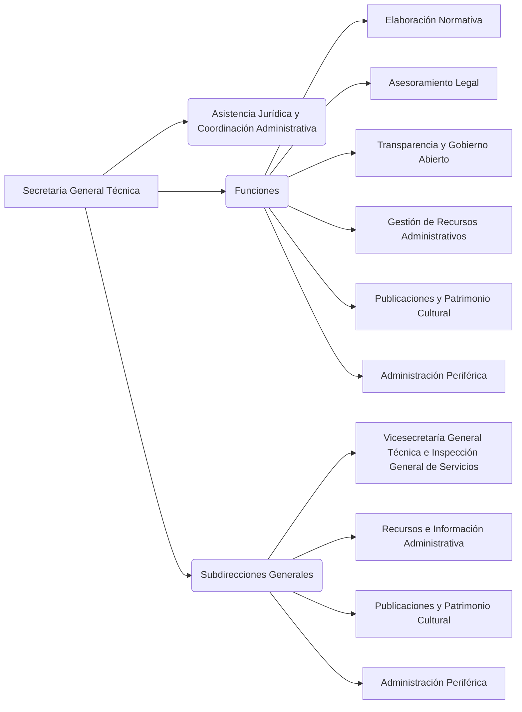
```mermaid
graph LR
    A[Secretaría General Técnica] --> B(Asistencia Jurídica y Coordinación Administrativa)
    A --> C(Funciones)
    C --> C1[Elaboración Normativa]
    C --> C2[Asesoramiento Legal]
    C --> C3[Transparencia y Gobierno Abierto]
    C --> C4[Gestión de Recursos Administrativos]
    C --> C5[Publicaciones y Patrimonio Cultural]
    C --> C6[Administración Periférica]
    A --> D(Subdirecciones Generales)
    D --> D1[Vicesecretaría General Técnica e Inspección General de Servicios]
    D --> D2[Recursos e Información Administrativa]
    D --> D3[Publicaciones y Patrimonio Cultural]
    D --> D4[Administración Periférica]
```

### Artículo 10. Dirección General de Personal.

38.  La **Dirección General de Personal** es el **órgano directivo** al que le corresponde la **planificación y desarrollo de la política de personal, así como la supervisión y dirección de su ejecución**. A estos efectos, dependen funcionalmente de esta dirección general los órganos competentes en las citadas materias de las Fuerzas Armadas y de los organismos autónomos del Departamento.

39.  Corresponden a esta dirección general, en el ámbito de sus competencias, las siguientes funciones:

*   a) Elaborar las normas y los criterios generales aplicables a la gestión del personal militar, así como ejercer la función inspectora, en los términos establecidos en el artículo 8.10.

*   b) Gestionar el personal militar de los cuerpos comunes de las Fuerzas Armadas, el personal del Servicio de Asistencia Religiosa de las Fuerzas Armadas y las competencias atribuidas a las personas titulares del Ministerio de Defensa y de la Subsecretaría de Defensa respecto al conjunto del personal militar.

*   c) Gestionar el personal civil, realizar las convocatorias de la oferta de empleo público que competan al Ministerio de Defensa y tramitar los procesos selectivos, sin perjuicio de los que competan a otros órganos u organismos por razón de la materia o la especialidad, y la provisión de puestos de trabajo.

*   d) Realizar la programación y la gestión de la formación y la acción social del personal civil.

*   e) Organizar y participar en la negociación colectiva y las relaciones laborales.

*   f) Planificar los efectivos y el reclutamiento del personal militar y reservistas voluntarios, así como elaborar las ofertas de empleo público y controlar la actualización de las relaciones de puestos militares.

*   g) Planificar los efectivos de personal civil, así como proponer las ofertas de empleo público de este.

*   h) Elaborar las disposiciones en materia retributiva y gestionar las competencias atribuidas a las personas titulares del Ministerio de Defensa y de la Subsecretaría de Defensa en esta materia.

*   i) Proponer los efectivos y costes de personal para la elaboración del presupuesto, así como efectuar el seguimiento de su gasto.

*   j) Controlar, en el aspecto funcional, el Sistema de Información de Personal del Ministerio de Defensa.

*   k) Reconocer y conceder las prestaciones e indemnizaciones que no pertenezcan al régimen de clases pasivas del personal militar.

*   k) Reconocer y conceder las prestaciones e indemnizaciones que no pertenezcan al régimen de clases pasivas del personal militar.

En particular, la tramitación, reconocimiento del derecho y pago de las indemnizaciones previstas en el [[Real Decreto-ley 8/2004, de 5 de noviembre\|Real Decreto-ley 8/2004, de 5 de noviembre]], sobre indemnizaciones a los participantes en operaciones internacionales de paz y seguridad, así como la tramitación de los expedientes de indemnización de Naciones Unidas.

*   l) Reconocer las pensiones causadas por el personal saharaui componente de la policía territorial del Sahara y de las unidades especiales del África occidental.

*   m) Dirigir la acción social del personal militar y emitir las directrices necesarias relacionadas con las residencias y centros deportivos socio-culturales militares y aquellas otras que se determinen, sin perjuicio de que su gestión corresponda a los órganos competentes de los Ejércitos y la Armada.

Podrá delegarse la ejecución y gestión de aquellas medidas de acción social que se determinen en los órganos de los Ejércitos y la Armada, dependientes funcionalmente de este órgano directivo.

*   n) Prestar apoyo a los heridos y a los familiares de los fallecidos y heridos en acto de servicio.

*   ñ) Prestar apoyo a las personas con discapacidad en las Fuerzas Armadas.

*   o) Coordinar la política de igualdad y ejercer las funciones propias de las Unidades de Igualdad del Departamento para personal militar y para personal civil, respectivamente, previstas en el artículo 77 de la [[Ley Orgánica 3/2007, de 22 de marzo, para la igualdad efectiva de mujeres y hombres\|Ley Orgánica 3/2007, de 22 de marzo, para la igualdad efectiva de mujeres y hombres]], de acuerdo con el [[Real Decreto 259/2019, de 12 de abril\|Real Decreto 259/2019, de 12 de abril]], por el que se regulan las Unidades de Igualdad de la Administración General del Estado.

* p) Preparar las propuestas de planificación prospectiva y estratégica de los recursos humanos en la organización del Ministerio de Defensa.

1.  De la Dirección General de Personal dependen los siguientes órganos directivos:

	*   a) La Subdirección General de Personal Militar, que desarrolla las funciones señaladas en el apartado 2, letras a) y b).

	*   b) La Subdirección General de Personal Civil, que desarrolla las funciones señaladas en el apartado 2 letras c), d), e) y o). Esta última competencia se ejercerá en coordinación con la División de Igualdad y Apoyo Social al Personal.

	*   c) La Subdirección General de Planificación y Costes de Recursos Humanos, que desarrolla las funciones señaladas en el apartado 2, letras f), g), h), i), j) y p).

2.  Asimismo, dependen de la Dirección General de Personal:

	*   a) La División de Igualdad y Apoyo Social al Personal, con el nivel orgánico que determine la correspondiente relación de puestos de trabajo, que desarrolla las funciones señaladas en el apartado 2, letras k), l), m), n), ñ) y o). Esta última competencia se ejercerá en coordinación con la Subdirección General de Personal Civil.

	*   b) La Unidad Administrativa de las Reales y Militares Órdenes de San Fernando y San Hermenegildo.

💡 ***Tip/Consejo: Este artículo detalla las responsabilidades de la Dirección General de Personal en la gestión del personal militar y civil. Es importante comprender su papel en la política retributiva, la acción social y la igualdad.***

🔑 ***Aspecto Clave: La Dirección General de Personal planifica y desarrolla la política de personal, gestionando tanto al personal militar como al civil, y coordinando la política de igualdad.***

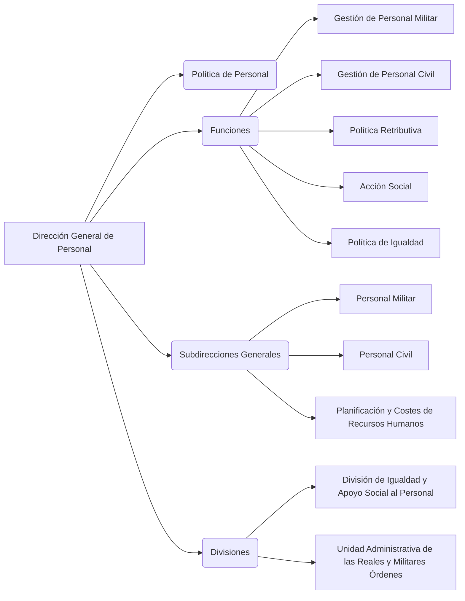
```mermaid
graph LR
    A[Dirección General de Personal] --> B(Política de Personal)
    A --> C(Funciones)
    C --> C1[Gestión de Personal Militar]
    C --> C2[Gestión de Personal Civil]
    C --> C3[Política Retributiva]
    C --> C4[Acción Social]
    C --> C5[Política de Igualdad]
    A --> D(Subdirecciones Generales)
    D --> D1[Personal Militar]
    D --> D2[Personal Civil]
    D --> D3[Planificación y Costes de Recursos Humanos]
    A --> E(Divisiones)
    E --> E1[División de Igualdad y Apoyo Social al Personal]
    E --> E2[Unidad Administrativa de las Reales y Militares Órdenes]
```

### Artículo 11. Dirección General de Reclutamiento y Enseñanza Militar.

3.  La **Dirección General de Reclutamiento y Enseñanza Militar** es el **órgano directivo** al que le corresponde la **planificación e impulso de la política de enseñanza del personal militar y de los reservistas voluntarios, su captación, selección y desarrollo profesional, así como la supervisión y dirección de su ejecución**. A estos efectos, dependen funcionalmente de esta dirección general el [[Centro Superior de Estudios de la Defensa Nacional\|Centro Superior de Estudios de la Defensa Nacional]] y los órganos competentes en las citadas materias de las Fuerzas Armadas y de los organismos autónomos del Departamento.

4.  Corresponden a esta dirección general, en el ámbito de sus competencias, las siguientes funciones:

	*   a) Planificar y coordinar la enseñanza militar, de acuerdo con lo establecido en la [[Ley 39/2007, de 19 de noviembre\|Ley 39/2007, de 19 de noviembre]], en lo referente a la enseñanza de formación y de perfeccionamiento y aquellos cursos específicos militares que tengan el carácter de altos estudios de la defensa nacional.

	*   b) Supervisar el funcionamiento del sistema de centros universitarios de la defensa e impulsar las relaciones y acuerdos con las diferentes administraciones, universidades y entidades privadas.

	*   c) Elaborar y proponer las directrices generales de los planes de estudios para la enseñanza de formación del personal militar, así como coordinar su redacción y la de los planes de formación de los reservistas.

	*   d) Proponer y coordinar la estructura docente de las Fuerzas Armadas, así como el régimen general de sus centros, del alumnado y del profesorado.

	*   e) Planificar y coordinar, en el aspecto funcional, el Sistema Integrado de Enseñanza Virtual, así como elaborar y coordinar el sistema de calidad de la enseñanza militar y su evaluación.

	*   f) Gestionar las enseñanzas del personal de los cuerpos comunes de las Fuerzas Armadas, las de carácter común y el funcionamiento de los centros docentes dependientes de esta dirección general.

	*   g) Elaborar, en coordinación con la Dirección General de Política de Defensa, los programas de cooperación internacional en materia de enseñanza, y dirigir su ejecución.

	*   h) Planificar y coordinar los procesos de captación y selección del personal militar y de los reservistas voluntarios, así como su mejora continua.

	*   i) Dirigir y apoyar la gestión de los reservistas voluntarios.

	*   j) Dirigir, coordinar e impulsar las actuaciones de la Estrategia Integral de Desarrollo Profesional para personal militar del Departamento.

	*   k) Implementar el Plan de Acción Individual para el Desarrollo Profesional dirigido a los militares profesionales de tropa y marinería y a los Reservistas de Especial Disponibilidad, así como coordinar la planificación y dirigir la ejecución de los programas de actuación de la Estrategia Integral de Desarrollo Profesional.

	*   l) Promover e impulsar los programas de formación de apoyo que complementen la formación del personal militar.

	*   m) Potenciar el desarrollo de los procedimientos de evaluación y acreditación de titulaciones y competencias para el personal militar y para los Reservistas de Especial Disponibilidad.

	*   n) Gestionar las oportunidades profesionales del personal militar y de los Reservistas de Especial Disponibilidad en situación de desempleo.

	*   ñ) Elaborar, desarrollar y coordinar los programas de comunicación, tanto interna como externa, relativos a las actuaciones de reclutamiento y desarrollo profesional para personal militar y Reservistas de Especial Disponibilidad.

	*   o) Garantizar la dirección, desarrollo y continuidad de acción del Departamento en el ámbito de la educación física y el deporte.

5.  De la Dirección General de Reclutamiento y Enseñanza Militar dependen los siguientes órganos directivos:

	*   a) La Subdirección General de Enseñanza Militar, que desarrolla las funciones señaladas en el apartado 2, letras a), b), c), d), e), f) y g).

	*   b) La Subdirección General de Reclutamiento y Desarrollo Profesional de Personal Militar y Reservistas de Especial Disponibilidad, que desarrolla las funciones señaladas en el apartado 2, letras h), i), j), k), l), m), n) y ñ).

6.  También depende de esta dirección general la Comisión Permanente y Secretaría General del Consejo Superior del Deporte Militar, que desarrolla la función señalada en el apartado 2, letra o), y de la que dependen funcionalmente las Secretarías de las Juntas Centrales de Educación Física y Deportes de los Ejércitos y la Armada.

7.  Asimismo, la Academia Central de la Defensa, con el nivel orgánico que determine la correspondiente relación de puestos militares, dependerá de la Subdirección General de Enseñanza Militar.

💡 ***Tip/Consejo: Este artículo se centra en la Dirección General de Reclutamiento y Enseñanza Militar, encargada de la formación y el desarrollo profesional del personal militar. Es importante comprender su rol en la captación, selección y la educación física y el deporte.***

🔑 ***Aspecto Clave: La Dirección General de Reclutamiento y Enseñanza Militar planifica y gestiona la enseñanza militar, el reclutamiento y el desarrollo profesional del personal militar y los reservistas.***

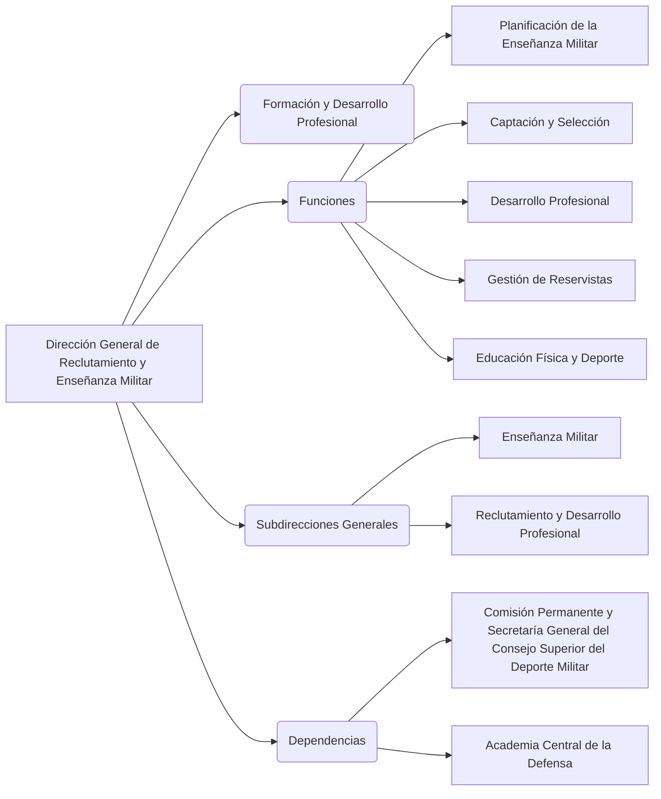
```mermaid
graph LR
    A[Dirección General de Reclutamiento y Enseñanza Militar] --> B(Formación y Desarrollo Profesional)
    A --> C(Funciones)
    C --> C1[Planificación de la Enseñanza Militar]
    C --> C2[Captación y Selección]
    C --> C3[Desarrollo Profesional]
    C --> C4[Gestión de Reservistas]
    C --> C5[Educación Física y Deporte]
    A --> D(Subdirecciones Generales)
    D --> D1[Enseñanza Militar]
    D --> D2[Reclutamiento y Desarrollo Profesional]
    A --> E(Dependencias)
    E --> E1[Comisión Permanente y Secretaría General del Consejo Superior del Deporte Militar]
    E --> E2[Academia Central de la Defensa]
```

### Artículo 12. Asesoría Jurídica General de la Defensa.

8.  La **Asesoría Jurídica General de la Defensa** emite los **informes jurídicos preceptivos**, de acuerdo con las disposiciones vigentes, y evacua aquellos que le sean solicitados por los órganos superiores y directivos del Ministerio de Defensa.

9.  La **función de asesoramiento jurídico**, función única en el ámbito del Departamento, se ejerce bajo la dirección del Asesor Jurídico General de la Defensa quien, a tal fin, puede dictar instrucciones a las asesorías jurídicas del Estado Mayor de la Defensa, de los Ejércitos y la Armada, y a cualquier otra en el ámbito del Departamento, así como evacuar las consultas que le formulen tendentes a asegurar la debida coordinación y unidad de criterio.

10.  Sin perjuicio de las competencias específicas de las personas titulares del Ministerio de Defensa y de la Subsecretaría de Defensa, la Asesoría Jurídica General es la encargada de las relaciones del Departamento con los órganos de gobierno de la jurisdicción militar, la Fiscalía Togada y la Abogacía General del Estado-Dirección del Servicio Jurídico del Estado.

11.  Las funciones a que se refieren los apartados anteriores son desarrolladas por personal perteneciente al Cuerpo Jurídico Militar.

12.  El cargo de Asesor Jurídico General es desempeñado por un general consejero togado, en situación de servicio activo, que tiene precedencia sobre los demás cargos del Cuerpo Jurídico Militar. Asimismo, por razón de su cargo le corresponde la inspección general del Cuerpo Jurídico Militar en materia de régimen de personal, retribuciones, tradiciones y recompensas, sin perjuicio de las competencias de la Subsecretaría de Defensa y de la Dirección General de Personal.

💡 ***Tip/Consejo: Este artículo define la Asesoría Jurídica General de la Defensa como el órgano encargado del asesoramiento jurídico en el Ministerio. Es clave comprender su papel en la emisión de informes y la coordinación jurídica.***

🔑 ***Aspecto Clave: La Asesoría Jurídica General de la Defensa emite informes jurídicos y coordina el asesoramiento jurídico en el Ministerio, manteniendo relaciones con la jurisdicción militar.***

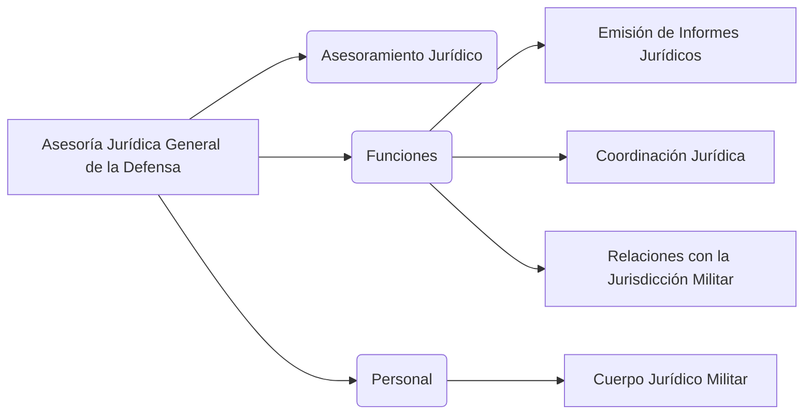
```mermaid
graph LR
    A[Asesoría Jurídica General de la Defensa] --> B(Asesoramiento Jurídico)
    A --> C(Funciones)
    C --> C1[Emisión de Informes Jurídicos]
    C --> C2[Coordinación Jurídica]
    C --> C3[Relaciones con la Jurisdicción Militar]
    A --> D(Personal)
    D --> D1[Cuerpo Jurídico Militar]
```

### Artículo 13. Intervención General de la Defensa.

13.  La **Intervención General de la Defensa**, dependiente funcionalmente de la Intervención General de la Administración del Estado, ejerce en el ámbito del Ministerio de Defensa y de los organismos públicos dependientes de éste, el **control interno de la gestión económico-financiera** mediante el **ejercicio de la función interventora, el control financiero permanente y la auditoría pública**, en los términos regulados en la [[Ley 47/2003, de 26 de noviembre, General Presupuestaria\|Ley 47/2003, de 26 de noviembre, General Presupuestaria]].

Asimismo, le corresponde ejercer la notaría militar en la forma y condiciones establecidas por las leyes, y el asesoramiento en materia de su competencia, a los órganos superiores y directivos del Ministerio de Defensa.

14.  Las funciones referidas en el apartado anterior se ejercen por personal perteneciente al Cuerpo Militar de Intervención, bajo la dirección del Interventor General de la Defensa, quien podrá dictar instrucciones a cualquier intervención delegada dependiente, a fin de asegurar la debida coordinación y unidad de criterio.

15.  El cargo de Interventor General de la Defensa es desempeñado por un general de división interventor, en situación de servicio activo, que tiene precedencia sobre los demás cargos del Cuerpo Militar de Intervención. Asimismo, por razón de su cargo le corresponde la inspección general del Cuerpo Militar de Intervención en materia de régimen de personal, retribuciones, tradiciones y recompensas, sin perjuicio de las competencias de la Subsecretaría de Defensa y de la Dirección General de Personal.

💡 ***Tip/Consejo: Este artículo describe la Intervención General de la Defensa como el órgano encargado del control económico-financiero. Es importante comprender su rol en la función interventora, la auditoría y la notaría militar.***

🔑 ***Aspecto Clave: La Intervención General de la Defensa ejerce el control interno de la gestión económico-financiera del Ministerio y actúa como notaría militar.***

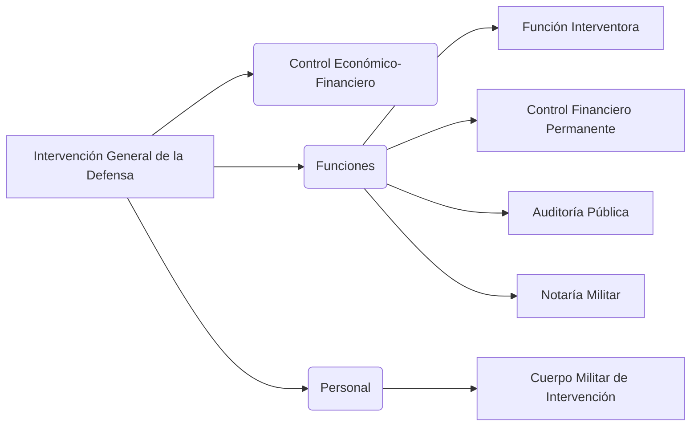
```mermaid
graph LR
    A[Intervención General de la Defensa] --> B(Control Económico-Financiero)
    A --> C(Funciones)
    C --> C1[Función Interventora]
    C --> C2[Control Financiero Permanente]
    C --> C3[Auditoría Pública]
    C --> C4[Notaría Militar]
    A --> D(Personal)
    D --> D1[Cuerpo Militar de Intervención]
```

### Artículo 14. Inspección General de Sanidad de la Defensa.

16.  La **Inspección General de Sanidad de la Defensa** es el **órgano** al que le corresponde la **planificación y desarrollo de la política sanitaria**. Además le corresponde el **asesoramiento a los órganos superiores del Departamento en materia de sanidad militar y civil en el ámbito del Ministerio de Defensa**. A estos efectos, dependen funcionalmente de esta Inspección General las direcciones de sanidad de los Ejércitos y la Armada, así como aquellos órganos sanitarios del Ministerio de Defensa no incluidos en su estructura orgánica.

17.  En particular le corresponden las siguientes funciones:

*   a) Preparar y proporcionar los apoyos sanitarios y logístico-operativos según las directrices recibidas del Jefe de Estado Mayor de la Defensa y de la persona titular de la Subsecretaría de Defensa.

*   b) Dirigir y gestionar la red sanitaria militar.

*   c) Dirigir y coordinar la ordenación farmacéutica, así como las actividades relativas a la sanidad pericial, prevención sanitaria, salud pública y sanidad animal en el ámbito de la Defensa.

*   d) Coordinar con el resto de autoridades del Departamento y, en su caso, ejecutar el apoyo médico, farmacéutico, veterinario, odontológico, psicológico y de enfermería que se precise.

*   e) Gestionar los procedimientos conducentes al nombramiento de personal estatutario temporal basados en relaciones de candidatos u otros instrumentos similares.

18.  El cargo de Inspector General de Sanidad de la Defensa es desempeñado por un general de división del Cuerpo Militar de Sanidad, en situación de servicio activo, que tiene precedencia sobre los demás cargos del Cuerpo Militar de Sanidad. Asimismo, por razón de su cargo le corresponde la inspección general del Cuerpo Militar de Sanidad en materia de régimen de personal, retribuciones, tradiciones y recompensas, sin perjuicio de las competencias de la Subsecretaría de Defensa y de la Dirección General de Personal.

💡 ***Tip/Consejo: Este artículo describe la Inspección General de Sanidad de la Defensa como el órgano encargado de la política sanitaria del Ministerio. Es importante comprender su rol en la gestión de la red sanitaria militar y la coordinación de los apoyos sanitarios.***

🔑 ***Aspecto Clave: La Inspección General de Sanidad de la Defensa planifica y desarrolla la política sanitaria del Ministerio, gestionando la red sanitaria militar y coordinando los apoyos sanitarios.***

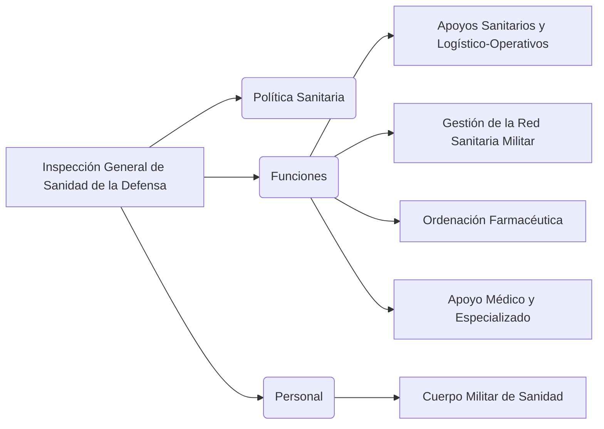
```mermaid
graph LR
    A[Inspección General de Sanidad de la Defensa] --> B(Política Sanitaria)
    A --> C(Funciones)
    C --> C1[Apoyos Sanitarios y Logístico-Operativos]
    C --> C2[Gestión de la Red Sanitaria Militar]
    C --> C3[Ordenación Farmacéutica]
    C --> C4[Apoyo Médico y Especializado]
    A --> D(Personal)
    D --> D1[Cuerpo Militar de Sanidad]
```

### Artículo 15. Secretaría General de Política de Defensa.

19.  La **Secretaría General de Política de Defensa** es el **órgano directivo** del Ministerio de Defensa al que le corresponde, bajo la dirección de la persona titular del Departamento, el **desarrollo y ejecución de la política de defensa y la promoción de la cultura de defensa, así como las relaciones en este ámbito con otros Departamentos ministeriales**, en especial con el Ministerio de Asuntos Exteriores, Unión Europea y Cooperación, las **relaciones bilaterales en materia de política de defensa con otros Estados y con las organizaciones internacionales de seguridad y defensa**, bajo el principio de unidad de acción exterior del Estado establecido en la [[Ley 2/2014, de 25 de marzo, de la Acción y del Servicio Exterior del Estado\|Ley 2/2014, de 25 de marzo, de la Acción y del Servicio Exterior del Estado]], así como el **desarrollo de la diplomacia de defensa** y, con el Ministerio del Interior en especial, en lo relacionado con la **contribución a la conducción de crisis y emergencias**.

20.  Corresponde, en particular, a la Secretaría General de Política de Defensa:

*   a) Efectuar el seguimiento y evaluación de la situación internacional en el ámbito de la política de seguridad y defensa.

*   b) Proponer las directrices de política de defensa.

*   c) Dirigir el Plan de Diplomacia de Defensa.

*   d) Conducir las relaciones bilaterales con los Estados en materia de política de defensa.

*   e) Dirigir la participación del Ministerio en las organizaciones internacionales de seguridad y defensa.

*   f) Dirigir la elaboración de los tratados, acuerdos y convenios internacionales que afecten a la Defensa, en coordinación con el Ministerio de Asuntos Exteriores, Unión Europea y Cooperación.

*   g) Coordinar la contribución del Departamento a la acción del Estado para hacer frente a situaciones de crisis y emergencias.

*   h) Planificar la contribución española al planeamiento civil de emergencia en las organizaciones internacionales de seguridad y defensa.

*   i) Disponer la actuación del Departamento en materia de control de armamento, no proliferación y desarme.

*   j) Proponer y coordinar la política cultural de seguridad y defensa y la promoción de la conciencia de defensa nacional.

*   l) Impulsar el desarrollo de las políticas multilaterales de defensa en los espacios comunes globales y en la lucha contra el cambio climático, sin perjuicio de las competencias de otros Departamentos ministeriales.`
    

1. La persona titular de la Secretaría General de Política de Defensa ostentará la representación del Departamento, por delegación de la persona titular del Ministerio de Defensa, en los casos en que ésta se la encomiende y, en especial, ante las organizaciones internacionales de seguridad y defensa de las que España forme Parte, particularmente en las reuniones ministeriales de defensa de la Alianza Atlántica y de la Unión Europea cuando no asista la persona titular del Departamento.
    
2. Asimismo, corresponde a la persona titular de la Secretaría General de Política de Defensa:
    
    - a) Presidir la Comisión Interministerial de Defensa.
        
    - b) Actuar de Secretario del Consejo de Defensa Nacional.
        
    - c) Presidir la Comisión de Coordinación de la Actividad Internacional del Ministerio de Defensa.
        
3. La persona titular de la Secretaría General de Política de Defensa dispone de un Gabinete Técnico, con el nivel orgánico que determine la correspondiente relación de puestos militares, como órgano de apoyo, asesoramiento y asistencia inmediata, cuya persona titular será un oficial general u oficial.
    
4. De la Secretaría General de Política de Defensa depende la Dirección General de Política de Defensa.
    
5. También depende de la persona titular de la Secretaría General de Política de Defensa la División de Coordinación y Estudios de Seguridad y Defensa, a la que le corresponde la propuesta y coordinación de la actividad de los centros e institutos de estudios dependientes del Departamento encaminada a la difusión de la cultura de seguridad y defensa, así como el impulso de los estudios en este ámbito, y en los de geopolítica prospectiva sobre la situación internacional de seguridad y defensa.
    
6. Asimismo, estarán adscritas a la Secretaría General de Política de Defensa:
    
    - a) La Comisión Interministerial de Defensa.
        
    - b) La Sección española del Comité Permanente Hispano-Norteamericano.
        
    - c) La Comisión de Coordinación de la Actividad Internacional del Ministerio de Defensa.
        
7. Dependen de la Secretaría General de Política de Defensa las agregadurías de defensa en las misiones diplomáticas de España en el exterior y los consejeros de defensa en las representaciones permanentes ante las organizaciones internacionales, en los términos regulados en su normativa específica.
    

💡 **Tip/Consejo: Este artículo describe la Secretaría General de Política de Defensa como un órgano clave en la política de defensa y la diplomacia. Es importante comprender su rol en las relaciones internacionales y la gestión de crisis.**

🔑 **Aspecto Clave: La Secretaría General de Política de Defensa desarrolla y ejecuta la política de defensa, promueve la cultura de defensa y gestiona las relaciones internacionales en materia de defensa.**

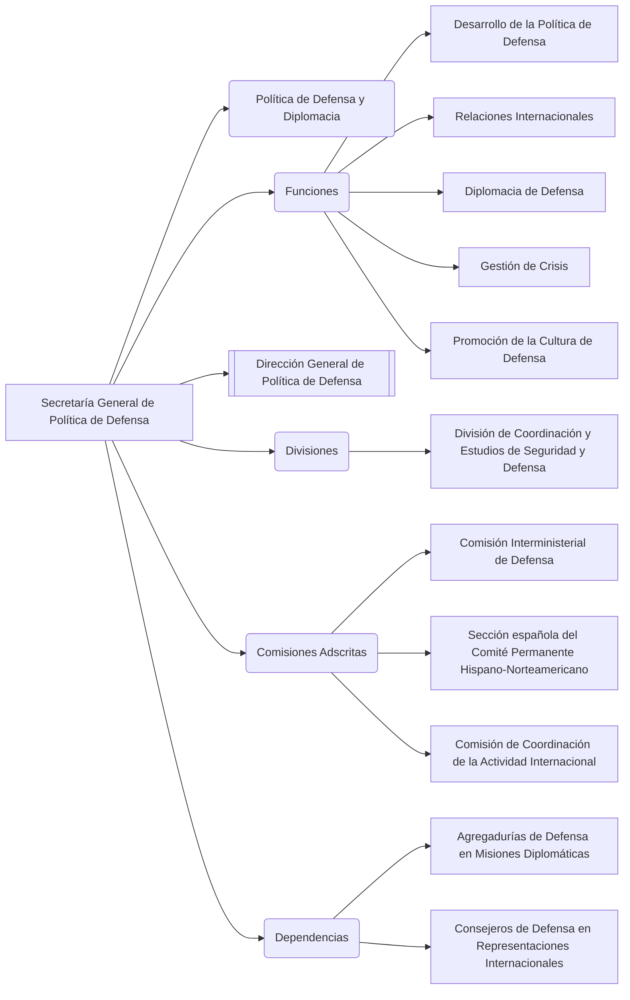
```mermaid
graph LR
    A[Secretaría General de Política de Defensa] --> B(Política de Defensa y Diplomacia)
    A --> C(Funciones)
    C --> C1[Desarrollo de la Política de Defensa]
    C --> C2[Relaciones Internacionales]
    C --> C3[Diplomacia de Defensa]
    C --> C4[Gestión de Crisis]
    C --> C5[Promoción de la Cultura de Defensa]
    A --> D[[Dirección General de Política de Defensa]]
    A --> E(Divisiones)
    E --> E1[División de Coordinación y Estudios de Seguridad y Defensa]
    A --> F(Comisiones Adscritas)
    F --> F1[Comisión Interministerial de Defensa]
    F --> F2[Sección española del Comité Permanente Hispano-Norteamericano]
    F --> F3[Comisión de Coordinación de la Actividad Internacional]
    A --> G(Dependencias)
    G --> G1[Agregadurías de Defensa en Misiones Diplomáticas]
    G --> G2[Consejeros de Defensa en Representaciones Internacionales]
```

### Artículo 16. Dirección General de Política de Defensa.

2. La **Dirección General de Política de Defensa** es el **órgano directivo** al que le corresponde la **planificación y desarrollo de la política de defensa**. A estos efectos, dependen funcionalmente de esta dirección general los órganos competentes en las citadas materias de las Fuerzas Armadas y de los organismos autónomos del Departamento.
    
3. Corresponden a esta dirección general, en el ámbito de sus competencias, las siguientes funciones:
    
    - a) Seguir y valorar el desarrollo de la situación internacional en el ámbito de la política de seguridad y defensa, especialmente en zonas de crisis y otras áreas de interés.
        
    - b) Elaborar las directrices de política de defensa y realizar su seguimiento.
        
    - c) Controlar el desarrollo del Plan de Diplomacia de Defensa.
        
    - d) Conducir y desarrollar las acciones dimanantes de las relaciones bilaterales con los estados en materia de política de defensa.
        
    - e) Elaborar las líneas generales de desarrollo de las directrices de política de defensa para la participación en organizaciones internacionales de seguridad y defensa.
        
    - f) Preparar, coordinar, controlar y apoyar la elaboración de los tratados, acuerdos y convenios internacionales que afecten a la Defensa, y realizar su seguimiento.
        
    - g) Elaborar las líneas generales de desarrollo de las directrices de política de defensa para la participación de otros departamentos ministeriales en la defensa nacional.
        
    - h) Preparar y gestionar la contribución del Ministerio de Defensa a la acción del Estado para hacer frente a situaciones de crisis y emergencias.
        
    - i) Coordinar la contribución al planeamiento civil de emergencia en las organizaciones internacionales.
        
    - j) Desarrollar la actuación en materia de control de armamento, no proliferación y desarme
        
    - k) Coordinar la participación del Departamento en los organismos internacionales de seguridad y defensa.
        
    - l) Coordinar el desarrollo de las políticas multilaterales de defensa en los espacios comunes globales y en la lucha contra el cambio climático, sin perjuicio de las competencias de otros Departamentos ministeriales.
        
4. De la Dirección General de Política de Defensa dependen los siguientes órganos directivos:
    
    - a) La Subdirección General de Planes y Relaciones Internacionales, que desarrolla las funciones señaladas en el apartado 2, letras b), c), d), e) y f) y, en la parte que le correspondan, letras a), k) y l).
        
    - b) La Subdirección General de Cooperación y Defensa Civil, que desarrolla las funciones señaladas en el apartado 2, letras g), h), i) y j) y, en la parte que le correspondan, letras a), k) y l).
        
5. Depende asimismo de la dirección general, a través de la Subdirección General de Planes y Relaciones Internacionales, la Oficina de Aplicación del Convenio entre los Estados Partes del Tratado del Atlántico Norte, relativo al Estatuto de sus Fuerzas, y del Acuerdo relativo al Estatuto de las Fuerzas de los Estados miembro de la Unión Europea (EU SOFA), hecho en Bruselas el 17 de noviembre de 2003.
    

💡 **Tip/Consejo: Este artículo describe la Dirección General de Política de Defensa, un órgano clave en la planificación de la política de defensa y la gestión de las relaciones internacionales. Es importante comprender su rol en la gestión de crisis y el control de armamento.**

🔑 **Aspecto Clave: La Dirección General de Política de Defensa planifica y desarrolla la política de defensa, gestiona las relaciones internacionales y coordina la participación en organismos internacionales.**

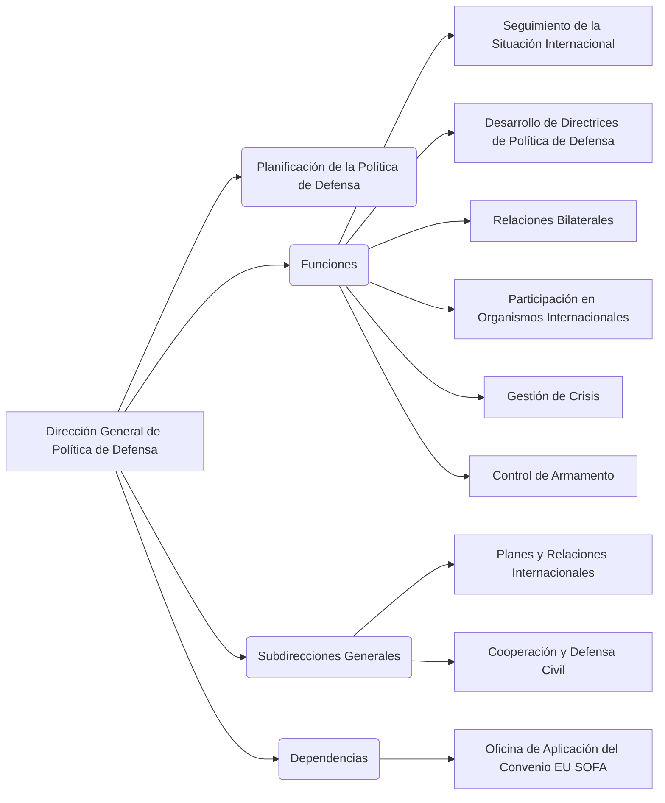
```mermaid
graph LR
    A[Dirección General de Política de Defensa] --> B(Planificación de la Política de Defensa)
    A --> C(Funciones)
    C --> C1[Seguimiento de la Situación Internacional]
    C --> C2[Desarrollo de Directrices de Política de Defensa]
    C --> C3[Relaciones Bilaterales]
    C --> C4[Participación en Organismos Internacionales]
    C --> C5[Gestión de Crisis]
    C --> C6[Control de Armamento]
    A --> D(Subdirecciones Generales)
    D --> D1[Planes y Relaciones Internacionales]
    D --> D2[Cooperación y Defensa Civil]
    A --> E(Dependencias)
    E --> E1[Oficina de Aplicación del Convenio EU SOFA]
```
### Artículo 17. Consejos Superiores.

El **Consejo Superior del Ejército de Tierra, el Consejo Superior de la Armada y el Consejo Superior del Ejército del Aire y del Espacio** son los **órganos colegiados asesores y consultivos** de la persona titular del Ministerio de Defensa y del Jefe de Estado Mayor del ejército respectivo, con las competencias y funciones que les atribuyen la [[Ley 39/2007, de 19 de noviembre\|Ley 39/2007, de 19 de noviembre]], y demás normas de aplicación, legales o reglamentarias.

💡 **Tip/Consejo: Este artículo describe los Consejos Superiores de cada ejército como órganos asesores y consultivos. Es importante comprender su papel en la toma de decisiones y la planificación estratégica.**

🔑 **Aspecto Clave: Los Consejos Superiores son órganos asesores y consultivos de los Jefes de Estado Mayor de cada ejército y del titular del Ministerio.**

### Artículo 18. Juntas Superiores.

La **Junta Superior del Cuerpo Jurídico Militar, la Junta Superior del Cuerpo Militar de Intervención, la Junta Superior del Cuerpo Militar de Sanidad y la Junta Superior del Cuerpo de Músicas Militares** son los **órganos colegiados asesores y consultivos** de las personas titulares del Ministerio de Defensa y de la Subsecretaría de Defensa, en aquellas materias que les atribuyen la [[Ley 39/2007, de 19 de noviembre\|Ley 39/2007, de 19 de noviembre]], y demás normas de aplicación, legales o reglamentarias.

💡 **Tip/Consejo: Este artículo describe las Juntas Superiores de cada cuerpo militar como órganos asesores y consultivos. Es importante comprender su papel en la toma de decisiones y la planificación estratégica dentro de sus respectivos cuerpos.**

🔑 **Aspecto Clave: Las Juntas Superiores son órganos asesores y consultivos de la Subsecretaría de Defensa y del titular del Ministerio, en materias específicas de cada cuerpo militar.**

## Disposiciones adicionales

### Disposición adicional primera. Orden de precedencias de las autoridades del Departamento.

El orden de precedencia de las autoridades superiores del Departamento en los actos de carácter especial a que alude el Ordenamiento General de Precedencias en el Estado, aprobado por el [[Real Decreto 2099/1983, de 4 de agosto\|Real Decreto 2099/1983, de 4 de agosto]], y en el régimen interno del Ministerio de Defensa, es el siguiente:

1.   a) Persona titular del Ministerio de Defensa.
2.   b) Jefe de Estado Mayor de la Defensa.
3.   c) Persona titular de la Secretaría de Estado de Defensa.
4.   d) Persona titular de la Subsecretaría de Defensa.
5.   e) Jefe de Estado Mayor del Ejército de Tierra.
6.   f) Jefe de Estado Mayor de la Armada.
7.   g) Jefe de Estado Mayor del Ejército del Aire y del Espacio.
8.   h) Persona titular de la Secretaría General de Política de Defensa.

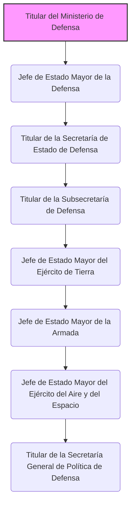
```mermaid
flowchart TB
    A[Titular del Ministerio de Defensa] --> B(Jefe de Estado Mayor de la Defensa)
    B --> C(Titular de la Secretaría de Estado de Defensa)
    C --> D(Titular de la Subsecretaría de Defensa)
    D --> E(Jefe de Estado Mayor del Ejército de Tierra)
    E --> F(Jefe de Estado Mayor de la Armada)
    F --> G(Jefe de Estado Mayor del Ejército del Aire y del Espacio)
    G --> H(Titular de la Secretaría General de Política de Defensa)
    style A fill:#f9f,stroke:#333,stroke-width:2px
```

💡 **Tip/Consejo: Esta disposición adicional establece el orden de precedencia de las autoridades del Ministerio. Es importante comprender este orden para entender la jerarquía y el protocolo dentro del Departamento.**

🔑 **Aspecto Clave: Se establece el orden de precedencia de las autoridades del Ministerio de Defensa.**

### Disposición adicional segunda. [[Centro Nacional de Inteligencia\|Centro Nacional de Inteligencia]].

Todos los Departamentos ministeriales, en el ámbito de sus respectivas competencias, de acuerdo con la [[Ley 11/2002, de 6 de mayo\|Ley 11/2002, de 6 de mayo]], reguladora del Centro Nacional de Inteligencia, prestarán los apoyos necesarios a este organismo público para que disponga de las coberturas que resulten precisas y adecuadas para el cumplimiento de sus objetivos en el ejercicio de las funciones previstas en dicha ley.

💡 **Tip/Consejo: Esta disposición adicional establece la obligación de todos los departamentos ministeriales de apoyar al Centro Nacional de Inteligencia. Es importante comprender la relación del Ministerio de Defensa con este organismo.**

🔑 **Aspecto Clave: Se establece la obligación de los departamentos ministeriales de apoyar al Centro Nacional de Inteligencia.**

### Disposición adicional tercera. Redes y sistemas de información y telecomunicaciones.

9. Por acuerdo de Consejo de Ministros se determinarán las redes y sistemas que hayan de ser dirigidas y gestionadas por el Centro de Sistemas y Tecnologías de la Información y las Comunicaciones del Ministerio de Defensa para la provisión de servicios a otros organismos de la Administración General del Estado.
    
10. Previo acuerdo con el Centro de Sistemas y Tecnologías de la Información y las Comunicaciones, la Dirección General de Protección Civil y Emergencias del Ministerio del Interior podrá hacer uso, en situaciones de emergencia, de las redes dirigidas y gestionadas por el citado centro.
    
11. Las redes y sistemas de información y telecomunicaciones del Centro Nacional de Inteligencia, de conformidad con su régimen jurídico, mantendrán su propia dirección y gestión, no siendo de aplicación lo previsto en el [[Artículo 7\|Artículo 7]].
    

💡 **Tip/Consejo: Esta disposición adicional regula las redes y sistemas de información y telecomunicaciones. Es importante comprender la función del CESTIC y la relación con otros organismos.**

🔑 **Aspecto Clave: Se regula el uso de las redes y sistemas de información y telecomunicaciones del Ministerio de Defensa.**

### Disposición adicional cuarta. Establecimiento Penitenciario Militar de Alcalá de Henares.

12. El Establecimiento Penitenciario Militar de Alcalá de Henares seguirá adscrito a la Subsecretaría de Defensa, con dependencia orgánica de la Secretaría General Técnica, sin perjuicio del apoyo logístico que no pueda ser prestado por la Subsecretaría de Defensa, que será facilitado por la cadena logística de los Ejércitos y la Armada.
    
13. Las funciones que corresponden a la Secretaría General Técnica serán desarrolladas por la Subdirección General de Administración Periférica.
    

💡 **Tip/Consejo: Esta disposición adicional regula el Establecimiento Penitenciario Militar de Alcalá de Henares. Es importante comprender su dependencia y las funciones de la Secretaría General Técnica.**

🔑 **Aspecto Clave: Se regula la dependencia y las funciones del Establecimiento Penitenciario Militar de Alcalá de Henares.**

### Disposición adicional quinta. Suplencia de los titulares de los órganos directivos.

En los casos de vacancia, ausencia o enfermedad de la persona titular de un órgano directivo, y en defecto de designación de suplente conforme a lo previsto en el artículo 13.3.b) de la [[Ley 40/2015, de 1 de octubre\|Ley 40/2015, de 1 de octubre]], corresponderá la suplencia a las personas titulares de los órganos inmediatamente subordinados, por el mismo orden en que aparecen citados en la respectiva estructura establecida en este real decreto.

💡 **Tip/Consejo: Esta disposición adicional regula la suplencia de los titulares de los órganos directivos. Es importante comprender el orden de suplencia en caso de ausencia o enfermedad.**

🔑 **Aspecto Clave: Se regula la suplencia de los titulares de los órganos directivos.**

### Disposición adicional sexta. Supresión de órganos directivos.

14. Queda suprimida la Dirección de Comunicación Institucional de la Defensa, que se transforma en la Oficina de Comunicación Institucional y Prensa del Ministerio de Defensa, manteniendo el rango de subdirección general.
    
15. Asimismo, queda suprimido el Comité de Seguimiento del Ministerio de Defensa, creado por la [[Orden ministerial 57/2022, de 28 de octubre\|Orden ministerial 57/2022, de 28 de octubre]].
    

💡 **Tip/Consejo: Esta disposición adicional regula la supresión de órganos directivos. Es importante comprender la transformación de la Dirección de Comunicación en la Oficina de Comunicación.**

🔑 **Aspecto Clave: Se suprimen la Dirección de Comunicación Institucional y el Comité de Seguimiento.**

### Disposición adicional séptima. Órganos colegiados.

Los órganos colegiados del Departamento, cuya composición y funciones sean del alcance puramente ministerial, podrán ser regulados, modificados o suprimidos mediante orden de la persona titular del Ministerio de Defensa, aunque su normativa de creación o modificación tenga rango de real decreto.

💡 **Tip/Consejo: Esta disposición adicional regula la modificación o supresión de órganos colegiados. Es importante comprender las facultades del titular del Ministerio.**

🔑 **Aspecto Clave: Se regula la modificación o supresión de órganos colegiados por orden del titular del Ministerio.**

### Disposición adicional octava. No incremento del gasto público.

La aplicación de este real decreto no supondrá incremento de gasto público, atendiéndose con los medios personales y materiales del Departamento.

💡 **Tip/Consejo: Esta disposición adicional establece que la aplicación del real decreto no debe incrementar el gasto público. Es importante comprender la necesidad de eficiencia en la gestión de los recursos.**

🔑 **Aspecto Clave: La aplicación del real decreto no debe incrementar el gasto público.**

### Disposición adicional novena. Dependencias funcionales y coordinación.

16. En virtud de las dependencias funcionales de los distintos órganos de las Fuerzas Armadas y de los organismos autónomos con respecto a los órganos directivos del Departamento, estos últimos podrán:
    
    - a) Emitir las instrucciones u órdenes de servicio de carácter general para el desarrollo y ejecución de la política del Departamento en el ámbito de su competencia.
        
    - b) Coordinar la actuación de los correspondientes órganos de las Fuerzas Armadas en el cumplimiento de dichas instrucciones u órdenes de servicio.
        
    - c) Llevar a cabo el seguimiento de su ejecución recabando la información necesaria para conocer los resultados obtenidos y estar en condiciones de adoptar las medidas correctoras a fin de ajustarlas a la política del Departamento.
        
    - d) Constituir Comisiones funcionales y convocar a estas a los responsables de los órganos dependientes funcionalmente del órgano directivo correspondiente.
        
17. Por su parte, los correspondientes órganos de las Fuerzas Armadas y de los organismos autónomos, en el ámbito de sus competencias, podrán elevar consultas, formular propuestas, solicitar asesoramiento, información o datos y requerir criterios de actuación a los órganos directivos de los que dependen funcionalmente, en relación con la preparación, desarrollo, ejecución y control de la política del Departamento.
    

💡 **Tip/Consejo: Esta disposición adicional regula las dependencias funcionales y la coordinación entre los órganos del Ministerio y las Fuerzas Armadas. Es importante comprender cómo se ejerce la autoridad y cómo se coordina la política del Departamento.**

🔑 **Aspecto Clave: Se regulan las dependencias funcionales y la coordinación entre los órganos del Ministerio y las Fuerzas Armadas.**

### Disposición adicional décima. Expedientes de insuficiencia de condiciones psicofísicas y pase a retiro.

18. Corresponde a la Sanidad Militar la competencia para realizar los reconocimientos médicos en los expedientes de insuficiencia de condiciones psicofísicas, así como para declarar el grado de discapacidad y su posible relación con el servicio y, en su caso, con la consideración de atentado terrorista. Los dictámenes de la Sanidad Militar tendrán la consideración prevista en la legislación de clases pasivas.
    
19. Asimismo, corresponde a los órganos competentes del Ministerio de Defensa la resolución de los expedientes de insuficiencia de condiciones psicofísicas del personal militar, con la correspondiente declaración de pase a retiro, resolución del compromiso o utilidad con limitaciones para determinados destinos, incluidos los que sean en acto de servicio o a consecuencia de atentado terrorista; así como la declaración de pase a retiro del personal militar de conformidad con la legislación militar vigente.
    

💡 **Tip/Consejo: Esta disposición adicional regula los expedientes de insuficiencia de condiciones psicofísicas y el pase a retiro. Es importante comprender las competencias de la Sanidad Militar y los órganos del Ministerio.**

🔑 **Aspecto Clave: Se regulan los expedientes de insuficiencia de condiciones psicofísicas y el pase a retiro, especificando las competencias de la Sanidad Militar.**

### Disposición adicional undécima. Integración administrativa del Responsable del Sistema de Información Interno del Ministerio de Defensa.

El Responsable del Sistema de Información Interno del Ministerio de Defensa, que desarrollará sus funciones de forma independiente y autónoma, se encuentra integrado a efectos administrativos en la Asesoría Jurídica General de la Defensa.

💡 **Tip/Consejo: Esta disposición adicional regula la integración administrativa del Responsable del Sistema de Información Interno. Es importante comprender su independencia y su relación con la Asesoría Jurídica General.**

🔑 **Aspecto Clave: Se regula la integración administrativa del Responsable del Sistema de Información Interno en la Asesoría Jurídica General de la Defensa.**

## Disposiciones transitorias

### Disposición transitoria única. Unidades y puestos de trabajo con nivel orgánico inferior a subdirección general.

20. Las unidades y puestos de trabajo con nivel orgánico inferior a subdirección general continuarán subsistentes y serán retribuidos con cargo a los mismos créditos presupuestarios hasta que se aprueben las correspondientes relaciones o catálogos de puestos de trabajo del Departamento adaptados a la estructura orgánica de este real decreto.
    
21. Las unidades y puestos de trabajo encuadrados en los órganos suprimidos, o cuya dependencia orgánica haya sido modificada por éste real decreto, se adscribirán provisionalmente, mediante resolución de la persona titular de la Subsecretaría de Defensa.
    

💡 **Tip/Consejo: Esta disposición transitoria regula la situación de las unidades y puestos de trabajo con nivel orgánico inferior a subdirección general. Es importante comprender cómo se gestiona la transición a la nueva estructura orgánica.**

🔑 **Aspecto Clave: Se regula la situación transitoria de las unidades y puestos de trabajo con nivel orgánico inferior a subdirección general.**

## Disposiciones derogatorias

### Disposición derogatoria única. Derogación normativa.

22. Queda derogado el [[Real Decreto 372/2020, de 18 de febrero\|Real Decreto 372/2020, de 18 de febrero]], por el que se desarrolla la estructura orgánica básica del Ministerio de Defensa.
    
23. Asimismo, quedan derogadas cuantas disposiciones de igual o inferior rango se opongan a lo dispuesto en este real decreto.
    

💡 **Tip/Consejo: Esta disposición derogatoria establece las normas que quedan derogadas por este real decreto. Es importante comprender qué legislación queda sin efecto.**

🔑 **Aspecto Clave: Se deroga el Real Decreto 372/2020 y otras disposiciones que se opongan a este real decreto.**

## Disposiciones finales

### Disposición final primera. Facultades de desarrollo normativo.

Se faculta a la persona titular del Ministerio de Defensa para que, previo el cumplimiento de los trámites legales oportunos, adopte las disposiciones que sean necesarias para el desarrollo y ejecución de este real decreto.

💡 **Tip/Consejo: Esta disposición final otorga facultades a la persona titular del Ministerio de Defensa para desarrollar y ejecutar el real decreto. Es importante comprender cómo se implementará la legislación.**

🔑 **Aspecto Clave: Se faculta al titular del Ministerio para desarrollar y ejecutar el real decreto.**

### Disposición final segunda. Entrada en vigor.

El presente real decreto entrará en vigor el día siguiente al de su publicación en el «Boletín Oficial del Estado».

💡 **Tip/Consejo: Esta disposición final establece la fecha de entrada en vigor del real decreto. Es importante conocer cuándo entra en vigor la legislación.**

🔑 **Aspecto Clave: El real decreto entrará en vigor el día siguiente al de su publicación en el BOE.**

Dado en Madrid, el 27 de febrero de 2024.

FELIPE R.

El Ministro para la Transformación Digital y de la Función Pública,  
JOSÉ LUIS ESCRIVÁ BELMONTE

Este documento es de carácter informativo y no tiene valor jurídico.

