---
{"dg-publish":true,"permalink":"/opo-melilla/bloque-1/tema-4/minisdef/"}
---

# Real Decreto 205/2024, de 27 de febrero, por el que se desarrolla la estructura orgánica básica del Ministerio de Defensa. 

**«BOE» núm. 52, de 28 de febrero de 2024**
**Referencia: BOE-A-2024-3791**

## ÍNDICE 🗂️

* Preámbulo
* Artículos
    * Artículo 1. Organización general del Departamento.
    * Artículo 2. Fuerzas Armadas.
    * Artículo 3. Secretaría de Estado de Defensa.
    * Artículo 4. Dirección General de Estrategia e Innovación de la Industria de Defensa.
    * Artículo 4 bis. Dirección General de Armamento y Material.
    * Artículo 5. Dirección General de Asuntos Económicos.
    * Artículo 6. Dirección General de Infraestructura.
    * Artículo 7. El Centro de Sistemas y Tecnologías de la Información y las Comunicaciones.
    * Artículo 8. Subsecretaría de Defensa.
    * Artículo 9. Secretaría General Técnica.
    * Artículo 10. Dirección General de Personal.
    * Artículo 11. Dirección General de Reclutamiento y Enseñanza Militar
    * Artículo 12. Asesoría Jurídica General de la Defensa.
    * Artículo 13. Intervención General de la Defensa.
    * Artículo 14. Inspección General de Sanidad de la Defensa.
    * Artículo 15. Secretaría General de Política de Defensa.
    * Artículo 16. Dirección General de Política de Defensa.
    * Artículo 17. Consejos Superiores.
    * Artículo 18. Juntas Superiores.
* Disposiciones adicionales
    * Disposición adicional primera. Orden de precedencias de las autoridades del Departamento.
    * Disposición adicional segunda. Centro Nacional de Inteligencia.
    * Disposición adicional tercera. Redes y sistemas de información y telecomunicaciones.
    * Disposición adicional cuarta. Establecimiento Penitenciario Militar de Alcalá de Henares.
    * Disposición adicional quinta. Suplencia de los titulares de los órganos directivos.
    * Disposición adicional sexta. Supresión de órganos directivos.
    * Disposición adicional séptima. Órganos colegiados.
    * Disposición adicional octava. No incremento del gasto público.
    * Disposición adicional novena. Dependencias funcionales y coordinación.
    * Disposición adicional décima. Expedientes de insuficiencia de condiciones psicofísicas y pase a retiro.
    * Disposición adicional undécima. Integración administrativa del Responsable del Sistema de Información Interno del Ministerio de Defensa.
* Disposiciones transitorias
    * Disposición transitoria única. Unidades y puestos de trabajo con nivel orgánico inferior a subdirección general.
* Disposiciones derogatorias
    * Disposición derogatoria única. Derogación normativa.
* Disposiciones finales
    * Disposición final primera. Facultades de desarrollo normativo.
    * Disposición final segunda. Entrada en vigor

---

## Preámbulo 📜

TEXTO CONSOLIDADO

Última modificación: 11 de septiembre de 2024

El Real Decreto 829/2023, de 20 de noviembre, por el que se reestructuran los departamentos ministeriales, modificó la estructura existente de éstos con el objeto de impulsar los objetivos prioritarios para España, desarrollar el programa político del Gobierno y lograr la máxima eficacia en su acción y la mayor eficiencia en el funcionamiento de la Administración General del Estado. En su artículo 4 dispone que corresponde al **Ministerio de Defensa el ejercicio de todas las competencias y atribuciones que le confiere el ordenamiento jurídico como órgano encargado del desarrollo y ejecución de las directrices generales del Gobierno sobre política de defensa.**

Posteriormente, el Real Decreto 1009/2023, de 5 de diciembre, por el que se establece la estructura orgánica básica de los departamentos ministeriales, aprueba la nueva organización interna de todos los ministerios y, asimismo, desarrolla la estructura del Ministerio de Defensa que se asemeja a la vigente hasta la fecha, contenida en el Real Decreto 372/2020, de 18 de febrero, por el que se desarrolla la estructura orgánica básica del Ministerio de Defensa, manteniéndose la adscripción del Centro Nacional de Inteligencia al Ministerio de Defensa y la dependencia directa de la Unidad Militar de Emergencias de la persona titular del Ministerio de Defensa.

A partir de los antecedentes normativos anteriormente expuestos, entre otros aspectos, este real decreto dispone las responsabilidades atribuidas a los órganos superiores y órganos directivos que conforman el Ministerio de Defensa, estableciendo las funciones que cada órgano tiene asignadas y sus correspondientes dependencias orgánicas. Asimismo, recoge sucintamente la organización militar de las Fuerzas Armadas que, con arreglo a la Ley Orgánica 5/2005, de 17 de noviembre, de la Defensa Nacional, se regirá por su propia normativa.

En lo que a la Comunicación Institucional de la Defensa se refiere, la anterior Dirección de Comunicación Institucional de la Defensa pasa a denominarse **Oficina de Comunicación Institucional y Prensa del Ministerio de Defensa**, que dependerá de la persona titular del Departamento a través de su Gabinete.

La **Secretaría de Estado de Defensa dirige, impulsa y gestiona las políticas de armamento y material, la investigación, desarrollo e innovación industrial, económica, de infraestructura, medioambiental y de los sistemas, tecnologías y seguridad de la información, la transformación digital del Departamento y las tecnologías de la información y las comunicaciones**, y ejerce la dirección funcional del Sistema de Información y Gestión de la Infraestructura en el Ministerio de Defensa (SINFRADEF).

Por otra parte, la **Subsecretaría de Defensa dirige, planifica, impulsa y gestiona la política de personal, de reclutamiento, de enseñanza, y sanitaria, prestando especial atención a los principios de igualdad efectiva entre mujeres y hombres, a las personas con discapacidad en las Fuerzas Armadas y a la situación del personal militar profesional de tropa y marinería con un compromiso de carácter temporal y a los Reservistas de Especial Disponibilidad.** Por ello, en cumplimiento del dictamen aprobado por la Comisión de Defensa del Congreso de los Diputados, de 27 de septiembre de 2018, se establecen actuaciones y responsabilidades, dentro de la Estrategia Integral de Desarrollo Profesional para personal militar del Departamento, encaminadas al desarrollo profesional y formación de dichos colectivos que les permita tomar decisiones sobre su futuro profesional, incluyendo la promoción en el seno de las Fuerzas Armadas para los que permanecen o su reincorporación al ámbito laboral civil, dirigido tanto al personal militar que está en activo como al colectivo de Reservistas de Especial Disponibilidad, con los que el Departamento está firmemente comprometido.

Asimismo, conforme dispone el Real Decreto 799/2005, de 1 de julio, por el que se regulan las inspecciones generales de servicios de los Departamentos ministeriales, se hace necesario incorporar una **Inspección General de Servicios, dentro de la Vicesecretaría General Técnica.**

Finalmente, la **Secretaría General de Política de Defensa dirige, impulsa y gestiona el desarrollo y ejecución de la política de defensa y de la promoción de la cultura de defensa, así como la diplomacia de defensa.** Asimismo, dirige la contribución del Ministerio de Defensa a la conducción de crisis y emergencias.

En cumplimiento de lo previsto en la Ley 50/1997, de 27 de noviembre, del Gobierno, este real decreto se adecua a los principios de buena regulación a que se refiere el artículo 129 de la Ley 39/2015, de 1 de octubre, del Procedimiento Administrativo Común de las Administraciones Públicas. En concreto, cumple con los principios de necesidad y eficacia, pues se trata de un instrumento necesario y adecuado para servir al interés general y a la efectiva ejecución de las políticas públicas del Gobierno en las materias responsabilidad del Ministerio de Defensa. También se adecua al principio de proporcionalidad, pues no existe otra alternativa para crear un nuevo marco orgánico de este Departamento ministerial. En cuanto a los principios de seguridad jurídica, transparencia y eficiencia, la norma se adecua a los mismos pues es coherente con el resto del ordenamiento jurídico y del mismo no se derivan nuevas cargas administrativas.

En su virtud, a iniciativa de la Ministra de Defensa, a propuesta del Ministro de Transformación Digital y Función Pública, y previa deliberación del Consejo de Ministros en su reunión del día 27 de febrero de 2024,

DISPONGO:

## Artículos 📜

### Artículo 1. Organización general del Departamento. 🏛️

💡 ***Tip/Consejo:*** *Este artículo establece la **estructura jerárquica básica** del Ministerio de Defensa. Es fundamental para entender cómo se organiza el departamento y las relaciones entre sus diferentes componentes.  Presta atención a los órganos que dependen directamente del Ministro y a las entidades adscritas. Reflexiona sobre la importancia de la coordinación mencionada en el punto 2.*

🔑 ***Aspecto Clave: El Ministerio de Defensa se organiza en Fuerzas Armadas, Secretaría de Estado de Defensa, Subsecretaría de Defensa, Secretaría General de Política de Defensa y tiene adscrito el Centro Nacional de Inteligencia.***

1.  El **Ministerio de Defensa** es el **Departamento de la Administración General del Estado** al que le corresponde la **preparación, el desarrollo y la ejecución de la política de defensa** determinada por el Gobierno y la **gestión de la administración militar.**

2.  Las **competencias** atribuidas en este real decreto se entenderán **en coordinación** y **sin perjuicio** de aquellas que corresponden a **otros Departamentos ministeriales.**

3.  El Ministerio de Defensa, bajo la **dirección de la persona titular del Departamento**, se estructura en:
    * a) Las **Fuerzas Armadas.**
    * b) La **Secretaría de Estado de Defensa.**
    * c) La **Subsecretaría de Defensa.**
    * d) La **Secretaría General de Política de Defensa.**

4.  Está **adscrito** al Ministerio de Defensa, con **dependencia directa de la persona titular del Departamento**, el **[[Z. Notas/Notas Bloque 1/Notas Tema 4. Ministerio de Defensa/Centro Nacional de Inteligencia\|Centro Nacional de Inteligencia]].**

5.  La **[[Guardia Civil\|Guardia Civil]]** depende de la **persona titular del Ministerio de Defensa** en los términos previstos en:
    * **[[Ley Orgánica 2/1986, de 13 de marzo, de Fuerzas y Cuerpos de Seguridad\|Ley Orgánica 2/1986, de 13 de marzo, de Fuerzas y Cuerpos de Seguridad]]**;
    * **[[Ley Orgánica 5/2005, de 17 de noviembre, de la Defensa Nacional\|Ley Orgánica 5/2005, de 17 de noviembre, de la Defensa Nacional]]**;
    * **[[Ley Orgánica 12/2007, de 22 de octubre, del régimen disciplinario de la Guardia Civil\|Ley Orgánica 12/2007, de 22 de octubre, del régimen disciplinario de la Guardia Civil]]**, y
    * **[[Ley 29/2014, de 28 de noviembre, de Régimen del Personal de la Guardia Civil\|Ley 29/2014, de 28 de noviembre, de Régimen del Personal de la Guardia Civil]].**

6.  Son **órganos asesores y consultivos** de la persona titular del Departamento:
    * a) El **[[Consejo Superior del Ejército de Tierra\|Consejo Superior del Ejército de Tierra]].**
    * b) El **[[Consejo Superior de la Armada\|Consejo Superior de la Armada]].**
    * c) El **[[Consejo Superior del Ejército del Aire y del Espacio\|Consejo Superior del Ejército del Aire y del Espacio]].**
    * d) La **[[Junta Superior del Cuerpo Jurídico Militar\|Junta Superior del Cuerpo Jurídico Militar]].**
    * e) La **[[Junta Superior del Cuerpo Militar de Intervención\|Junta Superior del Cuerpo Militar de Intervención]].**
    * f) La **[[Junta Superior del Cuerpo Militar de Sanidad\|Junta Superior del Cuerpo Militar de Sanidad]].**
    * g) La **[[Junta Superior del Cuerpo de Músicas Militares\|Junta Superior del Cuerpo de Músicas Militares]].**

7.  En consonancia con el artículo 10 de la **[[Ley 50/1997, de 27 de noviembre, del Gobierno\|Ley 50/1997, de 27 de noviembre, del Gobierno]]**, existe un **Gabinete**, con **rango de dirección general**, de **asesoramiento** a la persona titular del Ministerio de Defensa, que actúa como **órgano de apoyo político, técnico, administrativo y en tareas de confianza** en el cumplimiento de las labores de carácter parlamentario, en sus relaciones con las instituciones y en la organización administrativa.

    Por otra parte, también existe un **Gabinete Técnico**, al que corresponde la **asistencia técnica en materias relativas al enlace con las Fuerzas Armadas**, cuya persona titular será un **oficial general**, con **rango de director general**, según consta en el artículo 3.1.d) del **[[Real Decreto 1009/2023, de 5 de diciembre, por el que se establece la estructura orgánica básica de los departamentos ministeriales\|Real Decreto 1009/2023, de 5 de diciembre, por el que se establece la estructura orgánica básica de los departamentos ministeriales]].**

8.  Del **[[Gabinete de la persona titular del Ministerio de Defensa\|Gabinete de la persona titular del Ministerio de Defensa]]** depende, con **rango de subdirección general**, la **[[Oficina de Comunicación Institucional y Prensa del Ministerio de Defensa\|Oficina de Comunicación Institucional y Prensa del Ministerio de Defensa]]**, que actuará como **portavoz oficial del Departamento**, a la que le corresponde:
    * **mantener las relaciones informativas y de publicidad institucional**,
    * **coordinar las oficinas de comunicación de los cuarteles generales, mandos y unidades de las Fuerzas Armadas**, y
    * **ejercer las competencias en materia de comunicación digital del Ministerio de Defensa**, con especial atención a la gestión y actualización del contenido de la página electrónica del Departamento.
    * Igualmente, asumirá la **dirección funcional y editorial** de la **[[Revista Española de Defensa\|Revista Española de Defensa]]** y de **todas las publicaciones periódicas de carácter no específicamente técnico-administrativo** pertenecientes al Ministerio de Defensa.

```mermaid
graph LR
    A[Ministerio de Defensa] --> B{Dirección Titular del Departamento}
    B --> C[Fuerzas Armadas]
    B --> D[Secretaría de Estado de Defensa]
    B --> E[Subsecretaría de Defensa]
    B --> F[Secretaría General de Política de Defensa]
    B --> G[Centro Nacional de Inteligencia «Adscrito»]
    B --> H[Guardia Civil «Dependencia en términos legales»]
    B --> I{Órganos Asesores y Consultivos}
    I --> I1[Consejo Superior del Ejército de Tierra]
    I --> I2[Consejo Superior de la Armada]
    I --> I3[Consejo Superior del Ejército del Aire y del Espacio]
    I --> I4[Junta Superior del Cuerpo Jurídico Militar]
    I --> I5[Junta Superior del Cuerpo Militar de Intervención]
    I --> I6[Junta Superior del Cuerpo Militar de Sanidad]
    I --> I7[Junta Superior del Cuerpo de Músicas Militares]
    B --> J[Gabinete «Dirección General»]
    B --> K[Gabinete Técnico «Dirección General»]
    J --> L[Oficina de Comunicación Institucional y Prensa «Subdirección General»]
    style B fill:#f9f,stroke:#333,stroke-width:2px
```

### Artículo 2. Fuerzas Armadas. 🪖

💡 ***Tip/Consejo:*** *Este artículo se centra en las **Fuerzas Armadas** dentro de la estructura del Ministerio.  Es importante comprender el rol del **JEMAD** (Jefe de Estado Mayor de la Defensa) y su relación con el Ministerio, así como la posición de los Jefes de Estado Mayor de cada Ejército y la **UME** (Unidad Militar de Emergencias). Observa la doble dependencia de la UME.*

🔑 ***Aspecto Clave: Las Fuerzas Armadas se rigen por su normativa específica, el JEMAD tiene rango de Secretario de Estado y representa militarmente al Departamento, y la UME depende orgánicamente del Ministerio pero funcionalmente del JEMAD en operaciones militares.***

1.  La **organización militar** se rige por su **normativa específica**, con arreglo a lo dispuesto en la **[[Ley Orgánica 5/2005, de 17 de noviembre\|Ley Orgánica 5/2005, de 17 de noviembre]]**.

2.  El **[[Jefe de Estado Mayor de la Defensa (JEMAD)\|Jefe de Estado Mayor de la Defensa (JEMAD)]]**, con **rango de secretario de estado**, ostentará la **representación del Departamento**, por **delegación de la persona titular del Departamento**, en los casos en que ésta se la confiera, y la **representación militar nacional ante las organizaciones internacionales de seguridad y defensa.**

3.  El Jefe de Estado Mayor de la Defensa cuenta, como **órganos de apoyo, asesoramiento y asistencia inmediata**, con:
    * un **[[Gabinete\|Gabinete]]**, con **rango de subdirección general** y con la estructura que establece el artículo 23.3 del **[[Real Decreto 1009/2023, de 5 de diciembre\|Real Decreto 1009/2023, de 5 de diciembre]]**, y
    * un **[[Gabinete Técnico\|Gabinete Técnico]]**, cuya persona titular será un **oficial general u oficial**, también con **rango de subdirector general**.

4.  Dependen del **[[Jefe de Estado Mayor de la Defensa\|Jefe de Estado Mayor de la Defensa]]** las **representaciones militares en los organismos internacionales.**

5.  Los **[[Jefes de Estado Mayor del Ejército de Tierra\|Jefes de Estado Mayor del Ejército de Tierra]]**, de la **[[Armada\|Armada]]** y del **[[Ejército del Aire y del Espacio\|Ejército del Aire y del Espacio]]** tienen **rango de subsecretario.**

6.  La **[[Unidad Militar de Emergencias (UME)\|Unidad Militar de Emergencias (UME)]]**, que **depende orgánicamente de la persona titular del Ministerio de Defensa**, está constituida de forma permanente y tiene como misión la **intervención en cualquier lugar del territorio nacional y en el exterior**, para **contribuir a la seguridad y bienestar de los ciudadanos** en los supuestos de **grave riesgo, catástrofe, calamidad u otras necesidades públicas**, con arreglo a lo dispuesto en el **[[Real Decreto 1097/2011, de 22 de julio, por el que se aprueba el Protocolo de Intervención de la Unidad Militar de Emergencias\|Real Decreto 1097/2011, de 22 de julio, por el que se aprueba el Protocolo de Intervención de la Unidad Militar de Emergencias]]**. La persona titular del Departamento dictará las normas que regulen la organización y el funcionamiento de esta unidad en el ámbito del Departamento.

    Sin perjuicio de lo anterior, como parte integrante de las Fuerzas Armadas, el **[[Jefe del Estado Mayor de la Defensa\|Jefe del Estado Mayor de la Defensa]]** ejercerá sobre la UME las **competencias** que, con arreglo a lo establecido en los **artículos 12.3.b) y 15.2 de la [[Ley Orgánica 5/2005, de 17 de noviembre\|Ley Orgánica 5/2005, de 17 de noviembre]]**, le atribuye en los supuestos de **conducción de operaciones militares** que contribuyan a la seguridad y defensa de España y de sus aliados.

```mermaid
graph LR
    A[Fuerzas Armadas] --> B{Organización Militar -Normativa Específica-}
    A --> C[Jefe de Estado Mayor de la Defensa JEMAD - Secretario de Estado-]
    C --> C1[Representación del Departamento -Delegada-]
    C --> C2[Representación Militar Nacional -Internacional-]
    C --> D[Gabinete -Subdirección General-]
    C --> E[Gabinete Técnico -Subdirección General-]
    C --> F[Representaciones Militares -Organismos Internacionales-]
    A --> G[Jefes de Estado Mayor Ejército de Tierra, Armada, Aire y Espacio -Subsecretarios-]
    A --> H[Unidad Militar de Emergencias -UME-]
    H --> H1[Dependencia Orgánica: Titular Ministerio de Defensa]
    H --> H2[Dependencia Funcional Operaciones Militares: -JEMAD-]
    H --> H3[Misión: Intervención en emergencias]
    style C fill:#f9f,stroke:#333,stroke-width:2px
    style G fill:#f9f,stroke:#333,stroke-width:2px
    style H fill:#f9f,stroke:#333,stroke-width:2px
```

### Artículo 3. Secretaría de Estado de Defensa. 🛡️

💡 ***Tip/Consejo:*** *Este artículo describe las funciones y dependencias de la **Secretaría de Estado de Defensa**, un órgano superior clave dentro del Ministerio.  Identifica las áreas de política que dirige, impulsa y gestiona, como armamento, I+D+i, economía, infraestructura, y sistemas de información.  Observa los órganos directivos que dependen de ella y las entidades adscritas.*

🔑 ***Aspecto Clave: La Secretaría de Estado de Defensa es un órgano superior responsable de las políticas de armamento, I+D+i, economía, infraestructura, sistemas de información y transformación digital en Defensa.***

1.  La **Secretaría de Estado de Defensa** es el **órgano superior del Departamento** al que le corresponden, además de las competencias que le encomienda el **[[artículo 62 de la Ley 40/2015, de 1 de octubre, de Régimen Jurídico del Sector Público\|artículo 62 de la Ley 40/2015, de 1 de octubre, de Régimen Jurídico del Sector Público]]**, la **dirección, impulso y gestión de las políticas de:**
    * **armamento y material,**
    * **investigación, desarrollo e innovación industrial,**
    * **económica,**
    * **de infraestructura,**
    * **medioambiental** y
    * **de los sistemas, tecnologías y seguridad de la información en el ámbito de la Defensa,**
    * así como el **impulso del proceso de transformación digital del Departamento.**

2.  Asimismo, **contribuirá a la elaboración y ejecución de la política de defensa** y **ejercerá las competencias que le correspondan en el planeamiento de la Defensa.**

3.  De la Secretaría de Estado de Defensa dependen los siguientes **órganos directivos, con rango de Dirección General**:
    * a) La **[[Dirección General de Estrategia e Innovación de la Industria de Defensa\|Dirección General de Estrategia e Innovación de la Industria de Defensa]].**
    * b) La **[[Dirección General de Armamento y Material\|Dirección General de Armamento y Material]].**
    * c) La **[[Dirección General de Asuntos Económicos\|Dirección General de Asuntos Económicos]].**
    * d) La **[[Dirección General de Infraestructura\|Dirección General de Infraestructura]].**
    * e) El **[[Centro de Sistemas y Tecnologías de la Información y las Comunicaciones\|Centro de Sistemas y Tecnologías de la Información y las Comunicaciones]].**

4.  La persona titular de la Secretaría de Estado cuenta, como **órganos de apoyo, asesoramiento y asistencia inmediata**, con:
    * un **[[Gabinete\|Gabinete]]**, con **nivel orgánico de subdirección general** y con la estructura que establece el artículo 23.3 del **[[Real Decreto 1009/2023, de 5 de diciembre\|Real Decreto 1009/2023, de 5 de diciembre]]**, y
    * un **[[Gabinete Técnico\|Gabinete Técnico]]**, cuya persona titular será un **oficial general u oficial**, también con **rango de subdirector general.**

5.  La persona titular de la Secretaría de Estado de Defensa ostentará, en materias propias de su competencia, por **delegación de la persona titular del Ministerio de Defensa**, la **representación del Departamento** en los casos en que ésta se la encomiende.

6.  Están **adscritos** a la Secretaría de Estado de Defensa:
    * el **[[organismo autónomo Instituto Nacional de Técnica Aeroespacial «Esteban Terradas»\|organismo autónomo Instituto Nacional de Técnica Aeroespacial «Esteban Terradas»]]** y
    * el **[[organismo autónomo Instituto de Vivienda, Infraestructura y Equipamiento de la Defensa\|organismo autónomo Instituto de Vivienda, Infraestructura y Equipamiento de la Defensa]]**,
    * así como la **[[Z. Notas/Notas Bloque 1/Notas Tema 4. Ministerio de Defensa/Agencia Estatal Agencia Espacial Española\|Agencia Estatal Agencia Espacial Española]]**, en los términos establecidos en el artículo 1.3. del Estatuto de la Agencia Estatal Agencia Espacial Española, aprobado por el **[[Real Decreto 158/2023, de 7 de marzo\|Real Decreto 158/2023, de 7 de marzo]].**

7.  Depende de la Secretaría de Estado de Defensa la **[[Junta de Enajenación de Bienes Muebles y Productos de Defensa\|Junta de Enajenación de Bienes Muebles y Productos de Defensa]].**

```mermaid
graph LR
    A[Secretaría de Estado de Defensa - Órgano Superior] --> B{Dirección, Impulso y Gestión Políticas de:}
    B --> B1[Armamento y Material]
    B --> B2[I+D+i Industrial]
    B --> B3[Económica]
    B --> B4[Infraestructura]
    B --> B5[Medioambiental]
    B --> B6[Sistemas, Tecnologías y Seguridad de la Información]
    B --> B7[Transformación Digital]
    A --> C[Contribución a Política de Defensa y Planeamiento]
    A --> D{Órganos Directivos Dependientes «Dirección General»}
    D --> D1[[Dirección General de Estrategia e Innovación de la Industria de Defensa\|Dirección General de Estrategia e Innovación de la Industria de Defensa]]
    D --> D2[[Dirección General de Armamento y Material]]
    D --> D3[[Dirección General de Asuntos Económicos\|Dirección General de Asuntos Económicos]]
    D --> D4[[Dirección General de Infraestructura]]
    D --> D5[[Centro de Sistemas y Tecnologías de la Información y las Comunicaciones\|Centro de Sistemas y Tecnologías de la Información y las Comunicaciones]]
    A --> E[Gabinete «Subdirección General»]
    A --> F[Gabinete Técnico «Subdirección General»]
    A --> G[Representación del Departamento «Delegada»]
    A --> H{Organismos Autónomos Adscritos}
    H --> H1[[Instituto Nacional de Técnica Aeroespacial «Esteban Terradas»]]
    H --> H2[[Instituto de Vivienda, Infraestructura y Equipamiento de la Defensa]]
    H --> I[[Agencia Estatal Agencia Espacial Española]]
    A --> J[[Junta de Enajenación de Bienes Muebles y Productos de Defensa]]
    style A fill:#f9f,stroke:#333,stroke-width:2px
    style D fill:#ccf,stroke:#333,stroke-width:2px
```

### Artículo 4. Dirección General de Estrategia e Innovación de la Industria de Defensa. 🏭

💡 ***Tip/Consejo:*** *Este artículo detalla las responsabilidades de la **Dirección General de Estrategia e Innovación de la Industria de Defensa**.  Concéntrate en sus funciones clave relacionadas con la política industrial de defensa, cooperación internacional, control de comercio exterior y apoyo a la industria española. Analiza las Subdirecciones Generales que la componen y sus áreas de responsabilidad.*

🔑 ***Aspecto Clave: La Dirección General de Estrategia e Innovación de la Industria de Defensa planifica y desarrolla la política industrial de defensa, la cooperación industrial, el control del comercio exterior de armamento y el apoyo a la internacionalización de la industria.***

8.  La **Dirección General de Estrategia e Innovación de la Industria de Defensa** es el **órgano directivo** al que le corresponde la **planificación y desarrollo de la política industrial de la Defensa** así como:
    * la **cooperación industrial** en esta materia,
    * la **cooperación internacional** y **representación en foros internacionales de industria de Defensa**,
    * el **apoyo institucional a la internacionalización de la industria de Defensa española y a la exportación**,
    * el **control del comercio exterior de armamento y material**,
    * de las **transferencias de tecnología a terceros países** y
    * de los **activos tanto materiales como inmateriales derivados de la política industrial y de innovación del Departamento.**
    * A estos efectos, **dependen funcionalmente** de esta dirección general los **órganos competentes en las citadas materias de las Fuerzas Armadas y de los organismos autónomos del Departamento.**

9.  Corresponden a esta dirección general, en el ámbito de sus competencias, las siguientes **funciones**:
    * a) **Planificar y programar las políticas de armamento y material y de investigación, desarrollo e innovación del Departamento, y controlar su ejecución.**
    * b) **Proponer y dirigir los planes y programas de investigación y desarrollo de sistemas de armas y equipos de interés para la defensa nacional**, en coordinación con los organismos nacionales e internacionales competentes en este ámbito y **controlar los activos inmateriales derivados de aquellos**, que se hayan obtenido, total o parcialmente, con fondos públicos del Ministerio de Defensa, mediante la creación y mantenimiento de los oportunos registros de activos.
    * c) **Impulsar el apoyo institucional a la internacionalización de la industria española de defensa**, **coordinar la promoción internacional de la enajenación de bienes muebles y productos de defensa** y, en coordinación con la **[[Dirección General de Política de Defensa\|Dirección General de Política de Defensa]]**, **dirigir las actuaciones de los agregados y consejeros de Defensa.**
    * d) **Ejercer las competencias que se le atribuyan para negociar y gestionar la cooperación industrial.**
    * e) **Proponer la política industrial de la Defensa**, coordinando su actuación con otros organismos.
    * f) **Controlar los activos materiales derivados de esa política** que se hayan obtenido, total o parcialmente, con fondos públicos del Ministerio de Defensa, mediante la creación y mantenimiento de los oportunos registros de activos.
    * g) **Impulsar**, en coordinación con la **[[Dirección General de Política de Defensa\|Dirección General de Política de Defensa]]**, la **cooperación internacional en los ámbitos bilateral y multilateral**, así como **ejercer la representación nacional en los foros industriales y de armamento de dichas organizaciones.**
    * h) **Ejercer las competencias atribuidas en relación con el control del comercio exterior de material de defensa y de productos y tecnologías de doble uso.**
    * i) **Apoyar la exportación de productos y tecnologías de Defensa y de doble uso.**
    * j) **Controlar las transferencias de tecnología nacional a terceros países**, así como la obtenida de programas, acuerdos o convenios internacionales.
    * k) **Ejercer la gestión de las inversiones extranjeras en España relacionadas con la Defensa.**

10.  De esta dirección general dependen los siguientes **órganos directivos**:
    * a) La **[[Subdirección General de Planificación, Tecnología e Innovación\|Subdirección General de Planificación, Tecnología e Innovación]]**, que desarrolla las funciones señaladas en el apartado 2, letras a) y b).
    * b) La **[[Subdirección General de Estrategia Industrial de la Defensa\|Subdirección General de Estrategia Industrial de la Defensa]]**, que desarrolla las funciones señaladas en el apartado 2, letras c), d), e) y f).
    * c) La **[[Subdirección General de Gestión e Internacionalización de la Industria de Defensa\|Subdirección General de Gestión e Internacionalización de la Industria de Defensa]]**, que desarrolla las funciones señaladas en el apartado 2, letras g), h), i), j) y k).

```mermaid
graph LR
    A[Dirección General de Estrategia e Innovación de la Industria de Defensa - Órgano Directivo] --> B{Planificación y Desarrollo Política Industrial de Defensa y:}
    B --> B1[Cooperación Industrial]
    B --> B2[Cooperación Internacional y Foros]
    B --> B3[Apoyo Internacionalización e Industria Española y Exportación]
    B --> B4[Control Comercio Exterior «Armamento y Material»]
    B --> B5[Control Transferencias Tecnología]
    B --> B6[Control Activos «Materiales e Inmateriales»]
    A --> C{Dependencia Funcional: Órganos FF.AA. y OO.AA. en mismas materias}
    A --> D{Funciones}
    D --> D1[Planificación y Programación Políticas Armamento, Material, I+D+i]
    D --> D2[Planes y Programas I+D Sistemas de Armas y Equipos «Interés Nacional»]
    D --> D3[Apoyo Internacionalización Industria Defensa Española]
    D --> D4[Gestión Cooperación Industrial]
    D --> D5[Política Industrial de Defensa «Propuesta»]
    D --> D6[Control Activos Materiales «Política Industrial»]
    D --> D7[Cooperación Internacional «Bilateral y Multilateral»]
    D --> D8[Control Comercio Exterior Material Defensa y Doble Uso]
    D --> D9[Apoyo Exportación Productos y Tecnologías Defensa y Doble Uso]
    D --> D10[Control Transferencias Tecnología Nacional «y obtenida»]
    D --> D11[Gestión Inversiones Extranjeras «Defensa»]
    A --> E{Órganos Directivos Dependientes}
    E --> E1[[Subdirección General de Planificación, Tecnología e Innovación]]
    E --> E2[[Subdirección General de Estrategia Industrial de la Defensa]]
    E --> E3[[Subdirección General de Gestión e Internacionalización de la Industria de Defensa]]
    style A fill:#f9f,stroke:#333,stroke-width:2px
    style E fill:#ccf,stroke:#333,stroke-width:2px
```

### Artículo 4 bis. Dirección General de Armamento y Material. ⚔️

💡 ***Tip/Consejo:*** *Este artículo describe la **Dirección General de Armamento y Material**, diferenciándola de la anterior.  Focalízate en su papel en la planificación y ejecución de la política de armamento y material, incluyendo la gestión de programas de obtención, modernización y sostenimiento, así como sus competencias regulatorias y de inspección.  Examina las Subdirecciones Generales y sus funciones específicas.*

🔑 ***Aspecto Clave: La Dirección General de Armamento y Material planifica y desarrolla la política de armamento y material, supervisando su ejecución, gestionando programas de obtención y sostenimiento, y ejerciendo competencias de inspección y regulación.***

11.  La **Dirección General de Armamento y Material** es el **órgano directivo** al que le corresponde la **planificación y desarrollo de la política de armamento y material del Departamento**, así como la **supervisión y dirección de su ejecución**. A estos efectos, **dependen funcionalmente** de esta dirección general los **órganos competentes en las citadas materias de las Fuerzas Armadas y de los organismos autónomos del Departamento.**

12.  Corresponden a esta dirección general, en el ámbito de sus competencias, las siguientes **funciones**:
    * a) **Gestionar, en colaboración con las Fuerzas Armadas, los programas de obtención, de modernización y de sostenimiento común de los sistemas de armas y equipos de interés para la defensa nacional**, incluyendo los programas de cooperación internacional y los de venta derivados del apoyo a la internacionalización de la industria española de defensa, así como **armonizar y racionalizar su sostenimiento.**
    * b) **Impulsar la gestión y tramitación de los expedientes de adquisición de los sistemas y equipos necesarios para las Fuerzas Armadas.**
    * c) **Ejercer las competencias que le confieren las leyes y reglamentos en las siguientes materias:**
        * **inspección de la actividad industrial y la seguridad industrial relacionada con la Defensa**;
        * **aseguramiento de la calidad del armamento y material**;
        * así como **fabricación, comercialización y transporte de armas y explosivos.**
    * d) **Ejercer las competencias que le confieren las leyes y reglamentos en las siguientes materias:**
        * **normalización, catalogación y homologación de los sistemas de armas, equipos y productos de interés para las Fuerzas Armadas**;
        * **certificación de exención por razones de Defensa en materia de registro, evaluación, autorización y restricción de sustancias químicas**;
        * **aeronavegabilidad**; y
        * el **resto del ordenamiento jurídico.**
    * e) **Realizar la administración y gestión económica y contractual de los programas de investigación y desarrollo, de obtención, de modernización y de sostenimiento común no incluidos en la contratación centralizada, de sistemas de armas y equipos de defensa**, incluyendo los programas de cooperación internacional, así como la **gestión, negociación y administración de los contratos que pudieran derivarse del apoyo a la internacionalización de la industria española de defensa y la exportación asociada de material de defensa.**

13.  De esta dirección general dependen los siguientes **órganos directivos**:
    * a) La **[[Subdirección General de Programas\|Subdirección General de Programas]]**, que desarrolla las funciones señaladas en el apartado 2, letras a) y b).
    * b) La **[[Subdirección General de Inspección y Regulación\|Subdirección General de Inspección y Regulación]]**, que desarrolla las funciones señaladas en el apartado 2, letras c) y d).
    * c) La **[[Subdirección General de Adquisiciones de Armamento y Material\|Subdirección General de Adquisiciones de Armamento y Material]]**, que desarrolla las funciones señaladas en el apartado 2, letra e).

```mermaid
graph LR
    A[Dirección General de Armamento y Material - Órgano Directivo] --> B{Planificación y Desarrollo Política de Armamento y Material y:}
    B --> B1[Supervisión y Dirección de Ejecución]
    A --> C{Dependencia Funcional: Órganos FF.AA. y OO.AA. en mismas materias}
    A --> D{Funciones}
    D --> D1[Gestión Programas Obtención, Modernización y Sostenimiento «Sistemas de Armas y Equipos»]
    D --> D2[Impulso Gestión y Tramitación Expedientes Adquisición «Sistemas y Equipos FF.AA.»]
    D --> D3[Competencias Inspección Actividad Industrial y Seguridad Industrial «Defensa»]
    D --> D4[Competencias Aseguramiento Calidad Armamento y Material]
    D --> D5[Competencias Fabricación, Comercialización y Transporte Armas y Explosivos]
    D --> D6[Competencias Normalización, Catalogación y Homologación «Sistemas de Armas, Equipos y Productos»]
    D --> D7[Competencias Certificación Exención Sustancias Químicas «Defensa»]
    D --> D8[Competencias Aeronavegabilidad]
    D --> D9[Competencias Resto Ordenamiento Jurídico]
    D --> D10[Administración y Gestión Económica y Contractual Programas «I+D, Obtención, Modernización, Sostenimiento»]
    A --> E{Órganos Directivos Dependientes}
    E --> E1[[Subdirección General de Programas]]
    E --> E2[[Subdirección General de Inspección y Regulación]]
    E --> E3[[Subdirección General de Adquisiciones de Armamento y Material]]
    style A fill:#f9f,stroke:#333,stroke-width:2px
    style E fill:#ccf,stroke:#333,stroke-width:2px
```

### Artículo 5. Dirección General de Asuntos Económicos. 💰

💡 ***Tip/Consejo:*** *Este artículo describe la **Dirección General de Asuntos Económicos**, el órgano responsable de la política económica y financiera del Ministerio.  Presta atención a sus funciones en la planificación presupuestaria, contabilidad, gestión de recursos económicos, contratación y representación en foros económicos internacionales.  Analiza las Subdirecciones Generales y la Oficina Presupuestaria, y sus áreas de especialización.*

🔑 ***Aspecto Clave: La Dirección General de Asuntos Económicos planifica y desarrolla la política económica y financiera del Departamento, dirigiendo la contabilidad, el presupuesto, la contratación y representando al Ministerio en foros económicos internacionales.***

14.  La **Dirección General de Asuntos Económicos** es el **órgano directivo** al que le corresponde la **planificación y desarrollo de la política económica y financiera del Departamento**, así como la **supervisión y dirección de su ejecución**. A estos efectos, **dependen funcionalmente** de esta dirección general **todos los órganos competentes en las citadas materias del Departamento y de sus organismos autónomos.**

15.  Corresponden a esta dirección general, en el ámbito de sus competencias, las siguientes **funciones**:
    * a) **Dirigir, coordinar y controlar la contabilidad del Departamento**, así como el **control de los créditos y de la ejecución del gasto.**
    * b) **Elaborar y proponer los planes de acción ministeriales para la corrección de las debilidades identificadas en la actividad económica del Departamento**, **impulsar su implementación y realizar su seguimiento.**
    * c) **Desarrollar la planificación y la programación económica y presupuestaria del Departamento**, así como **dirigir y controlar su ejecución**, **ejerciendo la dirección financiera de los programas presupuestarios.**
    * d) **Ejercer la dirección financiera de los programas presupuestarios y la programación económica.**
    * e) **Administrar los recursos económicos que se le asignen y los no atribuidos expresamente a otros órganos del Departamento**, los destinados a las contribuciones financieras a las organizaciones internacionales en los que participe el Ministerio de Defensa y los asignados para el funcionamiento de sus organismos en el exterior; así como **efectuar los pagos y justificación de los recursos destinados a las adquisiciones en el extranjero.**
    * f) **Ejercer la representación nacional en los comités y órganos de decisión de carácter económico de los organismos internacionales de seguridad y defensa** en los que participe el Departamento, en coordinación con el **[[Estado Mayor de la Defensa\|Estado Mayor de la Defensa]]**, la **[[Dirección General de Política de Defensa\|Dirección General de Política de Defensa]]** y los **[[Cuarteles Generales de los Ejércitos y la Armada\|Cuarteles Generales de los Ejércitos y la Armada]]**, según los casos.
    * g) **Administrar**, en coordinación con el **[[Estado Mayor de la Defensa\|Estado Mayor de la Defensa]]**, los **recursos financieros destinados a financiar la participación de las Fuerzas Armadas en operaciones de paz y ayuda humanitaria.**
    * h) **Planificar y controlar la contratación en el ámbito del Departamento.**
    * i) **Implementar el análisis de costes y precios de las empresas suministradoras o que participen en programas de defensa**, así como el de los **costes del ciclo de vida de las inversiones asociadas a los programas de obtención del Departamento.**
    * j) **Ejercer la dirección funcional de los sistemas informáticos integrales de dirección y administración económica del Departamento.**
    * k) **Realizar la gestión y pago de las pensiones causadas por el personal saharaui componente de la policía territorial del Sahara y de las unidades especiales del África occidental.**

16.  De la **Dirección General de Asuntos Económicos** dependen, con **rango de subdirección general**, los siguientes **órganos directivos**, que se coordinarán con los órganos competentes del Departamento y sus organismos autónomos:
    * a) La **[[Subdirección General de Contabilidad\|Subdirección General de Contabilidad]]**, que desarrolla las funciones señaladas en el apartado 2, letras a) y b).
    * b) La **[[Oficina Presupuestaria\|Oficina Presupuestaria]]**, que desarrolla las funciones señaladas en el apartado 2, letras c) y d).
    * c) La **[[Subdirección General de Gestión Económica\|Subdirección General de Gestión Económica]]**, que desarrolla las funciones señaladas en el apartado 2, letras e), f), g), j) y k).
    * d) La **[[Subdirección General de Contratación\|Subdirección General de Contratación]]**, que desarrolla las funciones señaladas en el apartado 2, letras h) e i).

17.  Asimismo, dependen de la Dirección General de Asuntos Económicos:
    * la **[[Junta General de Enajenaciones y Liquidadora de Material\|Junta General de Enajenaciones y Liquidadora de Material]]** y
    * la **[[Secretaría de la Junta de Contratación del Ministerio de Defensa\|Secretaría de la Junta de Contratación del Ministerio de Defensa]].**

```mermaid
graph LR
    A[Dirección General de Asuntos Económicos - Órgano Directivo] --> B{Planificación y Desarrollo Política Económica y Financiera y:}
    B --> B1[Supervisión y Dirección de Ejecución]
    A --> C{Dependencia Funcional: Órganos competentes del Departamento y OO.AA.}
    A --> D{Funciones}
    D --> D1[Dirección, Coordinación y Control Contabilidad]
    D --> D2[Planes de Acción Corrección Debilidades Económicas]
    D --> D3[Planificación y Programación Económica y Presupuestaria]
    D --> D4[Dirección Financiera Programas Presupuestarios]
    D --> D5[Administración Recursos Económicos «Asignados y no asignados»]
    D --> D6[Representación Nacional Comités Económicos «Organismos Internacionales Seguridad y Defensa»]
    D --> D7[Administración Recursos Financieros Operaciones de Paz y Ayuda Humanitaria]
    D --> D8[Planificación y Control Contratación]
    D --> D9[Análisis Costes y Precios «Empresas y Programas Defensa»]
    D --> D10[Dirección Funcional Sistemas Informáticos Dirección y Administración Económica]
    D --> D11[Gestión y Pago Pensiones Personal Saharaui]
    A --> E{Órganos Directivos Dependientes «Subdirección General»}
    E --> E1[[Subdirección General de Contabilidad]]
    E --> E2[[Oficina Presupuestaria]]
    E --> E3[[Subdirección General de Gestión Económica]]
    E --> E4[[Subdirección General de Contratación]]
    A --> F{Otros Órganos Dependientes}
    F --> F1[[Junta General de Enajenaciones y Liquidadora de Material]]
    F --> F2[[Secretaría de la Junta de Contratación del Ministerio de Defensa]]
    style A fill:#f9f,stroke:#333,stroke-width:2px
    style E fill:#ccf,stroke:#333,stroke-width:2px
```

### Artículo 6. Dirección General de Infraestructura. 🏗️

💡 ***Tip/Consejo:*** *Este artículo se centra en la **Dirección General de Infraestructura**. Identifica su rol en la planificación y desarrollo de políticas de infraestructura, medioambiental y energética.  Presta atención a sus funciones en la ordenación territorial, gestión de patrimonio inmobiliario, servidumbres aeronáuticas y dirección de proyectos de infraestructura.  Examina las Subdirecciones Generales y sus áreas de especialización.*

🔑 ***Aspecto Clave: La Dirección General de Infraestructura planifica y desarrolla las políticas de infraestructura, medioambiental y energética, gestionando el patrimonio inmobiliario, las servidumbres aeronáuticas y dirigiendo proyectos de infraestructura.***

18.  La **Dirección General de Infraestructura** es el **órgano directivo** al que le corresponde la **planificación y desarrollo de las políticas de infraestructura, medioambiental y energética del Departamento**, así como la **supervisión y dirección de su ejecución**. A estos efectos, **dependen funcionalmente** de esta dirección general los **órganos competentes en las citadas materias de las Fuerzas Armadas y de los organismos autónomos del Departamento.**

19.  Corresponden a esta dirección general, en el ámbito de sus competencias, las siguientes **funciones**:
    * a) **Dirigir la ordenación territorial de la infraestructura del Departamento.**
    * b) **Proponer, definir e implementar las políticas de infraestructura mediante planes y programas**, **efectuando el seguimiento de su ejecución.**
    * c) **Realizar el seguimiento de los programas y proyectos internacionales en materia de infraestructura**, en coordinación con la **[[Dirección General de Política de Defensa\|Dirección General de Política de Defensa]]**, la **[[Dirección General de Asuntos Económicos\|Dirección General de Asuntos Económicos]]** y el **[[Estado Mayor Conjunto\|Estado Mayor Conjunto]]** en lo que afecta a la participación nacional en los Programas de Inversiones en Seguridad de la OTAN (NSIP).
    * d) **Proponer, definir y desarrollar la política medioambiental del Departamento** y **dirigir y supervisar su ejecución.**
    * e) **Proponer, definir y desarrollar la política energética del Departamento** y **dirigir y supervisar su ejecución.**
    * f) **Participar y realizar el seguimiento de programas y proyectos nacionales e internacionales en materia de medio ambiente y eficiencia energética**, en coordinación, cuando corresponda, con la **[[Dirección General de Política de Defensa\|Dirección General de Política de Defensa]].**
    * g) **Ejercer la dirección funcional del sistema de información y gestión de la infraestructura en el Ministerio de Defensa (SINFRADEF).**
    * h) **Dirigir la gestión de los bienes y derechos inmobiliarios afectos al Ministerio de Defensa** y **llevar su inventario**, **gestionando sus adquisiciones, expropiaciones y arrendamientos.**
    * i) **Ejercer las competencias en relación con las servidumbres aeronáuticas y con las zonas de interés para la defensa nacional, de seguridad de las instalaciones y de acceso restringido a la propiedad por parte de extranjeros.**
    * j) **Redactar y dirigir la ejecución de los proyectos de infraestructura del órgano central** y **apoyar en el mismo sentido a los Cuarteles Generales de los Ejércitos y la Armada.**
    * k) **Supervisar todos los proyectos de infraestructura del Departamento.**
    * l) **Elaborar la tipificación en materia de infraestructura.**

20.  De la **Dirección General de Infraestructura** dependen los siguientes **órganos directivos**:
    * a) La **[[Subdirección General de Planificación y Medio Ambiente\|Subdirección General de Planificación y Medio Ambiente]]**, que desarrolla las funciones señaladas en el apartado 2, letras a), b), c), d), e), f) y g).
    * b) La **[[Subdirección General de Patrimonio\|Subdirección General de Patrimonio]]**, que desarrolla las funciones señaladas en el apartado 2, letras h) e i).
    * c) La **[[Subdirección General de Proyectos y Obras\|Subdirección General de Proyectos y Obras]]**, que desarrolla las funciones señaladas en el apartado 2, letras j), k) y l).

```mermaid
graph LR
    A[Dirección General de Infraestructura - Órgano Directivo] --> B{Planificación y Desarrollo Políticas de Infraestructura, Medioambiental y Energética y:}
    B --> B1[Supervisión y Dirección de Ejecución]
    A --> C{Dependencia Funcional: Órganos FF.AA. y OO.AA. en mismas materias}
    A --> D{Funciones}
    D --> D1[Ordenación Territorial Infraestructura]
    D --> D2[Políticas de Infraestructura «Planes y Programas»]
    D --> D3[Seguimiento Programas y Proyectos Internacionales Infraestructura]
    D --> D4[Política Medioambiental «Propuesta, Definición y Desarrollo»]
    D --> D5[Política Energética «Propuesta, Definición y Desarrollo»]
    D --> D6[Seguimiento Programas y Proyectos Nacionales e Internacionales «Medio Ambiente y Eficiencia Energética»]
    D --> D7[Dirección Funcional SINFRADEF]
    D --> D8[Gestión Bienes y Derechos Inmobiliarios]
    D --> D9[Competencias Servidumbres Aeronáuticas y Zonas de Interés Defensa Nacional]
    D --> D10[Redacción y Dirección Proyectos Infraestructura «Órgano Central»]
    D --> D11[Supervisión Proyectos Infraestructura «Departamento»]
    D --> D12[Elaboración Tipificación Infraestructura]
    A --> E{Órganos Directivos Dependientes}
    E --> E1[[Subdirección General de Planificación y Medio Ambiente]]
    E --> E2[[Subdirección General de Patrimonio]]
    E --> E3[[Subdirección General de Proyectos y Obras]]
    style A fill:#f9f,stroke:#333,stroke-width:2px
    style E fill:#ccf,stroke:#333,stroke-width:2px
```

### Artículo 7. El Centro de Sistemas y Tecnologías de la Información y las Comunicaciones. 💻

💡 ***Tip/Consejo:*** *Este artículo describe en detalle el **Centro de Sistemas y Tecnologías de la Información y las Comunicaciones (CESTIC)**, un órgano directivo crucial en la era digital.  Concéntrate en sus amplias funciones relacionadas con la planificación y gestión de CIS/TIC, transformación digital, seguridad de la información, ciberseguridad y la Infraestructura Integral de Información para la Defensa (I3D).  Examina las Subdirecciones Generales y el órgano interno responsable de la seguridad de la información.*

🔑 ***Aspecto Clave: El CESTIC planifica, desarrolla y gestiona los sistemas y tecnologías de la información y comunicaciones (CIS/TIC), la transformación digital, la seguridad de la información y la ciberseguridad del Ministerio de Defensa, siendo responsable de la Infraestructura Integral de Información para la Defensa (I3D).***

21.  El **Centro de Sistemas y Tecnologías de la Información y las Comunicaciones (CESTIC)** es el **órgano directivo** al que le corresponde la **planificación, desarrollo, programación y gestión de las políticas relativas a los sistemas y tecnologías de la información y las comunicaciones (CIS/TIC), la transformación digital, la gestión de datos, información y conocimiento y la seguridad de la información**, así como la **supervisión y dirección de su ejecución**. Asimismo, le corresponde la **provisión segura de los servicios de la Infraestructura Integral de Información para la Defensa (I3D)** y de las **actuaciones de ciberseguridad para la protección de esta infraestructura y de la información que procesa y gestiona**. También es responsable de la **definición de la estrategia tecnológica sobre los CIS/TIC, la transformación digital y la seguridad de la información** y en estas materias, en colaboración con la **[[Dirección General de Estrategia e Innovación de la Industria de Defensa\|Dirección General de Estrategia e Innovación de la Industria de Defensa]]**, del **impulso de un modelo de innovación y del apoyo a la industria nacional de defensa para su participación en proyectos a nivel nacional e internacional.**

	    A los efectos anteriores, **dependen funcionalmente** de este centro los **órganos competentes en las citadas materias de las Fuerzas Armadas y de los organismos autónomos del Ministerio de Defensa.**

	    Su Director asume las **funciones de Oficial Jefe de la Información (CIO) del Ministerio de Defensa.**

22.  Corresponden a este centro, en el ámbito de sus competencias, las siguientes **funciones**:
    * a) **Definir y planificar las políticas y estrategias de los CIS/TIC**, su desarrollo y actualización, **coordinar su ejecución y velar por su cumplimiento** en el ámbito del Departamento.
    * b) **Impulsar, desplegar y mantener actualizada la I3D** como infraestructura tecnológica de carácter estratégico sobre la que se desplegarán los servicios CIS/TIC para dar respuesta a los cometidos del Ministerio de Defensa, en general y de las Fuerzas Armadas en particular, **asegurando las capacidades CIS/TIC necesarias para el cumplimiento de sus misiones operativas y de adiestramiento.**
    * c) **Dirigir el diseño, la obtención y la configuración de los CIS/TIC** para **garantizar la normalización, homologación y estandarización de dichos sistemas y su plena interoperabilidad**, en el marco de la I3D y de los acuerdos nacionales e internacionales en los que España sea Parte, que afecten a dichos sistemas.
    * d) **Supervisar, gestionar y controlar la operación y el mantenimiento de los CIS/TIC para la provisión directa y segura de los servicios de la I3D**, a través del Centro de Gestión de Servicios de la I3D, **asegurando su continuidad y asumiendo los cometidos de la Autoridad Operacional de todos sus sistemas.**
    * e) **Impulsar la publicación y gestión de un catálogo de servicios CIS/TIC** en colaboración con las Fuerzas Armadas y el resto de ámbitos del Ministerio de Defensa, **asegurando su mantenimiento actualizado de acuerdo a la demanda de servicios.**
    * f) **Dirigir y supervisar la plena integración de las redes y sistemas de información y comunicaciones dentro del Departamento**, así como las otras redes nacionales e internacionales, **priorizando los servicios críticos para la Defensa y las Fuerzas Armadas.**
    * g) **Ejercer la responsabilidad del sistema, sobre los medios y servicios de la I3D, a los efectos establecidos en el [[artículo 13 del Real Decreto 311/2022, de 3 de mayo, por el que se regula el Esquema Nacional de Seguridad\|artículo 13 del Real Decreto 311/2022, de 3 de mayo, por el que se regula el Esquema Nacional de Seguridad]].**
    * h) **Definir y planificar la política de seguridad de la información**, su desarrollo y actualización, **coordinar su ejecución y velar por su cumplimiento** en el ámbito del Departamento.
    * i) **Dirigir el diseño, la obtención y la configuración de los sistemas y servicios de seguridad de la información** para **asegurar el acceso, la confidencialidad, la integridad, la trazabilidad, la autenticidad, la disponibilidad y la conservación de los datos, la información y los servicios utilizados por medios electrónicos en el marco de la I3D.**
    * j) **Ejercer las actividades necesarias en materia de ciberseguridad para proteger la I3D y los activos de información que en ella se procesan, transmiten y almacenan**, incluyendo la **dirección y operación del Centro de Operaciones de Seguridad de la I3D (COSI3D)** y la **realización de análisis de riesgos y auditorías periódicas de seguridad.**
    * k) **Ejercer la responsabilidad de la seguridad sobre los sistemas de información de la I3D, a los efectos de lo establecido en el [[artículo 13 del Real Decreto 311/2022, de 3 de mayo\|artículo 13 del Real Decreto 311/2022, de 3 de mayo]].**
    * l) **Definir y planificar las políticas y estrategias sobre transformación digital del Departamento**, su desarrollo y actualización, **coordinar su ejecución y velar por su cumplimiento** en el ámbito del Ministerio de Defensa.
    * m) **Impulsar la transformación digital del Departamento**, siguiendo la planificación y programación establecida para su desarrollo en el Plan de Acción para la Transformación Digital del Departamento, **monitorizando y coordinando las actuaciones contempladas en ese Plan.**
    * n) **Coordinar la gestión de la información y del conocimiento en el Departamento**, en el marco de su transformación digital y el de la Administración General del Estado y de las organizaciones internacionales de las que España forma Parte.
    * ñ) **Desarrollar e impulsar programas, proyectos y actuaciones para el despliegue de servicios digitales, capacidades e infraestructuras que contribuyan a acelerar el proceso de transformación digital del Ministerio de Defensa.**
    * o) **Impulsar la implantación y gestión de un modelo de desarrollo seguro de software basado en el empleo de nuevos paradigmas en esta materia.**
    * p) **Definir la estrategia tecnológica del Ministerio de Defensa en relación con los CIS/TIC, la transformación digital y la seguridad de la información.**
    * q) **Analizar**, en coordinación con la **[[Dirección General de Estrategia e Innovación de la Industria de Defensa\|Dirección General de Estrategia e Innovación de la Industria de Defensa]]** y el **[[Estado Mayor de la Defensa\|Estado Mayor de la Defensa]]**, las **tecnologías emergentes y disruptivas en el ámbito de los CIS/TIC, la transformación digital y seguridad de la información**, para **evaluar su posible integración y empleo en la evolución de los servicios e infraestructuras del Ministerio de Defensa**, **impulsando y desarrollando un modelo de innovación en estas materias**, que integre la relación con actores externos al Departamento.
    * r) **Impulsar** y, cuando proceda, **coordinar la participación de la industria nacional**, en colaboración con la **[[Dirección General de Estrategia e Innovación de la Industria de Defensa\|Dirección General de Estrategia e Innovación de la Industria de Defensa]]**, en los **proyectos e iniciativas sobre CIS/TIC, transformación digital y seguridad de la información**, que pudieran surgir tanto en ámbito nacional como en el marco de programas de las organizaciones internacionales de seguridad y defensa a las que España pertenece, incluyendo los programas europeos de carácter permanente.
    * s) **Dirigir la transición hacia el modelo de gestión automatizada por procesos en el Ministerio de Defensa**, según el Plan de Acción para la Transformación Digital del Departamento.
    * t) **Definir, comunicar y evaluar el cumplimiento de las estrategias y marcos de referencia en materia de gestión, gobierno, calidad, analítica y explotación de datos del Ministerio de Defensa**, **desarrollando e identificando metodologías y buenas prácticas en estas materias.**
    * u) **Participar en el proceso de Planeamiento de la Defensa para asegurar la coherencia y alineamiento de las capacidades en el ámbito de los sistemas y tecnologías de la información y las comunicaciones, de la transformación digital y de la seguridad de la información, con las necesidades de las Fuerzas Armadas.**
    * v) **Proporcionar las capacidades CIS/TIC y de seguridad de la información imprescindibles para el desarrollo de grandes programas estratégicos, transversales y de alto impacto para todo el Ministerio de Defensa y las Fuerzas Armadas de armamento y material e infraestructuras**, aportando la visión tecnológica a programas estratégicos, muchos de los cuales tienen proyección internacional.
    * w) **Ostentar la representación e interlocución**, en lo relativo a CIS/TIC, seguridad de la información, transformación digital, gestión de la información y el conocimiento e innovación en estas materias del Departamento, **ante otros organismos de la Administración General del Estado y en el ámbito internacional.** Esta función se desarrolla en coordinación con el **[[Estado Mayor de la Defensa\|Estado Mayor de la Defensa]]**, la **[[Dirección General de Política de Defensa\|Dirección General de Política de Defensa]]** y la **[[Dirección General de Estrategia e Innovación de la Industria de Defensa]].**

23.  De este centro dependen los siguientes **órganos directivos**:
    * a) La **[[Subdirección General de Planes y Servicios de Información y Telecomunicaciones\|Subdirección General de Planes y Servicios de Información y Telecomunicaciones]]**, que desarrolla las funciones señaladas en el apartado 2, letras a), b), c), d), e), f), g) y las funciones u), v) y w) en su ámbito de responsabilidad específico.
    * b) La **[[Subdirección General de Transformación Digital\|Subdirección General de Transformación Digital]]**, que desarrolla las funciones señaladas en el apartado 2, letras l), m), n), ñ), o), p), q), r), s), t) y las funciones c), u), v) y w) en su ámbito de responsabilidad específico.

24.  Las funciones señaladas en el apartado 2, letras h), i), j), y k), serán desarrolladas por el **órgano que se determine dentro de la estructura del CESTIC.**

```mermaid
graph LR
    %% Nodos principales
    A[Centro de Sistemas y Tecnologías de la Información y las Comunicaciones «CESTIC» - Órgano Directivo] --> B{Planificación, Desarrollo, Programación y Gestión de Políticas:}
    A --> C{Dependencia Funcional: Órganos FF.AA. y OO.AA. en mismas materias}
    A --> D[Funciones «Extensas, ver Art. 7.2»]
    A --> E{Órganos Directivos Dependientes}
    A --> F[Órgano Interno Determinado «Seguridad de la Información»]
    
    %% Planificación, Desarrollo, Programación y Gestión de Políticas:
    B --> B1[«CIS/TIC»]
    B --> B2[«Transformación Digital»]
    B --> B3[«Gestión de Datos, Información y Conocimiento»]
    B --> B4[«Seguridad de la Información»]
    B --> B5[«Provisión Segura Servicios I3D»]
    B --> B6[«Actuaciones Ciberseguridad «Protección I3D»]
    B --> B7[«Estrategia Tecnológica «CIS/TIC, Transf. Digital, Seguridad Info.»]

    %% Funciones «Art. 7.2»
    D --> D1[Políticas y Estrategias «CIS/TIC» «Definición y Planificación»]
    D --> D2[Infraestructura Integral de Información para la Defensa «I3D» - Impulso, Despliegue y Mantenimiento]
    D --> D3[Diseño, Obtención y Configuración «CIS/TIC» «Normalización, Homologación, Interoperabilidad»]
    D --> D4[Operación y Mantenimiento «CIS/TIC» «Provisión Servicios «I3D»]
    D --> D5[Catálogo de Servicios «CIS/TIC» «Publicación y Gestión»]
    D --> D6[Integración Redes y Sistemas Información y Comunicaciones]
    D --> D7[Responsabilidad del Sistema «I3D» «ENS»]
    D --> D8[Política de «Seguridad de la Información» «Definición y Planificación»]
    D --> D9[Sistemas y Servicios «Seguridad de la Información» «Diseño, Obtención y Configuración»]
    D --> D10[Actividades «Ciberseguridad» «Protección «I3D»]
    D --> D11[Responsabilidad de la «Seguridad Sistemas Información I3D» «ENS»]
    D --> D12[Políticas y Estrategias «Transformación Digital» «Definición y Planificación»]
    D --> D13[«Transformación Digital» del Departamento «Impulso»]
    D --> D14[Coordinación Gestión Información y Conocimiento]
    D --> D15[Programas, Proyectos y Actuaciones «Transformación Digital»]
    D --> D16[Modelo Desarrollo Seguro Software]
    D --> D17[«Estrategia Tecnológica» «Definición»]
    D --> D18[Análisis Tecnologías Emergentes y Disruptivas]
    D --> D19[Participación Industria Nacional «Proyectos e Iniciativas»]
    D --> D20[Transición Gestión Automatizada por Procesos]
    D --> D21[Estrategias y Marcos Referencia Gestión Datos «Definición, Comunicación y Evaluación»]
    D --> D22[Participación Planeamiento de la Defensa «Coherencia Capacidades»]
    D --> D23[Provisión Capacidades «CIS/TIC» y «Seguridad Información» «Grandes Programas»]
    D --> D24[Representación e Interlocución «CIS/TIC», «Seguridad Info.», «Transf. Digital», etc.»]

    %% Órganos Directivos Dependientes
    E --> E1[[Subdirección General de Planes y Servicios de Información y Telecomunicaciones]]
    E --> E2[[Subdirección General de «Transformación Digital»]]

    %% Estilos
    style A fill:#f9f,stroke:#333,stroke-width:2px
    style E fill:#ccf,stroke:#333,stroke-width:2px
    style B fill:#ffebcc,stroke:#333,stroke-width:2px
    style D fill:#e8f8f5,stroke:#333,stroke-width:2px
```

### Artículo 8. Subsecretaría de Defensa. 🗂️

💡 ***Tip/Consejo:*** *Este artículo describe la **Subsecretaría de Defensa**, un órgano directivo con un amplio rango de responsabilidades.  Concéntrate en sus funciones principales: política de personal, reclutamiento, enseñanza, sanidad y patrimonio cultural.  Observa los órganos directivos y otros órganos que dependen de la Subsecretaría, así como las entidades adscritas.  Presta atención a su rol en la representación ordinaria del Departamento.*

🔑 ***Aspecto Clave: La Subsecretaría de Defensa dirige, planifica, impulsa y gestiona la política de personal, reclutamiento, enseñanza, desarrollo profesional, sanitaria y de patrimonio cultural, siendo la representación ordinaria del Departamento.***

25.  La **Subsecretaría de Defensa** es el **órgano directivo del Departamento** al que le corresponde la **dirección, planificación, impulso y gestión de la política de:**
    * **personal,**
    * **de reclutamiento,**
    * **de enseñanza,**
    * **de desarrollo profesional,**
    * **sanitaria** y
    * **de patrimonio cultural.**

26.  En particular, le corresponden las siguientes **funciones**:
    * a) **Elaborar y proponer disposiciones en materia de:**
        * **personal,**
        * **reclutamiento,**
        * **enseñanza militar,**
        * **desarrollo profesional del personal militar y de los reservistas de especial disponibilidad,**
        * **sanitaria** y
        * **de patrimonio cultural.**
    * b) **Dirigir y coordinar la gestión general del personal militar y la gestión específica de los cuerpos comunes de las Fuerzas Armadas y del personal militar que no se halle encuadrado en alguno de los Ejércitos o la Armada.**
    * c) **Dirigir y coordinar la política retributiva.**
    * d) **Impulsar y coordinar el desarrollo legislativo y reglamentario.**
    * e) **Dirigir la planificación y el desarrollo de la política de reclutamiento y régimen general del personal militar.**
    * f) **Dirigir y coordinar la política social.**
    * g) **Mantener las relaciones con los órganos de la jurisdicción militar en orden a la provisión de medios y a la ejecución de las resoluciones judiciales.**
    * h) **Gestionar el «Boletín Oficial del Ministerio de Defensa».**
    * i) **Ejercer las competencias que le atribuye la normativa vigente en materia relativa a la estructura periférica del Departamento.**
    * j) **Impulsar la política de igualdad.**
    * k) **Ejercer las competencias sobre prevención de riesgos laborales que le atribuyan las normas vigentes en el ámbito del Ministerio de Defensa.**
    * l) **Impulsar la difusión del patrimonio cultural de la Defensa.**
    * m) **Supervisar la dirección de todas las funciones relacionadas con el servicio de cría caballar de las Fuerzas Armadas.**
    * n) **Impulsar la administración digital, la gestión del conocimiento y la gestión por procesos, en el ámbito de la Subsecretaría de Defensa.**
    * ñ) **Impulsar y coordinar la política cultural del Departamento.**
    * o) **Dirigir y coordinar el Sistema Archivístico de la Defensa, la Red de Bibliotecas de Defensa y la Red de Museos de Defensa.**
    * p) **Ejercer en el ámbito del Departamento, las funciones de la normativa vigente en materia de Transparencia y Gobierno Abierto.**
    * q) **Coordinar la política de protección de datos, de acuerdo con la normativa vigente sobre la materia.**
    * r) **Supervisar la coordinación y el seguimiento de la actividad en materia de evaluación de políticas públicas en el ámbito del Ministerio de Defensa.**
    * s) **Ejercer la presidencia del Consejo Superior del Deporte Militar y las competencias del Departamento en los ámbitos de la educación física y el deporte.**
    * t) **Proponer la planificación prospectiva y estratégica de los recursos humanos en la organización del Ministerio de Defensa.**

27.  La persona titular de la Subsecretaría de Defensa ostentará la **representación ordinaria del Departamento** y, por **delegación de la persona titular del Ministerio de Defensa**, en los demás casos en que ésta se la encomiende.

28.  La persona titular de la Subsecretaría de Defensa dispone de un **[[Gabinete Técnico\|Gabinete Técnico]]**, como órgano de apoyo, asesoramiento y asistencia inmediata. Su persona titular será un **oficial general u oficial**, con **rango de subdirector general.**

29.  Dependen de la Subsecretaría de Defensa los siguientes **órganos directivos, con rango de dirección general**:
    * a) La **[[Secretaría General Técnica\|Secretaría General Técnica]].**
    * b) La **[[Dirección General de Personal\|Dirección General de Personal]].**
    * c) La **[[Dirección General de Reclutamiento y Enseñanza Militar\|Dirección General de Reclutamiento y Enseñanza Militar]].**

30.  También dependen de la Subsecretaría de Defensa los siguientes **órganos directivos**:
    * a) La **[[Subdirección General de Régimen Interior\|Subdirección General de Régimen Interior]]**, a la que le corresponde la gestión del régimen interior, los servicios generales, el registro, la seguridad del órgano central y los servicios de prevención de riesgos laborales que le atribuyan las normas vigentes en el ámbito del Ministerio de Defensa. De esta subdirección general depende la **[[Unidad de Coordinación de los Servicios de Prevención de Riesgos Laborales\|Unidad de Coordinación de los Servicios de Prevención de Riesgos Laborales]]**, con las competencias que le atribuyan las normas vigentes en el ámbito del Ministerio de Defensa.
    * b) La **[[Subdirección General de Servicios Económicos y Pagadurías\|Subdirección General de Servicios Económicos y Pagadurías]]**, a la que le corresponde la ejecución y seguimiento del presupuesto, la contratación y gestión económica de los recursos asignados, así como la responsabilidad sobre las cajas pagadoras pertenecientes a la Subsecretaría de Defensa, las nóminas del personal y la pagaduría de haberes. Le corresponde también elaborar la planificación económica en el ámbito de las competencias de la Subsecretaría de Defensa, así como la elaboración del presupuesto del servicio presupuestario «Ministerio y Subsecretaría», incluido el capítulo correspondiente a los gastos de personal del Departamento; todo ello se integrará en la planificación y en el presupuesto que elabore la **[[Dirección General de Asuntos Económicos]]**. Asimismo, proporcionará el asesoramiento en estas materias a los órganos directivos a los que presta apoyo.

31.  Asimismo, dependen de la Subsecretaría de Defensa los siguientes **órganos**:
    * a) La **[[Asesoría Jurídica General de la Defensa\|Asesoría Jurídica General de la Defensa]].**
    * b) La **[[Intervención General de la Defensa\|Intervención General de la Defensa]].**
    * c) La **[[Inspección General de Sanidad de la Defensa\|Inspección General de Sanidad de la Defensa]].**

32.  Están **adscritos** a la Subsecretaría de Defensa:
    * a) El **[[organismo autónomo Instituto Social de las Fuerzas Armadas\|organismo autónomo Instituto Social de las Fuerzas Armadas]].**
    * b) El **[[Consejo de Personal de las Fuerzas Armadas\|Consejo de Personal de las Fuerzas Armadas]]**, que cuenta con una **[[Secretaría Permanente\|Secretaría Permanente]]** integrada orgánicamente en el **[[Gabinete Técnico de la persona titular de la Subsecretaría de Defensa\|Gabinete Técnico de la persona titular de la Subsecretaría de Defensa]]**.
    * c) El **[[Observatorio militar para la igualdad entre mujeres y hombres en las Fuerzas Armadas\|Observatorio militar para la igualdad entre mujeres y hombres en las Fuerzas Armadas]].**
    * d) El **[[Consejo Superior del Deporte Militar\|Consejo Superior del Deporte Militar]]**, del que dependen funcionalmente las **[[Juntas Centrales de Educación Física y Deporte de los Ejércitos y la Armada\|Juntas Centrales de Educación Física y Deporte de los Ejércitos y la Armada]].**
    * e) Administrativamente, el **[[Arzobispado General Castrense\|Arzobispado General Castrense]].**

33.  Las **[[delegaciones de defensa en las comunidades autónomas y en las ciudades de Ceuta y Melilla\|delegaciones de defensa en las comunidades autónomas y en las ciudades de Ceuta y Melilla]]** dependen orgánicamente de la Subsecretaría del Departamento.

34. La **inspección**, en los términos previstos en el **[[artículo 11 de la Ley 39/2007, de 19 de noviembre, de la Carrera Militar\|artículo 11 de la Ley 39/2007, de 19 de noviembre, de la Carrera Militar]]**, se ejercerá por medio de las:
    * **[[Subdirecciones Generales de Personal Militar\|Subdirecciones Generales de Personal Militar]]**,
    * **[[de Enseñanza Militar\|de Enseñanza Militar]]**,
    * **[[de Reclutamiento y Desarrollo Profesional de Personal Militar y Reservistas de Especial Disponibilidad\|de Reclutamiento y Desarrollo Profesional de Personal Militar y Reservistas de Especial Disponibilidad]]** y
    * **[[de la Inspección General de Sanidad de la Defensa\|de la Inspección General de Sanidad de la Defensa]].**

```mermaid
graph LR
   A[Subsecretaría de Defensa - Órgano Directivo] --> B{Dirección, Planificación, Impulso y Gestión Política de:}
   B --> B1[Personal]
   B --> B2[Reclutamiento]
   B --> B3[Enseñanza]
   B --> B4[Desarrollo Profesional]
   B --> B5[Sanitaria]
   B --> B6[Patrimonio Cultural]
   A --> C{Funciones Principales}
   C --> C1[Elaboración y Propuesta Disposiciones «Materias B»]
   C --> C2[Dirección y Coordinación Gestión Personal Militar]
   C --> C3[Dirección y Coordinación Política Retributiva]
   C --> C4[Impulso y Coordinación Desarrollo Legislativo y Reglamentario]
   C --> C5[Dirección Planificación y Desarrollo Política Reclutamiento]
   C --> C6[Dirección y Coordinación Política Social]
   C --> C7[Relaciones con Jurisdicción Militar]
   C --> C8[Gestión Boletín Oficial del Ministerio de Defensa]
   C --> C9[Competencias Estructura Periférica]
   C --> C10[Impulso Política de Igualdad]
   C --> C11[Competencias Prevención Riesgos Laborales]
   C --> C12[Impulso Difusión Patrimonio Cultural]
   C --> C13[Supervisión Servicio Cría Caballar]
   C --> C14[Impulso Administración Digital, Gestión Conocimiento y Procesos]
   C --> C15[Impulso y Coordinación Política Cultural]
   C --> C16[Dirección y Coordinación Sistemas Archivístico, Bibliotecas y Museos Defensa]
   C --> C17[Funciones Transparencia y Gobierno Abierto]
   C --> C18[Coordinación Política Protección de Datos]
   C --> C19[Supervisión Evaluación Políticas Públicas]
   C --> C20[Presidencia Consejo Superior del Deporte Militar]
   C --> C21[Planificación Prospectiva y Estratégica Recursos Humanos]
   A --> D[Representación Ordinaria del Departamento]
   A --> E[Gabinete Técnico «Subdirección General»]
   A --> F{Órganos Directivos Dependientes «Dirección General»}
   F --> F1[Secretaría General Técnica]
   F --> F2[Dirección General de Personal]
   F --> F3[Dirección General de Reclutamiento y Enseñanza Militar]
   A --> G{Órganos Directivos Dependientes «Subdirección General»}
   G --> G1[Subdirección General de Régimen Interior]
   G --> G2[Subdirección General de Servicios Económicos y Pagadurías]
   A --> H{Otros Órganos Dependientes}
   H --> H1[Asesoría Jurídica General de la Defensa]
   H --> H2[Intervención General de la Defensa]
   H --> H3[Inspección General de Sanidad de la Defensa]
   A --> I{Organismos Adscritos}
   I --> I1[Instituto Social de las Fuerzas Armadas]
   I --> I2[Consejo de Personal de las Fuerzas Armadas]
   I --> I3[Observatorio militar para la igualdad entre mujeres y hombres en las Fuerzas Armadas]
   I --> I4[Consejo Superior del Deporte Militar]
   I --> I5[Arzobispado General Castrense]
   A --> J[Delegaciones de Defensa «Comunidades Autónomas y Ceuta/Melilla»]
   A --> K[Inspección «Ejercida por Subdirecciones Generales y Inspección General de Sanidad»]
   style A fill:#f9f,stroke:#333,stroke-width:2px
   style F fill:#ccf,stroke:#333,stroke-width:2px
   style G fill:#ccf,stroke:#333,stroke-width:2px
   style K fill:#ccf,stroke:#333,stroke-width:2px
```

### Artículo 9. Secretaría General Técnica. 🛠️

💡 ***Tip/Consejo:*** *Este artículo describe la **Secretaría General Técnica**, un órgano directivo con funciones transversales de apoyo jurídico-técnico y administrativo.  Concéntrate en sus funciones clave: elaboración normativa, informes para el Gobierno, mejora de servicios públicos, estadística, gestión del Boletín Oficial, gestión de delegaciones de defensa, tramitación de recursos y reclamaciones, gestión documental y patrimonial, e inspección general de servicios.  Examina las Subdirecciones Generales y sus áreas de responsabilidad.*

🔑 ***Aspecto Clave: La Secretaría General Técnica ejerce funciones de apoyo jurídico-técnico y administrativo, incluyendo la elaboración normativa, informes para el Gobierno, gestión documental, tramitación de recursos y la inspección general de servicios.***

2.  La **Secretaría General Técnica** es el **órgano directivo** al que le corresponden las **funciones que le atribuyen el [[artículo 26.5, párrafo cuarto, de la Ley 50/1997, de 27 de noviembre\|artículo 26.5, párrafo cuarto, de la Ley 50/1997, de 27 de noviembre]]**, y el **[[artículo 65 de la Ley 40/2015, de 1 de octubre\|artículo 65 de la Ley 40/2015, de 1 de octubre]]**. A efectos de lo dispuesto en este artículo, **dependen funcionalmente** de este órgano directivo, en las materias que se citan, los **órganos competentes de las Fuerzas Armadas y de los organismos autónomos del Departamento.**

3.  Corresponden a este órgano directivo, en el ámbito de sus competencias, las siguientes **funciones**:
    * a) **Impulsar y coordinar la elaboración normativa**, así como **informar las disposiciones generales**, **tramitar las consultas al Consejo de Estado** y **proponer la revisión y refundición de textos legales.**
    * b) **Elaborar estudios e informes sobre cuántos asuntos sean sometidos a la deliberación del Consejo de Ministros, de las comisiones delegadas del Gobierno y de la Comisión General de Secretarios de Estado y Subsecretarios.**
    * c) **Proponer y elaborar normas sobre reformas de organización, procedimientos y métodos de trabajo** y **coordinar la política de mejora de la calidad de los servicios públicos**, **ejercer la función de la Unidad de Información de Transparencia del Ministerio de Defensa**, tanto en lo referente a las publicidad activa, como en el impulso y coordinación del derecho de acceso en todas sus facetas, así como **coordinar la actividad del Departamento en relación con la reutilización de la información pública y de las actuaciones en los planes de Gobierno Abierto.**
    * d) **Planificar, dirigir, coordinar y, en su caso, ejecutar las actuaciones relativas a las especialidades propias de la ayuda a la decisión:**
        * **estadística,**
        * **investigación operativa** y
        * **estudios sociológicos.**
    * e) **Insertar en el «Boletín Oficial del Ministerio de Defensa» las disposiciones generales, resoluciones y actos administrativos que correspondan.**
    * f) **Gestionar e inspeccionar las delegaciones de defensa y las residencias militares dependientes de la Subsecretaría de Defensa.**
    * g) **Tramitar los conflictos de atribuciones que corresponda resolver a las personas titulares del Ministerio de Defensa y de la Subsecretaría de Defensa o a otra autoridad superior del Departamento.**
    * h) **Tramitar y formular las propuestas de resolución de los recursos administrativos, de las reclamaciones de indemnización por responsabilidad patrimonial de la Administración General de Estado y de las solicitudes formuladas al amparo del derecho de petición**, así como **tramitar los procedimientos de revisión de oficio.**
    * i) **Realizar las actuaciones derivadas de los recursos contencioso-administrativos.**
    * j) **Dirigir los servicios de información administrativa y atención al ciudadano.**
    * k) **Gestionar el programa editorial y todas las publicaciones del Departamento.**
    * l) **Planificar, dirigir, supervisar y coordinar técnica y directamente la actividad de las bibliotecas, archivos y museos del Departamento**; **impulsar la difusión de su patrimonio cultural**; y **estudiar y coordinar las actuaciones derivadas de la normativa en materia de Memoria Democrática.**
    * m) **Dirigir y gestionar todas las imprentas del Departamento.**
    * n) **Gestionar la Biblioteca Centro de Documentación de Defensa, el Archivo Central del Ministerio de Defensa y el Archivo General e Histórico de Defensa.**
    * ñ) **Dirigir, coordinar, gestionar e inspeccionar el servicio de cría caballar de las Fuerzas Armadas.**
    * o) **Impulsar la administración digital, la gestión del conocimiento y la gestión por procesos en el ámbito de sus competencias y en las relaciones de la Subsecretaría con el resto de las administraciones públicas.**
    * p) **Desarrollar la actividad atribuida a las inspecciones generales de servicios en el ámbito del Ministerio de Defensa.**

4.  Dependen de la **Secretaría General Técnica**, con **rango de subdirección general**, los siguientes **órganos directivos**:
    * a) La **[[Vicesecretaría General Técnica e Inspección General de Servicios\|Vicesecretaría General Técnica e Inspección General de Servicios]]**, que desarrolla las funciones señaladas en el apartado 2, letras a), b), c), d), e) y p).
    * b) La **[[Subdirección General de Recursos e Información Administrativa\|Subdirección General de Recursos e Información Administrativa]]**, que desarrolla las funciones señaladas en el apartado 2, letras g), h), i) y j).
    * c) La **[[Subdirección General de Publicaciones y Patrimonio Cultural\|Subdirección General de Publicaciones y Patrimonio Cultural]]**, que desarrolla las funciones señaladas en el apartado 2, letras k), l), m), n) y o).
    * d) La **[[Subdirección General de Administración Periférica\|Subdirección General de Administración Periférica]]**, que desarrolla las funciones señaladas en el apartado 2, letras f) y ñ).

```mermaid
graph LR
   A[Secretaría General Técnica - Órgano Directivo] --> B{Funciones de Apoyo Jurídico-Técnico y Administrativo}
   
   A --> C{Dependencia Funcional: Órganos FF.AA. y OO.AA. en materias citadas}
   
   A --> D{Funciones Principales}
   D --> D1[Impulso y Coordinación Elaboración Normativa]
   D --> D2[Elaboración Estudios e Informes para Gobierno]
   D --> D3[Normas Reformas Organización y Mejora Servicios Públicos]
   D --> D4[Ayuda a la Decisión «Estadística, Investigación Operativa, Sociología»]
   D --> D5[Gestión «Boletín Oficial del Ministerio de Defensa»]
   D --> D6[Gestión e Inspección Delegaciones de Defensa y Residencias Militares]
   D --> D7[Tramitación Conflictos de Atribuciones]
   D --> D8[Tramitación Recursos Administrativos y Reclamaciones]
   D --> D9[Actuaciones Recursos Contencioso-Administrativos]
   D --> D10[Dirección Servicios Información Administrativa y Atención al Ciudadano]
   D --> D11[Gestión Programa Editorial y Publicaciones]
   D --> D12[Planificación, Dirección y Coordinación Bibliotecas, Archivos y Museos]
   D --> D13[Dirección y Gestión Imprentas]
   D --> D14[Gestión Biblioteca Centro Documentación, Archivo Central y Archivo General e Histórico]
   D --> D15[Dirección, Coordinación, Gestión e Inspección Servicio Cría Caballar]
   D --> D16[Impulso Administración Digital, Gestión Conocimiento y Procesos]
   D --> D17[Desarrollo Inspecciones Generales de Servicios]
   
   A --> E{Órganos Directivos Dependientes «Subdirección General»}
   E --> E1[Vicesecretaría General Técnica e Inspección General de Servicios]
   E --> E2[Subdirección General de Recursos e Información Administrativa]
   E --> E3[Subdirección General de Publicaciones y Patrimonio Cultural]
   E --> E4[Subdirección General de Administración Periférica]
   
   style A fill:#f9f,stroke:#333,stroke-width:2px
   style E fill:#ccf,stroke:#333,stroke-width:2px
```

### Artículo 10. Dirección General de Personal. 🧍

💡 ***Tip/Consejo:*** *Este artículo describe la **Dirección General de Personal**, un órgano clave en la gestión de los recursos humanos del Ministerio.  Concéntrate en sus funciones principales: política de personal militar y civil, gestión de cuerpos comunes, reclutamiento, retribuciones, acción social, apoyo a heridos y discapacitados, e igualdad.  Examina las Subdirecciones Generales y la División de Igualdad y Apoyo Social al Personal, y sus áreas de responsabilidad.*

🔑 ***Aspecto Clave: La Dirección General de Personal planifica y desarrolla la política de personal militar y civil, gestionando los cuerpos comunes, el reclutamiento, las retribuciones, la acción social y la igualdad en el Ministerio de Defensa.***

5.  La **Dirección General de Personal** es el **órgano directivo** al que le corresponde la **planificación y desarrollo de la política de personal**, así como la **supervisión y dirección de su ejecución**. A estos efectos, **dependen funcionalmente** de esta dirección general los **órganos competentes en las citadas materias de las Fuerzas Armadas y de los organismos autónomos del Departamento.**

6.  Corresponden a esta dirección general, en el ámbito de sus competencias, las siguientes **funciones**:
    * a) **Elaborar las normas y los criterios generales aplicables a la gestión del personal militar**, así como **ejercer la función inspectora**, en los términos establecidos en el **[[artículo 8.10\|artículo 8.10]].**
    * b) **Gestionar el personal militar de los cuerpos comunes de las Fuerzas Armadas, el personal del Servicio de Asistencia Religiosa de las Fuerzas Armadas** y las **competencias atribuidas a las personas titulares del Ministerio de Defensa y de la Subsecretaría de Defensa respecto al conjunto del personal militar.**
    * c) **Gestionar el personal civil**, **realizar las convocatorias de la oferta de empleo público que competan al Ministerio de Defensa** y **tramitar los procesos selectivos**, sin perjuicio de los que competan a otros órganos u organismos por razón de la materia o la especialidad, y la **provisión de puestos de trabajo.**
    * d) **Realizar la programación y la gestión de la formación y la acción social del personal civil.**
    * e) **Organizar y participar en la negociación colectiva y las relaciones laborales.**
    * f) **Planificar los efectivos y el reclutamiento del personal militar y reservistas voluntarios**, así como **elaborar las ofertas de empleo público** y **controlar la actualización de las relaciones de puestos militares.**
    * g) **Planificar los efectivos de personal civil**, así como **proponer las ofertas de empleo público de este.**
    * h) **Elaborar las disposiciones en materia retributiva** y **gestionar las competencias atribuidas a las personas titulares del Ministerio de Defensa y de la Subsecretaría de Defensa en esta materia.**
    * i) **Proponer los efectivos y costes de personal para la elaboración del presupuesto**, así como **efectuar el seguimiento de su gasto.**
    * j) **Controlar, en el aspecto funcional, el Sistema de Información de Personal del Ministerio de Defensa.**
    * k) **Reconocer y conceder las prestaciones e indemnizaciones que no pertenezcan al régimen de clases pasivas del personal militar.**
        * En particular, la **tramitación, reconocimiento del derecho y pago de las indemnizaciones previstas en el [[Real Decreto-ley 8/2004, de 5 de noviembre, sobre indemnizaciones a los participantes en operaciones internacionales de paz y seguridad\|Real Decreto-ley 8/2004, de 5 de noviembre, sobre indemnizaciones a los participantes en operaciones internacionales de paz y seguridad]]**, así como la **tramitación de los expedientes de indemnización de Naciones Unidas.**
    * l) **Reconocer las pensiones causadas por el personal saharaui componente de la policía territorial del Sahara y de las unidades especiales del África occidental.**
    * m) **Dirigir la acción social del personal militar** y **emitir las directrices necesarias relacionadas con las residencias y centros deportivos socio-culturales militares y aquellas otras que se determinen**, sin perjuicio de que su gestión corresponda a los órganos competentes de los Ejércitos y la Armada.
        * Podrá delegarse la ejecución y gestión de aquellas medidas de acción social que se determinen en los órganos de los Ejércitos y la Armada, dependientes funcionalmente de este órgano directivo.
    * n) **Prestar apoyo a los heridos y a los familiares de los fallecidos y heridos en acto de servicio.**
    * ñ) **Prestar apoyo a las personas con discapacidad en las Fuerzas Armadas.**
    * o) **Coordinar la política de igualdad** y **ejercer las funciones propias de las Unidades de Igualdad del Departamento para personal militar y para personal civil, respectivamente, previstas en el [[artículo 77 de la Ley Orgánica 3/2007, de 22 de marzo, para la igualdad efectiva de mujeres y hombres\|artículo 77 de la Ley Orgánica 3/2007, de 22 de marzo, para la igualdad efectiva de mujeres y hombres]]**, de acuerdo con el **[[Real Decreto 259/2019, de 12 de abril, por el que se regulan las Unidades de Igualdad de la Administración General del Estado\|Real Decreto 259/2019, de 12 de abril, por el que se regulan las Unidades de Igualdad de la Administración General del Estado]].**
    * p) **Preparar las propuestas de planificación prospectiva y estratégica de los recursos humanos en la organización del Ministerio de Defensa.**

7.  De la **Dirección General de Personal** dependen los siguientes **órganos directivos**:
    * a) La **[[Subdirección General de Personal Militar\|Subdirección General de Personal Militar]]**, que desarrolla las funciones señaladas en el apartado 2, letras a) y b).
    * b) La **[[Subdirección General de Personal Civil\|Subdirección General de Personal Civil]]**, que desarrolla las funciones señaladas en el apartado 2 letras c), d), e) y o). Esta última competencia se ejercerá en coordinación con la **[[División de Igualdad y Apoyo Social al Personal\|División de Igualdad y Apoyo Social al Personal]]**.
    * c) La **[[Subdirección General de Planificación y Costes de Recursos Humanos\|Subdirección General de Planificación y Costes de Recursos Humanos]]**, que desarrolla las funciones señaladas en el apartado 2, letras f), g), h), i), j) y p).

8.  Asimismo, dependen de la Dirección General de Personal:
    * a) La **[[División de Igualdad y Apoyo Social al Personal\|División de Igualdad y Apoyo Social al Personal]]**, con el nivel orgánico que determine la correspondiente relación de puestos de trabajo, que desarrolla las funciones señaladas en el apartado 2, letras k), l), m), n), ñ) y o). Esta última competencia se ejercerá en coordinación con la **[[Subdirección General de Personal Civil\|Subdirección General de Personal Civil]]**.
    * b) La **[[Unidad Administrativa de las Reales y Militares Órdenes de San Fernando y San Hermenegildo\|Unidad Administrativa de las Reales y Militares Órdenes de San Fernando y San Hermenegildo]].**

```mermaid
graph LR
   A[Dirección General de Personal] --> B{Planificación y Política}
   B --> B1[Supervisión y Dirección]
   
   A --> C{Dependencia Funcional}
   C --> C1[Órganos FF.AA. y OO.AA.]
   
   A --> D{Funciones Principales}
   D --> D1[Gestión Personal Militar]
   D --> D2[Gestión Personal Civil]
   D --> D3[Planificación y Costes]
   D --> D4[Acción Social]
   D --> D5[Igualdad y Apoyo]
   D --> D6[Retribuciones]
   D --> D7[Prestaciones]
   
   A --> E{Subdirecciones Generales}
   E --> E1[Personal Militar]
   E --> E2[Personal Civil]
   E --> E3[Planificación y Costes]
   
   A --> F{Otros Órganos}
   F --> F1[División de Igualdad]
   F --> F2[Unidad RR.MM.OO.]
   
   style A fill:#f9f,stroke:#333,stroke-width:2px
   style E fill:#ccf,stroke:#333,stroke-width:2px
```

### Artículo 11. Dirección General de Reclutamiento y Enseñanza Militar. 📚

💡 ***Tip/Consejo:*** *Este artículo describe la **Dirección General de Reclutamiento y Enseñanza Militar**, enfocada en la formación y desarrollo profesional del personal militar.  Concéntrate en sus funciones principales: planificación de la enseñanza militar, supervisión del sistema universitario de defensa, captación y selección de personal, desarrollo profesional y apoyo a reservistas.  Examina las Subdirecciones Generales y la Comisión Permanente del Consejo Superior del Deporte Militar, y sus áreas de responsabilidad.*

🔑 ***Aspecto Clave: La Dirección General de Reclutamiento y Enseñanza Militar planifica e impulsa la política de enseñanza militar, el reclutamiento, la selección y el desarrollo profesional del personal militar y de los reservistas voluntarios.***

9.  La **Dirección General de Reclutamiento y Enseñanza Militar** es el **órgano directivo** al que le corresponde la **planificación e impulso de la política de enseñanza del personal militar y de los reservistas voluntarios**, su **captación, selección y desarrollo profesional**, así como la **supervisión y dirección de su ejecución**. A estos efectos, **dependen funcionalmente** de esta dirección general el **[[Centro Superior de Estudios de la Defensa Nacional\|Centro Superior de Estudios de la Defensa Nacional]]** y los **órganos competentes en las citadas materias de las Fuerzas Armadas y de los organismos autónomos del Departamento.**

10.  Corresponden a esta dirección general, en el ámbito de sus competencias, las siguientes **funciones**:
    * a) **Planificar y coordinar la enseñanza militar**, de acuerdo con lo establecido en la **[[Ley 39/2007, de 19 de noviembre\|Ley 39/2007, de 19 de noviembre]]**, en lo referente a la **enseñanza de formación y de perfeccionamiento** y aquellos **cursos específicos militares que tengan el carácter de altos estudios de la defensa nacional.**
    * b) **Supervisar el funcionamiento del sistema de centros universitarios de la defensa** e **impulsar las relaciones y acuerdos con las diferentes administraciones, universidades y entidades privadas.**
    * c) **Elaborar y proponer las directrices generales de los planes de estudios para la enseñanza de formación del personal militar**, así como **coordinar su redacción y la de los planes de formación de los reservistas.**
    * d) **Proponer y coordinar la estructura docente de las Fuerzas Armadas**, así como el **régimen general de sus centros, del alumnado y del profesorado.**
    * e) **Planificar y coordinar, en el aspecto funcional, el Sistema Integrado de Enseñanza Virtual**, así como **elaborar y coordinar el sistema de calidad de la enseñanza militar y su evaluación.**
    * f) **Gestionar las enseñanzas del personal de los cuerpos comunes de las Fuerzas Armadas**, las de carácter común y el funcionamiento de los centros docentes dependientes de esta dirección general.
    * g) **Elaborar**, en coordinación con la **[[Dirección General de Política de Defensa\|Dirección General de Política de Defensa]]**, los **programas de cooperación internacional en materia de enseñanza**, y **dirigir su ejecución.**
    * h) **Planificar y coordinar los procesos de captación y selección del personal militar y de los reservistas voluntarios**, así como **su mejora continua.**
    * i) **Dirigir y apoyar la gestión de los reservistas voluntarios.**
    * j) **Dirigir, coordinar e impulsar las actuaciones de la Estrategia Integral de Desarrollo Profesional para personal militar del Departamento.**
    * k) **Implementar el Plan de Acción Individual para el Desarrollo Profesional dirigido a los militares profesionales de tropa y marinería y a los Reservistas de Especial Disponibilidad**, así como **coordinar la planificación y dirigir la ejecución de los programas de actuación de la Estrategia Integral de Desarrollo Profesional.**
    * l) **Promover e impulsar los programas de formación de apoyo que complementen la formación del personal militar.**
    * m) **Potenciar el desarrollo de los procedimientos de evaluación y acreditación de titulaciones y competencias para el personal militar y para los Reservistas de Especial Disponibilidad.**
    * n) **Gestionar las oportunidades profesionales del personal militar y de los Reservistas de Especial Disponibilidad en situación de desempleo.**
    * ñ) **Elaborar, desarrollar y coordinar los programas de comunicación, tanto interna como externa, relativos a las actuaciones de reclutamiento y desarrollo profesional para personal militar y Reservistas de Especial Disponibilidad.**
    * o) **Garantizar la dirección, desarrollo y continuidad de acción del Departamento en el ámbito de la educación física y el deporte.**

11.  De la **Dirección General de Reclutamiento y Enseñanza Militar** dependen los siguientes **órganos directivos**:
    * a) La **[[Subdirección General de Enseñanza Militar\|Subdirección General de Enseñanza Militar]]**, que desarrolla las funciones señaladas en el apartado 2, letras a), b), c), d), e), f) y g).
    * b) La **[[Subdirección General de Reclutamiento y Desarrollo Profesional de Personal Militar y Reservistas de Especial Disponibilidad\|Subdirección General de Reclutamiento y Desarrollo Profesional de Personal Militar y Reservistas de Especial Disponibilidad]]**, que desarrolla las funciones señaladas en el apartado 2, letras h), i), j), k), l), m), n) y ñ).

12.  También depende de esta dirección general la **[[Comisión Permanente y Secretaría General del Consejo Superior del Deporte Militar\|Comisión Permanente y Secretaría General del Consejo Superior del Deporte Militar]]**, que desarrolla la función señalada en el apartado 2, letra o), y de la que dependen funcionalmente las **[[Secretarías de las Juntas Centrales de Educación Física y Deportes de los Ejércitos y la Armada\|Secretarías de las Juntas Centrales de Educación Física y Deportes de los Ejércitos y la Armada]].**

13.  Asimismo, la **[[Academia Central de la Defensa\|Academia Central de la Defensa]]**, con el nivel orgánico que determine la correspondiente relación de puestos militares, dependerá de la **[[Subdirección General de Enseñanza Militar\|Subdirección General de Enseñanza Militar]].**

```mermaid
graph LR
   A[Dirección General de Reclutamiento y Enseñanza Militar] --> B{Planificación y Política}
   B --> B1[Supervisión y Dirección]
   
   A --> C{Dependencia Funcional}
   C --> C1[CESEDEN y otros Órganos]
   
   A --> D{Funciones Principales}
   D --> D1[Planificación Enseñanza Militar]
   D --> D2[Sistema Centros Universitarios]
   D --> D3[Planes de Estudios]
   D --> D4[Estructura Docente]
   D --> D5[Enseñanza Virtual]
   D --> D6[Cuerpos Comunes]
   D --> D7[Cooperación Internacional]
   D --> D8[Captación y Selección]
   D --> D9[Gestión Reservistas]
   D --> D10[Desarrollo Profesional]
   
   A --> E{Subdirecciones Generales}
   E --> E1[Enseñanza Militar]
   E --> E2[Reclutamiento y Desarrollo]
   
   A --> F[Consejo Superior Deporte Militar]
   A --> G[Academia Central de la Defensa]
   
   style A fill:#f9f,stroke:#333,stroke-width:2px
   style E fill:#ccf,stroke:#333,stroke-width:2px
   style G fill:#ccf,stroke:#333,stroke-width:2px
```

### Artículo 12. Asesoría Jurídica General de la Defensa. ⚖️

💡 ***Tip/Consejo:*** *Este artículo describe la **Asesoría Jurídica General de la Defensa**, el principal órgano de asesoramiento jurídico del Ministerio.  Concéntrate en su función de emisión de informes jurídicos, la dirección del asesoramiento jurídico en todo el Departamento, y sus relaciones con la jurisdicción militar y la Abogacía General del Estado.  Observa el rol del Asesor Jurídico General y su precedencia e inspección sobre el Cuerpo Jurídico Militar.*

🔑 ***Aspecto Clave: La Asesoría Jurídica General de la Defensa emite informes jurídicos preceptivos y asesora a los órganos del Ministerio, dirigiendo la función de asesoramiento jurídico en todo el Departamento.***

14.  La **Asesoría Jurídica General de la Defensa** emite los **informes jurídicos preceptivos**, de acuerdo con las disposiciones vigentes, y **evacua aquellos que le sean solicitados** por los órganos superiores y directivos del Ministerio de Defensa.

15.  La **función de asesoramiento jurídico**, función única en el ámbito del Departamento, se ejerce **bajo la dirección del Asesor Jurídico General de la Defensa** quien, a tal fin, puede **dictar instrucciones** a las asesorías jurídicas del **[[Estado Mayor de la Defensa\|Estado Mayor de la Defensa]]**, de los **[[Ejércitos y la Armada\|Ejércitos y la Armada]]**, y a cualquier otra en el ámbito del Departamento, así como **evacuar las consultas que le formulen tendentes a asegurar la debida coordinación y unidad de criterio.**

16.  Sin perjuicio de las competencias específicas de las personas titulares del Ministerio de Defensa y de la Subsecretaría de Defensa, la Asesoría Jurídica General es la **encargada de las relaciones del Departamento con los órganos de gobierno de la jurisdicción militar, la Fiscalía Togada y la Abogacía General del Estado-Dirección del Servicio Jurídico del Estado.**

17.  Las funciones a que se refieren los apartados anteriores son desarrolladas por **personal perteneciente al [[Cuerpo Jurídico Militar\|Cuerpo Jurídico Militar]].**

18.  El cargo de **[[Asesor Jurídico General\|Asesor Jurídico General]]** es desempeñado por un **general consejero togado**, en situación de servicio activo, que tiene **precedencia sobre los demás cargos del [[Cuerpo Jurídico Militar\|Cuerpo Jurídico Militar]]**. Asimismo, por razón de su cargo le corresponde la **inspección general del [[Cuerpo Jurídico Militar\|Cuerpo Jurídico Militar]]** en materia de régimen de personal, retribuciones, tradiciones y recompensas, sin perjuicio de las competencias de la **[[Subsecretaría de Defensa\|Subsecretaría de Defensa]]** y de la **[[Dirección General de Personal\|Dirección General de Personal]].**

```mermaid
graph LR
   A[Asesoría Jurídica General de la Defensa] --> B{Función Principal: Asesoramiento Jurídico}
   B --> B1[Emisión Informes Jurídicos Preceptivos]
   B --> B2[Evacuar Informes Solicitados]
   A --> C[Dirección Función Asesoramiento Jurídico]
   C --> C1[Dirección por Asesor Jurídico General]
   C --> C2[Instrucciones a Asesorías Jurídicas «EMAD y otros»]
   C --> C3[Asegurar Coordinación y Unidad de Criterio]
   A --> D[Relaciones Institucionales Jurídicas]
   A --> E[Personal: Cuerpo Jurídico Militar]
   A --> F[Asesor Jurídico General]
   F --> F1[General Consejero Togado «Servicio Activo»]
   F --> F2[Precedencia sobre otros Cargos del Cuerpo]
   F --> F3[Inspección General «Personal y Administración»]
   style A fill:#f9f,stroke:#333,stroke-width:2px
   style F fill:#ccf,stroke:#333,stroke-width:2px
```

### Artículo 13. Intervención General de la Defensa. 👮

💡 ***Tip/Consejo:*** *Este artículo describe la **Intervención General de la Defensa**, el órgano de control interno económico-financiero del Ministerio.  Concéntrate en sus funciones principales: control interno de la gestión económico-financiera (función interventora, control financiero permanente y auditoría pública), notaría militar y asesoramiento en su ámbito. Observa la dependencia funcional de la Intervención General de la Administración del Estado y el rol del Interventor General de la Defensa, su precedencia e inspección sobre el Cuerpo Militar de Intervención.*

🔑 ***Aspecto Clave: La Intervención General de la Defensa ejerce el control interno económico-financiero del Ministerio, la notaría militar y el asesoramiento en su ámbito, dependiendo funcionalmente de la Intervención General de la Administración del Estado.***

19.  La **Intervención General de la Defensa**, **dependiente funcionalmente de la [[Intervención General de la Administración del Estado\|Intervención General de la Administración del Estado]]**, ejerce en el ámbito del Ministerio de Defensa y de los organismos públicos dependientes de éste, el **control interno de la gestión económico-financiera** mediante el ejercicio de:
    * la **función interventora**,
    * el **control financiero permanente** y
    * la **auditoría pública**,
    * en los términos regulados en la **[[Ley 47/2003, de 26 de noviembre, General Presupuestaria\|Ley 47/2003, de 26 de noviembre, General Presupuestaria]]**.

	    Asimismo, le corresponde **ejercer la notaría militar** en la forma y condiciones establecidas por las leyes, y el **asesoramiento en materia de su competencia**, a los órganos superiores y directivos del Ministerio de Defensa.

20.  Las funciones referidas en el apartado anterior se ejercen por **personal perteneciente al [[Cuerpo Militar de Intervención\|Cuerpo Militar de Intervención]]**, bajo la **dirección del Interventor General de la Defensa**, quien podrá **dictar instrucciones** a cualquier intervención delegada dependiente, a fin de **asegurar la debida coordinación y unidad de criterio.**

21.  El cargo de **[[Interventor General de la Defensa\|Interventor General de la Defensa]]** es desempeñado por un **general de división interventor**, en situación de servicio activo, que tiene **precedencia sobre los demás cargos del [[Cuerpo Militar de Intervención\|Cuerpo Militar de Intervención]]**. Asimismo, por razón de su cargo le corresponde la **inspección general del [[Cuerpo Militar de Intervención\|Cuerpo Militar de Intervención]]** en materia de régimen de personal, retribuciones, tradiciones y recompensas, sin perjuicio de las competencias de la **[[Subsecretaría de Defensa\|Subsecretaría de Defensa]]** y de la **[[Dirección General de Personal\|Dirección General de Personal]].**

```mermaid
graph LR
   A[Intervención General de la Defensa] --> B{Función Principal: Control Interno Económico-Financiero}
   B --> B1[Función Interventora]
   B --> B2[Control Financiero Permanente]
   B --> B3[Auditoría Pública]
   A --> C[Dependencia Funcional: Intervención General del Estado]
   A --> D[Notaría Militar]
   A --> E[Asesoramiento en Materia de Competencia]
   A --> F[Personal: Cuerpo Militar de Intervención]
   A --> G[Interventor General de la Defensa]
   G --> G1[General de División Interventor «Servicio Activo»]
   G --> G2[Precedencia sobre otros Cargos del Cuerpo]
   G --> G3[Inspección General «Personal y Administración»]
   style A fill:#f9f,stroke:#333,stroke-width:2px
   style G fill:#ccf,stroke:#333,stroke-width:2px
```

### Artículo 14. Inspección General de Sanidad de la Defensa. ⚕️

💡 ***Tip/Consejo:*** *Este artículo describe la **Inspección General de Sanidad de la Defensa**, el órgano de planificación y asesoramiento en materia sanitaria del Ministerio.  Concéntrate en sus funciones principales: planificación de la política sanitaria, asesoramiento en sanidad militar y civil, apoyo sanitario y logístico-operativo, dirección de la red sanitaria militar y coordinación de diversas áreas sanitarias (farmacéutica, pericial, preventiva, pública y animal). Observa la dependencia funcional de las direcciones de sanidad de los Ejércitos y la Armada y el rol del Inspector General de Sanidad de la Defensa, su precedencia e inspección sobre el Cuerpo Militar de Sanidad.*

🔑 ***Aspecto Clave: La Inspección General de Sanidad de la Defensa planifica y desarrolla la política sanitaria, asesora en sanidad militar y civil, dirige la red sanitaria militar y coordina diversas áreas sanitarias.***

22.  La **Inspección General de Sanidad de la Defensa** es el **órgano** al que le corresponde la **planificación y desarrollo de la política sanitaria**. Además le corresponde el **asesoramiento a los órganos superiores del Departamento en materia de sanidad militar y civil** en el ámbito del Ministerio de Defensa. A estos efectos, **dependen funcionalmente** de esta Inspección General las **direcciones de sanidad de los Ejércitos y la Armada**, así como aquellos **órganos sanitarios del Ministerio de Defensa no incluidos en su estructura orgánica.**

23.  En particular le corresponden las siguientes **funciones**:
    * a) **Preparar y proporcionar los apoyos sanitarios y logístico-operativos** según las directrices recibidas del **[[Jefe de Estado Mayor de la Defensa\|Jefe de Estado Mayor de la Defensa]]** y de la **[[persona titular de la Subsecretaría de Defensa\|persona titular de la Subsecretaría de Defensa]].**
    * b) **Dirigir y gestionar la red sanitaria militar.**
    * c) **Dirigir y coordinar la ordenación farmacéutica**, así como las **actividades relativas a la sanidad pericial, prevención sanitaria, salud pública y sanidad animal en el ámbito de la Defensa.**
    * d) **Coordinar con el resto de autoridades del Departamento** y, en su caso, **ejecutar el apoyo médico, farmacéutico, veterinario, odontológico, psicológico y de enfermería que se precise.**
    * e) **Gestionar los procedimientos conducentes al nombramiento de personal estatutario temporal basados en relaciones de candidatos u otros instrumentos similares.**

24.  El cargo de **[[Inspector General de Sanidad de la Defensa\|Inspector General de Sanidad de la Defensa]]** es desempeñado por un **general de división del [[Cuerpo Militar de Sanidad\|Cuerpo Militar de Sanidad]]**, en situación de servicio activo, que tiene **precedencia sobre los demás cargos del [[Cuerpo Militar de Sanidad\|Cuerpo Militar de Sanidad]]**. Asimismo, por razón de su cargo le corresponde la **inspección general del [[Cuerpo Militar de Sanidad\|Cuerpo Militar de Sanidad]]** en materia de régimen de personal, retribuciones, tradiciones y recompensas, sin perjuicio de las competencias de la **[[Subsecretaría de Defensa\|Subsecretaría de Defensa]]** y de la **[[Dirección General de Personal\|Dirección General de Personal]].**

```mermaid
graph LR
   A[Inspección General de Sanidad de la Defensa] --> B{Función Principal: Planificación y Desarrollo Política Sanitaria}
   A --> C[Asesoramiento en Sanidad Militar y Civil]
   A --> D{Dependencia Funcional: Direcciones de Sanidad «Ejércitos y Armada» y otros Órganos}
   A --> E{Funciones Principales}
   E --> E1[Apoyos Sanitarios y Logístico-Operativos]
   E --> E2[Dirección y Gestión Red Sanitaria Militar]
   E --> E3[Dirección y Coordinación Ordenación Farmacéutica]
   E --> E4[Actividades Sanidad Pericial y Prevención Sanitaria]
   E --> E5[Coordinación Apoyo Médico y otros Servicios Sanitarios]
   E --> E6[Gestión Nombramiento Personal Estatutario Temporal]
   A --> F[Inspector General de Sanidad de la Defensa]
   F --> F1[General de División Cuerpo Militar de Sanidad «Activo»]
   F --> F2[Precedencia sobre otros Cargos del Cuerpo]
   F --> F3[Inspección General «Personal y Administración»]
   style A fill:#f9f,stroke:#333,stroke-width:2px
   style F fill:#ccf,stroke:#333,stroke-width:2px
```

### Artículo 15. Secretaría General de Política de Defensa. 🌍

💡 ***Tip/Consejo:*** *Este artículo describe la **Secretaría General de Política de Defensa**, un órgano clave en la política exterior de defensa del Ministerio.  Concéntrate en sus funciones principales: desarrollo y ejecución de la política de defensa, promoción de la cultura de defensa, relaciones bilaterales e internacionales, diplomacia de defensa y contribución a la gestión de crisis y emergencias.  Observa la dependencia de la Dirección General de Política de Defensa y la División de Coordinación y Estudios de Seguridad y Defensa, así como las entidades adscritas y el rol de la persona titular de la Secretaría General.*

🔑 ***Aspecto Clave: La Secretaría General de Política de Defensa desarrolla y ejecuta la política de defensa, la diplomacia de defensa, promueve la cultura de defensa y gestiona las relaciones internacionales en materia de defensa.***

25.  La **Secretaría General de Política de Defensa** es el **órgano directivo del Ministerio de Defensa** al que le corresponde, bajo la **dirección de la persona titular del Departamento**, el **desarrollo y ejecución de la política de defensa y la promoción de la cultura de defensa**, así como las **relaciones en este ámbito con otros Departamentos ministeriales**, en especial con el **[[Ministerio de Asuntos Exteriores, Unión Europea y Cooperación\|Ministerio de Asuntos Exteriores, Unión Europea y Cooperación]]**, las **relaciones bilaterales en materia de política de defensa con otros Estados** y con las **organizaciones internacionales de seguridad y defensa**, bajo el principio de unidad de acción exterior del Estado establecido en la **[[Ley 2/2014, de 25 de marzo, de la Acción y del Servicio Exterior del Estado\|Ley 2/2014, de 25 de marzo, de la Acción y del Servicio Exterior del Estado]]**, así como el **desarrollo de la diplomacia de defensa** y, con el **[[Ministerio del Interior\|Ministerio del Interior]]** en especial, en lo relacionado con la **contribución a la conducción de crisis y emergencias.**

26.  Corresponde, en particular, a la Secretaría General de Política de Defensa:
    * a) **Efectuar el seguimiento y evaluación de la situación internacional en el ámbito de la política de seguridad y defensa.**
    * b) **Proponer las directrices de política de defensa.**
    * c) **Dirigir el Plan de Diplomacia de Defensa.**
    * d) **Conducir las relaciones bilaterales con los Estados en materia de política de defensa.**
    * e) **Dirigir la participación del Ministerio en las organizaciones internacionales de seguridad y defensa.**
    * f) **Dirigir la elaboración de los tratados, acuerdos y convenios internacionales que afecten a la Defensa**, en coordinación con el **[[Ministerio de Asuntos Exteriores, Unión Europea y Cooperación\|Ministerio de Asuntos Exteriores, Unión Europea y Cooperación]].**
    * g) **Coordinar la contribución del Departamento a la acción del Estado para hacer frente a situaciones de crisis y emergencias.**
    * h) **Planificar la contribución española al planeamiento civil de emergencia en las organizaciones internacionales de seguridad y defensa.**
    * i) **Disponer la actuación del Departamento en materia de control de armamento, no proliferación y desarme.**
    * j) **Proponer y coordinar la política cultural de seguridad y defensa y la promoción de la conciencia de defensa nacional.**
    * k) **Impulsar las relaciones institucionales.**
    * l) **Impulsar el desarrollo de las políticas multilaterales de defensa en los espacios comunes globales y en la lucha contra el cambio climático**, sin perjuicio de las competencias de otros Departamentos ministeriales.

27.  La persona titular de la Secretaría General de Política de Defensa ostentará la **representación del Departamento**, por **delegación de la persona titular del Ministerio de Defensa**, en los casos en que ésta se la encomiende y, en especial, **ante las organizaciones internacionales de seguridad y defensa de las que España forme Parte**, particularmente en las **reuniones ministeriales de defensa de la Alianza Atlántica y de la Unión Europea cuando no asista la persona titular del Departamento.**

28.  Asimismo, corresponde a la persona titular de la Secretaría General de Política de Defensa:
    * a) **Presidir la [[Comisión Interministerial de Defensa\|Comisión Interministerial de Defensa]].**
    * b) **Actuar de Secretario del [[Consejo de Defensa Nacional\|Consejo de Defensa Nacional]].**
    * c) **Presidir la [[Comisión de Coordinación de la Actividad Internacional del Ministerio de Defensa\|Comisión de Coordinación de la Actividad Internacional del Ministerio de Defensa]].**

29.  La persona titular de la Secretaría General de Política de Defensa dispone de un **[[Gabinete Técnico\|Gabinete Técnico]]**, con el nivel orgánico que determine la correspondiente relación de puestos militares, como órgano de apoyo, asesoramiento y asistencia inmediata, cuya persona titular será un **oficial general u oficial.**

30.  De la Secretaría General de Política de Defensa depende la **[[Dirección General de Política de Defensa\|Dirección General de Política de Defensa]].**

31.  También depende de la persona titular de la Secretaría General de Política de Defensa la **[[División de Coordinación y Estudios de Seguridad y Defensa\|División de Coordinación y Estudios de Seguridad y Defensa]]**, a la que le corresponde la **propuesta y coordinación de la actividad de los centros e institutos de estudios dependientes del Departamento encaminada a la difusión de la cultura de seguridad y defensa**, así como el **impulso de los estudios en este ámbito, y en los de geopolítica prospectiva sobre la situación internacional de seguridad y defensa.**

32.  Asimismo, estarán **adscritas** a la Secretaría General de Política de Defensa:
    * a) La **[[Comisión Interministerial de Defensa\|Comisión Interministerial de Defensa]].**
    * b) La **[[Sección española del Comité Permanente Hispano-Norteamericano\|Sección española del Comité Permanente Hispano-Norteamericano]].**
    * c) La **[[Comisión de Coordinación de la Actividad Internacional del Ministerio de Defensa\|Comisión de Coordinación de la Actividad Internacional del Ministerio de Defensa]].**

33.  Dependen de la Secretaría General de Política de Defensa las **[[agregadurías de defensa en las misiones diplomáticas de España en el exterior y los consejeros de defensa en las representaciones permanentes ante las organizaciones internacionales\|agregadurías de defensa en las misiones diplomáticas de España en el exterior y los consejeros de defensa en las representaciones permanentes ante las organizaciones internacionales]]**, en los términos regulados en su normativa específica.

```mermaid
graph LR
    A[Secretaría General de Política de Defensa - Órgano Directivo] --> B{Desarrollo y Ejecución Política de Defensa y:}
    B --> B1[Promoción Cultura de Defensa]
    B --> B2[Relaciones Internacionales «Política de Defensa»]
    B --> B3[Diplomacia de Defensa]
    B --> B4[Contribución Conducción Crisis y Emergencias]
    A --> C{Funciones Principales}
    C --> C1[Seguimiento y Evaluación Situación Internacional «Seguridad y Defensa»]
    C --> C2[Propuesta Directrices Política de Defensa]
    C --> C3[Dirección Plan de Diplomacia de Defensa]
    C --> C4[Conducción Relaciones Bilaterales «Política de Defensa»]
    C --> C5[Dirección Participación Organizaciones Internacionales «Seguridad y Defensa»]
    C --> C6[Dirección Elaboración Tratados, Acuerdos y Convenios «Defensa»]
    C --> C7[Coordinación Contribución a Acción del Estado «Crisis y Emergencias»]
    C --> C8[Planificación Contribución Planeamiento Civil Emergencia]
    C --> C9[Actuación Control Armamento, No Proliferación y Desarme]
    C --> C10[Política Cultural Seguridad y Defensa]
    C --> C11[Impulso Relaciones Institucionales]
    C --> C12[Políticas Multilaterales Defensa Espacios Globales]
    A --> D[Representación del Departamento «Delegada»]
    A --> E[Presidencia Comisión Interministerial de Defensa]
    A --> F[Secretaría Consejo de Defensa Nacional]
    A --> G[Presidencia Comisión de Coordinación Internacional]
    A --> H[Gabinete Técnico]
    A --> I[Dirección General de Política de Defensa]
    A --> J[División de Coordinación y Estudios]
    A --> K{Organismos Adscritos}
    K --> K1[Comisión Interministerial de Defensa]
    K --> K2[Sección española Comité Hispano-Norteamericano]
    K --> K3[Comisión de Coordinación Internacional]
    A --> L[Agregadurías de Defensa y Consejeros]
    style A fill:#f9f,stroke:#333,stroke-width:2px
    style I fill:#ccf,stroke:#333,stroke-width:2px
    style J fill:#ccf,stroke:#333,stroke-width:2px
```

### Artículo 16. Dirección General de Política de Defensa. 🌐

💡 ***Tip/Consejo:*** *Este artículo detalla las funciones de la **Dirección General de Política de Defensa**, dependiente de la Secretaría General.  Concéntrate en su rol en la planificación y desarrollo de la política de defensa, seguimiento de la situación internacional, relaciones bilaterales e internacionales, gestión de crisis y emergencias, control de armamento y cooperación en defensa civil. Examina las Subdirecciones Generales y la Oficina de Aplicación del Convenio OTAN/EU SOFA, y sus áreas de responsabilidad.*

🔑 ***Aspecto Clave: La Dirección General de Política de Defensa planifica y desarrolla la política de defensa, gestiona las relaciones bilaterales e internacionales, la participación en organizaciones internacionales y la contribución a la gestión de crisis.***

34.  La **Dirección General de Política de Defensa** es el **órgano directivo** al que le corresponde la **planificación y desarrollo de la política de defensa**. A estos efectos, **dependen funcionalmente** de esta dirección general los **órganos competentes en las citadas materias de las Fuerzas Armadas y de los organismos autónomos del Departamento.**

35.  Corresponden a esta dirección general, en el ámbito de sus competencias, las siguientes **funciones**:
    * a) **Seguir y valorar el desarrollo de la situación internacional en el ámbito de la política de seguridad y defensa**, especialmente en zonas de crisis y otras áreas de interés.
    * b) **Elaborar las directrices de política de defensa y realizar su seguimiento.**
    * c) **Controlar el desarrollo del Plan de Diplomacia de Defensa.**
    * d) **Conducir y desarrollar las acciones dimanantes de las relaciones bilaterales con los estados en materia de política de defensa.**
    * e) **Elaborar las líneas generales de desarrollo de las directrices de política de defensa para la participación en organizaciones internacionales de seguridad y defensa.**
    * f) **Preparar, coordinar, controlar y apoyar la elaboración de los tratados, acuerdos y convenios internacionales que afecten a la Defensa, y realizar su seguimiento.**
    * g) **Elaborar las líneas generales de desarrollo de las directrices de política de defensa para la participación de otros departamentos ministeriales en la defensa nacional.**
    * h) **Preparar y gestionar la contribución del Ministerio de Defensa a la acción del Estado para hacer frente a situaciones de crisis y emergencias.**
    * i) **Coordinar la contribución al planeamiento civil de emergencia en las organizaciones internacionales.**
    * j) **Desarrollar la actuación en materia de control de armamento, no proliferación y desarme**
    * k) **Coordinar la participación del Departamento en los organismos internacionales de seguridad y defensa.**
    * l) **Coordinar el desarrollo de las políticas multilaterales de defensa en los espacios comunes globales y en la lucha contra el cambio climático**, sin perjuicio de las competencias de otros Departamentos ministeriales.

36.  De la **Dirección General de Política de Defensa** dependen los siguientes **órganos directivos**:
    * a) La **[[Subdirección General de Planes y Relaciones Internacionales\|Subdirección General de Planes y Relaciones Internacionales]]**, que desarrolla las funciones señaladas en el apartado 2, letras b), c), d), e) y f) y, en la parte que le correspondan, letras a), k) y l).
    * b) La **[[Subdirección General de Cooperación y Defensa Civil\|Subdirección General de Cooperación y Defensa Civil]]**, que desarrolla las funciones señaladas en el apartado 2, letras g), h), i) y j) y, en la parte que le correspondan, letras a), k) y l).

37.  Depende asimismo de la dirección general, a través de la **[[Subdirección General de Planes y Relaciones Internacionales\|Subdirección General de Planes y Relaciones Internacionales]]**, la **[[Oficina de Aplicación del Convenio entre los Estados Partes del Tratado del Atlántico Norte, relativo al Estatuto de sus Fuerzas, y del Acuerdo relativo al Estatuto de las Fuerzas de los Estados miembro de la Unión Europea (EU SOFA)\|Oficina de Aplicación del Convenio entre los Estados Partes del Tratado del Atlántico Norte, relativo al Estatuto de sus Fuerzas, y del Acuerdo relativo al Estatuto de las Fuerzas de los Estados miembro de la Unión Europea (EU SOFA)]]**, hecho en Bruselas el 17 de noviembre de 2003.

```mermaid
graph LR
    A[Dirección General de Política de Defensa - Órgano Directivo] --> B{Planificación y Desarrollo Política de Defensa y:}
    A --> C{Dependencia Funcional: Órganos FF.AA. y OO.AA. en mismas materias}
    A --> D{Funciones Principales}
    D --> D1[Seguimiento y Valoración Situación Internacional «Seguridad y Defensa»]
    D --> D2[Elaboración Directrices Política de Defensa]
    D --> D3[Control Plan de Diplomacia de Defensa]
    D --> D4[Conducción y Desarrollo Relaciones Bilaterales «Política de Defensa»]
    D --> D5[Líneas Generales Participación Organizaciones Internacionales «Seguridad y Defensa»]
    D --> D6[Preparación, Coordinación y Control Tratados, Acuerdos y Convenios Internacionales «Defensa»]
    D --> D7[Líneas Generales Participación Otros Departamentos Ministeriales «Defensa Nacional»]
    D --> D8[Preparación y Gestión Contribución a Acción del Estado «Crisis y Emergencias»]
    D --> D9[Coordinación Contribución Planeamiento Civil Emergencia «Organizaciones Internacionales»]
    D --> D10[Desarrollo Actuación Control Armamento, No Proliferación y Desarme]
    D --> D11[Coordinación Participación Organismos Internacionales «Seguridad y Defensa»]
    D --> D12[Políticas Multilaterales Defensa Espacios Globales y Cambio Climático]
    A --> E{Órganos Directivos Dependientes «Subdirección General»}
    E --> E1[[Subdirección General de Planes y Relaciones Internacionales]]
    E --> E2[[Subdirección General de Cooperación y Defensa Civil]]
    A --> F[[Oficina de Aplicación del Convenio OTAN/EU SOFA]]
    style A fill:#f9f,stroke:#333,stroke-width:2px
    style E fill:#ccf,stroke:#333,stroke-width:2px
    style F fill:#ccf,stroke:#333,stroke-width:2px
```

### Artículo 17. Consejos Superiores. 🥇

💡 ***Tip/Consejo:*** *Este artículo introduce los **Consejos Superiores de los Ejércitos**.  Concéntrate en su naturaleza como órganos colegiados asesores y consultivos del Ministro de Defensa y del Jefe de Estado Mayor del Ejército respectivo.  Recuerda que sus competencias y funciones se detallan en la Ley 39/2007 y demás normas aplicables.*

🔑 ***Aspecto Clave: Los Consejos Superiores del Ejército de Tierra, Armada y Ejército del Aire y del Espacio son órganos colegiados asesores y consultivos del Ministro de Defensa y de los Jefes de Estado Mayor respectivos.***

El **[[Consejo Superior del Ejército de Tierra\|Consejo Superior del Ejército de Tierra]]**, el **[[Consejo Superior de la Armada\|Consejo Superior de la Armada]]** y el **[[Consejo Superior del Ejército del Aire y del Espacio\|Consejo Superior del Ejército del Aire y del Espacio]]** son los **órganos colegiados asesores y consultivos** de la persona titular del Ministerio de Defensa y del Jefe de Estado Mayor del ejército respectivo, con las **competencias y funciones que les atribuyen la [[Ley 39/2007, de 19 de noviembre\|Ley 39/2007, de 19 de noviembre]]**, y demás normas de aplicación, legales o reglamentarias.

```mermaid
graph LR
    A{Consejos Superiores} --> B[[Consejo Superior del Ejército de Tierra]]
    A --> C[[Consejo Superior de la Armada]]
    A --> D[[Consejo Superior del Ejército del Aire y del Espacio]]
    A --> E[Órganos Colegiados Asesores y Consultivos]
    E --> E1[Asesoran al Titular del Ministerio de Defensa]
    E --> E2[Asesoran al Jefe de Estado Mayor del Ejército respectivo]
    E --> F{Competencias y Funciones «Ley 39/2007 y demás normas»}
    style A fill:#f9f,stroke:#333,stroke-width:2px
    style B fill:#ccf,stroke:#333,stroke-width:2px
    style C fill:#ccf,stroke:#333,stroke-width:2px
    style D fill:#ccf,stroke:#333,stroke-width:2px
```

### Artículo 18. Juntas Superiores. 🥈

💡 ***Tip/Consejo:*** *Este artículo introduce las **Juntas Superiores de los Cuerpos Militares**.  Concéntrate en su naturaleza como órganos colegiados asesores y consultivos del Ministro de Defensa y del Subsecretario de Defensa.  Recuerda que sus competencias y funciones se detallan en la Ley de la Ley 39/2007 y demás normas aplicables.*

🔑 ***Aspecto Clave: Las Juntas Superiores del Cuerpo Jurídico Militar, Cuerpo Militar de Intervención, Cuerpo Militar de Sanidad y Cuerpo de Músicas Militares son órganos colegiados asesores y consultivos del Ministro de Defensa y del Subsecretario de Defensa.***

La **[[Junta Superior del Cuerpo Jurídico Militar\|Junta Superior del Cuerpo Jurídico Militar]]**, la **[[Junta Superior del Cuerpo Militar de Intervención\|Junta Superior del Cuerpo Militar de Intervención]]**, la **[[Junta Superior del Cuerpo Militar de Sanidad\|Junta Superior del Cuerpo Militar de Sanidad]]** y la **[[Junta Superior del Cuerpo de Músicas Militares\|Junta Superior del Cuerpo de Músicas Militares]]** son los **órganos colegiados asesores y consultivos** de las personas titulares del Ministerio de Defensa y de la Subsecretaría de Defensa, en aquellas materias que les atribuyen la **[[Ley 39/2007, de 19 de noviembre\|Ley 39/2007, de 19 de noviembre]]**, y demás normas de aplicación, legales o reglamentarias.

```mermaid
graph LR
    A{Juntas Superiores} --> B[[Junta Superior del Cuerpo Jurídico Militar]]
    A --> C[[Junta Superior del Cuerpo Militar de Intervención]]
    A --> D[[Junta Superior del Cuerpo Militar de Sanidad]]
    A --> E[[Junta Superior del Cuerpo de Músicas Militares]]
    A --> F[Órganos Colegiados Asesores y Consultivos]
    F --> F1[Asesoran al Titular del Ministerio de Defensa]
    F --> F2[Asesoran al Titular de la Subsecretaría de Defensa]
    F --> G{Competencias y Funciones «Ley 39/2007 y demás normas»}
    style A fill:#f9f,stroke:#333,stroke-width:2px
    style B fill:#ccf,stroke:#333,stroke-width:2px
    style C fill:#ccf,stroke:#333,stroke-width:2px
    style D fill:#ccf,stroke:#333,stroke-width:2px
    style E fill:#ccf,stroke:#333,stroke-width:2px
```

## Disposiciones adicionales ➕

### Disposición adicional primera. Orden de precedencias de las autoridades del Departamento. 🥇

💡 ***Tip/Consejo:*** *Esta disposición establece el **orden de precedencias** de las autoridades superiores del Ministerio de Defensa en actos de carácter especial y en el régimen interno. Esencial para entender la jerarquía protocolaria dentro del Departamento.  Memoriza el orden de las principales autoridades.*

🔑 ***Aspecto Clave: Se establece el orden de precedencia de las autoridades superiores del Ministerio de Defensa, encabezado por el titular del Ministerio y seguido por el JEMAD, Secretario de Estado, Subsecretario, y los JEMES.***

El **orden de precedencia** de las autoridades superiores del Departamento en los actos de carácter especial a que alude el Ordenamiento General de Precedencias en el Estado, aprobado por el **[[Real Decreto 2099/1983, de 4 de agosto\|Real Decreto 2099/1983, de 4 de agosto]]**, y en el régimen interno del Ministerio de Defensa, es el siguiente:
* a) Persona titular del **[[Ministerio de Defensa\|Ministerio de Defensa]].**
* b) **[[Jefe de Estado Mayor de la Defensa\|Jefe de Estado Mayor de la Defensa]].**
* c) Persona titular de la **[[Secretaría de Estado de Defensa\|Secretaría de Estado de Defensa]].**
* d) Persona titular de la **[[Subsecretaría de Defensa\|Subsecretaría de Defensa]].**
* e) **[[Jefe de Estado Mayor del Ejército de Tierra\|Jefe de Estado Mayor del Ejército de Tierra]].**
* f) **[[Jefe de Estado Mayor de la Armada\|Jefe de Estado Mayor de la Armada]].**
* g) **[[Jefe de Estado Mayor del Ejército del Aire y del Espacio\|Jefe de Estado Mayor del Ejército del Aire y del Espacio]].**
* h) Persona titular de la **[[Secretaría General de Política de Defensa\|Secretaría General de Política de Defensa]].**

```mermaid
graph LR
    A[Orden de Precedencias - Ministerio de Defensa]
    A --> A1[1. Titular del Ministerio de Defensa]
    A --> A2[2. Jefe de Estado Mayor de la Defensa]
    A --> A3[3. Titular de la Secretaría de Estado de Defensa]
    A --> A4[4. Titular de la Subsecretaría de Defensa]
    A --> A5[5. Jefe de Estado Mayor del Ejército de Tierra]
    A --> A6[6. Jefe de Estado Mayor de la Armada]
    A --> A7[7. Jefe de Estado Mayor del Ejército del Aire y del Espacio]
    A --> A8[8. Titular de la Secretaría General de Política de Defensa]
    style A fill:#f9f,stroke:#333,stroke-width:2px
```

### Disposición adicional segunda. Centro Nacional de Inteligencia. 🕵️

💡 ***Tip/Consejo:*** *Esta disposición reafirma la **necesidad de apoyo al Centro Nacional de Inteligencia (CNI)** por parte de todos los Departamentos ministeriales.  Recuerda que el CNI está adscrito al Ministerio de Defensa pero con dependencia directa del titular del Departamento, según el Artículo 1.*

🔑 ***Aspecto Clave: Todos los Departamentos ministeriales deben prestar el apoyo necesario al Centro Nacional de Inteligencia (CNI) para el cumplimiento de sus funciones.***

Todos los Departamentos ministeriales, en el ámbito de sus respectivas competencias, de acuerdo con la **[[Ley 11/2002, de 6 de mayo, reguladora del Centro Nacional de Inteligencia\|Ley 11/2002, de 6 de mayo, reguladora del Centro Nacional de Inteligencia]]**, prestarán los **apoyos necesarios a este organismo público** para que disponga de las **coberturas que resulten precisas y adecuadas para el cumplimiento de sus objetivos** en el ejercicio de las funciones previstas en dicha ley.

### Disposición adicional tercera. Redes y sistemas de información y telecomunicaciones. 🌐

💡 ***Tip/Consejo:*** *Esta disposición regula el uso de las **redes y sistemas de información y telecomunicaciones** del Ministerio de Defensa.  Destaca el rol del **[[Centro de Sistemas y Tecnologías de la Información y las Comunicaciones\|Centro de Sistemas y Tecnologías de la Información y las Comunicaciones]] (CESTIC)** en la dirección y gestión de estas redes, la posibilidad de uso por otros organismos de la AGE y por la Dirección General de Protección Civil y Emergencias en situaciones de emergencia, y la excepción para las redes del CNI.*

🔑 ***Aspecto Clave: El CESTIC dirige y gestiona las redes y sistemas de información y telecomunicaciones del Ministerio de Defensa, con posibilidad de uso por otros organismos y excepciones para las redes del CNI.***

38.  Por **acuerdo de Consejo de Ministros** se determinarán las **redes y sistemas** que hayan de ser **dirigidas y gestionadas por el [[Centro de Sistemas y Tecnologías de la Información y las Comunicaciones del Ministerio de Defensa\|Centro de Sistemas y Tecnologías de la Información y las Comunicaciones del Ministerio de Defensa]]** para la **provisión de servicios a otros organismos de la Administración General del Estado.**

39.  Previo acuerdo con el **[[Centro de Sistemas y Tecnologías de la Información y las Comunicaciones]]**, la **[[Dirección General de Protección Civil y Emergencias del Ministerio del Interior\|Dirección General de Protección Civil y Emergencias del Ministerio del Interior]]** podrá hacer uso, en situaciones de emergencia, de las redes dirigidas y gestionadas por el citado centro.

40.  Las **redes y sistemas de información y telecomunicaciones del [[Z. Notas/Notas Bloque 1/Notas Tema 4. Ministerio de Defensa/Centro Nacional de Inteligencia\|Centro Nacional de Inteligencia]]**, de conformidad con su régimen jurídico, **mantendrán su propia dirección y gestión**, no siendo de aplicación lo previsto en el **[[artículo 7\|artículo 7]]**.

### Disposición adicional cuarta. Establecimiento Penitenciario Militar de Alcalá de Henares. 👮‍♂️

💡 ***Tip/Consejo:*** *Esta disposición trata sobre el **Establecimiento Penitenciario Militar de Alcalá de Henares**.  Recuerda su adscripción a la **[[Subsecretaría de Defensa\|Subsecretaría de Defensa]]**, dependencia orgánica de la **[[Secretaría General Técnica\|Secretaría General Técnica]]** y el apoyo logístico de los Ejércitos y la Armada.*

🔑 ***Aspecto Clave: El Establecimiento Penitenciario Militar de Alcalá de Henares está adscrito a la Subsecretaría de Defensa, con dependencia orgánica de la Secretaría General Técnica.***

41.  El **Establecimiento Penitenciario Militar de Alcalá de Henares** seguirá **adscrito a la [[Subsecretaría de Defensa\|Subsecretaría de Defensa]]**, con **dependencia orgánica de la [[Secretaría General Técnica\|Secretaría General Técnica]]**, sin perjuicio del apoyo logístico que no pueda ser prestado por la Subsecretaría de Defensa, que será facilitado por la cadena logística de los Ejércitos y la Armada.

42.  Las **funciones que corresponden a la [[Secretaría General Técnica\|Secretaría General Técnica]]** serán desarrolladas por la **[[Subdirección General de Administración Periférica\|Subdirección General de Administración Periférica]].**

### Disposición adicional quinta. Suplencia de los titulares de los órganos directivos. 🔄

💡 ***Tip/Consejo:*** *Esta disposición regula la **suplencia de los titulares de los órganos directivos** en casos de vacancia, ausencia o enfermedad.  Entiende el orden de suplencia: titulares de órganos inmediatamente subordinados, siguiendo el orden de la estructura del real decreto.*

🔑 ***Aspecto Clave: En caso de vacancia, ausencia o enfermedad, la suplencia de los titulares de órganos directivos recae en los titulares de los órganos inmediatamente subordinados, según el orden establecido en el real decreto.***

En los casos de **vacancia, ausencia o enfermedad de la persona titular de un órgano directivo**, y en defecto de designación de suplente conforme a lo previsto en el **[[artículo 13.3.b) de la Ley 40/2015, de 1 de octubre\|artículo 13.3.b) de la Ley 40/2015, de 1 de octubre]]**, corresponderá la **suplencia** a las **personas titulares de los órganos inmediatamente subordinados**, por el mismo orden en que aparecen citados en la respectiva estructura establecida en este real decreto.

### Disposición adicional sexta. Supresión de órganos directivos. ❌

💡 ***Tip/Consejo:*** *Esta disposición informa sobre la **supresión de la Dirección de Comunicación Institucional de la Defensa** y su transformación en la **Oficina de Comunicación Institucional y Prensa**, así como la supresión del Comité de Seguimiento del Ministerio de Defensa.  Recuerda que la Oficina mantiene el rango de subdirección general.*

🔑 ***Aspecto Clave: Se suprime la Dirección de Comunicación Institucional de la Defensa, transformada en la Oficina de Comunicación Institucional y Prensa (manteniendo rango de Subdirección General), y se suprime el Comité de Seguimiento del Ministerio de Defensa.***

43.  Queda **suprimida la Dirección de Comunicación Institucional de la Defensa**, que se **transforma en la [[Oficina de Comunicación Institucional y Prensa del Ministerio de Defensa\|Oficina de Comunicación Institucional y Prensa del Ministerio de Defensa]]**, manteniendo el **rango de subdirección general.**

44.  Asimismo, queda **suprimido el Comité de Seguimiento del Ministerio de Defensa**, creado por la Orden ministerial 57/2022, de 28 de octubre.

### Disposición adicional séptima. Órganos colegiados. ⚙️

💡 ***Tip/Consejo:*** *Esta disposición permite la **regulación, modificación o supresión de órganos colegiados** de alcance puramente ministerial mediante orden del Ministro de Defensa, incluso si su normativa de creación o modificación tiene rango de real decreto.  Entiende la flexibilidad que otorga esta disposición.*

🔑 ***Aspecto Clave: Los órganos colegiados de alcance puramente ministerial pueden ser regulados, modificados o suprimidos por orden del Ministro de Defensa, incluso si su normativa original es un real decreto.***

Los **órganos colegiados del Departamento**, cuya composición y funciones sean del **alcance puramente ministerial**, podrán ser **regulados, modificados o suprimidos mediante orden de la persona titular del Ministerio de Defensa**, aunque su normativa de creación o modificación tenga rango de real decreto.

### Disposición adicional octava. No incremento del gasto público. 📉

💡 ***Tip/Consejo:*** *Esta disposición establece el principio de **no incremento del gasto público** derivado de la aplicación de este real decreto.  Recuerda que la implementación se debe realizar con los medios personales y materiales ya existentes en el Departamento.*

🔑 ***Aspecto Clave: La aplicación de este real decreto no implica un incremento del gasto público, debiéndose atender con los medios existentes en el Departamento.***

La **aplicación de este real decreto no supondrá incremento de gasto público**, atendiéndose con los medios personales y materiales del Departamento.

### Disposición adicional novena. Dependencias funcionales y coordinación. 🤝

💡 ***Tip/Consejo:*** *Esta disposición detalla el funcionamiento de las **dependencias funcionales** de los órganos de las Fuerzas Armadas y organismos autónomos respecto a los órganos directivos del Departamento.  Concéntrate en las facultades de los órganos directivos (emitir instrucciones, coordinar, hacer seguimiento, constituir comisiones) y las facultades de los órganos dependientes funcionalmente (elevar consultas, formular propuestas, solicitar asesoramiento).*

🔑 ***Aspecto Clave: Se definen las facultades de los órganos directivos en relación con los órganos dependientes funcionalmente, para asegurar la coordinación y ejecución de la política del Departamento.***

45.  En virtud de las **dependencias funcionales** de los distintos órganos de las Fuerzas Armadas y de los organismos autónomos con respecto a los órganos directivos del Departamento, estos últimos podrán:
    * a) **Emitir las instrucciones u órdenes de servicio de carácter general** para el desarrollo y ejecución de la política del Departamento en el ámbito de su competencia.
    * b) **Coordinar la actuación de los correspondientes órganos de las Fuerzas Armadas** en el cumplimiento de dichas instrucciones u órdenes de servicio.
    * c) **Llevar a cabo el seguimiento de su ejecución** recabando la información necesaria para conocer los resultados obtenidos y estar en condiciones de adoptar las medidas correctoras a fin de ajustarlas a la política del Departamento.
    * d) **Constituir Comisiones funcionales y convocar a estas a los responsables de los órganos dependientes funcionalmente del órgano directivo correspondiente.**

46.  Por su parte, los correspondientes órganos de las Fuerzas Armadas y de los organismos autónomos, en el ámbito de sus competencias, podrán:
    * **elevar consultas,**
    * **formular propuestas,**
    * **solicitar asesoramiento, información o datos** y
    * **requerir criterios de actuación**
    * a los órganos directivos de los que dependen funcionalmente, en relación con la preparación, desarrollo, ejecución y control de la política del Departamento.

### Disposición adicional décima. Expedientes de insuficiencia de condiciones psicofísicas y pase a retiro. ⚕️

💡 ***Tip/Consejo:*** *Esta disposición establece las competencias en los **expedientes de insuficiencia de condiciones psicofísicas y pase a retiro** del personal militar.  Recuerda la competencia de la Sanidad Militar en los reconocimientos médicos y dictámenes, y la competencia de los órganos del Ministerio de Defensa en la resolución de los expedientes y declaración del pase a retiro.*

🔑 ***Aspecto Clave: La Sanidad Militar realiza los reconocimientos médicos y emite dictámenes en expedientes de insuficiencia psicofísica, mientras que los órganos del Ministerio de Defensa resuelven los expedientes y declaran el pase a retiro.***

47.  Corresponde a la **Sanidad Militar** la **competencia para realizar los reconocimientos médicos en los expedientes de insuficiencia de condiciones psicofísicas**, así como para **declarar el grado de discapacidad y su posible relación con el servicio** y, en su caso, con la consideración de atentado terrorista. Los **dictámenes de la Sanidad Militar tendrán la consideración prevista en la legislación de clases pasivas.**

48.  Asimismo, corresponde a los **órganos competentes del Ministerio de Defensa** la **resolución de los expedientes de insuficiencia de condiciones psicofísicas del personal militar**, con la correspondiente declaración de pase a retiro, resolución del compromiso o utilidad con limitaciones para determinados destinos, incluidos los que sean en acto de servicio o a consecuencia de atentado terrorista; así como la **declaración de pase a retiro del personal militar de conformidad con la legislación militar vigente.**

### Disposición adicional undécima. Integración administrativa del Responsable del Sistema de Información Interno del Ministerio de Defensa. ℹ️

💡 ***Tip/Consejo:*** *Esta disposición aclara la **integración administrativa del Responsable del Sistema de Información Interno del Ministerio de Defensa**.  Recuerda que, aunque desarrolla sus funciones de forma independiente y autónoma, administrativamente se integra en la **[[Asesoría Jurídica General de la Defensa\|Asesoría Jurídica General de la Defensa]].***

🔑 ***Aspecto Clave: El Responsable del Sistema de Información Interno del Ministerio de Defensa, aunque independiente y autónomo en sus funciones, se integra administrativamente en la Asesoría Jurídica General de la Defensa.***

El **Responsable del Sistema de Información Interno del Ministerio de Defensa**, que desarrollará sus funciones de forma independiente y autónoma, se encuentra **integrado a efectos administrativos en la [[Asesoría Jurídica General de la Defensa\|Asesoría Jurídica General de la Defensa]].**

## Disposiciones transitorias ⏳

### Disposición transitoria única. Unidades y puestos de trabajo con nivel orgánico inferior a subdirección general. 💼

💡 ***Tip/Consejo:*** *Esta disposición transitoria asegura la **continuidad de las unidades y puestos de trabajo** con nivel orgánico inferior a subdirección general hasta la adaptación de las relaciones o catálogos de puestos de trabajo a la nueva estructura orgánica.  Entiende que los puestos se adscriben provisionalmente a los órganos correspondientes.*

🔑 ***Aspecto Clave: Las unidades y puestos de trabajo de nivel inferior a subdirección general se mantienen transitoriamente hasta la adaptación de las relaciones de puestos de trabajo, adscribiéndose provisionalmente a los órganos correspondientes.***

49.  Las **unidades y puestos de trabajo con nivel orgánico inferior a subdirección general** continuarán **subsistentes** y serán **retribuidos con cargo a los mismos créditos presupuestarios** hasta que se aprueben las correspondientes relaciones o catálogos de puestos de trabajo del Departamento adaptados a la estructura orgánica de este real decreto.

50.  Las **unidades y puestos de trabajo encuadrados en los órganos suprimidos, o cuya dependencia orgánica haya sido modificada** por éste real decreto, se **adscribirán provisionalmente, mediante resolución de la persona titular de la [[Subsecretaría de Defensa\|Subsecretaría de Defensa]].**

## Disposiciones derogatorias 🗑️

### Disposición derogatoria única. Derogación normativa. 📜

💡 ***Tip/Consejo:*** *Esta disposición **deroga el Real Decreto 372/2020**, que regulaba la anterior estructura orgánica básica del Ministerio de Defensa, y **cualquier otra disposición** que se oponga al nuevo real decreto.  Entiende que este real decreto establece un nuevo marco normativo orgánico.*

🔑 ***Aspecto Clave: Se deroga el Real Decreto 372/2020 y cualquier otra disposición que se oponga al nuevo Real Decreto 205/2024.***

51.  Queda **derogado el [[Real Decreto 372/2020, de 18 de febrero\|Real Decreto 372/2020, de 18 de febrero]]**, por el que se desarrolla la estructura orgánica básica del Ministerio de Defensa.

52.  Asimismo, quedan **derogadas cuantas disposiciones de igual o inferior rango se opongan a lo dispuesto en este real decreto.**

## Disposiciones finales 🏁

### Disposición final primera. Facultades de desarrollo normativo. 📜

💡 ***Tip/Consejo:*** *Esta disposición **faculta al Ministro de Defensa** para dictar las disposiciones necesarias para el desarrollo y ejecución de este real decreto.  Recuerda que cualquier desarrollo normativo debe seguir los trámites legales oportunos.*

🔑 ***Aspecto Clave: Se faculta al Ministro de Defensa para adoptar las disposiciones necesarias para el desarrollo y ejecución de este Real Decreto.***

Se **faculta a la persona titular del [[Ministerio de Defensa\|Ministerio de Defensa]]** para que, previo el cumplimiento de los trámites legales oportunos, **adopte las disposiciones que sean necesarias para el desarrollo y ejecución de este real decreto.**

### Disposición final segunda. Entrada en vigor. 🗓️

💡 ***Tip/Consejo:*** *Esta disposición establece la **fecha de entrada en vigor** del real decreto: el día siguiente al de su publicación en el «Boletín Oficial del Estado».  Es la disposición final que determina cuándo empieza a ser efectiva la nueva estructura orgánica.*

🔑 ***Aspecto Clave: El presente Real Decreto entrará en vigor el día siguiente al de su publicación en el «Boletín Oficial del Estado».***

El **presente real decreto entrará en vigor el día siguiente al de su publicación en el «Boletín Oficial del Estado»**.

Dado en Madrid, el 27 de febrero de 2024.

FELIPE R.

El Ministro para la Transformación Digital y de la Función Pública,
JOSÉ LUIS ESCRIVÁ BELMONTE

**Este documento es de carácter informativo y no tiene valor jurídico.**