---
{"dg-publish":true,"permalink":"/opo-melilla/bloque-1/tema-6-estado-mayor-de-la-defensa/"}
---

# Orden DEF/710/2020, de 27 de julio, por la que se desarrolla la organización básica del Estado Mayor de la Defensa

**Ministerio de Defensa**

«BOE» núm. 204, de 28 de julio de 2020
Referencia: BOE-A-2020-8638

**TEXTO CONSOLIDADO**

Última modificación: 12 de octubre de 2023

El **Real Decreto 521/2020, de 19 de mayo**, por el que se establece la **organización básica de las Fuerzas Armadas**, proporciona herramientas para que las **Fuerzas Armadas (FAS)** se adapten a un entorno en continua evolución, facilitando que la persona titular del **Ministerio de Defensa** y los **Jefes de Estado Mayor** dispongan de la agilidad necesaria para adecuar sus organizaciones de una manera versátil y rápida a los cambios que se puedan producir.

En desarrollo de lo establecido en el mencionado real decreto, esta orden ministerial establece la organización del **Estado Mayor de la Defensa (EMAD)**, según las normas establecidas en la **Orden ministerial 26/2020, de 11 de junio**, por la que se establecen los principios básicos comunes de la organización de las Fuerzas Armadas.

Los ámbitos de operación de las FAS se materializan en el **ámbito físico**, que comprende los ámbitos terrestre, marítimo y aeroespacial, y en el **ámbito virtual**, como el ciberespacio y el ámbito cognitivo. El **ámbito aeroespacial** es donde se integran las capacidades de vigilancia, control y defensa del espacio aéreo con las de vigilancia y seguimiento del espacio ultraterrestre.

En el **ámbito ciberespacial** debe garantizarse la necesaria libertad de acción de las FAS. A tal efecto, se ha creado el **Mando Conjunto del Ciberespacio** para reforzar la capacidad de actuación de éstas en dicho ámbito. Este Mando se establece sobre la base del actual **Mando Conjunto de Ciberdefensa** y de la **Jefatura de Sistemas de Información y Telecomunicaciones**, que desaparecen.

Sea cual sea el carácter de los retos a los que se van a enfrentar las FAS, una característica necesaria es su **capacidad de adaptación**. Una **organización operativa adaptable** se sustenta en una **estructura de mando y control robusta**. Por ese motivo, se identificarán y designarán los **mandos componentes terrestre, marítimo y aeroespacial del máximo nivel**, susceptibles de formar parte de la estructura operativa con la agilidad que exigirán las operaciones que se determinen. De esta forma se facilita el adiestramiento y se consolidan las relaciones operativas, permitiendo que la estructura esté probada y validada.

Como complemento de estos Mandos Componentes se crean, como parte de la estructura operativa, las **organizaciones operativas permanentes** necesarias para materializar las operaciones militares que, en cumplimiento del mandato constitucional de las FAS, están activadas continuamente y están descritas en la **Ley Orgánica 5/2005, de 17 de noviembre, de la Defensa Nacional (LODN)**.

En el marco del **EMAD**, se refuerza el papel del **Estado Mayor Conjunto de la Defensa (EMACON)** como órgano de apoyo y asesoramiento del **Jefe de Estado Mayor de la Defensa (JEMAD)** en el desarrollo de sus cometidos.

Para ello, se crea en dicho **EMACON**, la **División de Desarrollo de la Fuerza (DIVDEF)**, que asegurará la **unidad de esfuerzo** en el cumplimiento de las misiones encomendadas, de acuerdo con la estrategia, la doctrina militar y las capacidades puestas a disposición del **JEMAD**. Con la creación de esta nueva División, se pretende **centralizar y coordinar** gran parte de los cometidos relacionados con la responsabilidad del JEMAD de **asegurar la eficacia operativa de las FAS**, que le atribuye la **LODN**. De la misma dependerá el **Centro Conjunto de Desarrollo de Conceptos**, que deja de pertenecer al **Centro Superior de Estudios de la Defensa Nacional (CESEDEN)**.

También, se crea en el **EMACON** la **Sección de Gestión de la Información y del Conocimiento**. El principal cometido de esta sección es **impulsar y controlar la gestión por procesos** que debe ser la base de la organización y del desarrollo de las actividades de las FAS, tal como detalla el **Real Decreto 521/2020, de 19 de mayo**.

Asimismo, se definen las responsabilidades principales del **Centro de Inteligencia de las Fuerzas Armadas** y el **CESEDEN** continúa siendo el centro de referencia de la enseñanza conjunta, así como de investigación de asuntos relacionados con la Seguridad y Defensa.

Finalmente, esta orden ministerial se adecua a los principios de buena regulación a que se refiere el **artículo 129 de la Ley 39/2015, de 1 de octubre, del Procedimiento Administrativo Común de las Administraciones Públicas**. En concreto, cumple con los principios de **necesidad y eficacia**, pues se trata de un instrumento necesario y adecuado para servir al interés general y a la efectiva ejecución del cumplimiento de las funciones que tiene atribuida el **Estado Mayor de la Defensa**. Todo ello, sin incremento del gasto. En cuanto al principio de **proporcionalidad**, contiene la regulación imprescindible para satisfacer la necesidad pretendida, tras constatar que no existen otras alternativas más adecuadas. En cuanto a la **seguridad jurídica**, esta norma va en consonancia con el resto del marco jurídico existente concerniente a este campo, ya que da cumplimiento a lo dispuesto en una norma de rango superior. De acuerdo con el principio de **transparencia**, se redacta en un lenguaje sencillo y se facilita el acceso a la ciudadanía mediante la publicación en el «Boletín Oficial del Estado». En cuanto al principio de **eficiencia**, no se derivan cargas administrativas.

En su virtud, y conforme a la disposición final segunda del **Real Decreto 521/2020, de 19 de mayo**, por el que se establece la **organización básica de las Fuerzas Armadas**, dispongo:

## Artículo único. Aprobación de la organización del Estado Mayor de la Defensa.

💡 ***Tip/Consejo:*** *Este artículo único es la **clave** de la orden. Establece el **propósito fundamental** del documento: aprobar la organización básica del [[OpoMelilla/BLOQUE 1/Notas Tema 6. EMAD/EMAD\|EMAD]].  Recuerda que este artículo se basa directamente en el [[OpoMelilla/BLOQUE 1/Notas Tema 6. EMAD/Real Decreto 521_2020, de 19 de mayo\|Real Decreto 521_2020, de 19 de mayo]].*

🔑 ***Aspecto Clave:*** **_Se aprueba la organización básica del Estado Mayor de la Defensa (EMAD) según lo establecido en el Real Decreto 521/2020._**

Con arreglo a lo establecido en la disposición final segunda del **Real Decreto 521/2020, de 19 de mayo**, por el que se establece la **organización básica de las Fuerzas Armadas**, se aprueba la organización básica del **Estado Mayor de la Defensa (EMAD)**, que se desarrolla a continuación.

## Disposición adicional primera. No incremento del gasto público.

💡 ***Tip/Consejo:*** *Esta disposición es importante para entender el **contexto económico** de la reorganización.  A pesar de los cambios organizativos, se especifica que no habrá un aumento en el gasto público. Esto implica una **reorganización dentro de los recursos existentes**.*

🔑 ***Aspecto Clave:*** **_La reorganización del EMAD se realizará sin incremento del gasto público._**

La aplicación de esta orden ministerial, incluida la modificación de las unidades existentes y la creación de aquellas que sean necesarias, se hará sin aumento de coste de funcionamiento del **EMAD** y no supondrá incremento del gasto público.

## Disposición adicional segunda. Atribuciones del Comandante del Mando Conjunto del Ciberespacio.

💡 ***Tip/Consejo:*** *Esta disposición se centra en la **transición y continuidad** de las capacidades en el ámbito ciberespacial. El nuevo [[OpoMelilla/BLOQUE 1/Notas Tema 6. EMAD/Mando Conjunto del Ciberespacio (MCCE)\|Mando Conjunto del Ciberespacio (MCCE)]] hereda las responsabilidades del antiguo [[OpoMelilla/BLOQUE 1/Notas Tema 6. EMAD/Mando Conjunto de Ciberdefensa\|Mando Conjunto de Ciberdefensa]].  Es una medida para asegurar una **transición fluida**.*

🔑 ***Aspecto Clave:*** **_El Comandante del Mando Conjunto del Ciberespacio asume las atribuciones del Comandante del Mando Conjunto de Ciberdefensa._**

El **Comandante del Mando Conjunto del Ciberespacio** asumirá, además de sus nuevas responsabilidades, las atribuciones que tenga conferidas el **Comandante del Mando Conjunto de Ciberdefensa**, según la normativa en vigor.

## Disposición transitoria única. Unidades existentes.

💡 ***Tip/Consejo:*** *Esta disposición transitoria aborda la **implementación gradual** de la nueva organización. Reconoce que la adaptación no será inmediata y establece un marco temporal para la transición de funciones y unidades.  Hay dos fases principales en esta transición.*

🔑 ***Aspecto Clave:*** **_Las unidades del EMAD se adaptarán gradualmente a la nueva organización._**

1. Las unidades del **EMAD** contempladas en esta orden ministerial ejercerán sus funciones y cometidos conforme se vayan produciendo las adaptaciones orgánicas necesarias y les sean trasferidas dichas funciones y cometidos.

2. Las unidades del **EMAD** no contempladas en esta orden ministerial, podrán pasar a depender de las unidades aquí establecidas, con arreglo a lo que disponga el **Jefe de Estado Mayor de la Defensa (JEMAD)** y continuarán ejerciendo sus funciones y cometidos hasta que entre en vigor la instrucción dictada por dicha autoridad que desarrolle esta orden ministerial, se produzcan las adaptaciones orgánicas necesarias y se transfieran dichas funciones y cometidos a las nuevas unidades.

## Disposición derogatoria única. Derogación normativa.

💡 ***Tip/Consejo:*** *Esta disposición es crucial para la **seguridad jurídica**.  Identifica explícitamente las órdenes ministeriales que **quedan sin efecto** con la entrada en vigor de la nueva orden. Esto evita ambigüedades y asegura claridad sobre qué normativa está vigente.*

🔑 ***Aspecto Clave:*** **_Se derogan las órdenes ministeriales DEF/166/2015, DEF/1887/2015, DEF/1348/2018 y otras disposiciones que se opongan a esta orden._**

Quedan derogadas:

1. La **Orden DEF/166/2015, de 21 de enero**, por la que se desarrolla la organización básica de las Fuerzas Armadas.

2. La **Orden DEF/1887/2015, de 16 de septiembre**, por la que se desarrolla la organización básica del Estado Mayor de la Defensa.

3. La **Orden DEF/1348/2018, de 18 de diciembre**, por la que se modifica la **Orden DEF/166/2015, de 21 de enero**, por la que se desarrolla la organización básica de las Fuerzas Armadas, y la **Orden DEF/1887/2015, de 16 de septiembre**, por la que se desarrolla la organización básica del Estado Mayor de la Defensa

4. Asimismo, cuantas disposiciones de igual o inferior rango se opongan a lo establecido en esta orden ministerial.

## Disposición final primera. Desarrollo y ejecución.

💡 ***Tip/Consejo:*** *Esta disposición final otorga **facultades al JEMAD** para implementar y desarrollar la orden en detalle.  Esto incluye la capacidad de dictar instrucciones, crear unidades y definir procedimientos, siempre dentro del marco establecido por la orden y con la conformidad del Ministerio de Defensa.  Esto asegura la **flexibilidad** necesaria para la implementación práctica.*

🔑 ***Aspecto Clave:*** **_Se faculta al JEMAD para desarrollar y ejecutar la orden, incluyendo la creación de unidades y el desarrollo de procedimientos._**

Sin perjuicio de lo dispuesto en la disposición adicional primera, se faculta al **JEMAD** para:

1. Adoptar las medidas necesarias para el desarrollo y ejecución de esta orden ministerial.

2. Desarrollar, mediante instrucción y previa conformidad de la persona titular del **Ministerio de Defensa**, los cometidos concretos y los procedimientos de generación y de relación de los [[OpoMelilla/BLOQUE 1/Notas Tema 6. EMAD/Organizaciones Operativas#Mandos Componentes designados\|Mandos Componentes]] esignados.

3. Crear aquellas unidades en el ámbito conjunto que estime oportunos, en coordinación con los Ejércitos y la Armada en los términos establecidos en el **artículo 3 de la Orden Ministerial 26/2020, de 11 de junio**, por la que se establecen los principios básicos comunes de la organización de las Fuerzas Armadas.

4. Este desarrollo deberá incluir, al menos, aquellas unidades no contempladas de forma expresa en los diferentes niveles establecidos en esta orden ministerial.

## Disposición final segunda. Entrada en vigor.

💡 ***Tip/Consejo:*** *Esta disposición final establece la **fecha de inicio de la vigencia** de la orden.  Es una formalidad legal necesaria para determinar a partir de cuándo la orden es de obligado cumplimiento. La entrada en vigor es inmediata tras su publicación en el BOE.*

🔑 ***Aspecto Clave:*** **_La orden ministerial entra en vigor el día siguiente al de su publicación en el Boletín Oficial del Estado (BOE)._**

La presente orden ministerial entrará en vigor el día siguiente al de su publicación en el

«Boletín Oficial del Estado».

Madrid, 27 de julio de 2020.–La Ministra de Defensa, Margarita Robles Fernández.

# ORGANIZACIÓN DEL ESTADO MAYOR DE LA DEFENSA

## Artículo 1. Organización del Estado Mayor de la Defensa.

💡 ***Tip/Consejo:*** *Este artículo es **fundamental**. Describe la **estructura general** del [[OpoMelilla/BLOQUE 1/Notas Tema 6. EMAD/EMAD\|EMAD]], el vértice de la organización militar conjunta.  Memoriza los cinco componentes principales listados en el apartado 1 y las dos categorías de entidades subordinadas directamente al [[OpoMelilla/BLOQUE 1/Notas Tema 6. EMAD/JEMAD\|JEMAD]] en el apartado 2.  Este artículo proporciona la **visión panorámica** de la organización.*

🔑 ***Aspecto Clave:*** **_El Estado Mayor de la Defensa (EMAD) se estructura en cinco componentes principales y tiene dos categorías de entidades directamente subordinadas al JEMAD._**

1. El **Estado Mayor de la Defensa (EMAD)** se estructura de la siguiente forma:
    * a) El **Cuartel General del Estado Mayor de la Defensa** ([[OpoMelilla/BLOQUE 1/Notas Tema 6. EMAD/CGEMAD\|CGEMAD]]).
    * b) El **Mando de Operaciones** ([[OpoMelilla/BLOQUE 1/Notas Tema 6. EMAD/MOPS\|MOPS]]).
    * c) El **Centro de Inteligencia de las Fuerzas Armadas** ([[OpoMelilla/BLOQUE 1/Notas Tema 6. EMAD/CIFAS\|CIFAS]]).
    * d) El **Mando Conjunto del Ciberespacio** ([[OpoMelilla/BLOQUE 1/Notas Tema 6. EMAD/Mando Conjunto del Ciberespacio (MCCE)\|Mando Conjunto del Ciberespacio (MCCE)]]).
    * e) El **Centro Superior de Estudios de la Defensa Nacional** ([[OpoMelilla/BLOQUE 1/Notas Tema 6. EMAD/CESEDEN\|CESEDEN]]).

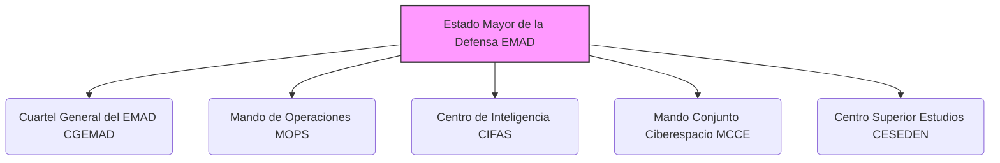

2. Directamente subordinados al **Jefe de Estado Mayor de la Defensa (JEMAD)**, se encuentran:
    * a) Las **organizaciones operativas permanentes**:
        * 1.º El **Mando Operativo Terrestre** ([[OpoMelilla/BLOQUE 1/Notas Tema 6. EMAD/MOT\|MOT]]).
        * 2.º El **Mando Operativo Marítimo** ([[OpoMelilla/BLOQUE 1/Notas Tema 6. EMAD/MOM\|MOM]]).
        * 3.º El **Mando Operativo Aéreo** ([[OpoMelilla/BLOQUE 1/Notas Tema 6. EMAD/MOA\|MOA]]).
        * 4.º El **Mando Operativo Espacial** ([[OpoMelilla/BLOQUE 1/Notas Tema 6. EMAD/MOESPA\|MOESPA]]).
        * 5.º El **Mando Operativo Ciberespacial** ([[OpoMelilla/BLOQUE 1/Notas Tema 6. EMAD/MOC\|MOC]]).
    * b) Los **órganos nacionales militares relacionados con organizaciones internacionales o multinacionales**.

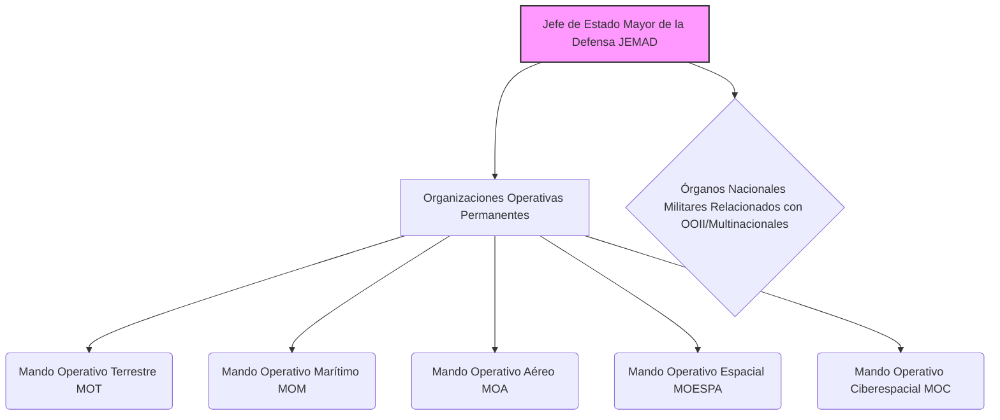

## Artículo 2. Organización del Cuartel General del Estado Mayor de la Defensa.

💡 ***Tip/Consejo:*** *Este artículo detalla la composición del [[OpoMelilla/BLOQUE 1/Notas Tema 6. EMAD/CGEMAD\|CGEMAD]], el **núcleo de apoyo y asesoramiento** al [[OpoMelilla/BLOQUE 1/Notas Tema 6. EMAD/JEMAD\|JEMAD]].  Familiarízate con los cinco componentes principales del CGEMAD, recordando que el [[OpoMelilla/BLOQUE 1/Notas Tema 6. EMAD/EMACON\|EMACON]] es el elemento central dentro de este Cuartel General.*

🔑 ***Aspecto Clave:*** **_El Cuartel General del Estado Mayor de la Defensa (CGEMAD) apoya y asesora al JEMAD y se compone de cinco elementos principales, incluyendo el EMACON._**

1. El **Cuartel General del Estado Mayor de la Defensa (CGEMAD)**, es responsable de prestar el apoyo y asesoramiento al **JEMAD** en el ejercicio de sus competencias.

2. El **CGEMAD** está integrado por:
    * a) El **Estado Mayor Conjunto de la Defensa** ([[OpoMelilla/BLOQUE 1/Notas Tema 6. EMAD/EMACON\|EMACON]]).
    * b) La **Jefatura de Recursos Humanos** ([[OpoMelilla/BLOQUE 1/Notas Tema 6. EMAD/JRRHH\|JRRHH]]).
    * c) Los **Órganos de Asistencia y Asesoramiento**.
    * d) La **Jefatura de Asuntos Económicos** ([[OpoMelilla/BLOQUE 1/Notas Tema 6. EMAD/JAE\|JAE]]).
    * e) Otros órganos que se determinen.

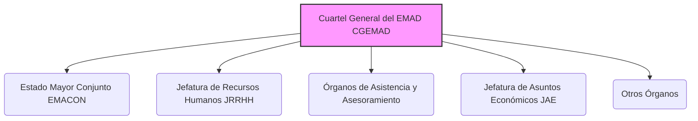

1. Asimismo, la **Intervención Delegada del EMAD** constituye el **Órgano de Control Económico y Financiero**, que ejerce el control interno de la gestión económico-financiera, la Notaría Militar y el asesoramiento económico-fiscal. Depende orgánica y funcionalmente de la **Intervención General de la Defensa**.

## Artículo 3. El Estado Mayor Conjunto de la Defensa.

💡 ***Tip/Consejo:*** *Este artículo profundiza en el [[OpoMelilla/BLOQUE 1/Notas Tema 6. EMAD/EMACON\|EMACON]], el **órgano auxiliar clave** del [[OpoMelilla/BLOQUE 1/Notas Tema 6. EMAD/JEMAD\|JEMAD]].  Estudia las diez divisiones, jefaturas y secciones que componen el EMACON, entendiendo sus funciones principales como apoyo en estrategia, planeamiento, operaciones y eficacia operativa de las [[OpoMelilla/BLOQUE 1/Notas Tema 6. EMAD/FAS\|FAS]].  El EMACON es el **cerebro operativo** del EMAD.*

🔑 ***Aspecto Clave:*** **_El Estado Mayor Conjunto de la Defensa (EMACON) es el principal órgano auxiliar del JEMAD, responsable de apoyarle en la estrategia militar, planeamiento, operaciones y eficacia operativa de las FAS._**

2. El **Estado Mayor Conjunto de la Defensa (EMACON)** es el **órgano auxiliar de mando** del **JEMAD**, al cual apoya y asesora en la definición de la estrategia militar, en el planeamiento militar, en el planeamiento y la conducción estratégica de las operaciones, en la realización de las acciones necesarias para asegurar la eficacia operativa de las **Fuerzas Armadas (FAS)**, en la representación militar ante **Organizaciones Internacionales de Seguridad y Defensa (OISD)** y en el resto de sus competencias. Actuará como el **principal coordinador** de las actividades generales del **EMAD**.

3. El **EMACON** se articula en:
    * a) La **Jefatura**.
    * b) La **Secretaría General del Estado Mayor Conjunto de la Defensa (SEGEMACON)**.
    * c) La **División de Planes (DIVPLA)**.
    * d) La **División de Estrategia (DIVESTRA)**.
    * e) La **División de Desarrollo de la Fuerza (DIVDEF)**.
    * f) La **Jefatura Conjunta de Sanidad (JECOSAN)**.
    * g) La **Célula Nacional Contra Artefactos Explosivos Improvisados (CENCIED)**.
    * h) La **Unidad de Verificación (UVE)**.
    * i) La **Sección de Gestión de la Información y del Conocimiento (SGIC)**.
    * j) La **Jefatura de Seguridad y Servicios del Cuartel General del EMAD (JESES-CGEMAD)**.
    * k) Otras unidades que se determinen.

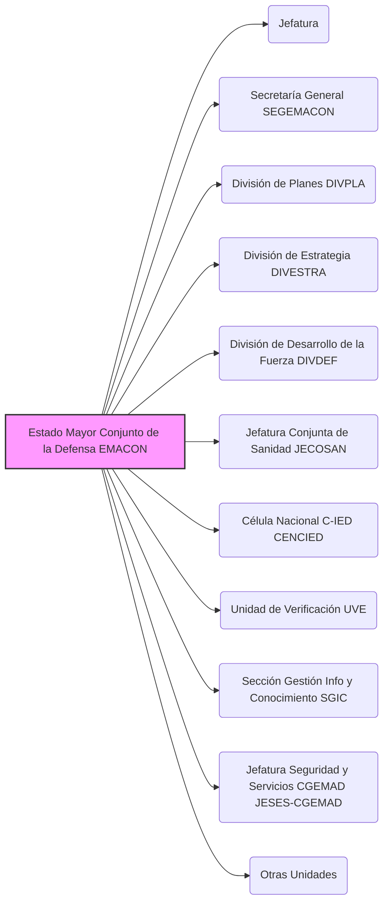

4. La **SEGEMACON** es el órgano responsable de apoyar y auxiliar directamente al **Jefe del EMACON (JEMACON)** en la dirección del EMACON, así como proporcionar el apoyo técnico-administrativo a los órganos del **CGEMAD** para la coordinación de las actividades de los mismos, con el respaldo de las distintas secretarías y secretarías técnicas. Asesora y apoya en los asuntos que, siendo responsabilidad del EMACON, no son específicos de los organismos que lo componen.

5. La **DIVPLA** es responsable de elaborar y coordinar el planeamiento de Fuerza y su integración en el planeamiento de defensa, de desarrollar los cometidos relacionados con el proceso de obtención de recursos materiales en los que el **JEMAD** sea competente y de impulsar los procesos de transformación de las capacidades militares de las **FAS**. Asimismo, es responsable de elaborar y coordinar la postura de las FAS ante las **OISD** en el ámbito logístico y ejercer la representación del JEMAD ante estas organizaciones en lo referente a sus cometidos como autoridad nacional de planeamiento militar, en especial en la propuesta de capacidades militares.

6. La **DIVESTRA** es la responsable de elaborar y desarrollar la estrategia militar contenida en el concepto de empleo de las FAS, así como de coordinar la postura y representar a las FAS en las **OISD** ante las que el **JEMAD** tenga responsabilidades. Planifica la participación española en unidades en el extranjero dependientes del **JEMAD**. Planea, coordina y controla las actividades derivadas de las relaciones militares bilaterales y multilaterales que competan al JEMAD. Asimismo, apoya al JEMAD en el planeamiento, conducción y seguimiento de las operaciones militares en el nivel estratégico, desarrollando los procesos necesarios y confeccionando los documentos de planeamiento correspondientes. Además, apoya al JEMAD en la dirección y el control de la comunicación estratégica en el ámbito del EMAD.

7. La **DIVDEF** es el órgano responsable de liderar el **proceso transversal de Desarrollo de la Fuerza**, comprendiendo los esfuerzos de preparación e interoperabilidad y coordinando la orientación de la preparación conjunta. Lidera, asimismo, el proceso de prospectiva, definiendo el marco estratégico militar. Impulsa y dirige el desarrollo y la experimentación de nuevos conceptos. Promueve y coordina el estudio y desarrollo de la doctrina conjunta y combinada. Mantiene las relaciones necesarias con los organismos homólogos de doctrina y desarrollo de la fuerza. Promueve y coordina el proceso conjunto de lecciones aprendidas y mejores prácticas.

8. La **JECOSAN** es responsable de dirigir y coordinar los aspectos relacionados con la **sanidad operativa**, en el ámbito de sus competencias. Para ello, imparte directrices dirigidas a orientar la preparación y empleo de las capacidades sanitarias operativas derivadas del Planeamiento Militar. Además, participa en el desarrollo y establecimiento de las normas de acción conjunta en este ámbito.

9. La **CENCIED** tiene la misión de impulsar y coordinar el desarrollo de la capacidad de **lucha Contra Artefactos Explosivos Improvisados (C-IED)** en las FAS y la postura de éstas ante las **OISD** en este ámbito, así como de apoyar, dentro del ámbito que se requiera, en el planeamiento y conducción de las operaciones militares. Constituye el enlace nacional del **Centro de Excelencia Contra Artefactos Explosivos Improvisados (CoE C-IED)**, con el **Centro Nacional de Inteligencia** y con las **Fuerzas y Cuerpos de Seguridad del Estado**.

10. La **UVE** tiene como responsabilidad planear, coordinar, controlar y ejecutar las actividades que corresponden a las FAS, en conjunción con las llevadas a cabo por otros órganos de la Administración, derivadas de la asunción por parte de España de diversos **compromisos internacionales** relacionados con el desarme, el control de armamentos y el establecimiento de medidas de confianza y seguridad, así como la verificación de su cumplimiento por otros Estados.

11. La **SGIC** tiene la misión de identificar y mantener actualizados los principales **procesos funcionales y operativos** del **EMAD**, planeando y desarrollando la estructura más adecuada de Gestión de la Información y del Conocimiento en el ámbito del EMAD y su implantación. Asimismo, propone medidas de coordinación de los procesos troncales transversales definidos por el JEMAD para enlazar con los procesos específicos.

12. La **JESES-CGEMAD** es responsable del mantenimiento de las instalaciones, apoyando en materia de vida y funcionamiento al **CGEMAD** y a aquellas unidades dependientes del **JEMAD** que se determinen y a sus componentes. Organiza y dirige la seguridad que precise el personal destinado en el CGEMAD y de sus dependencias. Además, lleva a cabo las gestiones en materia medioambiental, eficiencia energética y prevención de riesgos laborales en el CGEMAD.

## Artículo 4. La Jefatura de Recursos Humanos.

💡 ***Tip/Consejo:*** *Este artículo describe la [[OpoMelilla/BLOQUE 1/Notas Tema 6. EMAD/JRRHH\|JRRHH]], responsable de la **gestión del personal** del [[OpoMelilla/BLOQUE 1/Notas Tema 6. EMAD/EMAD\|EMAD]].  Comprende las funciones de planeamiento, gestión, apoyo administrativo y logístico del personal militar y civil, así como el asesoramiento al [[OpoMelilla/BLOQUE 1/Notas Tema 6. EMAD/JEMAD\|JEMAD]] en enseñanza y recursos humanos en el ámbito de las [[OpoMelilla/BLOQUE 1/Notas Tema 6. EMAD/OISD\|OISD]].*

🔑 ***Aspecto Clave:*** **_La Jefatura de Recursos Humanos (JRRHH) es responsable del planeamiento y gestión del personal militar y civil del EMAD, así como de su apoyo y asesoramiento en materia de recursos humanos._**

13. La **Jefatura de Recursos Humanos (JRRHH)** es el órgano responsable del planeamiento y gestión del recurso de personal militar y civil dependiente del **JEMAD**, así como de su apoyo administrativo y logístico. Asesora al JEMAD en el ámbito de la enseñanza que recae bajo su competencia y, en coordinación con el **JEMACON**, en los asuntos relacionados con el planeamiento del recurso de personal dependiente del JEMAD y de la postura ante las **OISD** en el ámbito de su responsabilidad. Es la representante ante las OISD en los aspectos de recursos humanos del ámbito de responsabilidad del EMAD.

14. La **JRRHH** se articula en:
    * a) La **Jefatura**.
    * b) La **Secretaría**.
    * c) La **Sección de Planes de Recursos Humanos**.
    * d) La **Sección de Gestión y Apoyo**.
    * e) La **Sección de Asuntos Generales**.
    * f) Otras unidades que se determinen.

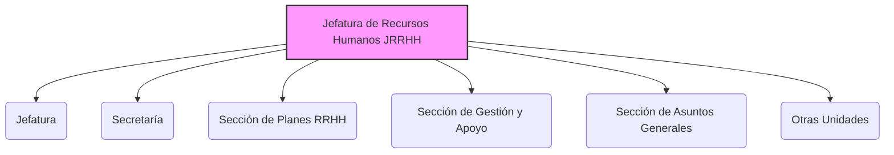

## Artículo 5. Los Órganos de Asistencia y Asesoramiento.

💡 ***Tip/Consejo:*** *Este artículo enumera los [[OpoMelilla/BLOQUE 1/Notas Tema 6. EMAD/Órganos de Asistencia y Asesoramiento\|Órganos de Asistencia y Asesoramiento]], que son **estructuras de apoyo directo** al [[OpoMelilla/BLOQUE 1/Notas Tema 6. EMAD/JEMAD\|JEMAD]].  Identifica los cuatro órganos principales: Gabinete del JEMAD, GABTECJEMAD, SEPERCJEM y Asesoría Jurídica, y comprende brevemente sus funciones: apoyo directo, información pública y protocolo, secretaría de consejos y asesoramiento legal, respectivamente.*

🔑 ***Aspecto Clave:*** **_Los Órganos de Asistencia y Asesoramiento son estructuras de apoyo directo al JEMAD en diversas áreas como gabinete, técnico, secretaría de consejos y asesoría jurídica._**

15. Los **Órganos de Asistencia y Asesoramiento** son los siguientes:
    * a) El **Gabinete del JEMAD**.
    * b) El **Gabinete Técnico del JEMAD (GABTECJEMAD)**.
    * c) La **Secretaría Permanente del Consejo de Jefes de Estado Mayor (SEPERCJEM)**.
    * d) La **Asesoría Jurídica del EMAD**.

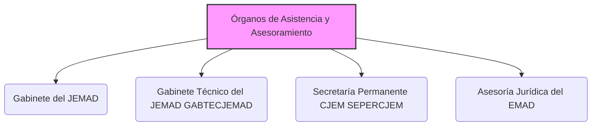

16. El **Gabinete del JEMAD** es un órgano de apoyo, asesoramiento y asistencia inmediata a dicha autoridad, con nivel orgánico de subdirección general, con la estructura que establece el **artículo 23.3 del Real Decreto 139/2020, de 28 de enero**, por el que se establece la estructura orgánica básica de los departamentos ministeriales.

17. El **GABTECJEMAD** es responsable de la dirección y control de la **política de información pública** del **EMAD**. Es el responsable del planeamiento, coordinación y ejecución de las actividades públicas y protocolarias del **JEMAD**, así como de sus relaciones institucionales.

18. La **SEPERCJEM** actúa como **órgano administrativo** de dicho Consejo y de aquellos otros consejos y reuniones que el **JEMAD** le encomiende. Contará con el apoyo técnico y administrativo del **GABTECJEMAD**. El Jefe de la SEPERCJEM será nombrado por la persona titular del **Ministerio de Defensa**, a propuesta del JEMAD.

19. La **Asesoría Jurídica del EMAD**, es el **órgano consultivo y asesor**, único en materia jurídica, del **JEMAD** y de aquellos otros órganos que éste determine. Dependerá orgánicamente del JEMAD y funcionalmente de la **Asesoría Jurídica General de la Defensa**.

## Artículo 6. La Jefatura de Asuntos Económicos.

💡 ***Tip/Consejo:*** *Este artículo describe la [[OpoMelilla/BLOQUE 1/Notas Tema 6. EMAD/JAE\|JAE]], responsable de la **gestión económica y financiera** del [[OpoMelilla/BLOQUE 1/Notas Tema 6. EMAD/EMAD\|EMAD]].  Comprende la dirección, gestión y administración de los recursos financieros, el asesoramiento económico al [[OpoMelilla/BLOQUE 1/Notas Tema 6. EMAD/JEMAD\|JEMAD]], y la elaboración del anteproyecto de presupuesto.  Depende funcionalmente de la Dirección General de Asuntos Económicos.*

🔑 ***Aspecto Clave:*** **_La Jefatura de Asuntos Económicos (JAE) gestiona los recursos financieros del EMAD, asesora al JEMAD en materia económica y elabora el anteproyecto de presupuesto._**

La **Jefatura de Asuntos Económicos (JAE)** es el órgano responsable de la dirección, gestión y administración de los recursos financieros bajo la dependencia del **JEMAD**, a quien asesora en esta materia. También es responsable de los asuntos presupuestarios, así como de la contratación y contabilidad. Le corresponderá la elaboración técnica del anteproyecto de presupuesto y la centralización de toda la información, tanto sobre la previsión y ejecución de los programas como del presupuesto. Dependerá funcionalmente de la **Dirección General de Asuntos Económicos**.

## Artículo 7. El Mando de Operaciones.

💡 ***Tip/Consejo:*** *Este artículo detalla el [[OpoMelilla/BLOQUE 1/Notas Tema 6. EMAD/MOPS\|MOPS]], el **órgano central para la conducción de las operaciones militares**.  Comprende sus funciones de planeamiento operativo, conducción, seguimiento y sostenimiento de operaciones, así como el asesoramiento operacional al [[OpoMelilla/BLOQUE 1/Notas Tema 6. EMAD/JEMAD\|JEMAD]].  Estudia los siete componentes del MOPS, destacando el [[OpoMelilla/BLOQUE 1/Notas Tema 6. EMAD/EMMOPS\|EMMOPS]] como su principal órgano auxiliar y el [[OpoMelilla/BLOQUE 1/Notas Tema 6. EMAD/MCOE\|MCOE]] para Operaciones Especiales.*

🔑 ***Aspecto Clave:*** **_El Mando de Operaciones (MOPS) es el órgano responsable del planeamiento, conducción, seguimiento y sostenimiento de las operaciones militares, asesorando al JEMAD en el nivel operacional._**

20. El **Mando de Operaciones (MOPS)** es el órgano responsable del planeamiento operativo, la conducción, el seguimiento y la dirección del sostenimiento de las operaciones militares. Asimismo, asesora al **JEMAD** en la conducción estratégica de las operaciones desde el punto de vista operacional y es responsable de realizar el planeamiento y conducción de aquellos ejercicios que se determinen. Elabora directrices para el adiestramiento y alistamiento de los mandos y fuerzas asignados a la estructura operativa, supervisa su preparación y evalúa su disponibilidad operativa, contribuyendo a asegurar su eficacia operativa. Además, realiza la gestión del recurso de personal en las operaciones.

21. El **MOPS** se articulará en:
    * a) La **Comandancia**.
    * b) La **Segunda Comandancia**.
    * c) El **Estado Mayor del Mando de Operaciones (EMMOPS)**.
    * d) El **Mando Conjunto de Operaciones Especiales (MCOE)**.
    * e) El **Núcleo del Cuartel General Conjunto Multinacional (ES-OHQ)**.
    * f) La **Jefatura de Seguridad y Servicios (JESES-RETAMARES)**.
    * g) Otras unidades que se determinen.

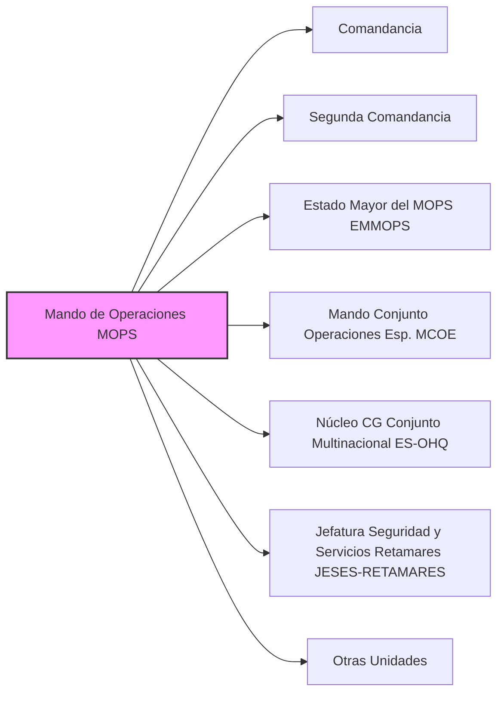

22. El **EMMOPS**, principal órgano auxiliar de mando del **Comandante del MOPS (CMOPS)**, es el órgano al que corresponde la planificación, coordinación y control general de las actividades relacionadas con el planeamiento, seguimiento y conducción de las operaciones en el nivel operacional. Contará con un **Área de Operaciones (AOPS)** y un **Área de Apoyos (AAPO)**.

23. El **Jefe del Estado Mayor del MOPS** es, a su vez, el **Segundo Comandante del MOPS**.

24. El **MCOE** es responsable de realizar el planeamiento, conducción y seguimiento de las **operaciones especiales** que se determinen, así como de facilitar la integración e interoperabilidad de las capacidades de operaciones especiales, y de planificar y conducir los ejercicios conjuntos necesarios para asegurar la eficacia operativa de las unidades de operaciones especiales que le sean asignadas. Asimismo, asesora al **CMOPS** en todo lo referente a operaciones especiales. Cuando así se determine, constituirá la base del Cuartel General de un **Mando Componente de Operaciones Especiales**, con capacidad para atender las necesidades nacionales y los compromisos internacionales.

25. El **ES-OHQ** es responsable de facilitar el proceso de activación de dicho Cuartel General de manera rápida y flexible.

26. La **JESES-RETAMARES** es el órgano responsable del mantenimiento de las instalaciones de la **Base de Retamares**, apoyando en materia de vida y funcionamiento a dicha base y a aquellas unidades dependientes del **JEMAD** que se determinen y a sus componentes. Responde en el ejercicio de sus funciones ante el **CMOPS**, como Jefe de la Base de Retamares. Organiza y dirige la seguridad que precise el personal destinado en la Base de Retamares y de sus dependencias. Además, lleva a cabo las gestiones en materia medioambiental, eficiencia energética y prevención de riesgos laborales en la Base de Retamares.

## Artículo 8. El Centro de Inteligencia de las Fuerzas Armadas.

💡 ***Tip/Consejo:*** *Este artículo describe el [[OpoMelilla/BLOQUE 1/Notas Tema 6. EMAD/CIFAS\|CIFAS]], el **servicio de inteligencia militar** de las [[OpoMelilla/BLOQUE 1/Notas Tema 6. EMAD/FAS\|FAS]].  Comprende su misión de proporcionar inteligencia militar al Ministerio de Defensa y al [[OpoMelilla/BLOQUE 1/Notas Tema 6. EMAD/JEMAD\|JEMAD]] para la alerta temprana de crisis y el apoyo a las operaciones.  También asesora en contrainteligencia y seguridad militar.*

🔑 ***Aspecto Clave:*** **_El Centro de Inteligencia de las Fuerzas Armadas (CIFAS) proporciona inteligencia militar para la alerta temprana de crisis, apoya las operaciones y asesora en contrainteligencia y seguridad militar._**

El **Centro de Inteligencia de las Fuerzas Armadas (CIFAS)** es el órgano responsable de facilitar a la persona titular del **Ministerio de Defensa**, a través del **JEMAD**, y a las autoridades del Departamento, la inteligencia militar precisa para alertar sobre situaciones internacionales susceptibles de generar crisis que afecten a la Defensa Nacional, así como de prestar el apoyo necesario, en su ámbito, a las operaciones. El **JEMAD** establecerá las condiciones en las que el CIFAS apoyará al **MOPS** en las operaciones que se determine. Asimismo, asesora al **JEMAD** y a los Jefes de Estado Mayor de los Ejércitos y la Armada en materia de contrainteligencia militar y seguridad en la estructura orgánica de las FAS. Además, contribuye al asesoramiento al JEMAD en el nivel estratégico de las operaciones militares.

## Artículo 9. El Mando Conjunto del Ciberespacio.

💡 ***Tip/Consejo:*** *Este artículo detalla el [[OpoMelilla/BLOQUE 1/Notas Tema 6. EMAD/Mando Conjunto del Ciberespacio (MCCE)\|Mando Conjunto del Ciberespacio (MCCE)]], el **mando responsable de las operaciones en el ciberespacio**.  Comprende su misión de asegurar la libertad de acción de las [[OpoMelilla/BLOQUE 1/Notas Tema 6. EMAD/FAS\|FAS]] en este ámbito, incluyendo la planificación, dirección, coordinación, control y ejecución de acciones ciber.  Estudia los diez componentes del MCCE, resaltando la [[OpoMelilla/BLOQUE 1/Notas Tema 6. EMAD/FOCE\|FOCE]] para la ejecución de operaciones y la [[OpoMelilla/BLOQUE 1/Notas Tema 6. EMAD/EMCO\|EMCO]] para la formación en ciberoperaciones.*

🔑 ***Aspecto Clave:*** **_El Mando Conjunto del Ciberespacio (MCCE) es responsable de asegurar la libertad de acción de las FAS en el ciberespacio mediante la planificación y ejecución de operaciones ciberdefensa._**

27. El **Mando Conjunto del Ciberespacio (MCCE)** es el órgano responsable del planeamiento, la dirección, la coordinación, el control y la ejecución de las acciones conducentes a asegurar la **libertad de acción de las FAS en el ámbito ciberespacial**. Para cumplir su misión, planea, dirige, coordina, controla y ejecuta las operaciones militares en el ciberespacio, de acuerdo con los planes operativos en vigor. En el ámbito de estas operaciones, realiza las acciones necesarias para garantizar la supervivencia de los elementos físicos, lógicos y virtuales críticos para la Defensa y las FAS.

28. Asegura la autoridad del **JEMAD** sobre la **Infraestructura Integral de Información para la Defensa (I3D)** en el ámbito operativo. Colabora en la transformación digital del **Ministerio de Defensa**, en el ámbito del **EMAD**, en coordinación con el **EMACON**.

29. Es responsable, en colaboración con el **EMACON**, de la definición de requisitos operativos, seguimiento de la obtención y el sostenimiento de los medios de **Ciberdefensa**, de los **Sistemas de Información y Telecomunicaciones (CIS)** conjuntos de Mando y Control, de Guerra Electrónica y Navegación e Identificación, velando por la interoperabilidad de estos con los específicos de los Ejércitos y de la Armada. Asimismo, ha de prestar el apoyo CIS a la estructura del **EMAD**.

30. El **MCCE** incluye el **Equipo de Respuesta ante Emergencias Informáticas del MINISDEF**, con la denominación **CERT de Defensa (ESPDEF-CERT)**.

31. El **MCCE** se articulará en:
    * a) La **Comandancia**.
    * b) La **Segunda Comandancia**.
    * c) El **Estado Mayor del MCCE (EMMCCE)**.
    * d) La **Fuerza de Operaciones en el Ciberespacio (FOCE)**.
    * e) La **Jefatura de Mando y Control (JMC)**.
    * f) La **Jefatura de Sistemas de Ciberdefensa (JSCD)**.
    * g) La **Jefatura de Telecomunicaciones y Guerra Electrónica (JTEW)**.
    * h) La **Jefatura de Apoyo CIS al EMAD (JEACISEMAD)**.
    * i) La **Escuela Militar de Ciberoperaciones (EMCO)**.
    * j) Otras unidades que se determinen.

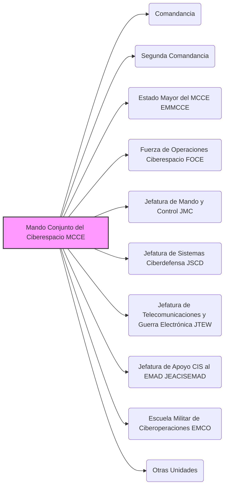

32. El **EMMCCE** es el principal órgano auxiliar del **Comandante del MCCE**, llevando a cabo las actividades de planeamiento, organización, coordinación, seguimiento y control del MCCE.

33. La **FOCE** es responsable de la **ejecución de las operaciones militares** que aseguren la libertad de acción de las FAS en el ciberespacio. En el ámbito de las citadas operaciones militares, dirige operativa y técnicamente las actividades de los **Centros de Operaciones de Seguridad (COS)** de las FAS. Coordina con los Ejércitos, la Armada y el **Centro de Sistemas y Tecnologías de la Información y las Comunicaciones (CESTIC)** las acciones necesarias. Cuando se estén realizando operaciones en el espectro electromagnético, coordinará que la ejecución de las acciones ciber se realiza de forma concurrente con éstas.

34. La **EMCO** es responsable de impartir las **enseñanzas de perfeccionamiento** en el ámbito de las ciberoperaciones y aquellas otras que se determinen relacionadas con la ciberdefensa. La EMCO dependerá funcionalmente del **Centro Superior de Estudios de la Defensa Nacional (CESEDEN)** para aquellos aspectos relacionados con la aprobación de los perfiles de ingreso y egreso, currículos y convocatorias de cursos conjuntos que formen parte de las enseñanzas de perfeccionamiento a impartir en esta Escuela.

## Artículo 10. El Centro Superior de Estudios de la Defensa Nacional.

💡 ***Tip/Consejo:*** *Este artículo describe el [[OpoMelilla/BLOQUE 1/Notas Tema 6. EMAD/CESEDEN\|CESEDEN]], el **principal centro de enseñanza militar conjunta**.  Comprende su misión de impartir cursos de Altos Estudios de la Defensa Nacional, investigación en seguridad y defensa, y fomento de la cultura de seguridad y defensa.  Estudia los diez componentes del CESEDEN, destacando la [[OpoMelilla/BLOQUE 1/Notas Tema 6. EMAD/ESFAS\|ESFAS]] para la formación de oficiales de Estado Mayor y el [[OpoMelilla/BLOQUE 1/Notas Tema 6. EMAD/IEEE\|IEEE]] para la investigación estratégica.*

🔑 ***Aspecto Clave:*** **_El Centro Superior de Estudios de la Defensa Nacional (CESEDEN) es el principal centro docente militar conjunto, dedicado a la formación de altos mandos, la investigación en seguridad y defensa, y la difusión de la cultura de defensa._**

35. El **Centro Superior de Estudios de la Defensa Nacional (CESEDEN)**, principal centro docente militar conjunto, es el órgano al que corresponde impartir **cursos de Altos Estudios de la Defensa Nacional** y otros estudios conducentes a la obtención de títulos de posgrado, así como los estudios militares de carácter conjunto que se determinen. Para ello, fomentará la cooperación con otros ámbitos de la Administración y establecerá colaboraciones con las universidades, los centros universitarios de la defensa y otras corporaciones públicas y privadas mediante los convenios pertinentes.

36. Asimismo, desarrolla **tareas de investigación** sobre temas relacionados con la Seguridad y Defensa, contribuye al **fomento y difusión de la Cultura de Seguridad y Defensa** y promueve y desarrolla estudios, investigaciones y otras actividades relacionadas con la historia militar.

37. En el desempeño de sus actividades, el **CESEDEN** depende funcionalmente de la **Subsecretaría de Defensa** para los asuntos relacionados con la enseñanza militar y de la **Secretaría General de Política de Defensa** para los asuntos relacionados con la difusión de la cultura de seguridad y defensa.

38. El **CESEDEN** se articula en:
    * a) La **Dirección**.
    * b) La **Secretaría General del CESEDEN**.
    * c) La **Escuela Superior de las Fuerzas Armadas (ESFAS)**.
    * d) El **Instituto Español de Estudios Estratégicos (IEEE)**.
    * e) El **Departamento de Cultura y Diplomacia de la Defensa (DCDD)**.
    * f) La **Sección de Nuevas Tecnologías de la Enseñanza (SENTE)**.
    * g) La **Comisión Española de Historia Militar (CEHISMI)**.
    * h) Otras unidades que se determinen.

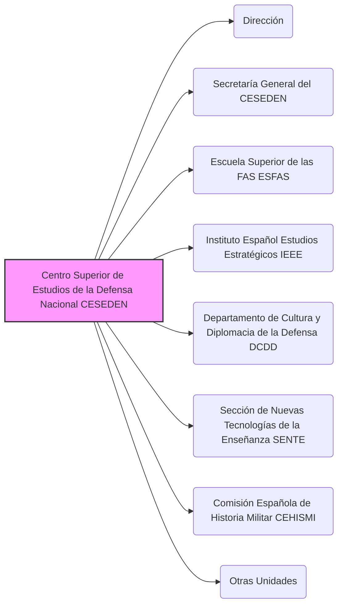

39. La **Secretaría General del CESEDEN** es el órgano responsable de auxiliar directamente al **Director del CESEDEN** en la dirección del Centro, así como del apoyo técnico-administrativo a los órganos y organismos subordinados del CESEDEN para la coordinación de las actividades de los mismos. Le corresponde también, el asesoramiento, apoyo y coordinación de los asuntos que, siendo responsabilidad del centro, no son específicos de los organismos que lo componen.

40. La **ESFAS**, centro docente militar de Altos Estudios de la Defensa Nacional, es responsable de impartir los **cursos de actualización** para el desempeño de los cometidos de oficial general, para la obtención del **diploma de Estado Mayor**, los **cursos de alta gestión de las FAS** y otros cursos conjuntos y títulos marcados en la **Ley 39/2007, de 19 de noviembre, de la carrera militar**. Es igualmente responsable del planeamiento y coordinación de aquellos cursos conjuntos que pudieran desarrollarse en otros centros docentes.

41. El **IEEE** es responsable de investigar y analizar asuntos relacionados con la seguridad y defensa y contribuir a la promoción y difusión de la Cultura de Seguridad y Defensa.

42. El **DCDD** es el responsable de impartir los **cursos de Defensa Nacional** y otras actividades conducentes a la promoción y difusión de la Cultura de Seguridad y Defensa, así como contribuir a la Diplomacia de Defensa impartiendo cursos internacionales para personal nacional y extranjero.

43. La **SENTE** es responsable de impulsar el desarrollo e implantación de **procesos y tecnologías innovadoras** que potencien la enseñanza militar.

44. La **CEHISMI** es un órgano colegiado que promueve, impulsa y desarrolla actividades relacionadas con la Historia Militar que afecten a más de uno de los Ejércitos, la Armada y la Guardia Civil y ejerce la representación nacional en los organismos internacionales de historia militar en los casos en que así se acuerde.

## Artículo 11. Las Organizaciones Operativas.

💡 ***Tip/Consejo:*** *Este artículo describe la **estructura operativa de las [[OpoMelilla/BLOQUE 1/Notas Tema 6. EMAD/FAS\|FAS]]** bajo el mando del [[OpoMelilla/BLOQUE 1/Notas Tema 6. EMAD/JEMAD\|JEMAD]].  Distingue entre [[OpoMelilla/BLOQUE 1/Notas Tema 6. EMAD/Organizaciones Operativas#Mandos Componentes designados\|Mandos Componentes designados]] (activados según necesidad) y [[OpoMelilla/BLOQUE 1/Notas Tema 6. EMAD/Organizaciones Operativas#Mandos Operativos permanentes\|Mandos Operativos permanentes]] (activos continuamente).  Memoriza los cinco Mandos Componentes designados y los cinco Mandos Operativos permanentes, y comprende su relación con los ámbitos terrestre, marítimo, aéreo, espacial y ciberespacial.*

🔑 ***Aspecto Clave:*** **_La estructura operativa de las FAS, bajo el mando del JEMAD, se compone de Mandos Componentes designados y Mandos Operativos permanentes, abarcando los ámbitos físico y ciberespacial._**

45. El **JEMAD** ejerce el Mando de la estructura operativa de las FAS, y de él dependen los diferentes **Mandos Componentes**, designados previamente, que desarrollarán las operaciones que se determinen, según los planes operativos en vigor.

46. Además de estos Mandos designados, forman parte de la estructura operativa los **mandos operativos permanentes** que se relacionan en el apartado 5 de este artículo.

47. **Mandos Componentes designados**. A propuesta del JEMAD y de los respectivos Jefes de Estado Mayor de los Ejércitos y de la Armada y previa conformidad de la persona titular del **Ministerio de Defensa**, serán designados por el JEMAD los **Mandos Componentes del máximo nivel**, que serán generados por los Ejércitos, la Armada y el **MCCE** y que recibirán la denominación siguiente: **Mando Componente Terrestre**, **Mando Componente Marítimo**, **Mando Componente Aéreo**, **Mando Componente Espacial** y **Mando Componente Ciberespacial**.

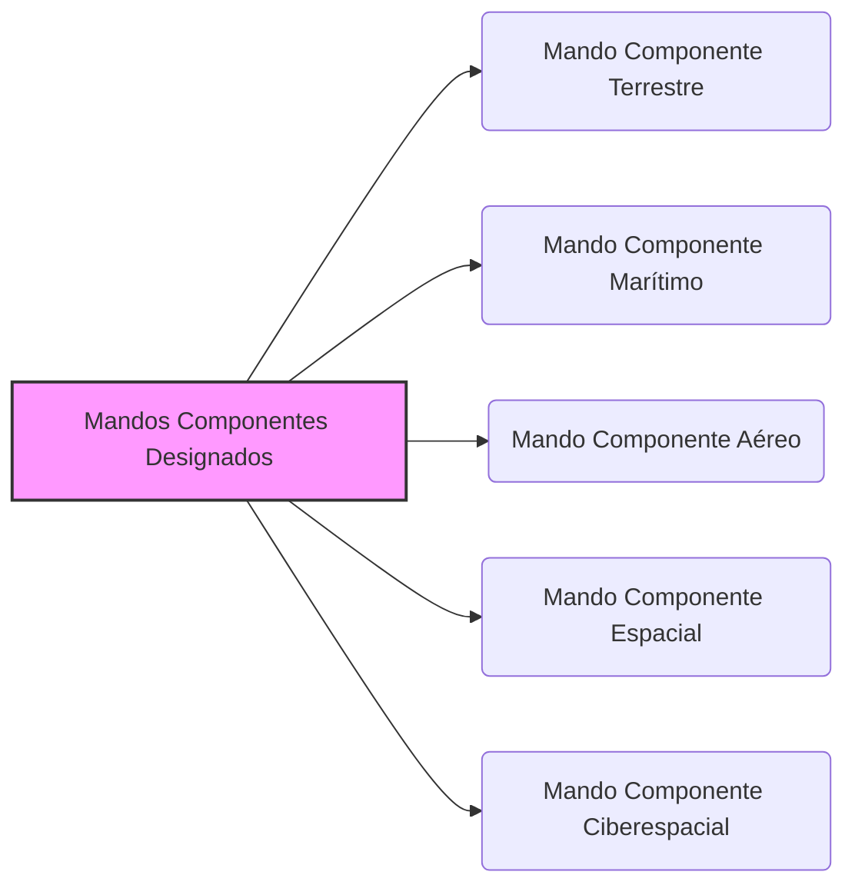

48. Además de los anteriores, por su carácter transversal, se activará, en su caso, el **Mando Componente de Operaciones Especiales**, de acuerdo con la doctrina militar vigente.

49. **Mandos Operativos permanentes**. Para el desarrollo de las operaciones que las FAS tienen activadas continuamente, se constituyen:
    * a) El **Mando Operativo Terrestre (MOT)**. Es el órgano de la estructura operativa de las FAS responsable, a su nivel, del planeamiento, conducción y seguimiento de las citadas operaciones en el ámbito terrestre.
        * El Jefe de Estado Mayor del Ejército propondrá al JEMAD la designación del Comandante del Mando Operativo Terrestre (CMOT).
    * b) El **Mando Operativo Marítimo (MOM)**. Es el órgano de la estructura operativa de las FAS responsable, a su nivel, del planeamiento, conducción y seguimiento de las citadas operaciones en el ámbito marítimo.
        * El Almirante Jefe de Estado Mayor de la Armada propondrá al JEMAD la designación del Comandante del Mando Operativo Marítimo (CMOM).
    * c) El **Mando Operativo Aéreo (MOA)**. Es el órgano de la estructura operativa de las FAS responsable, a su nivel, del planeamiento, conducción y seguimiento de las citadas operaciones en el espacio aéreo.
        * El Jefe de Estado Mayor del Ejército del Aire y del Espacio propondrá al JEMAD la designación del Comandante del Mando Operativo Aéreo (CMOA).
    * d) El **Mando Operativo Espacial (MOESPA)**. Es el órgano de la estructura operativa de las FAS responsable, a su nivel, del planeamiento, conducción y seguimiento de las citadas operaciones en el espacio ultraterrestre.
        * El Jefe de Estado Mayor del Ejército del Aire y del Espacio propondrá al JEMAD la designación del Comandante del Mando Operativo Espacial (CMOESPA).
    * e) El **Mando Operativo Ciberespacial (MOC)**. Es el órgano de la estructura operativa de las FAS responsable, a su nivel, del planeamiento, conducción y seguimiento de las operaciones militares conducentes a asegurar la libertad de acción de las FAS en el ámbito ciberespacial, según los planes operativos en vigor.
        * El JEMAD designará al Comandante del Mando Operativo Ciberespacial (CMOC).

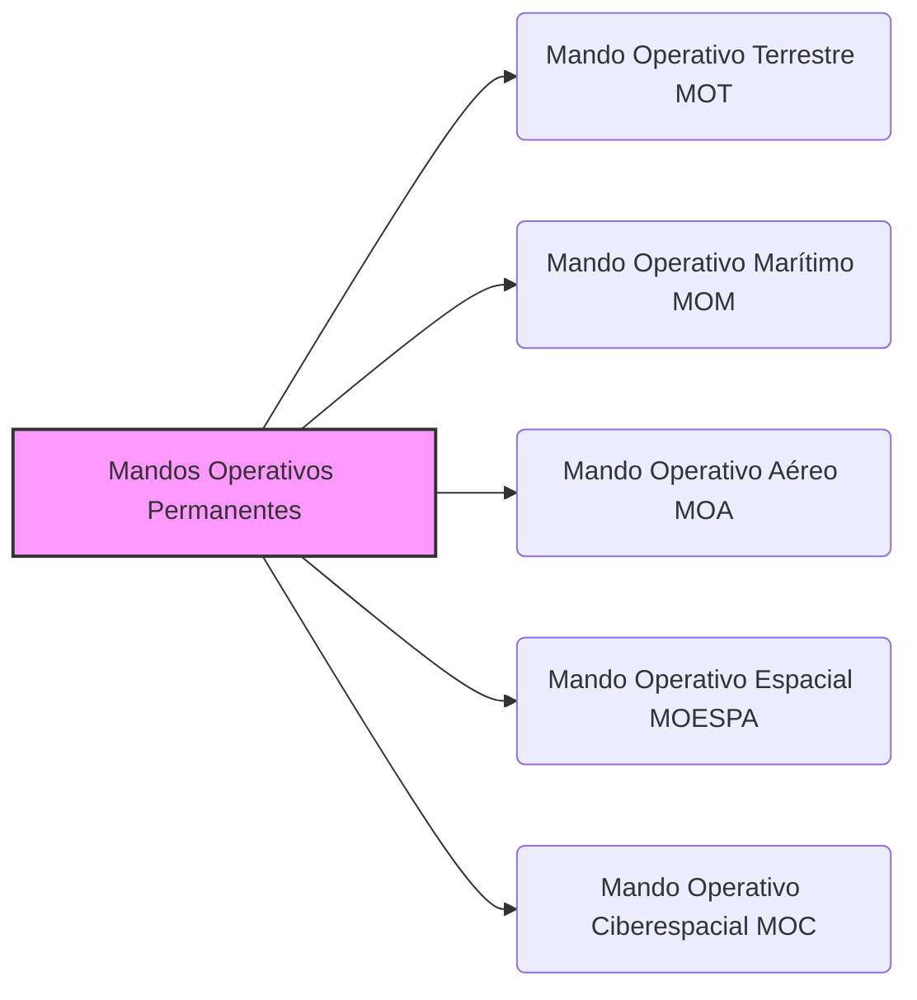

50. Los Comandantes de los citados Mandos Operativos ejercerán el mando de las fuerzas puestas bajo su autoridad, de acuerdo con lo establecido en los planes en vigor y conforme con la doctrina militar. También mantendrán, en el ejercicio de sus responsabilidades, relaciones de coordinación con las autoridades y organismos militares y civiles, relacionadas con las citadas operaciones.

## Artículo 12. Los órganos nacionales militares relacionados con organizaciones internacionales o multinacionales.

💡 ***Tip/Consejo:*** *Este artículo describe los [[OpoMelilla/BLOQUE 1/Notas Tema 6. EMAD/órganos nacionales militares relacionados con organizaciones internacionales o multinacionales\|órganos nacionales militares relacionados con organizaciones internacionales o multinacionales]], que son las **representaciones e integraciones** del [[OpoMelilla/BLOQUE 1/Notas Tema 6. EMAD/EMAD\|EMAD]] en el ámbito internacional.  Comprende las cuatro categorías principales: representaciones militares, elementos nacionales, elementos nacionales de apoyo y contingentes nacionales, y memoriza los ejemplos de representaciones militares y elementos nacionales citados.*

🔑 ***Aspecto Clave:*** **_Los órganos nacionales militares relacionados con organizaciones internacionales o multinacionales representan e integran al EMAD en el ámbito internacional, incluyendo representaciones militares, elementos nacionales, de apoyo y contingentes._**

51. Con arreglo a lo que establece el **artículo 9.4.b) del Real Decreto 521/2020, de 19 de mayo**, por el que se establece la **organización básica de las Fuerzas Armadas**, los órganos nacionales militares relacionados con organizaciones internacionales o multinacionales son:
    * a) Las **representaciones militares**.
    * b) Los **elementos nacionales**.
    * c) Los **elementos nacionales de apoyo**.
    * d) Los **contingentes nacionales integrados en organizaciones internacionales y multinacionales**.

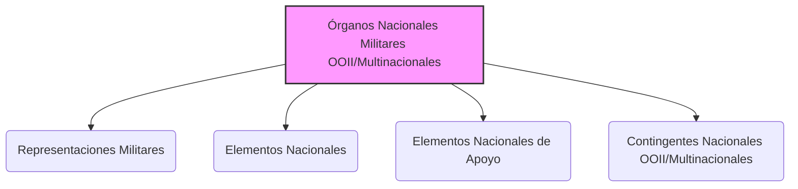

52. Las **representaciones militares** constituyen las **unidades permanentes de representación** del **JEMAD** ante **OISD**. Son las siguientes:
    * a) La **Representación Militar ante el Comité Militar de la Organización del Tratado del Atlántico Norte (OTAN)**.
    * b) La **Representación Militar ante el Comité Militar de la Unión Europea**.
    * c) La **Representación Militar ante el Mando Supremo Aliado en Europa**.
    * d) La **Representación Militar ante el Mando Supremo Aliado de Transformación**.

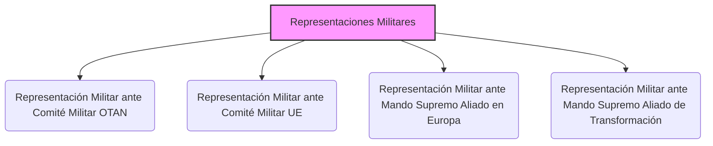

53. Los **elementos nacionales** son los **componentes nacionales de organismos internacionales** ubicados en territorio nacional. Además de los cometidos que tengan asignados en virtud de las disposiciones que los regulan, asumirán aquellos otros derivados de la aplicación de los acuerdos internacionales reguladores de los órganos internacionales de los que forman parte. Son los siguientes:
    * a) El **Elemento Nacional del Centro de Operaciones Aéreas Combinadas de Torrejón (CAOCTJ)**, que se rige por lo establecido en la **Orden Ministerial 93/2012, de 27 de diciembre**, por la que se crea el CAOCTJ.
    * b) El **Elemento Nacional del CoE C-IED**, que se rige por lo establecido en la **Orden DEF/960/2010, de 15 de abril**, por la que se constituye el Centro de Excelencia contra artefactos explosivos improvisados en el ámbito del Ministerio de Defensa y su ofrecimiento a la OTAN.

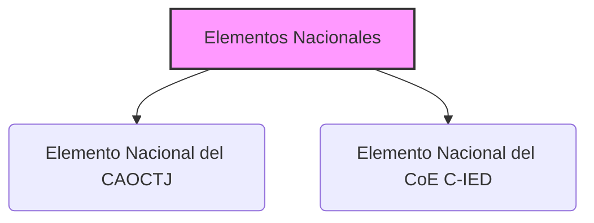

54. Los **elementos nacionales de apoyo** son los organismos que tienen como cometido fundamental proporcionar el **apoyo administrativo y general** al personal destinado o en comisión de servicio en las unidades del ámbito internacional adscritas a él.

55. Los **contingentes nacionales integrados en organizaciones internacionales y multinacionales** están constituidos por el personal español dependiente del **JEMAD** destinado o en comisión de servicio en las unidades, centros u organismos de dichas organizaciones y que ocupa puestos internacionales o multinacionales no específicos de las representaciones militares, de los elementos nacionales o de los elementos nacionales de apoyo.

Este texto consolidado no tiene valor jurídico.

---

## Tabla Resumen del Capítulo "ORGANIZACIÓN DEL ESTADO MAYOR DE LA DEFENSA"

| Tema Principal                 | Aspectos Clave                                                                                                                                                              | Implicaciones/Conclusiones                                                                                                                                                               |
|---------------------------------|----------------------------------------------------------------------------------------------------------------------------------------------------------------------------|-------------------------------------------------------------------------------------------------------------------------------------------------------------------------------------------|
| **Organización General del EMAD** [[Artículo 1. Organización del Estado Mayor de la Defensa.\|Artículo 1. Organización del Estado Mayor de la Defensa.]] | 📝 **_Estructura en 5 componentes principales: CGEMAD, MOPS, CIFAS, MCCE, CESEDEN._**   📝 **_Subordinación directa al JEMAD de organizaciones operativas permanentes y órganos nacionales militares._** | 🎯 **_Define la arquitectura básica del EMAD y las entidades clave bajo el mando del JEMAD para la defensa nacional._**                                                              |
| **Cuartel General del EMAD (CGEMAD)** [[Artículo 2. Organización del Cuartel General del Estado Mayor de la Defensa.\|Artículo 2. Organización del Cuartel General del Estado Mayor de la Defensa.]] | 📝 **_Responsable de apoyo y asesoramiento al JEMAD._**   📝 **_Integrado por EMACON, JRRHH, Órganos de Asistencia, JAE y otros._**                                                                             | 🎯 **_Constituye el núcleo central de apoyo administrativo, de planeamiento y asesoramiento al JEMAD para el ejercicio de sus funciones._**                                             |
| **Estado Mayor Conjunto (EMACON)** [[Artículo 3. El Estado Mayor Conjunto de la Defensa.\|Artículo 3. El Estado Mayor Conjunto de la Defensa.]]    | 📝 **_Órgano auxiliar principal del JEMAD para estrategia, planeamiento, operaciones y eficacia operativa._**   📝 **_Articulado en Jefatura, SEGEMACON, DIVPLA, DIVESTRA, DIVDEF, JECOSAN, CENCIED, UVE, SGIC, JESES-CGEMAD._**           | 🎯 **_Es el "cerebro" operativo del EMAD, coordinando las actividades y apoyando al JEMAD en la conducción estratégica y el aseguramiento de la eficacia de las FAS._**                     |
| **Jefatura de Recursos Humanos (JRRHH)** [[Artículo 4. La Jefatura de Recursos Humanos.\|Artículo 4. La Jefatura de Recursos Humanos.]]    | 📝 **_Responsable de planeamiento y gestión del personal militar y civil del EMAD._**   📝 **_Apoyo administrativo y logístico, asesoramiento en enseñanza y RRHH ante OISD._**                                                                  | 🎯 **_Garantiza la gestión eficiente del recurso humano del EMAD y su correcta administración, siendo clave para el funcionamiento del Estado Mayor._**                                  |
| **Órganos de Asistencia y Asesoramiento** [[Artículo 5. Los Órganos de Asistencia y Asesoramiento.\|Artículo 5. Los Órganos de Asistencia y Asesoramiento.]] | 📝 **_Apoyo directo al JEMAD: Gabinete del JEMAD, GABTECJEMAD, SEPERCJEM, Asesoría Jurídica._**   📝 **_Funciones: apoyo inmediato, información pública, secretaría de consejos, asesoramiento legal._**                                     | 🎯 **_Proporcionan al JEMAD el apoyo inmediato y especializado necesario para la toma de decisiones y la gestión del EMAD en diversas áreas clave._**                                     |
| **Jefatura de Asuntos Económicos (JAE)** [[Artículo 6. La Jefatura de Asuntos Económicos.\|Artículo 6. La Jefatura de Asuntos Económicos.]]   | 📝 **_Dirección, gestión y administración de recursos financieros del EMAD._**   📝 **_Asesoramiento económico al JEMAD, asuntos presupuestarios, contratación y contabilidad._**                                                               | 🎯 **_Asegura la correcta gestión económica y financiera del EMAD, siendo fundamental para la sostenibilidad y operatividad de las actividades del Estado Mayor._**                       |
| **Mando de Operaciones (MOPS)** [[Artículo 7. El Mando de Operaciones.\|Artículo 7. El Mando de Operaciones.]]                   | 📝 **_Planeamiento, conducción, seguimiento y sostenimiento de operaciones militares._**   📝 **_Asesoramiento operacional al JEMAD. Componentes: EMMOPS, MCOE, ES-OHQ._**                                                                         | 🎯 **_Es el brazo ejecutor del EMAD en el ámbito de las operaciones militares, garantizando la capacidad de respuesta y la eficacia operativa de las FAS en las misiones encomendadas._** |
| **Centro de Inteligencia (CIFAS)** [[Artículo 8. El Centro de Inteligencia de las Fuerzas Armadas.\|Artículo 8. El Centro de Inteligencia de las Fuerzas Armadas.]]    | 📝 **_Inteligencia militar para alerta temprana de crisis y apoyo a operaciones._**   📝 **_Asesoramiento en contrainteligencia y seguridad militar._**                                                                                             | 🎯 **_Proporciona la inteligencia necesaria para la toma de decisiones estratégicas y operacionales, y contribuye a la seguridad de las FAS en el ámbito de la inteligencia y contrainteligencia._** |
| **Mando Conjunto Ciberespacio (MCCE)** [[Artículo 9. El Mando Conjunto del Ciberespacio.\|Artículo 9. El Mando Conjunto del Ciberespacio.]]       | 📝 **_Asegurar la libertad de acción de las FAS en el ciberespacio._**   📝 **_Planeamiento, dirección, coordinación y ejecución de operaciones ciberdefensa. Componentes: FOCE, EMCO._**                                                    | 🎯 **_Garantiza la capacidad de operar en el ciberespacio, un ámbito crucial en la defensa moderna, y protege los activos digitales de las FAS._**                                      |
| **Centro Superior Estudios Defensa Nacional (CESEDEN)** [[Artículo 10. El Centro Superior de Estudios de la Defensa Nacional.\|Artículo 10. El Centro Superior de Estudios de la Defensa Nacional.]] | 📝 **_Principal centro docente militar conjunto: Altos Estudios de la Defensa Nacional._**   📝 **_Investigación en seguridad y defensa, difusión de cultura de defensa. Componentes: ESFAS, IEEE._**                                        | 🎯 **_Forma a los altos mandos de las FAS, impulsa la investigación en temas de defensa y contribuye a la difusión de la cultura de seguridad y defensa en la sociedad._**                  |
| **Organizaciones Operativas** [[Artículo 11. Las Organizaciones Operativas.\|Artículo 11. Las Organizaciones Operativas.]]                  | 📝 **_Estructura operativa bajo mando del JEMAD: Mandos Componentes (designados) y Mandos Operativos (permanentes)._**   📝 **_Ámbitos: Terrestre, Marítimo, Aéreo, Espacial, Ciberespacial._**                                                              | 🎯 **_Define la estructura de mando para la ejecución de operaciones, tanto las planificadas como las de respuesta inmediata, en los diferentes ámbitos de actuación de las FAS._**        |
| **Órganos Nacionales Militares OOII/Multinacionales** [[Artículo 12. Los órganos nacionales militares relacionados con organizaciones internacionales o multinacionales.\|Artículo 12. Los órganos nacionales militares relacionados con organizaciones internacionales o multinacionales.]] | 📝 **_Representación e integración del EMAD en el ámbito internacional._**   📝 **_Tipos: Representaciones Militares, Elementos Nacionales, Elementos de Apoyo, Contingentes._**                                                                 | 🎯 **_Aseguran la presencia y participación de España en las organizaciones internacionales de seguridad y defensa, contribuyendo a la cooperación y la seguridad global._**             |
