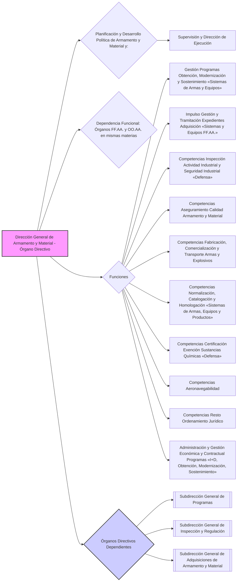

---
{"dg-publish":true,"permalink":"/z-notas/notas-bloque-1/notas-tema-4-ministerio-de-defensa/direccion-general-de-armamento-y-material/","title":"Dirección General de Armamento y Material"}
---

## Dirección General de Armamento y Material ⚔️

💡 ***Tip/Consejo:*** *Este artículo se centra en la **Dirección General de Armamento y Material**, el órgano directivo encargado de la **política de armamento y material del Ministerio de Defensa**.  Distingue sus funciones de planificación, gestión de programas, inspección y regulación en este ámbito.  Observa su dependencia funcional y las Subdirecciones Generales que la integran.*

🔑 ***Aspecto Clave: La Dirección General de Armamento y Material planifica, desarrolla y supervisa la política de armamento y material del Ministerio de Defensa, gestionando la adquisición, modernización y sostenimiento de sistemas de armas y equipos.***

1.  La **[[Z. Notas/Notas Bloque 1/Notas Tema 4. Ministerio de Defensa/Dirección General de Armamento y Material\|Dirección General de Armamento y Material]]** es un **órgano directivo** dependiente de la **[[Secretaría de Estado de Defensa\|Secretaría de Estado de Defensa]]**.

2.  Es responsable de la **planificación y desarrollo de la política de armamento y material del Departamento**, así como de la **supervisión y dirección de su ejecución.**

3.  **Dependen funcionalmente** de esta dirección general los **órganos competentes en las citadas materias de las Fuerzas Armadas y de los organismos autónomos del Departamento.**

4.  Corresponden a esta dirección general, en el ámbito de sus competencias, las siguientes **funciones**:

    * a) **Gestionar**, en colaboración con las Fuerzas Armadas, los **programas de obtención, de modernización y de sostenimiento común de los sistemas de armas y equipos** de interés para la defensa nacional.
    * b) **Impulsar la gestión y tramitación de los expedientes de adquisición** de los sistemas y equipos necesarios para las Fuerzas Armadas.
    * c) **Ejercer las competencias** en **inspección de la actividad industrial y seguridad industrial** relacionada con la Defensa, **aseguramiento de la calidad del armamento y material**, y **fabricación, comercialización y transporte de armas y explosivos.**
    * d) **Ejercer las competencias** en **normalización, catalogación y homologación** de sistemas de armas, equipos y productos, **certificación de exención de sustancias químicas**, **aeronavegabilidad**, y **resto del ordenamiento jurídico** en el ámbito de la Defensa.
    * e) **Realizar la administración y gestión económica y contractual** de los programas de I+D, obtención, modernización y sostenimiento de sistemas de armas y equipos de defensa.

5.  De esta dirección general dependen las siguientes **Subdirecciones Generales**:

    * a) **[[Subdirección General de Programas\|Subdirección General de Programas]]**:  Desarrolla las funciones de gestión de programas de obtención, modernización y sostenimiento, e impulso de expedientes de adquisición.
    * b) **[[Subdirección General de Inspección y Regulación\|Subdirección General de Inspección y Regulación]]**:  Desarrolla las funciones de inspección de actividad industrial y seguridad industrial, aseguramiento de la calidad, control de armas y explosivos, normalización, catalogación, homologación, certificación de exención de sustancias químicas y aeronavegabilidad.
    * c) **[[Subdirección General de Adquisiciones de Armamento y Material\|Subdirección General de Adquisiciones de Armamento y Material]]**:  Desarrolla las funciones de administración y gestión económica y contractual de programas de armamento y material.

