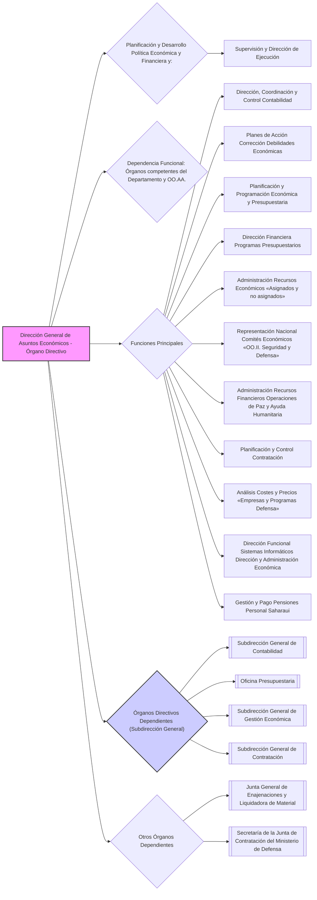

---
{"dg-publish":true,"permalink":"/z-notas/notas-bloque-1/notas-tema-4-ministerio-de-defensa/direccion-general-de-asuntos-economicos/","title":"Dirección General de Asuntos Económicos"}
---

## Dirección General de Asuntos Económicos 💰

💡 ***Tip/Consejo:*** *Este artículo describe la **Dirección General de Asuntos Económicos**, el órgano directivo clave para la **gestión económica y financiera del Ministerio de Defensa**.  Presta especial atención a sus funciones presupuestarias, contables, de contratación y su rol en la representación económica internacional del Departamento.  Analiza las Subdirecciones Generales y la Oficina Presupuestaria, y sus responsabilidades específicas.*

🔑 ***Aspecto Clave: La Dirección General de Asuntos Económicos es el órgano directivo responsable de la política económica y financiera del Ministerio de Defensa, abarcando la contabilidad, el presupuesto, la gestión económica, la contratación y la representación internacional en asuntos económicos.***

1.  La **[[Z. Notas/Notas Bloque 1/Notas Tema 4. Ministerio de Defensa/Dirección General de Asuntos Económicos\|Dirección General de Asuntos Económicos]]** es un **órgano directivo** dependiente de la **[[Secretaría de Estado de Defensa\|Secretaría de Estado de Defensa]]**.

2.  Es responsable de la **planificación y desarrollo de la política económica y financiera del Departamento**, así como de la **supervisión y dirección de su ejecución**.

3.  **Dependen funcionalmente** de esta dirección general **todos los órganos competentes en las citadas materias del Departamento y de sus organismos autónomos.**

4.  Corresponden a esta dirección general, en el ámbito de sus competencias, las siguientes **funciones**:

    * a) **Dirigir, coordinar y controlar la contabilidad del Departamento**, así como el **control de los créditos y de la ejecución del gasto.**
    * b) **Elaborar y proponer los planes de acción ministeriales** para la corrección de debilidades en la actividad económica y **realizar su seguimiento.**
    * c) **Desarrollar la planificación y la programación económica y presupuestaria** del Departamento, y **dirigir y controlar su ejecución.**
    * d) **Ejercer la dirección financiera de los programas presupuestarios y la programación económica.**
    * e) **Administrar los recursos económicos** asignados y no atribuidos expresamente a otros órganos, así como los destinados a contribuciones internacionales y organismos en el exterior.
    * f) **Ejercer la representación nacional** en comités y órganos económicos de organismos internacionales de seguridad y defensa.
    * g) **Administrar**, en coordinación con el [[Estado Mayor de la Defensa\|Estado Mayor de la Defensa]], los **recursos financieros para operaciones de paz y ayuda humanitaria.**
    * h) **Planificar y controlar la contratación** en el ámbito del Departamento.
    * i) **Implementar el análisis de costes y precios** de empresas y programas de defensa.
    * j) **Ejercer la dirección funcional** de los sistemas informáticos integrales de dirección y administración económica.
    * k) **Realizar la gestión y pago de las pensiones** del personal saharaui.

5.  De la **Dirección General de Asuntos Económicos** dependen, con **rango de subdirección general**, los siguientes **órganos directivos**:
    * a) La **[[Subdirección General de Contabilidad\|Subdirección General de Contabilidad]]**, que desarrolla las funciones de contabilidad y control del gasto.
    * b) La **[[Oficina Presupuestaria\|Oficina Presupuestaria]]**, que desarrolla las funciones de planificación y programación económica y presupuestaria.
    * c) La **[[Subdirección General de Gestión Económica\|Subdirección General de Gestión Económica]]**, que desarrolla las funciones de administración de recursos económicos, representación internacional económica y gestión de pensiones saharauis.
    * d) La **[[Subdirección General de Contratación\|Subdirección General de Contratación]]**, que desarrolla las funciones de planificación y control de la contratación y análisis de costes y precios.

6.  Asimismo, dependen de la Dirección General de Asuntos Económicos:
    * la **[[Junta General de Enajenaciones y Liquidadora de Material\|Junta General de Enajenaciones y Liquidadora de Material]]** y
    * la **[[Secretaría de la Junta de Contratación del Ministerio de Defensa\|Secretaría de la Junta de Contratación del Ministerio de Defensa]].**

