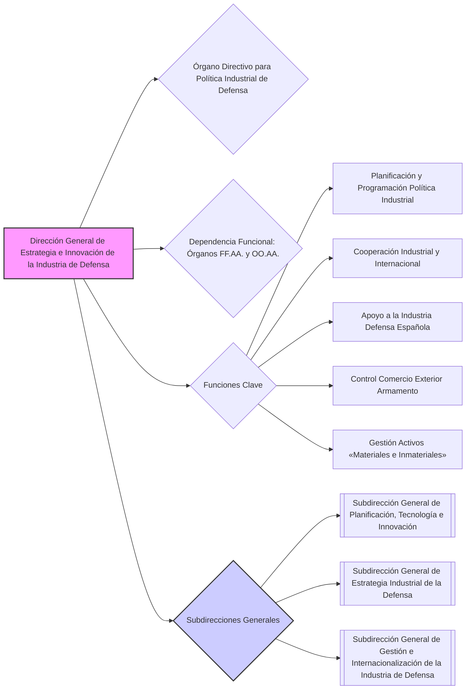

---
{"dg-publish":true,"permalink":"/z-notas/notas-bloque-1/notas-tema-4-ministerio-de-defensa/direccion-general-de-estrategia-e-innovacion-de-la-industria-de-defensa/"}
---

💡 ***Tip/Consejo:*** *Este artículo describe la **Dirección General de Estrategia e Innovación de la Industria de Defensa**, un órgano directivo **fundamental para la política industrial y tecnológica del Ministerio**.  Es clave entender su rol en la planificación, la innovación, la cooperación internacional y el control del comercio exterior en el ámbito de la defensa. Observa las Subdirecciones Generales que la componen y sus funciones.*

🔑 ***Aspecto Clave: La Dirección General de Estrategia e Innovación de la Industria de Defensa es el órgano responsable de la política industrial de defensa, la innovación tecnológica, la cooperación internacional en la industria de defensa y el control del comercio exterior de material de defensa.***

1.  La **[[Z. Notas/Notas Bloque 1/Notas Tema 4. Ministerio de Defensa/Dirección General de Estrategia e Innovación de la Industria de Defensa\|Dirección General de Estrategia e Innovación de la Industria de Defensa]]** es un **órgano directivo** dependiente de la **[[Secretaría de Estado de Defensa\|Secretaría de Estado de Defensa]]**.

2.  Es responsable de la **planificación y desarrollo de la política industrial de la Defensa**, así como de la **cooperación industrial**, la **cooperación internacional**, el **apoyo a la industria española**, el **control del comercio exterior de armamento y material**, y la gestión de **activos** derivados de la política industrial y de innovación.

3.  **Dependen funcionalmente** de esta dirección general los **órganos competentes en las citadas materias de las Fuerzas Armadas y de los organismos autónomos del Departamento.**

4.  Corresponden a esta dirección general, en el ámbito de sus competencias, las siguientes **funciones**:

    * a) **Planificación y programación** de las políticas de armamento y material y de investigación, desarrollo e innovación.
    * b) **Proposición y dirección** de planes y programas de investigación y desarrollo de sistemas de armas y equipos de interés para la defensa nacional.
    * c) **Impulso del apoyo institucional** a la internacionalización de la industria española de defensa y a la exportación.
    * d) **Ejercicio de competencias** para negociar y gestionar la cooperación industrial.
    * e) **Propuesta** de la política industrial de la Defensa.
    * f) **Control** de activos materiales e inmateriales derivados de la política industrial y de innovación.
    * g) **Impulso de la cooperación internacional** y ejercicio de la representación nacional en foros industriales y de armamento.
    * h) **Ejercicio de las competencias** en relación con el control del comercio exterior de material de defensa y de productos y tecnologías de doble uso.
    * i) **Apoyo a la exportación** de productos y tecnologías de Defensa y de doble uso.
    * j) **Control** de las transferencias de tecnología nacional a terceros países.
    * k) **Gestión de las inversiones extranjeras** en España relacionadas con la Defensa.

5.  De esta dirección general dependen las siguientes **Subdirecciones Generales**:

    * a) **[[Subdirección General de Planificación, Tecnología e Innovación\|Subdirección General de Planificación, Tecnología e Innovación]]**:  Desarrolla las funciones de planificación, programación, investigación, desarrollo e innovación, y control de activos inmateriales.
    * b) **[[Subdirección General de Estrategia Industrial de la Defensa\|Subdirección General de Estrategia Industrial de la Defensa]]**:  Desarrolla las funciones de política industrial, apoyo a la internacionalización, promoción de la enajenación y control de activos materiales.
    * c) **[[Subdirección General de Gestión e Internacionalización de la Industria de Defensa\|Subdirección General de Gestión e Internacionalización de la Industria de Defensa]]**:  Desarrolla las funciones de cooperación internacional, representación en foros, control del comercio exterior y transferencias de tecnología, gestión de inversiones extranjeras y apoyo a la exportación.

---