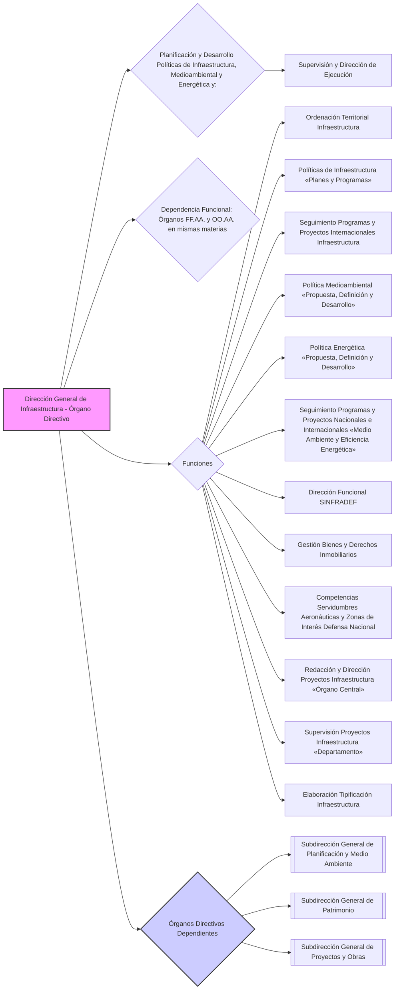

---
{"dg-publish":true,"permalink":"/z-notas/notas-bloque-1/notas-tema-4-ministerio-de-defensa/direccion-general-de-infraestructura/","title":"Dirección General de Infraestructura"}
---

💡 ***Tip/Consejo:*** *Este artículo describe la **Dirección General de Infraestructura**, un órgano directivo esencial para la **gestión del patrimonio inmobiliario, la planificación de infraestructuras y las políticas medioambiental y energética del Ministerio de Defensa**.  Es importante comprender su alcance funcional y las áreas clave que abarca.  Observa las Subdirecciones Generales y cómo se distribuyen las responsabilidades.*

🔑 ***Aspecto Clave: La Dirección General de Infraestructura es responsable de la planificación y gestión de la infraestructura, el patrimonio inmobiliario, la política medioambiental y energética del Ministerio de Defensa, asegurando su ejecución y supervisión.***

1.  La **[[Z. Notas/Notas Bloque 1/Notas Tema 4. Ministerio de Defensa/Dirección General de Infraestructura\|Dirección General de Infraestructura]]** es un **órgano directivo** dependiente de la **[[Secretaría de Estado de Defensa\|Secretaría de Estado de Defensa]]**.

2.  Es responsable de la **planificación y desarrollo de las políticas de infraestructura, medioambiental y energética del Departamento**, así como de la **supervisión y dirección de su ejecución**.

3.  **Dependen funcionalmente** de esta dirección general los **órganos competentes en las citadas materias de las Fuerzas Armadas y de los organismos autónomos del Departamento.**

4.  Corresponden a esta dirección general, en el ámbito de sus competencias, las siguientes **funciones**:

    * a) **Dirigir la ordenación territorial** de la infraestructura del Departamento.
    * b) **Proponer, definir e implementar las políticas de infraestructura** mediante planes y programas, y efectuar el seguimiento de su ejecución.
    * c) **Realizar el seguimiento de programas y proyectos internacionales** en materia de infraestructura, incluyendo los Programas de Inversiones en Seguridad de la OTAN (NSIP).
    * d) **Proponer, definir y desarrollar la política medioambiental del Departamento** y dirigir y supervisar su ejecución.
    * e) **Proponer, definir y desarrollar la política energética del Departamento** y dirigir y supervisar su ejecución.
    * f) **Participar y realizar el seguimiento de programas y proyectos nacionales e internacionales** en materia de medio ambiente y eficiencia energética.
    * g) **Ejercer la dirección funcional del sistema de información y gestión de la infraestructura en el Ministerio de Defensa (SINFRADEF).**
    * h) **Dirigir la gestión de los bienes y derechos inmobiliarios** afectos al Ministerio de Defensa y llevar su inventario, gestionando adquisiciones, expropiaciones y arrendamientos.
    * i) **Ejercer las competencias en relación con las servidumbres aeronáuticas y las zonas de interés para la defensa nacional.**
    * j) **Redactar y dirigir la ejecución de los proyectos de infraestructura del órgano central** y apoyar a los Cuarteles Generales de los Ejércitos y la Armada.
    * k) **Supervisar todos los proyectos de infraestructura del Departamento.**
    * l) **Elaborar la tipificación en materia de infraestructura.**

5.  De la **Dirección General de Infraestructura** dependen los siguientes **órganos directivos**:

    * a) La **[[Subdirección General de Planificación y Medio Ambiente\|Subdirección General de Planificación y Medio Ambiente]]**, que desarrolla las funciones de planificación, política medioambiental y energética, y seguimiento de programas internacionales.
    * b) La **[[Subdirección General de Patrimonio\|Subdirección General de Patrimonio]]**, que desarrolla las funciones de gestión de patrimonio inmobiliario, inventario, adquisiciones, expropiaciones, arrendamientos y servidumbres aeronáuticas.
    * c) La **[[Subdirección General de Proyectos y Obras\|Subdirección General de Proyectos y Obras]]**, que desarrolla las funciones de redacción y dirección de proyectos de infraestructura del órgano central, apoyo a los Cuarteles Generales, supervisión de proyectos y elaboración de tipificación.

