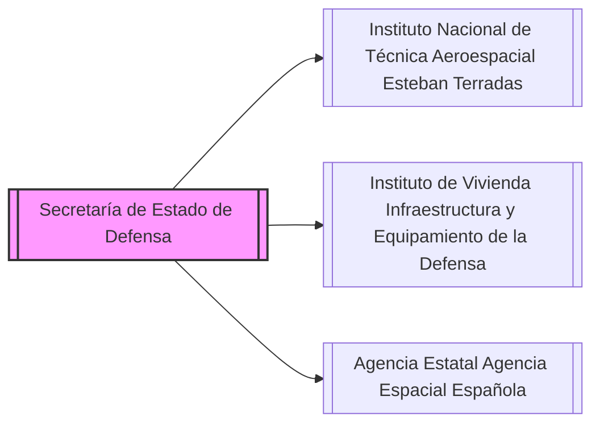

---
{"dg-publish":true,"permalink":"/z-notas/notas-bloque-1/notas-tema-4-ministerio-de-defensa/instituto-nacional-de-tecnica-aeroespacial-esteban-terradas/"}
---

## Dependencia:
Está **adscrito a la [[Secretaría de Estado de Defensa\|Secretaría de Estado de Defensa]]** del [[OpoMelilla/BLOQUE 1/Tema 4/Ministerio de Defensa\|Ministerio de Defensa]].

# Organismos Adscritos a la Secretaría de Estado de Defensa: 
* [[Z. Notas/Notas Bloque 1/Notas Tema 4. Ministerio de Defensa/Instituto Nacional de Técnica Aeroespacial «Esteban Terradas»\|Instituto Nacional de Técnica Aeroespacial «Esteban Terradas»]] 
* [[Z. Notas/Notas Bloque 1/Notas Tema 4. Ministerio de Defensa/Instituto de Vivienda, Infraestructura y Equipamiento de la Defensa\|Instituto de Vivienda, Infraestructura y Equipamiento de la Defensa]] 
* [[Z. Notas/Notas Bloque 1/Notas Tema 4. Ministerio de Defensa/Agencia Estatal Agencia Espacial Española\|Agencia Estatal Agencia Espacial Española]] 

