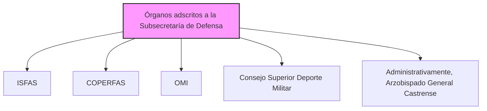

---
{"dg-publish":true,"permalink":"/z-notas/notas-bloque-1/notas-tema-4-ministerio-de-defensa/instituto-social-de-las-fuerzas-armadas/"}
---

# Los siguientes organismos están adscritos a la [[Subsecretaría de Defensa\|Subsecretaría de Defensa]]: 
* Instituto Social de las Fuerzas Armadas (ISFAS)
* Consejo de Personal de las Fuerzas Armadas (COPERFAS)
* Observatorio militar para la igualdad entre mujeres y hombres en las Fuerzas Armadas (OMI)
* Consejo Superior del Deporte Militar 
* Administrativamente, el Arzobispado General Castrense

