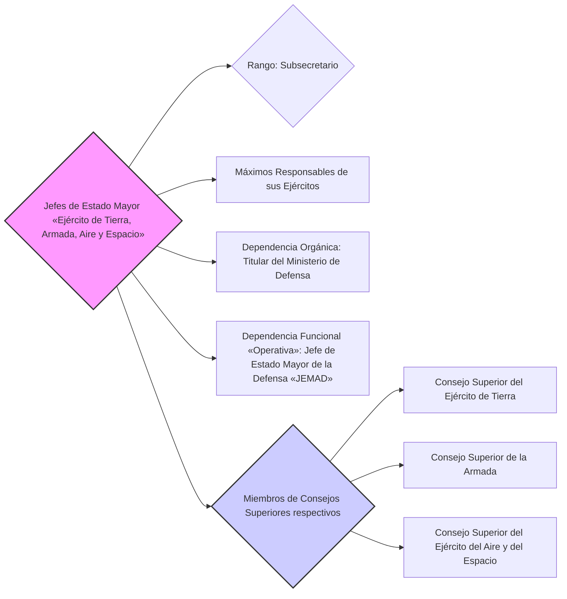

---
{"dg-publish":true,"permalink":"/z-notas/notas-bloque-1/notas-tema-4-ministerio-de-defensa/jefes-de-estado-mayor-de-los-ejercitos/","title":"Jefes de Estado Mayor del Ejército de Tierra, de la Armada y del Aire y del Espacio"}
---

## Jefes de Estado Mayor del Ejército de Tierra, de la Armada y del Aire y del Espacio 🪖

💡 ***Tip/Consejo:*** *Este artículo se centra en los **Jefes de Estado Mayor de cada Ejército**. Es crucial entender su **rango de Subsecretario** y su posición jerárquica dentro de las Fuerzas Armadas y el Ministerio de Defensa.  Observa su relación con el JEMAD y el Ministerio.*

🔑 ***Aspecto Clave: Los Jefes de Estado Mayor del Ejército de Tierra, de la Armada y del Ejército del Aire y del Espacio tienen rango de Subsecretario, subordinados al Ministro de Defensa y al JEMAD, y son los máximos responsables de sus respectivos Ejércitos.***

1.  Los **Jefes de Estado Mayor de los ejércitos**, de la **Armada** y del **Ejército del Aire y del Espacio** son los **máximos responsables de sus respectivos Ejércitos** o ramas de las Fuerzas Armadas.

2.  Tienen **rango de subsecretario**, lo que los sitúa en un alto nivel jerárquico dentro del Ministerio de Defensa, justo por debajo del Ministro, Secretario de Estado y Subsecretario de Defensa.

3.  **Dependen directamente de la [[persona titular del Ministerio de Defensa\|persona titular del Ministerio de Defensa]]** en cuanto a la **organización de sus respectivos Ejércitos**.

4.  **Dependen funcionalmente del [[Z. Notas/Notas Bloque 1/Notas Tema 4. Ministerio de Defensa/Jefe de Estado Mayor de la Defensa (JEMAD)\|Jefe de Estado Mayor de la Defensa (JEMAD)]]** en lo relativo a las **funciones operativas** de sus Ejércitos, especialmente en el contexto de **operaciones militares conjuntas.**

5.  Son **miembros del [[Z. Notas/Notas Bloque 1/Notas Tema 4. Ministerio de Defensa/Consejos Superiores del Ministerio de Defensa\|Consejo Superior del Ejército de Tierra]]**, **[[Z. Notas/Notas Bloque 1/Notas Tema 4. Ministerio de Defensa/Consejos Superiores del Ministerio de Defensa\|Consejo Superior de la Armada]]** y **[[Z. Notas/Notas Bloque 1/Notas Tema 4. Ministerio de Defensa/Consejos Superiores del Ministerio de Defensa\|Consejo Superior del Ejército del Aire y del Espacio]]** respectivamente, órganos asesores y consultivos del Ministerio.

