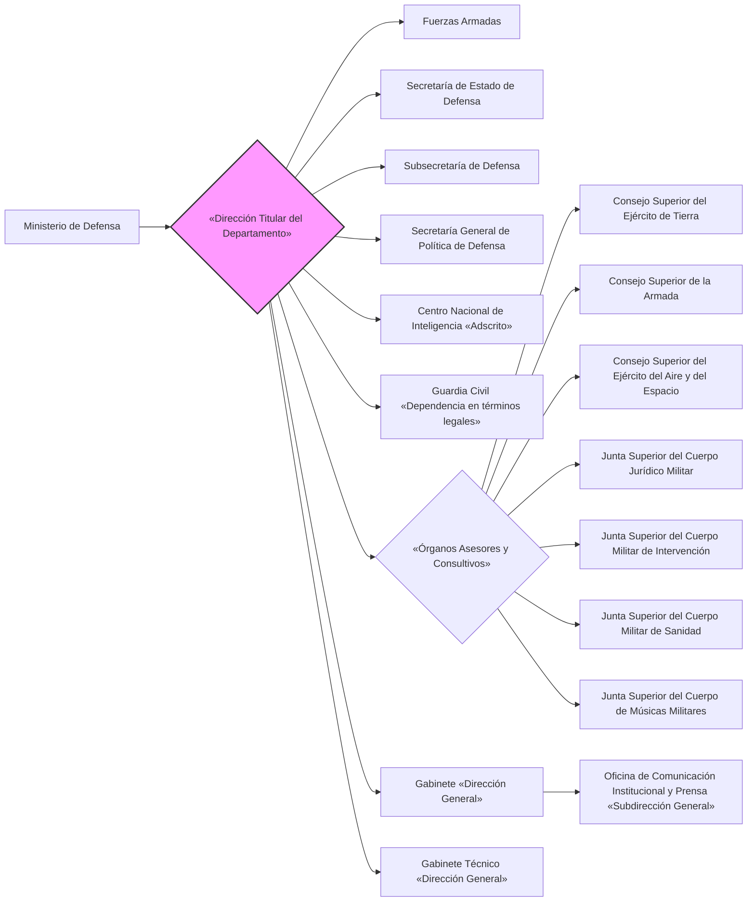

---
{"dg-publish":true,"permalink":"/z-notas/notas-bloque-1/notas-tema-4-ministerio-de-defensa/organizacion-general-del-departamento/"}
---

```mermaid
graph LR
    A[Ministerio de Defensa] --> B{«Dirección Titular del Departamento»}
    B --> C[Fuerzas Armadas]
    B --> D[Secretaría de Estado de Defensa]
    B --> E[Subsecretaría de Defensa]
    B --> F[Secretaría General de Política de Defensa]
    B --> G[Centro Nacional de Inteligencia «Adscrito»]
    B --> H[Guardia Civil «Dependencia en términos legales»]
    B --> I{«Órganos Asesores y Consultivos»}
    I --> I1[Consejo Superior del Ejército de Tierra]
    I --> I2[Consejo Superior de la Armada]
    I --> I3[Consejo Superior del Ejército del Aire y del Espacio]
    I --> I4[Junta Superior del Cuerpo Jurídico Militar]
    I --> I5[Junta Superior del Cuerpo Militar de Intervención]
    I --> I6[Junta Superior del Cuerpo Militar de Sanidad]
    I --> I7[Junta Superior del Cuerpo de Músicas Militares]
    B --> J[Gabinete «Dirección General»]
    B --> K[Gabinete Técnico «Dirección General»]
    J --> L[Oficina de Comunicación Institucional y Prensa «Subdirección General»]
    style B fill:#f9f,stroke:#333,stroke-width:2px
```
