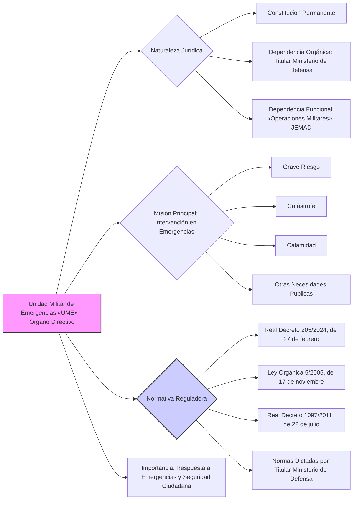

---
{"dg-publish":true,"permalink":"/z-notas/notas-bloque-1/notas-tema-4-ministerio-de-defensa/unidad-militar-de-emergencias-ume/"}
---

## Unidad Militar de Emergencias (UME) 🚒

### Naturaleza Jurídica y Dependencia 🏛️

La **[[Z. Notas/Notas Bloque 1/Notas Tema 4. Ministerio de Defensa/Unidad Militar de Emergencias (UME)\|Unidad Militar de Emergencias (UME)]]** es una unidad de las **[[Fuerzas Armadas\|Fuerzas Armadas]]** con las siguientes características:

*   **Constitución Permanente:**  Está constituida de **forma permanente**, no es una unidad de carácter temporal o creada para una misión específica.
*   **Dependencia Orgánica:**  Depende **orgánicamente de la persona titular del Ministerio de Defensa**. Esto significa que, en términos administrativos y de organización general, la UME responde directamente ante el Ministro/a.
*   **Dependencia Funcional (Operativa):** Sin perjuicio de lo anterior, el **[[Jefe del Estado Mayor de la Defensa (JEMAD)\|Jefe del Estado Mayor de la Defensa (JEMAD)]]** ejerce **competencias funcionales** sobre la UME en los supuestos de **conducción de operaciones militares** que contribuyan a la seguridad y defensa de España y de sus aliados. Esta doble dependencia permite que la UME actúe tanto en el ámbito civil de emergencias como en el militar, según se requiera.

### Misión Principal: Intervención en Emergencias 🎯

La **misión principal** de la UME es la **intervención en cualquier lugar del territorio nacional y en el exterior**, para **contribuir a la seguridad y bienestar de los ciudadanos** en los supuestos de:

*   **grave riesgo,**
*   **catástrofe,**
*   **calamidad**
*   **u otras necesidades públicas.**

Esta intervención se realiza con arreglo a lo dispuesto en el **[[Real Decreto 1097/2011, de 22 de julio, por el que se aprueba el Protocolo de Intervención de la Unidad Militar de Emergencias\|Real Decreto 1097/2011, de 22 de julio, por el que se aprueba el Protocolo de Intervención de la Unidad Militar de Emergencias]]**.

### Normativa Reguladora 📜

La organización y funcionamiento de la UME se rigen principalmente por:

*   **[[Real Decreto 205/2024, de 27 de febrero\|Real Decreto 205/2024, de 27 de febrero]]** (Artículo 2).
*   **[[Ley Orgánica 5/2005, de 17 de noviembre, de la Defensa Nacional\|Ley Orgánica 5/2005, de 17 de noviembre, de la Defensa Nacional]]**.
*   **[[Real Decreto 1097/2011, de 22 de julio, por el que se aprueba el Protocolo de Intervención de la Unidad Militar de Emergencias\|Real Decreto 1097/2011, de 22 de julio, por el que se aprueba el Protocolo de Intervención de la Unidad Militar de Emergencias]]**.
*   **Normas específicas** dictadas por la persona titular del Ministerio de Defensa para regular la organización y el funcionamiento de la UME en el ámbito del Departamento.

### Organización y Funcionamiento ⚙️

La **persona titular del Departamento** (Ministro/a de Defensa) es quien dicta las **normas que regulen la organización y el funcionamiento de la UME** dentro del Ministerio.  El **[[Jefe del Estado Mayor de la Defensa (JEMAD)\|Jefe del Estado Mayor de la Defensa (JEMAD)]]** ejerce **competencias operativas** sobre la UME en el contexto de operaciones militares.

### Importancia y Relevancia 💡

La UME es una **pieza clave del sistema de respuesta a emergencias en España**, siendo la **única unidad militar** dedicada específicamente a esta misión de forma permanente.  Su relevancia se basa en:

*   **Capacidad de Respuesta Rápida:**  La UME está diseñada para **intervenir con rapidez** en situaciones de emergencia en cualquier punto del territorio.
*   **Capacidades Militares:**  Aporta **capacidades y medios militares** que son esenciales en situaciones de crisis, donde se requiere una alta capacidad logística, de movilidad y de actuación en entornos complejos.
*   **Contribución a la Seguridad Ciudadana:**  Su misión se centra en **proteger y asistir a los ciudadanos** en situaciones de grave riesgo, contribuyendo al bienestar general de la sociedad.
*   **Doble Dependencia (Civil y Militar):**  Su **doble dependencia** le permite actuar tanto en **situaciones de emergencia civil** bajo la dirección del Ministerio, como en **operaciones militares** bajo el mando del JEMAD, lo que le confiere una gran **versatilidad y capacidad de adaptación**.

**En resumen, la Unidad Militar de Emergencias (UME) es un órgano directivo fundamental dentro de las Fuerzas Armadas y del Ministerio de Defensa, con una misión esencial de protección civil y respuesta a emergencias, combinando capacidades militares con un enfoque de servicio público y bienestar ciudadano.**

