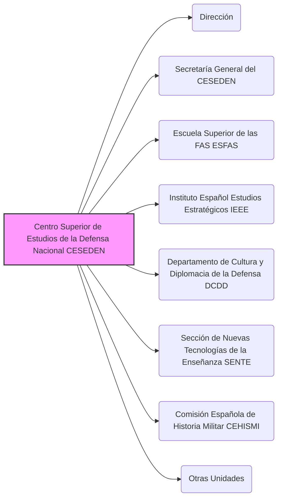

---
{"dg-publish":true,"permalink":"/z-notas/notas-bloque-1/notas-tema-6-emad/ceseden/"}
---

# Centro Superior de Estudios de la Defensa Nacional (CESEDEN)

El **Centro Superior de Estudios de la Defensa Nacional (CESEDEN)** es uno de los **componentes principales del [[Z. Notas/Notas Bloque 1/Notas Tema 6. EMAD/EMAD\|Estado Mayor de la Defensa]]**, y se describe en el [[Artículo 10. El Centro Superior de Estudios de la Defensa Nacional\|Artículo 10]] de la [[Orden DEF/710/2020, de 27 de julio\|Orden DEF/710/2020]].

**Rol y Función Principal del CESEDEN:**

El CESEDEN es el **principal centro docente militar conjunto de las Fuerzas Armadas (FAS) de España**. Su función primordial es la **enseñanza de *altos estudios de la defensa nacional*** y la **investigación en temas relacionados con la seguridad y la defensa**.  Además, tiene un papel importante en la **difusión de la Cultura de Seguridad y Defensa** en la sociedad española.

En esencia, el CESEDEN es el **centro de referencia para la formación de los *más altos mandos* militares y civiles** en materia de defensa, y un **think tank** en temas estratégicos de seguridad y defensa.  Contribuye tanto a la **formación de líderes** como a la **generación de conocimiento** en el ámbito de la defensa nacional.

**Responsabilidades Clave del CESEDEN (según el Artículo 10 de la Orden DEF/710/2020):**

*   **Impartir Altos Estudios de la Defensa Nacional:**  Ofrece **cursos de Altos Estudios de la Defensa Nacional (AEDN)**, que son la máxima formación militar conjunta para el **desempeño de cometidos de oficial general** y para **altos cargos civiles** relacionados con la defensa.
*   **Estudios de Posgrado y Estudios Militares Conjuntos:**  Imparte otros estudios conducentes a la **obtención de títulos de posgrado**, así como **estudios militares de carácter conjunto** que se determinen.
*   **Fomentar la Cooperación y Colaboración:**  Promueve la **cooperación con otros ámbitos de la Administración** y establece **colaboraciones con universidades, centros universitarios de la defensa y otras instituciones** públicas y privadas, mediante convenios.
*   **Investigación en Seguridad y Defensa:**  Desarrolla **tareas de investigación** sobre temas relacionados con la **Seguridad y Defensa**, contribuyendo al análisis estratégico y a la generación de conocimiento en este ámbito.
*   **Fomento y Difusión de la Cultura de Seguridad y Defensa:**  Contribuye al **fomento y difusión de la Cultura de Seguridad y Defensa** en la sociedad española,  promoviendo la conciencia y el conocimiento sobre temas de defensa y seguridad.
*   **Estudios e Investigaciones en Historia Militar:**  Promueve y desarrolla **estudios, investigaciones y otras actividades relacionadas con la historia militar**.
*   **Enseñanza de Perfeccionamiento en Ciberoperaciones (EMCO):**  Funcionalmente, el [[MCCE\|Mando Conjunto del Ciberespacio]] – a través de la [[Z. Notas/Notas Bloque 1/Notas Tema 6. EMAD/CESEDEN#EMCO\|Escuela Militar de Ciberoperaciones (EMCO)]] – depende del CESEDEN para aspectos relacionados con la aprobación de perfiles de ingreso y egreso, currículos y convocatorias de cursos conjuntos de perfeccionamiento en ciberoperaciones.

**Estructura del CESEDEN (Componentes Principales - Artículo 10.4):**

El CESEDEN se articula en los siguientes órganos principales:

*   Dirección (liderada por el Director del CESEDEN)
*   Secretaría General del CESEDEN
*   [[Z. Notas/Notas Bloque 1/Notas Tema 6. EMAD/CESEDEN#ESFAS\|Escuela Superior de las Fuerzas Armadas (ESFAS)]]
*   [[Z. Notas/Notas Bloque 1/Notas Tema 6. EMAD/CESEDEN#IEEE\|Instituto Español de Estudios Estratégicos (IEEE)]]
*   [[Z. Notas/Notas Bloque 1/Notas Tema 6. EMAD/CESEDEN#DCDD\|Departamento de Cultura y Diplomacia de la Defensa (DCDD)]]
*   [[Z. Notas/Notas Bloque 1/Notas Tema 6. EMAD/CESEDEN#SENTE\|Sección de Nuevas Tecnologías de la Enseñanza (SENTE)]]
*   [[Z. Notas/Notas Bloque 1/Notas Tema 6. EMAD/CESEDEN#CEHISMI\|Comisión Española de Historia Militar (CEHISMI)]]
*   Otras unidades que se determinen.

**(Secciones detalladas más abajo)**

**Dependencias Funcionales:**

En el desempeño de sus actividades, el CESEDEN tiene dependencias funcionales específicas:

*   **Subsecretaría de Defensa:**  Dependencia funcional para los **asuntos relacionados con la enseñanza militar**.
*   **Secretaría General de Política de Defensa:** Dependencia funcional para los **asuntos relacionados con la difusión de la cultura de seguridad y defensa**.

**Importancia del CESEDEN:**

El CESEDEN es una **institución clave para el futuro de la Defensa Nacional**.  Su labor en la **formación de líderes** en defensa, la **investigación estratégica** y la **difusión de la cultura de defensa** contribuye de manera fundamental a:

*   **Desarrollar el pensamiento estratégico:**  Fomentar la capacidad de análisis y planificación estratégica en los altos mandos militares y civiles.
*   **Promover la innovación en defensa:**  Impulsar la investigación y el desarrollo de nuevas ideas y conceptos en materia de seguridad y defensa.
*   **Fortalecer la conexión entre Defensa y Sociedad:**  Acercar los temas de defensa a la sociedad civil y promover una cultura de seguridad y defensa informada y participativa.
*   **Elevar el nivel de la enseñanza militar conjunta:**  Asegurar la excelencia de la formación militar conjunta de alto nivel en España.

**Referencia Legal Principal:**

*   [[Orden DEF/710/2020, de 27 de julio\|Orden DEF/710/2020]], Artículo 10 (El Centro Superior de Estudios de la Defensa Nacional)
*   [[Ley 39/2007, de 19 de noviembre, de la carrera militar\|Ley 39/2007, de 19 de noviembre, de la carrera militar]] (menciona los cursos y títulos impartidos por la ESFAS, componente del CESEDEN)
*   [[Real Decreto 521/2020, de 19 de mayo\|Real Decreto 521/2020, de 19 de mayo]] (marco general de la organización de las Fuerzas Armadas)

---

### Componentes Principales del CESEDEN (Detalle):

#### Escuela Superior de las Fuerzas Armadas (ESFAS) [[Z. Notas/Notas Bloque 1/Notas Tema 6. EMAD/CESEDEN#ESFAS\|#ESFAS]]

*   **Centro docente militar de Altos Estudios de la Defensa Nacional.**
*   Imparte cursos de actualización para oficial general, Diploma de Estado Mayor, cursos de alta gestión de las FAS y otros cursos conjuntos y títulos de la carrera militar.
*   Planea y coordina cursos conjuntos que se desarrollen en otros centros docentes.

#### Instituto Español de Estudios Estratégicos (IEEE) [[Z. Notas/Notas Bloque 1/Notas Tema 6. EMAD/CESEDEN#IEEE\|#IEEE]]

*   Responsable de **investigar y analizar asuntos relacionados con la seguridad y defensa**.
*   Contribuye a la promoción y difusión de la Cultura de Seguridad y Defensa.

#### Departamento de Cultura y Diplomacia de la Defensa (DCDD) [[Z. Notas/Notas Bloque 1/Notas Tema 6. EMAD/CESEDEN#DCDD\|#DCDD]]

*   Responsable de impartir **cursos de Defensa Nacional** y otras actividades de difusión de la Cultura de Seguridad y Defensa.
*   Contribuye a la Diplomacia de Defensa impartiendo cursos internacionales.

#### Sección de Nuevas Tecnologías de la Enseñanza (SENTE) [[Z. Notas/Notas Bloque 1/Notas Tema 6. EMAD/CESEDEN#SENTE\|#SENTE]]

*   Impulsa el desarrollo e implantación de **procesos y tecnologías innovadoras** para la enseñanza militar.

#### Comisión Española de Historia Militar (CEHISMI) [[Z. Notas/Notas Bloque 1/Notas Tema 6. EMAD/CESEDEN#CEHISMI\|#CEHISMI]]

*   Órgano colegiado que promueve actividades relacionadas con la Historia Militar que afecten a más de un Ejército, la Armada y la Guardia Civil.
*   Ejerce la representación nacional en organismos internacionales de historia militar.
