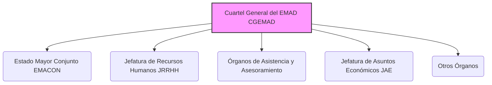

---
{"dg-publish":true,"permalink":"/z-notas/notas-bloque-1/notas-tema-6-emad/cgemad/"}
---

# Cuartel General del Estado Mayor de la Defensa (CGEMAD)

El **Cuartel General del Estado Mayor de la Defensa (CGEMAD)** es uno de los **componentes principales del [[Z. Notas/Notas Bloque 1/Notas Tema 6. EMAD/EMAD\|Estado Mayor de la Defensa]]**, y se define en el [[Artículo 2. Organización del Cuartel General del Estado Mayor de la Defensa\|Artículo 2]] de la [[Orden DEF/710/2020, de 27 de julio\|Orden DEF/710/2020]].

**Rol y Función Principal del CGEMAD:**

La función primordial del CGEMAD es **prestar apoyo y asesoramiento al [[Z. Notas/Notas Bloque 1/Notas Tema 6. EMAD/JEMAD\|Jefe de Estado Mayor de la Defensa]]** en el ejercicio de todas sus competencias.  Actúa como el **órgano de apoyo central** que permite al JEMAD llevar a cabo sus complejas responsabilidades de mando y dirección de las operaciones conjuntas y la eficacia operativa de las Fuerzas Armadas.

En esencia, el CGEMAD es la **estructura organizativa que asiste directamente al JEMAD**,  proporcionándole los medios y el personal necesarios para el planeamiento, la gestión de recursos, el asesoramiento especializado y la coordinación general dentro del EMAD.

**Estructura del CGEMAD (Componentes Principales - Artículo 2.2):**

El CGEMAD se integra por los siguientes órganos principales:

*   [[Z. Notas/Notas Bloque 1/Notas Tema 6. EMAD/EMACON\|Estado Mayor Conjunto de la Defensa (EMACON)]]
*   [[Z. Notas/Notas Bloque 1/Notas Tema 6. EMAD/JRRHH\|Jefatura de Recursos Humanos (JRRHH)]]
*   [[Z. Notas/Notas Bloque 1/Notas Tema 6. EMAD/Órganos de Asistencia y Asesoramiento\|Órganos de Asistencia y Asesoramiento]] (que incluyen el Gabinete del JEMAD, GABTECJEMAD, SEPERCJEM y Asesoría Jurídica)
*   [[Z. Notas/Notas Bloque 1/Notas Tema 6. EMAD/JAE\|Jefatura de Asuntos Económicos (JAE)]]
*   Otros órganos que se determinen en el futuro.

**Componentes Clave del CGEMAD (Descripción Breve):**

*   **[[Z. Notas/Notas Bloque 1/Notas Tema 6. EMAD/EMACON\|Estado Mayor Conjunto de la Defensa (EMACON)]]:**  Es el **órgano auxiliar de mando principal** del JEMAD dentro del CGEMAD.  Apoya y asesora al JEMAD en la **estrategia militar, planeamiento, conducción de operaciones y eficacia operativa** de las FAS.  Actúa como el **coordinador central** de las actividades del EMAD.
*   **[[Z. Notas/Notas Bloque 1/Notas Tema 6. EMAD/JRRHH\|Jefatura de Recursos Humanos (JRRHH)]]:**  Responsable del **planeamiento y gestión del personal** militar y civil dependiente del JEMAD.  Proporciona **apoyo administrativo y logístico** al personal del EMAD y asesora al JEMAD en temas de recursos humanos y enseñanza.
*   **[[Z. Notas/Notas Bloque 1/Notas Tema 6. EMAD/Órganos de Asistencia y Asesoramiento\|Órganos de Asistencia y Asesoramiento]]:**  Conjunto de órganos de **apoyo directo e inmediato al JEMAD**, incluyendo su Gabinete personal, el Gabinete Técnico (para información pública y protocolo), la Secretaría Permanente del Consejo de Jefes de Estado Mayor (SEPERCJEM) y la Asesoría Jurídica del EMAD.  Proporcionan **asesoramiento especializado y apoyo en diversas áreas**.
*   **[[Z. Notas/Notas Bloque 1/Notas Tema 6. EMAD/JAE\|Jefatura de Asuntos Económicos (JAE)]]:**  Responsable de la **gestión económica y financiera** de los recursos bajo dependencia del JEMAD.  Asesora al JEMAD en materia económica y se encarga de asuntos presupuestarios, contratación y contabilidad.

**Intervención Delegada del EMAD:**

Además de los componentes principales listados, la **Intervención Delegada del EMAD** forma parte del CGEMAD como **Órgano de Control Económico y Financiero**.  Aunque depende orgánica y funcionalmente de la Intervención General de la Defensa,  desempeña una función crucial de **control interno de la gestión económico-financiera** dentro del EMAD, así como de Notaría Militar y asesoramiento económico-fiscal.

**Importancia del CGEMAD:**

El CGEMAD es el **núcleo central de apoyo** del [[Z. Notas/Notas Bloque 1/Notas Tema 6. EMAD/JEMAD\|JEMAD]] y, por lo tanto, **fundamental para el funcionamiento efectivo del [[Z. Notas/Notas Bloque 1/Notas Tema 6. EMAD/EMAD\|Estado Mayor de la Defensa]]**.  Sin el CGEMAD, el JEMAD no podría ejercer eficazmente sus complejas responsabilidades de mando, planeamiento y dirección de las operaciones militares conjuntas y el aseguramiento de la eficacia operativa de las FAS.  Es el **pilar administrativo, de asesoramiento y de gestión** sobre el que se sustenta el liderazgo del JEMAD.

**Referencia Legal Principal:**

*   [[Orden DEF/710/2020, de 27 de julio\|Orden DEF/710/2020]], Artículo 2 (Organización del Cuartel General del Estado Mayor de la Defensa)
*   [[Real Decreto 521/2020, de 19 de mayo\|Real Decreto 521/2020, de 19 de mayo]] (marco general de la organización de las Fuerzas Armadas)
