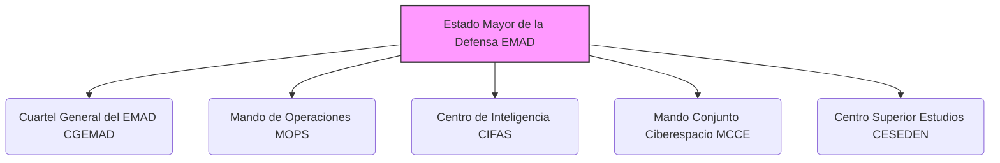

---
{"dg-publish":true,"permalink":"/z-notas/notas-bloque-1/notas-tema-6-emad/emad/"}
---

# Estado Mayor de la Defensa (EMAD)

El **Estado Mayor de la Defensa (EMAD)** es el **órgano principal de apoyo al Jefe de Estado Mayor de la Defensa (JEMAD)**.  Su función principal es asistir al JEMAD en el ejercicio de sus responsabilidades y competencias, asegurando la eficacia operativa conjunta de las Fuerzas Armadas (FAS).

**Funciones Clave del EMAD:**

*   **Apoyo y Asesoramiento al JEMAD:**  El EMAD es responsable de prestar apoyo y asesoramiento al JEMAD en todas sus áreas de competencia.
*   **Estructura Operativa Conjunta:**  El EMAD es el mando superior de la estructura operativa conjunta de las FAS, dirigiendo las operaciones militares que se determinen.
*   **Inteligencia Militar:**  Integra el Centro de Inteligencia de las Fuerzas Armadas (CIFAS), proporcionando inteligencia estratégica y operativa.
*   **Ciberdefensa:**  Incluye el Mando Conjunto del Ciberespacio (MCCE), encargado de la ciberdefensa y las operaciones en el ciberespacio.
*   **Enseñanza Conjunta de Alto Nivel:**  Integra el Centro Superior de Estudios de la Defensa Nacional (CESEDEN), el principal centro de enseñanza militar conjunta para altos mandos.

**Estructura del EMAD (según el Artículo 1 de la Orden DEF/710/2020):**

El EMAD se estructura en los siguientes componentes principales:

*   [[Z. Notas/Notas Bloque 1/Notas Tema 6. EMAD/CGEMAD\|Cuartel General del Estado Mayor de la Defensa (CGEMAD)]]
*   [[Z. Notas/Notas Bloque 1/Notas Tema 6. EMAD/MOPS\|Mando de Operaciones (MOPS)]]
*   [[Z. Notas/Notas Bloque 1/Notas Tema 6. EMAD/CIFAS\|Centro de Inteligencia de las Fuerzas Armadas (CIFAS)]]
*   [[Z. Notas/Notas Bloque 1/Notas Tema 6. EMAD/Mando Conjunto del Ciberespacio (MCCE)\|Mando Conjunto del Ciberespacio (MCCE)]]
*   [[Z. Notas/Notas Bloque 1/Notas Tema 6. EMAD/CESEDEN\|Centro Superior de Estudios de la Defensa Nacional (CESEDEN)]]

Además, dependen directamente del JEMAD las [[Z. Notas/Notas Bloque 1/Notas Tema 6. EMAD/Organizaciones Operativas#Mandos Operativos permanentes\|Organizaciones Operativas Permanentes]] y los [[Z. Notas/Notas Bloque 1/Notas Tema 6. EMAD/Organizaciones Operativas#Órganos Nacionales Militares OOII/Multinacionales\|Órganos Nacionales Militares relacionados con OOII/Multinacionales]].

**Importancia:**

El EMAD es fundamental para la **coordinación y eficacia conjunta de las FAS**.  Permite al JEMAD ejercer el mando unificado de las operaciones militares y asegurar que las capacidades de los diferentes Ejércitos y la Armada se integren de manera efectiva para la defensa nacional.

**Referencia Legal Principal:**

*   [[Orden DEF/710/2020, de 27 de julio\|Orden DEF/710/2020]] (desarrollo de la organización básica del EMAD)
*   [[Real Decreto 521/2020, de 19 de mayo\|Real Decreto 521/2020, de 19 de mayo]] (establece la organización básica de las Fuerzas Armadas)
*   [[Ley Orgánica 5/2005, de 17 de noviembre, de la Defensa Nacional (LODN)\|Ley Orgánica 5/2005, de 17 de noviembre, de la Defensa Nacional (LODN)]]
