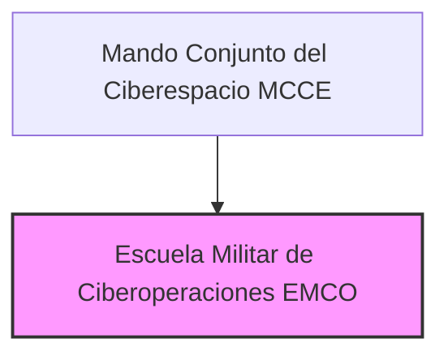

---
{"dg-publish":true,"permalink":"/z-notas/notas-bloque-1/notas-tema-6-emad/emco/"}
---

# Escuela Militar de Ciberoperaciones (EMCO)

La **Escuela Militar de Ciberoperaciones (EMCO)** es un **componente especializado del [[MCCE\|Mando Conjunto del Ciberespacio]]**,  y se menciona en el [[Artículo 9. El Mando Conjunto del Ciberespacio\|Artículo 9.8]] de la [[Orden DEF/710/2020, de 27 de julio\|Orden DEF/710/2020]].

**Rol y Función Principal de la EMCO:**

La función principal de la EMCO es **impartir *enseñanzas de perfeccionamiento* en el ámbito de las *ciberoperaciones* y otras áreas relacionadas con la *ciberdefensa*** para el personal de las Fuerzas Armadas (FAS) de España.  Es el **centro de *formación especializada* en el dominio cibernético** dentro del [[MCCE\|MCCE]] y, por extensión, del [[Z. Notas/Notas Bloque 1/Notas Tema 6. EMAD/EMAD\|EMAD]].

En esencia, la EMCO es responsable de **capacitar y *adiestrar* a los *operadores cibernéticos* y *especialistas en ciberdefensa* de las FAS**,  proporcionándoles los conocimientos, habilidades y competencias necesarias para llevar a cabo operaciones militares en el ciberespacio y proteger los activos e intereses nacionales en este dominio.

**Responsabilidades Clave de la EMCO (según el Artículo 9.8 de la Orden DEF/710/2020):**

*   **Enseñanzas de Perfeccionamiento en Ciberoperaciones:**  Imparte **cursos de *perfeccionamiento*** (formación avanzada) en el ámbito de las **ciberoperaciones**,  cubriendo un amplio espectro de temas relacionados con las operaciones militares en el ciberespacio (ciberdefensa activa, ciberinteligencia, ciberataque, etc.).
*   **Otras Enseñanzas Relacionadas con la Ciberdefensa:**  Imparte **otras enseñanzas que se determinen** relacionadas con la **ciberdefensa**,  ampliando su oferta formativa para cubrir las diversas necesidades de capacitación en el ámbito cibernético militar.
*   **Dependencia Funcional del CESEDEN (para cursos conjuntos de perfeccionamiento):**  Para aquellos **cursos conjuntos de perfeccionamiento** que formen parte de las enseñanzas a impartir en la EMCO,  depende **funcionalmente del [[Z. Notas/Notas Bloque 1/Notas Tema 6. EMAD/CESEDEN\|Centro Superior de Estudios de la Defensa Nacional]]** en aspectos como:
    *   Aprobación de los **perfiles de ingreso y egreso** de los alumnos.
    *   Aprobación de los **currículos** o planes de estudio de los cursos.
    *   Aprobación de las **convocatorias** de los cursos.

**Estructura de la EMCO:**

La Orden DEF/710/2020 no detalla la estructura interna de la EMCO.  Como **escuela militar**,  es probable que se articule en:

*   **Dirección/Jefatura de la EMCO:**  Responsable de la dirección y gestión general de la escuela.
*   **Departamentos o Áreas de Enseñanza:**  Organizados por áreas temáticas o especialidades dentro de las ciberoperaciones y la ciberdefensa (ciberdefensa activa, ciberinteligencia, ciberseguridad ofensiva, etc.).
*   **Sección de Apoyo:**  Para la gestión administrativa, logística y de recursos de la escuela.
*   **Profesorado e Instructores:**  Personal militar y civil especializado en ciberoperaciones y ciberdefensa, encargado de impartir la enseñanza.
*   **Alumnos:**  Personal militar de las FAS que realiza los cursos de la EMCO.

**(Organigrama simplificado de la EMCO dentro del MCCE)**

**Relación con el CESEDEN y el MCCE:**

*   **Dependencia Funcional del CESEDEN (para cursos conjuntos de perfeccionamiento):**  Como se ha mencionado, la EMCO tiene una **dependencia funcional del [[Z. Notas/Notas Bloque 1/Notas Tema 6. EMAD/CESEDEN\|Centro Superior de Estudios de la Defensa Nacional]]** para garantizar la calidad y la homologación de los cursos de perfeccionamiento conjunto en ciberoperaciones.  Esto asegura que la formación impartida en la EMCO se alinee con los estándares y criterios de la enseñanza militar conjunta de más alto nivel.
*   **Dependencia Operativa del MCCE:**  La EMCO depende **operativamente del [[MCCE\|Mando Conjunto del Ciberespacio]]**.  Esto significa que la EMCO está integrada dentro de la estructura del MCCE y responde ante el Comandante del MCCE en lo relativo a su funcionamiento, programación de cursos y cumplimiento de sus objetivos de formación.  La EMCO forma parte integral del MCCE y contribuye directamente a su misión de asegurar la libertad de acción en el ciberespacio.

**Importancia de la EMCO:**

La EMCO es **esencial para el desarrollo y la sostenibilidad de la *capacidad cibernética militar* de España**.  En un dominio tan **técnico y en constante evolución** como el ciberespacio,  la **formación especializada y *continuada* del personal** es absolutamente crucial.  La EMCO garantiza que las FAS dispongan de **operadores cibernéticos *altamente cualificados* y *actualizados***,  capaces de hacer frente a las crecientes amenazas y desafíos en el ciberespacio.  Es un **elemento clave para la *ventaja tecnológica* y la *eficacia operativa* de las FAS en el dominio cibernético**.
