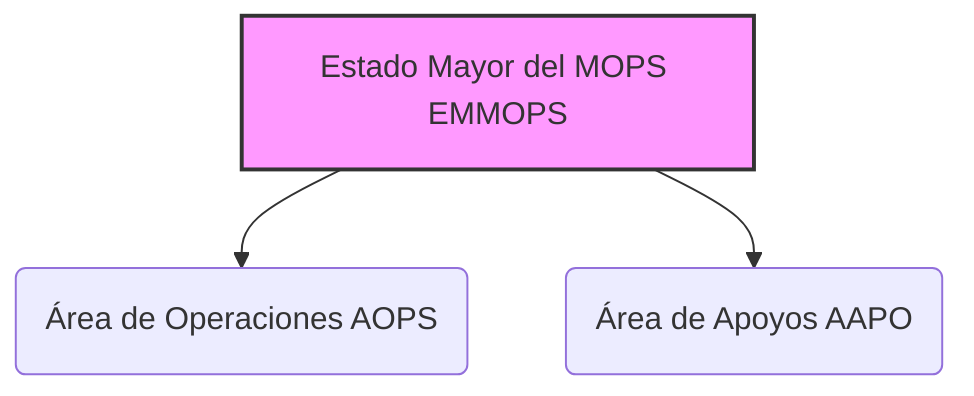

---
{"dg-publish":true,"permalink":"/z-notas/notas-bloque-1/notas-tema-6-emad/emmops/"}
---

# Estado Mayor del Mando de Operaciones (EMMOPS)

El **Estado Mayor del Mando de Operaciones (EMMOPS)** es un **componente esencial del [[Z. Notas/Notas Bloque 1/Notas Tema 6. EMAD/MOPS\|Mando de Operaciones]]**,  y se menciona en el [[Artículo 7. El Mando de Operaciones\|Artículo 7.3]] de la [[Orden DEF/710/2020, de 27 de julio\|Orden DEF/710/2020]].

**Rol y Función Principal del EMMOPS:**

El EMMOPS es el **principal *órgano auxiliar de mando* del [[Z. Notas/Notas Bloque 1/Notas Tema 6. EMAD/EMMOPS#CMOPS\|Comandante del Mando de Operaciones (CMOPS)]]**.  Su función primordial es **asistir al CMOPS** en la **planificación, coordinación y control general de las actividades relacionadas con el planeamiento, seguimiento y conducción de las operaciones militares en el *nivel operacional***.

En esencia, el EMMOPS es el **núcleo de *planeamiento operacional* y *gestión de operaciones* dentro del [[Z. Notas/Notas Bloque 1/Notas Tema 6. EMAD/MOPS\|MOPS]]**,  proporcionando al CMOPS el *staff* necesario para dirigir eficazmente las operaciones militares que se le encomienden.  Es el **motor de la actividad operativa del MOPS**.

**Responsabilidades Clave del EMMOPS (según el Artículo 7.3 de la Orden DEF/710/2020):**

*   **Planificación Operacional:**  Responsable de la **planificación** detallada de las operaciones militares en el nivel operacional,  desarrollando los planes operativos y las órdenes necesarias para la ejecución de las misiones.
*   **Coordinación Operacional:**  Asegura la **coordinación** entre los diferentes componentes y fuerzas participantes en las operaciones militares,  garantizando la sincronización de esfuerzos y la interoperabilidad.
*   **Control Operacional:**  Ejerce el **control** de las operaciones en curso,  monitorizando su desarrollo, evaluando el cumplimiento de los planes y directrices, y proponiendo ajustes o modificaciones según sea necesario.
*   **Seguimiento de Operaciones:**  Realiza un **seguimiento continuo** de la situación operacional,  manteniendo al [[Z. Notas/Notas Bloque 1/Notas Tema 6. EMAD/EMMOPS#CMOPS\|Comandante del MOPS]] informado sobre el progreso de las operaciones y los acontecimientos relevantes.
*   **Auxiliar de Mando del CMOPS:**  En general, actúa como el **principal *staff* o estado mayor del [[Z. Notas/Notas Bloque 1/Notas Tema 6. EMAD/EMMOPS#CMOPS\|Comandante del MOPS]]**,  asistiéndole en todas las tareas de mando y dirección de las operaciones militares en el nivel operacional.

**Estructura del EMMOPS (Componentes Principales - Artículo 7.3):**

El Artículo 7.3 de la Orden DEF/710/2020 menciona que el EMMOPS contará con dos áreas principales:

*   **Área de Operaciones (AOPS)**
*   **Área de Apoyos (AAPO)**

**(Organigrama simplificado del EMMOPS - basado en la información de la Orden)**

**Relación con el Comandante del MOPS (CMOPS):**

El EMMOPS está **directamente subordinado al [[Z. Notas/Notas Bloque 1/Notas Tema 6. EMAD/EMMOPS#CMOPS\|Comandante del MOPS]]**,  actuando como su principal órgano auxiliar de mando.  El **Jefe del Estado Mayor del MOPS** es, a su vez, el **Segundo Comandante del MOPS**,  lo que subraya la estrecha relación y la función de *segundo al mando* del Jefe del EMMOPS.

El EMMOPS **trabaja *bajo la dirección* del CMOPS**,  ejecutando sus órdenes y directrices, y proporcionándole la información y el planeamiento necesarios para la toma de decisiones operacionales.  El CMOPS se apoya en el EMMOPS para el ejercicio efectivo de su mando sobre las operaciones militares.

**Importancia del EMMOPS:**

El EMMOPS es **indispensable para el funcionamiento del [[Z. Notas/Notas Bloque 1/Notas Tema 6. EMAD/MOPS\|Mando de Operaciones]]**.  Sin un Estado Mayor operativo eficaz,  el [[Z. Notas/Notas Bloque 1/Notas Tema 6. EMAD/MOPS\|MOPS]] no podría llevar a cabo sus complejas tareas de planeamiento, conducción y seguimiento de las operaciones militares en el nivel operacional.  El EMMOPS es el **motor que impulsa la actividad operativa del MOPS**,  permitiendo al CMOPS ejercer un mando efectivo y asegurar el cumplimiento de las misiones encomendadas.  Es el **núcleo de la *capacidad de mando y control operacional* del MOPS**.
