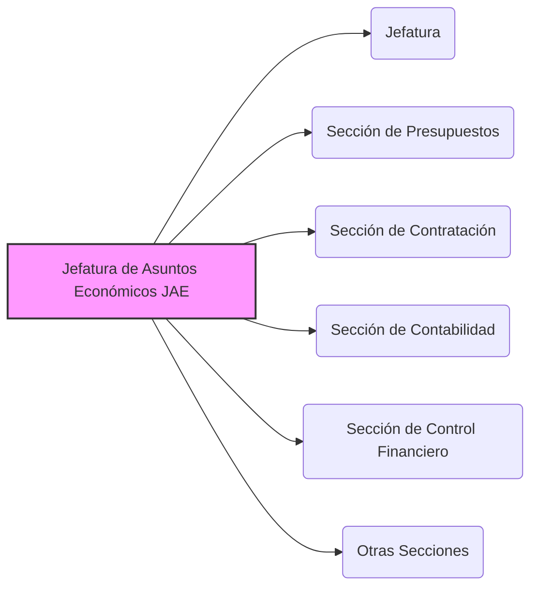

---
{"dg-publish":true,"permalink":"/z-notas/notas-bloque-1/notas-tema-6-emad/jae/"}
---

# Jefatura de Asuntos Económicos (JAE)

La **Jefatura de Asuntos Económicos (JAE)** es un **componente fundamental del [[Z. Notas/Notas Bloque 1/Notas Tema 6. EMAD/CGEMAD\|Cuartel General del Estado Mayor de la Defensa]]**, y se define en el [[Artículo 6. La Jefatura de Asuntos Económicos\|Artículo 6]] de la [[Orden DEF/710/2020, de 27 de julio\|Orden DEF/710/2020]].

**Rol y Función Principal de la JAE:**

La función principal de la JAE es la **dirección, gestión y administración de los *recursos financieros* bajo la dependencia del [[Z. Notas/Notas Bloque 1/Notas Tema 6. EMAD/JEMAD\|Jefe de Estado Mayor de la Defensa]]**.  Actúa como el **órgano central responsable de la gestión económica y presupuestaria** del [[Z. Notas/Notas Bloque 1/Notas Tema 6. EMAD/EMAD\|EMAD]],  asegurando la correcta administración de los fondos y el cumplimiento de la normativa económico-financiera.

En esencia, la JAE es responsable de **garantizar la *sostenibilidad financiera* de las actividades del EMAD**,  proporcionando el apoyo económico necesario para el funcionamiento del Estado Mayor y el desarrollo de sus misiones.

**Responsabilidades Clave de la JAE (según el Artículo 6 de la Orden DEF/710/2020):**

*   **Dirección, Gestión y Administración de Recursos Financieros:**  Responsable de la **dirección, gestión y administración** de todos los recursos financieros asignados al [[Z. Notas/Notas Bloque 1/Notas Tema 6. EMAD/JEMAD\|JEMAD]] y al [[Z. Notas/Notas Bloque 1/Notas Tema 6. EMAD/EMAD\|EMAD]].
*   **Asesoramiento Económico al JEMAD:**  **Asesora al JEMAD en materia económica y financiera**,  proporcionando información y análisis para la toma de decisiones en este ámbito.
*   **Asuntos Presupuestarios:**  Responsable de los **asuntos presupuestarios**,  incluyendo la elaboración, ejecución y control del presupuesto del EMAD.
*   **Contratación:**  Gestiona los procesos de **contratación** necesarios para el funcionamiento del EMAD,  siguiendo la normativa de contratación pública.
*   **Contabilidad:**  Lleva la **contabilidad** de los fondos del EMAD,  registrando ingresos, gastos y operaciones financieras, y garantizando la transparencia y la rendición de cuentas.
*   **Elaboración del Anteproyecto de Presupuesto:**  Le corresponde la **elaboración técnica del anteproyecto de presupuesto** del EMAD,  coordinando con los diferentes órganos del Estado Mayor para recoger sus necesidades presupuestarias.
*   **Centralización de Información Presupuestaria:**  Centraliza **toda la información** relativa a la previsión y ejecución de los programas y del presupuesto del EMAD,  proporcionando una visión global de la situación financiera.

**Estructura de la JAE:**

La Orden DEF/710/2020 no detalla la estructura interna de la JAE más allá de mencionar la "Jefatura".  Podemos asumir que se articula internamente en diferentes secciones o áreas funcionales para abordar las diversas responsabilidades mencionadas (presupuestos, contratación, contabilidad, etc.).

**(Nota: Este organigrama es una representación simplificada y *no está detallado en la Orden DEF/710/2020*.  Es una interpretación lógica de las funciones de la JAE).**

**Dependencia Funcional:**

Es importante destacar que la JAE, aunque depende orgánicamente del [[Z. Notas/Notas Bloque 1/Notas Tema 6. EMAD/JEMAD\|JEMAD]],  tiene una **dependencia funcional de la Dirección General de Asuntos Económicos (DIGAECO)** del Ministerio de Defensa.  Esto asegura la **coordinación y homogeneidad** en la gestión económico-financiera en todo el ámbito del Ministerio de Defensa, y garantiza el cumplimiento de las directrices y normativas generales en esta materia.

**Importancia de la JAE:**

La JAE es **fundamental para la viabilidad y operatividad del [[Z. Notas/Notas Bloque 1/Notas Tema 6. EMAD/EMAD\|Estado Mayor de la Defensa]]**.  Una **gestión eficiente y transparente de los recursos financieros** es esencial para que el EMAD pueda cumplir sus funciones y para que las FAS dispongan de los medios económicos necesarios para llevar a cabo sus misiones.  La JAE es la **garante de la *responsabilidad financiera* y la *buena gestión* de los fondos** del EMAD,  contribuyendo a la **credibilidad y eficacia** del Estado Mayor.
