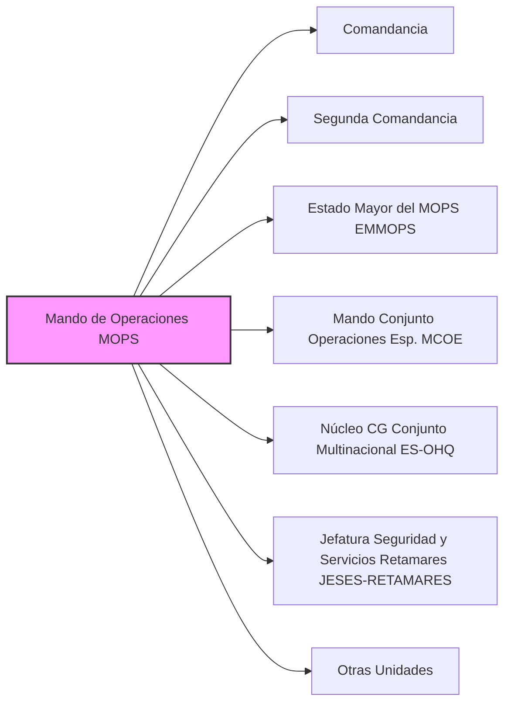

---
{"dg-publish":true,"permalink":"/z-notas/notas-bloque-1/notas-tema-6-emad/mops/"}
---

# Mando de Operaciones (MOPS)

El **Mando de Operaciones (MOPS)** es uno de los **componentes principales del [[Z. Notas/Notas Bloque 1/Notas Tema 6. EMAD/EMAD\|Estado Mayor de la Defensa]]**, y se define en el [[Artículo 7. El Mando de Operaciones\|Artículo 7]] de la [[Orden DEF/710/2020, de 27 de julio\|Orden DEF/710/2020]].

**Rol y Función Principal del MOPS:**

El MOPS es el **órgano central responsable de la *conducción de las operaciones militares*** de las Fuerzas Armadas (FAS) en el **nivel operacional**.  Su función principal es **planear, conducir, seguir y dirigir el sostenimiento de las operaciones militares** que se determinen por el [[Z. Notas/Notas Bloque 1/Notas Tema 6. EMAD/JEMAD\|Jefe de Estado Mayor de la Defensa]].

En esencia, el MOPS es el **brazo ejecutor del EMAD** en el ámbito de las operaciones,  transformando las directrices estratégicas del JEMAD en planes operativos concretos y supervisando su ejecución en tiempo real.  Es el **mando responsable de *llevar a cabo* las misiones militares.**

**Responsabilidades Clave del MOPS (según el Artículo 7 de la Orden DEF/710/2020):**

*   **Planeamiento Operativo:**  Elabora los **planes operativos** para las operaciones militares que se le encomienden.
*   **Conducción de Operaciones:**  **Dirige y conduce** las operaciones militares en curso, asegurando la coordinación de las fuerzas participantes.
*   **Seguimiento de Operaciones:**  **Monitoriza y evalúa** el desarrollo de las operaciones, realizando un seguimiento continuo de la situación y adaptando los planes según sea necesario.
*   **Dirección del Sostenimiento:**  Dirige y coordina el **sostenimiento logístico** de las operaciones militares, asegurando el suministro de recursos y el apoyo necesario a las fuerzas desplegadas.
*   **Asesoramiento Operacional al JEMAD:**  **Asesora al JEMAD** en la conducción estratégica de las operaciones desde un punto de vista **operacional**,  aportando su experiencia y conocimiento en la planificación y ejecución de misiones militares.
*   **Planeamiento y Conducción de Ejercicios:**  Realiza el **planeamiento y conducción de ejercicios militares** conjuntos que se determinen para mantener y mejorar la preparación operativa de las fuerzas.
*   **Directrices de Adiestramiento y Alistamiento:**  Elabora **directrices para el adiestramiento y alistamiento** de los mandos y fuerzas asignados a la estructura operativa, y supervisa su preparación.
*   **Evaluación de Disponibilidad Operativa:**  **Evalúa la disponibilidad operativa** de las fuerzas asignadas a la estructura operativa, contribuyendo a asegurar su eficacia.
*   **Gestión de Personal en Operaciones:**  Realiza la **gestión del recurso de personal** en las operaciones militares.

**Estructura del MOPS (Componentes Principales - Artículo 7.2):**

El MOPS se articula en los siguientes órganos principales:

*   Comandancia (liderada por el Comandante del MOPS - CMOPS)
*   Segunda Comandancia (liderada por el Segundo Comandante del MOPS, que es también el Jefe del EMMOPS)
*   [[Z. Notas/Notas Bloque 1/Notas Tema 6. EMAD/MOPS#EMMOPS\|Estado Mayor del Mando de Operaciones (EMMOPS)]]
*   [[Z. Notas/Notas Bloque 1/Notas Tema 6. EMAD/MOPS#MCOE\|Mando Conjunto de Operaciones Especiales (MCOE)]]
*   [[Z. Notas/Notas Bloque 1/Notas Tema 6. EMAD/MOPS#ES-OHQ\|Núcleo del Cuartel General Conjunto Multinacional (ES-OHQ)]]
*   [[Z. Notas/Notas Bloque 1/Notas Tema 6. EMAD/MOPS#JESES-RETAMARES\|Jefatura de Seguridad y Servicios (JESES-RETAMARES)]]
*   Otras unidades que se determinen.

**(Secciones detalladas más abajo)**

**Importancia del MOPS:**

El MOPS es **indispensable para la capacidad de proyección y respuesta de las FAS**.  Es el **componente operativo central** que permite al [[Z. Notas/Notas Bloque 1/Notas Tema 6. EMAD/JEMAD\|JEMAD]] traducir la estrategia de defensa en acciones militares concretas y efectivas.  Sin un MOPS eficaz, las FAS no podrían llevar a cabo las operaciones militares necesarias para la defensa de España y sus intereses.  Es el **motor operativo** del EMAD y de la estructura de mando conjunta.

**Referencia Legal Principal:**

*   [[Orden DEF/710/2020, de 27 de julio\|Orden DEF/710/2020]], Artículo 7 (El Mando de Operaciones)
*   [[Real Decreto 521/2020, de 19 de mayo\|Real Decreto 521/2020, de 19 de mayo]] (marco general de la organización de las Fuerzas Armadas)

---

### Componentes Principales del MOPS (Detalle):

#### Estado Mayor del Mando de Operaciones (EMMOPS) [[Z. Notas/Notas Bloque 1/Notas Tema 6. EMAD/MOPS#EMMOPS\|#EMMOPS]]

*   **Principal órgano auxiliar de mando** del Comandante del MOPS (CMOPS).
*   Responsable de la planificación, coordinación y control general de las actividades relacionadas con el planeamiento, seguimiento y conducción de las operaciones en el **nivel operacional**.
*   Se articula en un **Área de Operaciones (AOPS)** y un **Área de Apoyos (AAPO)**.

#### Mando Conjunto de Operaciones Especiales (MCOE) [[Z. Notas/Notas Bloque 1/Notas Tema 6. EMAD/MOPS#MCOE\|#MCOE]]

*   Responsable del planeamiento, conducción y seguimiento de las **operaciones especiales** que se determinen.
*   Facilita la integración e interoperabilidad de las capacidades de operaciones especiales.
*   Puede constituir la base de un **Mando Componente de Operaciones Especiales**.

#### Núcleo del Cuartel General Conjunto Multinacional (ES-OHQ) [[Z. Notas/Notas Bloque 1/Notas Tema 6. EMAD/MOPS#ES-OHQ\|#ES-OHQ]]

*   Responsable de facilitar el proceso de **activación rápida y flexible** del Cuartel General Conjunto Multinacional (ES-OHQ).

#### Jefatura de Seguridad y Servicios (JESES-RETAMARES) [[Z. Notas/Notas Bloque 1/Notas Tema 6. EMAD/MOPS#JESES-RETAMARES\|#JESES-RETAMARES]]

*   Responsable del **mantenimiento de las instalaciones de la Base de Retamares**,  apoyando en materia de vida y funcionamiento a la base y a las unidades allí ubicadas.
*   Organiza y dirige la **seguridad** de la Base de Retamares y su personal.
*   Gestiona asuntos **medioambientales, eficiencia energética y prevención de riesgos laborales** en la Base de Retamares.
