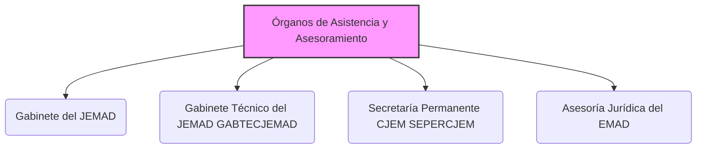

---
{"dg-publish":true,"permalink":"/z-notas/notas-bloque-1/notas-tema-6-emad/organos-de-asistencia-y-asesoramiento/"}
---

# Órganos de Asistencia y Asesoramiento del EMAD

Los **Órganos de Asistencia y Asesoramiento** son un conjunto de **unidades que dependen directamente del [[Z. Notas/Notas Bloque 1/Notas Tema 6. EMAD/JEMAD\|Jefe de Estado Mayor de la Defensa]]** dentro del [[Z. Notas/Notas Bloque 1/Notas Tema 6. EMAD/CGEMAD\|Cuartel General del Estado Mayor de la Defensa]].  Se enumeran y definen en el [[Artículo 5. Los Órganos de Asistencia y Asesoramiento\|Artículo 5]] de la [[Orden DEF/710/2020, de 27 de julio\|Orden DEF/710/2020]].

**Rol y Función Principal de los Órganos de Asistencia y Asesoramiento:**

La función principal de estos órganos es **proporcionar *asistencia, asesoramiento y apoyo directo e inmediato* al [[Z. Notas/Notas Bloque 1/Notas Tema 6. EMAD/JEMAD\|JEMAD]]** en el ejercicio de sus funciones y responsabilidades.  Actúan como **estructuras de apoyo *personal* y *especializado* para el JEMAD**,  facilitando su labor en diversas áreas clave.

En esencia, estos órganos son la **primera línea de apoyo al JEMAD**,  ayudándole en tareas de gabinete, asesoramiento técnico, gestión de consejos y reuniones, y asesoramiento jurídico.  Son **instrumentos directos del liderazgo y la autoridad del JEMAD**.

**Órganos de Asistencia y Asesoramiento Enumerados en el Artículo 5 de la Orden DEF/710/2020:**

La Orden DEF/710/2020 identifica los siguientes Órganos de Asistencia y Asesoramiento:

*   [[Z. Notas/Notas Bloque 1/Notas Tema 6. EMAD/Órganos de Asistencia y Asesoramiento#Gabinete-del-JEMAD\|Gabinete del JEMAD]]
*   [[Z. Notas/Notas Bloque 1/Notas Tema 6. EMAD/Órganos de Asistencia y Asesoramiento#GABTECJEMAD\|Gabinete Técnico del JEMAD (GABTECJEMAD)]]
*   [[Z. Notas/Notas Bloque 1/Notas Tema 6. EMAD/Órganos de Asistencia y Asesoramiento#SEPERCJEM\|Secretaría Permanente del Consejo de Jefes de Estado Mayor (SEPERCJEM)]]
*   [[Z. Notas/Notas Bloque 1/Notas Tema 6. EMAD/Órganos de Asistencia y Asesoramiento#Asesoría-Jurídica-del-EMAD\|Asesoría Jurídica del EMAD]]

**(Organigrama simplificado de los Órganos de Asistencia y Asesoramiento)**

**Componentes Clave de los Órganos de Asistencia y Asesoramiento (Descripción Breve):**

*   **[[Z. Notas/Notas Bloque 1/Notas Tema 6. EMAD/Órganos de Asistencia y Asesoramiento#Gabinete-del-JEMAD\|Gabinete del JEMAD]]:**  Órgano de **apoyo, asesoramiento y asistencia *inmediata* al JEMAD**.  Tiene nivel orgánico de subdirección general.  Es la estructura de **apoyo *más directa* y *personal* al JEMAD**.
*   **[[Z. Notas/Notas Bloque 1/Notas Tema 6. EMAD/Órganos de Asistencia y Asesoramiento#GABTECJEMAD\|Gabinete Técnico del JEMAD (GABTECJEMAD)]]:**  Responsable de la **dirección y control de la política de información pública** del [[Z. Notas/Notas Bloque 1/Notas Tema 6. EMAD/EMAD\|EMAD]].  También se encarga del **planeamiento, coordinación y ejecución de las actividades públicas y protocolarias del JEMAD**, y de sus relaciones institucionales.  Gestiona la **imagen pública y las relaciones externas** del JEMAD y del EMAD.
*   **[[Z. Notas/Notas Bloque 1/Notas Tema 6. EMAD/Órganos de Asistencia y Asesoramiento#SEPERCJEM\|Secretaría Permanente del Consejo de Jefes de Estado Mayor (SEPERCJEM)]]:**  Actúa como **órgano administrativo del Consejo de Jefes de Estado Mayor (CJEM)** y de otros consejos y reuniones que el JEMAD le encomiende.  Proporciona **apoyo administrativo y técnico** para el funcionamiento de estos órganos colegiados.
*   **[[Z. Notas/Notas Bloque 1/Notas Tema 6. EMAD/Órganos de Asistencia y Asesoramiento#Asesoría-Jurídica-del-EMAD\|Asesoría Jurídica del EMAD]]:**  Es el **órgano consultivo y asesor, *único en materia jurídica*, del JEMAD** y de aquellos otros órganos que éste determine.  Proporciona **asesoramiento legal especializado** y vela por la **legalidad** de las actuaciones del EMAD.  Depende funcionalmente de la Asesoría Jurídica General de la Defensa.

**Importancia de los Órganos de Asistencia y Asesoramiento:**

Estos órganos son **esenciales para el *eficaz desempeño* de las funciones del [[Z. Notas/Notas Bloque 1/Notas Tema 6. EMAD/JEMAD\|JEMAD]]**.  Le proporcionan el **apoyo especializado y personalizado** que necesita para:

*   **Tomar decisiones informadas:**  Recibir asesoramiento técnico, jurídico y de gabinete para fundamentar sus decisiones.
*   **Gestionar la información pública y las relaciones institucionales:**  Proyectar una imagen pública adecuada del EMAD y del JEMAD y mantener relaciones institucionales efectivas.
*   **Dirigir y coordinar el Consejo de Jefes de Estado Mayor:**  Contar con una secretaría permanente para el funcionamiento del órgano colegiado de asesoramiento militar.
*   **Asegurar la legalidad de las actuaciones:**  Disponer de asesoramiento jurídico interno para garantizar el cumplimiento de la normativa.
*   **Centrarse en las funciones de mando y dirección:**  Delegar en estos órganos las tareas de apoyo y asesoramiento para poder concentrarse en las responsabilidades de liderazgo y toma de decisiones estratégicas y operativas.

---

### Componentes Principales de los Órganos de Asistencia y Asesoramiento (Detalle):

#### Gabinete del JEMAD [[Z. Notas/Notas Bloque 1/Notas Tema 6. EMAD/Órganos de Asistencia y Asesoramiento#Gabinete-del-JEMAD\|#Gabinete-del-JEMAD]]

*   Órgano de **apoyo, asesoramiento y asistencia *inmediata* al JEMAD**.
*   Nivel orgánico de subdirección general.
*   Estructura definida en el [[Real Decreto 139/2020, de 28 de enero\|Real Decreto 139/2020, de 28 de enero]].
*   Funciones típicas de un gabinete de alta dirección: gestión de agenda, filtro de información, preparación de reuniones, enlace con otras unidades, etc.

#### Gabinete Técnico del JEMAD (GABTECJEMAD) [[Z. Notas/Notas Bloque 1/Notas Tema 6. EMAD/Órganos de Asistencia y Asesoramiento#GABTECJEMAD\|#GABTECJEMAD]]

*   Responsable de la **política de información pública del EMAD**.
*   Planea, coordina y ejecuta las **actividades públicas y protocolarias del JEMAD**.
*   Gestiona las **relaciones institucionales** del JEMAD.
*   Apoyo técnico y administrativo a la [[Z. Notas/Notas Bloque 1/Notas Tema 6. EMAD/Órganos de Asistencia y Asesoramiento#SEPERCJEM\|SEPERCJEM]].

#### Secretaría Permanente del Consejo de Jefes de Estado Mayor (SEPERCJEM) [[Z. Notas/Notas Bloque 1/Notas Tema 6. EMAD/Órganos de Asistencia y Asesoramiento#SEPERCJEM\|#SEPERCJEM]]

*   **Órgano administrativo del Consejo de Jefes de Estado Mayor (CJEM)** y otros consejos/reuniones que el [[Z. Notas/Notas Bloque 1/Notas Tema 6. EMAD/JEMAD\|JEMAD]] determine.
*   El Jefe de la SEPERCJEM es nombrado por el Ministerio de Defensa a propuesta del JEMAD.
*   Recibe apoyo técnico y administrativo del [[Z. Notas/Notas Bloque 1/Notas Tema 6. EMAD/Órganos de Asistencia y Asesoramiento#GABTECJEMAD\|GABTECJEMAD]].

#### Asesoría Jurídica del EMAD [[Z. Notas/Notas Bloque 1/Notas Tema 6. EMAD/Órganos de Asistencia y Asesoramiento#Asesoría-Jurídica-del-EMAD\|#Asesoría-Jurídica-del-EMAD]]

*   **Órgano consultivo y asesor *único* en materia jurídica** del [[Z. Notas/Notas Bloque 1/Notas Tema 6. EMAD/JEMAD\|JEMAD]] y otros órganos que éste determine.
*   Depende orgánicamente del JEMAD y funcionalmente de la Asesoría Jurídica General de la Defensa.
*   Funciones típicas de una asesoría jurídica: emisión de informes jurídicos, asesoramiento legal, elaboración de normativa, etc.
