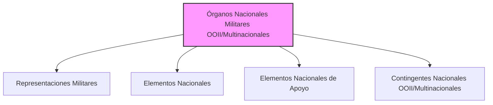

---
{"dg-publish":true,"permalink":"/z-notas/notas-bloque-1/notas-tema-6-emad/organos-nacionales-militares-relacionados-con-organizaciones-internacionales-o-multinacionales/"}
---

# Órganos Nacionales Militares Relacionados con Organizaciones Internacionales o Multinacionales

**Órganos Nacionales Militares Relacionados con Organizaciones Internacionales o Multinacionales** es una categoría específica de **unidades militares** que **dependen directamente del [[Z. Notas/Notas Bloque 1/Notas Tema 6. EMAD/JEMAD\|Jefe de Estado Mayor de la Defensa]]** y que tienen como cometido principal **representar e integrar a las Fuerzas Armadas (FAS) de España en el ámbito de las *organizaciones internacionales o multinacionales* de seguridad y defensa**.  Se definen y enumeran en el [[Artículo 12. Los órganos nacionales militares relacionados con organizaciones internacionales o multinacionales\|Artículo 12]] de la [[Orden DEF/710/2020, de 27 de julio\|Orden DEF/710/2020]].

**Rol y Función Principal de estos Órganos:**

La función principal de estos órganos es **garantizar la *presencia*, *representación* e *integración* de las FAS de España en el marco de las **Organizaciones Internacionales de Seguridad y Defensa (OISD)** y otras entidades multinacionales**.  Actúan como **enlaces y componentes nacionales** dentro de estas organizaciones,  asegurando que los intereses y las capacidades militares de España se tengan en cuenta y se coordinen en el ámbito internacional.

En esencia, estos órganos son la **interfaz *militar* de España con el mundo *multilateral* de la seguridad y la defensa**,  facilitando la **cooperación internacional**, la **participación en misiones y operaciones conjuntas**, y la **proyección de la influencia** de las FAS en el escenario global.

**Tipos de Órganos Nacionales Militares Relacionados con OOII/Multinacionales (Artículo 12.1):**

La Orden DEF/710/2020 distingue cuatro tipos principales de órganos nacionales militares relacionados con organizaciones internacionales o multinacionales:

*   [[Z. Notas/Notas Bloque 1/Notas Tema 6. EMAD/órganos nacionales militares relacionados con organizaciones internacionales o multinacionales#Representaciones-Militares\|Representaciones Militares]]
*   [[Z. Notas/Notas Bloque 1/Notas Tema 6. EMAD/órganos nacionales militares relacionados con organizaciones internacionales o multinacionales#Elementos-Nacionales\|Elementos Nacionales]]
*   [[Z. Notas/Notas Bloque 1/Notas Tema 6. EMAD/órganos nacionales militares relacionados con organizaciones internacionales o multinacionales#Elementos-Nacionales-de-Apoyo\|Elementos Nacionales de Apoyo]]
*   [[Z. Notas/Notas Bloque 1/Notas Tema 6. EMAD/órganos nacionales militares relacionados con organizaciones internacionales o multinacionales#Contingentes-Nacionales-Integrados-en-OOII/Multinacionales\|Contingentes Nacionales Integrados en OOII/Multinacionales]]

**(Organigrama simplificado de los tipos de Órganos Nacionales Militares relacionados con OOII/Multinacionales)**

**Componentes Clave de los Órganos Nacionales Militares OOII/Multinacionales (Descripción Breve):**

*   **[[Z. Notas/Notas Bloque 1/Notas Tema 6. EMAD/órganos nacionales militares relacionados con organizaciones internacionales o multinacionales#Representaciones-Militares\|Representaciones Militares]]:**  Son las **unidades *permanentes* de representación del [[Z. Notas/Notas Bloque 1/Notas Tema 6. EMAD/JEMAD\|JEMAD]] ante las OISD**,  ubicadas en las sedes de estas organizaciones.  Ejemplos: Representaciones Militares ante la OTAN y la UE.
*   **[[Z. Notas/Notas Bloque 1/Notas Tema 6. EMAD/órganos nacionales militares relacionados con organizaciones internacionales o multinacionales#Elementos-Nacionales\|Elementos Nacionales]]:**  Son los **componentes *nacionales* de organismos internacionales ubicados en *territorio nacional***.  Ejemplos: Elemento Nacional del CAOCTJ y del CoE C-IED.
*   **[[Z. Notas/Notas Bloque 1/Notas Tema 6. EMAD/órganos nacionales militares relacionados con organizaciones internacionales o multinacionales#Elementos-Nacionales-de-Apoyo\|Elementos Nacionales de Apoyo]]:**  Son organismos que proporcionan **apoyo *administrativo y general* al personal** destinado en unidades del ámbito internacional.  No se especifican ejemplos concretos en la Orden.
*   **[[Z. Notas/Notas Bloque 1/Notas Tema 6. EMAD/órganos nacionales militares relacionados con organizaciones internacionales o multinacionales#Contingentes-Nacionales-Integrados-en-OOII/Multinacionales\|Contingentes Nacionales Integrados en OOII/Multinacionales]]:**  Están constituidos por el **personal español dependiente del [[Z. Notas/Notas Bloque 1/Notas Tema 6. EMAD/JEMAD\|JEMAD]] destinado en organizaciones internacionales** en puestos internacionales o multinacionales **no específicos** de las representaciones militares o elementos nacionales.

**Importancia de estos Órganos:**

Estos órganos son **esenciales para la *inserción internacional* de las FAS y para la *contribución de España a la seguridad y defensa colectivas***.  A través de ellos, las FAS:

*   **Participan activamente en las estructuras de seguridad y defensa internacionales.**
*   **Contribuyen a la toma de decisiones y al planeamiento** en el marco de las OISD.
*   **Aportan capacidades y personal** a las misiones y operaciones multinacionales.
*   **Fomentan la cooperación y la interoperabilidad** con fuerzas armadas de otros países.
*   **Defienden los intereses de seguridad y defensa de España** en el ámbito internacional.
*   **Proyectan la imagen y la influencia de las FAS** en el escenario global.
